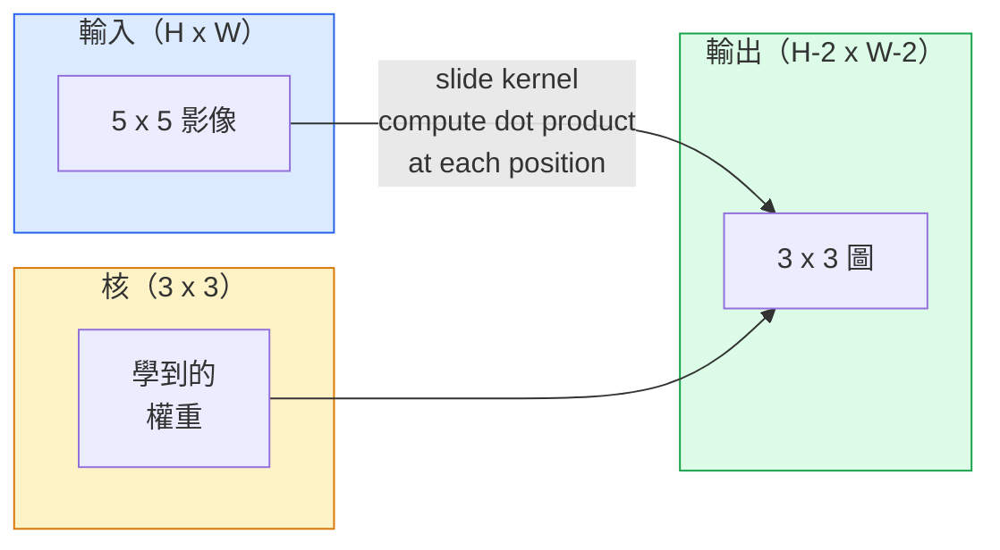
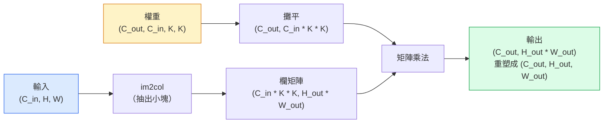

# 從零做卷積（convolution）

> 卷積是一個很小的稠密層（dense layer），你把它在影像上滑動，每個位置共用同一組權重（weight）。

**Type:** Build
**Languages:** Python
**Prerequisites:** Phase 3 (Deep Learning Core), Phase 4 Lesson 01 (Image Fundamentals)
**Time:** ~75 minutes

## Learning Objectives｜學習目標

- 只用 NumPy 從零實作二維卷積，包含巢狀迴圈版，以及向量化的 `im2col` 版
- 對任意輸入尺寸、核大小（kernel size）、填充（padding）和步幅（stride），算出輸出的空間大小，並說明 `(H - K + 2P) / S + 1` 為什麼成立
- 手動設計的卷積核，包括邊緣、模糊、銳化和 Sobel，並說明每一個為什麼產生那樣的活化模式
- 把卷積疊成特徵抽取器，並把堆疊的深度連到感受野（receptive field）的大小

## The Problem｜問題

224x224 的 RGB 影像如果接一個全連接層（fully connected layer），每個神經元（neuron）需要 224 * 224 * 3 = 150,528 個輸入權重。一個 1,000 單元的隱藏層（hidden layer）已經是 1.5 億個參數（parameter），這時你還沒學到任何有用的東西。更糟的是，那一層不知道左上角的狗和右下角的狗是同一個模式。它把每個像素（pixel）位置當成獨立的，對影像來說剛好是錯的：把貓平移三個像素，不該逼網路（network）重新學這個概念。

影像模型（model）需要的兩個性質是平移等變（translation equivariance），也就是輸出跟著輸入一起移，以及參數共享（parameter sharing），也就是同一個特徵（feature）偵測器到處跑。稠密層兩個都沒有。卷積免費給你兩個。

卷積不是為深度學習（deep learning）發明的。它就是驅動 JPEG 壓縮、Photoshop 的高斯模糊、工業視覺的邊緣偵測，以及做過的每一個音訊濾波器的同一個運算。CNN 從 2012 到 2020 主導 ImageNet，是因為對「鄰近的值有關係、同一個模式可以出現在任何地方」的資料，卷積是正確的先驗（prior）。

## The Concept｜核心概念

### 一個核，滑過去

二維卷積拿一小塊權重矩陣，叫做核（kernel），或濾波器（filter），在輸入上滑動，每個位置計算逐元素乘積的和。那個和變成一個輸出像素。



一個具體的 3x3 例子，放在 5x5 輸入上，沒有填充、步幅 1：

```
Input X (5 x 5):                Kernel W (3 x 3):

  1  2  0  1  2                   1  0 -1
  0  1  3  1  0                   2  0 -2
  2  1  0  2  1                   1  0 -1
  1  0  2  1  3
  2  1  1  0  1

The kernel slides across every valid 3 x 3 window. Output Y is 3 x 3:

 Y[0,0] = sum( W * X[0:3, 0:3] )
 Y[0,1] = sum( W * X[0:3, 1:4] )
 Y[0,2] = sum( W * X[0:3, 2:5] )
 Y[1,0] = sum( W * X[1:4, 0:3] )
 ... and so on
```

那一個公式，共享權重、局部性、滑動視窗，就是全部的想法。其餘都是細節。

### 輸出大小的公式

給定輸入的空間大小 `H`、核大小（kernel size） `K`、填充 `P`、步幅 `S`：

```
H_out = floor( (H - K + 2P) / S ) + 1
```

把它背下來。你每設計一次架構（architecture）都會算幾十次。

| 情境 | H | K | P | S | H_out |
|----------|---|---|---|---|-------|
| 有效卷積，沒有填充 | 32 | 3 | 0 | 1 | 30 |
| 相同卷積，維持尺寸 | 32 | 3 | 1 | 1 | 32 |
| 下採樣 2 倍 | 32 | 3 | 1 | 2 | 16 |
| 2x2 池化 | 32 | 2 | 0 | 2 | 16 |
| 大感受野 | 32 | 7 | 3 | 2 | 16 |

「相同填充」的意思是選一個 P，讓 S 為 1 時 H_out 等於 H。K 是奇數時，那就是 P = (K - 1) / 2。所以 3x3 核佔主流：它們是仍有中心的最小奇數核。

### 填充

沒有填充，每次卷積都讓特徵圖（feature map）縮小。疊 20 層，你的 224x224 影像變成 184x184。邊界浪費算力，而且殘差連接（residual connection）需要形狀對上時會變麻煩。

```
Zero padding (P = 1) on a 5 x 5 input:

  0  0  0  0  0  0  0
  0  1  2  0  1  2  0
  0  0  1  3  1  0  0
  0  2  1  0  2  1  0       Now the kernel can centre on pixel
  0  1  0  2  1  3  0       (0, 0) and still have three rows and
  0  2  1  1  0  1  0       three columns of values to multiply.
  0  0  0  0  0  0  0
```

實務上會碰到的模式：`zero` 最常見，`reflect` 把邊緣鏡射，生成模型裡用來避免硬邊界，`replicate` 複製邊緣，`circular` 繞回去，用在環面問題。

### 步幅

步幅是滑動的步長。`stride=1` 是預設。`stride=2` 把空間維度減半，是 CNN 裡不另加池化層就做下採樣的經典做法。每個現代架構，ResNet、ConvNeXt、MobileNet，都在某處用有步幅的卷積取代 max-pool。

```
Stride 1 on a 5 x 5 input, 3 x 3 kernel:

  starts: (0,0) (0,1) (0,2)        -> output row 0
          (1,0) (1,1) (1,2)        -> output row 1
          (2,0) (2,1) (2,2)        -> output row 2

  Output: 3 x 3

Stride 2 on the same input:

  starts: (0,0) (0,2)              -> output row 0
          (2,0) (2,2)              -> output row 1

  Output: 2 x 2
```

### 多個輸入通道

真實影像有三個通道（channel）。RGB 上的 3x3 卷積其實是一個 3x3x3 的體積：每個輸入通道一片 3x3。每個空間位置，你把三片都乘加起來，再加偏置（bias）。

```
Input:   (C_in,  H,  W)        3 x 5 x 5
Kernel:  (C_in,  K,  K)        3 x 3 x 3 (one kernel)
Output:  (1,     H', W')       2D map

For a layer that produces C_out output channels, you stack C_out kernels:

Weight:  (C_out, C_in, K, K)   e.g. 64 x 3 x 3 x 3
Output:  (C_out, H', W')       64 x 3 x 3

Parameter count: C_out * C_in * K * K + C_out   (the + C_out is biases)
```

最後那一行是你規劃模型時會算的。3 通道輸入上的 64 通道 3x3 卷積有 `64 * 3 * 3 * 3 + 64 = 1,792` 個參數。便宜。

### im2col 技巧

巢狀迴圈好讀，但慢。GPU 要的是大矩陣乘法。技巧是：把輸入每個感受野視窗攤成大矩陣的一欄，把核攤成一列，整段卷積就變成一次矩陣乘法。



每個正式環境的卷積實作都是這個的某種變體，再加上快取分塊的技巧：直接卷積、Winograd、大核用的 FFT 卷積。懂 im2col，你就懂這件事的核心。

### 感受野

單一 3x3 卷積看 9 個輸入像素。疊兩個 3x3 卷積，第二層的神經元看的是 5x5 的輸入像素。三個 3x3 是 7x7。一般來說：

```
RF after L stacked K x K convs (stride 1) = 1 + L * (K - 1)

With strides:   RF grows multiplicatively with stride along each layer.
```

「一路 3x3」能用，VGG、ResNet、ConvNeXt 都是，是因為兩個 3x3 看到的輸入面積和一個 5x5 一樣，但參數更少，中間還多一次非線性（nonlinearity）。

```figure
convolution-kernel
```

## Build It｜動手實作

### 步驟 1：把陣列填充起來

從最小的元件開始：一個函式，在 H x W 陣列四周補上 0。

```python
import numpy as np

def pad2d(x, p):
    if p == 0:
        return x
    h, w = x.shape[-2:]
    out = np.zeros(x.shape[:-2] + (h + 2 * p, w + 2 * p), dtype=x.dtype)
    out[..., p:p + h, p:p + w] = x
    return out

x = np.arange(9).reshape(3, 3)
print(x)
print()
print(pad2d(x, 1))
```

尾端軸的技巧 `x.shape[:-2]`，表示同一個函式不用改就能用在 `(H, W)`、`(C, H, W)` 或 `(N, C, H, W)` 上。

### 步驟 2：用巢狀迴圈做二維卷積

參考實作。慢，但沒有歧義。原則上 `torch.nn.functional.conv2d` 做的就是這件事。

```python
def conv2d_naive(x, w, b=None, stride=1, padding=0):
    c_in, h, w_in = x.shape
    c_out, c_in_w, kh, kw = w.shape
    assert c_in == c_in_w

    x_pad = pad2d(x, padding)
    h_out = (h + 2 * padding - kh) // stride + 1
    w_out = (w_in + 2 * padding - kw) // stride + 1

    out = np.zeros((c_out, h_out, w_out), dtype=np.float32)
    for oc in range(c_out):
        for i in range(h_out):
            for j in range(w_out):
                hs = i * stride
                ws = j * stride
                patch = x_pad[:, hs:hs + kh, ws:ws + kw]
                out[oc, i, j] = np.sum(patch * w[oc])
        if b is not None:
            out[oc] += b[oc]
    return out
```

四層巢狀迴圈：輸出通道、列、欄，再加上對 C_in、kh、kw 的隱含加總。這是你用來核對每個更快實作的參考結果。

### 步驟 3：用手動設計的卷積核驗證

做一個垂直的 Sobel 核，套到一張合成的階梯影像上，看垂直邊緣亮起來。

```python
def synthetic_step_image():
    img = np.zeros((1, 16, 16), dtype=np.float32)
    img[:, :, 8:] = 1.0
    return img

sobel_x = np.array([
    [[-1, 0, 1],
     [-2, 0, 2],
     [-1, 0, 1]]
], dtype=np.float32)[None]

x = synthetic_step_image()
y = conv2d_naive(x, sobel_x, padding=1)
print(y[0].round(1))
```

預期第 7 欄有很大的正值，那是從左到右亮度增加的地方，其他地方是 0。那一次列印就是你確認數學沒錯的檢查。

### 步驟 4：im2col

把輸入裡每個核大小（kernel size）的視窗變成矩陣的一欄。`C_in=3, K=3` 時，每一欄是 27 個數字。

```python
def im2col(x, kh, kw, stride=1, padding=0):
    c_in, h, w = x.shape
    x_pad = pad2d(x, padding)
    h_out = (h + 2 * padding - kh) // stride + 1
    w_out = (w + 2 * padding - kw) // stride + 1

    cols = np.zeros((c_in * kh * kw, h_out * w_out), dtype=x.dtype)
    col = 0
    for i in range(h_out):
        for j in range(w_out):
            hs = i * stride
            ws = j * stride
            patch = x_pad[:, hs:hs + kh, ws:ws + kw]
            cols[:, col] = patch.reshape(-1)
            col += 1
    return cols, h_out, w_out
```

它仍是 Python 迴圈，但重活會變成一次向量化的矩陣乘法。

### 步驟 5：用 im2col 加矩陣乘法做快速卷積

把四重迴圈換成一次矩陣乘法。

```python
def conv2d_im2col(x, w, b=None, stride=1, padding=0):
    c_out, c_in, kh, kw = w.shape
    cols, h_out, w_out = im2col(x, kh, kw, stride, padding)
    w_flat = w.reshape(c_out, -1)
    out = w_flat @ cols
    if b is not None:
        out += b[:, None]
    return out.reshape(c_out, h_out, w_out)
```

正確性檢查：兩個實作都跑，再比較。

```python
rng = np.random.default_rng(0)
x = rng.normal(0, 1, (3, 16, 16)).astype(np.float32)
w = rng.normal(0, 1, (8, 3, 3, 3)).astype(np.float32)
b = rng.normal(0, 1, (8,)).astype(np.float32)

y_naive = conv2d_naive(x, w, b, padding=1)
y_im2col = conv2d_im2col(x, w, b, padding=1)

print(f"max abs diff: {np.max(np.abs(y_naive - y_im2col)):.2e}")
```

`max abs diff` 應該大約是 `1e-5`。差的是浮點數累加的順序，不是 bug。

### 步驟 6：一組手動設計的卷積核

五個濾波器，顯示單一層卷積在任何訓練之前能表達什麼。

```python
KERNELS = {
    "identity": np.array([[0, 0, 0], [0, 1, 0], [0, 0, 0]], dtype=np.float32),
    "blur_3x3": np.ones((3, 3), dtype=np.float32) / 9.0,
    "sharpen": np.array([[0, -1, 0], [-1, 5, -1], [0, -1, 0]], dtype=np.float32),
    "sobel_x": np.array([[-1, 0, 1], [-2, 0, 2], [-1, 0, 1]], dtype=np.float32),
    "sobel_y": np.array([[-1, -2, -1], [0, 0, 0], [1, 2, 1]], dtype=np.float32),
}

def apply_kernel(img2d, kernel):
    x = img2d[None].astype(np.float32)
    w = kernel[None, None]
    return conv2d_im2col(x, w, padding=1)[0]
```

套到任何灰階影像上，模糊會變柔，銳化會把邊緣變銳，Sobel-x 讓垂直邊緣亮起來，Sobel-y 讓水平邊緣亮起來。這些正是 AlexNet 和 VGG 訓練後、第一層卷積最後學到的模式。因為不管後面是什麼任務，好的影像模型都需要邊緣和斑點偵測器。

## Use It｜實際應用

PyTorch 的 `nn.Conv2d` 用自動微分（automatic differentiation）、CUDA 核和 cuDNN 最佳化，包起同一個運算。形狀語意相同。

```python
import torch
import torch.nn as nn

conv = nn.Conv2d(in_channels=3, out_channels=64, kernel_size=3, stride=1, padding=1)
print(conv)
print(f"weight shape: {tuple(conv.weight.shape)}   # (C_out, C_in, K, K)")
print(f"bias shape:   {tuple(conv.bias.shape)}")
print(f"param count:  {sum(p.numel() for p in conv.parameters())}")

x = torch.randn(8, 3, 224, 224)
y = conv(x)
print(f"\ninput  shape: {tuple(x.shape)}")
print(f"output shape: {tuple(y.shape)}")
```

把 `padding=1` 換成 `padding=0`，輸出掉到 222x222。把 `stride=1` 換成 `stride=2`，掉到 112x112。就是你上面背的那個公式。

## Ship It｜交付成果

本課會產出：

- `outputs/prompt-cnn-architect.md`：一份 prompt，給定輸入大小、參數預算和目標感受野，設計一疊 `Conv2d` 層，每一步的 K、S、P 都對
- `outputs/skill-conv-shape-calculator.md`：一項技能，逐層走一份網路規格，回傳每個區塊的輸出形狀、感受野和參數數量

## Exercises｜練習

1. **（簡單）** 給定 128x128 的灰階輸入，以及一疊 `[Conv3x3(s=1,p=1), Conv3x3(s=2,p=1), Conv3x3(s=1,p=1), Conv3x3(s=2,p=1)]`。用手算出每一層的輸出空間大小和感受野。再用 PyTorch 的 `nn.Sequential` 放幾個假的卷積來驗證。
2. **（中等）** 擴充 `conv2d_naive` 和 `conv2d_im2col`，讓它們接受 `groups` 引數。示範 `groups=C_in=C_out` 會重現深度卷積（depthwise convolution），而且參數數量是 `C * K * K`，不是 `C * C * K * K`。
3. **（困難）** 用手實作 `conv2d_im2col` 的反向傳遞（backward pass）：給定輸出的梯度（gradient），算出 `x` 和 `w` 的梯度。用同樣的輸入和權重，對 `torch.autograd.grad` 驗證。技巧是：im2col 的梯度是 `col2im`，而且重疊的視窗必須累加。

## Key Terms｜關鍵術語

| 術語 | 常見說法 | 實際意義 |
|------|----------------|----------------------|
| 卷積 | 「把濾波器滑過去」 | 在每個空間位置做可學習的點積，權重共用。數學上是互相關，但大家都叫它卷積 |
| 核／濾波器 | 「那個特徵偵測器」 | 形狀為 (C_in, K, K) 的小權重張量。它和輸入的一個視窗做點積，產生一個輸出像素 |
| 步幅 | 「你跳多遠」 | 連續兩次放核之間的步長。步幅 2 把每個空間維度減半 |
| 填充 | 「邊緣上的 0」 | 加在輸入四周的額外值，讓核能以邊界像素為中心。`same` 填充讓輸出大小等於輸入大小 |
| 感受野 | 「神經元看到多少」 | 某個輸出活化值所依賴的原始輸入區塊。它隨深度和步幅變大 |
| im2col | 「GEMM 的技巧」 | 把每個感受野視窗排成欄，卷積就變成一次大矩陣乘法。這是每個快速卷積實作的核心 |
| 深度卷積 | 「一個通道一個核」 | `groups == C_in` 的卷積。每個輸出通道只從對應的輸入通道計算。MobileNet 和 ConvNeXt 的骨幹 |
| 平移等變 | 「移進去，移出來」 | 輸入平移 k 個像素，輸出也平移 k 個像素。權重共用就免費得到 |

## Further Reading｜延伸閱讀

- [A guide to convolution arithmetic for deep learning (Dumoulin & Visin, 2016)](https://arxiv.org/abs/1603.07285) ——填充、步幅、膨脹的權威圖解，每門課都在悄悄抄它
- [CS231n: Convolutional Neural Networks for Visual Recognition](https://cs231n.github.io/convolutional-networks/) ——標準的講義，含原始的 im2col 說明
- [The Annotated ConvNet (fast.ai)](https://nbviewer.org/github/fastai/fastbook/blob/master/13_convolutions.ipynb) ——從手做卷積走到訓練好的數字分類器的 notebook
- [Receptive Field Arithmetic for CNNs (Dang Ha The Hien)](https://distill.pub/2019/computing-receptive-fields/) ——感受野計算的互動說明，品質像論文
