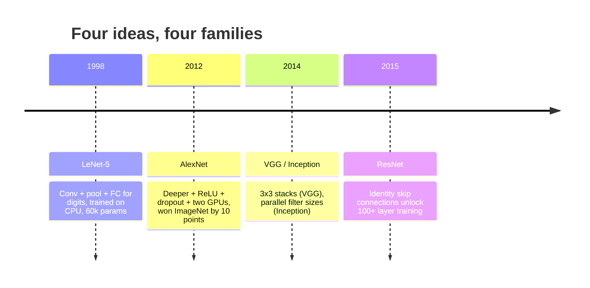
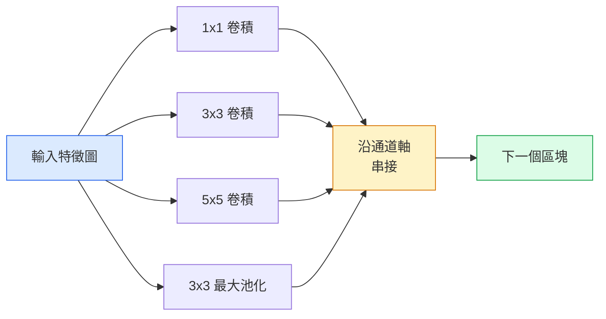
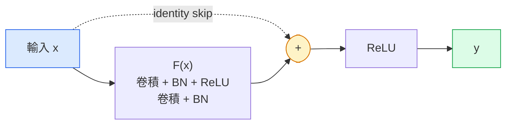

# CNN：從 LeNet 到 ResNet

> 近三十年每一個主要的 CNN，都是同一套卷積、非線性（nonlinearity）、下採樣（downsampling）的配方，再多釘上一個新想法。依序把這些想法學起來。

**Type:** Learn + Build
**Languages:** Python
**Prerequisites:** Phase 3 Lesson 11 (PyTorch), Phase 4 Lesson 01 (Image Fundamentals), Phase 4 Lesson 02 (Convolutions from Scratch)
**Time:** ~75 minutes

## Learning Objectives｜學習目標

- 沿著 LeNet-5、AlexNet、VGG、Inception、ResNet 這條架構譜系走，說出每一族多出來的那一個想法
- 用 PyTorch 實作 LeNet-5、VGG 風格的區塊，以及 ResNet 的 BasicBlock，每一個都在 40 行以內
- 說明為什麼殘差連接（residual connection）能把 1,000 層的網路從訓不動變成當時最好
- 讀一個現代骨幹（backbone），例如 ResNet-18、ResNet-50，在看原始碼之前先預測輸出形狀、感受野（receptive field）和參數（parameter）數量

## The Problem｜問題

2011 年，最好的 ImageNet 分類器 top-5 準確率大約 74%。2012 年 AlexNet 是 85%。2015 年 ResNet 是 96%。沒有新資料。沒有新一代 GPU。增益來自架構（architecture）的想法。能做事的視覺工程師得知道哪個想法來自哪篇論文，因為你在 2026 年送出去的每一個正式環境骨幹，都是那些零件的重組。而且這些想法一直被搬到別處：分組卷積（grouped convolution）從 CNN 走到 transformer，殘差連接從 ResNet 走到現存的每一個 LLM，擴散模型裡也有批次正規化（batch normalization）。

依序讀這些網路（network），也能讓你免於一個常見錯誤：問題用 LeNet 大小的網路就解得了，你卻去拿最大的模型（model）。MNIST 不需要 ResNet。知道每一族的縮放曲線，你才知道該坐在曲線的哪裡。

## The Concept｜核心概念

### 改變視覺的四個想法



傳統視覺裡，沒有別的東西比這四次跳躍更要緊。

### LeNet-5（1998）

Yann LeCun 的數字辨識器。60,000 個參數。兩個卷積加池化的區塊、兩個全連接層（fully connected layer）、tanh 活化函數（activation function）。它定義了每個 CNN 繼承的模板：

```
input (1, 32, 32)
  conv 5x5 -> (6, 28, 28)
  avg pool 2x2 -> (6, 14, 14)
  conv 5x5 -> (16, 10, 10)
  avg pool 2x2 -> (16, 5, 5)
  flatten -> 400
  dense -> 120
  dense -> 84
  dense -> 10
```

現代世界叫 CNN 的東西，卷積和下採樣交替，再餵給一個小的分類頭（classifier head），就是層更多、通道（channel）更大、活化函數更好的 LeNet。

### AlexNet（2012）

三個改變合在一起，打破了 ImageNet：

1. **ReLU** 取代 tanh。梯度（gradient）不再消失。訓練快了六倍。
2. **Dropout** 放在全連接頭裡。正則化（regularization）變成一層，不是一個技巧。
3. **深度和寬度**。五層卷積、三層稠密層（dense layer）、6000 萬個參數，在兩張 GPU 上訓練，模型拆開分放。

論文的圖 2 仍把 GPU 拆分畫成兩條平行流。那個平行是硬體的權宜，不是架構上的洞見。但上面三個想法仍在你用的每一個模型裡。

### VGG（2014）

VGG 問：如果只用 3x3 卷積（convolution），而且做深，會怎樣？

```
stack:   conv 3x3 -> conv 3x3 -> pool 2x2
repeat:  16 or 19 conv layers
```

兩個 3x3 卷積看到的輸入面積和一個 5x5 一樣，但參數更少，2*9*C^2 = 18C^2 對上 25*C^2，中間還多一次 ReLU。VGG 把這個觀察做成整套架構。簡單，一種區塊類型重複使用，使它成為後面一切的參考點。

代價：1.38 億個參數，訓練慢，推論（inference）貴。

### Inception（2014，同一年）

Google 對「我該用多大的核（kernel）」的答案是：全部都用，平行放。



每一支專門做一件事。1x1 混合通道，3x3 看局部紋理，5x5 看更大的模式，池化提供平移不變的特徵（feature）。串接讓下一層自己挑有用的那一支。Inception v1 在每一支裡面用 1x1 卷積當瓶頸（bottleneck），把參數數量維持在合理範圍。

### 退化問題

到 2015 年，VGG-19 能用，VGG-32 不能。深度本來該有幫助，但大約過了 20 層，訓練損失（loss）和測試損失都變差。那不是過度擬合（overfitting）。那是最佳化器（optimizer）找不到有用的權重（weight），因為梯度穿過每一層時會乘著縮小。

```
Plain deep network:
  y = f_L( f_{L-1}( ... f_1(x) ... ) )

Gradient wrt early layer:
  dL/dW_1 = dL/dy * df_L/df_{L-1} * ... * df_2/df_1 * df_1/dW_1

Each multiplicative term has magnitude roughly (weight magnitude) * (activation gain).
Stack 100 of them with gains < 1 and the gradient is effectively zero.
```

VGG 在 19 層能用，是因為同時發表的批次正規化把活化值的尺度維持得好。但就算批次正規化，也救不了大約 30 層以後的深度。

### ResNet（2015）

He、Zhang、Ren、Sun 提出一個改動，把一切修好：

```
standard block:   y = F(x)
residual block:   y = F(x) + x
```

`+ x` 的意思是，這一層隨時可以選擇什麼都不做，只要把 `F(x)` 驅向 0。1,000 層的 ResNet 現在最多只會和 1 層網路一樣差，因為每個多出來的區塊都有一個平凡的逃生口。有了這個保證，最佳化器願意讓每個區塊稍微有用一點。稍微有用，疊 100 次，就是當時最好。



這個區塊有兩個到處出現的變體：

- **BasicBlock**，用在 ResNet-18、ResNet-34：兩個 3x3 卷積，跳躍連接（skip connection）繞過兩者。
- **Bottleneck**，用在 ResNet-50、-101、-152：1x1 把通道降下來，中間 3x3，1x1 再升回去，跳躍繞過這三個。通道數高的時候比較便宜。

跳躍要跨過下採樣、stride=2 時，恆等（identity）路徑改成 1x1、stride=2 的卷積，好讓形狀對上。

### 為什麼殘差在視覺之外也要緊

這個想法其實不是關於影像分類。它是把深網路從「把手指交叉，希望梯度活下來」，變成可靠、可擴展的工程工具。你下一階段會讀到的每一個 transformer，每個區塊裡都有完全相同的跳躍連接。沒有 ResNet，就沒有 GPT。

```figure
pooling
```

## Build It｜動手實作

### 步驟 1：LeNet-5

一個最小、忠實的 LeNet。tanh 活化函數，平均池化。對現代唯一的讓步是，下游我們用 `nn.CrossEntropyLoss`，而不是原本的高斯連接。

```python
import torch
import torch.nn as nn
import torch.nn.functional as F

class LeNet5(nn.Module):
    def __init__(self, num_classes=10):
        super().__init__()
        self.conv1 = nn.Conv2d(1, 6, kernel_size=5)
        self.conv2 = nn.Conv2d(6, 16, kernel_size=5)
        self.pool = nn.AvgPool2d(2)
        self.fc1 = nn.Linear(16 * 5 * 5, 120)
        self.fc2 = nn.Linear(120, 84)
        self.fc3 = nn.Linear(84, num_classes)

    def forward(self, x):
        x = self.pool(torch.tanh(self.conv1(x)))
        x = self.pool(torch.tanh(self.conv2(x)))
        x = torch.flatten(x, 1)
        x = torch.tanh(self.fc1(x))
        x = torch.tanh(self.fc2(x))
        return self.fc3(x)

net = LeNet5()
x = torch.randn(1, 1, 32, 32)
print(f"output: {net(x).shape}")
print(f"params: {sum(p.numel() for p in net.parameters()):,}")
```

預期輸出：`output: torch.Size([1, 10])`、`params: 61,706`。那就是開啟現代視覺的整個數字分類器。

### 步驟 2：一個 VGG 區塊

一個可重複使用的區塊：兩個 3x3 卷積、ReLU、批次正規化、最大池化。

```python
class VGGBlock(nn.Module):
    def __init__(self, in_c, out_c):
        super().__init__()
        self.conv1 = nn.Conv2d(in_c, out_c, kernel_size=3, padding=1)
        self.bn1 = nn.BatchNorm2d(out_c)
        self.conv2 = nn.Conv2d(out_c, out_c, kernel_size=3, padding=1)
        self.bn2 = nn.BatchNorm2d(out_c)
        self.pool = nn.MaxPool2d(2)

    def forward(self, x):
        x = F.relu(self.bn1(self.conv1(x)))
        x = F.relu(self.bn2(self.conv2(x)))
        return self.pool(x)

class MiniVGG(nn.Module):
    def __init__(self, num_classes=10):
        super().__init__()
        self.stack = nn.Sequential(
            VGGBlock(3, 32),
            VGGBlock(32, 64),
            VGGBlock(64, 128),
        )
        self.head = nn.Sequential(
            nn.AdaptiveAvgPool2d(1),
            nn.Flatten(),
            nn.Linear(128, num_classes),
        )

    def forward(self, x):
        return self.head(self.stack(x))

net = MiniVGG()
x = torch.randn(1, 3, 32, 32)
print(f"output: {net(x).shape}")
print(f"params: {sum(p.numel() for p in net.parameters()):,}")
```

三個 VGG 區塊，處理 CIFAR 大小的輸入，一個適應性池化，一個線性層。大約 29 萬個參數。對 CIFAR-10 綽綽有餘。

### 步驟 3：ResNet 的 BasicBlock

ResNet-18 和 ResNet-34 的核心積木。

```python
class BasicBlock(nn.Module):
    def __init__(self, in_c, out_c, stride=1):
        super().__init__()
        self.conv1 = nn.Conv2d(in_c, out_c, kernel_size=3, stride=stride, padding=1, bias=False)
        self.bn1 = nn.BatchNorm2d(out_c)
        self.conv2 = nn.Conv2d(out_c, out_c, kernel_size=3, stride=1, padding=1, bias=False)
        self.bn2 = nn.BatchNorm2d(out_c)
        if stride != 1 or in_c != out_c:
            self.shortcut = nn.Sequential(
                nn.Conv2d(in_c, out_c, kernel_size=1, stride=stride, bias=False),
                nn.BatchNorm2d(out_c),
            )
        else:
            self.shortcut = nn.Identity()

    def forward(self, x):
        out = F.relu(self.bn1(self.conv1(x)))
        out = self.bn2(self.conv2(out))
        out = out + self.shortcut(x)
        return F.relu(out)
```

卷積層上的 `bias=False` 是批次正規化的慣例。BN 的 beta 參數已經處理偏置（bias），再帶卷積的偏置是浪費。只有步幅或通道數改變時，`shortcut` 才需要真正的卷積。否則它是什麼都不做的恆等。

### 步驟 4：一個很小的 ResNet

把四組 BasicBlock 疊起來，得到一個能在 CIFAR 大小輸入上運作的 ResNet。

```python
class TinyResNet(nn.Module):
    def __init__(self, num_classes=10):
        super().__init__()
        self.stem = nn.Sequential(
            nn.Conv2d(3, 32, kernel_size=3, stride=1, padding=1, bias=False),
            nn.BatchNorm2d(32),
            nn.ReLU(inplace=True),
        )
        self.layer1 = self._make_group(32, 32, num_blocks=2, stride=1)
        self.layer2 = self._make_group(32, 64, num_blocks=2, stride=2)
        self.layer3 = self._make_group(64, 128, num_blocks=2, stride=2)
        self.layer4 = self._make_group(128, 256, num_blocks=2, stride=2)
        self.head = nn.Sequential(
            nn.AdaptiveAvgPool2d(1),
            nn.Flatten(),
            nn.Linear(256, num_classes),
        )

    def _make_group(self, in_c, out_c, num_blocks, stride):
        blocks = [BasicBlock(in_c, out_c, stride=stride)]
        for _ in range(num_blocks - 1):
            blocks.append(BasicBlock(out_c, out_c, stride=1))
        return nn.Sequential(*blocks)

    def forward(self, x):
        x = self.stem(x)
        x = self.layer1(x)
        x = self.layer2(x)
        x = self.layer3(x)
        x = self.layer4(x)
        return self.head(x)

net = TinyResNet()
x = torch.randn(1, 3, 32, 32)
print(f"output: {net(x).shape}")
print(f"params: {sum(p.numel() for p in net.parameters()):,}")
```

四組，每組兩個區塊。第 2、3、4 組開頭的步幅是 2。每次下採樣，通道數加倍。大約 280 萬個參數。這就是可以一路乾淨地放大到 ResNet-152 的標準配方。

### 步驟 5：比較用參數換特徵的效率

把同一個輸入送進三個網路，比較參數數量。

```python
def summary(name, net, x):
    y = net(x)
    params = sum(p.numel() for p in net.parameters())
    print(f"{name:12s}  input {tuple(x.shape)} -> output {tuple(y.shape)}  params {params:>10,}")

x = torch.randn(1, 3, 32, 32)
summary("LeNet5",     LeNet5(),       torch.randn(1, 1, 32, 32))
summary("MiniVGG",    MiniVGG(),      x)
summary("TinyResNet", TinyResNet(),   x)
```

三個模型、三個時代、參數數量差了三個數量級。CIFAR-10 準確率大約是：LeNet 60%、MiniVGG 89%、TinyResNet 訓練幾個 epoch（訓練週期）之後 93%。

## Use It｜實際應用

`torchvision.models` 給你上面這些的預訓練（pretrained）版本。各家族的呼叫簽名相同，這正是骨幹這個抽象的用意。

```python
from torchvision.models import resnet18, ResNet18_Weights, vgg16, VGG16_Weights

r18 = resnet18(weights=ResNet18_Weights.IMAGENET1K_V1)
r18.eval()

print(f"ResNet-18 params: {sum(p.numel() for p in r18.parameters()):,}")
print(r18.layer1[0])
print()

v16 = vgg16(weights=VGG16_Weights.IMAGENET1K_V1)
v16.eval()
print(f"VGG-16   params: {sum(p.numel() for p in v16.parameters()):,}")
```

ResNet-18 有 1170 萬個參數。VGG-16 有 1.38 億。ImageNet 的 top-1 準確率相近，69.8% 對 71.6%。殘差連接讓參數效率提高 12 倍。所以 ResNet 變體從 2016 主導到 2021 年 ViT 出現，而且在算力是限制的真實部署裡仍然主導。

遷移學習（transfer learning）的配方永遠一樣：載入預訓練權重，凍結骨幹，換掉分類頭。

```python
for p in r18.parameters():
    p.requires_grad = False
r18.fc = nn.Linear(r18.fc.in_features, 10)
```

三行。你現在有一個 10 類別的 CIFAR 分類器，繼承了 ImageNet 預訓練所學到的表示（representation）。

## Ship It｜交付成果

本課會產出：

- `outputs/prompt-backbone-selector.md`：一份 prompt，依任務、資料集（dataset）大小和算力預算，挑對的 CNN 家族，LeNet、VGG、ResNet、MobileNet 或 ConvNeXt
- `outputs/skill-residual-block-reviewer.md`：一項技能，讀一個 PyTorch 模組，標出跳躍連接的錯誤：步幅改變時少了捷徑、捷徑的活化順序、BN 相對加法的位置

## Exercises｜練習

1. **（簡單）** 用手逐層數 `TinyResNet` 的參數。和 `sum(p.numel() for p in net.parameters())` 比較。參數預算大部分花在哪裡：卷積、BN，還是分類頭？
2. **（中等）** 實作 Bottleneck 區塊，1x1、3x3、1x1，帶跳躍，用它做一個給 CIFAR 的 ResNet-50 風格網路。和 `TinyResNet` 比參數。
3. **（困難）** 從 `BasicBlock` 拿掉跳躍連接。在 CIFAR-10 上各訓練 10 個 epoch：34 個區塊的「普通」網路，和 34 個區塊的 ResNet。畫出兩者的訓練損失對 epoch。重現 He 等人圖 1 的結果：普通的深網路收斂（convergence）到比它較淺的對照更高的損失。

## Key Terms｜關鍵術語

| 術語 | 常見說法 | 實際意義 |
|------|----------------|----------------------|
| 骨幹 | 「那個模型」 | 一疊卷積區塊，產出餵給任務頭的特徵圖（feature map） |
| 殘差連接 | 「跳躍連接」 | `y = F(x) + x`。最佳化器只要把 F 設成 0 就能學到恆等，任意深度因而訓得動 |
| BasicBlock | 「兩個 3x3 卷積加一個跳躍」 | ResNet-18/34 的積木：卷積、BN、ReLU、卷積、BN、相加、ReLU |
| Bottleneck | 「1x1 下降、3x3、1x1 上升」 | ResNet-50/101/152 的區塊。3x3 跑在變窄的寬度上，通道數高時比較便宜 |
| 退化問題 | 「更深反而更差」 | 大約過了 20 層普通卷積，訓練誤差和測試誤差都上升。解法是殘差連接，不是更多資料 |
| 起始層（stem） | 「第一層」 | 一開始的卷積，把 3 通道輸入轉成基底的特徵寬度。ImageNet 通常是 7x7、步幅 2，CIFAR 通常是 3x3、步幅 1 |
| 頭 | 「那個分類器」 | 最後一個骨幹區塊之後的層：適應性池化、攤平、線性層 |
| 遷移學習 | 「預訓練權重」 | 載入在 ImageNet 上訓練過的骨幹，只 fine-tuning 你這個任務的分類頭 |

## Further Reading｜延伸閱讀

- [Deep Residual Learning for Image Recognition (He et al., 2015)](https://arxiv.org/abs/1512.03385) ——ResNet 論文。每一張圖都值得看
- [Very Deep Convolutional Networks (Simonyan & Zisserman, 2014)](https://arxiv.org/abs/1409.1556) ——VGG 論文。到現在仍是「為什麼用 3x3」最好的參考
- [ImageNet Classification with Deep CNNs (Krizhevsky et al., 2012)](https://papers.nips.cc/paper_files/paper/2012/hash/c399862d3b9d6b76c8436e924a68c45b-Abstract.html) ——AlexNet。結束手工特徵時代的那篇論文
- [Going Deeper with Convolutions (Szegedy et al., 2014)](https://arxiv.org/abs/1409.4842) ——Inception v1。平行濾波器的想法，視覺 transformer 裡仍看得到
