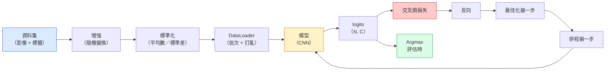

# 影像分類（image classification）

> 分類器是一個函式（function），把像素映到類別上的機率分布。其餘都是把管線接起來。

**Type:** Build
**Languages:** Python
**Prerequisites:** Phase 2 Lesson 09 (Model Evaluation), Phase 3 Lesson 10 (Mini Framework), Phase 4 Lesson 03 (CNNs)
**Time:** ~75 minutes

## Learning Objectives｜學習目標

- 在 CIFAR-10 上做一條從頭到尾的影像分類管線（pipeline）：資料集（dataset）、資料增強（data augmentation）、模型、訓練迴圈、評估
- 說明每個零件的角色，DataLoader、損失、最佳化器（optimizer）、學習率排程器、資料增強，並預測弄壞其中一個會在損失曲線上怎麼顯現
- 從零實作 mixup、cutout 和標籤平滑（label smoothing），並說明各自什麼時候值得加
- 讀混淆矩陣（confusion matrix）和逐類別的精確率（precision）／召回率（recall）表，診斷資料集和模型的失敗，而不只看總準確率

## The Problem｜問題

每一個會送出去的視覺任務，在某個層次上都歸結成影像分類。偵測在分類區域。分割在分類像素。檢索依和類別中心的相似度排序。把分類做對，包括資料集迴圈、增強策略、損失、評估，是這整個階段能搬到其他任務的技能。

大多數分類 bug 不在模型（model）裡。它們在管線裡：標準化（standardization）壞了、訓練集沒有打亂、增強把標籤扭曲了、驗證切分被訓練資料污染、學習率在第 30 個 epoch（訓練週期）之後悄悄發散。一個設定正確時能在 CIFAR-10 上到 93% 的 CNN，設定壞了常常只有 70–75%，而且損失曲線從頭到尾都看起來像那麼回事。

本課用手把整條管線接起來，每個部分都能檢查。你不會用 `torchvision.datasets` 裡任何可能把 bug 藏起來的東西。

## The Concept｜核心概念

### 分類管線



這個迴圈的每一條線都可能藏 bug。交叉熵（cross-entropy）吃的是原始 logits，不是 softmax 的輸出，所以損失之前任何 `model(x).softmax()` 都會悄悄算出錯誤的梯度（gradient）。增強只作用在輸入上，不作用在標籤上。mixup 是例外，它兩邊都混。`optimizer.zero_grad()` 每個步驟只能做一次。漏掉它，梯度會累積，看起來像學習率在亂跳。這些 bug 每一個都會把學習曲線壓平，卻不丟出錯誤。

### 交叉熵、logits 和 softmax

分類器對每張影像產出 `C` 個數字，叫做 logits。套上 softmax 就變成機率分布：

```
softmax(z)_i = exp(z_i) / sum_j exp(z_j)
```

交叉熵量的是正確類別的負對數機率：

```
CE(z, y) = -log( softmax(z)_y )
        = -z_y + log( sum_j exp(z_j) )
```

右邊那個形式在數值上穩定，叫做 log-sum-exp。PyTorch 的 `nn.CrossEntropyLoss` 把 softmax 和 NLL 合成一次運算，直接吃原始 logits。你自己先套 softmax，幾乎一定是 bug。你算出的是 log(softmax(softmax(z)))，一個沒有意義的量。

### 為什麼增強有用

CNN 對平移有歸納偏誤（inductive bias），來自權重共享，但對裁切、翻轉、色彩抖動或遮擋沒有內建的不變性。要教它這些不變性，唯一的辦法是給它看會用到這些變換的像素。訓練時每一個隨機變換都在說：這兩張影像標籤相同，去學那些忽略差異的特徵（feature）。

```
Original crop:  "dog facing left"
Flip:           "dog facing right"       <- same label, different pixels
Rotate(+15):    "dog, slight tilt"
Colour jitter:  "dog in warmer light"
RandomErasing:  "dog with patch missing"
```

規則是：增強必須保住標籤。在數字上做 cutout 和旋轉，可能把「6」轉成「9」。那種資料集要用較小的旋轉範圍，並挑選尊重數字特有不變性的增強。

### Mixup 和 cutmix

普通增強改像素，標籤維持 one-hot。**Mixup** 和 **cutmix** 打破這件事，兩邊都做內插。

```
Mixup:
  lambda ~ Beta(a, a)
  x = lambda * x_i + (1 - lambda) * x_j
  y = lambda * y_i + (1 - lambda) * y_j

Cutmix:
  paste a random rectangle of x_j into x_i
  y = area-weighted mix of y_i and y_j
```

它為什麼有幫助：模型不再死記尖銳的 one-hot 目標，改學類別之間的內插。訓練損失（loss）上升，測試準確率上升。這是任何分類器最便宜的一項穩健性升級。

### 標籤平滑

mixup 的親戚。不要對 `[0, 0, 1, 0, 0]` 訓練，改對 `[eps/C, eps/C, 1-eps, eps/C, eps/C]` 訓練，`eps` 很小，例如 0.1。這讓模型不再產出任意尖銳的 logits，幾乎不花代價就改善校準（calibration）。PyTorch 1.10 起，這件事內建在 `nn.CrossEntropyLoss(label_smoothing=0.1)`。

### 準確率以外的評估

總準確率藏不住不平衡。一個 90 比 10 的二元分類器如果永遠預測多數類，準確率是 90%。真正告訴你發生什麼事的工具是這些：

- **逐類別準確率**。每個類別一個數字，表現差的類別立刻浮出來。
- **混淆矩陣**。C 乘 C 的格子，第 i 列第 j 欄是真實類別 i 被預測成類別 j 的次數。對角線是對的，非對角線才是模型實際犯錯的地方。
- **Top-1／Top-5**。正確類別是否在前 1 或前 5 個預測裡。ImageNet 需要 Top-5，因為「Norwich terrier」和「Norfolk terrier」這種類別本來就模糊。
- **校準（ECE）**。信心 0.8 的預測，有 80% 的時候是對的嗎？現代網路（network）系統性地過度自信。用溫度縮放（temperature scaling）或標籤平滑來修。

```figure
receptive-field
```

## Build It｜動手實作

### 步驟 1：一個可重現的合成資料集

CIFAR-10 在磁碟上。為了讓本課可重現又快，我們做一個看起來像 CIFAR 的合成資料集：32x32 的 RGB 影像，帶有類別專屬的結構，模型必須把那個結構學起來。完全相同的管線，換上真正的 CIFAR-10 不用改。

```python
import numpy as np
import torch
from torch.utils.data import Dataset


def synthetic_cifar(num_per_class=1000, num_classes=10, seed=0):
    rng = np.random.default_rng(seed)
    X = []
    Y = []
    for c in range(num_classes):
        centre = rng.uniform(0, 1, (3,))
        freq = 2 + c
        for _ in range(num_per_class):
            yy, xx = np.meshgrid(np.linspace(0, 1, 32), np.linspace(0, 1, 32), indexing="ij")
            r = np.sin(xx * freq) * 0.5 + centre[0]
            g = np.cos(yy * freq) * 0.5 + centre[1]
            b = (xx + yy) * 0.5 * centre[2]
            img = np.stack([r, g, b], axis=-1)
            img += rng.normal(0, 0.08, img.shape)
            img = np.clip(img, 0, 1)
            X.append(img.astype(np.float32))
            Y.append(c)
    X = np.stack(X)
    Y = np.array(Y)
    idx = rng.permutation(len(X))
    return X[idx], Y[idx]


class ArrayDataset(Dataset):
    def __init__(self, X, Y, transform=None):
        self.X = X
        self.Y = Y
        self.transform = transform

    def __len__(self):
        return len(self.X)

    def __getitem__(self, i):
        img = self.X[i]
        if self.transform is not None:
            img = self.transform(img)
        img = torch.from_numpy(img).permute(2, 0, 1)
        return img, int(self.Y[i])
```

每個類別有自己的色彩盤和頻率模式，再加上高斯雜訊，逼模型學訊號，而不是死記像素。十個類別，各一千張影像，再打亂。

### 步驟 2：標準化與增強

每一條視覺管線都有的兩種變換。

```python
def standardize(mean, std):
    mean = np.array(mean, dtype=np.float32)
    std = np.array(std, dtype=np.float32)
    def _fn(img):
        return (img - mean) / std
    return _fn


def random_hflip(p=0.5):
    def _fn(img):
        if np.random.random() < p:
            return img[:, ::-1, :].copy()
        return img
    return _fn


def random_crop(pad=4):
    def _fn(img):
        h, w = img.shape[:2]
        padded = np.pad(img, ((pad, pad), (pad, pad), (0, 0)), mode="reflect")
        y = np.random.randint(0, 2 * pad)
        x = np.random.randint(0, 2 * pad)
        return padded[y:y + h, x:x + w, :]
    return _fn


def compose(*fns):
    def _fn(img):
        for fn in fns:
            img = fn(img)
        return img
    return _fn
```

裁切之前用反射填充，不要用零填充。黑邊本身是一種訊號，模型會學到以沒有幫助的方式去忽略它。

### 步驟 3：Mixup

在訓練步驟裡把兩張影像和兩個標籤混在一起。做成批次變換，所以它放在前向傳遞旁邊，而不是放進資料集。

```python
def mixup_batch(x, y, num_classes, alpha=0.2):
    if alpha <= 0:
        return x, torch.nn.functional.one_hot(y, num_classes).float()
    lam = float(np.random.beta(alpha, alpha))
    idx = torch.randperm(x.size(0), device=x.device)
    x_mixed = lam * x + (1 - lam) * x[idx]
    y_onehot = torch.nn.functional.one_hot(y, num_classes).float()
    y_mixed = lam * y_onehot + (1 - lam) * y_onehot[idx]
    return x_mixed, y_mixed


def soft_cross_entropy(logits, soft_targets):
    log_probs = torch.log_softmax(logits, dim=-1)
    return -(soft_targets * log_probs).sum(dim=-1).mean()
```

`soft_cross_entropy` 是對軟標籤分布算的交叉熵。目標恰好是 one-hot 時，它就退回平常的 one-hot 情況。

### 步驟 4：訓練迴圈

完整配方：資料走一遍，每個批次算一次梯度，每個 epoch 走一步排程器。

```python
import torch
import torch.nn as nn
from torch.utils.data import DataLoader
from torch.optim import SGD
from torch.optim.lr_scheduler import CosineAnnealingLR

def train_one_epoch(model, loader, optimizer, device, num_classes, use_mixup=True):
    model.train()
    total, correct, loss_sum = 0, 0, 0.0
    for x, y in loader:
        x, y = x.to(device), y.to(device)
        if use_mixup:
            x_m, y_soft = mixup_batch(x, y, num_classes)
            logits = model(x_m)
            loss = soft_cross_entropy(logits, y_soft)
        else:
            logits = model(x)
            loss = nn.functional.cross_entropy(logits, y, label_smoothing=0.1)
        optimizer.zero_grad()
        loss.backward()
        optimizer.step()
        loss_sum += loss.item() * x.size(0)
        total += x.size(0)
        # Training accuracy vs the un-mixed labels `y` is only an approximation
        # when mixup is on (the model saw soft targets, not y). Treat it as a
        # rough progress signal; rely on val accuracy for real performance.
        with torch.no_grad():
            pred = logits.argmax(dim=-1)
            correct += (pred == y).sum().item()
    return loss_sum / total, correct / total


@torch.no_grad()
def evaluate(model, loader, device, num_classes):
    model.eval()
    total, correct = 0, 0
    loss_sum = 0.0
    cm = torch.zeros(num_classes, num_classes, dtype=torch.long)
    for x, y in loader:
        x, y = x.to(device), y.to(device)
        logits = model(x)
        loss = nn.functional.cross_entropy(logits, y)
        pred = logits.argmax(dim=-1)
        for t, p in zip(y.cpu(), pred.cpu()):
            cm[t, p] += 1
        loss_sum += loss.item() * x.size(0)
        total += x.size(0)
        correct += (pred == y).sum().item()
    return loss_sum / total, correct / total, cm
```

每次寫訓練迴圈都要核對的五個不變條件：

1. 訓練前 `model.train()`，評估前 `model.eval()`。這會切換 dropout 和 batchnorm 的行為。
2. `.backward()` 之前先 `.zero_grad()`。
3. 累積指標時用 `.item()`，免得有東西把計算圖留著。
4. 評估時用 `@torch.no_grad()`。省記憶體和時間，也避免細微的意外。
5. 對原始 logits 做 argmax，不要對 softmax。結果相同，少一次運算。

### 步驟 5：接起來

用上一課的 `TinyResNet`，訓練幾個 epoch，再評估。

```python
from main import synthetic_cifar, ArrayDataset
from main import standardize, random_hflip, random_crop, compose
from main import mixup_batch, soft_cross_entropy
from main import train_one_epoch, evaluate
# TinyResNet comes from the previous lesson (03-cnns-lenet-to-resnet).
# Adjust the import path to wherever you stored the previous lesson's code.
from cnns_lenet_to_resnet import TinyResNet  # example placeholder

X, Y = synthetic_cifar(num_per_class=500)
split = int(0.9 * len(X))
X_train, Y_train = X[:split], Y[:split]
X_val, Y_val = X[split:], Y[split:]

mean = [0.5, 0.5, 0.5]
std = [0.25, 0.25, 0.25]
train_tf = compose(random_hflip(), random_crop(pad=4), standardize(mean, std))
eval_tf = standardize(mean, std)

train_ds = ArrayDataset(X_train, Y_train, transform=train_tf)
val_ds = ArrayDataset(X_val, Y_val, transform=eval_tf)

train_loader = DataLoader(train_ds, batch_size=128, shuffle=True, num_workers=0)
val_loader = DataLoader(val_ds, batch_size=256, shuffle=False, num_workers=0)

device = "cuda" if torch.cuda.is_available() else "cpu"
model = TinyResNet(num_classes=10).to(device)
optimizer = SGD(model.parameters(), lr=0.1, momentum=0.9, weight_decay=5e-4, nesterov=True)
scheduler = CosineAnnealingLR(optimizer, T_max=10)

for epoch in range(10):
    tr_loss, tr_acc = train_one_epoch(model, train_loader, optimizer, device, 10, use_mixup=True)
    va_loss, va_acc, _ = evaluate(model, val_loader, device, 10)
    scheduler.step()
    print(f"epoch {epoch:2d}  lr {scheduler.get_last_lr()[0]:.4f}  "
          f"train {tr_loss:.3f}/{tr_acc:.3f}  val {va_loss:.3f}/{va_acc:.3f}")
```

在這個合成資料集上，五個 epoch 內驗證準確率會接近完美。重點就在這裡：管線是對的，模型能學會那些學得會的東西。把資料集換成真正的 CIFAR-10，同一條迴圈不用改就能訓練到大約 90%。

### 步驟 6：讀混淆矩陣

準確率單獨永遠不會告訴你模型敗在哪裡。混淆矩陣會。

```python
def print_confusion(cm, labels=None):
    c = cm.shape[0]
    labels = labels or [str(i) for i in range(c)]
    print(f"{'':>6}" + "".join(f"{l:>5}" for l in labels))
    for i in range(c):
        row = cm[i].tolist()
        print(f"{labels[i]:>6}" + "".join(f"{v:>5}" for v in row))
    print()
    tp = cm.diag().float()
    fp = cm.sum(dim=0).float() - tp
    fn = cm.sum(dim=1).float() - tp
    prec = tp / (tp + fp).clamp_min(1)
    rec = tp / (tp + fn).clamp_min(1)
    f1 = 2 * prec * rec / (prec + rec).clamp_min(1e-9)
    for i in range(c):
        print(f"{labels[i]:>6}  prec {prec[i]:.3f}  rec {rec[i]:.3f}  f1 {f1[i]:.3f}")

_, _, cm = evaluate(model, val_loader, device, 10)
print_confusion(cm)
```

列是真實類別，欄是預測。類別 3 和 5 之間如果有一叢非對角線計數，表示模型把這兩個搞混。你就有一個起點，可以針對性地蒐集資料，或做只針對該類別的增強。

## Use It｜實際應用

`torchvision` 把上面這些包成慣用的零件。真正的 CIFAR-10，整條管線是四行再加一個訓練迴圈。

```python
from torchvision.datasets import CIFAR10
from torchvision.transforms import Compose, RandomCrop, RandomHorizontalFlip, ToTensor, Normalize

mean = (0.4914, 0.4822, 0.4465)
std = (0.2470, 0.2435, 0.2616)
train_tf = Compose([
    RandomCrop(32, padding=4, padding_mode="reflect"),
    RandomHorizontalFlip(),
    ToTensor(),
    Normalize(mean, std),
])
eval_tf = Compose([ToTensor(), Normalize(mean, std)])

train_ds = CIFAR10(root="./data", train=True,  download=True, transform=train_tf)
val_ds   = CIFAR10(root="./data", train=False, download=True, transform=eval_tf)
```

有兩件事要注意。平均數和標準差是資料集專屬的，在 CIFAR-10 訓練集上算，不是 ImageNet。反射填充是社群預設的裁切策略。把 ImageNet 的統計值貼過來，會漏掉大約 1% 準確率，在有人剖析模型之前沒人抓得到。

## Ship It｜交付成果

本課會產出：

- `outputs/prompt-classifier-pipeline-auditor.md`：一份 prompt，依上面五個不變條件審查訓練程式，並指出第一處違反
- `outputs/skill-classification-diagnostics.md`：一項技能，給定混淆矩陣和類別名稱清單，摘要逐類別的失敗，並提出影響最大的那一個修法

## Exercises｜練習

1. **（簡單）** 在合成資料集上，同一個模型有 mixup 和沒有 mixup 各訓練五個 epoch。畫出兩者的訓練損失和驗證損失。說明為什麼有 mixup 時訓練損失更高，驗證準確率卻差不多或更好。
2. **（中等）** 實作 Cutout，每張訓練影像隨機把一個 8x8 方塊清成 0。做消融：沒有增強、水平翻轉加裁切、水平翻轉加裁切再加 cutout、水平翻轉加裁切再加 mixup。回報每一種的驗證準確率。
3. **（困難）** 做一條 CIFAR-100 管線，100 個類別，輸入大小相同，把 ResNet-34 訓練到和公開準確率相差 1% 以內。加分項目：掃三個學習率和兩個權重衰減（weight decay），記到本地 CSV，產出最終那張最常混淆的表。

## Key Terms｜關鍵術語

| 術語 | 常見說法 | 實際意義 |
|------|----------------|----------------------|
| logits | 「原始輸出」 | softmax 之前的向量，每張影像 C 個數字。交叉熵要的是這些，不是做過 softmax 的值 |
| 交叉熵 | 「那個損失」 | 正確類別的負對數機率。把 log-softmax 和 NLL 合成一次穩定的運算 |
| DataLoader | 「那個分批器」 | 把資料集包上打亂、分批，以及可選的多個 worker 載入。訓練 bug 有一半會怪到它頭上 |
| 資料增強 | 「隨機變換」 | 訓練時任何保住標籤的像素級變換。教 CNN 它原生沒有的不變性 |
| Mixup／Cutmix | 「把兩張影像混在一起」 | 輸入和標籤都混合，分類器學平滑的內插，而不是硬邊界 |
| 標籤平滑 | 「比較軟的目標」 | 把 one-hot 換成 (1-eps, eps/(C-1), ...)。改善校準，準確率也略升 |
| Top-k 準確率 | 「Top-5」 | 正確類別落在機率最高的 k 個預測裡。用在類別本來就模糊的資料集 |
| 混淆矩陣 | 「錯誤住在哪裡」 | C 乘 C 的表，格子 (i, j) 數的是真實類別 i 被預測成 j 的影像數。對角線是對的，非對角線告訴你該修什麼 |

## Further Reading｜延伸閱讀

- [CS231n: Training Neural Networks](https://cs231n.github.io/neural-networks-3/) ——到現在仍是單頁裡把訓練管線講得最清楚的導覽
- [Bag of Tricks for Image Classification (He et al., 2019)](https://arxiv.org/abs/1812.01187) ——那些小技巧加起來，能讓 ResNet 在 ImageNet 上多 3–4% 準確率
- [mixup: Beyond Empirical Risk Minimization (Zhang et al., 2017)](https://arxiv.org/abs/1710.09412) ——原始的 mixup 論文。三頁理論，加上有說服力的實驗
- [Why temperature scaling matters (Guo et al., 2017)](https://arxiv.org/abs/1706.04599) ——證明現代網路校準不良，並用一個純量參數修好的那篇論文
