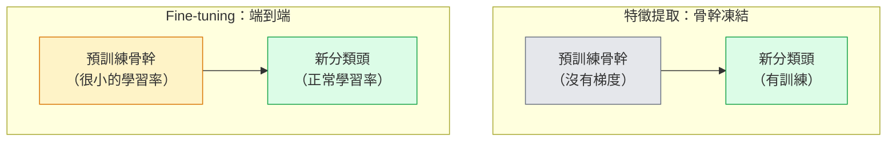

# 遷移學習（transfer learning）與 fine-tuning

> 別人已經花了一百萬個 GPU 小時，教一個網路邊緣、紋理和物體零件長什麼樣。你該先借那些特徵，再訓練自己的。

**Type:** Build
**Languages:** Python
**Prerequisites:** Phase 4 Lesson 03 (CNNs), Phase 4 Lesson 04 (Image Classification)
**Time:** ~75 minutes

## Learning Objectives｜學習目標

- 分辨特徵提取（feature extraction）和 fine-tuning，依資料集（dataset）大小、領域（domain）距離和算力預算選對的那個
- 載入預訓練骨幹（backbone），換掉分類頭，只訓練分類頭，在 20 行以內得到一個能用的基準模型（baseline）
- 用差別學習率（discriminative learning rate）逐步解凍層，讓早期的通用特徵比後期、任務專屬的特徵更新得更小
- 診斷三種常見失敗：解凍區塊的學習率太高造成特徵漂移、小資料集上 BN 統計崩掉、災難性遺忘（catastrophic forgetting）

## The Problem｜問題

在 ImageNet 上訓練一個 ResNet-50，大約要 2,000 個 GPU 小時。很少有團隊每送出一個任務都有那個預算。幾乎每個團隊實際送出去的，是一個預訓練骨幹，加上在幾百張或幾千張任務影像上訓練的新分類頭。

這不是抄近路。任何在 ImageNet 上訓練過的 CNN，第一個卷積區塊學的是邊緣和像 Gabor 的濾波器。接下來幾個區塊學紋理和簡單的圖案。中間的區塊學物體零件。最後的區塊學的組合，開始像那 1,000 個 ImageNet 類別。這個階層的前 90% 幾乎原樣搬到醫學影像、工業檢測、衛星資料，以及每一個別的視覺任務，因為自然界的邊緣和紋理詞彙有限。你真正要訓練的是最後那 10%。

遷移做對，有三個 bug 在等你。學習率太高，把預訓練特徵毀掉。凍結得太多，模型就拿不到資訊。BatchNorm 的滑動統計漂向一個很小的資料集，網路（network）其餘部分從來沒從那裡學過。本課故意把這三個都走一遍。

## The Concept｜核心概念

### 特徵提取與 fine-tuning

兩種做法。選哪一種，看你多信任預訓練特徵，以及你有多少資料。



經驗法則：

| 資料集大小 | 領域距離 | 配方 |
|--------------|-----------------|--------|
| 不到 1,000 張影像 | 接近 ImageNet | 凍結骨幹，只訓練分類頭 |
| 1,000–10,000 | 接近 | 凍結前 2 到 3 個 stage，其餘做 fine-tuning |
| 10,000–100,000 | 任何 | 用差別學習率做端到端 fine-tuning |
| 100,000 以上 | 遠 | 全部做 fine-tuning。領域夠遠，就考慮從零訓練 |

「接近 ImageNet」大約是指自然的 RGB 照片，內容像物體。醫學 CT、俯視的衛星影像、顯微鏡是遠領域。特徵仍然有幫助，但你得讓更多層去適應。

### 為什麼凍結根本行得通

CNN 在 ImageNet 上學到的特徵，不是專為那 1,000 個類別做的。它們對準的是自然影像的統計：特定方向的邊緣、紋理、對比模式、形狀基元。那些統計在人類叫得出名字的幾乎每個視覺領域都穩定。所以一個在 ImageNet 上訓練、只換一個新的線性分類頭、骨幹不做 fine-tuning、用零樣本（zero-shot）在 CIFAR-10 上評估的模型，準確率可以到 80% 以上。分類頭在學的是，已經學過的特徵裡，哪些要在這個任務上給較大的權重。

### 差別學習率

解凍的時候，早期層要比後期層訓練得慢。早期層編碼你想保住的通用特徵。後期層編碼你需要大幅移動的任務結構。

```
Typical recipe:

  stage 0 (stem + first group): lr = base_lr / 100    (mostly fixed)
  stage 1:                       lr = base_lr / 10
  stage 2:                       lr = base_lr / 3
  stage 3 (last backbone group): lr = base_lr
  head:                          lr = base_lr  (or slightly higher)
```

在 PyTorch 裡，這只是傳給最佳化器（optimizer）的一組參數群組。一個模型（model），五個學習率，不用額外的程式。

### BatchNorm 的問題

BN 層握著在 ImageNet 上算好的 `running_mean` 和 `running_var` 緩衝。如果你的任務像素分布不同，光線不同、感測器不同、色彩空間（color space）不同，那些緩衝就是錯的。依偏好順序有三個選項：

1. **fine-tuning 時讓 BN 留在 train 模式。** 讓 BN 和其他東西一起更新滑動統計。任務資料集中等大小、至少 5,000 筆時，這是預設選擇。
2. **把 BN 凍在 eval 模式。** 保住 ImageNet 的統計，只訓練權重（weight）。資料集小到 BN 的移動平均會很吵時，這樣才對。
3. **用 GroupNorm 換掉 BN。** 移動平均的問題整個拿掉。用在偵測和分割的骨幹，每張 GPU 的批次大小很小的時候。

弄錯了，準確率會悄悄掉 5–15%。

### 分類頭的設計

分類頭是 1 到 3 個線性層，可選 dropout。每個 torchvision 骨幹都帶一個預設分類頭，你要換掉：

```
backbone.fc = nn.Linear(backbone.fc.in_features, num_classes)          # ResNet
backbone.classifier[1] = nn.Linear(..., num_classes)                    # EfficientNet, MobileNet
backbone.heads.head = nn.Linear(..., num_classes)                       # torchvision ViT
```

資料集小的時候，一個線性層通常就夠。任務分布離骨幹的訓練分布較遠時，加一個隱藏層有幫助：Linear、ReLU、Dropout、再一個 Linear。

### 逐層學習率衰減

差別學習率的平滑版，用在現代的 fine-tuning，例如 BEiT、DINOv2、ViT-B 的 fine-tuning。不要把層分成 stage，而是讓每一層的學習率都比它上面那一層稍小：

```
lr_layer_k = base_lr * decay^(L - k)
```

decay 是 0.75、L 是 12 個 transformer 區塊時，第一個區塊的訓練學習率大約是分類頭的 `0.75^11 ≈ 0.04x`。這對 transformer 的 fine-tuning 比對 CNN 更要緊。CNN 通常用依 stage 分組的學習率就夠。

### 要評估什麼

遷移學習的實驗要記兩個從零訓練不會追的數字：

- **只有預訓練的準確率**。骨幹凍結時分類頭的準確率。這是你的地板。
- **fine-tuning 之後的準確率**。同一個模型做完端到端訓練之後。這是你的天花板。

如果 fine-tuning 之後比只有預訓練更差，你有學習率或 BN 的 bug。兩個都要印出來。

```figure
transfer-learning
```

## Build It｜動手實作

### 步驟 1：載入預訓練骨幹並查看

```python
import torch
import torch.nn as nn
from torchvision.models import resnet18, ResNet18_Weights

backbone = resnet18(weights=ResNet18_Weights.IMAGENET1K_V1)
print(backbone)
print()
print("classifier head:", backbone.fc)
print("feature dim:", backbone.fc.in_features)
```

`ResNet18` 有四個 stage，`layer1..layer4`，加上起始層和 `fc` 分類頭。每個 torchvision 分類骨幹都有類似的結構。

### 步驟 2：特徵提取，全部凍結，換掉分類頭

```python
def make_feature_extractor(num_classes=10):
    model = resnet18(weights=ResNet18_Weights.IMAGENET1K_V1)
    for p in model.parameters():
        p.requires_grad = False
    model.fc = nn.Linear(model.fc.in_features, num_classes)
    return model

model = make_feature_extractor(num_classes=10)
trainable = sum(p.numel() for p in model.parameters() if p.requires_grad)
frozen = sum(p.numel() for p in model.parameters() if not p.requires_grad)
print(f"trainable: {trainable:>10,}")
print(f"frozen:    {frozen:>10,}")
```

只有 `model.fc` 可訓練。骨幹是一個凍住的特徵提取器。

### 步驟 3：差別式 fine-tuning

一個工具函式，依 stage 做出帶不同學習率的參數群組。

```python
def discriminative_param_groups(model, base_lr=1e-3, decay=0.3):
    stages = [
        ["conv1", "bn1"],
        ["layer1"],
        ["layer2"],
        ["layer3"],
        ["layer4"],
        ["fc"],
    ]
    groups = []
    for i, names in enumerate(stages):
        lr = base_lr * (decay ** (len(stages) - 1 - i))
        params = [p for n, p in model.named_parameters()
                  if any(n.startswith(k) for k in names)]
        if params:
            groups.append({"params": params, "lr": lr, "name": "_".join(names)})
    return groups

model = resnet18(weights=ResNet18_Weights.IMAGENET1K_V1)
model.fc = nn.Linear(model.fc.in_features, 10)
for p in model.parameters():
    p.requires_grad = True

groups = discriminative_param_groups(model)
for g in groups:
    print(f"{g['name']:>10s}  lr={g['lr']:.2e}  params={sum(p.numel() for p in g['params']):>8,}")
```

`decay=0.3` 的意思是，每個 stage 的訓練速率是下一個 stage 的 30%。`fc` 拿到 `base_lr`，`layer4` 拿到 `0.3 * base_lr`，`conv1` 拿到 `0.3^5 * base_lr ≈ 0.00243 * base_lr`。聽起來很極端，經驗上它行得通。

### 步驟 4：處理 BatchNorm

一個幫手，凍住 BN 的滑動統計，但不凍它的權重。

```python
def freeze_bn_stats(model):
    for m in model.modules():
        if isinstance(m, (nn.BatchNorm1d, nn.BatchNorm2d, nn.BatchNorm3d)):
            m.eval()
            for p in m.parameters():
                p.requires_grad = False
    return model
```

每個 epoch 開頭、你呼叫 `model.train()` 之後再呼叫它。`model.train()` 會把一切切到訓練模式。這個函式只把 BN 層切回去。

### 步驟 5：一個最小的端到端 fine-tuning 迴圈

```python
from torch.optim import SGD
from torch.utils.data import DataLoader
from torch.optim.lr_scheduler import CosineAnnealingLR
import torch.nn.functional as F

def fine_tune(model, train_loader, val_loader, device, epochs=5, base_lr=1e-3, freeze_bn=False):
    model = model.to(device)
    groups = discriminative_param_groups(model, base_lr=base_lr)
    optimizer = SGD(groups, momentum=0.9, weight_decay=1e-4, nesterov=True)
    scheduler = CosineAnnealingLR(optimizer, T_max=epochs)

    for epoch in range(epochs):
        model.train()
        if freeze_bn:
            freeze_bn_stats(model)
        tr_loss, tr_correct, tr_total = 0.0, 0, 0
        for x, y in train_loader:
            x, y = x.to(device), y.to(device)
            logits = model(x)
            loss = F.cross_entropy(logits, y, label_smoothing=0.1)
            optimizer.zero_grad()
            loss.backward()
            optimizer.step()
            tr_loss += loss.item() * x.size(0)
            tr_total += x.size(0)
            tr_correct += (logits.argmax(-1) == y).sum().item()
        scheduler.step()

        model.eval()
        va_total, va_correct = 0, 0
        with torch.no_grad():
            for x, y in val_loader:
                x, y = x.to(device), y.to(device)
                pred = model(x).argmax(-1)
                va_total += x.size(0)
                va_correct += (pred == y).sum().item()
        print(f"epoch {epoch}  train {tr_loss/tr_total:.3f}/{tr_correct/tr_total:.3f}  "
              f"val {va_correct/va_total:.3f}")
    return model
```

用上面的配方在 CIFAR-10 上跑五個 epoch，`ResNet18-IMAGENET1K_V1` 會從大約 70% 的零樣本線性探測（linear probe）準確率，到大約 93% 的 fine-tuning 準確率。只訓練分類頭、完全不碰骨幹，會在大約 86% 停住。

### 步驟 6：逐步解凍

一個排程，每個 epoch 從尾端往前解凍一個 stage。多花幾個 epoch，換來減輕特徵漂移。

```python
def progressive_unfreeze_schedule(model):
    stages = ["layer4", "layer3", "layer2", "layer1"]
    yielded = set()

    def start():
        for p in model.parameters():
            p.requires_grad = False
        for p in model.fc.parameters():
            p.requires_grad = True

    def unfreeze(epoch):
        if epoch < len(stages):
            name = stages[epoch]
            yielded.add(name)
            for n, p in model.named_parameters():
                if n.startswith(name):
                    p.requires_grad = True
            return name
        return None

    return start, unfreeze
```

第一個 epoch 之前呼叫一次 `start()`。每個 epoch 開頭呼叫 `unfreeze(epoch)`。可訓練參數的集合一變，就要重建最佳化器。否則已經凍住的參數仍留著快取的動量，會把最佳化器搞亂。

## Use It｜實際應用

對大多數真實任務，`torchvision.models` 加三行就夠。上面較重的做法，是在函式庫預設修不了的問題出現時才要緊。

```python
from torchvision.models import resnet50, ResNet50_Weights

model = resnet50(weights=ResNet50_Weights.IMAGENET1K_V2)
model.fc = nn.Linear(model.fc.in_features, num_classes)
optimizer = torch.optim.AdamW(model.parameters(), lr=1e-4, weight_decay=1e-4)
```

另外兩個正式環境等級的預設：

- `timm` 提供大約 800 個預訓練視覺骨幹，API 一致，`timm.create_model("resnet50", pretrained=True, num_classes=10)`。torchvision 模型庫以外的任何 fine-tuning，它是標準。
- 對 transformer，`transformers.AutoModelForImageClassification.from_pretrained(name, num_labels=N)` 給你 ViT、BEiT、DeiT，載入方式和文字模型相同。

## Ship It｜交付成果

本課會產出：

- `outputs/prompt-fine-tune-planner.md`：一份 prompt，依資料集大小、領域距離和算力預算，在特徵提取、逐步解凍、端到端 fine-tuning 之間做選擇
- `outputs/skill-freeze-inspector.md`：一項技能，給定一個 PyTorch 模型，回報哪些參數可訓練、哪些 BatchNorm 層在 eval 模式，以及最佳化器是不是真的吃到可訓練的參數

## Exercises｜練習

1. **（簡單）** 把 `ResNet18` 做成線性探測，骨幹凍結，以及在同一個合成 CIFAR 資料集上做完整 fine-tuning。把兩個準確率並排回報。說明哪一個差距代表特徵遷移得好，哪一個代表遷移得不好。
2. **（中等）** 故意放一個 bug：骨幹 stage 的 `base_lr = 1e-1`，而不是分類頭。讓訓練損失爆掉，再用 `discriminative_param_groups` 這個幫手救回來。記下每個 stage 開始發散的學習率。
3. **（困難）** 拿一個醫學影像資料集，例如 CheXpert-small、PatchCamelyon 或 HAM10000，比較三種做法：(a) ImageNet 預訓練、骨幹凍結、加線性分類頭；(b) ImageNet 預訓練、端到端 fine-tuning；(c) 從零訓練。每一種都回報準確率和算力成本。資料集大到什麼程度，從零訓練才開始有競爭力？

## Key Terms｜關鍵術語

| 術語 | 常見說法 | 實際意義 |
|------|----------------|----------------------|
| 特徵提取 | 「凍結，只訓練分類頭」 | 骨幹參數凍結，只有新的分類頭收到梯度（gradient） |
| fine-tuning | 「端到端再訓練」 | 全部參數都可訓練，學習率通常比從零訓練小很多 |
| 差別學習率 | 「早期層用較小的學習率」 | 最佳化器的參數群組，早期 stage 的學習率是後期的一個分數 |
| 逐層學習率衰減 | 「學習率一層層變小」 | 每一層的學習率乘上 decay^(L - k)。transformer 的 fine-tuning 常見 |
| 災難性遺忘 | 「模型把 ImageNet 弄丟了」 | 學習率太高，新任務的訊號還沒學到，預訓練特徵就先被蓋掉 |
| BN 統計漂移 | 「滑動平均數是錯的」 | BatchNorm 的 running_mean 和 var 是在和目前任務不同的分布上算的，準確率悄悄受損 |
| 線性探測 | 「凍結骨幹加線性分類頭」 | 評估預訓練特徵：凍住的表示上面，最好的線性分類器能到的準確率 |
| 災難性崩塌 | 「全部都預測成同一個類別」 | fine-tuning 的學習率高到先毀掉特徵，分類頭的梯度還來不及把訓練穩住 |

## Further Reading｜延伸閱讀

- [How transferable are features in deep neural networks? (Yosinski et al., 2014)](https://arxiv.org/abs/1411.1792) ——量化各層特徵可遷移程度的那篇論文
- [Universal Language Model Fine-tuning (ULMFiT, Howard & Ruder, 2018)](https://arxiv.org/abs/1801.06146) ——差別學習率和逐步解凍的原始配方。這些想法直接搬到視覺
- [timm documentation](https://huggingface.co/docs/timm) ——現代視覺骨幹的參考，以及它們訓練時用的 fine-tuning 預設
- [A Simple Framework for Linear-Probe Evaluation (Kornblith et al., 2019)](https://arxiv.org/abs/1805.08974) ——為什麼線性探測的準確率要緊，以及怎麼正確回報
