# 物件偵測（object detection）：從零做 YOLO

> 偵測是分類加上迴歸（regression），在特徵圖（feature map）的每個位置都跑一次，再用非極大值抑制（non-maximum suppression）清乾淨。

**Type:** Build
**Languages:** Python
**Prerequisites:** Phase 4 Lesson 03 (CNNs), Phase 4 Lesson 04 (Image Classification), Phase 4 Lesson 05 (Transfer Learning)
**Time:** ~75 minutes

## Learning Objectives｜學習目標

- 說明格子加錨框（anchor box）的設計如何把偵測變成密集預測，並說出輸出張量裡每個數字是什麼
- 計算框與框之間的交並比（intersection over union，IoU），並從零實作非極大值抑制
- 在預訓練骨幹（backbone）上做一個最小的 YOLO 風格偵測頭，包含分類、物件性（objectness）和框迴歸損失
- 讀一列偵測指標，precision@0.5、召回率（recall）、mAP@0.5、mAP@0.5:0.95，並決定下一步該調整哪個參數

## The Problem｜問題

分類說「這張影像是狗」。偵測說「像素 (112, 40, 280, 210) 有一隻狗，(400, 180, 560, 310) 有一隻貓，畫面裡沒有別的」。那個結構改變，從每張影像一個標籤，變成數量不固定的、帶標籤的邊界框（bounding box），是每一套自動系統、每一個監控產品、每一個文件版面解析器、每一條工廠視覺產線都靠它。

偵測也是視覺裡每一種工程取捨同時出現的地方。你要框準，那是迴歸頭。你要每個框的類別對，那是分類頭。你要模型知道什麼時候沒有東西可偵測，那是物件性分數。你要每個真實物體恰好一個預測，那是非極大值抑制。漏掉任何一個，管線（pipeline）就會漏掉物體、回報憑空生出來的框，或把同一個物體在稍微不同的位置預測十五次。

YOLO，You Only Look Once，Redmon 等人 2016，是讓這一切能即時跑起來的設計：卷積網路一次前向傳遞就做完。同一套結構上的決定，仍是現代偵測器的骨架。YOLOv8、YOLOv9、YOLO-NAS、RT-DETR 都是。把核心學起來，每個變體都只是同一組零件的重排。

## The Concept｜核心概念

### 把偵測看成密集預測

分類器對每張影像輸出 C 個數字。YOLO 風格的偵測器對每張影像輸出 `(S x S x (5 + C))` 個數字，S 是空間格子的大小。

```mermaid
flowchart LR
    IMG["輸入 416x416 RGB"] --> BB["骨幹<br/>（ResNet、DarkNet……）"]
    BB --> FM["特徵圖<br/>（C_feat, 13, 13）"]
    FM --> HEAD["偵測頭<br/>（1x1 卷積）"]
    HEAD --> OUT["輸出張量<br/>（13, 13, B * (5 + C)）"]
    OUT --> DEC["解碼<br/>（格子 + sigmoid + exp）"]
    DEC --> NMS["非極大值抑制"]
    NMS --> RESULT["最終的框"]

    style IMG fill:#dbeafe,stroke:#2563eb
    style HEAD fill:#fef3c7,stroke:#d97706
    style NMS fill:#fecaca,stroke:#dc2626
    style RESULT fill:#dcfce7,stroke:#16a34a
```



`S * S` 個格子，每個格子預測 `B` 個框。每個框：

- 4 個數字描述幾何：`tx, ty, tw, th`。
- 1 個數字是物件性分數：這個格子的中心有沒有物體？
- C 個數字是類別機率。

每個格子合計 `B * (5 + C)`。VOC 用 `S=13, B=2, C=20` 時，每個格子 50 個數字。

### 為什麼要格子和錨框

直接做迴歸，會把每個物體的 `(x, y, w, h)` 預測成絕對座標。這對卷積網路很難，因為影像平移時，不該讓所有預測都平移同一個量。每個物體在空間上有自己的位置。格子的答案是：每個真實框交給它的中心落進去的那個格子。只有那個格子負責那個物體。

錨框處理第二個問題。一個 3x3 卷積，很難從感受野（receptive field）只有 16 像素的特徵格，迴歸出一個寬 500 像素的框。所以我們在每個格子預先定義 `B` 個先驗框形狀，也就是錨框，再預測相對每個錨框的小偏移。模型學的是挑對錨框、再推它一小步，而不是從空白迴歸。

```
Anchor box priors (example for 416x416 input):

  small:   (30,  60)
  medium:  (75,  170)
  large:   (200, 380)

At each grid cell, every anchor emits (tx, ty, tw, th, obj, c_1, ..., c_C).
```

現代偵測器常用特徵金字塔（FPN），每個解析度一組不同的錨框。淺層、高解析度的圖用小錨框，深層、低解析度的圖用大錨框。同一個想法，尺度更多。

### 把預測解碼

原始的 `tx, ty, tw, th` 不是框的座標。它們是迴歸目標，畫出來之前要先變換：

```
centre x  = (sigmoid(tx) + cell_x) * stride
centre y  = (sigmoid(ty) + cell_y) * stride
width     = anchor_w * exp(tw)
height    = anchor_h * exp(th)
```

`sigmoid` 把中心偏移留在格子裡面。`exp` 讓寬度能從錨框自由縮放，不會正負號翻掉。`stride` 把格子座標縮回像素。從 v2 起，每個 YOLO 版本的這一步解碼都一樣。

### 交並比（IoU）

偵測裡兩個框之間的通用相似度：

```
IoU(A, B) = area(A intersect B) / area(A union B)
```

IoU 是 1，表示兩個框相同。IoU 是 0，表示沒有重疊。預測框和真實框的 IoU 決定這個預測算不算真陽性（true positive），通常 IoU 至少 0.5。兩個預測之間的 IoU 則是非極大值抑制用來去掉重複的依據。

### 非極大值抑制

在相鄰錨框上訓練的卷積網路，常常對同一個物體預測出重疊的框。非極大值抑制留下信心最高的那個預測，刪掉和它的 IoU 超過閾值的其他預測。

```
NMS(boxes, scores, iou_threshold):
    sort boxes by score descending
    keep = []
    while boxes not empty:
        pick the top-scoring box, add to keep
        remove every box with IoU > iou_threshold to the picked box
    return keep
```

物件偵測常見的閾值是 0.45。較新的偵測器用 `soft-NMS`、`DIoU-NMS` 取代標準的非極大值抑制，或乾脆把抑制學出來，例如 RT-DETR。結構上的目的相同。

### 損失

YOLO 的損失是三個損失加權加總：

```
L = lambda_coord * L_box(pred, target, where obj=1)
  + lambda_obj   * L_obj(pred, 1,     where obj=1)
  + lambda_noobj * L_obj(pred, 0,     where obj=0)
  + lambda_cls   * L_cls(pred, target, where obj=1)
```

只有含有物體的格子才貢獻框迴歸和分類損失。沒有物體的格子只貢獻物件性損失，教模型保持安靜。`lambda_noobj` 通常很小，大約 0.5，因為絕大多數格子是空的，否則會主導總損失（loss）。

現代變體把框的 MSE 換成 CIoU 或 DIoU，直接對 IoU 做最佳化，類別不平衡用焦點損失（focal loss），物件性則用品質焦點損失來平衡。三個組成的結構沒有變。

### 偵測指標

準確率搬不到偵測。真正有用的是四個數字：

- **精確率（precision）@IoU=0.5**。被算成陽性的預測裡，有多少真的是對的。
- **召回率 @IoU=0.5**。真實物體裡，我們找到多少。
- **AP@0.5**。IoU 閾值 0.5 時，精確率–召回率曲線下面積。每個類別一個數字。平均精確率（average precision）就是這塊面積。
- **mAP@0.5:0.95**。IoU 閾值 0.5、0.55、一直到 0.95 的 AP 平均。這是 COCO 指標，最嚴，也最有資訊。

四個都要回報。一個偵測器在 mAP@0.5 很強、在 mAP@0.5:0.95 很弱，表示定位大致對，但不緊。改更好的框迴歸損失。精確率高、召回率低，表示太保守。把信心閾值調低，或把物件性的權重調高。

```figure
object-detection-nms
```

## Build It｜動手實作

### 步驟 1：IoU

整課的主力。對兩組 `(x1, y1, x2, y2)` 格式的框運作。

```python
import numpy as np

def box_iou(boxes_a, boxes_b):
    ax1, ay1, ax2, ay2 = boxes_a[:, 0], boxes_a[:, 1], boxes_a[:, 2], boxes_a[:, 3]
    bx1, by1, bx2, by2 = boxes_b[:, 0], boxes_b[:, 1], boxes_b[:, 2], boxes_b[:, 3]

    inter_x1 = np.maximum(ax1[:, None], bx1[None, :])
    inter_y1 = np.maximum(ay1[:, None], by1[None, :])
    inter_x2 = np.minimum(ax2[:, None], bx2[None, :])
    inter_y2 = np.minimum(ay2[:, None], by2[None, :])

    inter_w = np.clip(inter_x2 - inter_x1, 0, None)
    inter_h = np.clip(inter_y2 - inter_y1, 0, None)
    inter = inter_w * inter_h

    area_a = (ax2 - ax1) * (ay2 - ay1)
    area_b = (bx2 - bx1) * (by2 - by1)
    union = area_a[:, None] + area_b[None, :] - inter
    return inter / np.clip(union, 1e-8, None)
```

回傳 `(N_a, N_b)` 的成對 IoU 矩陣。要和單一真實框比的時候，把其中一個陣列做成 `(1, 4)`。

### 步驟 2：非極大值抑制

```python
def nms(boxes, scores, iou_threshold=0.45):
    order = np.argsort(-scores)
    keep = []
    while len(order) > 0:
        i = order[0]
        keep.append(i)
        if len(order) == 1:
            break
        rest = order[1:]
        ious = box_iou(boxes[[i]], boxes[rest])[0]
        order = rest[ious <= iou_threshold]
    return np.array(keep, dtype=np.int64)
```

結果是確定的。排序帶來 `O(N log N)`。在相同輸入上，和 `torchvision.ops.nms` 的行為一致。

### 步驟 3：框的編碼與解碼

在像素座標和網路實際迴歸的 `(tx, ty, tw, th)` 目標之間轉換。

```python
def encode(box_xyxy, cell_x, cell_y, stride, anchor_wh):
    x1, y1, x2, y2 = box_xyxy
    cx = 0.5 * (x1 + x2)
    cy = 0.5 * (y1 + y2)
    w = x2 - x1
    h = y2 - y1
    tx = cx / stride - cell_x
    ty = cy / stride - cell_y
    tw = np.log(w / anchor_wh[0] + 1e-8)
    th = np.log(h / anchor_wh[1] + 1e-8)
    return np.array([tx, ty, tw, th])


def decode(tx_ty_tw_th, cell_x, cell_y, stride, anchor_wh):
    tx, ty, tw, th = tx_ty_tw_th
    cx = (sigmoid(tx) + cell_x) * stride
    cy = (sigmoid(ty) + cell_y) * stride
    w = anchor_wh[0] * np.exp(tw)
    h = anchor_wh[1] * np.exp(th)
    return np.array([cx - w / 2, cy - h / 2, cx + w / 2, cy + h / 2])


def sigmoid(x):
    return 1.0 / (1.0 + np.exp(-x))
```

測試：先編碼再解碼，你該拿回非常接近原本的框。`tx` 若不在 sigmoid 之後的範圍裡，sigmoid 的反函數不會完美可逆，所以會有一點差。

### 步驟 4：一個最小的 YOLO 偵測頭

特徵圖上一個 1x1 卷積，再改形成 `(B, S, S, num_anchors, 5 + C)`。

```python
import torch
import torch.nn as nn

class YOLOHead(nn.Module):
    def __init__(self, in_c, num_anchors, num_classes):
        super().__init__()
        self.num_anchors = num_anchors
        self.num_classes = num_classes
        self.conv = nn.Conv2d(in_c, num_anchors * (5 + num_classes), kernel_size=1)

    def forward(self, x):
        n, _, h, w = x.shape
        y = self.conv(x)
        y = y.view(n, self.num_anchors, 5 + self.num_classes, h, w)
        y = y.permute(0, 3, 4, 1, 2).contiguous()
        return y
```

輸出形狀是 `(N, H, W, num_anchors, 5 + C)`。最後一維是 `[tx, ty, tw, th, obj, cls_0, ..., cls_{C-1}]`。

### 步驟 5：真實框的指派

對每個真實框，決定哪個 `(cell, anchor)` 負責。

```python
def assign_targets(boxes_xyxy, classes, anchors, stride, grid_size, num_classes):
    num_anchors = len(anchors)
    target = np.zeros((grid_size, grid_size, num_anchors, 5 + num_classes), dtype=np.float32)
    has_obj = np.zeros((grid_size, grid_size, num_anchors), dtype=bool)

    for box, cls in zip(boxes_xyxy, classes):
        x1, y1, x2, y2 = box
        cx, cy = 0.5 * (x1 + x2), 0.5 * (y1 + y2)
        gx, gy = int(cx / stride), int(cy / stride)
        bw, bh = x2 - x1, y2 - y1

        ious = np.array([
            (min(bw, aw) * min(bh, ah)) / (bw * bh + aw * ah - min(bw, aw) * min(bh, ah))
            for aw, ah in anchors
        ])
        best = int(np.argmax(ious))
        aw, ah = anchors[best]

        target[gy, gx, best, 0] = cx / stride - gx
        target[gy, gx, best, 1] = cy / stride - gy
        target[gy, gx, best, 2] = np.log(bw / aw + 1e-8)
        target[gy, gx, best, 3] = np.log(bh / ah + 1e-8)
        target[gy, gx, best, 4] = 1.0
        target[gy, gx, best, 5 + cls] = 1.0
        has_obj[gy, gx, best] = True
    return target, has_obj
```

錨框選擇是「和真實框的形狀 IoU 最好的那個」，成本低的近似指標，和 YOLOv2、v3 的指派一致。v5 之後用更精細的策略，任務對齊匹配、動態 k，把同一個想法再修細。

### 步驟 6：三個損失

```python
def yolo_loss(pred, target, has_obj, lambda_coord=5.0, lambda_obj=1.0, lambda_noobj=0.5, lambda_cls=1.0):
    has_obj_t = torch.from_numpy(has_obj).bool()
    target_t = torch.from_numpy(target).float()

    # box-regression loss: only on cells with objects
    box_pred = pred[..., :4][has_obj_t]
    box_true = target_t[..., :4][has_obj_t]
    loss_box = torch.nn.functional.mse_loss(box_pred, box_true, reduction="sum")

    # objectness loss
    obj_pred = pred[..., 4]
    obj_true = target_t[..., 4]
    loss_obj_pos = torch.nn.functional.binary_cross_entropy_with_logits(
        obj_pred[has_obj_t], obj_true[has_obj_t], reduction="sum")
    loss_obj_neg = torch.nn.functional.binary_cross_entropy_with_logits(
        obj_pred[~has_obj_t], obj_true[~has_obj_t], reduction="sum")

    # classification loss on cells with objects
    cls_pred = pred[..., 5:][has_obj_t]
    cls_true = target_t[..., 5:][has_obj_t]
    loss_cls = torch.nn.functional.binary_cross_entropy_with_logits(
        cls_pred, cls_true, reduction="sum")

    total = (lambda_coord * loss_box
             + lambda_obj * loss_obj_pos
             + lambda_noobj * loss_obj_neg
             + lambda_cls * loss_cls)
    return total, {"box": loss_box.item(), "obj_pos": loss_obj_pos.item(),
                   "obj_neg": loss_obj_neg.item(), "cls": loss_cls.item()}
```

這是五個超參數（hyperparameter）。每一份 YOLO 教學不是寫死，就是拿去掃描。比例才要緊：`lambda_coord=5, lambda_noobj=0.5` 對應原始的 YOLOv1 論文，到現在仍是合理的預設。

### 步驟 7：推論管線

把偵測頭的原始輸出解碼，套上 sigmoid 和 exp，依物件性做閾值，再做非極大值抑制。

```python
def postprocess(pred_tensor, anchors, stride, img_size, conf_threshold=0.25, iou_threshold=0.45):
    pred = pred_tensor.detach().cpu().numpy()
    grid_h, grid_w = pred.shape[1], pred.shape[2]
    num_anchors = len(anchors)

    boxes, scores, classes = [], [], []
    for gy in range(grid_h):
        for gx in range(grid_w):
            for a in range(num_anchors):
                tx, ty, tw, th, obj, *cls = pred[0, gy, gx, a]
                score = sigmoid(obj) * sigmoid(np.array(cls)).max()
                if score < conf_threshold:
                    continue
                cls_idx = int(np.argmax(cls))
                cx = (sigmoid(tx) + gx) * stride
                cy = (sigmoid(ty) + gy) * stride
                w = anchors[a][0] * np.exp(tw)
                h = anchors[a][1] * np.exp(th)
                boxes.append([cx - w / 2, cy - h / 2, cx + w / 2, cy + h / 2])
                scores.append(float(score))
                classes.append(cls_idx)

    if not boxes:
        return np.zeros((0, 4)), np.zeros((0,)), np.zeros((0,), dtype=int)
    boxes = np.array(boxes)
    scores = np.array(scores)
    classes = np.array(classes)
    keep = nms(boxes, scores, iou_threshold)
    return boxes[keep], scores[keep], classes[keep]
```

這就是完整的評估路徑：偵測頭、解碼、閾值、非極大值抑制。

## Use It｜實際應用

`torchvision.models.detection` 提供正式環境的偵測器，概念結構相同。載入預訓練模型要三行。

```python
import torch
from torchvision.models.detection import fasterrcnn_resnet50_fpn_v2

model = fasterrcnn_resnet50_fpn_v2(weights="DEFAULT")
model.eval()
with torch.no_grad():
    predictions = model([torch.randn(3, 400, 600)])
print(predictions[0].keys())
print(f"boxes:  {predictions[0]['boxes'].shape}")
print(f"scores: {predictions[0]['scores'].shape}")
print(f"labels: {predictions[0]['labels'].shape}")
```

即時推論管線的標準是 `ultralytics`，YOLOv8 和 v9：`from ultralytics import YOLO; model = YOLO('yolov8n.pt'); model(img)`。模型在內部處理解碼和非極大值抑制，回傳和你上面做的同一組 `boxes / scores / labels`。

## Ship It｜交付成果

本課會產出：

- `outputs/prompt-detection-metric-reader.md`：一份 prompt，把一列 `precision, recall, AP, mAP@0.5:0.95` 變成一行診斷，以及下一個最有用的實驗
- `outputs/skill-anchor-designer.md`：一項技能，給定一組真實框，對 `(w, h)` 做 k-means，回傳每個 FPN 層級的錨框組，以及你挑選錨框數量時需要的覆蓋統計

## Exercises｜練習

1. **（簡單）** 實作 `box_iou`，在 1,000 對隨機框上和 `torchvision.ops.box_iou` 比較。驗證最大絕對差低於 `1e-6`。
2. **（中等）** 把 `yolo_loss` 改成用 `CIoU` 當框損失，而不是 MSE。在 100 張影像的合成資料集上，同樣的 epoch 數，顯示 CIoU 收斂（convergence）到比 MSE 更好的最終 mAP@0.5:0.95。
3. **（困難）** 實作多尺度推論：同一張影像用三種解析度送進模型，把框的預測聯集起來，最後做一次非極大值抑制。在留出的集合上，量測相對單尺度推論的 mAP 提升。

## Key Terms｜關鍵術語

| 術語 | 常見說法 | 實際意義 |
|------|----------------|----------------------|
| 錨框 | 「框的先驗」 | 每個格子預先給定的框形狀。網路預測的是相對它的偏移，不是絕對座標 |
| IoU | 「重疊」 | 兩個框的交集除以聯集。偵測裡的通用相似度 |
| 非極大值抑制 | 「去掉重複」 | 貪心演算法（greedy algorithm）。留下分數最高的預測，刪掉和它重疊超過閾值的那些 |
| 物件性 | 「這裡有沒有東西」 | 每個錨框、每個格子一個純量，預測物體的中心在不在那個格子 |
| 格子步幅 | 「下採樣倍率」 | 每個格子佔多少像素。416 像素的輸入、13 格的偵測頭，步幅是 32 |
| mAP | 「平均精確率的平均」 | 精確率–召回率曲線下面積，再對類別平均。COCO 還會對 IoU 閾值平均 |
| AP@0.5 | 「PASCAL VOC 的 AP」 | IoU 閾值 0.5 的平均精確率。這個指標較寬鬆的版本 |
| mAP@0.5:0.95 | 「COCO 的 AP」 | 對 IoU 閾值 0.5 到 0.95、步長 0.05 取平均。較嚴的版本，也是目前社群的標準 |

## Further Reading｜延伸閱讀

- [YOLOv1: You Only Look Once (Redmon et al., 2016)](https://arxiv.org/abs/1506.02640) ——開山論文。之後的每個 YOLO 都是這個結構的精修
- [YOLOv3 (Redmon & Farhadi, 2018)](https://arxiv.org/abs/1804.02767) ——引入多尺度、FPN 風格偵測頭的論文。圖仍是最清楚的
- [Ultralytics YOLOv8 docs](https://docs.ultralytics.com) ——目前正式環境的參考。涵蓋資料集格式、增強、訓練配方
- [The Illustrated Guide to Object Detection (Jonathan Hui)](https://jonathan-hui.medium.com/object-detection-series-24d03a12f904) ——用白話走一遍整個偵測器家族。要理解 DETR、RetinaNet、FCOS 和 YOLO 怎麼連在一起，這份非常值得看
