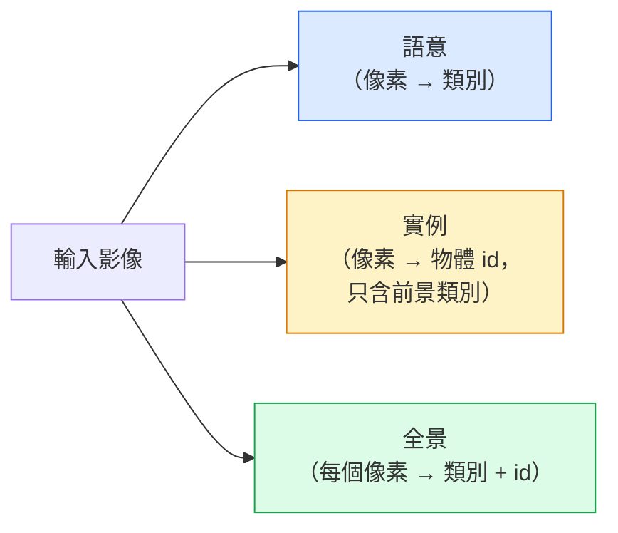
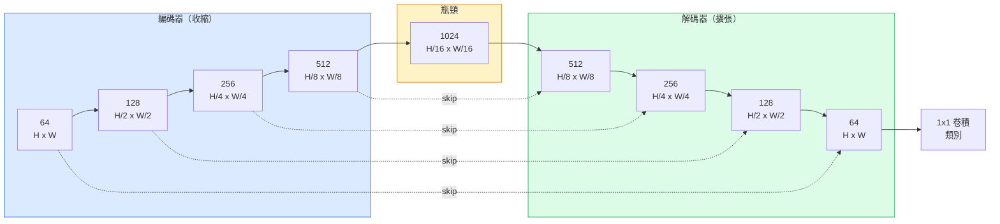

# 語意分割（semantic segmentation）：U-Net

> 分割是對每一個像素（pixel）做分類。U-Net 能做成，是因為它把下採樣（downsampling）的編碼器（encoder）配上上採樣（upsampling）的解碼器（decoder），再在兩者之間接上跳躍連接（skip connection）。

**Type:** Build
**Languages:** Python
**Prerequisites:** Phase 4 Lesson 03 (CNNs), Phase 4 Lesson 04 (Image Classification)
**Time:** ~75 minutes

## Learning Objectives｜學習目標

- 分辨語意分割、實例分割（instance segmentation）和全景分割（panoptic segmentation），並依問題選對的任務
- 用 PyTorch 從零做一個 U-Net：編碼器區塊、瓶頸（bottleneck）、帶轉置卷積（transposed convolution）的解碼器、跳躍連接
- 實作逐像素的交叉熵（cross-entropy）、Dice 損失（Dice loss），以及醫學和工業分割目前預設的組合損失
- 讀每個類別的交並比（intersection over union，IoU）和 Dice，判斷分數差是來自小物體的召回率（recall）、邊界準不準，還是類別不平衡

## The Problem｜問題

分類對每張影像輸出一個標籤。偵測對每張影像輸出少數幾個框。分割對每個像素輸出一個標籤。輸入大小是 `H x W` 時，語意分割的輸出張量（tensor）形狀是 `H x W`，實例分割則是 `H x W x N_instances`。那是每張影像數百萬個預測，不是一個。

分割的結構，是它撐起幾乎每一個密集預測視覺產品的原因：醫學影像裡的腫瘤遮罩（mask）、自駕裡的道路、車道、障礙物、衛星裡的建物輪廓和作物邊界、文件解析裡的版面區塊、機器人裡抓得起來的區域。這些任務沒有一個能靠在物體外面畫一個框解決。它們要的是精確的輪廓。

架構上的問題很好講，不好解：網路（network）得同時看見影像的全域脈絡（這是什麼樣的場景），和局部的像素細節（哪一個像素到底是道路還是人行道）。標準的 CNN 用空間壓縮換脈絡，細節就丟掉了。U-Net 是同時拿到兩邊的那個設計。

## The Concept｜核心概念

### 語意、實例、全景



- **語意**說的是：這個像素是道路，那個像素是車。兩輛並排的車會融成一塊。
- **實例**說的是：這個像素是第 3 輛車，那個像素是第 5 輛車。它忽略背景的 stuff。stuff 是天空、道路、草地這類沒有個體的區域。
- **全景**把兩邊合在一起：每個像素都有類別標籤，每個個體都有唯一的 id。stuff 和 things 都分割。things 是可數的物體。

本課講語意。下一課 Mask R-CNN 講實例。

### U-Net 的形狀



編碼器把空間解析度減半四次，通道（channel）加倍。解碼器反過來：空間解析度加倍四次，通道減半。跳躍連接在每一個解析度，把對得上的編碼器特徵（feature）和解碼器特徵串接起來。最後的 1x1 卷積在完整解析度上把 `64 -> num_classes` 映到類別數。

跳躍連接為什麼必要：解碼器要輸出像素級預測時，它看過的只有小的特徵圖（feature map）。沒有跳躍，它沒辦法把邊緣定位準，因為那份資訊在編碼器裡被壓掉了。跳躍連接把編碼器往下走時算過的高解析度特徵圖交還給它。

### 轉置卷積與雙線性上採樣

解碼器得把空間維度放大。有兩個做法：

- **轉置卷積**（`nn.ConvTranspose2d`）。可學習的上採樣。歷史上 U-Net 的預設。步幅和核（kernel）大小不能整除時，會出現棋盤狀偽影。
- **雙線性上採樣加 3x3 卷積**。先平滑放大，再接一層卷積。偽影較少，參數（parameter）較少，這是現在的預設。

兩者在實務上都看得到。第一次做 U-Net，用雙線性比較安全。

### 像素格子上的交叉熵

C 個類別的語意分割，模型（model）輸出是 `(N, C, H, W)`。目標是 `(N, H, W)`，裡面是整數類別 id。交叉熵和分類時相同，只是套在每一個空間位置上：

```
Loss = mean over (n, h, w) of -log( softmax(logits[n, :, h, w])[target[n, h, w]] )
```

PyTorch 的 `F.cross_entropy` 原生吃這個形狀。不用先改形狀。

### Dice 損失，以及為什麼需要它

交叉熵把每個像素看成一樣重。畫面被一個類別佔滿時，這是錯的。醫學影像常常是 99% 背景、1% 腫瘤。網路可以靠全部預測成背景拿到 99% 準確率，仍然沒用。

Dice 損失直接最佳化預測遮罩和真實遮罩的重疊：

```
Dice(p, y) = 2 * sum(p * y) / (sum(p) + sum(y) + epsilon)
Dice_loss = 1 - Dice
```

`p` 是某個類別的 sigmoid 或 softmax 機率圖，`y` 是二元的真實遮罩。只有重疊完美時，損失（loss）才是 0。因為它看的是比值，類別不平衡無關緊要。

實務上用**組合損失**：

```
L = L_cross_entropy + lambda * L_dice       (lambda ~ 1)
```

交叉熵在訓練前段給穩定的梯度（gradient）。Dice 把訓練後段的力氣放在遮罩形狀真的吻合。這個組合是醫學影像的預設，在任何類別不平衡的資料集（dataset）上都很難被打贏。

### 評估指標

- **像素準確率**。預測對的像素佔多少。便宜。資料不平衡時它是壞的，理由和分類裡的準確率一樣。
- **每個類別的 IoU**。每個類別遮罩的交集除以聯集。跨類別平均就是 mIoU。
- **Dice，也就是像素上的 F1**。和 IoU 相近。`Dice = 2 * IoU / (1 + IoU)`。醫學影像偏好 Dice，自駕社群偏好 IoU。兩者單調相關。
- **邊界 F1**。量預測邊界離真實邊界多近，連小位移都罰。半導體檢測這類高精度任務要緊。

要回報每個類別的 IoU，不要只回報 mIoU。平均 IoU 會把一個 15% 的類別藏起來，當其他九個是 85% 的時候。

### 輸入解析度的取捨

U-Net 的編碼器把解析度減半四次，所以輸入必須能被 16 整除。醫學影像常常是 512x512 或 1024x1024。自駕的裁切常常是 2048x1024。U-Net 的記憶體（memory）成本隨 `H * W * C_max` 長。1024x1024、瓶頸 1024 個通道時，光前向傳遞就已經用掉數 GB 的 VRAM。

兩個標準的變通：

1. 把輸入切成小塊。用有重疊的 256x256 小塊處理，再拼回去。
2. 用膨脹卷積（dilated convolution）換掉瓶頸，空間解析度維持得更高，感受野（receptive field）卻變寬。這是 DeepLab 那一族。

第一個模型用 256x256 的輸入、基底 64 通道的 U-Net，在 8 GB VRAM 上訓練得很從容。

```figure
segmentation-flood
```

## Build It｜動手實作

### 步驟 1：編碼器區塊

兩個 3x3 卷積，加批次正規化（batch normalization）和 ReLU。第一個卷積改變通道數，第二個維持不變。

```python
import torch
import torch.nn as nn
import torch.nn.functional as F

class DoubleConv(nn.Module):
    def __init__(self, in_c, out_c):
        super().__init__()
        self.net = nn.Sequential(
            nn.Conv2d(in_c, out_c, kernel_size=3, padding=1, bias=False),
            nn.BatchNorm2d(out_c),
            nn.ReLU(inplace=True),
            nn.Conv2d(out_c, out_c, kernel_size=3, padding=1, bias=False),
            nn.BatchNorm2d(out_c),
            nn.ReLU(inplace=True),
        )

    def forward(self, x):
        return self.net(x)
```

這個區塊後面一直重複用。`bias=False` 是因為 BN 的 beta 已經處理偏置（bias）。

### 步驟 2：下採樣和上採樣區塊

```python
class Down(nn.Module):
    def __init__(self, in_c, out_c):
        super().__init__()
        self.net = nn.Sequential(
            nn.MaxPool2d(2),
            DoubleConv(in_c, out_c),
        )

    def forward(self, x):
        return self.net(x)


class Up(nn.Module):
    def __init__(self, in_c, out_c):
        super().__init__()
        self.up = nn.Upsample(scale_factor=2, mode="bilinear", align_corners=False)
        self.conv = DoubleConv(in_c, out_c)

    def forward(self, x, skip):
        x = self.up(x)
        if x.shape[-2:] != skip.shape[-2:]:
            x = F.interpolate(x, size=skip.shape[-2:], mode="bilinear", align_corners=False)
        x = torch.cat([skip, x], dim=1)
        return self.conv(x)
```

只看空間的形狀檢查 `shape[-2:]`，處理不能被 16 整除的輸入。串接之前，一次安全的 `F.interpolate` 先把張量對齊。如果比的是完整形狀，通道數不同也會觸發，而那應該是明顯的錯誤，不是悄悄做內插。

### 步驟 3：U-Net

```python
class UNet(nn.Module):
    def __init__(self, in_channels=3, num_classes=2, base=64):
        super().__init__()
        self.inc = DoubleConv(in_channels, base)
        self.d1 = Down(base, base * 2)
        self.d2 = Down(base * 2, base * 4)
        self.d3 = Down(base * 4, base * 8)
        self.d4 = Down(base * 8, base * 16)
        self.u1 = Up(base * 16 + base * 8, base * 8)
        self.u2 = Up(base * 8 + base * 4, base * 4)
        self.u3 = Up(base * 4 + base * 2, base * 2)
        self.u4 = Up(base * 2 + base, base)
        self.outc = nn.Conv2d(base, num_classes, kernel_size=1)

    def forward(self, x):
        x1 = self.inc(x)
        x2 = self.d1(x1)
        x3 = self.d2(x2)
        x4 = self.d3(x3)
        x5 = self.d4(x4)
        x = self.u1(x5, x4)
        x = self.u2(x, x3)
        x = self.u3(x, x2)
        x = self.u4(x, x1)
        return self.outc(x)

net = UNet(in_channels=3, num_classes=2, base=32)
x = torch.randn(1, 3, 256, 256)
print(f"output: {net(x).shape}")
print(f"params: {sum(p.numel() for p in net.parameters()):,}")
```

輸出形狀是 `(1, 2, 256, 256)`，空間大小和輸入相同，通道數是 `num_classes`。`base=32` 時大約 770 萬個參數。

### 步驟 4：損失

```python
def dice_loss(logits, targets, num_classes, eps=1e-6):
    probs = F.softmax(logits, dim=1)
    targets_one_hot = F.one_hot(targets, num_classes).permute(0, 3, 1, 2).float()
    dims = (0, 2, 3)
    intersection = (probs * targets_one_hot).sum(dim=dims)
    denom = probs.sum(dim=dims) + targets_one_hot.sum(dim=dims)
    dice = (2 * intersection + eps) / (denom + eps)
    return 1 - dice.mean()


def combined_loss(logits, targets, num_classes, lam=1.0):
    ce = F.cross_entropy(logits, targets)
    dc = dice_loss(logits, targets, num_classes)
    return ce + lam * dc, {"ce": ce.item(), "dice": dc.item()}
```

Dice 先按類別算，再平均，這是宏平均（macro-average）Dice。`eps` 避免批次裡沒有出現的類別除以 0。

### 步驟 5：IoU 指標

```python
@torch.no_grad()
def iou_per_class(logits, targets, num_classes):
    preds = logits.argmax(dim=1)
    ious = torch.zeros(num_classes)
    for c in range(num_classes):
        pred_c = (preds == c)
        true_c = (targets == c)
        inter = (pred_c & true_c).sum().float()
        union = (pred_c | true_c).sum().float()
        ious[c] = (inter / union) if union > 0 else torch.tensor(float("nan"))
    return ious
```

回傳長度是 C 的向量。`nan` 表示這個類別沒有出現在這個批次裡。算 mIoU 時不要把那些平均進去。

### 步驟 6：用來從頭到尾驗證的合成資料集

在有顏色的背景上畫形狀，讓網路學的是形狀，不是像素顏色。

```python
import numpy as np
from torch.utils.data import Dataset, DataLoader

def synthetic_segmentation(num_samples=200, size=64, seed=0):
    rng = np.random.default_rng(seed)
    images = np.zeros((num_samples, size, size, 3), dtype=np.float32)
    masks = np.zeros((num_samples, size, size), dtype=np.int64)
    for i in range(num_samples):
        bg = rng.uniform(0, 1, (3,))
        images[i] = bg
        masks[i] = 0
        num_shapes = rng.integers(1, 4)
        for _ in range(num_shapes):
            cls = int(rng.integers(1, 3))
            color = rng.uniform(0, 1, (3,))
            cx, cy = rng.integers(10, size - 10, size=2)
            r = int(rng.integers(4, 12))
            yy, xx = np.meshgrid(np.arange(size), np.arange(size), indexing="ij")
            if cls == 1:
                mask = (xx - cx) ** 2 + (yy - cy) ** 2 < r ** 2
            else:
                mask = (np.abs(xx - cx) < r) & (np.abs(yy - cy) < r)
            images[i][mask] = color
            masks[i][mask] = cls
        images[i] += rng.normal(0, 0.02, images[i].shape)
        images[i] = np.clip(images[i], 0, 1)
    return images, masks


class SegDataset(Dataset):
    def __init__(self, images, masks):
        self.images = images
        self.masks = masks

    def __len__(self):
        return len(self.images)

    def __getitem__(self, i):
        img = torch.from_numpy(self.images[i]).permute(2, 0, 1).float()
        mask = torch.from_numpy(self.masks[i]).long()
        return img, mask
```

三個類別：背景是 0，圓是 1，方塊是 2。網路必須學會分辨形狀。

### 步驟 7：訓練迴圈

```python
def train_one_epoch(model, loader, optimizer, device, num_classes):
    model.train()
    loss_sum, total = 0.0, 0
    iou_sum = torch.zeros(num_classes)
    for x, y in loader:
        x, y = x.to(device), y.to(device)
        logits = model(x)
        loss, _ = combined_loss(logits, y, num_classes)
        optimizer.zero_grad()
        loss.backward()
        optimizer.step()
        loss_sum += loss.item() * x.size(0)
        total += x.size(0)
        iou_sum += iou_per_class(logits, y, num_classes).nan_to_num(0)
    return loss_sum / total, iou_sum / len(loader)
```

在這個合成資料集上跑 10 到 30 個 epoch（訓練週期），看形狀類別的 mIoU 爬過 0.9。注意 `nan_to_num(0)` 把批次裡沒出現的類別當成 0。要準確的逐類別 IoU，評估時應先看該類別有沒有出現，再用 `torch.nanmean` 跨批次平均，而不是在這裡平均。

## Use It｜實際應用

正式環境裡，`segmentation_models_pytorch`（也就是 smp）把每一個標準分割架構包起來，骨幹（backbone）可以是任何 torchvision 或 timm 的。三行：

```python
import segmentation_models_pytorch as smp

model = smp.Unet(
    encoder_name="resnet34",
    encoder_weights="imagenet",
    in_channels=3,
    classes=3,
)
```

真正做事時還值得知道這些：

- **DeepLabV3+** 用膨脹卷積換掉以最大池化為基礎的下採樣，瓶頸維持解析度。衛星和自駕資料上，邊界更俐落。
- **SegFormer** 把卷積編碼器換成階層式的 transformer。許多基準上目前最好。
- **Mask2Former** 和 **OneFormer** 用單一架構把語意、實例、全景合在一起。

這三個在 `smp` 或 `transformers` 裡都可以直接換上，資料載入器相同。

## Ship It｜交付成果

本課會產出：

- `outputs/prompt-segmentation-task-picker.md`：一份 prompt，在語意、實例、全景之間做選擇，並為給定的任務指出架構
- `outputs/skill-segmentation-mask-inspector.md`：一項技能，回報類別分布、預測遮罩的統計，以及預測不足或邊界糊掉的類別

## Exercises｜練習

1. **（簡單）** 為二元分割（前景對背景）實作 `bce_dice_loss`。在合成的兩類資料集上驗證：前景只佔 5% 像素時，組合損失比單獨的 BCE 收斂（convergence）得更快。
2. **（中等）** 把 `nn.Upsample + conv` 的上採樣區塊換成 `nn.ConvTranspose2d`。兩者都在合成資料集上訓練，比較 mIoU。觀察轉置卷積版本的棋盤狀偽影出現在哪裡。
3. **（困難）** 拿一個真實分割資料集，Oxford-IIIT Pets、Cityscapes 的小切分，或一個醫學子集，把 U-Net 訓練到和 `smp.Unet` 參考差在 2 個 IoU 以內。回報每個類別的 IoU，並指出哪些類別從加上 Dice 受益最多。

## Key Terms｜關鍵術語

| 術語 | 常見說法 | 實際意義 |
|------|----------------|----------------------|
| 語意分割 | 「每個像素都標籤」 | 每個像素分到 C 個類別之一。同一類的個體合在一起 |
| 實例分割 | 「每個物體都標籤」 | 把同一類的不同個體分開。只做前景 |
| 全景分割 | 「語意加實例」 | 每個像素有類別。每個可數物體的個體另有唯一 id |
| 跳躍連接 | 「U-Net 的橋」 | 把編碼器特徵串接到解析度對得上的解碼器特徵。保住高頻細節 |
| 轉置卷積 | 「反卷積」 | 可學習的上採樣。可能產生棋盤狀偽影 |
| Dice 損失 | 「重疊損失」 | 1 - 2|A ∩ B| / (|A| + |B|)；直接最佳化遮罩重疊，對類別不平衡穩 |
| mIoU | 「IoU 的平均」 | 跨類別的 IoU 平均。分割社群的標準指標（metric） |
| 邊界 F1 | 「邊界準確度」 | 只在邊界像素上算的 F1。精度要很緊的任務才要緊 |

## Further Reading｜延伸閱讀

- [U-Net: Convolutional Networks for Biomedical Image Segmentation (Ronneberger et al., 2015)](https://arxiv.org/abs/1505.04597) ——原始論文。大家抄的那張圖在第 2 頁
- [Fully Convolutional Networks (Long et al., 2015)](https://arxiv.org/abs/1411.4038) ——第一次把分割做成端到端卷積問題的論文
- [segmentation_models_pytorch](https://github.com/qubvel/segmentation_models.pytorch) ——正式環境分割的參考。每個標準架構，加上每個標準損失
- [iafoss, Unet34 submission with TTA (Kaggle notebook)](https://www.kaggle.com/code/iafoss/unet34-submission-tta-0-699-new-public-lb) ——真實分割競賽裡，U-Net 的測試時增強（test-time augmentation）
