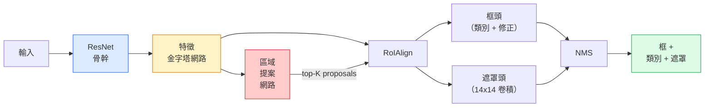

# 實例分割（instance segmentation）：Mask R-CNN

> 在 Faster R-CNN 偵測器上加一條很小的遮罩（mask）支線，就有實例分割。難的是 RoIAlign，而且它比看起來更難。

**Type:** Build + Learn
**Languages:** Python
**Prerequisites:** Phase 4 Lesson 06 (YOLO), Phase 4 Lesson 07 (U-Net)
**Time:** ~75 minutes

## Learning Objectives｜學習目標

- 從頭到尾沿著 Mask R-CNN 的架構（architecture）走：骨幹（backbone）、FPN、RPN、RoIAlign、框頭、遮罩頭
- 從零實作 RoIAlign，並說明為什麼不再用 RoIPool
- 用 torchvision 預訓練的 `maskrcnn_resnet50_fpn_v2`，做出正式環境品質的實例遮罩，並正確讀它的輸出格式
- 在小型自訂資料集（dataset）上 fine-tuning Mask R-CNN：換掉框頭和遮罩頭，骨幹保持凍結

## The Problem｜問題

語意分割（semantic segmentation）給你每個類別一張遮罩。實例分割給你每個物體一張遮罩，就算兩個物體是同一類。數個體、跨影格追蹤、量東西，都需要實例分割。牆上每一塊磚的邊界框（bounding box）、顯微鏡影像裡的每一個細胞，都是這種事。

Mask R-CNN（He 等人，2017）把實例分割改成「偵測再加一張遮罩」，把這個問題解掉。設計乾淨到接下來五年，幾乎每篇實例分割論文都是 Mask R-CNN 的變體。torchvision 的實作，到現在仍是中小型資料集的正式環境預設。

難的工程問題是取樣（sampling）：提案框的角沒有對齊像素（pixel）邊界時，你怎麼從裡面裁出一塊固定大小的特徵（feature）區域？這裡弄錯，到處都會掉十分之幾個 mAP。RoIAlign 就是答案。

## The Concept｜核心概念

### 架構



要弄懂的有五塊：

1. **骨幹**。在 ImageNet 上訓練的 ResNet-50 或 ResNet-101。產出一層層特徵圖（feature map），步幅（stride）是 4、8、16、32。
2. **FPN，特徵金字塔網路（Feature Pyramid Network）**。自上而下，再加上橫向連接，讓每一層都有 C 個通道、語意豐富的特徵。偵測時，依物體大小去查對得上的那一層 FPN。
3. **RPN，區域提案網路（Region Proposal Network）**。一個小的卷積頭。在每個錨框（anchor box）位置預測「這裡有沒有物體」，以及「框要怎麼修」。每張影像大約產出 1000 個提案。
4. **RoIAlign**。從任何一層 FPN、任何一個框上，取出固定大小的特徵塊，例如 7x7。雙線性取樣，不做量化（quantisation）。
5. **頭**。兩層的框頭，修正框並挑類別。再加上一個小的卷積頭，對每個提案輸出一張 `28x28` 的二元遮罩。

### 為什麼是 RoIAlign，不是 RoIPool

原本的 Fast R-CNN 用 RoIPool。它把提案框切成格子，每個格子取特徵的最大值，並把所有座標四捨五入成整數。那個四捨五入會讓特徵圖和輸入像素座標錯開，最多錯一整個特徵圖像素。在 224x224 的影像上這還小。特徵圖步幅是 32 時，這是災難。

```
RoIPool:
  box (34.7, 51.3, 98.2, 142.9)
  round -> (34, 51, 98, 142)
  split grid -> round each cell boundary
  misalignment accumulates at every step

RoIAlign:
  box (34.7, 51.3, 98.2, 142.9)
  sample at exact float coordinates using bilinear interpolation
  no rounding anywhere
```

RoIAlign 在 COCO 上白白把遮罩 AP 拉高 3 到 4 個點。現在每一個在意定位的偵測器都用它。YOLOv7 的分割、RT-DETR、Mask2Former 都一樣。

### 一段話講完 RPN

在特徵圖的每個位置放 K 個大小和形狀不同的錨框。每個錨框預測一個物件性（objectness）分數，以及一個迴歸（regression）偏移，把錨框修成更貼的框。依分數留下大約前 1,000 個框，用交並比（intersection over union，IoU）0.7 做非極大值抑制（non-maximum suppression），再把活下來的交給那些頭。RPN 用自己的一個小損失訓練。結構和第 6 課的 YOLO 損失一樣，只是只有兩類：有物體，或沒有物體。

### 遮罩頭

每個提案在 RoIAlign 之後，遮罩頭是一個很小的全卷積網路（fully convolutional network，FCN）：四個 3x3 卷積、一次放大 2 倍的轉置卷積（transposed convolution）、最後一個 1x1 卷積，在 `28x28` 的解析度上產出 `num_classes` 個輸出通道。只留下預測類別對應的那個通道，其他的丟掉。這樣遮罩預測和分類就分開了。

把 28x28 的遮罩放大到提案原本的像素大小，就得到最終的二元遮罩。

### 損失

Mask R-CNN 把四個損失加在一起：

```
L = L_rpn_cls + L_rpn_box + L_box_cls + L_box_reg + L_mask
```

- `L_rpn_cls`、`L_rpn_box`：RPN 提案的物件性，加上框迴歸。
- `L_box_cls`：頭上的分類器，對 C+1 個類別（含背景）做交叉熵（cross-entropy）。
- `L_box_reg`：頭上框修正的 smooth L1。
- `L_mask`：28x28 遮罩輸出上，逐像素的二元交叉熵。

每個損失有自己的預設權重。torchvision 的實作把它們放在建構函式的引數（parameter）裡。

### 輸出格式

`torchvision.models.detection.maskrcnn_resnet50_fpn_v2` 回傳一個 dict 清單，每張影像一個：

```
{
    "boxes":  (N, 4) in (x1, y1, x2, y2) pixel coordinates,
    "labels": (N,) class IDs, 0 = background so indices are 1-based,
    "scores": (N,) confidence scores,
    "masks":  (N, 1, H, W) float masks in [0, 1] — threshold at 0.5 for binary,
}
```

遮罩已經是整張影像的解析度。28x28 的頭輸出在內部被放大過了。

```figure
cv3-roialign-sampling
```

## Build It｜動手實作

### 步驟 1：從零做 RoIAlign

Mask R-CNN 裡，這個零件用程式碼看比用散文看更容易懂。

```python
import torch
import torch.nn.functional as F

def roi_align_single(feature, box, output_size=7, spatial_scale=1 / 16.0):
    """
    feature: (C, H, W) single-image feature map
    box: (x1, y1, x2, y2) in original image pixel coordinates
    output_size: side of the output grid (7 for box head, 14 for mask head)
    spatial_scale: reciprocal of the feature map stride
    """
    C, H, W = feature.shape
    x1, y1, x2, y2 = [c * spatial_scale - 0.5 for c in box]
    bin_w = (x2 - x1) / output_size
    bin_h = (y2 - y1) / output_size

    grid_y = torch.linspace(y1 + bin_h / 2, y2 - bin_h / 2, output_size)
    grid_x = torch.linspace(x1 + bin_w / 2, x2 - bin_w / 2, output_size)
    yy, xx = torch.meshgrid(grid_y, grid_x, indexing="ij")

    gx = 2 * (xx + 0.5) / W - 1
    gy = 2 * (yy + 0.5) / H - 1
    grid = torch.stack([gx, gy], dim=-1).unsqueeze(0)
    sampled = F.grid_sample(feature.unsqueeze(0), grid, mode="bilinear",
                            align_corners=False)
    return sampled.squeeze(0)
```

每個數字都落在雙線性取樣的位置上。沒有四捨五入，沒有量化，梯度（gradient）也不會被丟掉。

### 步驟 2：和 torchvision 的 RoIAlign 比較

```python
from torchvision.ops import roi_align

feature = torch.randn(1, 16, 50, 50)
boxes = torch.tensor([[0, 10, 20, 100, 90]], dtype=torch.float32)  # (batch_idx, x1, y1, x2, y2)

ours = roi_align_single(feature[0], boxes[0, 1:].tolist(), output_size=7, spatial_scale=1/4)
theirs = roi_align(feature, boxes, output_size=(7, 7), spatial_scale=1/4, sampling_ratio=1, aligned=True)[0]

print(f"shape ours:   {tuple(ours.shape)}")
print(f"shape theirs: {tuple(theirs.shape)}")
print(f"max|diff|:    {(ours - theirs).abs().max().item():.3e}")
```

`sampling_ratio=1` 且 `aligned=True` 時，兩者的差在 `1e-5` 以內。

### 步驟 3：載入預訓練的 Mask R-CNN

```python
import torch
from torchvision.models.detection import maskrcnn_resnet50_fpn_v2, MaskRCNN_ResNet50_FPN_V2_Weights

model = maskrcnn_resnet50_fpn_v2(weights=MaskRCNN_ResNet50_FPN_V2_Weights.DEFAULT)
model.eval()
print(f"params: {sum(p.numel() for p in model.parameters()):,}")
print(f"classes (including background): {len(model.roi_heads.box_predictor.cls_score.out_features * [0])}")
```

4600 萬個參數，91 個類別，也就是 COCO。第一個類別、id 0，是背景。模型真正偵測到的東西從 id 1 開始。

### 步驟 4：跑推論

```python
with torch.no_grad():
    x = torch.randn(3, 400, 600)
    predictions = model([x])
p = predictions[0]
print(f"boxes:  {tuple(p['boxes'].shape)}")
print(f"labels: {tuple(p['labels'].shape)}")
print(f"scores: {tuple(p['scores'].shape)}")
print(f"masks:  {tuple(p['masks'].shape)}")
```

遮罩張量（tensor）的形狀是 `(N, 1, H, W)`。閾值設在 0.5，就得到每個物體的二元遮罩：

```python
binary_masks = (p['masks'] > 0.5).squeeze(1)  # (N, H, W) boolean
```

### 步驟 5：換成自訂的類別數

常見的 fine-tuning 配方：骨幹、FPN、RPN 照用，換掉兩個分類頭。

```python
from torchvision.models.detection.faster_rcnn import FastRCNNPredictor
from torchvision.models.detection.mask_rcnn import MaskRCNNPredictor

def build_custom_maskrcnn(num_classes):
    model = maskrcnn_resnet50_fpn_v2(weights=MaskRCNN_ResNet50_FPN_V2_Weights.DEFAULT)
    in_features = model.roi_heads.box_predictor.cls_score.in_features
    model.roi_heads.box_predictor = FastRCNNPredictor(in_features, num_classes)
    in_features_mask = model.roi_heads.mask_predictor.conv5_mask.in_channels
    hidden_layer = 256
    model.roi_heads.mask_predictor = MaskRCNNPredictor(in_features_mask, hidden_layer, num_classes)
    return model

custom = build_custom_maskrcnn(num_classes=5)
print(f"custom cls_score.out_features: {custom.roi_heads.box_predictor.cls_score.out_features}")
```

`num_classes` 必須包含背景類別。資料集有 4 個物體類別時，用 `num_classes=5`。

### 步驟 6：凍住不需要訓練的部分

資料集小的時候，凍住骨幹和 FPN。只有 RPN 的物件性和迴歸，以及兩個頭，會學習。

```python
def freeze_backbone_and_fpn(model):
    # torchvision Mask R-CNN packs the FPN inside `model.backbone` (as
    # `model.backbone.fpn`), so iterating `model.backbone.parameters()` covers
    # both the ResNet feature layers and the FPN lateral/output convs.
    for p in model.backbone.parameters():
        p.requires_grad = False
    return model

custom = freeze_backbone_and_fpn(custom)
trainable = sum(p.numel() for p in custom.parameters() if p.requires_grad)
print(f"trainable after freeze: {trainable:,}")
```

在 500 張影像的資料集上，這就是收斂（convergence）和過度擬合（overfitting）的差別。

## Use It｜實際應用

torchvision 裡 Mask R-CNN 的完整訓練迴圈大約 40 行，任務之間幾乎不用改。換掉資料集就能用。

```python
def train_step(model, images, targets, optimizer):
    model.train()
    loss_dict = model(images, targets)
    losses = sum(loss for loss in loss_dict.values())
    optimizer.zero_grad()
    losses.backward()
    optimizer.step()
    return {k: v.item() for k, v in loss_dict.items()}
```

`targets` 清單裡，每張影像一個 dict，要有 `boxes`、`labels`、`masks`。遮罩是 `(num_instances, H, W)` 的二元張量。訓練時模型回傳四個損失組成的 dict。評估時回傳預測清單。切哪一種，看 `model.training`。

`pycocotools` 的評估器會同時給框和遮罩的 mAP@IoU=0.5:0.95。兩個數字都要，才知道瓶頸（bottleneck）在框頭還是遮罩頭。

## Ship It｜交付成果

本課會產出：

- `outputs/prompt-instance-vs-semantic-router.md`：一份 prompt，問三個問題，在實例、語意、全景之間做選擇，並指出一開始該用的模型（model）
- `outputs/skill-mask-rcnn-head-swapper.md`：一項技能，給定新的 `num_classes`，為任何 torchvision 偵測模型產生換頭用的那 10 行程式

## Exercises｜練習

1. **（簡單）** 用 100 個隨機框，把你的 RoIAlign 和 `torchvision.ops.roi_align` 比對。回報最大絕對差。再跑 RoIPool，也就是 2017 年以前的行為，顯示靠近邊界的框會差大約 1 到 2 個特徵圖像素。
2. **（中等）** 在 50 張影像的自訂資料集上 fine-tuning `maskrcnn_resnet50_fpn_v2`。任何兩類都行：氣球、魚、坑洞、標誌。凍住骨幹，訓練 20 個 epoch（訓練週期），回報遮罩 AP@0.5。
3. **（困難）** 把 Mask R-CNN 的遮罩頭從 28x28 改成在 56x56 預測。量改之前和改之後的 mAP@IoU=0.75。說明增益有或沒有，為什麼和預期的邊界精度對記憶體（memory）取捨一致。

## Key Terms｜關鍵術語

| 術語 | 常見說法 | 實際意義 |
|------|----------------|----------------------|
| Mask R-CNN | 「偵測再加遮罩」 | Faster R-CNN，加上一個小的全卷積頭，對每個提案、每個類別預測一張 28x28 遮罩 |
| FPN | 「特徵金字塔」 | 自上而下加橫向連接，讓每個步幅層級都有 C 個通道的語意豐富特徵 |
| RPN | 「區域提案器」 | 一個小的卷積頭，每張影像產出大約 1000 個有物體或沒有物體的提案 |
| RoIAlign | 「不四捨五入的裁切」 | 從任何浮點座標的框，用雙線性取出固定大小的特徵格子 |
| RoIPool | 「2017 年以前的裁切」 | 目的和 RoIAlign 一樣，但會把框的座標四捨五入。已經過時 |
| 遮罩 AP | 「實例的 mAP」 | 用遮罩 IoU 而不是框 IoU 算的平均精確率（average precision）。COCO 實例分割的指標 |
| 二元遮罩頭 | 「每個類別一張遮罩」 | 對每個提案、每個類別預測一張二元遮罩。只留下預測類別的那個通道 |
| 背景類別 | 「類別 0」 | 兜住一切的「沒有物體」類別。真正類別的索引從 1 開始 |

## Further Reading｜延伸閱讀

- [Mask R-CNN (He et al., 2017)](https://arxiv.org/abs/1703.06870) ——那篇論文。第 3 節講 RoIAlign，是一定要讀的
- [FPN: Feature Pyramid Networks (Lin et al., 2017)](https://arxiv.org/abs/1612.03144) ——FPN 論文。每個現代偵測器都用它
- [torchvision Mask R-CNN tutorial](https://pytorch.org/tutorials/intermediate/torchvision_tutorial.html) ——fine-tuning 迴圈的參考
- [Detectron2 model zoo](https://github.com/facebookresearch/detectron2/blob/main/MODEL_ZOO.md) ——正式環境的實作，幾乎每個偵測和分割變體都有訓練好的權重（weight）
