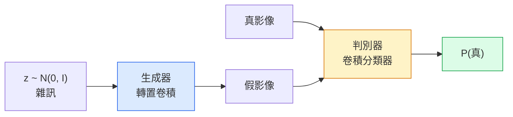
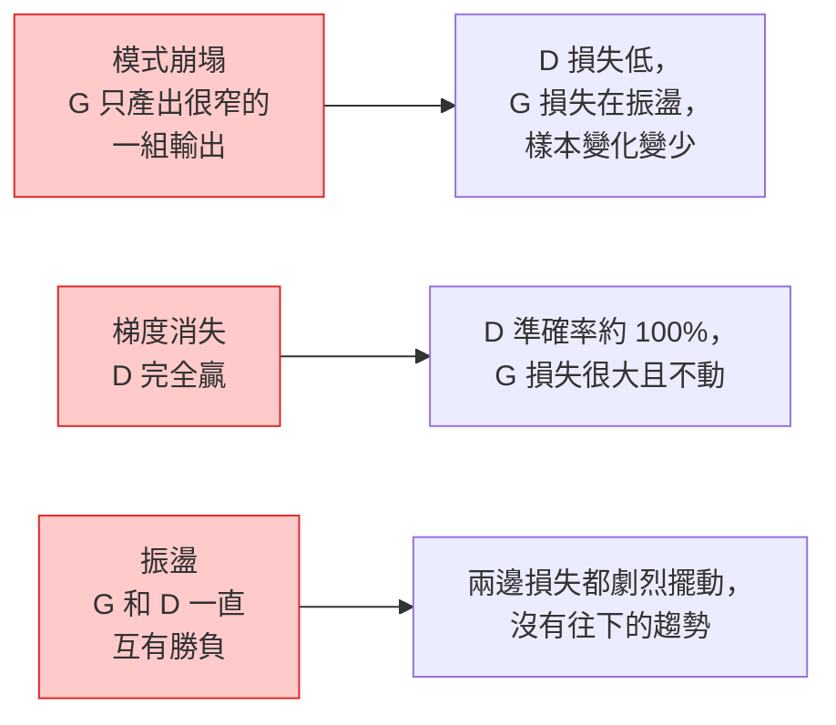

# 影像生成（image generation）：生成對抗網路（GAN）

> GAN 是兩個神經網路（neural network）在玩一場固定的賽局。一個負責畫，一個負責評。它們一起變好，直到畫出來的東西騙過負責評的那個。

**Type:** Build
**Languages:** Python
**Prerequisites:** Phase 4 Lesson 03 (CNNs), Phase 3 Lesson 06 (Optimizers), Phase 3 Lesson 07 (Regularization)
**Time:** ~75 minutes

## Learning Objectives｜學習目標

- 說明生成器（generator）和判別器（discriminator）之間的極小極大（minimax）賽局，以及為什麼均衡對應到 p_model = p_data
- 用 PyTorch 實作 DCGAN，在 60 行以內生成看得出結構的 32x32 合成影像
- 用三個標準手法把 GAN 訓練穩住：非飽和損失、譜正規化（spectral normalization）、TTUR（兩時間尺度更新規則，two-timescale update rule）
- 讀訓練曲線，分辨健康的收斂（convergence）、模式崩塌（mode collapse）、振盪，以及判別器完全贏

## The Problem｜問題

分類教網路把影像映到標籤。生成把問題倒過來：取樣出新的影像，看起來像來自同一個分布。沒有一個「正確」輸出可以拿來相減。你只有一個想模仿的分布。

標準損失（loss），MSE、交叉熵（cross-entropy），量不到「這個樣本是不是來自真實分布」。把每個像素（pixel）的誤差最小化，得到的是糊掉的平均，不是真實的樣本。突破是把損失學出來：訓練第二個網路，工作是分辨真假，再用它的判斷去推動生成器。

GAN（Goodfellow 等人，2014）定義了這個框架。到 2018 年，StyleGAN 已經能產出 1024x1024、和照片分不出來的人臉。擴散模型後來在品質和可控性上取而代之，但讓擴散變得實用的每一個手法，正規化（normalization）的選擇、潛在空間（latent space）、特徵（feature）損失，都是先在 GAN 上弄懂的。

## The Concept｜核心概念

### 兩個網路



**生成器** G 吃一個雜訊向量 `z`，輸出一張影像。**判別器** D 吃一張影像，輸出一個純量：這張影像是真的機率。

### 這場賽局

G 希望 D 錯。D 希望自己對。形式是：

```
min_G max_D  E_x[log D(x)] + E_z[log(1 - D(G(z)))]
```

從右邊往左讀。D 要把真影像上的準確率拉到最大，對應 `log D(real)`，也要把假影像上的準確率拉到最大，對應 `log (1 - D(fake))`。G 要把 D 對假影像的準確率壓到最小。它希望 `D(G(z))` 高。

Goodfellow 證明這個極小極大有一個全域均衡：`p_G = p_data`，D 到處都輸出 0.5，生成分布和真實分布的 Jensen-Shannon 散度是 0。要達到這點並不容易。

### 非飽和損失

上面那個形式在數值上不穩。訓練一開始，每一張假影像的 `D(G(z))` 都接近 0，所以 `log(1 - D(G(z)))` 對 G 的梯度（gradient）會消失。修法是把 G 的損失翻過來。

```
L_D = -E_x[log D(x)] - E_z[log(1 - D(G(z)))]
L_G = -E_z[log D(G(z))]                          # non-saturating
```

現在 `D(G(z))` 接近 0 時，G 的損失很大，梯度也有資訊。每個現代 GAN 都用這個變體訓練。

### DCGAN 的架構規則

Radford、Metz、Chintala（2015）把多年失敗的實驗整理成五條規則，讓 GAN 訓練穩得下來：

1. 兩個網路都用步幅卷積換掉池化。
2. 生成器和判別器都用批次正規化（batch normalization），但 G 的輸出和 D 的輸入除外。
3. 較深的架構拿掉全連接層。
4. G 除了輸出層都用 ReLU。輸出用 tanh，範圍在 [-1, 1]。
5. D 每一層都用 LeakyReLU，negative_slope=0.2。

每個現代以卷積為基礎的 GAN，StyleGAN、BigGAN、GigaGAN，仍從這些規則出發，一次換掉一塊。

### 失敗模式和它們的簽名



- **模式崩塌**。G 找到一張能騙過 D 的影像，就只產那一張。修法：加上小批次判別、譜正規化（spectral normalization），或用標籤做條件。
- **判別器贏**。D 太快變得太強，G 的梯度消失。修法：把 D 做小、降低 D 的學習率，或對真實標籤做標籤平滑（label smoothing）。
- **振盪**。兩個網路一直互有勝負，從未靠近均衡。修法：TTUR，讓 D 學得比 G 快 2 到 4 倍，或改用 Wasserstein 損失。

### 評估

GAN 沒有標準答案，你怎麼知道它在工作？

- **看樣本**。每個 epoch（訓練週期）結束看 64 張樣本。這件事不能省。
- **FID，Fréchet Inception Distance**。真實集合和生成集合在 Inception-v3 特徵分布之間的距離。越低越好。這是社群標準。
- **Inception Score**。較舊，也較脆。偏好 FID。
- **生成模型的精確率（precision）和召回率（recall）**。品質（精確率）和覆蓋（召回率）分開量。比單看 FID 更有資訊。

小的合成資料實驗，看樣本就夠。

```figure
cv-gan-image
```

## Build It｜動手實作

### 步驟 1：生成器

一個小的 DCGAN 生成器。吃 64 維雜訊，產出 32x32 的影像。

```python
import torch
import torch.nn as nn

class Generator(nn.Module):
    def __init__(self, z_dim=64, img_channels=3, feat=64):
        super().__init__()
        self.net = nn.Sequential(
            nn.ConvTranspose2d(z_dim, feat * 4, kernel_size=4, stride=1, padding=0, bias=False),
            nn.BatchNorm2d(feat * 4),
            nn.ReLU(inplace=True),
            nn.ConvTranspose2d(feat * 4, feat * 2, kernel_size=4, stride=2, padding=1, bias=False),
            nn.BatchNorm2d(feat * 2),
            nn.ReLU(inplace=True),
            nn.ConvTranspose2d(feat * 2, feat, kernel_size=4, stride=2, padding=1, bias=False),
            nn.BatchNorm2d(feat),
            nn.ReLU(inplace=True),
            nn.ConvTranspose2d(feat, img_channels, kernel_size=4, stride=2, padding=1, bias=False),
            nn.Tanh(),
        )

    def forward(self, z):
        return self.net(z.view(z.size(0), -1, 1, 1))
```

四個轉置卷積（transposed convolution），每個都是 `kernel_size=4, stride=2, padding=1`，所以空間大小乾淨地加倍。輸出活化值用 tanh 落在 [-1, 1]。

### 步驟 2：判別器

把生成器倒過來。LeakyReLU、步幅卷積，結尾是一個純量 logit。

```python
class Discriminator(nn.Module):
    def __init__(self, img_channels=3, feat=64):
        super().__init__()
        self.net = nn.Sequential(
            nn.Conv2d(img_channels, feat, kernel_size=4, stride=2, padding=1),
            nn.LeakyReLU(0.2, inplace=True),
            nn.Conv2d(feat, feat * 2, kernel_size=4, stride=2, padding=1, bias=False),
            nn.BatchNorm2d(feat * 2),
            nn.LeakyReLU(0.2, inplace=True),
            nn.Conv2d(feat * 2, feat * 4, kernel_size=4, stride=2, padding=1, bias=False),
            nn.BatchNorm2d(feat * 4),
            nn.LeakyReLU(0.2, inplace=True),
            nn.Conv2d(feat * 4, 1, kernel_size=4, stride=1, padding=0),
        )

    def forward(self, x):
        return self.net(x).view(-1)
```

最後一個卷積把 `4x4` 的特徵圖收成 `1x1`。每張影像輸出一個純量。sigmoid 只在算損失時才套上。

### 步驟 3：訓練步驟

每個批次交替：先更新 D 一次，再更新 G 一次。

```python
import torch.nn.functional as F

def train_step(G, D, real, z, opt_g, opt_d, device):
    real = real.to(device)
    bs = real.size(0)

    # D step
    opt_d.zero_grad()
    d_real = D(real)
    d_fake = D(G(z).detach())
    loss_d = (F.binary_cross_entropy_with_logits(d_real, torch.ones_like(d_real))
              + F.binary_cross_entropy_with_logits(d_fake, torch.zeros_like(d_fake)))
    loss_d.backward()
    opt_d.step()

    # G step
    opt_g.zero_grad()
    d_fake = D(G(z))
    loss_g = F.binary_cross_entropy_with_logits(d_fake, torch.ones_like(d_fake))
    loss_g.backward()
    opt_g.step()

    return loss_d.item(), loss_g.item()
```

D 那一步裡的 `G(z).detach()` 很要緊。更新 D 時，梯度不該流進 G。忘掉這件事是初學者的經典 bug。

### 步驟 4：在合成形狀上的完整訓練迴圈

```python
from torch.utils.data import DataLoader, TensorDataset
import numpy as np

def synthetic_images(num=2000, size=32, seed=0):
    rng = np.random.default_rng(seed)
    imgs = np.zeros((num, 3, size, size), dtype=np.float32) - 1.0
    for i in range(num):
        r = rng.uniform(6, 12)
        cx, cy = rng.uniform(r, size - r, size=2)
        yy, xx = np.meshgrid(np.arange(size), np.arange(size), indexing="ij")
        mask = (xx - cx) ** 2 + (yy - cy) ** 2 < r ** 2
        color = rng.uniform(-0.5, 1.0, size=3)
        for c in range(3):
            imgs[i, c][mask] = color[c]
    return torch.from_numpy(imgs)

device = "cuda" if torch.cuda.is_available() else "cpu"
data = synthetic_images()
loader = DataLoader(TensorDataset(data), batch_size=64, shuffle=True)

G = Generator(z_dim=64, img_channels=3, feat=32).to(device)
D = Discriminator(img_channels=3, feat=32).to(device)
opt_g = torch.optim.Adam(G.parameters(), lr=2e-4, betas=(0.5, 0.999))
opt_d = torch.optim.Adam(D.parameters(), lr=2e-4, betas=(0.5, 0.999))

for epoch in range(10):
    for (batch,) in loader:
        z = torch.randn(batch.size(0), 64, device=device)
        ld, lg = train_step(G, D, batch, z, opt_g, opt_d, device)
    print(f"epoch {epoch}  D {ld:.3f}  G {lg:.3f}")
```

`Adam(lr=2e-4, betas=(0.5, 0.999))` 是 DCGAN 的預設。較低的 beta1 讓動量項不要把對抗賽局穩得太死。

### 步驟 5：取樣

```python
@torch.no_grad()
def sample(G, n=16, z_dim=64, device="cpu"):
    G.eval()
    z = torch.randn(n, z_dim, device=device)
    imgs = G(z)
    imgs = (imgs + 1) / 2
    return imgs.clamp(0, 1)
```

取樣之前一定要切到 eval 模式。對 DCGAN 這要緊，因為這時用的是批次正規化累積下來的統計，不是這個批次自己的統計。

### 步驟 6：譜正規化（spectral normalization）

這可以直接換掉判別器裡的批次正規化，並保證網路是 1-Lipschitz。大多數「D 贏太兇」的失敗都能修。

```python
from torch.nn.utils import spectral_norm

def build_sn_discriminator(img_channels=3, feat=64):
    return nn.Sequential(
        spectral_norm(nn.Conv2d(img_channels, feat, 4, 2, 1)),
        nn.LeakyReLU(0.2, inplace=True),
        spectral_norm(nn.Conv2d(feat, feat * 2, 4, 2, 1)),
        nn.LeakyReLU(0.2, inplace=True),
        spectral_norm(nn.Conv2d(feat * 2, feat * 4, 4, 2, 1)),
        nn.LeakyReLU(0.2, inplace=True),
        spectral_norm(nn.Conv2d(feat * 4, 1, 4, 1, 0)),
    )
```

把 `Discriminator` 換成 `build_sn_discriminator()`，常常就不需要 TTUR。譜正規化（spectral normalization）是你能加上的、最容易的單一穩健性升級。

## Use It｜實際應用

認真要生成時，用預訓練權重（weight），或改走擴散。兩個標準函式庫（library）：

- `torch_fidelity` 在你的生成器上算 FID 和 IS，不用自己寫評估程式。
- `pytorch-gan-zoo`（舊的）和 `StudioGAN` 提供測過的實作：DCGAN、WGAN-GP、SN-GAN、StyleGAN、BigGAN。

2026 年，GAN 仍是這些事情的最好選擇：即時影像生成（延遲低於 10 毫秒）、風格轉換、要精確控制的影像到影像轉換，例如 Pix2Pix、CycleGAN。照片級真實和文字條件，是擴散贏。

## Ship It｜交付成果

本課會產出：

- `outputs/prompt-gan-training-triage.md`：一份 prompt，讀一段訓練曲線的描述，挑出失敗模式，模式崩塌、D 贏、或振盪，並給出唯一建議的修法
- `outputs/skill-dcgan-scaffold.md`：一項技能，依 `z_dim`、目標 `image_size` 和 `num_channels` 寫出 DCGAN 的骨架，含訓練迴圈和存樣本的程式

## Exercises｜練習

1. **（簡單）** 在上面的合成圓形資料集上訓練這個 DCGAN。每個 epoch 結束存一張 16 個樣本的格子。到第幾個 epoch，生成的圓才明顯是圓？
2. **（中等）** 把判別器的批次正規化換成譜正規化（spectral normalization）。兩個版本並排訓練。哪一個收斂更快？三個種子之間，哪一個變異數更低？
3. **（困難）** 實作條件式 DCGAN：類別標籤同時餵給 G 和 D。G 裡把 one-hot 接到雜訊上，D 裡多接一個類別 embedding 通道。用第 7 課「圓對方塊」的合成資料集訓練，並用指定標籤取樣，顯示類別條件有用。

## Key Terms｜關鍵術語

| 術語 | 常見說法 | 實際意義 |
|------|----------------|----------------------|
| 生成器（G） | 「那個負責畫的網路」 | 把雜訊映成影像。訓練目標是騙過判別器 |
| 判別器（D） | 「那個評的」 | 二元分類器。訓練來分辨真實影像和生成影像 |
| 極小極大 | 「那場賽局」 | 對 G 取最小、對 D 取最大的對抗損失。均衡是 p_G = p_data |
| 非飽和損失 | 「數值上比較正常的版本」 | G 的損失是 -log(D(G(z)))，不是 log(1 - D(G(z)))。避免訓練前段梯度消失 |
| 模式崩塌 | 「生成器只做一種東西」 | G 只產出資料分布的一小部分。用譜正規化（spectral normalization）、小批次判別，或更大的批次來修 |
| TTUR | 「兩個學習率」 | D 學得比 G 快，通常是 2 到 4 倍。用來穩住訓練 |
| 譜正規化（spectral normalization） | 「1-Lipschitz 的層」 | 一種權重正規化，把每一層的 Lipschitz 常數加上界。不讓 D 變得任意陡 |
| FID | 「Fréchet Inception Distance」 | 真實集合和生成集合在 Inception-v3 特徵分布之間的距離。標準評估指標（metric） |

## Further Reading｜延伸閱讀

- [Generative Adversarial Networks (Goodfellow et al., 2014)](https://arxiv.org/abs/1406.2661) ——開山的那篇論文
- [DCGAN (Radford, Metz, Chintala, 2015)](https://arxiv.org/abs/1511.06434) ——讓 GAN 訓得動的架構規則
- [Spectral Normalization for GANs (Miyato et al., 2018)](https://arxiv.org/abs/1802.05957) ——最有用的那一個穩定手法
- [StyleGAN3 (Karras et al., 2021)](https://arxiv.org/abs/2106.12423) ——當時最好的 GAN。讀起來像過去十年每個手法的精選集
