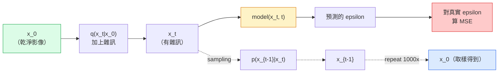

# 影像生成（image generation）：擴散模型（diffusion model）

> 擴散模型學的是去雜訊（denoise）。訓練它從一張有雜訊的影像上拿掉一點點雜訊（noise），再把這件事倒著做一千次，你就有一個影像生成器。

**Type:** Build
**Languages:** Python
**Prerequisites:** Phase 4 Lesson 07 (U-Net), Phase 1 Lesson 06 (Probability), Phase 3 Lesson 06 (Optimizers)
**Time:** ~75 minutes

## Learning Objectives｜學習目標

- 推導前向加雜訊過程 `x_0 -> x_1 -> ... -> x_T`，並說明為什麼閉式（closed form）的 `q(x_t | x_0)` 對任何 t 都成立
- 實作 DDPM 風格的訓練目標：迴歸每一步加進去的雜訊，以及一個從純雜訊走回影像的取樣器（sampler）
- 做一個時間條件的 U-Net，小到能在 CPU 上訓練，對任何時間步預測雜訊
- 說明 DDPM 和 DDIM 取樣的差別，以及各自適合的時候（第 23 課會深入流匹配（flow matching）和整流流（rectified flow））

## The Problem｜問題

GAN 一次生成：雜訊進去，影像出來，一次前向傳遞（forward pass）。它們快，但難訓練。擴散模型是反覆生成：從純雜訊開始，一小步一小步去雜訊，影像慢慢浮出來。它們慢，但好訓練。過去五年，後者這個性質壓過了前者。任何小團隊都能訓練一個擴散模型，拿到還可以的樣本。GAN 訓練是要花很多年失敗才學會的手藝。

除了訓練穩，擴散的反覆結構才是現代影像生成能做那麼多事的原因：文字條件、局部修補（inpainting）、影像編輯、超解析度（super-resolution）、可控的風格。取樣迴圈的每一步，都是塞進新約束的地方。Stable Diffusion、Imagen、DALL-E 3、Midjourney，以及你會用到的每個可控影像模型都走擴散，就是因為有這個接點。

本課做最小的 DDPM：前向加雜訊、反向去雜訊、訓練迴圈。下一課（Stable Diffusion）把它接到一套正式環境的系統：VAE、文字編碼器（encoder），以及無分類器引導（classifier-free guidance）。

## The Concept｜核心概念

### 前向過程

拿一張影像 `x_0`。加上一點點高斯（Gaussian）雜訊，得到 `x_1`。再加一點點，得到 `x_2`。一直做到 T 步，直到 `x_T` 幾乎和純高斯雜訊分不出來。

```
q(x_t | x_{t-1}) = N(x_t; sqrt(1 - beta_t) * x_{t-1},  beta_t * I)
```

`beta_t` 是一條很小的變異數（variance）排程，通常在 T=1000 步裡從 0.0001 線性走到 0.02。每一步都把訊號稍微縮小，再灌進新的雜訊。

### 閉式解的一步更新

一步一步加雜訊是一條馬可夫鏈（Markov chain），但式子可以折成一步：你可以一步就從 `x_0` 取樣出 `x_t`。

```
Define alpha_t = 1 - beta_t
Define alpha_bar_t = prod_{s=1..t} alpha_s

Then:
  q(x_t | x_0) = N(x_t; sqrt(alpha_bar_t) * x_0,  (1 - alpha_bar_t) * I)

Equivalently:
  x_t = sqrt(alpha_bar_t) * x_0 + sqrt(1 - alpha_bar_t) * epsilon
  where epsilon ~ N(0, I)
```

這一個式子，就是擴散做得起來的全部理由。訓練時你隨機挑一個 `t`，直接從 `x_0` 取樣出 `x_t`，一步就訓練完。不用把整條馬可夫鏈模擬出來。

### 反向過程

前向過程是固定的。神經網路（neural network）學的是反向過程 `p(x_{t-1} | x_t)`。擴散模型不直接預測 `x_{t-1}`。它們預測第 t 步加進去的雜訊 `epsilon`，再由數學從它推出 `x_{t-1}`。



### 訓練損失

每個訓練步驟：

1. 抽一張真實影像 `x_0`。
2. 從 [1, T] 均勻抽一個時間步 `t`。
3. 抽雜訊 `epsilon ~ N(0, I)`。
4. 計算 `x_t = sqrt(alpha_bar_t) * x_0 + sqrt(1 - alpha_bar_t) * epsilon`。
5. 用網路預測 `epsilon_theta(x_t, t)`。
6. 把 `|| epsilon - epsilon_theta(x_t, t) ||^2` 最小化。

就是這樣。神經網路學會在任何時間步預測雜訊。損失（loss）是 MSE。沒有對抗賽局，沒有崩塌，沒有振盪。

### 取樣器（DDPM）

要生成時，從 `x_T ~ N(0, I)` 開始，一次往回走一步。

```
for t = T, T-1, ..., 1:
    eps = model(x_t, t)
    x_{t-1} = (1 / sqrt(alpha_t)) * (x_t - (beta_t / sqrt(1 - alpha_bar_t)) * eps) + sqrt(beta_t) * z
    where z ~ N(0, I) if t > 1, else 0
return x_0
```

重點是：一般來說反向條件分布沒有閉式，但對這個特定的高斯前向過程有。那些看起來很醜的係數，就是貝氏規則（Bayes' rule）給你的。

### 為什麼是 1000 步

前向雜訊排程選成每一步只加剛好夠的雜訊，讓反向那一步幾乎是高斯。步數太少，反向那一步離高斯太遠，網路模型不好。步數太多，取樣變貴，增益卻遞減。T=1000 配線性排程，是 DDPM 的預設。

### DDIM：取樣快約 20 倍

訓練相同。取樣改變。DDIM（Song 等人，2020）定義一個確定性的反向過程，可以跳過時間步，不用重新訓練。用 DDIM 取樣 50 步，品質接近 1000 步的 DDPM。每個正式環境的系統都用 DDIM，或更快的變體，例如 DPM-Solver、Euler ancestral（祖先取樣）。

### 時間條件

網路 `epsilon_theta(x_t, t)` 得知道自己在去哪一個時間步的雜訊。現代擴散模型把 `t` 用正弦時間 embedding 灌進去，想法和 transformer 的位置編碼（positional encoding）一樣，再加到每一層 U-Net 的特徵圖（feature map）上。

```
t_embedding = sinusoidal(t)
feature_map += MLP(t_embedding)
```

沒有時間條件，網路就得從影像本身猜雜訊有多大。做得到，但樣本效率差很多。

```figure
cv-diffusion-image
```

## Build It｜動手實作

### 步驟 1：雜訊排程

```python
import torch

def linear_beta_schedule(T=1000, beta_start=1e-4, beta_end=2e-2):
    return torch.linspace(beta_start, beta_end, T)


def precompute_schedule(betas):
    alphas = 1.0 - betas
    alphas_cumprod = torch.cumprod(alphas, dim=0)
    return {
        "betas": betas,
        "alphas": alphas,
        "alphas_cumprod": alphas_cumprod,
        "sqrt_alphas_cumprod": torch.sqrt(alphas_cumprod),
        "sqrt_one_minus_alphas_cumprod": torch.sqrt(1.0 - alphas_cumprod),
        "sqrt_recip_alphas": torch.sqrt(1.0 / alphas),
    }

schedule = precompute_schedule(linear_beta_schedule(T=1000))
```

先算一次，訓練和取樣時再依索引取出。

### 步驟 2：前向擴散（q_sample）

```python
def q_sample(x0, t, noise, schedule):
    sqrt_a = schedule["sqrt_alphas_cumprod"][t].view(-1, 1, 1, 1)
    sqrt_one_minus_a = schedule["sqrt_one_minus_alphas_cumprod"][t].view(-1, 1, 1, 1)
    return sqrt_a * x0 + sqrt_one_minus_a * noise
```

一行閉式。`t` 是一批時間步，批次裡每張影像一個。

### 步驟 3：很小的時間條件 U-Net

```python
import torch.nn as nn
import torch.nn.functional as F
import math

def timestep_embedding(t, dim=64):
    half = dim // 2
    freqs = torch.exp(-math.log(10000) * torch.arange(half, device=t.device) / half)
    args = t[:, None].float() * freqs[None]
    emb = torch.cat([args.sin(), args.cos()], dim=-1)
    return emb


class TinyUNet(nn.Module):
    def __init__(self, img_channels=3, base=32, t_dim=64):
        super().__init__()
        self.t_mlp = nn.Sequential(
            nn.Linear(t_dim, base * 4),
            nn.SiLU(),
            nn.Linear(base * 4, base * 4),
        )
        self.t_dim = t_dim
        self.enc1 = nn.Conv2d(img_channels, base, 3, padding=1)
        self.enc2 = nn.Conv2d(base, base * 2, 4, stride=2, padding=1)
        self.mid = nn.Conv2d(base * 2, base * 2, 3, padding=1)
        self.dec1 = nn.ConvTranspose2d(base * 2, base, 4, stride=2, padding=1)
        self.dec2 = nn.Conv2d(base * 2, img_channels, 3, padding=1)
        self.time_proj = nn.Linear(base * 4, base * 2)

    def forward(self, x, t):
        t_emb = timestep_embedding(t, self.t_dim)
        t_emb = self.t_mlp(t_emb)
        t_proj = self.time_proj(t_emb)[:, :, None, None]

        h1 = F.silu(self.enc1(x))
        h2 = F.silu(self.enc2(h1)) + t_proj
        h3 = F.silu(self.mid(h2))
        d1 = F.silu(self.dec1(h3))
        d2 = torch.cat([d1, h1], dim=1)
        return self.dec2(d2)
```

兩層的 U-Net，時間條件加在瓶頸。真實影像要把深度和寬度放大。

### 步驟 4：訓練迴圈

```python
def train_step(model, x0, schedule, optimizer, device, T=1000):
    model.train()
    x0 = x0.to(device)
    bs = x0.size(0)
    t = torch.randint(0, T, (bs,), device=device)
    noise = torch.randn_like(x0)
    x_t = q_sample(x0, t, noise, schedule)
    pred = model(x_t, t)
    loss = F.mse_loss(pred, noise)
    optimizer.zero_grad()
    loss.backward()
    optimizer.step()
    return loss.item()
```

這就是整個訓練迴圈。沒有 GAN 的賽局，沒有特製的損失，一次 MSE。

### 步驟 5：取樣器（DDPM）

```python
@torch.no_grad()
def sample(model, schedule, shape, T=1000, device="cpu"):
    model.eval()
    x = torch.randn(shape, device=device)
    betas = schedule["betas"].to(device)
    sqrt_one_minus_a = schedule["sqrt_one_minus_alphas_cumprod"].to(device)
    sqrt_recip_alphas = schedule["sqrt_recip_alphas"].to(device)

    for t in reversed(range(T)):
        t_batch = torch.full((shape[0],), t, dtype=torch.long, device=device)
        eps = model(x, t_batch)
        coef = betas[t] / sqrt_one_minus_a[t]
        mean = sqrt_recip_alphas[t] * (x - coef * eps)
        if t > 0:
            x = mean + torch.sqrt(betas[t]) * torch.randn_like(x)
        else:
            x = mean
    return x
```

要產出一批樣本，得做 1000 次前向傳遞。實際程式會把這段換成 DDIM 的 50 步取樣器。

### 步驟 6：DDIM 取樣器（確定性，大約快 20 倍）

```python
@torch.no_grad()
def sample_ddim(model, schedule, shape, steps=50, T=1000, device="cpu", eta=0.0):
    model.eval()
    x = torch.randn(shape, device=device)
    alphas_cumprod = schedule["alphas_cumprod"].to(device)

    ts = torch.linspace(T - 1, 0, steps + 1).long()
    for i in range(steps):
        t = ts[i]
        t_prev = ts[i + 1]
        t_batch = torch.full((shape[0],), t, dtype=torch.long, device=device)
        eps = model(x, t_batch)
        a_t = alphas_cumprod[t]
        a_prev = alphas_cumprod[t_prev] if t_prev >= 0 else torch.tensor(1.0, device=device)
        x0_pred = (x - torch.sqrt(1 - a_t) * eps) / torch.sqrt(a_t)
        sigma = eta * torch.sqrt((1 - a_prev) / (1 - a_t) * (1 - a_t / a_prev))
        dir_xt = torch.sqrt(1 - a_prev - sigma ** 2) * eps
        noise = sigma * torch.randn_like(x) if eta > 0 else 0
        x = torch.sqrt(a_prev) * x0_pred + dir_xt + noise
    return x
```

`eta=0` 是完全確定的：同一份雜訊輸入，永遠得到同一份輸出。`eta=1` 就回到 DDPM。

## Use It｜實際應用

正式環境的工作用 `diffusers`：

```python
from diffusers import DDPMScheduler, UNet2DModel

unet = UNet2DModel(sample_size=32, in_channels=3, out_channels=3, layers_per_block=2)
scheduler = DDPMScheduler(num_train_timesteps=1000)
```

這個函式庫（library）提供現成的排程器（DDPM、DDIM、DPM-Solver、Euler、Heun）、可設定的 U-Net、文字到影像和影像到影像的管線（pipeline），以及 LoRA fine-tuning 的輔助程式。

做研究的話，`k-diffusion`（Katherine Crowson）有最忠於原文的參考實作，取樣變體也最好。

## Ship It｜交付成果

本課會產出：

- `outputs/prompt-diffusion-sampler-picker.md`：一份 prompt，依品質目標、延遲預算和條件類型，在 DDPM、DDIM、DPM-Solver、Euler 之間挑一個
- `outputs/skill-noise-schedule-designer.md`：一項技能，依 T 和目標破壞程度，產出線性、餘弦或 sigmoid 的 beta 排程，再加上訊噪比（signal-to-noise ratio）隨時間的診斷圖

## Exercises｜練習

1. **（簡單）** 把前向過程畫出來：拿一張影像，在 `t in [0, 100, 250, 500, 750, 1000]` 畫出 `x_t`。確認 `x_1000` 看起來像純高斯雜訊。
2. **（中等）** 在合成圓形資料集上把 TinyUNet 訓練 20 個 epoch（訓練週期），取樣出 16 個圓。比較 DDPM（1000 步）和 DDIM（50 步）。同一顆雜訊種子，它們產出的影像像不像？
3. **（困難）** 實作餘弦雜訊排程（Nichol 與 Dhariwal，2021）：`alpha_bar_t = cos^2((t/T + s) / (1 + s) * pi / 2)`。同一模型用線性和餘弦排程各訓練一次，顯示步數少的時候餘弦的樣本更好。

## Key Terms｜關鍵術語

| 術語 | 常見說法 | 實際意義 |
|------|----------------|----------------------|
| 前向過程 | 「隨時間加雜訊」 | 固定的馬可夫鏈，在 T 步裡把影像破壞成高斯雜訊 |
| 反向過程 | 「一步一步去雜訊」 | 學來的分布，從雜訊走回影像 |
| epsilon 預測 | 「預測雜訊」 | 訓練目標：`epsilon_theta(x_t, t)` 預測第 t 步加進去的雜訊 |
| beta 排程 | 「雜訊的量」 | 長度 T 的一串小變異數，定義每一步灌進多少雜訊 |
| alpha_bar_t | 「累積保留係數」 | 到時間 t 為止，(1 - beta_s) 的乘積。t 越大，剩下的訊號越少 |
| DDPM 取樣器 | 「祖先取樣，隨機」 | 從條件高斯取樣出每個 x_{t-1}。1000 步 |
| DDIM 取樣器 | 「確定、很快」 | 把取樣改寫成確定性 ODE。20 到 100 步，品質接近 |
| 時間條件 | 「告訴模型現在是哪個 t」 | 把 t 的正弦 embedding 灌進 U-Net，讓它知道雜訊有多大 |

## Further Reading｜延伸閱讀

- [Denoising Diffusion Probabilistic Models (Ho et al., 2020)](https://arxiv.org/abs/2006.11239) ——把擴散做得實用、並在 FID 上贏過 GAN 的那篇
- [Improved DDPM (Nichol & Dhariwal, 2021)](https://arxiv.org/abs/2102.09672) ——餘弦排程和 v-parameterisation
- [DDIM (Song, Meng, Ermon, 2020)](https://arxiv.org/abs/2010.02502) ——讓即時推論（inference）變得可能的確定性取樣器
- [Elucidating the Design Space of Diffusion (Karras et al., 2022)](https://arxiv.org/abs/2206.00364) ——把每個擴散設計選擇整理成一個統一觀點。目前最好的參考
