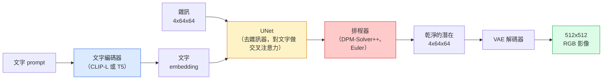

# Stable Diffusion：架構與 fine-tuning

> Stable Diffusion 是跑在預訓練變分自編碼器（variational autoencoder，VAE）的潛在空間（latent space）裡的 DDPM。文字條件從交叉注意力（cross-attention）灌進來，以快速的確定性 ODE 求解器取樣，並以無分類器引導（classifier-free guidance）控制生成方向。

**Type:** Learn + Use
**Languages:** Python
**Prerequisites:** Phase 4 Lesson 10 (Diffusion), Phase 7 Lesson 02 (Self-Attention)
**Time:** ~75 minutes

## Learning Objectives｜學習目標

- 把 Stable Diffusion 管線（pipeline）的五塊走一遍：VAE、文字編碼器（encoder）、U-Net、排程器（scheduler）、安全檢查器（safety checker），以及每一塊實際在做什麼
- 說明潛在擴散（latent diffusion），以及為什麼在 4x64x64 的潛在空間訓練（而不是 3x512x512 的影像）能把計算量降到 48 分之 1，品質卻不掉
- 用 `diffusers` 生成影像、做影像到影像、局部修補（inpainting），以及 ControlNet 引導的生成
- 在小的自訂資料集上用 LoRA 對 Stable Diffusion 做 fine-tuning，並在推論（inference）時載入 LoRA adapter

## The Problem｜問題

直接在 512x512 的 RGB 影像上訓練 DDPM 很貴。每個訓練步驟都要對一個看得到 3x512x512 = 786,432 個輸入值的 U-Net 做反向傳播（backpropagation），取樣還要對同一個 U-Net 做 50 次以上的前向傳遞（forward pass）。以 Stable Diffusion 1.5（2022 年釋出）的品質來說，像素（pixel）空間的擴散大約要 256 個 GPU 月的訓練，消費級 GPU 上一張影像要 10 到 30 秒。

讓開放權重的文字到影像變得實用的手法，是**潛在擴散**（Rombach 等人，CVPR 2022）。先訓練一個 VAE，把 3x512x512 的影像映到 4x64x64 的潛在張量（tensor）再映回來，然後在那個潛在空間裡做擴散。計算量變成原來的四十八分之一，也就是 `(3*512*512)/(4*64*64) = 48x`。同一張 GPU 上，取樣從幾十秒降到兩秒以內。

幾乎每個現代影像生成模型，SDXL、SD3、FLUX、HunyuanDiT、Wan-Video，都是潛在擴散模型，差別在自編碼器（autoencoder）、去雜訊器（U-Net 或 DiT）、以及文字條件。學會 Stable Diffusion，你就學會了這套模板。

## The Concept｜核心概念

### 這條管線



- **VAE**。凍結的自編碼器。編碼器把影像變成潛在，影像到影像和訓練會用到它。解碼器把潛在變回影像。
- **文字編碼器**。CLIP 文字編碼器（SD 1.x/2.x）、CLIP-L 加 CLIP-G（SDXL），或 T5-XXL（SD3/FLUX）。產出一串 token embedding。
- **U-Net**。去雜訊器。每一個解析度都有交叉注意力層，讓潛在表示去關注文字 embedding。
- **排程器**。取樣演算法（algorithm）：DDIM、Euler、DPM-Solver++。選出 sigma，再把預測的雜訊混回潛在。
- **安全檢查器**。選用的。對輸出影像做 NSFW，也就是不適宜內容，以及違法內容的篩選。

### 無分類器引導（CFG）

單純的文字條件學的是每個 prompt `c` 的 `epsilon_theta(x_t, t, c)`。CFG 訓練同一個網路時，有 10% 的時間把 `c` 拿掉，換成空的 embedding。於是一個模型同時能預測有條件和無條件的雜訊。推論時：

```
eps = eps_uncond + w * (eps_cond - eps_uncond)
```

`w` 是引導尺度。`w=0` 是無條件，`w=1` 是單純的有條件，`w>1` 把輸出往「更貼著 prompt」推，代價是多樣性變少。SD 的預設是 `w=7.5`。

CFG 是文字到影像能達到正式環境品質的原因。沒有它，prompt 只輕輕偏一下輸出。有了它，prompt 說了算。

### 潛在空間的幾何

VAE 的 4 通道潛在不只是壓縮過的影像。它是一個流形（manifold）：上面的算術大致對應語意上的修改，設計 prompt 和內插（interpolation）都發生在這裡。擴散 U-Net 也把整個建模預算花在這裡。把一個隨機的 4x64x64 潛在解碼，不會得到一張看起來隨機的影像。得到的是廢圖，因為只有潛在空間裡特定的子流形解碼後才是有效影像。

兩個後果：

1. **影像到影像**就是把影像編碼成潛在，加上一部分雜訊，跑一遍去雜訊器，再解碼。影像結構留得下來，因為編碼幾乎可逆。內容則跟著 prompt 改。
2. **局部修補**和影像到影像一樣，但去雜訊器只更新被遮罩的區域。沒被遮住的區域保持編碼後的潛在。

### U-Net 架構

SD 的 U-Net 是第 10 課那個 TinyUNet 的大版，多了三樣：

- 每個空間解析度都有 **transformer 區塊**，裡面是自注意力（self-attention），加上對文字 embedding 的交叉注意力。
- **時間 embedding**，對正弦編碼做 MLP。
- 編碼器和解碼器在對得上的解析度之間有**跳躍連接（skip connection）**。

SD 1.5 的參數（parameter）大約 8.6 億。SDXL 大約 26 億。FLUX 大約 120 億。參數跳上去，主要跳在注意力層。

### LoRA fine-tuning

完整 fine-tuning Stable Diffusion 要 20 GB 以上的 VRAM，並更新 8.6 億個參數。LoRA（低秩適配，Low-Rank Adaptation）把基模型凍結，只在注意力層注入很小的秩分解矩陣。一個 SD 的 LoRA adapter 通常 10 到 50 MB，消費級 GPU 上 10 到 60 分鐘就能訓練完，推論時直接套上去就好。

```
Original: W_q : (d_in, d_out)   frozen
LoRA:     W_q + alpha * (A @ B)   where A : (d_in, r), B : (r, d_out)

r is typically 4-32.
```

幾乎每個社群 fine-tune 都以 LoRA 形式發布。CivitAI 和 Hugging Face 上有幾百萬個。

### 你會看到的排程器

- **DDIM**。確定性，大約 50 步，簡單。
- **Euler ancestral**。隨機，30 到 50 步，樣本稍微更有變化。
- **DPM-Solver++ 2M Karras**。確定性，20 到 30 步，正式環境的預設。
- **LCM / TCD / Turbo**。一致性模型和蒸餾出來的變體。1 到 4 步，代價是品質掉一些。

在 `diffusers` 裡換排程器是改一行，有時不用重新訓練就能修好樣本的問題。

```figure
cv3-latent-compression
```

## Build It｜動手實作

本課從頭到尾用 `diffusers`，不從零重做 Stable Diffusion。你若要重做的那些零件，VAE、文字編碼器、U-Net、排程器，各自是別課的題目。這裡的目標是把正式環境的 API 用熟。

### 步驟 1：文字到影像

```python
import torch
from diffusers import StableDiffusionPipeline

pipe = StableDiffusionPipeline.from_pretrained(
    "runwayml/stable-diffusion-v1-5",
    torch_dtype=torch.float16,
).to("cuda")

image = pipe(
    prompt="a dog riding a skateboard in tokyo, studio ghibli style",
    guidance_scale=7.5,
    num_inference_steps=25,
    generator=torch.Generator("cuda").manual_seed(42),
).images[0]
image.save("dog.png")
```

`float16` 把 VRAM 減半，看不出品質損失。預設的 DPM-Solver++ 配 `num_inference_steps=25`，對得上 DDIM 的 `num_inference_steps=50`。

### 步驟 2：換排程器

```python
from diffusers import DPMSolverMultistepScheduler, EulerAncestralDiscreteScheduler

pipe.scheduler = DPMSolverMultistepScheduler.from_config(pipe.scheduler.config)
pipe.scheduler = EulerAncestralDiscreteScheduler.from_config(pipe.scheduler.config)
```

排程器的狀態和 U-Net 權重（weight）是分開的。你可以用 DDPM 訓練，再用任何排程器取樣。

### 步驟 3：影像到影像

```python
from diffusers import StableDiffusionImg2ImgPipeline
from PIL import Image

img2img = StableDiffusionImg2ImgPipeline.from_pretrained(
    "runwayml/stable-diffusion-v1-5",
    torch_dtype=torch.float16,
).to("cuda")

init_image = Image.open("dog.png").convert("RGB").resize((512, 512))
out = img2img(
    prompt="a dog riding a skateboard, oil painting",
    image=init_image,
    strength=0.6,
    guidance_scale=7.5,
).images[0]
```

`strength` 是去雜訊之前要加多少雜訊。0.0 是完全不變，1.0 是整個重生成。風格轉換常用 0.5 到 0.7。

### 步驟 4：局部修補

```python
from diffusers import StableDiffusionInpaintPipeline

inpaint = StableDiffusionInpaintPipeline.from_pretrained(
    "runwayml/stable-diffusion-inpainting",
    torch_dtype=torch.float16,
).to("cuda")

image = Image.open("dog.png").convert("RGB").resize((512, 512))
mask = Image.open("dog_mask.png").convert("L").resize((512, 512))

out = inpaint(
    prompt="a cat",
    image=image,
    mask_image=mask,
    guidance_scale=7.5,
).images[0]
```

遮罩裡的白色像素是要重生成的區域。黑色像素保留。

### 步驟 5：載入 LoRA

```python
pipe.load_lora_weights(
    "artificialguybr/studioghibli-redmond-1-5v-studio-ghibli-lora-for-liberteredmond-sd-1-5",
    weight_name="StudioGhibliRedmond-15V-LiberteRedmond-StdGBRedmAF-StudioGhibli.safetensors",
)
pipe.fuse_lora(lora_scale=0.8)

image = pipe(prompt="a village square, StdGBRedmAF, Studio Ghibli").images[0]
```

模型卡上的觸發詞（`StdGBRedmAF, Studio Ghibli`）把風格打開。`lora_scale` 控制強度。0.0 沒有作用，1.0 是全開。`fuse_lora` 把 adapter 就地寫進權重，速度較快，但不能再換。要載入另一個 adapter 之前，先呼叫 `pipe.unfuse_lora()`。

### 步驟 6：LoRA 訓練（骨架）

真正的 LoRA 訓練在 `peft` 或 `diffusers.training`。大綱是：

```python
# Pseudocode
for step, batch in enumerate(dataloader):
    images, prompts = batch
    latents = vae.encode(images).latent_dist.sample() * 0.18215

    t = torch.randint(0, num_train_timesteps, (batch_size,))
    noise = torch.randn_like(latents)
    noisy_latents = scheduler.add_noise(latents, noise, t)

    text_emb = text_encoder(tokenizer(prompts))

    pred_noise = unet(noisy_latents, t, text_emb)  # LoRA weights injected here

    loss = F.mse_loss(pred_noise, noise)
    loss.backward()
    optimizer.step()
```

只有 LoRA 矩陣收到梯度（gradient）。基礎 U-Net、VAE、文字編碼器都凍結。批次大小 1，再加上梯度檢查點（gradient checkpointing），8 GB VRAM 就放得下。

## Use It｜實際應用

在正式環境裡，你真正要做的決定是：

- **模型家族**。開放原始碼社群的 fine-tune 用 SD 1.5。要更高保真用 SDXL。要目前最好、授權又嚴格，用 SD3 或 FLUX。
- **排程器**。20 到 30 步用 DPM-Solver++ 2M Karras。延遲要低於 1 秒就用 LCM-LoRA。
- **精度**。4080/4090 用 `float16`。A100 和更新的用 `bfloat16`。VRAM 緊的時候用 `int8`（經由 `bitsandbytes` 或 `compel`）。
- **條件**。純文字就夠用。要更強的控制，在基礎管線上加 ControlNet（canny、深度、姿態）。

批次生成用社群工具 `AUTO1111` 或 `ComfyUI`。正式環境的 API 用 `diffusers` 加上 `accelerate`，或用 `optimum-nvidia` 做 TensorRT 編譯。

## Ship It｜交付成果

本課會產出：

- `outputs/prompt-sd-pipeline-planner.md`：一份 prompt，依延遲預算、保真目標和授權限制，挑 SD 1.5、SDXL、SD3 或 FLUX，再加上排程器和精度
- `outputs/skill-lora-training-setup.md`：一項技能，為自訂資料集寫出完整的 LoRA 訓練設定，含說明文字、秩、批次大小和學習率

## Exercises｜練習

1. **（簡單）** 同一個 prompt，`guidance_scale` 取 `[1, 3, 5, 7.5, 10, 15]` 各生成一次。描述影像怎麼變。引導值到多少開始出現假影（artefact）？
2. **（中等）** 拿任何一張真實照片，用 `StableDiffusionImg2ImgPipeline` 跑過，`strength` 取 `[0.2, 0.4, 0.6, 0.8, 1.0]`。哪一個強度保住構圖、又換了風格？為什麼 1.0 會完全不理輸入？
3. **（困難）** 用 10 到 20 張同一個主體的影像（寵物、標誌、角色）訓練一個 LoRA，再生成這個主體出現在新場景裡的圖。回報哪一組 LoRA 秩和訓練步數，身份保得最好，又沒有對輸入影像過擬合（overfitting）。

## Key Terms｜關鍵術語

| 術語 | 常見說法 | 實際意義 |
|------|----------------|----------------------|
| 潛在擴散 | 「在潛在裡擴散」 | 整個 DDPM 跑在 VAE 潛在空間（4x64x64），不跑在像素空間（3x512x512）。計算量省 48 倍 |
| VAE 縮放係數 | 「0.18215」 | 把 VAE 的原始潛在重縮放到大約單位變異數（variance）的常數。每條 SD 管線都寫死 |
| 無分類器引導 | 「CFG」 | 把有條件和無條件的雜訊預測混在一起。對推論影響最大的那一顆旋鈕 |
| 排程器 | 「取樣器」 | 把雜訊加上模型預測，變成一條去雜訊後的潛在軌跡的演算法 |
| LoRA | 「低秩 adapter」 | 很小的秩分解矩陣，fine-tune 注意力層，不動基礎權重 |
| 交叉注意力 | 「文字和影像的注意力」 | 從潛在 token 注意到文字 token。每個 U-Net 層級都把 prompt 的資訊灌進去 |
| ControlNet | 「結構條件」 | 另外訓練的 adapter，用額外輸入（canny、深度、姿態、分割）來拉 Stable Diffusion |
| DPM-Solver++ | 「預設排程器」 | 二階確定性 ODE 求解器。2026 年在少步數（20 到 30）時品質最好 |

## Further Reading｜延伸閱讀

- [High-Resolution Image Synthesis with Latent Diffusion (Rombach et al., 2022)](https://arxiv.org/abs/2112.10752) ——Stable Diffusion 那篇論文。每個支持這個設計的消融都在裡面
- [Classifier-Free Diffusion Guidance (Ho & Salimans, 2022)](https://arxiv.org/abs/2207.12598) ——CFG 那篇
- [LoRA: Low-Rank Adaptation of Large Language Models (Hu et al., 2021)](https://arxiv.org/abs/2106.09685) ——LoRA 先出現在自然語言。幾乎沒改就搬到 Stable Diffusion
- [diffusers documentation](https://huggingface.co/docs/diffusers) ——每條 SD、SDXL、SD3、FLUX 管線的參考
