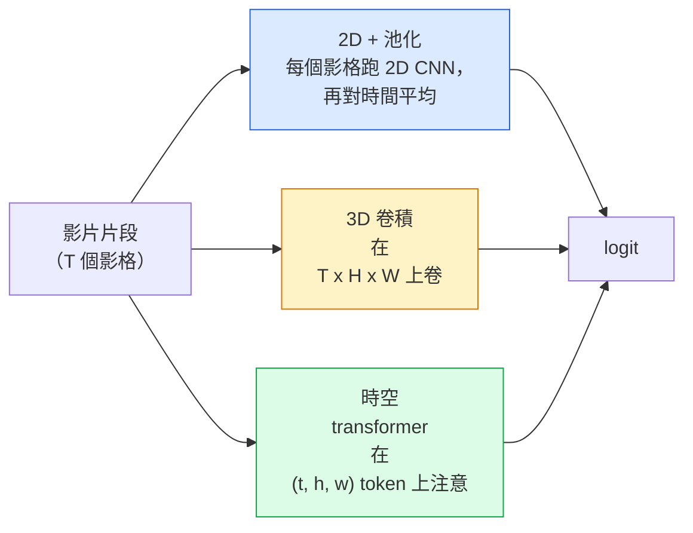

# 影片理解（video understanding）：時間建模

> 一段影片是一串影像，加上連結這些影格的物理規律。每個影片模型不是把時間當成多出來的一軸（3D 卷積（convolution）），就是當成一段要去注意的序列（transformer），或是先抽出特徵（feature）再池化（2D 加池化）。

**Type:** Learn + Build
**Languages:** Python
**Prerequisites:** Phase 4 Lesson 03 (CNNs), Phase 4 Lesson 04 (Image Classification)
**Time:** ~45 minutes

## Learning Objectives｜學習目標

- 分辨三種主要的影片建模做法（2D 加池化、3D 卷積、時空 transformer），並預估它們在成本與準確率（accuracy）之間的取捨
- 用 PyTorch 實作影格（frame）抽樣、時間池化，以及一個 2D 加池化的基準（baseline）分類器
- 說明為什麼 I3D 把 3D 核「膨脹（inflation）」之後，能從 ImageNet 權重（weight）遷移得很好，以及分解式的 (2+1)D 卷積哪裡不一樣
- 讀標準的動作辨識資料集（dataset）和指標（metric）：Kinetics-400/600、UCF101、Something-Something V2；片段層級和影片層級的 top-1 準確率

## The Problem｜問題

30 秒、每秒 30 影格的影片有 900 張影像。單純地看，影片分類就是把影像分類跑 900 次，再做某種聚合。動作幾乎每一格都看得到的時候，這行得通，例如運動、做菜、健身影片。動作本身是由運動定義的時候，這會嚴重失敗：「把東西從左推到右」在每一格靜止畫面裡，看起來都只是兩個不動的物體。

每個影片架構的核心問題是：時間結構在什麼時候被建模，又怎麼建模？答案決定其餘一切。計算量、預訓練策略、能不能重用 ImageNet 權重、模型在哪些資料集上訓練。

本課刻意比靜態影像的課短。影像那套核心機制已經在了。影片理解主要是時間這條線：抽樣、建模、聚合。

## The Concept｜核心概念

### 三個架構家族



### 2D 加池化

拿一個 2D CNN（ResNet、EfficientNet、ViT）。對每個抽到的影格獨立跑一次。把每一格的 embedding 平均（或最大池化，或注意力池化）。再把池化後的向量送進分類器。

好處：

- ImageNet 預訓練可以直接遷移。
- 最容易實作。
- 便宜：T 個影格乘上單張影像的推論（inference）成本。

壞處：

- 建不出運動。動作等於外觀的聚合。
- 時間池化不管順序。「開門」和「關門」看起來一樣。

什麼時候用：外觀很重的任務、小影片資料集上的遷移學習（transfer learning）、一開始的基準。

### 3D 卷積

把 2D 的 (H, W) 核換成 3D 的 (T, H, W) 核。網路同時在空間和時間上做卷積。早期這一族：C3D、I3D、SlowFast。

I3D 的手法：拿一個預訓練的 2D ImageNet 模型，把每個 2D 核沿著新的時間軸複製，把核「膨脹（inflation）」開來。3x3 的 2D 卷積變成 3x3x3 的 3D 卷積。3D 模型因此有很強的預訓練權重，不用從零訓練。

好處：

- 直接建模運動。
- I3D 的膨脹（inflation）白送你遷移學習。

壞處：

- 比對應的 2D 多出 T/8 的 FLOPs（時間核為 3、疊三次的情況）。
- 時間核很小。長距離的運動需要金字塔，或雙流的做法。

什麼時候用：運動本身就是訊號的動作辨識（Something-Something V2、Kinetics 裡運動很重的類別）。

### 時空 transformer

把影片切成時空小塊的格子，再在全部小塊上做注意力。TimeSformer、ViViT、Video Swin、VideoMAE。

要緊的注意力模式：

- **聯合**。對 (t, h, w) 做一次大的注意力。對 `T*H*W` 是二次的，很貴。
- **分開**。每個區塊兩次注意力：一次沿時間，一次沿空間。縮放接近線性。
- **分解**。時間注意力和空間注意力在區塊之間輪流。

好處：

- 每個主要基準上的準確率都是目前最好。
- 可以從影像 transformer（ViT）用小塊膨脹（inflation）遷移過來。
- 用稀疏注意力可以吃長上下文（long context）的影片。

壞處：

- 很吃計算。
- 注意力模式要挑對，不然執行時間會暴增。

什麼時候用：大資料集、高保真的影片理解、影片加文字的多模態任務。

### 影格抽樣

10 秒、每秒 30 影格的片段有 300 格。任何模型都吃全部 300 格是浪費。標準做法：

- **均勻抽樣**。在片段上均勻挑 T 格。2D 加池化的預設。
- **密集抽樣**。隨機抽一段連續的 T 格視窗。3D 卷積常用，因為運動需要相鄰的影格。
- **多片段**。從同一支影片抽多段 T 格視窗，各自分類，測試時把預測平均。

T 通常是 8、16、32 或 64。T 越高，時間訊號越多，計算也越多。

### 評估

兩個層級：

- **片段準確率**。模型看一段 T 格的片段，回報 top-k。
- **影片準確率**。一支影片裡多個片段的預測拿來平均。數字較高，也較穩。

兩個都要報。片段 78%、影片 82% 的模型，很依賴測試時的平均。80% 對 81% 的模型，每一段本身就比較穩。

### 你會遇到的資料集

- **Kinetics-400 / 600 / 700**。通用的動作資料集。40 萬個片段。YouTube 網址，很多已經失效。
- **Something-Something V2**。由運動定義的動作（「把 X 從左移到右」）。2D 加池化解不了。
- **UCF-101**、**HMDB-51**。較舊、較小，論文仍會報。
- **AVA**。在空間和時間上做動作定位（localisation）。比分類難。

```figure
v4-video-temporal
```

## Build It｜動手實作

### 步驟 1：影格抽樣器

均勻和密集兩種抽樣器，吃一串影格（或一個影片張量）都適用。

```python
import numpy as np

def sample_uniform(num_frames_total, T):
    if num_frames_total <= T:
        return list(range(num_frames_total)) + [num_frames_total - 1] * (T - num_frames_total)
    step = num_frames_total / T
    return [int(i * step) for i in range(T)]


def sample_dense(num_frames_total, T, rng=None):
    rng = rng or np.random.default_rng()
    if num_frames_total <= T:
        return list(range(num_frames_total)) + [num_frames_total - 1] * (T - num_frames_total)
    start = int(rng.integers(0, num_frames_total - T + 1))
    return list(range(start, start + T))
```

兩個都回傳 `T` 個索引，用來切影片張量（tensor）。

### 步驟 2：2D 加池化的基準

每個影格跑一次 2D ResNet-18，把特徵平均池化，再分類。

```python
import torch
import torch.nn as nn
from torchvision.models import resnet18, ResNet18_Weights

class FramePool(nn.Module):
    def __init__(self, num_classes=400, pretrained=True):
        super().__init__()
        weights = ResNet18_Weights.IMAGENET1K_V1 if pretrained else None
        backbone = resnet18(weights=weights)
        self.features = nn.Sequential(*(list(backbone.children())[:-1]))  # global avg pool kept
        self.head = nn.Linear(512, num_classes)

    def forward(self, x):
        # x: (N, T, 3, H, W)
        N, T = x.shape[:2]
        x = x.view(N * T, *x.shape[2:])
        feats = self.features(x).view(N, T, -1)
        pooled = feats.mean(dim=1)
        return self.head(pooled)

model = FramePool(num_classes=10)
x = torch.randn(2, 8, 3, 224, 224)
print(f"output: {model(x).shape}")
print(f"params: {sum(p.numel() for p in model.parameters()):,}")
```

1100 萬個參數，ImageNet 預訓練，一格一格跑，平均，再分類。外觀很重的任務上，這個基準常常離像樣的 3D 模型只有 5 到 10 個百分點，有時還更好，因為它重用了更強的 ImageNet 骨幹（backbone）。

### 步驟 3：I3D 風格的膨脹（inflation） 3D 卷積

把一個 2D 卷積變成 3D 卷積：沿新的時間軸重複權重。

```python
def inflate_2d_to_3d(conv2d, time_kernel=3):
    out_c, in_c, kh, kw = conv2d.weight.shape
    weight_3d = conv2d.weight.data.unsqueeze(2)  # (out, in, 1, kh, kw)
    weight_3d = weight_3d.repeat(1, 1, time_kernel, 1, 1) / time_kernel
    conv3d = nn.Conv3d(in_c, out_c, kernel_size=(time_kernel, kh, kw),
                        padding=(time_kernel // 2, conv2d.padding[0], conv2d.padding[1]),
                        stride=(1, conv2d.stride[0], conv2d.stride[1]),
                        bias=False)
    conv3d.weight.data = weight_3d
    return conv3d

conv2d = nn.Conv2d(3, 64, kernel_size=3, padding=1, bias=False)
conv3d = inflate_2d_to_3d(conv2d, time_kernel=3)
print(f"2D weight shape:  {tuple(conv2d.weight.shape)}")
print(f"3D weight shape:  {tuple(conv3d.weight.shape)}")
x = torch.randn(1, 3, 8, 56, 56)
print(f"3D output shape:  {tuple(conv3d(x).shape)}")
```

除以 `time_kernel` 是為了讓活化值的量級大致不變。這要緊，才不會在第一次前向時把批次正規化（batch normalization）的統計弄壞。

### 步驟 4：分解的 (2+1)D 卷積

把一個 3D 卷積拆成 2D（空間）和 1D（時間）。感受野（receptive field）相同，參數較少，有些基準上準確率更好。

```python
class Conv2Plus1D(nn.Module):
    def __init__(self, in_c, out_c, kernel_size=3):
        super().__init__()
        mid_c = (in_c * out_c * kernel_size * kernel_size * kernel_size) \
                // (in_c * kernel_size * kernel_size + out_c * kernel_size)
        self.spatial = nn.Conv3d(in_c, mid_c, kernel_size=(1, kernel_size, kernel_size),
                                 padding=(0, kernel_size // 2, kernel_size // 2), bias=False)
        self.bn = nn.BatchNorm3d(mid_c)
        self.act = nn.ReLU(inplace=True)
        self.temporal = nn.Conv3d(mid_c, out_c, kernel_size=(kernel_size, 1, 1),
                                  padding=(kernel_size // 2, 0, 0), bias=False)

    def forward(self, x):
        return self.temporal(self.act(self.bn(self.spatial(x))))

c = Conv2Plus1D(3, 64)
x = torch.randn(1, 3, 8, 56, 56)
print(f"(2+1)D output: {tuple(c(x).shape)}")
```

完整的 R(2+1)D 網路，就是把 ResNet-18 裡每個 3x3 卷積換成 `Conv2Plus1D`。

## Use It｜實際應用

兩個函式庫（library）涵蓋正式環境的影片工作：

- `torchvision.models.video`。R(2+1)D、MViT、Swin3D，帶 Kinetics 的預訓練權重。API 和影像模型一樣。
- `pytorchvideo`（Meta）。模型庫、Kinetics / SSv2 / AVA 的資料載入器、標準轉換。

視覺加語言的影片模型（影片描述、影片問答）用 `transformers`（`VideoMAE`、`VideoLLaMA`、`InternVideo`）。

## Ship It｜交付成果

本課會產出：

- `outputs/prompt-video-architecture-picker.md`：一份 prompt，依外觀對運動、資料集大小和計算預算，在 2D 加池化、I3D、(2+1)D、transformer 之間挑一個
- `outputs/skill-frame-sampler-auditor.md`：一項技能，檢查影片管線（pipeline）的抽樣器，標出常見 bug：索引差一、`num_frames < T` 時抽得不均、裁切沒保住長寬比（aspect ratio），等等

## Exercises｜練習

1. **（簡單）** 粗算 FramePool 在 T=8 時的 FLOPs，對上 I3D 風格、T=8 的 3D ResNet。說明為什麼 2D 加池化便宜 3 到 5 倍。
2. **（中等）** 做一個合成影片資料集：球往隨機方向移動，標籤是運動方向（「左到右」「右到左」「往斜上」）。用 FramePool 訓練。顯示它的準確率接近亂猜，證明光靠外觀不夠做運動任務。
3. **（困難）** 把 ResNet-18 裡每個 Conv2d 換成 `Conv2Plus1D`，做出 R(2+1)D-18。第一個卷積的權重，從 ImageNet 預訓練的 ResNet-18 膨脹（inflation）過來。在練習 2 的運動資料集上訓練，並贏過 FramePool。

## Key Terms｜關鍵術語

| 術語 | 常見說法 | 實際意義 |
|------|----------------|----------------------|
| 2D 加池化 | 「一格一個分類器」 | 每個抽到的影格跑 2D CNN，把特徵沿時間平均池化，再分類 |
| 3D 卷積 | 「時空核」 | 在 (T, H, W) 上卷積的核。天生能建模運動 |
| 膨脹（inflation） | 「把 2D 權重提升為 3D」 | 用 2D 卷積的權重沿新時間軸重複，初始化 3D 卷積，再除以 kernel_T，保住活化值的尺度 |
| (2+1)D | 「分解的卷積」 | 把 3D 拆成 2D 空間加 1D 時間。參數較少，中間多一次非線性 |
| 分開的注意力 | 「先時間再空間」 | transformer 區塊每一層兩次注意力：一次是同一影格的 token，一次是同一位置的 token |
| 片段 | 「T 格的視窗」 | 抽出來的 T 個影格子序列。影片模型一次吃進去的單位 |
| 片段對影片準確率 | 「兩種評估設定」 | 片段是一支影片一個樣本。影片是把多個抽出的片段平均 |
| Kinetics | 「影片界的 ImageNet」 | 400 到 700 個動作類別、30 萬支以上的 YouTube 片段。標準的影片預訓練語料 |

## Further Reading｜延伸閱讀

- [I3D: Quo Vadis, Action Recognition (Carreira & Zisserman, 2017)](https://arxiv.org/abs/1705.07750) ——提出膨脹（inflation），以及 Kinetics 資料集
- [R(2+1)D: A Closer Look at Spatiotemporal Convolutions (Tran et al., 2018)](https://arxiv.org/abs/1711.11248) ——分解卷積。到現在仍是強的基準
- [TimeSformer: Is Space-Time Attention All You Need? (Bertasius et al., 2021)](https://arxiv.org/abs/2102.05095) ——第一個夠強的影片 transformer
- [VideoMAE (Tong et al., 2022)](https://arxiv.org/abs/2203.12602) ——影片的遮罩自編碼器預訓練。目前主流的預訓練做法
