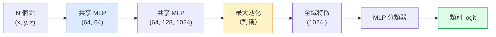

# 3D 視覺（3D vision）：點雲（point cloud）與 NeRF

> 3D 視覺有兩種形態。點雲是感測器的原始輸出。NeRF 是學出來的體積場（volumetric field）。兩者都在回答「空間裡什麼東西在哪裡」。

**Type:** Learn + Build
**Languages:** Python
**Prerequisites:** Phase 4 Lesson 03 (CNNs), Phase 1 Lesson 12 (Tensor Operations)
**Time:** ~45 minutes

## Learning Objectives｜學習目標

- 分辨顯式（點雲、網格（mesh）、體素（voxel））和隱式（有號距離場（signed distance field）、NeRF）的 3D 表示，以及各自什麼時候用
- 理解 PointNet 的對稱函數手法：讓神經網路（neural network）對一組沒有順序的點做到排列不變（permutation-invariant）
- 把 NeRF 的前向傳遞（forward pass）走一遍：射線投射（ray casting）、體積渲染（volumetric rendering）、位置編碼（positional encoding）、密度加顏色的 MLP 頭
- 用 `nerfstudio` 或 `instant-ngp`，從一小組帶有相機姿態的影像做預訓練的 3D 重建

## The Problem｜問題

相機產出 2D 影像。LIDAR 產出一組沒有順序的 3D 點。運動恢復結構（structure-from-motion）的管線（pipeline）產出稀疏的 3D 關鍵點雲。NeRF 從少數幾張帶有相機姿態的影像重建整個 3D 場景。這些都是「視覺」，但沒有一個長得像 CNN 想要的那種稠密張量（tensor）。

3D 視覺要緊，是因為幾乎每個高價值的機器人任務都在 3D 裡跑：抓取、避障、導航、AR 遮擋、3D 內容擷取。只懂 2D 影像的視覺工程師，會進不去這個領域成長最快的那一塊：AR/VR 內容、機器人、自駕堆疊、以及給不動產或營建用的、以 NeRF 為基礎的 3D 重建。

兩種表示各憑不同的理由成為主流。感測器可直接提供點雲。NeRF 和它的後繼（3D Gaussian splatting、神經 SDF）是你請神經網路去學一個場景時得到的東西。

## The Concept｜核心概念

### 點雲

點雲是 R^3 裡 N 個點組成的、沒有順序的集合。每個點可以再帶特徵（feature），例如顏色、強度、法向量。

```
cloud = [
  (x1, y1, z1, r1, g1, b1),
  (x2, y2, z2, r2, g2, b2),
  ...
  (xN, yN, zN, rN, gN, bN),
]
```

沒有格子，也沒有連接。兩件事讓神經網路很難處理：

- **排列不變**。輸出不能依賴點的順序。
- **N 會變**。同一個模型要處理不同大小的點雲。

PointNet（Qi 等人，2017）用一個想法同時解決：每個點套同一個共享 MLP，再用對稱函數（最大池化）聚合。結果是一個固定大小、不依賴順序的向量。

```
f(P) = max_{p in P} MLP(p)
```

這就是 PointNet 的全部核心。更深的變體（PointNet++、Point Transformer）加上階層抽樣和局部聚合，對稱函數這個手法沒變。

### PointNet 架構



「共享 MLP」是說同一個 MLP 對每個點獨立跑。實作上，為了效率，會把點那一維做成 1x1 卷積（convolution）。

### 神經輻射場（NeRF）

NeRF（Mildenhall 等人，2020）問的是「能不能從 N 張照片重建一個 3D 場景」，答案是一個本身就是場景的神經網路。網路把 `(x, y, z, viewing_direction)` 映到 `(density, colour)`。要渲染一個新視角，就是對這個網路做一圈射線投射。

```
NeRF MLP:  (x, y, z, theta, phi) -> (sigma, r, g, b)

To render a pixel (u, v) of a new view:
  1. Cast a ray from the camera through pixel (u, v)
  2. Sample points along the ray at distances t_1, t_2, ..., t_N
  3. Query the MLP at each point
  4. Composite the colours weighted by (1 - exp(-sigma * dt))
  5. The sum is the rendered pixel colour
```

損失（loss）拿渲染出來的像素（pixel），去比訓練照片裡的真實像素。對渲染那一步做反向傳播（backpropagation），更新 MLP。沒有 3D 的真實標籤，也沒有顯式幾何。場景存在 MLP 的權重（weight）裡。

### NeRF 裡的位置編碼

一般的 MLP 吃 `(x, y, z)`，表示不了高頻細節，因為 MLP 在頻譜上偏向低頻。NeRF 的修法是進 MLP 之前，把每個座標編成傅立葉特徵向量：

```
gamma(p) = (sin(2^0 pi p), cos(2^0 pi p), sin(2^1 pi p), cos(2^1 pi p), ...)
```

頻率層數到 L=10。這和 transformer 用來表示位置的手法相同，擴散的時間條件（第 10 課）也再用一次。沒有它，NeRF 看起來是糊的。

### 體積渲染

```
C(r) = sum_i T_i * (1 - exp(-sigma_i * delta_i)) * c_i

T_i  = exp(- sum_{j<i} sigma_j * delta_j)
delta_i = t_{i+1} - t_i
```

`T_i` 是透射率：光走到點 i 還剩多少。`(1 - exp(-sigma_i * delta_i))` 是點 i 的不透明度。`c_i` 是顏色。最後的像素是射線上的加權和。

### 什麼取代了 NeRF

純 NeRF 訓練慢（幾小時），渲染也慢（一張影像要幾秒）。之後的譜系：

- **Instant-NGP**（2022）。雜湊網格編碼換掉 MLP 的位置輸入。幾秒就訓練完。
- **Mip-NeRF 360**。處理無界場景，並做反鋸齒。
- **3D Gaussian Splatting**（2023）。用幾百萬個 3D 高斯換掉體積場。幾分鐘訓練完，即時渲染。這是目前正式環境的預設。

2026 年幾乎每個真正的 NeRF 產品，其實都是 3D Gaussian splatting。心智模型仍是 NeRF。

### 資料集（dataset）和基準

- **ShapeNet**。把 3D CAD 模型當成點雲，做分類和分割。
- **ScanNet**。真實室內掃描，做分割。
- **KITTI**。戶外 LIDAR 點雲，給自駕用。
- **NeRF Synthetic** / **Blended MVS**。有姿態影像的資料集，做視角合成。
- **Mip-NeRF 360** 資料集。無界的真實場景。

```figure
nerf-rays
```

## Build It｜動手實作

### 步驟 1：PointNet 分類器

```python
import torch
import torch.nn as nn

class PointNet(nn.Module):
    def __init__(self, num_classes=10):
        super().__init__()
        self.mlp1 = nn.Sequential(
            nn.Conv1d(3, 64, 1),    nn.BatchNorm1d(64),   nn.ReLU(inplace=True),
            nn.Conv1d(64, 64, 1),   nn.BatchNorm1d(64),   nn.ReLU(inplace=True),
        )
        self.mlp2 = nn.Sequential(
            nn.Conv1d(64, 128, 1),  nn.BatchNorm1d(128),  nn.ReLU(inplace=True),
            nn.Conv1d(128, 1024, 1), nn.BatchNorm1d(1024), nn.ReLU(inplace=True),
        )
        self.head = nn.Sequential(
            nn.Linear(1024, 512),   nn.BatchNorm1d(512),  nn.ReLU(inplace=True),
            nn.Dropout(0.3),
            nn.Linear(512, 256),    nn.BatchNorm1d(256),  nn.ReLU(inplace=True),
            nn.Dropout(0.3),
            nn.Linear(256, num_classes),
        )

    def forward(self, x):
        # x: (N, 3, num_points) — transposed for Conv1d
        x = self.mlp1(x)
        x = self.mlp2(x)
        x = torch.max(x, dim=-1)[0]       # (N, 1024)
        return self.head(x)

pts = torch.randn(4, 3, 1024)
net = PointNet(num_classes=10)
print(f"output: {net(pts).shape}")
print(f"params: {sum(p.numel() for p in net.parameters()):,}")
```

大約 160 萬個參數（parameter）。每朵點雲跑 1,024 個點。

### 步驟 2：位置編碼

```python
def positional_encoding(x, L=10):
    """
    x: (..., D) -> (..., D * 2 * L)
    """
    freqs = 2.0 ** torch.arange(L, dtype=x.dtype, device=x.device)
    args = x.unsqueeze(-1) * freqs * 3.141592653589793
    sinc = torch.cat([args.sin(), args.cos()], dim=-1)
    return sinc.reshape(*x.shape[:-1], -1)

x = torch.randn(5, 3)
y = positional_encoding(x, L=10)
print(f"input:  {x.shape}")
print(f"encoded: {y.shape}     # (5, 60)")
```

乘上 `2^l * pi`，頻率一層比一層高。

### 步驟 3：很小的 NeRF MLP

```python
class TinyNeRF(nn.Module):
    def __init__(self, L_pos=10, L_dir=4, hidden=128):
        super().__init__()
        self.L_pos = L_pos
        self.L_dir = L_dir
        pos_dim = 3 * 2 * L_pos
        dir_dim = 3 * 2 * L_dir
        self.trunk = nn.Sequential(
            nn.Linear(pos_dim, hidden), nn.ReLU(inplace=True),
            nn.Linear(hidden, hidden),  nn.ReLU(inplace=True),
            nn.Linear(hidden, hidden),  nn.ReLU(inplace=True),
            nn.Linear(hidden, hidden),  nn.ReLU(inplace=True),
        )
        self.sigma = nn.Linear(hidden, 1)
        self.color = nn.Sequential(
            nn.Linear(hidden + dir_dim, hidden // 2), nn.ReLU(inplace=True),
            nn.Linear(hidden // 2, 3), nn.Sigmoid(),
        )

    def forward(self, x, d):
        x_enc = positional_encoding(x, self.L_pos)
        d_enc = positional_encoding(d, self.L_dir)
        h = self.trunk(x_enc)
        sigma = torch.relu(self.sigma(h)).squeeze(-1)
        rgb = self.color(torch.cat([h, d_enc], dim=-1))
        return sigma, rgb

nerf = TinyNeRF()
x = torch.randn(128, 3)
d = torch.randn(128, 3)
s, c = nerf(x, d)
print(f"sigma: {s.shape}   rgb: {c.shape}")
```

和原始 NeRF 比起來很小。原始的有兩條深度 8 的 MLP 主幹。這裡夠用來把架構走一遍。

### 步驟 4：沿一條射線做體積渲染

```python
def volumetric_render(sigma, rgb, t_vals):
    """
    sigma: (..., N_samples)
    rgb:   (..., N_samples, 3)
    t_vals: (N_samples,) distances along the ray
    """
    delta = torch.cat([t_vals[1:] - t_vals[:-1], torch.full_like(t_vals[:1], 1e10)])
    alpha = 1.0 - torch.exp(-sigma * delta)
    trans = torch.cumprod(torch.cat([torch.ones_like(alpha[..., :1]), 1.0 - alpha + 1e-10], dim=-1), dim=-1)[..., :-1]
    weights = alpha * trans
    rendered = (weights.unsqueeze(-1) * rgb).sum(dim=-2)
    depth = (weights * t_vals).sum(dim=-1)
    return rendered, depth, weights


N = 64
t_vals = torch.linspace(2.0, 6.0, N)
sigma = torch.rand(N) * 0.5
rgb = torch.rand(N, 3)
rendered, depth, weights = volumetric_render(sigma, rgb, t_vals)
print(f"rendered colour: {rendered.tolist()}")
print(f"depth:           {depth.item():.2f}")
```

一條射線、64 個樣本，合成一個 RGB 像素和一個深度。

## Use It｜實際應用

真正要做的時候：

- `nerfstudio`（Tancik 等人）。目前 NeRF、Instant-NGP、Gaussian Splatting 的參考函式庫（library）。命令列，再加上一個網頁檢視器。
- `pytorch3d`（Meta）。可微分渲染、點雲工具、網格操作。
- `open3d`。點雲處理、配準、視覺化。

部署時，3D Gaussian splatting 大致已經取代純 NeRF，因為渲染快 100 倍。重建品質差不多。

## Ship It｜交付成果

本課會產出：

- `outputs/prompt-3d-task-router.md`：一份 prompt，依任務和輸入資料，導到對的 3D 表示：點雲、網格、體素、NeRF、Gaussian splat
- `outputs/skill-point-cloud-loader.md`：一項技能，為 .ply、.pcd、.xyz 檔寫一個 PyTorch `Dataset`，把正規化（normalization）、置中和點的抽樣做對

## Exercises｜練習

1. **（簡單）** 顯示 PointNet 是排列不變的：同一朵點雲跑兩次，第二次把點打亂。確認輸出在浮點誤差以內相同。
2. **（中等）** 實作一個最小的射線生成函式。給定相機內參和姿態，為 H x W 影像的每個像素產出射線原點和方向。
3. **（困難）** 在一個合成資料集上訓練 TinyNeRF：一個上色立方體的多個渲染視角（用可微分渲染或簡單的射線追蹤產生）。回報第 1、10、100 個 epoch（訓練週期）的渲染損失。到第幾個 epoch，模型才產出看得出的視角？

## Key Terms｜關鍵術語

| 術語 | 常見說法 | 實際意義 |
|------|----------------|----------------------|
| 點雲 | 「LIDAR 的 3D 點」 | 沒有順序的 (x, y, z) 集合，每個點可以再帶特徵 |
| PointNet | 「第一個跑在點雲上的神經網路」 | 每個點一個共享 MLP，加上對稱的最大池化。構造上就是排列不變 |
| NeRF | 「本身就是場景的 MLP」 | 把 (x, y, z, 方向) 映到（密度、顏色）的網路。用射線投射來渲染 |
| 位置編碼 | 「傅立葉特徵」 | 把每個座標編成多個頻率的 sin 和 cos，克服 MLP 的低頻偏誤 |
| 體積渲染 | 「沿射線積分」 | 用透射率和 alpha，把射線上的樣本合成一個像素 |
| Instant-NGP | 「雜湊網格版 NeRF」 | 用多解析度雜湊網格換掉 NeRF 的座標 MLP。快 100 到 1000 倍 |
| 3D Gaussian splatting | 「幾百萬個高斯」 | 場景是一堆 3D 高斯。即時渲染，幾分鐘訓練完 |
| SDF | 「有號距離場」 | 回傳到最近表面的有號距離的函式（function）。另一種隱式表示 |

## Further Reading｜延伸閱讀

- [PointNet (Qi et al., 2017)](https://arxiv.org/abs/1612.00593) ——排列不變的分類器
- [NeRF (Mildenhall et al., 2020)](https://arxiv.org/abs/2003.08934) ——把「用照片做 3D 重建」變成神經網路問題的那篇
- [Instant-NGP (Müller et al., 2022)](https://arxiv.org/abs/2201.05989) ——雜湊網格，快 1000 倍
- [3D Gaussian Splatting (Kerbl et al., 2023)](https://arxiv.org/abs/2308.04079) ——在正式環境裡取代 NeRF 的那個架構
