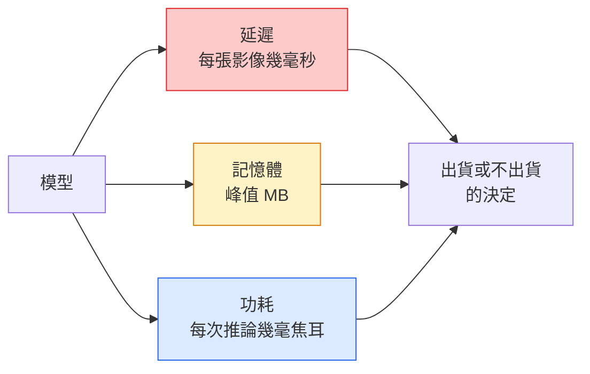

# 即時視覺（real-time vision）：邊緣部署

> 邊緣推論（edge inference）要做的，是讓一個準確率約 90 的模型，在 2 GB 記憶體的裝置（device）上跑到每秒 30 影格。準確率每一個百分點，都在跟幾毫秒的延遲交換。

**Type:** Learn + Build
**Languages:** Python
**Prerequisites:** Phase 4 Lesson 04 (Image Classification), Phase 10 Lesson 11 (Quantization)
**Time:** ~75 minutes

## Learning Objectives｜學習目標

- 量任何 PyTorch 模型的推論延遲（inference latency）、峰值記憶體（peak memory）和吞吐量（throughput），並讀懂 FLOPs、參數與延遲之間的取捨
- 用 PyTorch 的訓練後量化（quantisation），把視覺模型量化成 INT8，並確認準確率（accuracy）掉不到 1%
- 匯出成 ONNX，再用 ONNX Runtime 或 TensorRT 編譯。說出三種最常見的匯出失敗，以及怎麼修
- 說明在邊緣限制下，什麼時候選 MobileNetV3、EfficientNet-Lite、ConvNeXt-Tiny 或 MobileViT

## The Problem｜問題

訓練時的視覺模型是一頭浮點怪獸。1 億個參數（parameter），每次前向傳遞（forward pass）10 GFLOPs，2 GB 的 VRAM。這些放不進手機、車載資訊系統、工業相機或無人機。把視覺系統送出去，意思是把同樣的預測塞進小 100 倍的預算。

三顆旋鈕做掉大部分的事：模型怎麼選（較小的架構，配方相同）、量化（INT8，不是 FP32）、推論執行環境（inference runtime）（ONNX Runtime、TensorRT、Core ML、TFLite）。這三顆轉對了，差別就是工作站上的示範，和 30 美元相機模組上能出貨的產品。

本課先把測量的規矩立起來。沒量到的東西就無法調。再把三顆旋鈕走一遍。目標不是把每個邊緣執行環境都學會，而是知道有哪些槓桿，以及怎麼驗證每一個做的是你以為的那件事。

## The Concept｜核心概念

### 三個預算



- **延遲**。p50、p95、p99。只平均 p50，會把即時系統在意的尾端藏起來。
- **峰值記憶體**。裝置曾使用的最高記憶體量，不是穩態平均。在這類裝置上，記憶體爆掉是致命的。
- **功耗／能量**。靠電池的裝置上，每次推論幾毫焦耳。常常用 CPU 或 GPU 使用率乘上時間來代替。

邊緣的決定，是從一張表來的：模型、延遲、記憶體、準確率。每一格都在目標裝置上量，不是在工作站上量。

### 測量的規矩

每個邊緣裝置的效能剖析都該守三條：

1. **先暖機**。量之前用 5 到 10 次假的前向傳遞把模型跑熱。冷的快取和 JIT 編譯，會讓頭幾個數字不能代表。
2. **同步**。計時區塊前後都呼叫 `torch.cuda.synchronize()`。不然你量到的是核的派送，不是核的執行。
3. **把輸入大小固定成正式環境的解析度**。224x224 的延遲不是 512x512 的延遲。

### 用 FLOPs 當代理

FLOPs（每次推論的浮點運算數）是便宜、與裝置無關的延遲代理指標；適合比較架構，但拿來當實際執行時間會誤導。FLOPs 多 10% 的模型，實務上可以快 2 倍，因為它用的是硬體友善的運算（深度卷積（depthwise convolution）編譯得很好，大的 7x7 卷積則否）。

規則：找架構用 FLOPs，部署的決定用裝置上的延遲。

### 一段話講完量化

把 FP32 的權重（weight）和活化值換成 INT8。模型大小降為四分之一，記憶體頻寬降為四分之一，在有 INT8 核的硬體上計算量降到 2 到 4 分之 1（每顆現代手機 SoC、每張有 Tensor Core 的 NVIDIA GPU）。視覺任務上，訓練後靜態量化的準確率通常只掉 0.1 到 1 個百分點。

種類：

- **動態**。把權重轉成 INT8，活化值仍用浮點算。容易，加速不大。
- **靜態（訓練後）**。權重也轉成 INT8，並用一小份校正集校準活化值的範圍。比動態快很多。
- **量化感知訓練（quantisation-aware training, QAT）**。訓練時模擬量化，讓模型繞著它學。準確率最好，需要有標籤的資料。

對視覺來說，訓練後靜態量化用 5% 的力氣拿到 95% 的好處。只有 PTQ 掉的準確率不能接受時，才用 QAT。

### 剪枝（pruning）和知識蒸餾（knowledge distillation）

- **剪枝（pruning）**。拿掉不重要的權重（依絕對值），或拿掉通道（channel）（結構化）。參數過多的模型上有效。已經很緊的架構上用處較小。
- **知識蒸餾（knowledge distillation）**。訓練一個小的學生去模仿大老師的 logit。模型縮小後損失的準確率，常常大部分補得回來。正式環境的邊緣模型常用這招。

### 推論執行環境（inference runtime）

- **PyTorch 立即執行（eager）**。慢，不是拿來部署的。只在開發時用。
- **TorchScript**。舊的。已被 `torch.compile` 和 ONNX 匯出取代。
- **ONNX Runtime**。中立的執行環境。CPU、CUDA、CoreML、TensorRT、OpenVINO 都有 ONNX 提供者。從這裡開始。
- **TensorRT**。NVIDIA 的編譯器。NVIDIA GPU（工作站和 Jetson）上延遲最好。可以接 ONNX Runtime，也可以單獨用。
- **Core ML**。Apple 給 iOS 和 macOS 的執行環境。要 `.mlmodel` 或 `.mlpackage`。
- **TFLite**。Google 給 Android 和 ARM 的執行環境。要 `.tflite`。
- **OpenVINO**。Intel 給 CPU 和 VPU 的執行環境。要 `.xml` 加 `.bin`。

實務上：PyTorch 匯出成 ONNX，再依目標挑執行環境。ONNX 是共通語言。

### 邊緣架構怎麼挑

| 預算 | 模型 | 為什麼 |
|--------|-------|-----|
| 參數少於 300 萬 | MobileNetV3-Small | 到處都編譯得動，基準（baseline）不錯 |
| 300 萬到 1000 萬 | EfficientNet-Lite-B0 | 在 TFLite 上，參數效率最佳 |
| 1000 萬到 2000 萬 | ConvNeXt-Tiny | 參數效率最佳，對 CPU 友善 |
| 2000 萬到 3000 萬 | MobileViT-S 或 EfficientViT | 有 ImageNet 準確率的 transformer |
| 3000 萬到 8000 萬 | Swin-V2-Tiny | 堆疊支援視窗注意力時再用 |

除非有特定理由，這些都量化成 INT8。

```figure
cnn-param-count
```

## Build It｜動手實作

### 步驟 1：把延遲量對

```python
import time
import torch

def measure_latency(model, input_shape, device="cpu", warmup=10, iters=50):
    model = model.to(device).eval()
    x = torch.randn(input_shape, device=device)
    with torch.no_grad():
        for _ in range(warmup):
            model(x)
        if device == "cuda":
            torch.cuda.synchronize()
        times = []
        for _ in range(iters):
            if device == "cuda":
                torch.cuda.synchronize()
            t0 = time.perf_counter()
            model(x)
            if device == "cuda":
                torch.cuda.synchronize()
            times.append((time.perf_counter() - t0) * 1000)
    times.sort()
    return {
        "p50_ms": times[len(times) // 2],
        "p95_ms": times[int(len(times) * 0.95)],
        "p99_ms": times[int(len(times) * 0.99)],
        "mean_ms": sum(times) / len(times),
    }
```

先暖機、再同步、用 `time.perf_counter()`。報百分位數，不要只報平均。

### 步驟 2：參數和 FLOP 數量

```python
def parameter_count(model):
    return sum(p.numel() for p in model.parameters())

def flops_estimate(model, input_shape):
    """
    Rough FLOP count for a conv/linear-only model. For production use `fvcore` or `ptflops`.
    """
    total = 0
    def conv_hook(m, inp, out):
        nonlocal total
        c_out, c_in, kh, kw = m.weight.shape
        h, w = out.shape[-2:]
        total += 2 * c_in * c_out * kh * kw * h * w
    def linear_hook(m, inp, out):
        nonlocal total
        total += 2 * m.in_features * m.out_features
    hooks = []
    for m in model.modules():
        if isinstance(m, torch.nn.Conv2d):
            hooks.append(m.register_forward_hook(conv_hook))
        elif isinstance(m, torch.nn.Linear):
            hooks.append(m.register_forward_hook(linear_hook))
    model.eval()
    with torch.no_grad():
        model(torch.randn(input_shape))
    for h in hooks:
        h.remove()
    return total
```

真正的專案用 `fvcore.nn.FlopCountAnalysis` 或 `ptflops`。它們把每種模組都算對。

### 步驟 3：訓練後靜態量化

```python
def quantise_ptq(model, calibration_loader, backend="x86"):
    import torch.ao.quantization as tq
    model = model.eval().cpu()
    model.qconfig = tq.get_default_qconfig(backend)
    tq.prepare(model, inplace=True)
    with torch.no_grad():
        for x, _ in calibration_loader:
            model(x)
    tq.convert(model, inplace=True)
    return model
```

三步：設定、準備（插入觀察器）、用真實資料校正、轉換（融合再量化）。模型得先融合，`Conv -> BN -> ReLU` 變成 `ConvBnReLU`。`torch.ao.quantization.fuse_modules` 會處理。

### 步驟 4：匯出成 ONNX

```python
def export_onnx(model, sample_input, path="model.onnx"):
    model = model.eval()
    torch.onnx.export(
        model,
        sample_input,
        path,
        input_names=["input"],
        output_names=["output"],
        dynamic_axes={"input": {0: "batch"}, "output": {0: "batch"}},
        opset_version=17,
    )
    return path
```

2026 年 `opset_version=17` 是安全的預設。`dynamic_axes` 讓 ONNX 模型能跑任意批次大小。

### 步驟 5：把幾種設定放在一起比

```python
import torch.nn as nn
from torchvision.models import mobilenet_v3_small

def compare_regimes():
    model = mobilenet_v3_small(weights=None, num_classes=10)
    params = parameter_count(model)
    flops = flops_estimate(model, (1, 3, 224, 224))
    lat_fp32 = measure_latency(model, (1, 3, 224, 224), device="cpu")
    print(f"FP32 MobileNetV3-Small: {params:,} params  {flops/1e9:.2f} GFLOPs  "
          f"p50={lat_fp32['p50_ms']:.2f}ms  p95={lat_fp32['p95_ms']:.2f}ms")
```

同一個函式再跑 `resnet50`、`efficientnet_v2_s` 和 `convnext_tiny`，部署決定要用的比較表就有了。

## Use It｜實際應用

正式環境的堆疊會收斂成三條路之一：

- **網頁或無伺服器**。PyTorch 到 ONNX，再到 ONNX Runtime（CPU 或 CUDA 提供者）。最容易，大多數情況夠用。
- **NVIDIA 邊緣（Jetson、GPU 伺服器）**。PyTorch 到 ONNX，再到 TensorRT。延遲最好，工程量也最大。
- **行動裝置**。PyTorch 到 ONNX，再到 Core ML（iOS）或 TFLite（Android）。匯出前先量化。

測量可以用 `torch-tb-profiler`、`nvprof` 或 `nsys`，macOS 上用 Instruments，一層一層拆開。`benchmark_app`（OpenVINO）和 `trtexec`（TensorRT）可直接從命令列取得獨立的基準數字。

## Ship It｜交付成果

本課會產出：

- `outputs/prompt-edge-deployment-planner.md`：一份 prompt，依目標裝置和延遲 SLA，挑骨幹（backbone）、量化策略和執行環境
- `outputs/skill-latency-profiler.md`：一項技能，寫出完整的延遲基準腳本，含暖機、同步、百分位數和記憶體追蹤

## Exercises｜練習

1. **（簡單）** 在 CPU、224x224 上，量 `resnet18`、`mobilenet_v3_small`、`efficientnet_v2_s`、`convnext_tiny` 的 p50 延遲。把表報出來，並指出哪個架構的準確率除以毫秒最好。
2. **（中等）** 對 `mobilenet_v3_small` 做訓練後靜態量化。在 CIFAR-10 或類似資料的留出子集上，回報 FP32 對 INT8 的延遲，以及準確率掉多少。
3. **（困難）** 把 `convnext_tiny` 匯出成 ONNX，用 `onnxruntime` 的 `CPUExecutionProvider` 跑，和 PyTorch 立即執行的基準比延遲。找出 ONNX Runtime 第一次變快的那一層，並說明為什麼。

## Key Terms｜關鍵術語

| 術語 | 常見說法 | 實際意義 |
|------|----------------|----------------------|
| 延遲 | 「有多快」 | 從輸入到輸出的時間。看 p50、p95、p99，不看平均 |
| FLOPs | 「模型大小」 | 每次前向傳遞的浮點運算數。計算量的粗代理 |
| INT8 量化 | 「8 位元」 | 把 FP32 權重和活化值換成 8 位元整數。大約小 4 倍，快 2 到 4 倍 |
| PTQ | 「訓練後量化」 | 訓練好的模型直接量化，不再訓練。容易，通常夠用 |
| QAT | 「量化感知訓練」 | 訓練時模擬量化。準確率最好，需要有標籤的資料 |
| ONNX | 「中立格式」 | 主流推論執行環境（inference runtime）都支援的模型交換格式 |
| TensorRT | 「NVIDIA 的編譯器」 | 把 ONNX 編成給 NVIDIA GPU 用的引擎 |
| 知識蒸餾（knowledge distillation） | 「老師到學生」 | 訓練小模型去模仿大模型的 logit。模型縮小後損失的準確率大部分補得回來 |

## Further Reading｜延伸閱讀

- [EfficientNet (Tan & Le, 2019)](https://arxiv.org/abs/1905.11946) ——高效率架構的複合縮放
- [MobileNetV3 (Howard et al., 2019)](https://arxiv.org/abs/1905.02244) ——行動優先的架構，用 h-swish 和 squeeze-excite
- [Accelerating Inference Up to 6x Faster in PyTorch with Torch-TensorRT (NVIDIA)](https://developer.nvidia.com/blog/accelerating-inference-up-to-6x-faster-in-pytorch-with-torch-tensorrt/) ——怎麼真正拿到論文裡的吞吐量數字
- [ONNX Runtime docs](https://onnxruntime.ai/docs/) ——量化、圖的重整、提供者怎麼選
