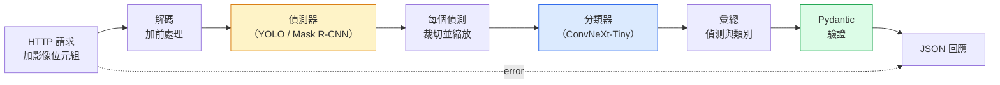

# 打造完整的視覺管線（vision pipeline）：總整課

> 正式環境的視覺系統，是一串模型和規則，用資料契約（data contract）縫在一起。零件這階段都有了。這堂總整課把它們從頭到尾接起來。

**Type:** Build
**Languages:** Python
**Prerequisites:** Phase 4 Lessons 01-15
**Time:** ~120 minutes

## Learning Objectives｜學習目標

- 設計一條正式環境的視覺管線（pipeline）：偵測物件、分類，並送出結構化的 JSON。每條失敗路徑都要處理
- 把偵測器（detector，Mask R-CNN 或 YOLO）、分類器（classifier，ConvNeXt-Tiny）、資料契約（Pydantic）接進同一個服務
- 對整條管線做基準測試，找出第一個瓶頸（bottleneck）。通常先是前處理（preprocessing），然後是偵測器
- 交付一個最小的 FastAPI 服務：接受影像上傳、跑管線、回傳帶分類的偵測結果

## The Problem｜問題

單獨的視覺模型有用。視覺產品是把它們串成鏈。零售貨架盤點是偵測器，加上產品分類器，加上價格 OCR 管線。自駕是 2D 偵測器，加上 3D 偵測器，加上分割器，加上追蹤器，加上規劃器。醫療初篩是分割器，加上區域分類器，加上臨床人員的介面。

把這些鏈串起來，才是機器學習原型和產品的差別。模型之間的每個介面都是新的 bug 位置。每次座標轉換、每次正規化（normalization）、每次遮罩縮放，都可能在沒有明顯錯誤訊息的情況下失敗。管線有多強，取決於最弱的那個介面。

這堂總整課搭最小可用的管線：偵測、分類、結構化輸出、一層服務。第 4 階段的其他東西都能插進這個骨架：把 Mask R-CNN 換成 YOLOv8、加上 OCR 頭、加上分割支線、加上追蹤器。架構是穩的。零件可以換。

## The Concept｜核心概念

### 這條管線



七個階段。兩個模型階段很貴。問題通常出在另外五個階段。

### 用 Pydantic 寫資料契約

每個模型邊界都變成有型別的物件。靜默的失敗就變成會大聲報出來的失敗。

```
Detection(
    box: tuple[float, float, float, float],   # (x1, y1, x2, y2), absolute pixels
    score: float,                              # [0, 1]
    class_id: int,                             # from detector's label map
    mask: Optional[list[list[int]]],           # RLE-encoded if present
)

PipelineResult(
    image_id: str,
    detections: list[Detection],
    classifications: list[Classification],
    inference_ms: float,
)
```

偵測器如果回的框是 `(cx, cy, w, h)`，不是 `(x1, y1, x2, y2)`，Pydantic 會在邊界驗證失敗。你立刻知道，不用再去追下游那個靜默回傳空區域的裁切。

### 延遲花在哪

幾乎每條視覺管線都有三件事實：

1. **前處理常常是最大的單一區塊。** 解 JPEG、轉色彩空間（color space）、縮放。這些吃 CPU，也容易忘掉。
2. **偵測器佔掉大部分 GPU 時間。** GPU 時間的 70% 到 90% 在偵測的前向傳遞（forward pass）。
3. **後處理（NMS、RLE 編碼和解碼）在 GPU 上便宜，在 CPU 上貴。** 一律用真正的目標裝置做剖析。

知道時間怎麼分布，調校才會變成一份有優先順序的清單。

### 失敗模式

- **沒有偵測**。回傳空清單，不要當掉。記下來。
- **框超出範圍**。裁切前先夾進影像大小。
- **裁切太小**。框小於分類器的最小輸入，就跳過分類。
- **上傳壞掉**。回 400，帶一個明確的錯誤碼，不要回 500。
- **模型載入失敗**。在服務啟動時失敗，不要等到第一筆請求。

正式環境的管線處理每一種，都不用那種把失敗藏起來的泛用 `try/except`。每種失敗都有自己的錯誤碼，也有自己的回應。

### 批次

正式環境的服務同時服務多個客戶。把多筆請求的偵測和分類做成批次，會成倍提升吞吐量（throughput）。代價是多等批次湊滿的延遲。典型做法：最多等 20 毫秒把請求收進來，一起處理，再把回應分回去。`torchserve` 和 `triton` 原生就做這件事。負載可預期的小服務，會自己寫一個微批次器。

```figure
v4-vision-pipeline
```

## Build It｜動手實作

### 步驟 1：資料契約

```python
from pydantic import BaseModel, Field
from typing import List, Optional, Tuple

class Detection(BaseModel):
    box: Tuple[float, float, float, float]
    score: float = Field(ge=0, le=1)
    class_id: int = Field(ge=0)
    mask_rle: Optional[str] = None


class Classification(BaseModel):
    detection_index: int
    class_id: int
    class_name: str
    score: float = Field(ge=0, le=1)


class PipelineResult(BaseModel):
    image_id: str
    detections: List[Detection]
    classifications: List[Classification]
    inference_ms: float
```

五秒鐘的程式，省下任何認真管線一小時的除錯。

### 步驟 2：一個最小的 Pipeline 類別

```python
import time
import numpy as np
import torch
from PIL import Image

class VisionPipeline:
    def __init__(self, detector, classifier, class_names,
                 device="cpu", min_crop=32):
        self.detector = detector.to(device).eval()
        self.classifier = classifier.to(device).eval()
        self.class_names = class_names
        self.device = device
        self.min_crop = min_crop

    def preprocess(self, image):
        """
        image: PIL.Image or np.ndarray (H, W, 3) uint8
        returns: CHW float tensor on device
        """
        if isinstance(image, Image.Image):
            image = np.asarray(image.convert("RGB"))
        tensor = torch.from_numpy(image).permute(2, 0, 1).float() / 255.0
        return tensor.to(self.device)

    @torch.no_grad()
    def detect(self, image_tensor):
        return self.detector([image_tensor])[0]

    @torch.no_grad()
    def classify(self, crops):
        if len(crops) == 0:
            return []
        batch = torch.stack(crops).to(self.device)
        logits = self.classifier(batch)
        probs = logits.softmax(-1)
        scores, cls = probs.max(-1)
        return list(zip(cls.tolist(), scores.tolist()))

    def run(self, image, image_id="anonymous"):
        t0 = time.perf_counter()
        tensor = self.preprocess(image)
        det = self.detect(tensor)

        crops = []
        detections = []
        valid_indices = []
        for i, (box, score, cls) in enumerate(zip(det["boxes"], det["scores"], det["labels"])):
            x1, y1, x2, y2 = [max(0, int(b)) for b in box.tolist()]
            x2 = min(x2, tensor.shape[-1])
            y2 = min(y2, tensor.shape[-2])
            detections.append(Detection(
                box=(x1, y1, x2, y2),
                score=float(score),
                class_id=int(cls),
            ))
            if (x2 - x1) < self.min_crop or (y2 - y1) < self.min_crop:
                continue
            crop = tensor[:, y1:y2, x1:x2]
            crop = torch.nn.functional.interpolate(
                crop.unsqueeze(0),
                size=(224, 224),
                mode="bilinear",
                align_corners=False,
            )[0]
            crops.append(crop)
            valid_indices.append(i)

        class_preds = self.classify(crops)

        classifications = []
        for valid_idx, (cls_id, cls_score) in zip(valid_indices, class_preds):
            classifications.append(Classification(
                detection_index=valid_idx,
                class_id=int(cls_id),
                class_name=self.class_names[cls_id],
                score=float(cls_score),
            ))

        return PipelineResult(
            image_id=image_id,
            detections=detections,
            classifications=classifications,
            inference_ms=(time.perf_counter() - t0) * 1000,
        )
```

每個介面都有型別。每條失敗路徑都有明確的處理決定。

### 步驟 3：接上偵測器和分類器

```python
from torchvision.models.detection import maskrcnn_resnet50_fpn_v2
from torchvision.models import convnext_tiny

# Use ImageNet-pretrained weights for a realistic pipeline without training
detector = maskrcnn_resnet50_fpn_v2(weights="DEFAULT")
classifier = convnext_tiny(weights="DEFAULT")
class_names = [f"imagenet_class_{i}" for i in range(1000)]

pipe = VisionPipeline(detector, classifier, class_names)

# Smoke test with a synthetic image
test_image = (np.random.rand(400, 600, 3) * 255).astype(np.uint8)
result = pipe.run(test_image, image_id="demo")
print(result.model_dump_json(indent=2)[:500])
```

### 步驟 4：FastAPI 服務

```python
from fastapi import FastAPI, UploadFile, HTTPException
from io import BytesIO

app = FastAPI()
pipe = None  # initialised on startup

@app.on_event("startup")
def load():
    global pipe
    detector = maskrcnn_resnet50_fpn_v2(weights="DEFAULT").eval()
    classifier = convnext_tiny(weights="DEFAULT").eval()
    pipe = VisionPipeline(detector, classifier, class_names=[f"c{i}" for i in range(1000)])

@app.post("/detect")
async def detect_endpoint(file: UploadFile):
    if file.content_type not in {"image/jpeg", "image/png", "image/webp"}:
        raise HTTPException(status_code=400, detail="unsupported image type")
    data = await file.read()
    try:
        img = Image.open(BytesIO(data)).convert("RGB")
    except Exception:
        raise HTTPException(status_code=400, detail="cannot decode image")
    result = pipe.run(img, image_id=file.filename or "upload")
    return result.model_dump()
```

用 `uvicorn main:app --host 0.0.0.0 --port 8000` 跑。用 `curl -F 'file=@dog.jpg' http://localhost:8000/detect` 測。

### 步驟 5：給管線做基準

```python
import time

def benchmark(pipe, num_runs=20, image_size=(400, 600)):
    img = (np.random.rand(*image_size, 3) * 255).astype(np.uint8)
    pipe.run(img)  # warm up

    stages = {"preprocess": [], "detect": [], "classify": [], "total": []}
    for _ in range(num_runs):
        t0 = time.perf_counter()
        tensor = pipe.preprocess(img)
        t1 = time.perf_counter()
        det = pipe.detect(tensor)
        t2 = time.perf_counter()
        crops = []
        for box in det["boxes"]:
            x1, y1, x2, y2 = [max(0, int(b)) for b in box.tolist()]
            x2 = min(x2, tensor.shape[-1])
            y2 = min(y2, tensor.shape[-2])
            if (x2 - x1) >= pipe.min_crop and (y2 - y1) >= pipe.min_crop:
                crop = tensor[:, y1:y2, x1:x2]
                crop = torch.nn.functional.interpolate(
                    crop.unsqueeze(0), size=(224, 224), mode="bilinear", align_corners=False
                )[0]
                crops.append(crop)
        pipe.classify(crops)
        t3 = time.perf_counter()
        stages["preprocess"].append((t1 - t0) * 1000)
        stages["detect"].append((t2 - t1) * 1000)
        stages["classify"].append((t3 - t2) * 1000)
        stages["total"].append((t3 - t0) * 1000)

    for stage, times in stages.items():
        times.sort()
        print(f"{stage:12s}  p50={times[len(times)//2]:7.1f} ms  p95={times[int(len(times)*0.95)]:7.1f} ms")
```

CPU 上的典型輸出：前處理約 3 毫秒，偵測 300 到 500 毫秒，分類 20 到 40 毫秒，總共 350 到 550 毫秒。GPU 上偵測是 20 到 40 毫秒，前處理和分類在相對比例上開始比較要緊。

## Use It｜實際應用

正式環境的範本大致採用相同架構，另外還會加入：

- **模型版本**。回應裡永遠記下模型名稱和權重（weight）雜湊。
- **每筆請求的追蹤 ID**。每個階段的時間都記下來，慢的回應才能對上是哪一段。
- **退路**。分類器逾時，就只回偵測、不帶分類，不要讓整筆請求失敗。
- **安全篩選**。NSFW（不適宜內容）和 PII（個人識別資訊）的篩選，放在分類之後、回應離開服務之前。
- **批次端點**。`/detect_batch` 接受一串影像 URL，做大量處理。

正式環境的服務，`torchserve`、`Triton Inference Server`、`BentoML` 開箱就處理批次、版本、指標（metric）和健康檢查。直接跑 `FastAPI`，對原型和小規模產品夠用。

## Ship It｜交付成果

本課會產出：

- `outputs/prompt-vision-service-shape-reviewer.md`：一份 prompt，檢查視覺服務的程式有沒有違反契約或回應形狀，並指出第一個會壞掉的 bug
- `outputs/skill-pipeline-budget-planner.md`：一項技能，依目標延遲和吞吐量（throughput），把時間預算分給每個階段，並標出哪一段會先超出預算

## Exercises｜練習

1. **（簡單）** 用任何開放資料集的 10 張影像跑這條管線。回報每個階段的平均時間，以及每張影像偵測數量的分布。
2. **（中等）** 給 `Detection` 加上遮罩輸出欄位，並編成 RLE。確認即使是 10 個物件的影像，JSON 仍低於 1MB。
3. **（困難）** 在分類器前面加一個微批次器：最多等 10 毫秒把裁切收齊，一次 GPU 呼叫全部分類，再依請求回結果。量每秒 5 個並行請求時吞吐量（throughput）增加多少，以及多出來的延遲。

## Key Terms｜關鍵術語

| 術語 | 常見說法 | 實際意義 |
|------|----------------|----------------------|
| 管線 | 「那個系統」 | 有順序的前處理、推論（inference）、後處理。每兩段之間有型別的介面 |
| 資料契約 | 「那個結構描述」 | Pydantic 或 dataclass 的定義。每個階段的輸入和輸出都要符合。整合 bug 在邊界就被抓住 |
| 前處理 | 「模型之前」 | 解碼、色彩轉換、縮放、正規化。通常最吃 CPU 時間 |
| 後處理 | 「模型之後」 | NMS、遮罩縮放、門檻、RLE 編碼。GPU 上便宜，CPU 上貴 |
| 微批次器 | 「先收再前向」 | 等一段固定視窗，把多筆請求收齊，跑一次批次前向傳遞 |
| 追蹤 ID | 「請求 id」 | 每筆請求一個識別碼，每個階段都記。慢的請求才能從頭追到尾 |
| 失敗碼 | 「有名字的錯誤」 | 每一類失敗有自己的錯誤碼，不是泛用的 500。用戶端才有辦法重試 |
| 健康檢查 | 「就緒探針」 | 便宜的端點，回報服務能不能回答。負載平衡器靠這個 |

## Further Reading｜延伸閱讀

- [Full Stack Deep Learning — Deploying Models](https://fullstackdeeplearning.com/course/2022/lecture-5-deployment/) ——正式環境機器學習部署的標準總覽
- [BentoML docs](https://docs.bentoml.com) ——帶批次、版本和指標的服務框架
- [torchserve docs](https://pytorch.org/serve/) ——PyTorch 官方的服務函式庫（library）
- [NVIDIA Triton Inference Server](https://developer.nvidia.com/triton-inference-server) ——高吞吐量（throughput）服務，含批次和多模型
