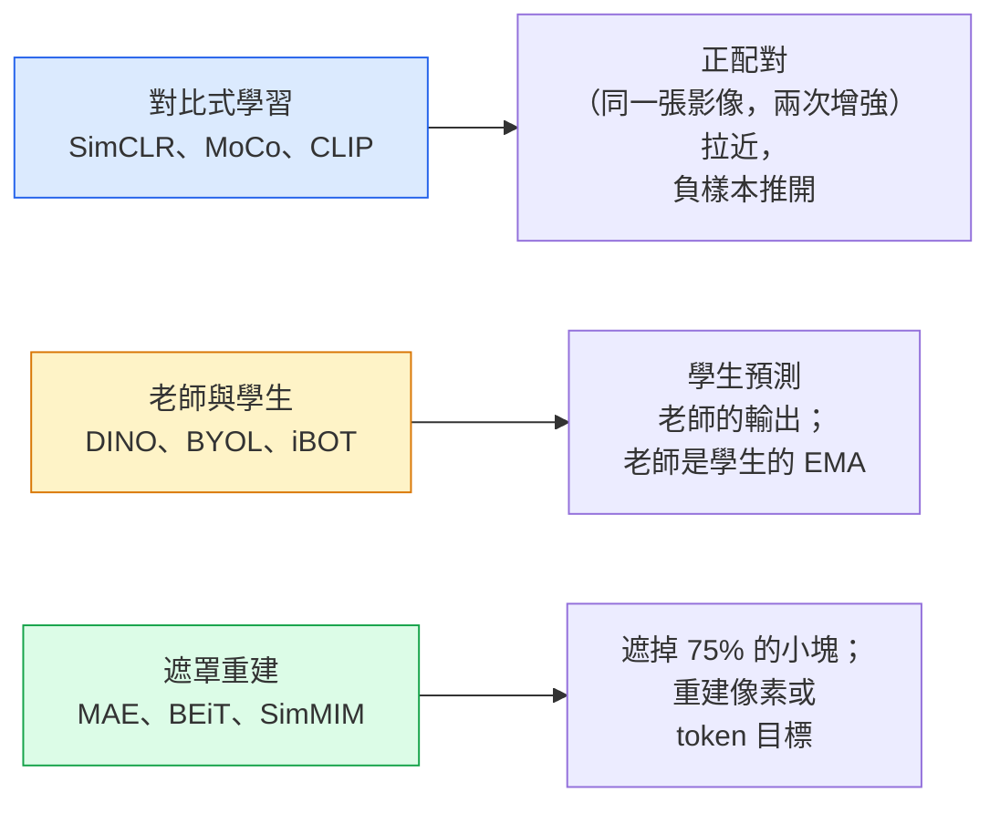

# 自監督視覺（self-supervised vision）：SimCLR、DINO、MAE

> 標籤是監督式視覺的瓶頸（bottleneck）。自監督預訓練把它們拿掉：從 1 億張沒有標籤的影像學視覺特徵（feature），再在 1 萬張有標籤的影像上做 fine-tuning。

**Type:** Learn + Build
**Languages:** Python
**Prerequisites:** Phase 4 Lesson 04 (Image Classification), Phase 4 Lesson 14 (ViT)
**Time:** ~75 minutes

## Learning Objectives｜學習目標

- 把三種主要的自監督方法走一遍：對比式學習（contrastive learning，SimCLR）、老師與學生（teacher-student，DINO）、遮罩重建（masked reconstruction，MAE）。並說明各方法分別最佳化什麼目標
- 從零實作 InfoNCE 損失（loss），並說明為什麼批次 512 行得通、批次 32 會失敗
- 說明為什麼 MAE 的 75% 遮罩比例（mask ratio）不是隨便定的，以及它和 BERT 對文字遮 15% 有何不同
- 用 DINOv2 或 MAE 的 ImageNet 檢查點，做線性探測（linear probe）和零樣本檢索

## The Problem｜問題

監督式 ImageNet 有 130 萬張有標籤的影像，標註成本估計 1000 萬美元。醫療和工業資料集更小，標註更貴。每個視覺團隊都會問：能不能在便宜、沒有標籤的資料上預訓練，YouTube 影格、網頁爬下來的圖、網路攝影機的畫面、衛星掃過的影像，再在一小份有標籤的集合上 fine-tuning？

自監督學習就是答案。一個現代的自監督 ViT，在 LAION 或 JFT 上訓練，fine-tuning 之後能打平或贏過監督式 ImageNet 的準確率（accuracy）。它遷移到下游任務（偵測、分割、深度）也比監督式預訓練好。DINOv2（Meta，2023）和 MAE（Meta，2022）是目前正式環境裡、可遷移視覺特徵的預設。

觀念上的轉變是：前置任務（pretext task），也就是模型被訓練去做的那件事，不必是下游任務。要緊的是它逼模型學到有用的特徵。預測灰階影像的顏色、把影像旋轉再請模型分類轉了幾度、遮住小塊再重建，這些都做成功過。能放大的三種是對比式學習、老師與學生的蒸餾、以及遮罩重建。

## The Concept｜核心概念

### 三個家族



### 對比式學習（SimCLR）

拿一張影像，做兩次隨機增強（augmentation），得到兩個視角。兩個都送進同一個編碼器（encoder）加上投影頭。損失函數會拉近這兩個 embedding，並讓它遠離批次中其他影像的 embedding。

```
Loss for positive pair (z_i, z_j) among 2N views per batch:

   L_ij = -log( exp(sim(z_i, z_j) / tau) / sum_k in batch \ {i} exp(sim(z_i, z_k) / tau) )

sim = cosine similarity
tau = temperature (0.1 standard)
```

這就是 InfoNCE 損失。每個正樣本需要很多負樣本，所以批次大小要緊。SimCLR 要 512 到 8192。MoCo 用過去批次的動量佇列，把負樣本數量和批次大小拆開。

### 老師與學生（DINO）

兩個架構相同的網路：學生和老師。老師是學生權重（weight）的指數移動平均（EMA）。兩者都看這張影像的增強視角。學生的輸出被訓練去對上老師的輸出。沒有顯式的負樣本。

```
loss = CE( student_output(view_1),  teacher_output(view_2) )
     + CE( student_output(view_2),  teacher_output(view_1) )

teacher_weights = m * teacher_weights + (1 - m) * student_weights   (m ≈ 0.996)
```

它為什麼不會塌成「預測一個常數」：老師的輸出會置中（減去每個維度的平均），也會銳化（除以很小的溫度）。置中避免某一個維度獨大。銳化避免輸出塌成均勻分布。

DINO 放大成 DINOv2，用 1.42 億張挑過的影像。得出的特徵，是目前零樣本視覺檢索和稠密預測的最好結果。

### 遮罩重建（MAE）

把 ViT 輸入的 75% 小塊遮掉。編碼器只處理可見的 25% 小塊。一個小解碼器收到編碼器的輸出，再加上被遮位置的 mask token，訓練目標是重建被遮小塊的像素（pixel）。

```
Encoder:  visible 25% of patches -> features
Decoder:  features + mask tokens at masked positions -> reconstructed pixels
Loss:     MSE between reconstructed and original pixels on masked patches only
```

讓 MAE 做得起來的關鍵設計：

- **75% 遮罩比例**。很高。逼編碼器學語意特徵。只重建 25% 幾乎太簡單，鄰近像素相關太高，一個 CNN 就能做得很準。
- **不對稱的編碼器和解碼器**。大的 ViT 編碼器只看得到的小塊。小解碼器（8 層、512 維）負責重建。預訓練比單純的 BEiT 快 3 倍。
- **像素空間的重建目標**。比 BEiT 那種 token 化的目標簡單，在 ViT 上也更好。

預訓練之後丟掉解碼器。編碼器就是特徵萃取器。

### 為什麼是 75%，不是 15%

BERT 遮 15% 的 token。MAE 遮 75%。差別在資訊密度。

- 自然語言每個 token 的熵很高。預測 15% 的 token 仍然難，因為每個被遮的位置都有很多說得通的補法。
- 影像小塊的熵很低。沒被遮的鄰居常常幾乎能決定被遮小塊的像素。要讓預測必須用到語意，就得遮得很兇。

75% 高到單純的空間外推解不了。編碼器必須表示影像的內容。

### 線性探測評估

自監督預訓練之後，標準評估是**線性探測**：凍結編碼器，在上面用 ImageNet 標籤訓練一個線性分類器。回報 top-1 準確率。

- SimCLR ResNet-50：約 71%（2020）
- DINO ViT-S/16：約 77%（2021）
- MAE ViT-L/16：約 76%（2022）
- DINOv2 ViT-g/14：約 86%（2023）

線性探測純粹在量特徵品質。fine-tuning 通常再加 2 到 5 個百分點，但也混進分類頭重新訓練的效果。

```figure
data-augmentation
```

## Build It｜動手實作

### 步驟 1：雙視角增強管線（pipeline）

```python
import torch
import torchvision.transforms as T

two_view_train = lambda: T.Compose([
    T.RandomResizedCrop(96, scale=(0.2, 1.0)),
    T.RandomHorizontalFlip(),
    T.ColorJitter(0.4, 0.4, 0.4, 0.1),
    T.RandomGrayscale(p=0.2),
    T.ToTensor(),
])


class TwoViewDataset(torch.utils.data.Dataset):
    def __init__(self, base):
        self.base = base
        self.aug = two_view_train()

    def __len__(self):
        return len(self.base)

    def __getitem__(self, i):
        img, _ = self.base[i]
        v1 = self.aug(img)
        v2 = self.aug(img)
        return v1, v2
```

每次 __getitem__ 回傳同一張影像的兩個增強視角。標籤用不到。

### 步驟 2：InfoNCE 損失

```python
import torch.nn.functional as F

def info_nce(z1, z2, tau=0.1):
    """
    z1, z2: (N, D) L2-normalised embeddings of paired views
    """
    N, D = z1.shape
    z = torch.cat([z1, z2], dim=0)  # (2N, D)
    sim = z @ z.T / tau              # (2N, 2N)

    mask = torch.eye(2 * N, dtype=torch.bool, device=z.device)
    sim = sim.masked_fill(mask, float("-inf"))

    targets = torch.cat([torch.arange(N, 2 * N), torch.arange(0, N)]).to(z.device)
    return F.cross_entropy(sim, targets)
```

呼叫前先把 embedding 做 L2 正規化（normalization）。`tau=0.1` 是 SimCLR 的預設。再低，損失更尖，也需要更多負樣本。

### 步驟 3：InfoNCE 的健全檢查

```python
z1 = F.normalize(torch.randn(16, 32), dim=-1)
z2 = z1.clone()
loss_same = info_nce(z1, z2, tau=0.1).item()
z2_random = F.normalize(torch.randn(16, 32), dim=-1)
loss_random = info_nce(z1, z2_random, tau=0.1).item()
print(f"InfoNCE with identical pairs:  {loss_same:.3f}")
print(f"InfoNCE with random pairs:     {loss_random:.3f}")
```

相同的配對應該得到低損失。批次大、溫度低的時候接近 0。隨機配對應該得到 log(2N-1)，16 對的批次大約是 log(31)，約 3.4。

### 步驟 4：MAE 風格的遮罩

```python
def random_mask_indices(num_patches, mask_ratio=0.75, seed=0):
    g = torch.Generator().manual_seed(seed)
    n_keep = int(num_patches * (1 - mask_ratio))
    perm = torch.randperm(num_patches, generator=g)
    visible = perm[:n_keep]
    masked = perm[n_keep:]
    return visible.sort().values, masked.sort().values


num_patches = 196
visible, masked = random_mask_indices(num_patches, mask_ratio=0.75)
print(f"visible: {len(visible)} / {num_patches}")
print(f"masked:  {len(masked)} / {num_patches}")
```

簡單、快，而且給定種子就確定。真正的 MAE 實作會把這件事做成批次，並保留每個樣本自己的遮罩。

## Use It｜實際應用

2026 年，DINOv2 是正式環境的標準：

```python
import torch
from transformers import AutoImageProcessor, AutoModel

processor = AutoImageProcessor.from_pretrained("facebook/dinov2-base")
model = AutoModel.from_pretrained("facebook/dinov2-base")
model.eval()

# Per-image embeddings for zero-shot retrieval
with torch.no_grad():
    inputs = processor(images=[pil_image], return_tensors="pt")
    outputs = model(**inputs)
    embedding = outputs.last_hidden_state[:, 0]  # CLS token
```

得出的 768 維 embedding，是現代影像檢索、稠密對應、零樣本遷移管線的骨幹（backbone）。下游任務的 fine-tuning，很少需要超過一個線性頭。

影像加文字的 embedding，對等的是 SigLIP 或 OpenCLIP。MAE 風格的 fine-tuning，`timm` 提供每個 MAE 檢查點。

## Ship It｜交付成果

本課會產出：

- `outputs/prompt-ssl-pretraining-picker.md`：一份 prompt，依資料集（dataset）大小、計算和下游任務，在 SimCLR、MAE、DINOv2 之間挑一個
- `outputs/skill-linear-probe-runner.md`：一項技能，為任何凍結的編碼器加上有標籤的資料集，寫出線性探測評估

## Exercises｜練習

1. **（簡單）** 驗證：embedding 對得很齊時，把溫度降低，InfoNCE 損失會下降。隨機 embedding 時，把溫度降低，損失會上升。畫一張 `tau in [0.05, 0.1, 0.2, 0.5]` 對損失的圖。
2. **（中等）** 實作 DINO 風格的中心緩衝。顯示沒有置中時，學生會在幾個 epoch（訓練週期）內塌成常數向量。
3. **（困難）** 用第 10 課的 TinyUNet 當骨幹，在 CIFAR-100 上訓練 MAE。回報第 10、50、200 個 epoch 的線性探測準確率。顯示在同一份 1,000 張影像的子集上，MAE 預訓練的線性探測贏過從零訓練的監督式線性探測。

## Key Terms｜關鍵術語

| 術語 | 常見說法 | 實際意義 |
|------|----------------|----------------------|
| 自監督 | 「不用標籤」 | 一個前置任務，從沒有標籤的資料產出有用的表示 |
| 前置任務 | 「那個假任務」 | 自監督時用的目標（重建小塊、對上視角）。預訓練之後就丟掉 |
| 線性探測 | 「凍結編碼器加線性頭」 | 自監督的標準評估：只在凍結特徵上訓練一個線性分類器 |
| InfoNCE | 「對比損失」 | 對餘弦相似度做 softmax。正配對是目標類別，其餘都是負樣本 |
| EMA 老師 | 「移動平均的老師」 | 老師的權重是學生權重的指數移動平均。BYOL、MoCo、DINO 都用 |
| 遮罩比例 | 「藏起來的小塊百分比」 | MAE 時被遮小塊的比例。視覺 75%，文字 15% |
| 表示塌縮 | 「常數輸出」 | 自監督失敗：編碼器對所有輸入都輸出常數向量。用置中、銳化或負樣本來擋 |
| DINOv2 | 「正式環境的自監督骨幹」 | Meta 2023 的自監督 ViT。2026 年最通用的影像特徵 |

## Further Reading｜延伸閱讀

- [SimCLR (Chen et al., 2020)](https://arxiv.org/abs/2002.05709) ——對比式學習的參考
- [DINO (Caron et al., 2021)](https://arxiv.org/abs/2104.14294) ——帶動量、置中、銳化的老師與學生
- [MAE (He et al., 2022)](https://arxiv.org/abs/2111.06377) ——ViT 的遮罩自編碼器預訓練
- [DINOv2 (Oquab et al., 2023)](https://arxiv.org/abs/2304.07193) ——把自監督 ViT 放大到正式環境可用的特徵
