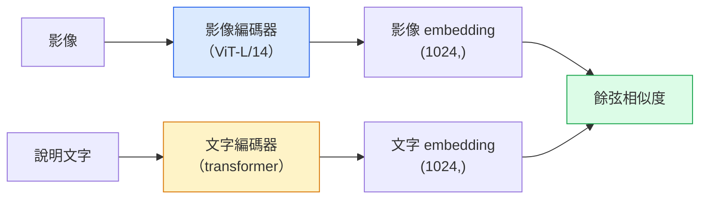

# 開放詞彙視覺（open-vocabulary vision）：CLIP

> 把影像編碼器（image encoder）和文字編碼器（text encoder）一起訓練，讓相符的影像與說明文字配對，在共享空間中落在同一點。訣竅就在於此。

**Type:** Build + Use
**Languages:** Python
**Prerequisites:** Phase 4 Lesson 14 (ViT), Phase 4 Lesson 17 (Self-Supervised)
**Time:** ~45 minutes

## Learning Objectives｜學習目標

- 說明 CLIP 的雙塔（two-tower）架構，以及對比訓練（contrastive training）的目標
- 用預訓練的 CLIP（或 SigLIP）做零樣本（zero-shot）分類，不用任何針對任務的訓練
- 從零實作零樣本分類：把類別 prompt 編碼、算餘弦相似度（cosine similarity）、取 argmax
- 分辨 CLIP、SigLIP、OpenCLIP，以及 LLaVA／LLaMA-vision 模型。2026 年各自拿來做什麼

## The Problem｜問題

傳統分類器是封閉詞彙：一個 1000 類的 ImageNet 模型只能預測 1000 個標籤。每多一個類別，都要有標籤的資料，以及重新訓練的分類頭。

CLIP（Radford 等人，OpenAI，2021）顯示，用從網路上蒐來的 4 億組（影像、說明文字）配對來訓練，模型在推論（inference）時可以分到任何一組類別，而且類別只用自然語言描述。你要一個新類別，寫一個句子就好。

這個能力叫零樣本遷移（zero-shot transfer），就是每個現代視覺系統都從 CLIP 家族的檢查點出發的原因。偵測（Grounding DINO、OWL-ViT）、分割（CLIPSeg、SAM）、檢索、內容審查、視覺語言模型、文字到影像生成，都建在 CLIP 風格的聯合 embedding 上。

## The Concept｜核心概念

### 雙塔



兩個編碼器最後都用線性投影，投到同一個 embedding 維度。CLIP-B/32 是 512，CLIP-L/14 是 1024。做 L2 正規化（normalization），再算餘弦相似度。

### 目標

給一個批次、N 組（影像、說明文字）配對，做出 N 乘 N 的相似度矩陣。訓練兩個編碼器，讓對角線（對得上的配對）相似度高，非對角線（對不上的）相似度低。

```
sim_matrix = image_embeddings @ text_embeddings.T / tau

loss_i2t = cross_entropy(sim_matrix,       targets=arange(N))
loss_t2i = cross_entropy(sim_matrix.T,     targets=arange(N))
loss = (loss_i2t + loss_t2i) / 2
```

之所以對稱，是因為影像找文字、文字找影像都該做得起來。`tau`（溫度）通常學成一個純量參數（parameter），初始值 0.07。

### SigLIP：更好的損失

SigLIP（Zhai 等人，2023）把 softmax 換成每一對一個 sigmoid：

```
loss = mean over pairs of log(1 + exp(-y_ij * sim_ij))
y_ij = +1 if matching, -1 otherwise
```

一對一對的損失，拿掉了 CLIP 需要的那種批次層級正規化。SigLIP 在小批次上訓得更好，資料量相同時打平或超過 CLIP。

### 零樣本分類

有一個訓練好的 CLIP：

1. 每個類別組一個 prompt：「a photo of a {class}」。
2. 用文字編碼器把所有類別 prompt 編碼，得到 `T`，形狀 (C, d)。
3. 把測試影像編碼，得到 `I`，形狀 (1, d)。
4. 相似度是 `I @ T.T`，形狀 (1, C)。
5. Argmax 就是預測的類別。

設計 prompt 要緊。OpenAI 為 ImageNet 公布了 80 個 prompt 模板（「a photo of a {}」「a blurry photo of a {}」「a sketch of a {}」，還有其他）。每個類別把所有模板的 embedding 平均，top-1 準確率（accuracy）還能再多 1% 到 3%。

### 2026 年 CLIP 風格的模型用在哪

- **零樣本分類**。直接用。
- **影像檢索**。所有影像先編碼一次，推論時再編碼查詢。
- **文字條件的偵測**。Grounding DINO、OWL-ViT 把 CLIP 的文字塔包在偵測器外面。
- **文字條件的分割**。CLIPSeg。SAM 透過 CLIP 接收文字 prompt。
- **視覺語言模型**。LLaVA、Qwen-VL、InternVL 把 CLIP 家族的視覺編碼器接到 LLM。
- **文字到影像生成**。Stable Diffusion、DALL-E 3 以 CLIP 的文字 embedding 為條件。

一旦有了共享的 embedding 空間，每種結合視覺與語言的任務就變成算距離。

```figure
clip-contrastive
```

## Build It｜動手實作

### 步驟 1：很小的雙塔模型

真正的 CLIP 是 ViT 加 transformer。本課的兩座塔是小 MLP，吃事先抽好的特徵（feature），好讓訓練訊號在 CPU 上就看得到。

```python
import torch
import torch.nn as nn
import torch.nn.functional as F


class TwoTower(nn.Module):
    def __init__(self, img_in=128, txt_in=64, emb=64):
        super().__init__()
        self.image_proj = nn.Sequential(nn.Linear(img_in, 128), nn.ReLU(), nn.Linear(128, emb))
        self.text_proj = nn.Sequential(nn.Linear(txt_in, 128), nn.ReLU(), nn.Linear(128, emb))
        self.logit_scale = nn.Parameter(torch.ones([]) * 2.6592)  # ln(1/0.07)

    def forward(self, img_feats, txt_feats):
        i = F.normalize(self.image_proj(img_feats), dim=-1)
        t = F.normalize(self.text_proj(txt_feats), dim=-1)
        return i, t, self.logit_scale.exp()
```

兩個投影、同一個維度的輸出、學來的溫度。形狀和真正的 CLIP API 一樣。

### 步驟 2：對比損失

```python
def clip_loss(image_emb, text_emb, logit_scale):
    N = image_emb.size(0)
    sim = logit_scale * image_emb @ text_emb.T
    targets = torch.arange(N, device=sim.device)
    l_i = F.cross_entropy(sim, targets)
    l_t = F.cross_entropy(sim.T, targets)
    return (l_i + l_t) / 2
```

對稱。logit_scale 越高，softmax 越尖，越有信心，也越可能不穩。

### 步驟 3：零樣本分類器

```python
@torch.no_grad()
def zero_shot_classify(model, image_feats, class_text_feats, class_names):
    """
    image_feats:      (N, img_in)
    class_text_feats: (C, txt_in)   one averaged embedding per class
    """
    i = F.normalize(model.image_proj(image_feats), dim=-1)
    t = F.normalize(model.text_proj(class_text_feats), dim=-1)
    sim = i @ t.T
    pred = sim.argmax(dim=-1)
    return [class_names[p] for p in pred.tolist()]
```

每一步一行。這就是正式環境 CLIP 檢查點在用的零樣本程序。

### 步驟 4：健全檢查

```python
torch.manual_seed(0)
model = TwoTower()

img = torch.randn(8, 128)
txt = torch.randn(8, 64)
i, t, scale = model(img, txt)
loss = clip_loss(i, t, scale)
print(f"batch size: {i.size(0)}   loss: {loss.item():.3f}")
```

隨機初始化的模型，損失應該接近 `log(N) = log(8) = 2.08`。這是還沒學到結構時，對稱交叉熵（cross-entropy）的目標。

## Use It｜實際應用

2026 年，OpenCLIP 是社群預設：

```python
import open_clip
import torch
from PIL import Image

model, _, preprocess = open_clip.create_model_and_transforms("ViT-B-32", pretrained="laion2b_s34b_b79k")
tokenizer = open_clip.get_tokenizer("ViT-B-32")

image = preprocess(Image.open("dog.jpg")).unsqueeze(0)
text = tokenizer(["a photo of a dog", "a photo of a cat", "a photo of a car"])

with torch.no_grad():
    image_features = model.encode_image(image)
    text_features = model.encode_text(text)
    image_features = image_features / image_features.norm(dim=-1, keepdim=True)
    text_features = text_features / text_features.norm(dim=-1, keepdim=True)
    probs = (100.0 * image_features @ text_features.T).softmax(dim=-1)

print(probs)
```

SigLIP 較新，小規模訓得更好，新工作偏好它：`google/siglip-base-patch16-224`。Hugging Face 兩個都有。

## Ship It｜交付成果

本課會產出：

- `outputs/prompt-zero-shot-class-picker.md`：一份 prompt，依一串類別和一個領域，為零樣本 CLIP 設計類別模板
- `outputs/skill-image-text-retriever.md`：一項技能，用任何 CLIP 檢查點建立影像 embedding 索引，支援用文字查、也支援用影像查

## Exercises｜練習

1. **（簡單）** 用預訓練的 OpenCLIP ViT-B/32，以 80 個模板的 prompt 集合，在 CIFAR-10 上做零樣本分類。回報 top-1 準確率。應該大約 85% 到 90%。
2. **（中等）** 同一份 CIFAR-10，比較單一模板（「a photo of a {}」）和 80 個模板平均後的 embedding。把差距量化，並說明模板為什麼有幫助。
3. **（困難）** 做一個零樣本影像檢索索引：用 CLIP 把 1,000 張影像編碼，建一個 FAISS 索引，再用自然語言描述去查。你手寫 20 個留出的查詢，回報 recall@5。

## Key Terms｜關鍵術語

| 術語 | 常見說法 | 實際意義 |
|------|----------------|----------------------|
| 雙塔 | 「雙編碼器」 | 分開的影像編碼器和文字編碼器，結尾是同一個維度的投影頭 |
| 零樣本 | 「沒有針對任務的訓練」 | 推論時只靠文字描述的類別來分類。不需使用標籤 |
| 溫度／logit_scale | 「tau」 | 學來的純量，在 softmax 之前把相似度矩陣放大 |
| prompt 模板 | 「A photo of a {}」 | 包在類別名稱外面的自然語言。把很多模板平均，零樣本準確率會上升 |
| CLIP | 「影像加文字的模型」 | 2021 年 OpenAI 的模型。到 2026 年仍是此領域的代表性模型 |
| SigLIP | 「sigmoid 版 CLIP」 | 把 softmax 換成一對一對的 sigmoid。小批次訓得更好 |
| OpenCLIP | 「開放的重現」 | 社群在 LAION 上訓練的 CLIP 變體。開放原始碼管線（pipeline）在正式環境的預設 |
| VLM | 「視覺語言模型」 | CLIP 家族的編碼器加上一個 LLM，訓練來回答關於影像的問題 |

## Further Reading｜延伸閱讀

- [CLIP: Learning Transferable Visual Models from Natural Language Supervision (Radford et al., 2021)](https://arxiv.org/abs/2103.00020)
- [SigLIP: Sigmoid Loss for Language-Image Pre-Training (Zhai et al., 2023)](https://arxiv.org/abs/2303.15343)
- [OpenCLIP](https://github.com/mlfoundations/open_clip) ——社群的程式碼庫
- [Oquab et al. (2023). DINOv2: Learning Robust Visual Features without Supervision](https://arxiv.org/abs/2304.07193) ——那篇論文，含對上 CLIP 風格和 MAE 風格模型的特徵基準
