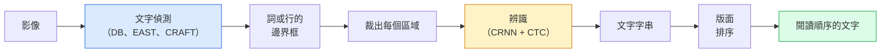

# OCR 與文件理解（document understanding）

> OCR 是三階段的管線（pipeline）：偵測文字框、辨識字元、再排版。每個現代 OCR 系統不是重排這三階段，就是把它們併在一起。

**Type:** Learn + Use
**Languages:** Python
**Prerequisites:** Phase 4 Lesson 06 (Detection), Phase 7 Lesson 02 (Self-Attention)
**Time:** ~45 minutes

## Learning Objectives｜學習目標

- 把傳統 OCR 管線走一遍（偵測、辨識、版面），以及現代的端到端替代（Donut、Qwen-VL-OCR）
- 實作連結主義時序分類（Connectionist Temporal Classification，CTC）損失（loss），用來訓練序列到序列的 OCR
- 用 PaddleOCR 或 EasyOCR 做正式環境的文件解析，不用自己訓練
- 分辨 OCR、版面解析、文件理解，並依任務挑對的工具

## The Problem｜問題

滿是文字的影像到處都是：收據、發票、證件、掃描的書、表單、白板、招牌、螢幕截圖。從裡面抽出結構化資料，不只是字元，而是「這是總金額」，是應用視覺裡價值最高的問題之一。

這個領域分成三層技能：

1. **OCR 本身**。把像素（pixel）變成文字。
2. **版面解析**。把 OCR 輸出分成區域：標題、正文、表格、頁首。
3. **文件理解**。從版面抽出結構化欄位，例如「發票總額 = 42.50 美元」。

每一層都有傳統做法和現代做法。「我想從影像拿文字」和「我要這張收據的總金額」之間的差距，比大多數團隊以為的大。

## The Concept｜核心概念

### 傳統管線



- **文字偵測**產出每一行或每一個詞的四邊形。
- **辨識**把每個區域裁成固定高度，跑 CNN 加 BiLSTM 加 CTC，得到字元序列。
- **版面**重建閱讀順序。拉丁文字由上到下、由左到右。阿拉伯文、日文不一樣。

### 一段話講完 CTC

OCR 辨識要從固定長度的特徵圖（feature map）產出長度會變的序列。CTC（Graves 等人，2006）讓你不用字元級對齊就能訓練。模型在每個時間步輸出（詞彙加空白）上的分布。CTC 損失把所有「合併重複、拿掉空白之後會變成目標文字」的對齊機率加總，也就是邊緣化（marginalization）。

```
raw output: "h h h _ _ e e l l _ l l o _ _"
after merge repeats and remove blanks: "hello"
```

CTC 是 CRNN 在 2015 年訓得動的原因，也是 2026 年大多數正式環境 OCR 模型仍這樣訓練的原因。

### 現代的端到端模型

- **Donut**（Kim 等人，2022）。ViT 編碼器（encoder）加文字解碼器。讀一張影像，直接吐出 JSON。沒有文字偵測器，也沒有版面模組。
- **TrOCR**。ViT 加 transformer 解碼器，做行級 OCR。
- **Qwen-VL-OCR / InternVL**。完整的視覺語言模型，為 OCR 任務做過 fine-tuning。2026 年複雜文件上準確率（accuracy）最好。
- **PaddleOCR**。傳統的 DB 加 CRNN 管線，包成成熟的正式環境套件。仍是開放原始碼的主力。

端到端模型要更多資料和計算，但跳過多階段管線把誤差一層層疊上去的問題。

### 版面解析

結構化文件先跑版面偵測器（LayoutLMv3、DocLayNet），把每個區域標成標題、段落、圖、表格、註腳。閱讀順序就變成：依版面順序走完各區域，再接起來。

表單用**鍵值抽取（key-value extraction）**模型。視覺很豐富的文件用 Donut，普通掃描用 LayoutLMv3。它們吃影像、偵測到的文字和位置，預測結構化的鍵值對。

### 評估指標（metric）

- **字元錯誤率（character error rate，CER）**。Levenshtein 距離除以參考長度。越低越好。正式環境的目標：乾淨掃描低於 2%。
- **詞錯誤率（word error rate，WER）**。計算方式相同，但以詞為單位。
- **結構化欄位的 F1**。給鍵值任務用。量 `{invoice_total: 42.50}` 有沒有正確出現。
- **JSON 上的編輯距離（edit distance）**。給端到端文件解析用。Donut 論文提出正規化（normalization）後的樹編輯距離。

```figure
cv3-ctc-collapse
```

## Build It｜動手實作

### 步驟 1：CTC 損失和貪心解碼器

```python
import torch
import torch.nn as nn
import torch.nn.functional as F


def ctc_loss(log_probs, targets, input_lengths, target_lengths, blank=0):
    """
    log_probs:      (T, N, C) log-softmax over vocab including blank at index 0
    targets:        (N, S) int targets (no blanks)
    input_lengths:  (N,) per-sample time steps used
    target_lengths: (N,) per-sample target length
    """
    return F.ctc_loss(log_probs, targets, input_lengths, target_lengths,
                      blank=blank, reduction="mean", zero_infinity=True)


def greedy_ctc_decode(log_probs, blank=0):
    """
    log_probs: (T, N, C) log-softmax
    returns: list of index sequences (blanks removed, repeats merged)
    """
    preds = log_probs.argmax(dim=-1).transpose(0, 1).cpu().tolist()
    out = []
    for seq in preds:
        decoded = []
        prev = None
        for idx in seq:
            if idx != prev and idx != blank:
                decoded.append(idx)
            prev = idx
        out.append(decoded)
    return out
```

`F.ctc_loss` 有 CuDNN 時會用那個高效率實作。貪心解碼器比集束搜尋（beam search）簡單，字元錯誤率通常差在 1% 以內。

### 步驟 2：很小的 CRNN 辨識器

最小的 CNN 加 BiLSTM，做行級 OCR。

```python
class TinyCRNN(nn.Module):
    def __init__(self, vocab_size=40, hidden=128, feat=32):
        super().__init__()
        self.cnn = nn.Sequential(
            nn.Conv2d(1, feat, 3, 1, 1), nn.BatchNorm2d(feat), nn.ReLU(inplace=True),
            nn.MaxPool2d(2),
            nn.Conv2d(feat, feat * 2, 3, 1, 1), nn.BatchNorm2d(feat * 2), nn.ReLU(inplace=True),
            nn.MaxPool2d(2),
            nn.Conv2d(feat * 2, feat * 4, 3, 1, 1), nn.BatchNorm2d(feat * 4), nn.ReLU(inplace=True),
            nn.MaxPool2d((2, 1)),
            nn.Conv2d(feat * 4, feat * 4, 3, 1, 1), nn.BatchNorm2d(feat * 4), nn.ReLU(inplace=True),
            nn.MaxPool2d((2, 1)),
        )
        self.rnn = nn.LSTM(feat * 4, hidden, bidirectional=True, batch_first=True)
        self.head = nn.Linear(hidden * 2, vocab_size)

    def forward(self, x):
        # x: (N, 1, H, W)
        f = self.cnn(x)                # (N, C, H', W')
        f = f.mean(dim=2).transpose(1, 2)  # (N, W', C)
        h, _ = self.rnn(f)
        return F.log_softmax(self.head(h).transpose(0, 1), dim=-1)  # (W', N, vocab)
```

輸入高度固定，CNN 把高度最大池化到 1。寬度就是 CTC 的時間維度。

### 步驟 3：合成 OCR

產生白底黑字的數字字串，做端到端的冒煙測試。

```python
import numpy as np

def synthetic_line(text, height=32, char_width=16):
    W = char_width * len(text)
    img = np.ones((height, W), dtype=np.float32)
    for i, c in enumerate(text):
        x = i * char_width
        shade = 0.0 if c.isalnum() else 0.5
        img[6:height - 6, x + 2:x + char_width - 2] = shade
    return img


def build_batch(strings, vocab):
    H = 32
    W = 16 * max(len(s) for s in strings)
    imgs = np.ones((len(strings), 1, H, W), dtype=np.float32)
    target_lengths = []
    targets = []
    for i, s in enumerate(strings):
        imgs[i, 0, :, :16 * len(s)] = synthetic_line(s)
        ids = [vocab.index(c) for c in s]
        targets.extend(ids)
        target_lengths.append(len(ids))
    return torch.from_numpy(imgs), torch.tensor(targets), torch.tensor(target_lengths)


vocab = ["_"] + list("0123456789abcdefghijklmnopqrstuvwxyz")
imgs, targets, lengths = build_batch(["hello", "world"], vocab)
print(f"images: {imgs.shape}   targets: {targets.shape}   lengths: {lengths.tolist()}")
```

真正的 OCR 資料集（dataset）會加字型、雜訊、旋轉、模糊和顏色。上面這條管線是一樣的。

### 步驟 4：訓練骨架

```python
model = TinyCRNN(vocab_size=len(vocab))
opt = torch.optim.Adam(model.parameters(), lr=1e-3)

for step in range(200):
    strings = ["abc" + str(step % 10)] * 4 + ["xyz" + str((step + 1) % 10)] * 4
    imgs, targets, target_lens = build_batch(strings, vocab)
    log_probs = model(imgs)  # (W', 8, vocab)
    input_lens = torch.full((8,), log_probs.size(0), dtype=torch.long)
    loss = ctc_loss(log_probs, targets, input_lens, target_lens, blank=0)
    opt.zero_grad(); loss.backward(); opt.step()
```

在這個太簡單的合成資料上，200 步裡損失應該從大約 3 掉到大約 0.2。

## Use It｜實際應用

正式環境有三條路：

- **PaddleOCR**。成熟、快、多語言。一行就用：`paddleocr.PaddleOCR(lang="en").ocr(image_path)`。
- **EasyOCR**。原生 Python、多語言、PyTorch 骨幹（backbone）。
- **Tesseract**。傳統的。模型吃力的舊掃描文件仍有用。

端到端的文件解析用 Donut 或視覺語言模型：

```python
from transformers import DonutProcessor, VisionEncoderDecoderModel

processor = DonutProcessor.from_pretrained("naver-clova-ix/donut-base-finetuned-cord-v2")
model = VisionEncoderDecoderModel.from_pretrained("naver-clova-ix/donut-base-finetuned-cord-v2")
```

收據、發票、結構會重複的表單，對 Donut 做 fine-tuning。任意文件，或要推理的 OCR，目前的預設是 Qwen-VL-OCR 這類視覺語言模型。

## Ship It｜交付成果

本課會產出：

- `outputs/prompt-ocr-stack-picker.md`：一份 prompt，依文件類型、語言和結構，在 Tesseract、PaddleOCR、Donut、VLM-OCR 之間挑一個
- `outputs/skill-ctc-decoder.md`：一項技能，從零寫出貪心和集束搜尋（beam search）的 CTC 解碼器，含長度正規化

## Exercises｜練習

1. **（簡單）** 用五位隨機數字字串把 TinyCRNN 訓練 500 步。在留出集合上回報字元錯誤率。
2. **（中等）** 把貪心解碼換成集束搜尋（beam search），beam_width=5。回報字元錯誤率差多少。哪些輸入上集束搜尋（beam search）會贏？
3. **（困難）** 用 PaddleOCR 跑 20 張收據，抽出明細列，對手標的真實標籤計算 {item_name, price} 配對的 F1。

## Key Terms｜關鍵術語

| 術語 | 常見說法 | 實際意義 |
|------|----------------|----------------------|
| OCR | 「從像素拿文字」 | 把影像區域變成字元序列 |
| CTC | 「不用對齊的損失」 | 訓練序列模型時不用每個時間步的標籤。把所有對齊加總 |
| CRNN | 「傳統 OCR 模型」 | 卷積（convolution）特徵萃取器加 BiLSTM 加 CTC。2015 的基準（baseline），正式環境仍在用 |
| Donut | 「端到端 OCR」 | ViT 編碼器加文字解碼器。直接從影像吐出 JSON |
| 版面解析 | 「找出區域」 | 偵測並標出文件裡的標題、表格、圖、段落 |
| 閱讀順序 | 「文字序列」 | 把辨識出的區域排成句子。拉丁文字的閱讀順序較簡單，混合版面則複雜得多 |
| CER / WER | 「錯誤率」 | 字元或詞的粒度上，Levenshtein 距離除以參考長度 |
| VLM-OCR | 「會讀的 LLM」 | 為 OCR 任務訓練過、或用 prompt 來做的視覺語言模型。複雜文件上目前最好 |

## Further Reading｜延伸閱讀

- [CRNN (Shi et al., 2015)](https://arxiv.org/abs/1507.05717) ——最初的 CNN 加 RNN 加 CTC 架構
- [CTC (Graves et al., 2006)](https://www.cs.toronto.edu/~graves/icml_2006.pdf) ——CTC 原始論文。演算法的想法塞得很密
- [Donut (Kim et al., 2022)](https://arxiv.org/abs/2111.15664) ——不用 OCR 的文件理解 transformer
- [PaddleOCR](https://github.com/PaddlePaddle/PaddleOCR) ——開放原始碼、正式環境用的 OCR 堆疊
