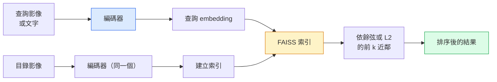

# 影像檢索（image retrieval）與度量學習（metric learning）

> 檢索系統用 embedding 空間裡的距離把候選排出來。度量學習做的，就是把那個空間塑形，讓距離的意思符合你要的。

**Type:** Build
**Languages:** Python
**Prerequisites:** Phase 4 Lesson 14 (ViT), Phase 4 Lesson 18 (CLIP)
**Time:** ~45 minutes

## Learning Objectives｜學習目標

- 說明三元組（triplet）、對比損失（contrastive loss）、以及以 proxy 為基礎（proxy-based）的度量學習損失（loss），並依資料集（dataset）挑對的一個
- 正確實作 L2 正規化（normalization）和餘弦相似度，並檢查「同一個物件」和「同一個類別」的檢索差在哪
- 建立 FAISS 索引，用文字和影像查詢，並對留出的查詢集合回報 recall@K
- 把 DINOv2、CLIP、SigLIP 當成現成的 embedding 骨幹（backbone），並知道各自什麼時候贏

## The Problem｜問題

檢索在正式環境的視覺裡到處都是：重複偵測、以圖找圖、視覺搜尋（「找相似商品」）、人臉再識別、監控用的行人再識別、電商的實例級（instance-level）比對。產品問題永遠一樣：依這張查詢影像，為我的商品目錄排序。

整套系統由兩項設計決定：由哪個模型產生 embedding，以及如何透過索引大規模尋找最近鄰。2026 年兩者都是現成的（embedding 用 DINOv2，索引用 FAISS），所以門檻提高了。難的是定義你的應用裡什麼算相似，再把 embedding 空間塑成距離對得上。

那個塑形就是度量學習。這項技術範圍不大，卻能帶來很大的效益。

## The Concept｜核心概念

### 檢索一眼看完



### 四個損失家族

| 損失 | 需要 | 好處 | 壞處 |
|------|----------|------|------|
| **對比損失** | （錨點、正樣本）加負樣本 | 簡單，任何配對標籤都能用 | 負樣本不夠就收斂很慢 |
| **三元組** | （錨點、正樣本、負樣本） | 直覺。可直接控制 margin | 硬三元組的挖掘很貴 |
| **NT-Xent / InfoNCE** | 配對，加上從批次挖出的負樣本 | 能放大到大批次 | 需要大批次，或動量佇列 |
| **以 proxy 為基礎（ProxyNCA）** | 只要類別標籤 | 快、穩、不用挖掘 | 小資料集上可能對 proxy 過擬合（overfitting） |

大多數正式環境的用法：先用預訓練骨幹。只有現成 embedding 在你的測試集上不夠好，才加上度量學習的 fine-tuning。

### 三元組損失的形式

```
L = max(0, ||f(a) - f(p)||^2 - ||f(a) - f(n)||^2 + margin)
```

把錨點 `a` 拉近正樣本 `p`，推離負樣本 `n`，再用 `margin` 保證中間有空隙。這個三張影像的結構，可以推廣到任何相似度排序。

挖掘要緊。簡單的三元組（`n` 已經離 `a` 很遠）貢獻的損失是 0。只有硬的三元組在教網路。半硬挖掘（`n` 比 `p` 遠，但仍在 margin 裡）是 2016 年 FaceNet 的配方，到現在仍是主流。

### 餘弦相似度對 L2

兩種度量，兩種慣例：

- **餘弦**。向量之間的夾角。embedding 必須先做 L2 正規化。
- **L2**。歐氏距離。原始或正規化後的 embedding 都能用，但通常搭配 L2 正規化再加平方 L2。

對大多數現代網路，兩者等價：當 `||a|| = ||b|| = 1` 時，`||a - b||^2 = 2 - 2 cos(a, b)`。選和你 embedding 訓練一致的慣例。混用會悄悄改變「最近」的意思。

### Recall@K

標準的檢索指標（metric）：

```
recall@K = fraction of queries where at least one correct match is in the top K results
```

recall@1、@5、@10 並排報。recall@10 高於 0.95、recall@1 低於 0.5，表示 embedding 空間的結構是對的，但名次很不穩。可以試試把 fine-tuning 拉長，或加一步再排序。

重複偵測更在意 precision@K，因為每個偽陽性都是使用者看得到的錯。視覺搜尋則以 recall@K 當產品訊號。

### 一段話講完 FAISS

Facebook AI Similarity Search。最近鄰搜尋事實上的函式庫（library）。三種索引：

- `IndexFlatIP` / `IndexFlatL2`。暴力、精確、不用訓練。大約 100 萬個向量以內用這個。
- `IndexIVFFlat`。分成 K 個格子，只搜最近的幾個格子。近似、快，需要訓練資料。
- `IndexHNSW`。以圖為基礎。很多查詢時最快，索引也大。

10 萬個向量，餘弦相似度上大概用 `IndexFlatIP`。1000 萬個用 `IndexIVFFlat`。1 億以上再搭配乘積量化（product quantisation），也就是 `IndexIVFPQ`。

### 實例級對類別級（category-level）檢索

兩個很不一樣的問題，名字卻一樣：

- **類別級（category-level）**。「在目錄裡找貓。」以類別為條件的相似度。現成的 CLIP 或 DINOv2 embedding 就很好。
- **實例級**。「在目錄裡找這個確切的商品。」要在同一類、看起來很像的物件之間做細緻區分。現成 embedding 不夠好。度量學習的 fine-tuning 才要緊。

選模型之前，先問自己在解哪一個。

```figure
metric-embedding
```

## Build It｜動手實作

### 步驟 1：三元組損失

```python
import torch
import torch.nn.functional as F

def triplet_loss(anchor, positive, negative, margin=0.2):
    d_ap = F.pairwise_distance(anchor, positive, p=2)
    d_an = F.pairwise_distance(anchor, negative, p=2)
    return F.relu(d_ap - d_an + margin).mean()
```

一行。L2 正規化過的或原始的 embedding 都能用。

### 步驟 2：半硬挖掘

給一批 embedding 和標籤，為每個錨點找最硬的那個半硬負樣本。

```python
def semi_hard_negatives(emb, labels, margin=0.2):
    dist = torch.cdist(emb, emb)
    same_class = labels[:, None] == labels[None, :]
    diff_class = ~same_class
    N = emb.size(0)

    positives = dist.clone()
    positives[~same_class] = float("-inf")
    positives.fill_diagonal_(float("-inf"))
    pos_idx = positives.argmax(dim=1)

    semi_hard = dist.clone()
    semi_hard[same_class] = float("inf")
    d_ap = dist[torch.arange(N), pos_idx].unsqueeze(1)
    semi_hard[dist <= d_ap] = float("inf")
    neg_idx = semi_hard.argmin(dim=1)

    fallback_mask = semi_hard[torch.arange(N), neg_idx] == float("inf")
    if fallback_mask.any():
        hardest = dist.clone()
        hardest[same_class] = float("inf")
        neg_idx = torch.where(fallback_mask, hardest.argmin(dim=1), neg_idx)
    return pos_idx, neg_idx
```

每個錨點拿到類別裡最硬的正樣本，以及一個比正樣本遠、但仍在 margin 裡的半硬負樣本。

### 步驟 3：Recall@K

```python
def recall_at_k(query_emb, gallery_emb, query_labels, gallery_labels, k=1):
    sim = query_emb @ gallery_emb.T
    _, top_k = sim.topk(k, dim=-1)
    matches = (gallery_labels[top_k] == query_labels[:, None]).any(dim=-1)
    return matches.float().mean().item()
```

L2 正規化後的 embedding，依內積取前 k，就等於依餘弦取前 k。回報的是：至少有一個正確鄰居的查詢，佔全部查詢的比例。

### 步驟 4：接在一起

```python
import torch
import torch.nn as nn
from torch.optim import Adam

class Encoder(nn.Module):
    def __init__(self, in_dim=128, emb_dim=64):
        super().__init__()
        self.net = nn.Sequential(
            nn.Linear(in_dim, 128), nn.ReLU(),
            nn.Linear(128, emb_dim),
        )

    def forward(self, x):
        return F.normalize(self.net(x), dim=-1)

torch.manual_seed(0)
num_classes = 6
protos = F.normalize(torch.randn(num_classes, 128), dim=-1)

def sample_batch(bs=32):
    labels = torch.randint(0, num_classes, (bs,))
    x = protos[labels] + 0.15 * torch.randn(bs, 128)
    return x, labels

enc = Encoder()
opt = Adam(enc.parameters(), lr=3e-3)

for step in range(200):
    x, y = sample_batch(32)
    emb = enc(x)
    pos_idx, neg_idx = semi_hard_negatives(emb, y)
    loss = triplet_loss(emb, emb[pos_idx], emb[neg_idx])
    opt.zero_grad(); loss.backward(); opt.step()
```

幾百步之後，embedding 會聚成每個類別一團。

## Use It｜實際應用

2026 年正式環境的堆疊：

- **DINOv2 加 FAISS**。通用的視覺檢索。現成就能用。
- **CLIP 加 FAISS**。查詢是文字的時候。
- **做過 fine-tuning 的 DINOv2 加 FAISS**。實例級檢索、人臉再識別、時尚、電商。
- **Milvus / Weaviate / Qdrant**。包著 FAISS 或 HNSW 的託管向量資料庫。

實例檢索要目前最好的結果，配方是：DINOv2 骨幹，加上 embedding 頭，用實例標籤的配對、以三元組或 InfoNCE 損失做 fine-tuning，再放進 FAISS 索引。

## Ship It｜交付成果

本課會產出：

- `outputs/prompt-retrieval-loss-picker.md`：一份 prompt，依檢索問題在三元組、InfoNCE、ProxyNCA 之間挑一個
- `outputs/skill-recall-at-k-runner.md`：一項技能，寫出乾淨的 recall@K 評估套件，含訓練、驗證、圖庫的切分，以及正確的資料契約（data contract）

## Exercises｜練習

1. **（簡單）** 跑上面的玩具例子。用 PCA 把訓練前和訓練後的 embedding 畫出來，看六團怎麼形成。
2. **（中等）** 加上 ProxyNCA 損失：每個類別一個學來的 proxy，對餘弦相似度做標準交叉熵（cross-entropy）。在玩具資料上和三元組損失比收斂速度。
3. **（困難）** 拿 1,000 張 ImageNet 驗證影像，用 HuggingFace 的 DINOv2 編碼，建一個 FAISS 精確平坦索引（IndexFlat）。用同一批影像當查詢，回報 recall@{1, 5, 10}（應該是 1.0）。再用留出切分、以 ImageNet 標籤作為真實標籤，也回報一次。

## Key Terms｜關鍵術語

| 術語 | 常見說法 | 實際意義 |
|------|----------------|----------------------|
| 度量學習 | 「把空間塑形」 | 訓練編碼器（encoder），讓輸出空間的距離反映你要的相似度 |
| 三元組損失 | 「拉近再推開」 | L = max(0, d(a, p) - d(a, n) + margin)。度量學習的標準損失 |
| 半硬挖掘 | 「有用的負樣本」 | 比正樣本離錨點更遠、但仍在 margin 裡的負樣本。經驗上資訊最多 |
| 以 proxy 為基礎的損失 | 「類別原型」 | 每個類別一個學來的 proxy。對「和 proxy 的相似度」做交叉熵。不用挖配對 |
| Recall@K | 「前 K 的命中率」 | 前 K 裡至少有一個正確結果的查詢比例 |
| 實例檢索 | 「找這個確切的東西」 | 細緻比對。現成特徵（feature）通常不夠好 |
| FAISS | 「那個最近鄰函式庫」 | Facebook 的最近鄰函式庫。支援精確和近似索引 |
| HNSW | 「圖索引」 | 階層可導航小世界。近似最近鄰很快，記憶體額外開銷小 |

## Further Reading｜延伸閱讀

- [FaceNet: A Unified Embedding for Face Recognition (Schroff et al., 2015)](https://arxiv.org/abs/1503.03832) ——三元組損失和半硬挖掘的那篇
- [In Defense of the Triplet Loss for Person Re-Identification (Hermans et al., 2017)](https://arxiv.org/abs/1703.07737) ——三元組 fine-tuning 的實務指南
- [FAISS documentation](https://github.com/facebookresearch/faiss/wiki) ——每種索引、每種取捨
- [SMoT: Metric Learning Taxonomy (Kim et al., 2021)](https://arxiv.org/abs/2010.06927) ——現代損失和它們之間關係的綜述
