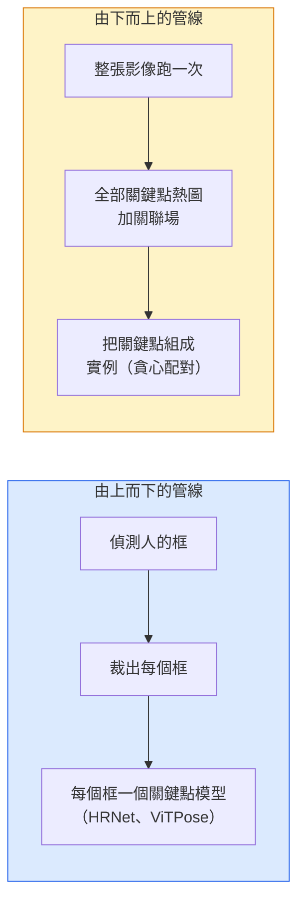

# 關鍵點偵測（keypoint detection）與姿態估計（pose estimation）

> 一個姿態是一組有順序的關鍵點（keypoint）。關鍵點偵測器是一個熱圖迴歸器（heatmap regressor）。其餘都是資料整理。

**Type:** Build
**Languages:** Python
**Prerequisites:** Phase 4 Lesson 06 (Detection), Phase 4 Lesson 07 (U-Net)
**Time:** ~45 minutes

## Learning Objectives｜學習目標

- 分辨由上而下（top-down）和由下而上（bottom-up）的姿態估計，並說出各自什麼時候用
- 用每個關鍵點一個高斯（Gaussian）的目標，迴歸 K 個關鍵點的熱圖，並在推論（inference）時取出座標
- 說明部位親和場（Part Affinity Fields，PAF），以及由下而上的管線（pipeline）怎麼把關鍵點配成實例
- 用 MediaPipe Pose 或 MMPose 做正式環境的關鍵點估計，並看懂它們的輸出格式

## The Problem｜問題

關鍵點任務藏在很多名字底下：人體姿態（17 個身體關節）、人臉標誌點（68 或 478 點）、手（21 點）、動物姿態、機器人物件姿態、醫學解剖標誌。每種任務遵循相同的結構：在物件上偵測 K 個離散點，輸出它們的 (x, y) 座標。

姿態估計是動作捕捉、健身 App、運動分析、手勢控制、動畫、AR 試穿、機器人抓取的基礎。2D 已經成熟。3D 姿態，從單一相機估計關節在世界座標裡的位置，是目前研究的前線。

工程問題是規模。單張影像、單一人的姿態是 20 毫秒的問題。人群裡多人姿態、每秒 30 影格，是另一個問題，架構也不同。

## The Concept｜核心概念

### 由上而下對由下而上



- **由上而下**。先偵測人，再對每個裁切跑一個人的關鍵點模型。準確率（accuracy）最高。時間跟人數成正比。
- **由下而上**。一次前向傳遞（forward pass）預測全部關鍵點，加上一個關聯場，再把它們分組。時間跟人群大小無關。

由上而下（HRNet、ViTPose）準確率領先。由下而上（OpenPose、HigherHRNet）在擁擠場景的吞吐量領先。

### 熱圖迴歸

不要直接迴歸 `(x, y)`。改成每個關鍵點預測一張 `H x W` 的熱圖，真位置上放一個高斯斑。

```
target[k, y, x] = exp(-((x - cx_k)^2 + (y - cy_k)^2) / (2 sigma^2))
```

推論時，每張熱圖的 argmax 就是預測的關鍵點位置。

熱圖比直接迴歸好的原因：網路的空間結構，也就是卷積特徵圖（feature map），和空間輸出自然對齊。高斯目標也有正則化（regularise）的效果。定位誤差小，損失（loss）就小，不是零。

### 次像素定位（sub-pixel localization）

argmax 給的是整數座標。要次像素精度，在 argmax 和鄰居上擬合一條拋物線，或用這個常見的偏移：`(dx, dy) = 0.25 * (heatmap[y, x+1] - heatmap[y, x-1], ...)` 那個方向。

### 部位親和場（PAF）

OpenPose 用來做由下而上關聯的手法。每一對相連的關鍵點，例如左肩到左肘，預測一個 2 通道的場，編碼從一端指向另一端的單位向量。要把肩膀配上它的手肘，就沿候選配對的連線對 PAF 做積分。積分最高的那一對配上。

```
For each connection (limb):
  PAF channels: 2 (unit vector x, y)
  Line integral: sum over sample points of (PAF . line_direction)
  Higher integral = stronger match
```

方法簡潔，而且可擴展到任意人數，不用依人裁切。

### COCO 關鍵點

標準的身體姿態資料集（dataset）：每人 17 個關鍵點。指標（metric）是正確關鍵點百分比（Percentage of Correct Keypoints，PCK）和物件關鍵點相似度（Object Keypoint Similarity，OKS）。OKS 是關鍵點版的交並比（IoU），COCO 的 mAP@OKS 報的就是它。

### 2D 對 3D

- **2D 姿態**。影像座標。2D 姿態估計已達正式環境可用的品質（MediaPipe、HRNet、ViTPose）。
- **3D 姿態**。世界座標或相機座標。研究仍在做。常見做法：
  - 用一個小 MLP 將 2D 預測提升為 3D 姿態（VideoPose3D）。
  - 從影像直接迴歸 3D（PyMAF、MHFormer）。
  - 多視角架設（CMU Panoptic）取得真實標註資料。

```figure
cv3-pose-heatmap
```

## Build It｜動手實作

### 步驟 1：高斯熱圖目標

```python
import numpy as np
import torch

def gaussian_heatmap(size, cx, cy, sigma=2.0):
    yy, xx = np.meshgrid(np.arange(size), np.arange(size), indexing="ij")
    return np.exp(-((xx - cx) ** 2 + (yy - cy) ** 2) / (2 * sigma ** 2)).astype(np.float32)

hm = gaussian_heatmap(64, 32, 32, sigma=2.0)
print(f"peak: {hm.max():.3f} at ({hm.argmax() % 64}, {hm.argmax() // 64})")
```

每個關鍵點一張熱圖，沿通道軸堆起來，就是完整的目標張量（tensor）。

### 步驟 2：很小的關鍵點預測頭

U-Net 風格的模型，輸出 K 個熱圖通道（channel）。

```python
import torch.nn as nn
import torch.nn.functional as F

class TinyKeypointNet(nn.Module):
    def __init__(self, num_keypoints=4, base=16):
        super().__init__()
        self.down1 = nn.Sequential(nn.Conv2d(3, base, 3, 2, 1), nn.ReLU(inplace=True))
        self.down2 = nn.Sequential(nn.Conv2d(base, base * 2, 3, 2, 1), nn.ReLU(inplace=True))
        self.mid = nn.Sequential(nn.Conv2d(base * 2, base * 2, 3, 1, 1), nn.ReLU(inplace=True))
        self.up1 = nn.ConvTranspose2d(base * 2, base, 2, 2)
        self.up2 = nn.ConvTranspose2d(base, num_keypoints, 2, 2)

    def forward(self, x):
        h1 = self.down1(x)
        h2 = self.down2(h1)
        h3 = self.mid(h2)
        u1 = self.up1(h3)
        return self.up2(u1)
```

輸入 `(N, 3, H, W)`，輸出 `(N, K, H, W)`。損失是對高斯目標的逐像素 MSE。

### 步驟 3：推論，取出關鍵點座標

```python
def heatmap_to_coords(heatmaps):
    """
    heatmaps: (N, K, H, W)
    returns:  (N, K, 2) float coordinates in image pixels
    """
    N, K, H, W = heatmaps.shape
    hm = heatmaps.reshape(N, K, -1)
    idx = hm.argmax(dim=-1)
    ys = (idx // W).float()
    xs = (idx % W).float()
    return torch.stack([xs, ys], dim=-1)

coords = heatmap_to_coords(torch.randn(2, 4, 32, 32))
print(f"coords: {coords.shape}")  # (2, 4, 2)
```

推論時就是這一步。要次像素精修，在 argmax 附近內插（interpolation）。

### 步驟 4：合成關鍵點資料集

很簡單：白底上畫四個點，學著把它們預測出來。

```python
def make_synthetic_sample(size=64):
    img = np.ones((3, size, size), dtype=np.float32)
    rng = np.random.default_rng()
    kps = rng.integers(8, size - 8, size=(4, 2))
    for cx, cy in kps:
        img[:, cy - 2:cy + 2, cx - 2:cx + 2] = 0.0
    hms = np.stack([gaussian_heatmap(size, cx, cy) for cx, cy in kps])
    return img, hms, kps
```

簡單到小型模型約一分鐘就能學會。

### 步驟 5：訓練

```python
model = TinyKeypointNet(num_keypoints=4)
opt = torch.optim.Adam(model.parameters(), lr=3e-3)

for step in range(200):
    batch = [make_synthetic_sample() for _ in range(16)]
    imgs = torch.from_numpy(np.stack([b[0] for b in batch]))
    hms = torch.from_numpy(np.stack([b[1] for b in batch]))
    pred = model(imgs)
    # Upsample pred to full resolution
    pred = F.interpolate(pred, size=hms.shape[-2:], mode="bilinear", align_corners=False)
    loss = F.mse_loss(pred, hms)
    opt.zero_grad(); loss.backward(); opt.step()
```

## Use It｜實際應用

- **MediaPipe Pose**。Google 的正式環境姿態估計器。附 WebGL 和行動裝置執行環境，延遲低於 10 毫秒。
- **MMPose**（OpenMMLab）。完整的研究程式碼庫。每個目前最好的架構都有預訓練權重（weight）。
- **YOLOv8-pose**。即時多人姿態最快的之一，一次前向傳遞。
- **transformers 的 HumanDPT / PoseAnything**。較新的視覺語言做法，做開放詞彙的姿態：任何物件、任何一組關鍵點。

## Ship It｜交付成果

本課會產出：

- `outputs/prompt-pose-stack-picker.md`：一份 prompt，依延遲、人群大小、以及要 2D 還是 3D，在 MediaPipe、YOLOv8-pose、HRNet、ViTPose 之間挑一個
- `outputs/skill-heatmap-to-coords.md`：一項技能，寫出每個正式環境姿態模型都在用的、次像素熱圖轉座標程序

## Exercises｜練習

1. **（簡單）** 在合成的四點資料集上訓練這個小關鍵點模型。200 步之後，回報預測關鍵點和真實關鍵點的平均 L2 誤差。
2. **（中等）** 加上次像素精修：給定 argmax 位置，用鄰近像素沿 x 和 y 各擬合一條一維拋物線。和整數 argmax 比，精度提升多少。
3. **（困難）** 做一個兩人的合成資料集，每張影像有兩個四關鍵點的實例。訓練一條帶 PAF 的由下而上管線，預測哪個關鍵點屬於哪個實例，並評估 OKS。

## Key Terms｜關鍵術語

| 術語 | 常見說法 | 實際意義 |
|------|----------------|----------------------|
| 關鍵點 | 「一個標誌」 | 物件上一個有順序的特定點。關節、角點、特徵 |
| 姿態 | 「那副骨架」 | 屬於同一個實例、有順序的一組關鍵點 |
| 由上而下 | 「先偵測再估姿態」 | 兩階段管線：人的偵測器，加上每個裁切的關鍵點模型。準確率最高 |
| 由下而上 | 「先估姿態再分組」 | 一次預測全部關鍵點再分組。時間跟人群大小無關 |
| 熱圖 | 「高斯目標」 | 每個關鍵點一張 H x W 張量，峰值在真實位置。偏好的迴歸目標 |
| PAF | 「Part Affinity Field」 | 2 通道的單位向量場，編碼肢體方向。用來把關鍵點組成實例 |
| OKS | 「關鍵點版的 IoU」 | 物件關鍵點相似度。COCO 的姿態指標 |
| HRNet | 「高解析度網路」 | 主流的由上而下關鍵點架構。從頭到尾保住高解析度特徵 |

## Further Reading｜延伸閱讀

- [OpenPose (Cao et al., 2017)](https://arxiv.org/abs/1812.08008) ——用 PAF 的由下而上。這個做法寫得最好的仍是這篇
- [HRNet (Sun et al., 2019)](https://arxiv.org/abs/1902.09212) ——由上而下的參考架構
- [ViTPose (Xu et al., 2022)](https://arxiv.org/abs/2204.12484) ——把普通 ViT 當姿態骨幹（backbone）。很多基準上目前最好
- [MediaPipe Pose](https://developers.google.com/mediapipe/solutions/vision/pose_landmarker) ——正式環境的即時姿態。2026 年部署最快的那一套
