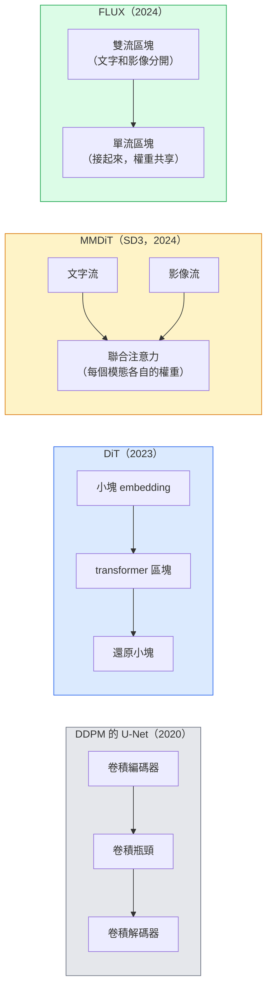

# 擴散 transformer（Diffusion Transformer）與整流流（rectified flow）

> U-Net 不是擴散的秘訣。把它換成 transformer，把雜訊排程（noise schedule）換成一條直線的流，你就有了 SD3、FLUX，以及 2026 年每一個文字到影像的模型。

**Type:** Learn + Build
**Languages:** Python
**Prerequisites:** Phase 4 Lesson 10 (Diffusion DDPM), Phase 4 Lesson 14 (ViT), Phase 7 Lesson 02 (Self-Attention)
**Time:** ~75 minutes

## Learning Objectives｜學習目標

- 從 U-Net DDPM（第 10 課）走到擴散 transformer（DiT）、MMDiT（SD3），以及單流加雙流的 DiT（FLUX）
- 說明整流流：為什麼雜訊和資料之間的直線軌跡，讓模型用 20 步取樣，而不是 1000 步
- 實作一個很小的 DiT 區塊，以及一個整流流訓練迴圈，兩者都在 100 行以內
- 依架構、參數（parameter）數量和授權，分辨模型變體：SD3、FLUX.1-dev、FLUX.1-schnell、Z-Image、Qwen-Image

## The Problem｜問題

第 10 課用 U-Net 去雜訊器做了一個 DDPM。那個配方支配了 2020 到 2023：U-Net、beta 排程、預測雜訊的損失（loss）。它產出了 Stable Diffusion 1.5、2.1 和 DALL-E 2。

2026 年每一個目前最好的文字到影像模型都已經離開它。Stable Diffusion 3、FLUX、SD4、Z-Image、Qwen-Image、Hunyuan-Image，都不用 U-Net。它們用擴散 transformer（DiT）。SD3 和 FLUX 還把 DDPM 的雜訊排程換成整流流，把從雜訊到資料的路徑拉直，再配合一致性或蒸餾變體，推論（inference）可以是 1 到 4 步。

這個轉變要緊，因為它讓以擴散為基礎的影像生成變得可控、更能準確遵循 prompt（SD3 和 SD4 解決了文字渲染），而且快到能進正式環境。懂 DiT 加整流流，就是懂 2026 年的生成影像堆疊。

## The Concept｜核心概念

### 從 U-Net 到 transformer



- **DiT**（Peebles 與 Xie，2023）。用類似 ViT 的 transformer 換掉 U-Net，吃潛在小塊。條件用適應層正規化（adaptive layer norm，AdaLN）。
- **MMDiT**（SD3，Esser 等人，2024）。兩條流，文字 token 和影像 token 各有權重（weight），共享一次聯合注意力。
- **FLUX**（Black Forest Labs，2024）。前 N 個區塊像 SD3 那樣雙流。後面的區塊把兩邊接起來、共享權重（單流），好在更深的時候仍有效率。
- **Z-Image**（2025）。高效率的單流 DiT，60 億參數，挑戰「不惜代價放大」。

### 用一段話說明整流流

DDPM 把前向過程定義成雜訊逐漸增強的 SDE，`x_t` 被破壞得愈來愈厲害。學來的反向是第二條 SDE，用 1000 個小步來解。

整流流定義資料和純雜訊之間的**直線**內插（interpolation）：

```
x_t = (1 - t) * x_0 + t * epsilon,     t in [0, 1]
```

訓練網路去預測速度（velocity） `v_theta(x_t, t) = epsilon - x_0`。那是沿直線、從乾淨資料走向雜訊的前向方向（`dx_t/dt`）。取樣時把這個速度倒著積分，從雜訊走向資料。得出的 ODE 更接近直線，所以取樣需要的積分步數少很多。

SD3 把這叫做 **Rectified Flow Matching**。FLUX、Z-Image，以及大多數 2026 年的模型用同一個目標。典型推論：20 到 30 步 Euler（確定性），對上舊 DDPM 體制的 50 步以上 DDIM。蒸餾、turbo、schnell、LCM 這些變體把它收到 1 到 4 步。

### AdaLN 條件

DiT 用**適應層正規化**吃時間步和類別或文字：從條件向量預測 `scale` 和 `shift`，在 LayerNorm 之後套上。比 U-Net 裡 FiLM 風格的調變乾淨，也是每個現代 DiT 的預設。

```
cond -> MLP -> (scale, shift, gate)
norm(x) * (1 + scale) + shift, then residual add * gate
```

### SD3 和 FLUX 的文字編碼器（encoder）

- **SD3** 用三個文字編碼器：兩個 CLIP 模型加 T5-XXL。embedding 接在一起，當成文字條件送進影像流。
- **FLUX** 用一個 CLIP-L 加 T5-XXL。
- **Qwen-Image / Z-Image** 的變體用自己內部的文字編碼器，和它們的基礎 LLM 對齊。

SD3 和 FLUX 對 prompt 的推理比 SD1.5 好那麼多，文字編碼器是很大一塊原因。光是 T5-XXL 就有 47 億參數。

### 無分類器引導仍然成立

整流流改的是取樣器，不是條件。無分類器引導（訓練時以 10% 的機率丟掉文字，推論時把有條件和無條件的預測混在一起）在整流流上一樣。大多數 2026 年的模型用引導尺度 3.5 到 5。比 SD1.5 的 7.5 低，因為整流流模型預設就更能遵循 prompt。

### Consistency、Turbo、Schnell、LCM

四個名字，同一個想法：把慢的多步模型蒸餾成快的少步模型。

- **LCM（潛在一致性模型，Latent Consistency Model）**。訓練一個學生，從任何中間的 `x_t` 一步預測最終的 `x_0`。
- **SDXL Turbo / FLUX schnell**。1 到 4 步的模型，用對抗式擴散蒸餾訓練。
- **SD Turbo**。OpenAI 風格的一致性模型，改到潛在擴散上。

任何新模型的正式環境服務，都會同時附上「完整品質」的檢查點，和「turbo / schnell」變體。Schnell（德文的「快」，Black Forest Labs 的慣例）跑 1 到 4 步，放得進即時管線（pipeline）。

### 2026 年的模型版圖

| 模型 | 大小 | 架構 | 授權 |
|-------|------|--------------|---------|
| Stable Diffusion 3 Medium | 20 億 | MMDiT | SAI Community |
| Stable Diffusion 3.5 Large | 80 億 | MMDiT | SAI Community |
| FLUX.1-dev | 120 億 | 雙流加單流 DiT | 非商業 |
| FLUX.1-schnell | 120 億 | 相同，蒸餾過 | Apache 2.0 |
| FLUX.2 | — | 在 FLUX.1 上再迭代 | 混合 |
| Z-Image | 60 億 | S3-DiT（可擴展的單流） | 授權寬鬆 |
| Qwen-Image | 約 200 億 | DiT 加 Qwen 文字塔 | Apache 2.0 |
| Hunyuan-Image-3.0 | 約 800 億 | DiT | 研究用 |
| SD4 Turbo | 30 億 | DiT 加蒸餾 | SAI 商業 |

2026 年開放原始碼的預設是 FLUX.1-schnell。效率領先的是 Z-Image。目前品質表現領先的是 FLUX.2 和 SD4。

### 為什麼這次轉向要緊

DDPM 加 U-Net 做得動。DiT 加整流流做得**更好、更快，放大也更乾淨**。這個轉變和自然語言從 RNN 走到 transformer 平行：兩種架構解的是同一個問題，但 transformer 放得大，現在是主流。2026 年每一篇影像、影片或 3D 生成的論文，都用 DiT 形狀的去雜訊器，而且通常用整流流目標。U-Net DDPM 現在主要拿來教學（第 10 課）。

```figure
cv3-rectified-flow
```

## Build It｜動手實作

### 步驟 1：帶 AdaLN 的 DiT 區塊

```python
import torch
import torch.nn as nn


class AdaLNZero(nn.Module):
    """
    Adaptive LayerNorm with a gate. Predicts (scale, shift, gate) from the conditioning.
    Init such that the whole block starts as identity ("zero init").
    """

    def __init__(self, dim, cond_dim):
        super().__init__()
        self.norm = nn.LayerNorm(dim, elementwise_affine=False)
        self.mlp = nn.Linear(cond_dim, dim * 3)
        nn.init.zeros_(self.mlp.weight)
        nn.init.zeros_(self.mlp.bias)

    def forward(self, x, cond):
        scale, shift, gate = self.mlp(cond).chunk(3, dim=-1)
        h = self.norm(x) * (1 + scale.unsqueeze(1)) + shift.unsqueeze(1)
        return h, gate.unsqueeze(1)


class DiTBlock(nn.Module):
    def __init__(self, dim=192, heads=3, mlp_ratio=4, cond_dim=192):
        super().__init__()
        self.adaln1 = AdaLNZero(dim, cond_dim)
        self.attn = nn.MultiheadAttention(dim, heads, batch_first=True)
        self.adaln2 = AdaLNZero(dim, cond_dim)
        self.mlp = nn.Sequential(
            nn.Linear(dim, dim * mlp_ratio),
            nn.GELU(),
            nn.Linear(dim * mlp_ratio, dim),
        )

    def forward(self, x, cond):
        h, gate1 = self.adaln1(x, cond)
        a, _ = self.attn(h, h, h, need_weights=False)
        x = x + gate1 * a
        h, gate2 = self.adaln2(x, cond)
        x = x + gate2 * self.mlp(h)
        return x
```

`AdaLNZero` 一開始是恆等映射，因為它的 MLP 權重初始化成 0。訓練再把區塊從恆等推開。這讓深的 transformer 擴散模型穩得非常多。

### 步驟 2：很小的 DiT

```python
def timestep_embedding(t, dim):
    import math
    half = dim // 2
    freqs = torch.exp(-math.log(10000) * torch.arange(half, device=t.device) / half)
    args = t[:, None].float() * freqs[None]
    return torch.cat([args.sin(), args.cos()], dim=-1)


class TinyDiT(nn.Module):
    def __init__(self, image_size=16, patch_size=2, in_channels=3, dim=96, depth=4, heads=3):
        super().__init__()
        self.patch_size = patch_size
        self.num_patches = (image_size // patch_size) ** 2
        self.patch = nn.Conv2d(in_channels, dim, kernel_size=patch_size, stride=patch_size)
        self.pos = nn.Parameter(torch.zeros(1, self.num_patches, dim))
        self.time_mlp = nn.Sequential(
            nn.Linear(dim, dim * 2),
            nn.SiLU(),
            nn.Linear(dim * 2, dim),
        )
        self.blocks = nn.ModuleList([DiTBlock(dim, heads, cond_dim=dim) for _ in range(depth)])
        self.norm_out = nn.LayerNorm(dim, elementwise_affine=False)
        self.head = nn.Linear(dim, patch_size * patch_size * in_channels)

    def forward(self, x, t):
        n = x.size(0)
        x = self.patch(x)
        x = x.flatten(2).transpose(1, 2) + self.pos
        t_emb = self.time_mlp(timestep_embedding(t, self.pos.size(-1)))
        for blk in self.blocks:
            x = blk(x, t_emb)
        x = self.norm_out(x)
        x = self.head(x)
        return self._unpatchify(x, n)

    def _unpatchify(self, x, n):
        p = self.patch_size
        h = w = int(self.num_patches ** 0.5)
        x = x.view(n, h, w, p, p, -1).permute(0, 5, 1, 3, 2, 4).reshape(n, -1, h * p, w * p)
        return x
```

### 步驟 3：整流流訓練

```python
import torch.nn.functional as F

def rectified_flow_train_step(model, x0, optimizer, device):
    model.train()
    x0 = x0.to(device)
    n = x0.size(0)
    t = torch.rand(n, device=device)
    epsilon = torch.randn_like(x0)
    x_t = (1 - t[:, None, None, None]) * x0 + t[:, None, None, None] * epsilon

    target_velocity = epsilon - x0
    pred_velocity = model(x_t, t)

    loss = F.mse_loss(pred_velocity, target_velocity)
    optimizer.zero_grad()
    loss.backward()
    optimizer.step()
    return loss.item()
```

和第 10 課 DDPM 的雜訊預測損失比：結構相同，目標不同。不是去預測雜訊 `epsilon`，而是預測**速度** `epsilon - x_0`。它沿著直線內插，從資料指向雜訊。

### 步驟 4：Euler 取樣器

整流流是一條 ODE。Euler 法最簡單。整流流模型訓得好的時候，20 步以上，它和更高階的求解器差不多準。

```python
@torch.no_grad()
def rectified_flow_sample(model, shape, steps=20, device="cpu"):
    model.eval()
    x = torch.randn(shape, device=device)
    dt = 1.0 / steps
    t = torch.ones(shape[0], device=device)
    for _ in range(steps):
        v = model(x, t)
        x = x - dt * v
        t = t - dt
    return x
```

20 步。在訓好的模型上，樣本品質接近 1000 步的 DDPM。

### 步驟 5：端到端的冒煙測試

```python
import numpy as np

def synthetic_blobs(num=200, size=16, seed=0):
    rng = np.random.default_rng(seed)
    out = np.zeros((num, 3, size, size), dtype=np.float32)
    yy, xx = np.meshgrid(np.arange(size), np.arange(size), indexing="ij")
    for i in range(num):
        cx, cy = rng.uniform(4, size - 4, size=2)
        r = rng.uniform(2, 4)
        mask = (xx - cx) ** 2 + (yy - cy) ** 2 < r ** 2
        colour = rng.uniform(-1, 1, size=3)
        for c in range(3):
            out[i, c][mask] = colour[c]
    return torch.from_numpy(out)
```

用整流流在這上面訓練一個 `TinyDiT`。500 步之後，取樣出來的輸出應該像淡淡的色塊。

## Use It｜實際應用

要用 FLUX、SD3、Z-Image 真的生成影像，`diffusers` 以統一的 API 支援這些模型：

```python
from diffusers import FluxPipeline, StableDiffusion3Pipeline
import torch

pipe = FluxPipeline.from_pretrained(
    "black-forest-labs/FLUX.1-schnell",
    torch_dtype=torch.bfloat16,
).to("cuda")

out = pipe(
    prompt="a golden retriever surfing a tsunami, hyperrealistic, studio lighting",
    guidance_scale=0.0,           # schnell was trained without CFG
    num_inference_steps=4,
    max_sequence_length=256,
).images[0]
out.save("surf.png")
```

三行。`FLUX.1-schnell` 四步。要更高品質、20 到 30 步、並打開 CFG，把模型 id 換成 `black-forest-labs/FLUX.1-dev`。

SD3：

```python
pipe = StableDiffusion3Pipeline.from_pretrained(
    "stabilityai/stable-diffusion-3.5-large",
    torch_dtype=torch.bfloat16,
).to("cuda")
out = pipe(prompt, guidance_scale=3.5, num_inference_steps=28).images[0]
```

## Ship It｜交付成果

本課會產出：

- `outputs/prompt-dit-model-picker.md`：依品質、延遲和授權限制，在 SD3、FLUX.1-dev、FLUX.1-schnell、Z-Image、SD4 Turbo 之間挑一個
- `outputs/skill-rectified-flow-trainer.md`：寫出完整的整流流訓練迴圈，含 AdaLN DiT 和 Euler 取樣

## Exercises｜練習

1. **（簡單）** 在上面的合成色塊資料集（dataset）上，把 TinyDiT 訓練 500 步。比較 10、20、50 步 Euler 取樣得到的樣本。
2. **（中等）** 加上文字條件：把一個學來的類別 embedding 接到時間 embedding 上（依顏色分 10 個色塊「類別」）。用類別 0、5、9 取樣，確認顏色對得上。
3. **（困難）** 算 Fréchet 距離（FID 的代理）。同一大小的網路、同一份資料、同樣的步數，比較整流流版本和 DDPM 版本取樣得到的樣本。回報哪一個收斂更快。

## Key Terms｜關鍵術語

| 術語 | 常見說法 | 實際意義 |
|------|----------------|----------------------|
| DiT | 「擴散 transformer」 | 換掉 U-Net、當擴散去雜訊器的 transformer。在切成小塊的潛在上運作 |
| AdaLN | 「適應層正規化」 | 用學來的 scale、shift、gate，在 LayerNorm 之後做時間步或文字條件。每個現代 DiT 的標準 |
| MMDiT | 「多模態 DiT（SD3）」 | 文字 token 和影像 token 各有權重流，共享一次聯合自注意力（self-attention） |
| 單流／雙流 | 「FLUX 的手法」 | 前 N 個區塊是雙流（每個模態各自的權重），後面的區塊是單流（接起來、權重共享），換效率 |
| 整流流 | 「雜訊到資料的直線」 | 資料和雜訊之間的線性內插。網路預測速度。推論時需要的 ODE 步數更少 |
| 速度目標 | 「epsilon - x_0」 | 整流流的迴歸目標。從乾淨資料指向雜訊 |
| CFG 引導 | 「無分類器引導」 | 把有條件和無條件的預測混在一起。整流流模型仍在用 |
| Schnell / turbo / LCM | 「1 到 4 步的蒸餾」 | 從完整品質模型蒸餾出來的少步變體。正式環境的即時用途 |

## Further Reading｜延伸閱讀

- [Scalable Diffusion Models with Transformers (Peebles & Xie, 2023)](https://arxiv.org/abs/2212.09748) ——DiT 那篇論文
- [Scaling Rectified Flow Transformers (Esser et al., SD3 paper)](https://arxiv.org/abs/2403.03206) ——放大後的 MMDiT 和整流流
- [FLUX.1 model card and technical report (Black Forest Labs)](https://huggingface.co/black-forest-labs/FLUX.1-dev) ——雙流加單流的細節
- [Z-Image: Efficient Image Generation Foundation Model (2025)](https://arxiv.org/html/2511.22699v1) ——60 億參數的單流 DiT
- [Elucidating the Design Space of Diffusion (Karras et al., 2022)](https://arxiv.org/abs/2206.00364) ——每個擴散設計取捨的參考
- [Latent Consistency Models (Luo et al., 2023)](https://arxiv.org/abs/2310.04378) ——LCM-LoRA 怎麼給你 4 步推論
