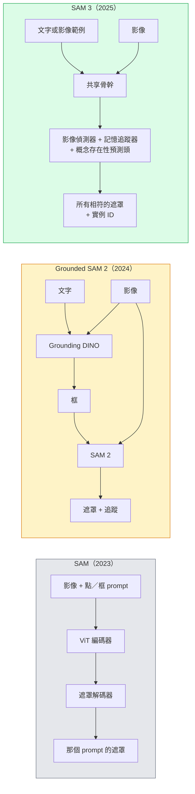

# SAM 3 與開放詞彙分割（open-vocabulary segmentation）

> 給模型一段文字 prompt 和一張影像，每個相符物件的遮罩就出來。SAM 3 一次前向傳遞（forward pass）就完成。

**Type:** Use + Build
**Languages:** Python
**Prerequisites:** Phase 4 Lesson 07 (U-Net), Phase 4 Lesson 08 (Mask R-CNN), Phase 4 Lesson 18 (CLIP)
**Time:** ~60 minutes

## Learning Objectives｜學習目標

- 分辨 SAM（只有視覺 prompt）、Grounded SAM／SAM 2（偵測器加 SAM），以及 SAM 3（用可提示的概念分割，原生接受文字 prompt）
- 說明 SAM 3 的架構：共享骨幹（backbone）、影像偵測器、以記憶為基礎的影片追蹤器、概念存在性預測頭，以及偵測器和追蹤器分開的設計
- 用 Hugging Face 的 `transformers` 整合，做文字 prompt 的偵測、分割和影片追蹤
- 依延遲、概念複雜度和部署目標，在 SAM 3、Grounded SAM 2、YOLO-World、SAM-MI 之間挑

## The Problem｜問題

2023 年的 SAM 只吃視覺 prompt：你點一個點，或畫一個框，它回一張遮罩。要「這張照片裡所有的橘子」，得先用偵測器（Grounding DINO）產框，再讓 SAM 逐個分割。Grounded SAM 把這做成一條管線（pipeline），但它是兩個凍結模型的串接，誤差一定會累積。

SAM 3（Meta，2025 年 11 月，ICLR 2026）把這段串接收掉。它接受短的名詞片語，或一張影像範例當 prompt，一次前向傳遞（forward pass）就回所有相符的遮罩和實例 ID。這就是**可提示的概念分割（Promptable Concept Segmentation，PCS）**。再加上 2026 年 3 月的 Object Multiplex 更新（SAM 3.1），它能有效率地在影片裡追蹤同一個概念的多個實例。

這一課講的是這個結構上的轉變。2D 分割、偵測，以及文字與影像定位（text-image grounding），收進同一個模型。正式環境要問的不再是「我該串哪幾段管線」，而是「哪個可提示的模型能從頭到尾處理我的用途」。

## The Concept｜核心概念

### 三代



### 可提示的概念分割

「概念 prompt」是短的名詞片語（`"yellow school bus"`、`"striped red umbrella"`、`"hand holding a mug"`），或一張影像範例。模型回影像裡每個相符實例的分割遮罩，每個相符各有一個不重複的實例 ID。

和經典的視覺 prompt SAM 有三點不同：

1. 不必每個實例各給一次 prompt。一個文字 prompt 就把所有相符的都回來。
2. 開放詞彙。概念可以是自然語言描得出來的任何東西。
3. 一次回多個實例，而不是每個 prompt 一張遮罩。

### 架構上的關鍵零件

- **共享骨幹**。一顆 ViT 處理影像。偵測頭和以記憶為基礎的追蹤器都從它讀特徵。
- **概念存在性預測頭**。預測這個概念到底在不在影像裡。把「在不在」和「在哪裡」拆開。減少根本不在的概念上的偽陽性。
- **偵測器和追蹤器分開**。影像層級的偵測和影片層級的追蹤各有自己的頭，所以不會互相干擾。
- **記憶庫**。存每個實例跨影格的特徵，供影片追蹤用（和 SAM 2 同一個機制）。

### 大規模訓練

SAM 3 在**400 萬個不重複的概念**上訓練。資料引擎一輪一輪標註、修正，用 AI 加人來複查。新的 **SA-CO 基準**有 27 萬個不重複的概念，是先前基準的 50 倍。SAM 3 在 SA-CO 上達到人類表現的 75% 到 80%，在影像加影片的 PCS 上是現有系統的兩倍。

### SAM 3.1 的 Object Multiplex

2026 年 3 月的更新：**Object Multiplex** 用共享記憶，一次聯合追蹤同一個概念的許多實例。以前追 N 個實例就是 N 個分開的記憶庫。Multiplex 收進一個共享記憶，每個實例各自查詢。結果：多物件追蹤快非常多，準確率不掉。

### 2026 年 Grounded SAM 仍然有用的地方

- 你需要換上某個特定的開放詞彙偵測器（DINO-X、Florence-2）。
- SAM 3 的授權（在 Hugging Face 上要申請）擋路。
- 你需要的偵測器閾值控制，比 SAM 3 對外開放的更多。
- 要對偵測器元件做研究或元件移除實驗。

模組化管線仍有位置。大多數正式環境的工作，SAM 3 是比較直接的答案。

### YOLO-World 對上 SAM 3

- **YOLO-World**。只有開放詞彙偵測（沒有遮罩）。即時。你要的是高影格率的框時最好。
- **SAM 3**。完整的分割加追蹤。比較慢，輸出比較完整。

正式環境的分工：只要偵測、而且要快的管線（機器人導航、快的儀表板）用 YOLO-World。需要遮罩或追蹤的，用 SAM 3。

### SAM-MI 的效率

SAM-MI（2025 到 2026）處理 SAM 解碼器的瓶頸。要點：

- **稀疏的點 prompt**。用挑過的幾個點，而不是密集的 prompt。解碼器呼叫次數少 96%。
- **淺層遮罩聚合**。把粗略的遮罩預測合成一張更清楚的遮罩。
- **分開的遮罩注入**。解碼器收到事先算好的遮罩特徵，不必再跑一次。

結果：在開放詞彙基準上，比 Grounded-SAM 大約快 1.6 倍。

### 三個模型的輸出格式

三者回的大致結構相同（框、標籤、分數、遮罩、ID）。這很有用：下游管線不必因為跑的是哪個模型而改寫。

```figure
cv3-open-vocab
```

## Build It｜動手實作

### 步驟 1：組 prompt

寫一個幫手，把使用者的句子轉成一串 SAM 3 概念 prompt。這是「使用者打了什麼」和「模型接收什麼」的邊界。

```python
def split_concepts(sentence):
    """
    Heuristic splitter for multi-concept prompts.
    Returns list of short noun phrases.
    """
    for sep in [",", ";", "and", "or", "&"]:
        if sep in sentence:
            parts = [p.strip() for p in sentence.replace("and ", ",").split(",")]
            return [p for p in parts if p]
    return [sentence.strip()]

print(split_concepts("cats, dogs and balloons"))
```

SAM 3 一次前向傳遞（forward pass）接受一個概念。多概念查詢就用迴圈或批次。

### 步驟 2：後處理幫手

把 SAM 3 的原始輸出轉成乾淨的偵測清單，對上第 4 階段第 16 課的管線契約。

```python
from dataclasses import dataclass
from typing import List

@dataclass
class ConceptDetection:
    concept: str
    instance_id: int
    box: tuple          # (x1, y1, x2, y2)
    score: float
    mask_rle: str       # run-length encoded


def rle_encode(binary_mask):
    flat = binary_mask.flatten().astype("uint8")
    runs = []
    prev, count = flat[0], 0
    for v in flat:
        if v == prev:
            count += 1
        else:
            runs.append((int(prev), count))
            prev, count = v, 1
    runs.append((int(prev), count))
    return ";".join(f"{v}x{c}" for v, c in runs)
```

即使有很多高解析度遮罩，RLE 仍讓回應資料保持精簡。SAM 2、SAM 3、Grounded SAM 2 都能用同一種格式。

### 步驟 3：統一的開放詞彙分割介面

不管後端是 SAM 3、Grounded SAM 2，還是 YOLO-World 加 SAM 2，都包在同一個方法後面。後端換了，下游程式不用改。

```python
from abc import ABC, abstractmethod
import numpy as np

class OpenVocabSeg(ABC):
    @abstractmethod
    def detect(self, image: np.ndarray, concept: str) -> List[ConceptDetection]:
        ...


class StubOpenVocabSeg(OpenVocabSeg):
    """
    Deterministic stub used for pipeline testing when real models are not loaded.
    """
    def detect(self, image, concept):
        h, w = image.shape[:2]
        return [
            ConceptDetection(
                concept=concept,
                instance_id=0,
                box=(w * 0.2, h * 0.3, w * 0.5, h * 0.8),
                score=0.89,
                mask_rle="0x100;1x50;0x200",
            ),
            ConceptDetection(
                concept=concept,
                instance_id=1,
                box=(w * 0.55, h * 0.25, w * 0.85, h * 0.75),
                score=0.74,
                mask_rle="0x80;1x40;0x220",
            ),
        ]
```

真正的 `SAM3OpenVocabSeg` 子類別會包 `transformers.Sam3Model` 和 `Sam3Processor`。

### 步驟 4：Hugging Face 上的 SAM 3 用法（參考）

實際模型用的是 `transformers` 整合：

```python
from transformers import Sam3Processor, Sam3Model
import torch

processor = Sam3Processor.from_pretrained("facebook/sam3")
model = Sam3Model.from_pretrained("facebook/sam3").eval()

inputs = processor(images=pil_image, return_tensors="pt")
inputs = processor.set_text_prompt(inputs, "yellow school bus")

with torch.no_grad():
    outputs = model(**inputs)

masks = processor.post_process_masks(
    outputs.masks, inputs.original_sizes, inputs.reshaped_input_sizes
)
boxes = outputs.boxes
scores = outputs.scores
```

一個 prompt，一次呼叫就把所有相符的都回來。

### 步驟 5：量 Grounded SAM 2 白送了你什麼

一個誠實的比較：在真實管線裡，把 Grounded SAM 2 換成 SAM 3 會怎樣？

- 延遲：SAM 3 少一次前向傳遞（forward pass）（沒有分開的偵測器），但模型本身更重。通常差不多打平，或是稍微快一點。
- 準確率：少見或組合起來的概念（「條紋紅傘」）上，SAM 3 好非常多。常見的單詞概念差不多。
- 彈性：Grounded SAM 2 讓你把偵測器換掉（DINO-X、Florence-2、Grounding DINO 1.5）。SAM 3 是一整塊。

結論：2026 年開放詞彙分割的預設是 SAM 3。你需要偵測器的彈性，或不同的授權條款時，Grounded SAM 2 仍然是對的選擇。

## Use It｜實際應用

正式環境的部署模式：

- **即時標註**。SAM 3 加上 CVAT 的「用標籤當文字 prompt」。標註者選一個標籤名稱，SAM 3 先把每個相符實例標好。再複查、修正。
- **影片分析**。用 SAM 3.1 的 Object Multiplex 做多物件追蹤。把影格送進以記憶為基礎的追蹤器。
- **機器人**。SAM 3 做開放詞彙的操作（「拿起紅色的杯子」）。當成規劃時的基本動作。
- **醫學影像**。SAM 3 在醫學概念上 fine-tuning。要在 Hugging Face 提出存取申請。

Ultralytics 把 SAM 3 包進它的 Python 套件：

```python
from ultralytics import SAM

model = SAM("sam3.pt")
results = model(image_path, prompts="yellow school bus")
```

介面和 YOLO、SAM 2 相同。

## Ship It｜交付成果

本課會產出：

- `outputs/prompt-open-vocab-stack-picker.md`：依延遲、概念複雜度和授權，在 SAM 3、Grounded SAM 2、YOLO-World、SAM-MI 之間挑的 prompt
- `outputs/skill-concept-prompt-designer.md`：把使用者說的話轉成格式正確的 SAM 3 概念 prompt（切開、消歧、退路）

## Exercises｜練習

1. **（簡單）** 用你選的概念 prompt，在 10 張影像上跑 SAM 3。同一批影像和 SAM 2 加 Grounding DINO 1.5 比。回報每個模型漏了哪些概念。
2. **（中等）** 在 SAM 3 上做「點一下算進去／點一下排除」的介面：文字 prompt 回候選實例，使用者點選哪些算正例。把最後的概念集合輸出成 JSON。
3. **（困難）** 在自訂概念集合上 fine-tune SAM 3（例如 5 種電子零件，每種 20 張標過的影像）。和同一份測試集上的零樣本 SAM 3 比，量遮罩 IoU 提升多少。

## Key Terms｜關鍵術語

| 術語 | 常見說法 | 實際意義 |
|------|----------------|----------------------|
| 開放詞彙分割 | 「用文字來分割」 | 為自然語言描述的物件產出遮罩，而不是固定的標籤集合 |
| PCS | 「可提示的概念分割」 | SAM 3 的核心任務。給名詞片語或影像範例，分割所有相符的實例 |
| 概念 prompt | 「文字輸入」 | 短的名詞片語或影像範例。不是完整句子 |
| 概念存在性預測頭 | 「它在這裡嗎？」 | SAM 3 的模組。在定位（localisation）之前，先決定這個概念在不在影像裡 |
| SA-CO | 「SAM 3 的基準」 | 27 萬個概念的開放詞彙分割基準。是先前開放詞彙基準的 50 倍 |
| Object Multiplex | 「SAM 3.1 的更新」 | 共享記憶的多物件追蹤。一次快速追蹤許多實例 |
| Grounded SAM 2 | 「模組化管線」 | 偵測器加 SAM 2 的串接。需要換偵測器時仍然有用 |
| SAM-MI | 「高效率的 SAM 變體」 | 用遮罩注入，比 Grounded-SAM 快 1.6 倍 |

## Further Reading｜延伸閱讀

- [SAM 3: Segment Anything with Concepts (arXiv 2511.16719)](https://arxiv.org/abs/2511.16719)
- [SAM 3.1 Object Multiplex (Meta AI, March 2026)](https://ai.meta.com/blog/segment-anything-model-3/)
- [SAM 3 model page on Hugging Face](https://huggingface.co/facebook/sam3)
- [Grounded SAM 2 tutorial (PyImageSearch)](https://pyimagesearch.com/2026/01/19/grounded-sam-2-from-open-set-detection-to-segmentation-and-tracking/)
- [Ultralytics SAM 3 docs](https://docs.ultralytics.com/models/sam-3/)
- [SAM3-I: Instruction-aware SAM (arXiv 2512.04585)](https://arxiv.org/abs/2512.04585)
