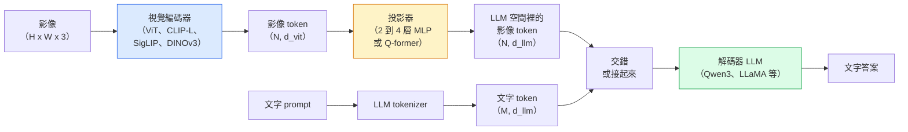

# 視覺語言模型（vision-language model）：ViT-MLP-LLM 模式

> 視覺編碼器把影像轉成 token。MLP 投影器（projector）把那些 token 映到 LLM 的 embedding 空間。剩下的交給語言模型。這個模式，ViT-MLP-LLM，就是 2026 年每一個正式環境的 VLM。

**Type:** Learn + Use
**Languages:** Python
**Prerequisites:** Phase 4 Lesson 14 (ViT), Phase 4 Lesson 18 (CLIP), Phase 7 Lesson 02 (Self-Attention)
**Time:** ~75 minutes

## Learning Objectives｜學習目標

- 說出 ViT-MLP-LLM 架構，並說明三個元件各自貢獻什麼
- 依參數（parameter）數量、上下文長度和基準表現，比較 Qwen3-VL、InternVL3.5、LLaVA-Next、GLM-4.6V
- 說明 DeepStack：為什麼多層的 ViT 特徵，比只用最後一層，更能把視覺和語言對齊
- 用跨模態錯誤率（Cross-Modal Error Rate，CMER）量正式環境裡 VLM 的幻覺，並依這個訊號動作

## The Problem｜問題

CLIP（第 4 階段第 18 課）給你影像和文字共用的 embedding 空間，零樣本分類和檢索夠用。它答不了「這張影像裡有幾輛紅車」，因為 CLIP 不生成文字，只給相似度打分。

視覺語言模型（vision-language model，VLM），Qwen3-VL、InternVL3.5、LLaVA-Next、GLM-4.6V，把 CLIP 家族的影像編碼器接到完整的語言模型上。模型看到影像加一個問題，再生成答案。2026 年的開放原始碼 VLM，在多模態基準（MMMU、MMBench、DocVQA、ChartQA、MathVista、OSWorld）上打平或超過 GPT-5 和 Gemini-2.5-Pro。

這三塊（ViT、投影器、LLM）是標準。模型之間的差別在用哪顆 ViT、哪個投影器、哪個 LLM、訓練資料，以及對齊配方。模式懂了之後，替換任何一個元件都很直接。

## The Concept｜核心概念

### ViT-MLP-LLM 架構



1. **視覺編碼器**。預訓練的 ViT（CLIP-L/14、SigLIP、DINOv3，或 fine-tuned 變體）。產出小塊 token。
2. **投影器**。小模組（2 到 4 層 MLP，或 Q-former），把視覺 token 映到 LLM 的 embedding 維度。大多數 fine-tuning 發生在這裡。
3. **LLM**。只有解碼器的語言模型（Qwen3、Llama、Mistral、GLM、InternLM）。依序讀視覺加文字 token，再生成文字。

三塊原則上都能訓練。實務上視覺編碼器和 LLM 大多凍結，只訓練投影器。只需訓練投影器中數十億個參數，成本就相對低，代價很低。

### DeepStack

最基本的投影只用 ViT 最後一層。DeepStack（Qwen3-VL）從 ViT 多個深度抽特徵再疊起來。較深的層帶高層語意。較淺的層帶細的空間和紋理資訊。兩者都送進 LLM，補上「影像裡有什麼」（語意）和「到底在哪裡」（空間定位）之間的落差。

### 三個訓練階段

現代 VLM 分階段訓練：

1. **對齊**。凍結 ViT 和 LLM。只用影像和說明文字的配對訓練投影器。教投影器把視覺空間映到語言空間。
2. **預訓練**。全部解凍。在大規模交錯的影像和文字資料上訓練（5 億組以上）。建立模型的視覺知識。
3. **指令調校**。在整理過的（影像、問題、答案）三元組上 fine-tune。教對話行為和任務格式。這一步把「懂視覺的語言模型」變成能用的助理。

大多數 LoRA fine-tune 瞄準第 3 階段，用一份小的、標過的資料集（dataset）。

### 模型家族比較（2026 年初）

| 模型 | 參數 | 視覺編碼器 | LLM | 上下文 | 強項 |
|-------|--------|----------------|-----|---------|-----------|
| Qwen3-VL-235B-A22B（MoE） | 2350 億（220 億活躍） | 自訂 ViT 加 DeepStack | Qwen3 | 25.6 萬 | 綜合目前最好、GUI agent |
| Qwen3-VL-30B-A3B（MoE） | 300 億（30 億活躍） | 自訂 ViT 加 DeepStack | Qwen3 | 25.6 萬 | 較小的 MoE 替代 |
| Qwen3-VL-8B（稠密） | 80 億 | 自訂 ViT | Qwen3 | 12.8 萬 | 正式環境的稠密預設 |
| InternVL3.5-38B | 380 億 | InternViT-6B | Qwen3 加 GPT-OSS | 12.8 萬 | MMBench／MMVet 強 |
| InternVL3.5-241B-A28B | 2410 億（280 億活躍） | InternViT-6B | Qwen3 | 12.8 萬 | 和 GPT-4o 打得平 |
| LLaVA-Next 72B | 720 億 | SigLIP | Llama-3 | 3.2 萬 | 開放、容易 fine-tune |
| GLM-4.6V | 約 700 億 | 自訂 | GLM | 6.4 萬 | 開放原始碼、OCR 強 |
| MiniCPM-V-2.6 | 80 億 | SigLIP | MiniCPM | 3.2 萬 | 適合邊緣 |

### 視覺 agent

Qwen3-VL-235B 在 OSWorld 上達到全球名列前茅。OSWorld 是**視覺 agent（visual agent）**的基準，agent 操作圖形介面（桌面、手機、網頁）。模型看螢幕截圖，理解介面，再輸出動作（點、打字、捲動）。再加上工具，它完成常見桌面工作的操作流程。2026 年大多數「AI PC」展示，底下跑的就是這個。

### agentic 能力加 RoPE 變體

VLM 需要知道影格在影片的什麼時候。Qwen3-VL 從 T-RoPE（temporal Rotary Position Embedding）演進到**以文字為基礎的時間對齊**：明確的時間戳文字 token，和影片影格交錯。模型看到「`<timestamp 00:32>` frame, prompt」，就能推理時間關係。

### 對齊問題

爬來的資料集裡，12% 的影像和文字配對，描述內容沒有完全以影像為根據。VLM 在這上面訓練，會悄悄學會幻覺：編出物件、讀錯數字、編出關係。正式環境裡，這是主要的失敗模式。

Skywork.ai 提出**跨模態錯誤率（Cross-Modal Error Rate，CMER）**來追蹤：

```
CMER = fraction of outputs where the text confidence is high but the image-text similarity (via a CLIP-family checker) is low
```

CMER 高，表示模型很有信心地說影像裡沒有根據的話。把 CMER 當正式環境的 KPI 來監看，在他們的部署裡，幻覺率大約降了 35%。要點不是去修模型，而是把 CMER 高的輸出送到人來複查。

### 用 LoRA／QLoRA 做 fine-tuning

70B VLM 的完整 fine-tuning，大多數團隊做不到。注意力加投影器層上的 LoRA（秩 16 到 64），或基礎權重 4 位元的 QLoRA，一張 A100／H100 放得下。代價：5,000 到 50,000 筆範例、運算 $100-$5,000、訓練 2 到 10 小時。

### 空間推理仍然弱

目前的 VLM 在空間推理基準上是 50% 到 60%（上對下、左對右、計數、距離）。如果你的用途靠「哪個物件位於另一個物件上方」，要大量驗證。一般 VLM 的表現低於人類。純空間任務上，比 VLM 更好的選擇：專門的關鍵點或姿態估計器、深度模型，或偵測模型再用框的幾何後處理。

```figure
v4-vlm-projector
```

## Build It｜動手實作

### 步驟 1：投影器

你最常訓練的那一塊。2 到 4 層、帶 GELU 的 MLP。

```python
import torch
import torch.nn as nn


class Projector(nn.Module):
    def __init__(self, vit_dim=768, llm_dim=4096, hidden=4096):
        super().__init__()
        self.net = nn.Sequential(
            nn.Linear(vit_dim, hidden),
            nn.GELU(),
            nn.Linear(hidden, llm_dim),
        )

    def forward(self, x):
        return self.net(x)
```

輸入是 `(N_patches, d_vit)` 的 token 張量。輸出是 `(N_patches, d_llm)`。LLM 把每一列輸出都當成另一個 token。

### 步驟 2：從頭到尾組出 ViT-MLP-LLM

最小 VLM 的前向骨架。真正的程式用 `transformers`。這裡是概念上的排法。

```python
class MinimalVLM(nn.Module):
    def __init__(self, vit, projector, llm, image_token_id):
        super().__init__()
        self.vit = vit
        self.projector = projector
        self.llm = llm
        self.image_token_id = image_token_id  # placeholder token in text prompt

    def forward(self, image, input_ids, attention_mask):
        # 1. vision features
        vision_tokens = self.vit(image)                     # (B, N_patches, d_vit)
        vision_embeds = self.projector(vision_tokens)       # (B, N_patches, d_llm)

        # 2. text embeddings
        text_embeds = self.llm.get_input_embeddings()(input_ids)  # (B, M, d_llm)

        # 3. replace image placeholder tokens with vision embeds
        merged = self._merge(text_embeds, vision_embeds, input_ids)

        # 4. run LLM
        return self.llm(inputs_embeds=merged, attention_mask=attention_mask)

    def _merge(self, text_embeds, vision_embeds, input_ids):
        out = text_embeds.clone()
        expected = vision_embeds.size(1)
        for b in range(input_ids.size(0)):
            positions = (input_ids[b] == self.image_token_id).nonzero(as_tuple=True)[0]
            if len(positions) != expected:
                raise ValueError(
                    f"batch item {b} has {len(positions)} image tokens but vision_embeds has {expected} patches."
                    " Every sample in the batch must be pre-padded to the same number of image placeholder tokens.")
            out[b, positions] = vision_embeds[b]
        return out
```

文字裡的 `<image>` 佔位 token 會被換成真正的影像 embedding。LLaVA、Qwen-VL、InternVL 用的是同一個模式。

### 步驟 3：計算 CMER

輕量的執行期檢查。

```python
import torch.nn.functional as F


def cross_modal_error_rate(image_emb, text_emb, text_confidence, sim_threshold=0.25, conf_threshold=0.8):
    """
    image_emb, text_emb: embeddings of image and generated text (normalised internally)
    text_confidence:     mean per-token probability in [0, 1]
    Returns:             fraction of high-confidence outputs with low image-text alignment
    """
    image_emb = F.normalize(image_emb, dim=-1)
    text_emb = F.normalize(text_emb, dim=-1)
    sim = (image_emb * text_emb).sum(dim=-1)        # cosine similarity
    high_conf_low_sim = (text_confidence > conf_threshold) & (sim < sim_threshold)
    return high_conf_low_sim.float().mean().item()
```

把 CMER 當正式環境的 KPI。依端點、依 prompt 種類、依客戶監看。CMER 上升，表示模型開始在某種輸入分布上產生幻覺。

### 步驟 4：玩具 VLM 分類器（跑得起來）

示範投影器真的訓得起來。假的「ViT 特徵」進去，一個很小的、LLM 風格的頭預測類別。

```python
class ToyVLM(nn.Module):
    def __init__(self, vit_dim=32, llm_dim=64, num_classes=5):
        super().__init__()
        self.projector = Projector(vit_dim, llm_dim, hidden=64)
        self.head = nn.Linear(llm_dim, num_classes)

    def forward(self, vision_tokens):
        projected = self.projector(vision_tokens)
        pooled = projected.mean(dim=1)
        return self.head(pooled)
```

在合成的（特徵、類別）配對上，200 步以內就能擬合。足以看出投影器這個模式行得通。

## Use It｜實際應用

2026 年正式環境團隊用 VLM 的三種方式：

- **代管 API**。OpenAI Vision、Anthropic Claude Vision、Google Gemini Vision。沒有自己的基礎設施，但有供應商風險。
- **開放原始碼、自己架**。用 `transformers` 和 `vllm` 跑 Qwen3-VL 或 InternVL3.5。完全自己控，前期功夫比較多。
- **在領域上 fine-tune**。載入 Qwen2.5-VL-7B 或 LLaVA-1.6-7B，在 5,000 到 50,000 筆自訂範例上做 LoRA，再用 `vllm` 或 `TGI` 服務。

```python
from transformers import AutoProcessor, AutoModelForVision2Seq
import torch
from PIL import Image

model_id = "Qwen/Qwen3-VL-8B-Instruct"
processor = AutoProcessor.from_pretrained(model_id)
model = AutoModelForVision2Seq.from_pretrained(model_id, torch_dtype=torch.bfloat16, device_map="auto")

messages = [{
    "role": "user",
    "content": [
        {"type": "image", "image": Image.open("plot.png")},
        {"type": "text", "text": "What does this chart show?"},
    ],
}]
inputs = processor.apply_chat_template(messages, add_generation_prompt=True, tokenize=True, return_dict=True, return_tensors="pt").to("cuda")
generated = model.generate(**inputs, max_new_tokens=256)
answer = processor.decode(generated[0][inputs["input_ids"].shape[1]:], skip_special_tokens=True)
```

`apply_chat_template` 把 `<image>` 佔位 token 的切分藏起來。模型在內部處理合併。

## Ship It｜交付成果

本課會產出：

- `outputs/prompt-vlm-selector.md`：依準確率、延遲、上下文長度和預算，在 Qwen3-VL、InternVL3.5、LLaVA-Next、API 之間挑
- `outputs/skill-cmer-monitor.md`：產出程式，在正式環境的 VLM 端點上裝 CMER、每個端點的儀表板，以及告警閾值

## Exercises｜練習

1. **（簡單）** 在五張影像上，對任何開放的 VLM 跑三個 prompt（「這是什麼？」、「數物件」、「描述場景」）。用手把每個答案標成正確／部分正確／幻覺。算出一輪類似 CMER 的比率。
2. **（中等）** 用 LoRA（秩 16）在 500 張目標領域、帶說明文字的影像上，fine-tune Qwen2.5-VL-3B 或 LLaVA-1.6-7B。比較零樣本和 fine-tuned 之後、MMBench 風格的準確率。
3. **（困難）** 把 VLM 的影像編碼器從預設的 SigLIP／CLIP 換成 DINOv3。只重訓投影器（LLM 和 DINOv3 都凍結）。量密集預測任務（計數、空間推理）有沒有變好。

## Key Terms｜關鍵術語

| 術語 | 常見說法 | 實際意義 |
|------|----------------|----------------------|
| ViT-MLP-LLM | 「VLM 的模式」 | 視覺編碼器加投影器加語言模型。2026 年每一個 VLM |
| 投影器 | 「橋」 | 2 到 4 層 MLP（或 Q-former），把視覺 token 映到 LLM 的 embedding 空間 |
| DeepStack | 「Qwen3-VL 的特徵手法」 | 疊多層 ViT 特徵，而不是只用最後一層 |
| 影像 token | 「<image> 佔位」 | 文字流裡的特殊 token，會被換成投影後的視覺 embedding |
| CMER | 「幻覺 KPI」 | 跨模態錯誤率。文字信心高、但影像和文字相似度低的時候高 |
| 視覺 agent | 「會點的 VLM」 | 操作圖形介面（OSWorld、手機、網頁）並呼叫工具的 VLM |
| Q-former | 「固定數量的 token 橋」 | BLIP-2 風格的投影器，產出固定數量的視覺查詢 token |
| 對齊／預訓練／指令調校 | 「三個階段」 | 標準的 VLM 訓練管線（pipeline） |

## Further Reading｜延伸閱讀

- [Qwen3-VL Technical Report (arXiv 2511.21631)](https://arxiv.org/abs/2511.21631)
- [InternVL3.5 Advancing Open-Source Multimodal Models (arXiv 2508.18265)](https://arxiv.org/html/2508.18265v1)
- [LLaVA-Next series](https://llava-vl.github.io/blog/2024-05-10-llava-next-stronger-llms/)
- [BentoML: Best Open-Source VLMs 2026](https://www.bentoml.com/blog/multimodal-ai-a-guide-to-open-source-vision-language-models)
- [MMMU: Multi-discipline Multimodal Understanding benchmark](https://mmmu-benchmark.github.io/)
- [VLMs in manufacturing (Robotics Tomorrow, March 2026)](https://www.roboticstomorrow.com/story/2026/03/when-machines-learn-to-see-like-experts-the-rise-of-vision-language-models-in-manufacturing/26335/)
