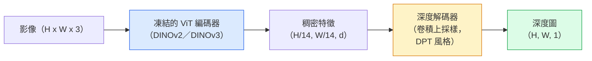

# 單目深度（monocular depth）與幾何估計

> 深度圖是單通道影像，每個像素（pixel）是到相機的距離。從一張 RGB 影格預測它，以前沒有立體視覺或 LiDAR 做不到。2026 年，凍結的 ViT 編碼器加一個輕量的頭，誤差可以落到和真實深度值差幾個百分點以內。

**Type:** Build + Use
**Languages:** Python
**Prerequisites:** Phase 4 Lesson 14 (ViT), Phase 4 Lesson 17 (Self-Supervised Vision), Phase 4 Lesson 07 (U-Net)
**Time:** ~60 minutes

## Learning Objectives｜學習目標

- 分辨相對深度和公尺深度，並說出每個正式環境模型解的是哪一種（MiDaS、Marigold、Depth Anything V3、ZoeDepth）
- 用 Depth Anything V3（DINOv2 骨幹）對任意單張影像預測深度，不用校正
- 說明為什麼單張影像也能估深度（透視線索、紋理梯度、學來的先驗），以及它恢復不了什麼（絕對尺度、被遮住的幾何）
- 用深度圖和針孔相機（pinhole camera）內參，把 2D 偵測提升為 3D 點

## The Problem｜問題

深度是 2D 電腦視覺缺的那一軸。給了 RGB，你知道東西出現在影像平面的哪裡，不知道它們有多遠。深度感測器（立體相機組、LiDAR、飛時測距（time-of-flight））直接解這個，但貴、容易壞、距離也有限。

單目深度估計，從一張 RGB 影格預測深度，以前的輸出又糊又不可靠。到 2026 年，大型預訓練編碼器改了這件事：Depth Anything V3 用凍結的 DINOv2 骨幹（backbone），產出的深度圖能跨室內、室外、醫學、衛星泛化。Marigold 把深度改寫成條件擴散問題。ZoeDepth 迴歸真正的公尺距離。

深度也是 2D 偵測和 3D 理解之間的橋：把偵測框裡的像素乘上深度，就把 2D 物件提升為 3D 點雲。每一套 AR 遮擋、每一條避障管線（pipeline）、每一個「拿起杯子」的機器人，核心都是這個。

## The Concept｜核心概念

### 相對深度對上公尺深度

- **相對深度**。有序的 `z`，沒有真實世界的單位。「像素 A 比像素 B 近，但距離比值沒有對應到實際公尺尺度。」
- **公尺深度**。從相機量起的絕對距離，單位公尺。模型必須學到影像線索和真實距離之間的統計關係。

MiDaS 和 Depth Anything V3 產出相對深度。Marigold 產出相對深度。ZoeDepth、UniDepth、Metric3D 產出公尺深度。公尺模型對相機內參敏感。相對模型不敏感。

### 編碼器–解碼器模式



Depth Anything V3 凍結編碼器，只訓練 DPT 風格的解碼器。編碼器提供豐富特徵（feature）。解碼器把它們插值回影像解析度，再迴歸深度。

### 為什麼單張影像也能產出深度

2D 影像裡有很多和深度相關的單目線索：

- **透視**。3D 裡的平行線在 2D 匯聚。
- **紋理梯度**。遠的表面紋理更小、更密。
- **遮擋順序**。較近的物件遮住較遠的。
- **大小恆常性**。已知物件（車、人）給出大約的尺度。
- **大氣透視**。室外場景裡，遠的物件看起來更朦朧、偏藍。

在數十億張影像上訓練的 ViT 把這些線索內化。資料夠、骨幹夠強，單目深度不必任何明確的 3D 監督，也能達到還算準。

### 單目深度做不到的事

- **絕對的公尺尺度**。沒有內參，或場景裡沒有已知物件，就沒有。網路可以預測「杯子的距離是湯匙的兩倍」，但不知道杯子是 1 公尺還是 10 公尺。
- **被遮住的幾何**。椅子背面沒看到，不能可靠地推論。
- **缺乏紋理或具有反光特性的表面**。鏡子、玻璃、均勻的牆。網路回的深度看起來合理，但是錯的。

### 2026 年的 Depth Anything V3

- 編碼器是原版 DINOv2 ViT-L/14（凍結）。
- DPT 解碼器。
- 在來自不同來源、帶相機姿態的影像配對上訓練（除了光度一致性，不需要明確的深度監督）。
- 從**任意數量的視覺輸入**預測空間上一致的幾何，相機姿態已知或未知都可以。
- 在單目深度、任意視角幾何、視覺渲染、相機姿態估計上都是目前最好。

2026 年你要深度時，這就是直接呼叫的模型。

### Marigold：用擴散估深度

Marigold（Ke 等人，CVPR 2024）把深度估計改寫成條件式的影像到影像擴散。條件是 RGB。目標是深度圖。骨幹是預訓練的 Stable Diffusion 2 U-Net。物件邊界上的深度圖特別銳利。取捨：比前饋模型慢（10 到 50 步去雜訊）。

### 內參和針孔相機

要把像素 `(u, v)`、深度 `d` 提升為相機座標裡的 3D 點 `(X, Y, Z)`：

```
fx, fy, cx, cy = camera intrinsics
X = (u - cx) * d / fx
Y = (v - cy) * d / fy
Z = d
```

內參來自 EXIF 中繼資料、校正圖案，或單目內參估計器（Perspective Fields、UniDepth）。沒有內參，仍可假設 60 到 70 度視場、中等解析度的主點，來渲染點雲。視覺化夠用，量測不夠。

### 評估

兩個標準指標：

- **AbsRel**（絕對相對誤差）：`mean(|d_pred - d_gt| / d_gt)`。愈低愈好。正式環境模型是 0.05 到 0.1。
- **delta < 1.25**（閾值準確率）：`max(d_pred/d_gt, d_gt/d_pred) < 1.25` 的像素比例。愈高愈好。目前最好是 0.9 以上。

相對深度（Depth Anything V3、MiDaS）用這兩個指標的尺度和平移不變版本來評估。

```figure
depth-sweep
```

## Build It｜動手實作

### 步驟 1：深度指標

```python
import torch

def abs_rel_error(pred, target, mask=None):
    if mask is not None:
        pred = pred[mask]
        target = target[mask]
    return (torch.abs(pred - target) / target.clamp(min=1e-6)).mean().item()


def delta_accuracy(pred, target, threshold=1.25, mask=None):
    if mask is not None:
        pred = pred[mask]
        target = target[mask]
    ratio = torch.maximum(pred / target.clamp(min=1e-6), target / pred.clamp(min=1e-6))
    return (ratio < threshold).float().mean().item()
```

評估前一定要把無效深度像素遮掉（零、NaN、飽和）。

### 步驟 2：尺度和平移對齊

相對深度模型要先把預測對到真實深度值，再算指標。最小平方擬合 `a * pred + b = target`：

```python
def align_scale_shift(pred, target, mask=None):
    if mask is not None:
        p = pred[mask]
        t = target[mask]
    else:
        p = pred.flatten()
        t = target.flatten()
    A = torch.stack([p, torch.ones_like(p)], dim=1)
    coeffs, *_ = torch.linalg.lstsq(A, t.unsqueeze(-1))
    a, b = coeffs[:2, 0]
    return a * pred + b
```

評估 MiDaS 或 Depth Anything 時，先跑 `align_scale_shift`，再跑 `abs_rel_error`。

### 步驟 3：把深度提升為點雲

```python
import numpy as np

def depth_to_point_cloud(depth, intrinsics):
    H, W = depth.shape
    fx, fy, cx, cy = intrinsics
    v, u = np.meshgrid(np.arange(H), np.arange(W), indexing="ij")
    z = depth
    x = (u - cx) * z / fx
    y = (v - cy) * z / fy
    return np.stack([x, y, z], axis=-1)


depth = np.random.uniform(0.5, 4.0, (240, 320))
intr = (320.0, 320.0, 160.0, 120.0)
pc = depth_to_point_cloud(depth, intr)
print(f"point cloud shape: {pc.shape}  (H, W, 3)")
```

一個函式，每一個把東西轉換為 3D 點雲 的應用。把點雲輸出成 `.ply`，用 MeshLab 或 CloudCompare 打開。

### 步驟 4：合成深度場景的冒煙測試

```python
def synthetic_depth(size=96):
    yy, xx = np.meshgrid(np.arange(size), np.arange(size), indexing="ij")
    # Floor: linear gradient from near (top) to far (bottom)
    depth = 1.0 + (yy / size) * 4.0
    # Box in the middle: closer
    mask = (np.abs(xx - size / 2) < size / 6) & (np.abs(yy - size * 0.6) < size / 6)
    depth[mask] = 2.0
    return depth.astype(np.float32)


gt = torch.from_numpy(synthetic_depth(96))
pred = gt + 0.3 * torch.randn_like(gt)  # simulated prediction
aligned = align_scale_shift(pred, gt)
print(f"before align  absRel = {abs_rel_error(pred, gt):.3f}")
print(f"after align   absRel = {abs_rel_error(aligned, gt):.3f}")
```

### 步驟 5：Depth Anything V2 的用法（參考）

```python
import numpy as np
from transformers import pipeline
from PIL import Image

pipe = pipeline(task="depth-estimation", model="depth-anything/Depth-Anything-V2-Large-hf")

image = Image.open("street.jpg").convert("RGB")
out = pipe(image)
depth_np = np.array(out["depth"])
```

三行。`out["depth"]` 是 PIL 灰階。要做數學就轉成 numpy。Depth Anything 3（2025 年 11 月）不能從這條管線載入。它有自己的 `depth_anything_3` 套件：`DepthAnything3.from_pretrained("depth-anything/DA3MONO-LARGE")` 載入相對單目模型，`model.inference(images).depth` 回 `[N, H, W]` 的深度陣列。

## Use It｜實際應用

- **Depth Anything V3**（Meta AI／ByteDance，2024 到 2026）。相對深度的預設。正式環境裡，ViT-large 骨幹最快的模型。
- **Marigold**（ETH，2024）。視覺品質最高，推論慢。
- **UniDepth**（ETH，2024）。公尺深度，並估計相機內參。
- **ZoeDepth**（Intel，2023）。公尺深度。比較舊，仍然可靠。
- **MiDaS v3.1**。舊，但穩定。比較用的好基準模型（baseline）。

典型的接法：

1. RGB 影格進來。
2. 深度模型產出深度圖。
3. 偵測器產出框。
4. 把框的中心經深度轉換為 3D 點雲。有點雲就合併。
5. 下游：AR 遮擋、路徑規劃、物件尺寸估計、取代立體視覺。

要即時，Depth Anything V2 Small（INT8 量化）在消費級 GPU、518x518，大約每秒 30 影格。

## Ship It｜交付成果

本課會產出：

- `outputs/prompt-depth-model-picker.md`：依延遲、要公尺還是相對、以及場景類型，在 Depth Anything V3、Marigold、UniDepth、MiDaS 之間挑
- `outputs/skill-depth-to-pointcloud.md`：從深度圖建點雲，內參處理正確，並輸出成 `.ply`

## Exercises｜練習

1. **（簡單）** 在你桌面的任意 10 張影像上跑 Depth Anything V2。把深度存成灰階 PNG 再看。找出一個預測深度看起來不對的物件，說明單目線索為什麼失敗。
2. **（中等）** 用 Depth Anything V2 的 RGB 加深度，提升為點雲，再用 `open3d` 渲染。比較兩個場景（室內／室外），哪一個看起來更可信。
3. **（困難）** 拿五對影像，差別只在一個已知物件的位置（例如瓶子靠近 30 公分）。用 UniDepth 對兩張都預測公尺深度。回報預測的距離差，對上真正的 30 公分。

## Key Terms｜關鍵術語

| 術語 | 常見說法 | 實際意義 |
|------|----------------|----------------------|
| 單目深度 | 「單張影像的深度」 | 從一張 RGB 影格估深度，不用立體視覺或 LiDAR |
| 相對深度 | 「有序的深度」 | 有序的 z 值，沒有真實世界單位 |
| 公尺深度 | 「絕對距離」 | 以公尺計的深度。需要校正，或用公尺監督訓練過的模型 |
| AbsRel | 「絕對相對誤差」 | |d_pred - d_gt| / d_gt 的平均。標準深度指標 |
| Delta 準確率 | 「delta < 1.25」 | 預測落在真實深度值 25% 以內的像素比例 |
| 針孔相機 | 「fx, fy, cx, cy」 | 把 (u, v, d) 提升為 (X, Y, Z) 用的相機模型 |
| DPT | 「Dense Prediction Transformer」 | 放在凍結 ViT 編碼器上的卷積解碼器，用來估深度 |
| DINOv2 骨幹 | 「它行得通的原因」 | 自監督特徵。沒有深度標籤也能跨領域泛化 |

## Further Reading｜延伸閱讀

- [Depth Anything V3 paper page](https://depth-anything.github.io/) ——用 DINOv2 編碼器的目前最好單目深度
- [Marigold (Ke et al., CVPR 2024)](https://marigoldmonodepth.github.io/) ——以擴散為基礎的深度估計
- [UniDepth (Piccinelli et al., 2024)](https://arxiv.org/abs/2403.18913) ——帶內參的公尺深度
- [MiDaS v3.1 (Intel ISL)](https://github.com/isl-org/MiDaS) ——相對深度的標準基準模型
- [DINOv3 blog post (Meta)](https://ai.meta.com/blog/dinov3-self-supervised-vision-model/) ——提升深度準確率的編碼器家族
