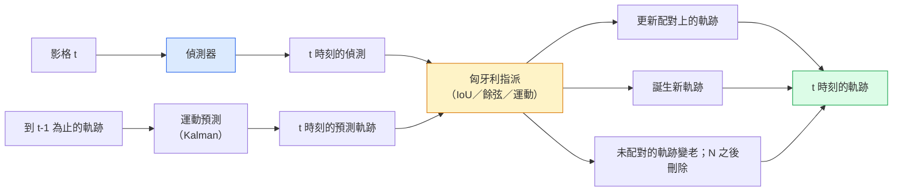

# 多物件追蹤（multi-object tracking）與影片記憶

> 追蹤是偵測加關聯。每一影格都偵測。用 ID 把這一影格的偵測配到上一影格的軌跡。

**Type:** Build
**Languages:** Python
**Prerequisites:** Phase 4 Lesson 06 (YOLO Detection), Phase 4 Lesson 08 (Mask R-CNN), Phase 4 Lesson 24 (SAM 3)
**Time:** ~60 minutes

## Learning Objectives｜學習目標

- 分辨以偵測為基礎的追蹤（tracking-by-detection）和以查詢為基礎的追蹤（query-based tracking），並說出演算法（algorithm）家族（SORT、DeepSORT、ByteTrack、BoT-SORT、SAM 2 記憶追蹤器、SAM 3.1 Object Multiplex）
- 從零實作交並比（intersection over union，IoU）加匈牙利指派（Hungarian assignment），做傳統的以偵測為基礎的追蹤
- 說明 SAM 2 的記憶庫，以及為什麼它處理遮擋比以 IoU 為基礎的關聯好
- 讀懂三個追蹤指標（MOTA、IDF1、HOTA），並依用途挑哪個要緊

## The Problem｜問題

偵測器告訴你物件在單一影格的哪裡。追蹤器告訴你影格 `t` 的哪個偵測，和影格 `t-1` 的哪個偵測是同一個物件。沒有這個，你沒辦法數越線的物件、球被遮住時仍跟著，或知道「4 號車已經在車道上 8 秒」。

所有以影片為核心的產品都需要追蹤：運動分析、監控、自駕車、醫學影片分析、野生動物監測、字標計數。核心積木是共用的：每一影格的偵測器、運動模型（Kalman 濾波或更豐富的東西）、關聯步驟（在 IoU、餘弦或學來的特徵上做匈牙利演算法），以及軌跡生命週期（誕生、更新、死亡）。

2026 年帶來兩個新模式：**SAM 2 以記憶為基礎的追蹤**（用特徵記憶取代運動模型的關聯），以及 **SAM 3.1 Object Multiplex**（同一個概念的許多實例共用記憶）。這一課先走傳統堆疊，再走到以記憶為基礎的做法。

## The Concept｜核心概念

### 以偵測為基礎的追蹤



2026 年你會遇到的每個追蹤器，都是這個迴圈的變體。差別：

- **SORT**（2016）。Kalman 濾波加 IoU 匈牙利。簡單、快、沒有外觀模型。
- **DeepSORT**（2017）。SORT 再加每條軌跡一個以 CNN 為基礎的外觀特徵（feature），也就是 ReID embedding。交會處理得更好。
- **ByteTrack**（2021）。低信心偵測當成第二階段來關聯。不需要外觀特徵，但在 MOT17 上名列前茅。
- **BoT-SORT**（2022）。Byte 加相機運動補償加 ReID。
- **StrongSORT／OC-SORT**。ByteTrack 的後代，運動和外觀都更好。

### 一段話講完 Kalman 濾波

Kalman 濾波為每條軌跡維持狀態 `(x, y, w, h, dx, dy, dw, dh)`，帶共變異數（covariance）。每一影格用等速模型**預測**狀態，再用配對上的偵測**更新**。預測不確定性高時，更新更相信偵測。軌跡因此平滑，短遮擋（1 到 5 影格）也能把軌跡接下去。

每個傳統追蹤器的運動預測步驟都用 Kalman 濾波。

### 匈牙利演算法

給定 `M x N` 的代價矩陣（軌跡乘偵測），找一對一指派，總代價最小。代價通常是 `1 - IoU(track_bbox, detection_bbox)`，或外觀特徵餘弦相似度的負值。執行時間是 O((M+N)^3)。M、N 到大約 1000 時，Python 裡用 `scipy.optimize.linear_sum_assignment` 夠快。

### ByteTrack 的要點

標準追蹤器丟掉信心低於 0.5 的偵測。ByteTrack 把它們留成**第二階段候選**：軌跡先和高信心偵測配完，沒配上的軌跡再用稍鬆的 IoU 閾值去配低信心偵測。短遮擋救得回來，人群附近的 ID 切換也救得回來。

### SAM 2 以記憶為基礎的追蹤

SAM 2 處理影片時，為每個實例留一份時空特徵的**記憶庫**。某一影格給 prompt（點、框、文字），把實例編碼進記憶。後面的影格，記憶和新影格的特徵做交叉注意力，解碼器在新影格產出同一個實例的遮罩。

沒有 Kalman 濾波，沒有匈牙利指派。關聯隱含在記憶注意力裡。

優點：

- 大段遮擋也穩（記憶把實例身分帶過很多影格）。
- 和 SAM 3 的文字 prompt 合在一起就是開放詞彙。
- 不必分開的運動模型。

缺點：

- 物件很多時比 ByteTrack 慢。
- 記憶庫會長大，限制上下文視窗。

### SAM 3.1 Object Multiplex

先前的 SAM 2／SAM 3 追蹤，每個實例一份記憶庫。50 個物件就是 50 個記憶庫。Object Multiplex（2026 年 3 月）把它們收進一個共享記憶，帶**每個實例的查詢 token**。代價隨實例數次線性成長。

2026 年人群追蹤的新預設是 Multiplex：演唱會人群、倉庫工人、路口。

### 要知道的三個指標

- **MOTA（多物件追蹤準確率，Multi-Object Tracking Accuracy）**。1 - (FN + FP + ID switches) / GT。依錯誤類型加權。一個指標把偵測失敗和關聯失敗混在一起。
- **IDF1（ID F1）**。ID 精確率和召回率的調和平均。專門看每條真實軌跡能不能一直保住自己的 ID。對 ID 切換敏感的任務，比 MOTA 好。
- **HOTA（高階追蹤準確率，Higher Order Tracking Accuracy）**。拆成偵測準確率（DetA）和關聯準確率（AssA）。2020 年起的社群標準。最完整。

監控（誰是誰）：回報 IDF1。運動分析（數傳球）：HOTA。一般學術比較：HOTA。

```figure
cv3-track-assoc
```

## Build It｜動手實作

### 步驟 1：以 IoU 為基礎的代價矩陣

```python
import numpy as np


def bbox_iou(a, b):
    """
    a, b: (N, 4) arrays of [x1, y1, x2, y2].
    Returns (N_a, N_b) IoU matrix.
    """
    ax1, ay1, ax2, ay2 = a[:, 0], a[:, 1], a[:, 2], a[:, 3]
    bx1, by1, bx2, by2 = b[:, 0], b[:, 1], b[:, 2], b[:, 3]
    inter_x1 = np.maximum(ax1[:, None], bx1[None, :])
    inter_y1 = np.maximum(ay1[:, None], by1[None, :])
    inter_x2 = np.minimum(ax2[:, None], bx2[None, :])
    inter_y2 = np.minimum(ay2[:, None], by2[None, :])
    inter = np.clip(inter_x2 - inter_x1, 0, None) * np.clip(inter_y2 - inter_y1, 0, None)
    area_a = (ax2 - ax1) * (ay2 - ay1)
    area_b = (bx2 - bx1) * (by2 - by1)
    union = area_a[:, None] + area_b[None, :] - inter
    return inter / np.clip(union, 1e-8, None)
```

### 步驟 2：最小的 SORT 風格追蹤器

等速 Kalman 為了簡短省略。這裡只用簡單的 IoU 關聯。正式環境裡 Kalman 預測不可少。完整版在 `sort` 這個 Python 套件。

```python
from scipy.optimize import linear_sum_assignment


class Track:
    def __init__(self, tid, bbox, frame):
        self.id = tid
        self.bbox = bbox
        self.last_frame = frame
        self.hits = 1

    def update(self, bbox, frame):
        self.bbox = bbox
        self.last_frame = frame
        self.hits += 1


class SimpleTracker:
    def __init__(self, iou_threshold=0.3, max_age=5):
        self.tracks = []
        self.next_id = 1
        self.iou_threshold = iou_threshold
        self.max_age = max_age

    def step(self, detections, frame):
        if not self.tracks:
            for d in detections:
                self.tracks.append(Track(self.next_id, d, frame))
                self.next_id += 1
            return [(t.id, t.bbox) for t in self.tracks]

        track_boxes = np.array([t.bbox for t in self.tracks])
        det_boxes = np.array(detections) if len(detections) else np.empty((0, 4))

        iou = bbox_iou(track_boxes, det_boxes) if len(det_boxes) else np.zeros((len(track_boxes), 0))
        cost = 1 - iou
        cost[iou < self.iou_threshold] = 1e6

        matched_track = set()
        matched_det = set()
        if cost.size > 0:
            row, col = linear_sum_assignment(cost)
            for r, c in zip(row, col):
                if cost[r, c] < 1.0:
                    self.tracks[r].update(det_boxes[c], frame)
                    matched_track.add(r); matched_det.add(c)

        for i, d in enumerate(det_boxes):
            if i not in matched_det:
                self.tracks.append(Track(self.next_id, d, frame))
                self.next_id += 1

        self.tracks = [t for t in self.tracks if frame - t.last_frame <= self.max_age]
        return [(t.id, t.bbox) for t in self.tracks]
```

60 行。接收每一影格的偵測結果，回每一影格的軌跡 ID。真正的系統還會加上 Kalman 預測、ByteTrack 的第二階段再配對，以及外觀特徵。

### 步驟 3：合成軌跡測試

```python
def synthetic_frames(num_frames=20, num_objects=3, H=240, W=320, seed=0):
    rng = np.random.default_rng(seed)
    starts = rng.uniform(20, 200, size=(num_objects, 2))
    velocities = rng.uniform(-5, 5, size=(num_objects, 2))
    frames = []
    for f in range(num_frames):
        dets = []
        for i in range(num_objects):
            cx, cy = starts[i] + f * velocities[i]
            dets.append([cx - 10, cy - 10, cx + 10, cy + 10])
        frames.append(dets)
    return frames


tracker = SimpleTracker()
for f, dets in enumerate(synthetic_frames()):
    tracks = tracker.step(dets, f)
```

三個物件走直線，20 影格都應該保住 ID。

### 步驟 4：ID 切換指標

```python
def count_id_switches(tracks_per_frame, gt_per_frame):
    """
    tracks_per_frame:  list of list of (track_id, bbox)
    gt_per_frame:      list of list of (gt_id, bbox)
    Returns number of ID switches.
    """
    prev_assignment = {}
    switches = 0
    for tracks, gts in zip(tracks_per_frame, gt_per_frame):
        if not tracks or not gts:
            continue
        t_boxes = np.array([b for _, b in tracks])
        g_boxes = np.array([b for _, b in gts])
        iou = bbox_iou(g_boxes, t_boxes)
        for g_idx, (gt_id, _) in enumerate(gts):
            j = iou[g_idx].argmax()
            if iou[g_idx, j] > 0.5:
                t_id = tracks[j][0]
                if gt_id in prev_assignment and prev_assignment[gt_id] != t_id:
                    switches += 1
                prev_assignment[gt_id] = t_id
    return switches
```

這是簡化的、靠近 IDF1 的指標：數真實物件換了幾次被指派的預測軌跡 ID。真正的 MOTA／IDF1／HOTA 工具在 `py-motmetrics` 和 `TrackEval`。

## Use It｜實際應用

2026 年正式環境的追蹤器：

- `ultralytics`。內建 YOLOv8 加 ByteTrack／BoT-SORT。`results = model.track(source, tracker="bytetrack.yaml")`。這是預設。
- `supervision`（Roboflow）。ByteTrack 的包裝，加上標註工具。
- SAM 2／SAM 3.1。用 `processor.track()` 做以記憶為基礎的追蹤。
- 自訂堆疊：偵測器（YOLOv8／RT-DETR）加 `sort-tracker`／`OC-SORT`／`StrongSORT`。

怎麼挑：

- 行人、車、箱子，每秒 30 影格以上：**ultralytics 的 ByteTrack**。
- 人群裡同一類的很多實例：**SAM 3.1 Object Multiplex**。
- 遮擋很重、但外觀認得出來：**DeepSORT／StrongSORT**（ReID 特徵）。
- 運動或複雜互動：**BoT-SORT**，或學來的追蹤器（MOTRv3）。

## Ship It｜交付成果

本課會產出：

- `outputs/prompt-tracker-picker.md`：依場景類型、遮擋形態和延遲預算，在 SORT、ByteTrack、BoT-SORT、SAM 2、SAM 3.1 之間挑
- `outputs/skill-mot-evaluator.md`：寫出完整的評估套件，對真實軌跡算 MOTA／IDF1／HOTA

## Exercises｜練習

1. **（簡單）** 用上面的合成追蹤器跑 3、10、30 個物件。回報每種的 ID 切換次數。指出只用 IoU 的關聯從哪裡開始失敗。
2. **（中等）** 在關聯之前加等速 Kalman 預測。證明短遮擋（2 到 3 影格）不再造成 ID 切換。
3. **（困難）** 用 `transformers` 接上 SAM 2 以記憶為基礎的追蹤器，當成另一個追蹤後端。在 30 秒的人群片段上同時跑 SimpleTracker 和 SAM 2，比較 ID 切換次數。用手標 5 個顯眼的人的真實 ID。

## Key Terms｜關鍵術語

| 術語 | 常見說法 | 實際意義 |
|------|----------------|----------------------|
| 以偵測為基礎的追蹤 | 「先偵測再關聯」 | 每一影格的偵測器，加上在 IoU 或外觀上的匈牙利指派 |
| Kalman 濾波 | 「運動預測」 | 線性動態加共變異，讓軌跡預測平滑，並處理遮擋 |
| 匈牙利演算法 | 「最佳指派」 | 解最小代價的二分圖配對。`scipy.optimize.linear_sum_assignment` |
| ByteTrack | 「低信心的第二輪」 | 沒配上的軌跡再去配低信心偵測，把短遮擋救回來 |
| DeepSORT | 「SORT 加外觀」 | 加上 ReID 特徵做跨影格配對。ID 比較保得住 |
| 記憶庫 | 「SAM 2 的手法」 | 跨影格存每個實例的時空特徵。交叉注意力取代明確的關聯 |
| Object Multiplex | 「SAM 3.1 的共享記憶」 | 一個共享記憶，每個實例各自查詢，用來快速追很多物件 |
| HOTA | 「現代追蹤指標」 | 拆成偵測準確率和關聯準確率。社群標準 |

## Further Reading｜延伸閱讀

- [SORT (Bewley et al., 2016)](https://arxiv.org/abs/1602.00763) ——最小的以偵測為基礎的追蹤論文
- [DeepSORT (Wojke et al., 2017)](https://arxiv.org/abs/1703.07402) ——加上外觀特徵
- [ByteTrack (Zhang et al., 2022)](https://arxiv.org/abs/2110.06864) ——低信心的第二輪
- [BoT-SORT (Aharon et al., 2022)](https://arxiv.org/abs/2206.14651) ——相機運動補償
- [HOTA (Luiten et al., 2020)](https://arxiv.org/abs/2009.07736) ——拆開的追蹤指標
- [SAM 2 video segmentation (Meta, 2024)](https://ai.meta.com/sam2/) ——以記憶為基礎的追蹤器
- [SAM 3.1 Object Multiplex (Meta, March 2026)](https://ai.meta.com/blog/segment-anything-model-3/)
