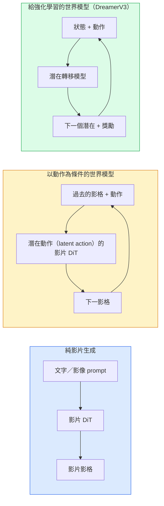

# 世界模型（world model）與影片擴散

> 能預測場景接下來幾秒的影片模型，就是世界模擬器。再把預測條件設成動作，你就有一個學來的遊戲引擎。

**Type:** Learn + Build
**Languages:** Python
**Prerequisites:** Phase 4 Lesson 10 (Diffusion), Phase 4 Lesson 12 (Video Understanding), Phase 4 Lesson 23 (DiT + Rectified Flow)
**Time:** ~75 minutes

## Learning Objectives｜學習目標

- 說明純影片生成模型（Sora 2）和以動作為條件的世界模型（Genie 3、DreamerV3）差在哪
- 描述影片 DiT：時空小塊、3D 位置編碼、跨 (T, H, W) token 的聯合注意力
- 追世界模型怎麼接進機器人：VLM 規劃，影片模型模擬，逆向動力學輸出動作
- 依用途在 Sora 2、Genie 3、Runway GWM-1 Worlds、Wan-Video、HunyuanVideo 之間挑（創意影片、互動模擬、自駕合成）

## The Problem｜問題

影片生成和世界建模在 2026 年匯到一起。能生成連貫一分鐘影片的模型，某種意義上學會了世界怎麼動：物體恆存、重力、因果、風格。如果把預測的條件設成動作（往左走、開門），影片模型就變成學得會的模擬器，可以取代遊戲引擎、駕駛模擬器，或機器人環境。

利害是具體的。Genie 3 從一張影像生成可玩的環境。Runway GWM-1 Worlds 合成無限可探索的場景。Sora 2 產出一分鐘的影片，音訊同步，物理也建了模型。NVIDIA Cosmos-Drive、Wayve Gaia-2、Tesla DrivingWorld 生成逼真的駕駛影片，當自駕車的訓練資料。世界模型這個典範，正逐漸成為機器人模擬轉實體部署的主流。

這一課是第 4 階段的全貌。它把影像生成、影片理解、agentic 推理接成主流研究正在走向的架構模式。

## The Concept｜核心概念

### 世界建模的三個家族



- **Sora 2** 是以 prompt 為條件的純影片生成。沒有動作介面。生成過程中無法引導它。
- **Genie 3**、**GWM-1 Worlds**、**Mirage／Magica** 是以動作為條件的世界模型。從觀察到的影片推論潛在動作（latent action），再以這些動作為條件預測未來影格。可以互動：你按鍵或移動相機，場景會回應。
- **DreamerV3** 和傳統的強化學習世界模型家族，在潛在空間裡預測，動作條件是明確的，用獎勵訊號訓練。視覺成分比較少。對樣本效率高的強化學習更有用。

### 影片 DiT 架構

```
Video latent:          (C, T, H, W)
Patchify (spatial):    grid of P_h x P_w patches per frame
Patchify (temporal):   group P_t frames into a temporal patch
Resulting tokens:      (T / P_t) * (H / P_h) * (W / P_w) tokens
```

位置編碼是 3D：每個 (t, h, w) 座標一個旋轉或學來的 embedding。注意力可以是：

- **完全聯合**。所有 token 看所有 token。N 個 token 是 O(N^2)。長影片負擔不起。
- **分開（divided attention）**。時間注意力和空間注意力交替。時間是同一個空間位置、跨時間：`(H*W) * T^2`。空間是同一個時間步、跨空間：`T * (H*W)^2`。TimeSformer 和大多數影片 DiT 用這個。
- **視窗**。(t, h, w) 裡的局部視窗。Video Swin 用這個。

2026 年每一個影片擴散模型都用這三種之一，再加上 AdaLN 條件（第 23 課）和整流流。

### 以動作為條件：潛在動作模型

Genie 用判別式，從連續兩影格之間預測動作，學每一影格的**潛在動作**。模型的解碼器條件是推論出來的潛在動作，不是明確的鍵盤按鍵。推論時，使用者可以指定一個潛在動作（或從新的先驗取樣），模型就生成和那個動作一致的下一影格。

Sora 完全跳過動作介面。解碼器從過去的時空 token 預測下一個時空 token。prompt 決定開頭。生成過程中沒有東西能引導它。

### 物理上說得通

Sora 2 在 2026 年的發布明確打出**物理上說得通**：重感、平衡、物體恆存、因果。團隊用人手評的合理分數來量。掉下去的物件、角色相撞、故意的失敗（沒跳到），都比 Sora 1 看得出來更好。

說得通仍然是主要的失敗模式。2024 到 2025 年，人吃義大利麵或用玻璃杯喝的影片，露出模型沒有持續的物件表徵。2026 年的模型（Sora 2、Runway Gen-5、HunyuanVideo）減少了這些，但沒有消掉。

### 自駕的世界模型

駕駛世界模型依軌跡、邊界框或導航地圖，生成逼真的道路場景。用法：

- **Cosmos-Drive-Dreams**（NVIDIA）。為強化學習訓練生成幾分鐘的駕駛影片。
- **Gaia-2**（Wayve）。以軌跡為條件的場景合成，用來評估策略。
- **DrivingWorld**（Tesla）。模擬不同天氣、一天裡的時段、車流。
- **Vista**（ByteDance）。會反應的駕駛場景合成。

它們取代昂貴的真實資料蒐集，那些特殊情境，夜間違規穿越的行人、結冰的路口、少見的車種，否則得開數百萬英里。

### 機器人堆疊：VLM 加影片模型加逆向動力學

正在成形的三元件機器人迴圈：

1. **VLM** 解析目標（「拿起紅色的杯子」），規劃高層動作序列。
2. **影片生成模型** 模擬每個動作做下去會怎樣，預測往前 N 影格的觀察。
3. **逆向動力學模型** 抽出會產出那些觀察的具體馬達指令。

這取代獎勵塑造和很吃樣本的強化學習。世界模型負責想像。逆向動力學把致動的迴圈閉起來。Genie Envisioner 是其中一個實例。很多研究組正在匯向這個結構。

### 評估

- **視覺品質**。FVD（Fréchet Video Distance）、使用者研究。
- **prompt 對齊**。每一影格的 CLIPScore、VQA 風格的評估。
- **物理上說得通**。在基準套件上人手評（Sora 2 的內部基準、VBench）。
- **可控性**（互動世界模型）。動作到觀察是否一致。能不能回到先前的狀態。

### 2026 年的模型版圖

| 模型 | 用途 | 參數（parameter） | 輸出 | 授權 |
|-------|-----|------------|--------|---------|
| Sora 2 | 文字到影片、音訊 | — | 1 分鐘 1080p 加音訊 | 只有 API |
| Runway Gen-5 | 文字／影像到影片 | — | 10 秒片段 | API |
| Runway GWM-1 Worlds | 互動世界 | — | 無限延續的 3D 模擬 | API |
| Genie 3 | 從影像來的互動世界 | 110 億以上 | 可玩的影格 | 研究預覽 |
| Wan-Video 2.1 | 開放的文字到影片 | 140 億 | 高品質片段 | 非商業 |
| HunyuanVideo | 開放的文字到影片 | 130 億 | 10 秒片段 | 授權寬鬆 |
| Cosmos／Cosmos-Drive | 自駕模擬 | 70 億到 140 億 | 駕駛場景 | NVIDIA 開放 |
| Magica／Mirage 2 | AI 原生遊戲引擎 | — | 可改的世界 | 產品 |

```figure
v4-world-rollout
```

## Build It｜動手實作

### 步驟 1：影片的 3D 切小塊

```python
import torch
import torch.nn as nn


class VideoPatch3D(nn.Module):
    def __init__(self, in_channels=4, dim=64, patch_t=2, patch_h=2, patch_w=2):
        super().__init__()
        self.proj = nn.Conv3d(
            in_channels, dim,
            kernel_size=(patch_t, patch_h, patch_w),
            stride=(patch_t, patch_h, patch_w),
        )
        self.patch_t = patch_t
        self.patch_h = patch_h
        self.patch_w = patch_w

    def forward(self, x):
        # x: (N, C, T, H, W)
        x = self.proj(x)
        n, c, t, h, w = x.shape
        tokens = x.reshape(n, c, t * h * w).transpose(1, 2)
        return tokens, (t, h, w)
```

步幅等於核大小的 3D 卷積，就當成時空的小塊切割器。token 格子是 `(T, H, W) -> (T/2, H/2, W/2)`。

### 步驟 2：3D 旋轉位置編碼

Rotary Position Embedding（RoPE）分別沿 `t`、`h`、`w` 軸套上：

```python
def rope_3d(tokens, t_dim, h_dim, w_dim, grid):
    """
    tokens: (N, T*H*W, D)
    grid: (T, H, W) sizes
    t_dim + h_dim + w_dim == D
    """
    T, H, W = grid
    n, seq, d = tokens.shape
    if t_dim + h_dim + w_dim != d:
        raise ValueError(f"t_dim+h_dim+w_dim ({t_dim}+{h_dim}+{w_dim}) must equal D={d}")
    assert seq == T * H * W
    t_idx = torch.arange(T, device=tokens.device).repeat_interleave(H * W)
    h_idx = torch.arange(H, device=tokens.device).repeat_interleave(W).repeat(T)
    w_idx = torch.arange(W, device=tokens.device).repeat(T * H)
    # Simplified: just scale channels by frequencies. Real RoPE rotates pairs.
    freqs_t = torch.exp(-torch.log(torch.tensor(10000.0)) * torch.arange(t_dim // 2, device=tokens.device) / (t_dim // 2))
    freqs_h = torch.exp(-torch.log(torch.tensor(10000.0)) * torch.arange(h_dim // 2, device=tokens.device) / (h_dim // 2))
    freqs_w = torch.exp(-torch.log(torch.tensor(10000.0)) * torch.arange(w_dim // 2, device=tokens.device) / (w_dim // 2))
    emb_t = torch.cat([torch.sin(t_idx[:, None] * freqs_t), torch.cos(t_idx[:, None] * freqs_t)], dim=-1)
    emb_h = torch.cat([torch.sin(h_idx[:, None] * freqs_h), torch.cos(h_idx[:, None] * freqs_h)], dim=-1)
    emb_w = torch.cat([torch.sin(w_idx[:, None] * freqs_w), torch.cos(w_idx[:, None] * freqs_w)], dim=-1)
    return tokens + torch.cat([emb_t, emb_h, emb_w], dim=-1)
```

簡化的加法形式。真正的 RoPE 把成對通道按頻率旋轉。位置資訊是一樣的。

### 步驟 3：分開的注意力（divided attention）區塊

```python
class DividedAttentionBlock(nn.Module):
    def __init__(self, dim=64, heads=2):
        super().__init__()
        self.time_attn = nn.MultiheadAttention(dim, heads, batch_first=True)
        self.space_attn = nn.MultiheadAttention(dim, heads, batch_first=True)
        self.ln1 = nn.LayerNorm(dim)
        self.ln2 = nn.LayerNorm(dim)
        self.ln3 = nn.LayerNorm(dim)
        self.mlp = nn.Sequential(nn.Linear(dim, 4 * dim), nn.GELU(), nn.Linear(4 * dim, dim))

    def forward(self, x, grid):
        T, H, W = grid
        n, seq, d = x.shape
        # time attention: same (h, w), across t
        xt = x.view(n, T, H * W, d).permute(0, 2, 1, 3).reshape(n * H * W, T, d)
        a, _ = self.time_attn(self.ln1(xt), self.ln1(xt), self.ln1(xt), need_weights=False)
        xt = (xt + a).reshape(n, H * W, T, d).permute(0, 2, 1, 3).reshape(n, seq, d)
        # space attention: same t, across (h, w)
        xs = xt.view(n, T, H * W, d).reshape(n * T, H * W, d)
        a, _ = self.space_attn(self.ln2(xs), self.ln2(xs), self.ln2(xs), need_weights=False)
        xs = (xs + a).reshape(n, T, H * W, d).reshape(n, seq, d)
        xs = xs + self.mlp(self.ln3(xs))
        return xs
```

時間注意力在每個空間位置上跨時間。空間注意力在每一影格裡跨位置。兩次 O(T^2 + (HW)^2)，而不是一次 O((THW)^2)。這是 TimeSformer 和每個現代影片 DiT 的核心。

### 步驟 4：組一個很小的影片 DiT

```python
class TinyVideoDiT(nn.Module):
    def __init__(self, in_channels=4, dim=64, depth=2, heads=2):
        super().__init__()
        self.patch = VideoPatch3D(in_channels=in_channels, dim=dim, patch_t=2, patch_h=2, patch_w=2)
        self.blocks = nn.ModuleList([DividedAttentionBlock(dim, heads) for _ in range(depth)])
        self.out = nn.Linear(dim, in_channels * 2 * 2 * 2)

    def forward(self, x):
        tokens, grid = self.patch(x)
        for blk in self.blocks:
            tokens = blk(tokens, grid)
        return self.out(tokens), grid
```

這不是能用的影片生成器。結構示範，每一塊的形狀都對。

### 步驟 5：檢查形狀

```python
vid = torch.randn(1, 4, 8, 16, 16)  # (N, C, T, H, W)
model = TinyVideoDiT()
out, grid = model(vid)
print(f"input  {tuple(vid.shape)}")
print(f"tokens grid {grid}")
print(f"output {tuple(out.shape)}")
```

切小塊之後，預期 `grid = (4, 8, 8)`、`out = (1, 256, 32)`。頭再投影成每個 token 的時空小塊，準備還原成影片。

## Use It｜實際應用

2026 年正式環境的取用方式：

- **Sora 2 API**（OpenAI）。文字到影片，音訊同步。價格偏高。
- **Runway Gen-5／GWM-1**（Runway）。影像到影片、互動世界。
- **Wan-Video 2.1／HunyuanVideo**。開放原始碼、自己架。
- **Cosmos／Cosmos-Drive**（NVIDIA）。駕駛模擬，權重開放。
- **Genie 3**。研究預覽，要申請存取。

要做互動世界模型的示範：從 Wan-Video 的品質開始，再疊一層潛在動作轉接器來互動。自駕模擬：Cosmos-Drive 是 2026 年的開放參考。

實際部署中的機器人堆疊：

1. 語言目標 -> VLM（Qwen3-VL）-> 高層計畫。
2. 計畫 -> 潛在動作的影片模型 -> 想像中的未來演進序列。
3. 展開 -> 逆向動力學模型 -> 低層動作。
4. 動作執行 -> 觀察送回步驟 1。

## Ship It｜交付成果

本課會產出：

- `outputs/prompt-video-model-picker.md`：依任務、授權和延遲，在 Sora 2、Runway、Wan、HunyuanVideo、Cosmos 之間挑
- `outputs/skill-physical-plausibility-checks.md`：定義自動檢查（物體恆存、重力、連續性），任何生成影片交付前都跑

## Exercises｜練習

1. **（簡單）** 算 5 秒、360p 影片在 patch-t=2、patch-h=8、patch-w=8 時的 token 數。推算這個大小下注意力的記憶體。
2. **（中等）** 把上面分開的注意力區塊換成完全聯合的注意力區塊，量形狀和參數數量。說明為什麼真實影片模型必須用分開的注意力。
3. **（困難）** 做一個最小的潛在動作影片模型：拿一份 (frame_t, action_t, frame_{t+1}) 三元組的資料集（任何簡單的 2D 遊戲），訓練一個以動作 embedding 為條件的很小影片 DiT，並顯示不同動作產出不同的下一影格。

## Key Terms｜關鍵術語

| 術語 | 常見說法 | 實際意義 |
|------|----------------|----------------------|
| 世界模型 | 「學來的模擬器」 | 給狀態和動作，預測未來觀察的模型 |
| 影片 DiT | 「時空 transformer」 | 帶 3D 切小塊和分開注意力的擴散 transformer |
| 潛在動作 | 「推論出來的控制」 | 從影格配對推論出的離散或連續動作潛在。用來當下一影格生成的條件 |
| 分開的注意力 | 「先時間再空間」 | 每個區塊兩次注意力，先跨時間再跨空間，好讓 O(N^2) 還扛得住 |
| 物體恆存 | 「東西保持是真的」 | 影片模型必須學的場景性質。食物和玻璃器皿上的經典失敗 |
| FVD | 「Fréchet Video Distance」 | 影片版的 FID。主要的視覺品質指標 |
| 逆向動力學模型 | 「從觀察到動作」 | 給（狀態、下一個狀態），輸出連接它們的動作。把機器人迴圈閉起來 |
| Cosmos-Drive | 「NVIDIA 的駕駛模擬」 | 開放權重的自駕世界模型，用來做強化學習和評估 |

## Further Reading｜延伸閱讀

- [Sora technical report (OpenAI)](https://openai.com/index/video-generation-models-as-world-simulators/)
- [Genie: Generative Interactive Environments (Bruce et al., 2024)](https://arxiv.org/abs/2402.15391) ——潛在動作的世界模型
- [TimeSformer (Bertasius et al., 2021)](https://arxiv.org/abs/2102.05095) ——影片 transformer 的分開注意力
- [DreamerV3 (Hafner et al., 2023)](https://arxiv.org/abs/2301.04104) ——給強化學習的世界模型
- [Cosmos-Drive-Dreams (NVIDIA, 2025)](https://research.nvidia.com/labs/toronto-ai/cosmos-drive-dreams/) ——駕駛世界模型
- [Top 10 Video Generation Models 2026 (DataCamp)](https://www.datacamp.com/blog/top-video-generation-models)
- [From Video Generation to World Model — survey repo](https://github.com/ziqihuangg/Awesome-From-Video-Generation-to-World-Model/)
