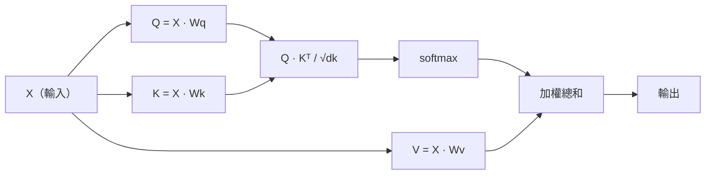

# 從零做自注意力（self-attention）

> 注意力（attention）是一張查詢（query）表：每個詞都問「誰跟我有關？」——然後學會答案。

**Type:** Build
**Languages:** Python
**Prerequisites:** Phase 3 (Deep Learning Core), Phase 5 Lesson 10 (Sequence-to-Sequence)
**Time:** ~90 minutes

## Learning Objectives｜學習目標

- 只用 NumPy，從零實作縮放點積自注意力（scaled dot-product self-attention），包含查詢（query）、鍵（key）、值（value）的投影（projection），以及 softmax 的加權總和
- 做出多頭注意力（multi-head attention）層：拆開頭、平行算注意力、再把結果串接起來
- 追蹤注意力矩陣（attention matrix）怎麼抓住 token 之間的關係，並解釋為什麼除以 sqrt(d_k) 能避免 softmax 飽和
- 套上因果遮罩（causal masking），把雙向注意力改成自迴歸（autoregressive）、解碼器（decoder）風格的注意力

## The Problem｜問題

RNN 一次處理序列裡的一個 token。等你走到第 50 個 token，第 1 個 token 的資訊已經被擠過 50 次壓縮。長程依賴被壓進固定大小的隱藏狀態（hidden state）——再多的 LSTM 閘控也解不開這個瓶頸。

2014 年 Bahdanau 的注意力論文提出解法：讓解碼器回頭看編碼器（encoder）的每個位置，決定哪些對目前這一步要緊。但它仍是硬接在 RNN 上的附加機制。2017 年的 “Attention Is All You Need” 問得更尖：如果注意力是*唯一*的機制呢？沒有循環。沒有卷積（convolution）。只有注意力。

自注意力讓序列裡每個位置，在單一個平行步驟裡對其他每個位置分配注意力。這就是 transformer 又快、又能縮放、又主導的原因。

## The Concept｜核心概念

### 資料庫查找的類比

注意力可以看成一次軟性的資料庫查找：

```
Traditional database:
  Query: "capital of France"  -->  exact match  -->  "Paris"

Attention:
  Query: "capital of France"  -->  similarity to ALL keys  -->  weighted blend of ALL values
```

每個 token 產生三個向量：
- **查詢（Q）**：「我在找什麼？」
- **鍵（K）**：「我含有什麼？」
- **值（V）**：「被選中時我提供什麼資訊？」

一個查詢和所有鍵的內積（dot product）產生注意力分數（attention score）。高分表示「這個鍵對上我的查詢」。這些分數用來為值加權。輸出是值的加權總和。

### Q、K、V 怎麼算

每個 token 的 embedding 透過三個學來的權重（weight）矩陣做投影：

```
Input embeddings (sequence of n tokens, each d-dimensional):

  X = [x1, x2, x3, ..., xn]       shape: (n, d)

Three weight matrices:

  Wq  shape: (d, dk)
  Wk  shape: (d, dk)
  Wv  shape: (d, dv)

Projections:

  Q = X @ Wq    shape: (n, dk)      each token's query
  K = X @ Wk    shape: (n, dk)      each token's key
  V = X @ Wv    shape: (n, dv)      each token's value
```

視覺上，對一個 token：

```
             Wq
  x_i ------[*]------> q_i    "What am I looking for?"
       |
       |     Wk
       +----[*]------> k_i    "What do I contain?"
       |
       |     Wv
       +----[*]------> v_i    "What do I offer?"
```

### 注意力矩陣

所有 token 都有了 Q、K、V，注意力分數就排成一張矩陣：

```
Scores = Q @ K^T    shape: (n, n)

              k1    k2    k3    k4    k5
        +-----+-----+-----+-----+-----+
   q1   | 2.1 | 0.3 | 0.1 | 0.8 | 0.2 |   <- how much q1 attends to each key
        +-----+-----+-----+-----+-----+
   q2   | 0.4 | 1.9 | 0.7 | 0.1 | 0.3 |
        +-----+-----+-----+-----+-----+
   q3   | 0.2 | 0.6 | 2.3 | 0.5 | 0.1 |
        +-----+-----+-----+-----+-----+
   q4   | 0.9 | 0.1 | 0.4 | 1.7 | 0.6 |
        +-----+-----+-----+-----+-----+
   q5   | 0.1 | 0.3 | 0.2 | 0.5 | 2.0 |
        +-----+-----+-----+-----+-----+

Each row: one token's attention over the entire sequence
```

一次看一個查詢掃過那些鍵：每一列給每個 token 打分，softmax 把分數變成權重，脈絡向量（context vector）是值的加權混合。

```figure
attention-matrix
```

### 為什麼要縮放？

內積隨維度（dimension）dk 變大。若 dk = 64，內積可以到幾十，把 softmax 推進梯度（gradient）消失的區域。修法：除以 sqrt(dk)。

```
Scaled scores = (Q @ K^T) / sqrt(dk)
```

這把數值留在 softmax 能產生有用梯度的範圍。

### Softmax 把分數變成權重

Softmax 把原始分數變成每一列上的機率分布（probability distribution）：

```
Raw scores for q1:   [2.1, 0.3, 0.1, 0.8, 0.2]
                            |
                         softmax
                            |
Attention weights:   [0.52, 0.09, 0.07, 0.14, 0.08]   (sums to ~1.0)
```

現在每個 token 有一組權重，說明要多注意其他每個 token。

### 值的加權總和

每個 token 的最終輸出，是所有值向量的加權總和：

```
output_i = sum( attention_weight[i][j] * v_j  for all j )

For token 1:
  output_1 = 0.52 * v1 + 0.09 * v2 + 0.07 * v3 + 0.14 * v4 + 0.08 * v5
```

### 完整管線（pipeline）



公式寫成一行：

```
Attention(Q, K, V) = softmax( Q @ K^T / sqrt(dk) ) @ V
```

```figure
softmax-attention-scaling
```

## Build It｜動手實作

### 步驟 1：從零做 Softmax

Softmax 把原始 logits 變成機率。為了數值穩定（numerical stability），先減掉最大值。

```python
import numpy as np

def softmax(x):
    shifted = x - np.max(x, axis=-1, keepdims=True)
    exp_x = np.exp(shifted)
    return exp_x / np.sum(exp_x, axis=-1, keepdims=True)

logits = np.array([2.0, 1.0, 0.1])
print(f"logits:  {logits}")
print(f"softmax: {softmax(logits)}")
print(f"sum:     {softmax(logits).sum():.4f}")
```

### 步驟 2：縮放點積注意力

核心函式。吃進 Q、K、V 矩陣，回傳注意力輸出和權重矩陣。

```python
def scaled_dot_product_attention(Q, K, V):
    dk = Q.shape[-1]
    scores = Q @ K.T / np.sqrt(dk)
    weights = softmax(scores)
    output = weights @ V
    return output, weights
```

### 步驟 3：帶學來投影的自注意力類別

完整的自注意力模組，Wq、Wk、Wv 用類似 Xavier 的縮放來初始化。

```python
class SelfAttention:
    def __init__(self, d_model, dk, dv, seed=42):
        rng = np.random.default_rng(seed)
        scale = np.sqrt(2.0 / (d_model + dk))
        self.Wq = rng.normal(0, scale, (d_model, dk))
        self.Wk = rng.normal(0, scale, (d_model, dk))
        scale_v = np.sqrt(2.0 / (d_model + dv))
        self.Wv = rng.normal(0, scale_v, (d_model, dv))
        self.dk = dk

    def forward(self, X):
        Q = X @ self.Wq
        K = X @ self.Wk
        V = X @ self.Wv
        output, weights = scaled_dot_product_attention(Q, K, V)
        return output, weights
```

### 步驟 4：在一句話上跑

為一個句子產生假的 embedding，觀察注意力權重。

```python
sentence = ["The", "cat", "sat", "on", "the", "mat"]
n_tokens = len(sentence)
d_model = 8
dk = 4
dv = 4

rng = np.random.default_rng(42)
X = rng.normal(0, 1, (n_tokens, d_model))

attn = SelfAttention(d_model, dk, dv, seed=42)
output, weights = attn.forward(X)

print("Attention weights (each row: where that token looks):\n")
print(f"{'':>6}", end="")
for token in sentence:
    print(f"{token:>6}", end="")
print()

for i, token in enumerate(sentence):
    print(f"{token:>6}", end="")
    for j in range(n_tokens):
        w = weights[i][j]
        print(f"{w:6.3f}", end="")
    print()
```

### 步驟 5：用 ASCII 熱圖看注意力

把注意力權重對到字元，做一個快速的視覺。

```python
def ascii_heatmap(weights, tokens, chars=" ░▒▓█"):
    n = len(tokens)
    print(f"\n{'':>6}", end="")
    for t in tokens:
        print(f"{t:>6}", end="")
    print()

    for i in range(n):
        print(f"{tokens[i]:>6}", end="")
        for j in range(n):
            level = int(weights[i][j] * (len(chars) - 1) / weights.max())
            level = min(level, len(chars) - 1)
            print(f"{'  ' + chars[level] + '   '}", end="")
        print()

ascii_heatmap(weights, sentence)
```

## Use It｜實際應用

PyTorch 的 `nn.MultiheadAttention` 做的正是我們做的，再加上多頭拆分和輸出投影：

```python
import torch
import torch.nn as nn

d_model = 8
n_heads = 2
seq_len = 6

mha = nn.MultiheadAttention(embed_dim=d_model, num_heads=n_heads, batch_first=True)

X_torch = torch.randn(1, seq_len, d_model)

output, attn_weights = mha(X_torch, X_torch, X_torch)

print(f"Input shape:            {X_torch.shape}")
print(f"Output shape:           {output.shape}")
print(f"Attention weight shape: {attn_weights.shape}")
print(f"\nAttn weights (averaged over heads):")
print(attn_weights[0].detach().numpy().round(3))
```

關鍵差別：多頭注意力平行跑多個注意力函式，各自有自己的 Q、K、V 投影，大小是 dk = d_model / n_heads，再把結果串接起來。這讓模型同時注意不同類型的關係。

## Ship It｜交付成果

這一課產出：
- `outputs/prompt-attention-explainer.md`——一個 prompt，用資料庫查找的類比來解釋注意力

## Exercises｜練習

1. 改 `scaled_dot_product_attention`，讓它接受一個可選的遮罩矩陣，在 softmax 之前把某些位置設成負無窮（因果／解碼器遮罩就是這樣做的）
2. 從零實作多頭注意力：把 Q、K、V 拆成 `n_heads` 塊，各自跑注意力，串接，再透過最終權重矩陣 Wo 投影
3. 拿兩句長度相同、內容不同的句子，送進同一個 SelfAttention 實例，比較注意力模式。什麼變了？什麼沒變？

## Key Terms｜關鍵術語

| 術語 | 常見說法 | 實際意義 |
|------|----------------|----------------------|
| 查詢（Q） | 「問題向量」 | 輸入的一個學來的投影，代表這個 token 在找什麼資訊 |
| 鍵（K） | 「標記向量」 | 一個學來的投影，代表這個 token 含有什麼資訊，用來和查詢比對 |
| 值（V） | 「內容向量」 | 一個學來的投影，帶著真正的資訊，依注意力分數被加總 |
| 縮放點積注意力 | 「那個注意力公式」 | softmax(QK^T / sqrt(dk)) @ V——縮放避免高維度時 softmax 飽和 |
| 自注意力 | 「token 看自己也看別人」 | Q、K、V 都來自同一條序列，讓每個位置注意到其他每個位置 |
| 注意力權重 | 「有多聚焦」 | 位置上的機率分布，由縮放後內積的 softmax 產生 |
| 多頭注意力 | 「平行的注意力」 | 用不同投影跑多個注意力函式，再把結果串接成更豐富的表示 |

## Further Reading｜延伸閱讀

- [Attention Is All You Need (Vaswani et al., 2017)](https://arxiv.org/abs/1706.03762) ——原始的 transformer 論文。
- [The Illustrated Transformer (Jay Alammar)](https://jalammar.github.io/illustrated-transformer/) ——整個架構最好的視覺導覽。
- [The Annotated Transformer (Harvard NLP)](https://nlp.seas.harvard.edu/annotated-transformer/) ——逐行的 PyTorch 實作，附說明。
