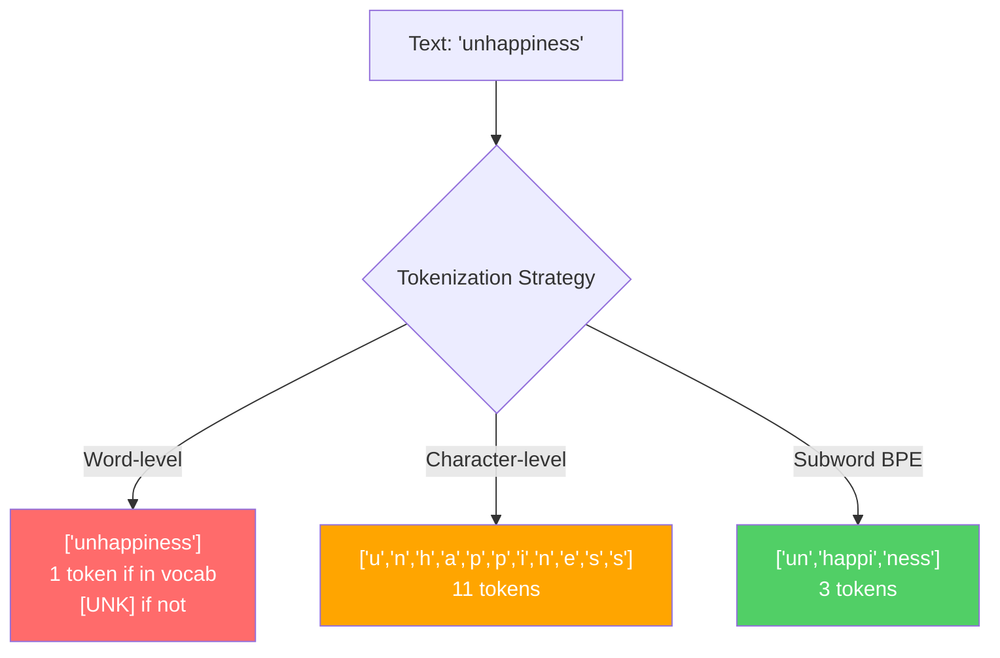
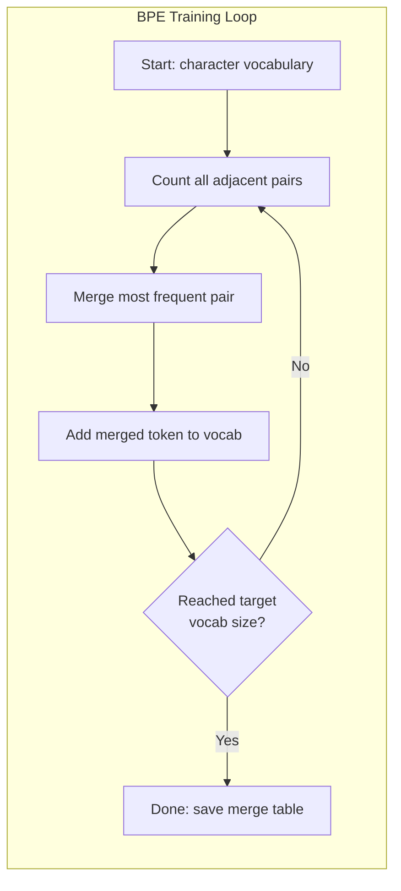
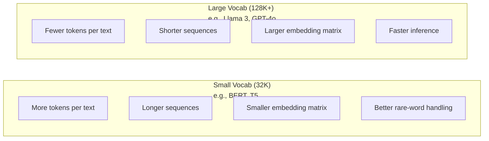

# Tokenizers：BPE、WordPiece、SentencePiece

> 你的 LLM 讀不懂英文。它讀的是整數。Tokenizer 決定了這些整數是承載意義，還是平白浪費容量。

**Type:** Build
**Languages:** Python
**Prerequisites:** Phase 05 (NLP Foundations)
**Time:** ~90 minutes

## Learning Objectives｜學習目標

- 從零實作 BPE、WordPiece 與 Unigram tokenization 演算法，並比較它們的合併策略
- 解釋詞彙表大小如何影響模型效率：太小會產生過長的序列，太大則會浪費 embedding 參數（parameter）
- 分析不同語言與程式碼中的 tokenization 瑕疵，識別特定 tokenizer 在哪些情況下失效
- 使用 tiktoken 與 sentencepiece 函式庫對文字進行 tokenization，並檢視產生的 token ID

## The Problem｜問題

你的 LLM 讀不懂英文。它讀不懂任何人類語言。它讀的是數字。

「Hello, world!」與 [15496, 11, 995, 0] 之間的橋樑就是 tokenizer。每個字詞、每個空格、每個標點符號，在模型能處理之前都必須先轉換成整數。這個轉換並不是中立的。它在模型中植入了日後無法逆轉的預設假設。

如果這一步做錯了，你的模型就會浪費容量，用多個 token 來編碼常見字詞。「unfortunately」會變成四個 token 而不是一個。對於大量包含多音節字詞的文字，你的 128K 脈絡視窗（context window）直接縮水了 75%。如果這一步做對了，同一個脈絡視窗就能容納兩倍的語意內涵。「這個模型能妥善處理程式碼」與「這個模型被 Python 卡死」之間的差別，往往就取決於 tokenizer 當初是如何訓練的。

你對 GPT-4 或 Claude 發出的每一次 API 呼叫，都是按 token 計費的。你的模型每生成一個 token，都需要耗費運算資源。表示輸出所需的 token 越少，端到端的推論（inference）速度就越快。Tokenization 不只是前處理，它是架構本身的一部分。

## The Concept｜核心概念

### 三種失敗的途徑（與一種勝出的方法）

將文字轉換為數字有三種顯而易見的方法。其中兩種在規模化時根本行不通。

**詞層級（Word-level）tokenization** 依空格與標點符號進行切分。「The cat sat」會變成 ["The", "cat", "sat"]。很直覺。但遇到「tokenization」呢？或者「GPT-4o」？又或是像德語的複合詞「Geschwindigkeitsbegrenzung」呢？詞層級需要龐大無比的詞彙表，才能涵蓋每一種語言中的每一個字詞。只要漏掉一個詞，就會出現令人頭痛的 `[UNK]` token——這是模型在表示「我完全不知道這是什麼」。光是英語就有超過一百萬種詞形變化。再加上程式碼、URL、科學記號與其他 100 種語言，你就需要一個無窮大的詞彙表。

**字元層級（Character-level）tokenization** 走向另一個極端。「hello」會變成 ["h", "e", "l", "l", "o"]。詞彙表非常小（只有幾百個字元）。永遠不會有未知的 token。但序列會變得極長。原本在詞層級只需 10 個 token 的句子，在字元層級會變成 50 個 token。模型必須自行學會「t」、「h」、「e」連在一起代表「the」——把注意力（attention）容量浪費在人類三歲就能掌握的事情上。

**子詞（Subword）tokenization** 找到了甜蜜點。常見字詞保持完整：「the」是一個 token。罕見字詞則拆解為有意義的片段：「unhappiness」變成 ["un", "happi", "ness"]。詞彙表維持在可控的規模（3 萬到 12.8 萬個 token）。序列保持精簡。未知的 token 基本上完全消失，因為任何字詞都能由子詞片段組合而成。

所有現代 LLM 都採用子詞 tokenization。GPT-2、GPT-4、BERT、Llama 3、Claude——無一例外。關鍵在於採用哪種演算法。



### BPE：Byte Pair Encoding

BPE 是一種貪婪壓縮演算法，後來改用於 tokenization。其核心概念簡單到能寫在一張索引卡上：

從個別字元開始。統計訓練語料庫（training corpus）中每一對相鄰的配對。將出現頻率最高的那一對合併為一個新的 token。重複這個步驟，直到達到你的目標詞彙表大小為止。

```figure
tokenizer-bpe
```

以下是 BPE 在包含「lower」、「lowest」與「newest」這幾個詞的小型語料庫上執行的過程：

```
Corpus (with word frequencies):
  "lower"  x5
  "lowest" x2
  "newest" x6

Step 0 -- Start with characters:
  l o w e r       (x5)
  l o w e s t     (x2)
  n e w e s t     (x6)

Step 1 -- Count adjacent pairs:
  (e,s): 8    (s,t): 8    (l,o): 7    (o,w): 7
  (w,e): 13   (e,r): 5    (n,e): 6    ...

Step 2 -- Merge most frequent pair (w,e) -> "we":
  l o we r        (x5)
  l o we s t      (x2)
  n e we s t      (x6)

Step 3 -- Recount and merge (e,s) -> "es":
  l o we r        (x5)
  l o we s t      (x2)    <- 'es' only forms from 'e'+'s', not 'we'+'s'
  n e we s t      (x6)    <- wait, the 'e' before 'we' and 's' after 'we'

Actually tracking this precisely:
  After "we" merge, remaining pairs:
  (l,o): 7   (o,we): 7   (we,r): 5   (we,s): 8
  (s,t): 8   (n,e): 6    (e,we): 6

Step 3 -- Merge (we,s) -> "wes" or (s,t) -> "st" (tied at 8, pick first):
  Merge (we,s) -> "wes":
  l o we r        (x5)
  l o wes t       (x2)
  n e wes t       (x6)

Step 4 -- Merge (wes,t) -> "west":
  l o we r        (x5)
  l o west        (x2)
  n e west        (x6)

...continue until target vocab size reached.
```

這張合併表就是 tokenizer 本身。要對新文字進行編碼時，只需按照學習時的順序套用各項合併。訓練語料庫（training corpus）決定了存在哪些合併，而這個選擇將永久形塑模型所看見的內容。



### 位元組層級 BPE（GPT-2、GPT-3、GPT-4）

標準的 BPE 是在 Unicode 字元上操作。位元組層級（Byte-level）BPE 則直接在原始位元組（0-255）上操作。這能提供剛好 256 個基礎詞彙，可以處理任何語言或編碼，而且永遠不會產生未知的 token。

GPT-2 開創了這個方法。基礎詞彙表涵蓋了每一個可能的位元組，BPE 合併規則在此之上逐步建立。OpenAI 的 tiktoken 函式庫實作了位元組層級 BPE，詞彙表大小如下：

- GPT-2：50,257 個 token
- GPT-3.5/GPT-4：約 100,256 個 token（cl100k_base 編碼）
- GPT-4o：200,019 個 token（o200k_base 編碼）

### WordPiece（BERT）

WordPiece 看起來與 BPE 相似，但挑選合併配對的準則不同。它不是依據純粹的出現頻率，而是最大化訓練資料的概似度：

```
BPE merge criterion:      count(A, B)
WordPiece merge criterion: count(AB) / (count(A) * count(B))
```

BPE 問的是：「哪一對出現得最頻繁？」WordPiece 問的則是：「哪一對共同出現的頻率，遠高於純屬巧合的預期值？」這個細微的差異產生了不同的詞彙表。WordPiece 偏好那些共同出現令人感到意外、而不僅僅是頻率高的合併。

WordPiece 還使用「##」前綴來標記接續的子詞：

```
"unhappiness" -> ["un", "##happi", "##ness"]
"embedding"   -> ["em", "##bed", "##ding"]
```

「##」前綴告訴你這個片段是前一個 token 的接續。BERT 使用 WordPiece，詞彙表大小為 30,522 個 token。所有的 BERT 變體——DistilBERT 等；RoBERTa 的 tokenizer 實際上是 BPE，但 BERT 本身是 WordPiece。

### SentencePiece（Llama、T5）

SentencePiece 將輸入視為單純的 Unicode 字元串流，包括空格在內。完全不需要預先切分步驟（pre-tokenization），也不需要針對特定語言設定詞界規則。這讓它真正達到與語言無關——它適用於中文、日文、泰文，以及其他不用空格切分字詞的語言。

SentencePiece 支援兩種演算法：
- **BPE 模式**：與標準 BPE 相同的合併邏輯，套用在原始字元序列上
- **Unigram 模式**：從龐大的詞彙表開始，反覆移除對整體概似度影響最小的 token。這與 BPE 的方向相反——是剪枝而非合併。

Llama 2 使用 SentencePiece BPE，詞彙表為 32,000 個 token。T5 使用 SentencePiece Unigram，詞彙表為 32,000 個 token。注意：Llama 3 已轉向基於 tiktoken 的位元組層級 BPE tokenizer，詞彙表為 128,256 個 token。

### 詞彙表大小的權衡取捨

這是一項具有可量化後果的真實工程決策。



具體數字來看：對於具有 4,096 維 embedding 的 128K 詞彙表，光是 embedding 矩陣本身就有 128,000 x 4,096 = 5.24 億個參數（parameter）。對於 32K 詞彙表，則是 1.31 億個參數（parameter）。單純因為 tokenizer 的選擇，就帶來了 4 億個參數（parameter）的差異。

但較大的詞彙表能更積極地壓縮文字。同一段英文，在 32K 詞彙表下需要 100 個 token，在 128K 詞彙表下可能只需要 70 個 token。這意味著在生成過程中前向傳遞次數減少了 30%。對於服務數百萬次請求的模型而言，這直接降低了運算成本。

趨勢非常明顯：詞彙表正在持續擴大。GPT-2 使用 50,257。GPT-4 使用約 10 萬。Llama 3 使用 12.8 萬。GPT-4o 使用 20 萬。

| 模型 | 詞彙表大小 | Tokenizer 類型 | 平均每個英文單字的 Token 數 |
|-------|-----------|----------------|---------------------------|
| BERT | 30,522 | WordPiece | ~1.4 |
| GPT-2 | 50,257 | Byte-level BPE | ~1.3 |
| Llama 2 | 32,000 | SentencePiece BPE | ~1.4 |
| GPT-4 | ~100,256 | Byte-level BPE | ~1.2 |
| Llama 3 | 128,256 | Byte-level BPE (tiktoken) | ~1.1 |
| GPT-4o | 200,019 | Byte-level BPE | ~1.0 |

### 多語言稅（The Multilingual Tax）

主要在英文上訓練的 tokenizer，對其他語言非常殘酷。韓文在 GPT-2 的 tokenizer 中平均每個詞需要 2 到 3 個 token。中文的情況甚至更嚴重。這意味著韓文使用者所擁有的實質脈絡視窗，只有英文使用者的一半長度——花費相同的價格，卻只能得到一半的資訊密度。

這就是為什麼 Llama 3 將其詞彙表從 32K 擴大了四倍至 128K。將更多 token 分配給非拉丁字母語言，意味著能跨語言實現更公平的壓縮效率。

```figure
tokenizer-tradeoff
```

## Build It｜動手實作

### 步驟 1：字元層級 Tokenizer

從最基礎的開始。字元層級 tokenizer 將每個字元直接映射到其 Unicode 碼位（code point）。不需要任何訓練，永遠沒有未知的 token，只是單純的一對一映射。

```python
class CharTokenizer:
    def encode(self, text):
        return [ord(c) for c in text]

    def decode(self, tokens):
        return "".join(chr(t) for t in tokens)
```

「hello」會變成 [104, 101, 108, 108, 111]。每個字元都是自己的 token。這是我們用來改進的基準線。

### 步驟 2：從零實作 BPE Tokenizer

真正的實作。我們在原始位元組上進行訓練（如同 GPT-2），統計配對頻率，合併最頻繁的配對，並依序記錄每一次合併。這張合併表就是 tokenizer。

```python
from collections import Counter

class BPETokenizer:
    def __init__(self):
        self.merges = {}
        self.vocab = {}

    def _get_pairs(self, tokens):
        pairs = Counter()
        for i in range(len(tokens) - 1):
            pairs[(tokens[i], tokens[i + 1])] += 1
        return pairs

    def _merge_pair(self, tokens, pair, new_token):
        merged = []
        i = 0
        while i < len(tokens):
            if i < len(tokens) - 1 and tokens[i] == pair[0] and tokens[i + 1] == pair[1]:
                merged.append(new_token)
                i += 2
            else:
                merged.append(tokens[i])
                i += 1
        return merged

    def train(self, text, num_merges):
        tokens = list(text.encode("utf-8"))
        self.vocab = {i: bytes([i]) for i in range(256)}

        for i in range(num_merges):
            pairs = self._get_pairs(tokens)
            if not pairs:
                break
            best_pair = max(pairs, key=pairs.get)
            new_token = 256 + i
            tokens = self._merge_pair(tokens, best_pair, new_token)
            self.merges[best_pair] = new_token
            self.vocab[new_token] = self.vocab[best_pair[0]] + self.vocab[best_pair[1]]

        return self

    def encode(self, text):
        tokens = list(text.encode("utf-8"))
        for pair, new_token in self.merges.items():
            tokens = self._merge_pair(tokens, pair, new_token)
        return tokens

    def decode(self, tokens):
        byte_sequence = b"".join(self.vocab[t] for t in tokens)
        return byte_sequence.decode("utf-8", errors="replace")
```

訓練迴圈是 BPE 的核心：計算配對、合併勝出者、重複執行。每一次合併都會減少 token 的總數。經過 `num_merges` 輪之後，詞彙表從 256（基礎位元組）成長到 256 + num_merges。

編碼時會按照學習到的確切順序套用各項合併。這非常重要。如果第 1 次合併建立了「th」，第 5 次合併建立了「the」，編碼必須先套用第 1 次合併，這樣「the」才能在第 5 次合併中由「th」+「e」組合而成。

解碼則是相反過程：在詞彙表中查閱每個 token ID，串接位元組，並解碼為 UTF-8。

### 步驟 3：編碼與解碼來回驗證

```python
corpus = (
    "The cat sat on the mat. The cat ate the rat. "
    "The dog sat on the log. The dog ate the frog. "
    "Natural language processing is the study of how computers "
    "understand and generate human language. "
    "Tokenization is the first step in any NLP pipeline."
)

tokenizer = BPETokenizer()
tokenizer.train(corpus, num_merges=40)

test_sentences = [
    "The cat sat on the mat.",
    "Natural language processing",
    "tokenization pipeline",
    "unhappiness",
]

for sentence in test_sentences:
    encoded = tokenizer.encode(sentence)
    decoded = tokenizer.decode(encoded)
    raw_bytes = len(sentence.encode("utf-8"))
    ratio = len(encoded) / raw_bytes
    print(f"'{sentence}'")
    print(f"  Tokens: {len(encoded)} (from {raw_bytes} bytes) -- ratio: {ratio:.2f}")
    print(f"  Roundtrip: {'PASS' if decoded == sentence else 'FAIL'}")
```

壓縮率（compression ratio）告訴你 tokenizer 的效能如何。0.50 的壓縮率意味著 tokenizer 將文字壓縮為原始位元組數量一半的 token。數值越低越好。在訓練語料庫（training corpus）上，壓縮率會相當不錯。但在分布外（out-of-distribution）的文字上，例如「unhappiness」（並未出現在語料庫中），壓縮率會變差——tokenizer 會退回使用字元層級來編碼未曾見過的模式。

### 步驟 4：與 tiktoken 進行比較

```python
import tiktoken

enc = tiktoken.get_encoding("cl100k_base")

texts = [
    "The cat sat on the mat.",
    "unhappiness",
    "Hello, world!",
    "def fibonacci(n): return n if n < 2 else fibonacci(n-1) + fibonacci(n-2)",
    "Geschwindigkeitsbegrenzung",
]

for text in texts:
    our_tokens = tokenizer.encode(text)
    tiktoken_tokens = enc.encode(text)
    tiktoken_pieces = [enc.decode([t]) for t in tiktoken_tokens]
    print(f"'{text}'")
    print(f"  Our BPE:   {len(our_tokens)} tokens")
    print(f"  tiktoken:  {len(tiktoken_tokens)} tokens -> {tiktoken_pieces}")
```

tiktoken 使用完全相同的演算法，但在數百 GB 的文字上進行訓練，並擁有 10 萬次合併。兩者的演算法是一模一樣的。差別在於訓練資料規模與合併次數。你在一段文字上訓練了 40 次合併的 tokenizer，無法與在大規模語料庫上訓練 10 萬次合併的 tiktoken 相比。但底層機制毫無二致。

### 步驟 5：詞彙表分析

```python
def analyze_vocabulary(tokenizer, test_texts):
    total_tokens = 0
    total_chars = 0
    token_usage = Counter()

    for text in test_texts:
        encoded = tokenizer.encode(text)
        total_tokens += len(encoded)
        total_chars += len(text)
        for t in encoded:
            token_usage[t] += 1

    print(f"Vocabulary size: {len(tokenizer.vocab)}")
    print(f"Total tokens across all texts: {total_tokens}")
    print(f"Total characters: {total_chars}")
    print(f"Avg tokens per character: {total_tokens / total_chars:.2f}")

    print(f"\nMost used tokens:")
    for token_id, count in token_usage.most_common(10):
        token_bytes = tokenizer.vocab[token_id]
        display = token_bytes.decode("utf-8", errors="replace")
        print(f"  Token {token_id:4d}: '{display}' (used {count} times)")

    unused = [t for t in tokenizer.vocab if t not in token_usage]
    print(f"\nUnused tokens: {len(unused)} out of {len(tokenizer.vocab)}")
```

這揭示了詞彙表中的齊夫分布（Zipf distribution）。少數 token 佔據了極大比例（空格、「the」、「e」）。大多數 token 很少被使用。正式環境中的 tokenizer 會針對這種分布進行最佳化——常見模式獲得較短的 token ID，罕見模式則使用較長的表示方式。

## Use It｜實際應用

你從零打造的 BPE 已經可以運作。現在來看看生產級工具的樣貌。

### tiktoken（OpenAI）

```python
import tiktoken

enc = tiktoken.get_encoding("cl100k_base")

text = "Tokenizers convert text to integers"
tokens = enc.encode(text)
print(f"Tokens: {tokens}")
print(f"Pieces: {[enc.decode([t]) for t in tokens]}")
print(f"Roundtrip: {enc.decode(tokens)}")
```

tiktoken 是用 Rust 撰寫並提供 Python 綁定的套件。它每秒能編碼數百萬個 token。相同的 BPE 演算法，工業級強度的實作。

### Hugging Face tokenizers

```python
from tokenizers import Tokenizer
from tokenizers.models import BPE
from tokenizers.trainers import BpeTrainer
from tokenizers.pre_tokenizers import ByteLevel

tokenizer = Tokenizer(BPE())
tokenizer.pre_tokenizer = ByteLevel()

trainer = BpeTrainer(vocab_size=1000, special_tokens=["<pad>", "<eos>", "<unk>"])
tokenizer.train(["corpus.txt"], trainer)

output = tokenizer.encode("The cat sat on the mat.")
print(f"Tokens: {output.tokens}")
print(f"IDs: {output.ids}")
```

Hugging Face 的 tokenizers 函式庫底層同樣是以 Rust 實作。它能在幾秒鐘內於 GB 級語料庫上訓練 BPE。當你要訓練自己的模型時，這就是你所使用的工具。

### 載入 Llama 的 Tokenizer

```python
from transformers import AutoTokenizer

tokenizer = AutoTokenizer.from_pretrained("meta-llama/Llama-3.1-8B")

text = "Tokenizers are the unsung heroes of LLMs"
tokens = tokenizer.encode(text)
print(f"Token IDs: {tokens}")
print(f"Tokens: {tokenizer.convert_ids_to_tokens(tokens)}")
print(f"Vocab size: {tokenizer.vocab_size}")

multilingual = ["Hello world", "Hola mundo", "Bonjour le monde"]
for text in multilingual:
    ids = tokenizer.encode(text)
    print(f"'{text}' -> {len(ids)} tokens")
```

Llama 3 的 12.8 萬詞彙表壓縮非英語文字的效果明顯優於 GPT-2 的 5 萬詞彙表。你可以自行驗證——以多種語言編碼相同的句子，並統計 token 數量。

## Ship It｜交付成果

本課產出 `outputs/prompt-tokenizer-analyzer.md`——一個可重複使用的 prompt，能針對任何文字與模型組合分析 tokenization 效率。提供一段文字範本，它會告訴你哪款模型的 tokenizer 處理效果最佳。

## Exercises｜練習

1. 修改 BPE tokenizer，印出每個合併步驟中的詞彙表。觀察「t」+「h」如何變成「th」，接著「th」+「e」如何變成「the」。追蹤常見英語字詞是如何一步一步拼裝出來的。

2. 為 BPE tokenizer 新增特殊 token（`<pad>`、`<eos>`、`<unk>`）。為它們指定 ID 0、1、2，並相應平移所有其他 token。實作一個預先切分步驟，在執行 BPE 之前先依空白字元切分。

3. 實作 WordPiece 合併準則（使用概似比而非頻率）。在同一個語料庫上，以相同的合併次數分別訓練 BPE 與 WordPiece。比較產生的詞彙表——哪一個產生了更多具有語言學意義的子詞？

4. 建立一個多語言 tokenizer 效率基準測試。選取 10 個分別以英文、西班牙文、中文、韓文與阿拉伯文撰寫的句子。使用 tiktoken（cl100k_base）對每一組進行 tokenization，並測量每個字元的平均 token 數。量化每種語言的「多語言稅」。

5. 在更大的語料庫（下載一篇維基百科條目）上訓練你的 BPE tokenizer。調整合併次數，使其在同一份文字上的壓縮率達到 tiktoken 的 10% 差距以內。這能迫使你理解語料庫大小、合併次數與壓縮品質之間的關聯。

## Key Terms｜關鍵術語

| 術語 | 常見說法 | 實際意義 |
|------|----------------|----------------------|
| Token | 「一個字」 | 模型詞彙表中的基本單元——可能是字元、子詞、字詞，或多詞片段 |
| BPE | 「某種壓縮技術」 | Byte Pair Encoding——反覆合併最常出現的相鄰 token 配對，直到達到目標詞彙表大小 |
| WordPiece | 「BERT 的 tokenizer」 | 類似 BPE，但合併是以最大化概似比 count(AB)/(count(A)*count(B)) 為依歸，而非單純的出現頻率 |
| SentencePiece | 「一個 tokenizer 函式庫」 | 一款與語言無關的 tokenizer，直接在原始 Unicode 上操作而無需預先切分，支援 BPE 與 Unigram 演算法 |
| 詞彙表大小 | 「它認識多少個詞」 | 獨立 token 的總數：GPT-2 有 50,257 個，BERT 有 30,522 個，Llama 3 有 128,256 個 |
| Fertility | 「不是 tokenizer 的術語」 | 每個字詞的平均 token 數——衡量不同語言間的 tokenizer 效率（1.0 是完美，3.0 意味著模型的運算負擔是三倍） |
| 位元組層級 BPE | 「GPT 的 tokenizer」 | 在原始位元組（0-255）而非 Unicode 字元上操作的 BPE，確保對任何輸入都不會產生未知 token |
| 合併表 | 「tokenizer 的檔案」 | 訓練過程中學習到的配對合併有序清單——這就是 tokenizer 本身，且順序至關重要 |
| 預先 tokenization | 「依空格切分」 | 在子詞 tokenization 之前套用的規則：依空白切分、數字分離、標點符號處理 |
| 壓縮率 | 「tokenizer 有多高效率」 | 產生的 token 數除以輸入位元組數——數值越低代表壓縮率越好，推論（inference）速度越快 |

## Further Reading｜延伸閱讀

- [Sennrich et al., 2016 -- "Neural Machine Translation of Rare Words with Subword Units"](https://arxiv.org/abs/1508.07909) ——將 BPE 引入 NLP 的開創性論文，將 1994 年的壓縮演算法轉化為現代 tokenization 的基石
- [Kudo & Richardson, 2018 -- "SentencePiece: A simple and language independent subword tokenizer"](https://arxiv.org/abs/1808.06226) ——與語言無關的 tokenization，使多語言模型具備實用可行性
- [OpenAI tiktoken repository](https://github.com/openai/tiktoken) ——以 Rust 實作並具備 Python 綁定的生產級 BPE，用於 GPT-3.5/4/4o
- [Hugging Face Tokenizers documentation](https://huggingface.co/docs/tokenizers) ——具備 Rust 效能等級的生產級 tokenizer 訓練工具
