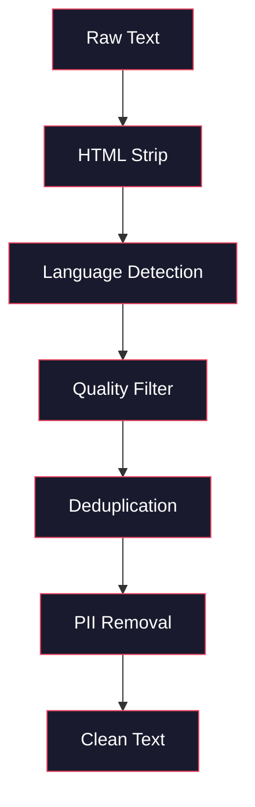
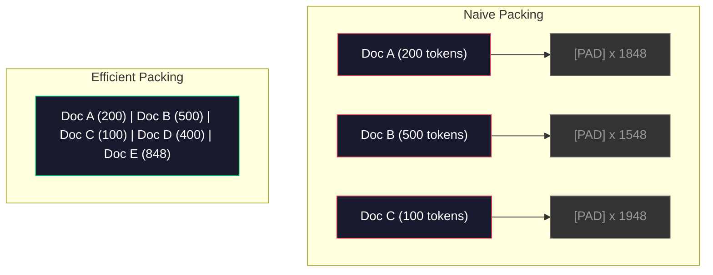

# 預訓練資料管線（pipeline）

> 模型（model）是一面鏡子。它反映出你餵給它的任何資料。餵它垃圾，它就會極其流暢地反映出垃圾。

**Type:** Build
**Languages:** Python
**Prerequisites:** Phase 10, Lessons 01-02 (Tokenizers, Building a Tokenizer)
**Time:** ~90 minutes

## Learning Objectives｜學習目標

- 建構串流（streaming）資料管線，在不將資料全部載入記憶體的情況下，對數 TB 的文字進行 tokenization、切塊、洗牌與批次打包
- 實作真實預訓練管線中所使用的資料品質過濾器（去重複、語言偵測、內容過濾）
- 建立具有適當注意力遮罩與文件邊界處理的固定長度訓練序列
- 分析管線吞吐量，確保資料載入器能跟上 GPU 訓練速度

## The Problem｜問題

你有了 tokenizer。現在你需要資料。

不是一個資料集，也不是一個 CSV 檔案。而是數 TB 的文字——經過清理、去重複、品質過濾、tokenization 成固定長度的序列，並且以足夠快的速度隨機批次提供，讓你的 8-GPU 叢集永遠不必等待下一個批次。

大多數人以為訓練 LLM 的關鍵在於模型架構。其實不然。Llama 3 使用了 15.6 兆個 token。GPT-3 使用了 3,000 億個。DeepSeek-V2 使用了 8.1 兆個。這三者的架構大致相同：由注意力層與前饋層堆疊而成的 transformer 區塊。輸出品質的巨大差異，絕大多數來自於資料本身。

DeepMind 提出的 Chinchilla 論文精確指出了這一點。在給定的運算預算下，模型參數與訓練 token 之間存在最佳比例。Chinchilla 指出，2022 年的大多數模型都存在嚴重的訓練不足——相對於它們所看過的資料量，它們擁有的參數實在太多了。一個在 1.4 兆 token 上訓練的 70B 參數模型（達到 Chinchilla 最佳化），其表現超越了在 3,000 億 token 上訓練的 280B 模型（Gopher）。

你的資料管線決定了你的模型究竟是學會了語言，還是學會了雜訊。

## The Concept｜核心概念

### 資料從何而來

每個大型語言模型都是在多種資料來源的混合體上進行訓練。對大多數實驗室來說，確切的配比是高度保密的，但我們足以理解其中的主要類別。

| 資料來源 | 大小 | 品質 | 使用的模型 |
|--------|------|---------|---------|
| Common Crawl | 原始資料約 250 TB | 低（需要嚴格過濾） | GPT-3、Llama、大多數開源模型 |
| Wikipedia | 約 20 GB | 高 | 每個主流 LLM |
| GitHub 程式碼 | 1 TB 以上 | 中等（包含大量重複項與廢棄程式碼） | StarCoder、CodeLlama、DeepSeek-Coder |
| 書籍（BookCorpus、Pile） | 約 100 GB | 高 | GPT-2、GPT-3、早期模型 |
| 學術論文（arXiv、S2ORC） | 約 100 GB | 理工領域極高 | Llama、Galactica |
| StackOverflow、Reddit | 約 100 GB | 中等 | Llama、Falcon |
| 精選網路資料（C4、RefinedWeb） | 約 5 TB | 中高（已預先過濾） | T5、Falcon |

Llama 3 公開了其資料配比：大約 50% 網路資料、25% 程式碼、13% 書籍與學術論文、8% 數學資料，以及 4% 多語言網路資料。總計來自超過 5 TB 原始文字的 15.6 兆個 token。

配比的重要性不亞於總量大小。網路資料過多，模型就會變成 Reddit 的應聲蟲。程式碼太少，它就不會寫程式。數學太少，它就無法勝任推理。掌握好這個配比是訓練 LLM 最困難的環節之一，而且沒有標準公式——全靠反覆實驗與評估。

### 資料清理

未經處理的網路資料非常髒亂。典型的 Common Crawl 傾印（dump）包含：

- HTML 標籤與 JavaScript
- 樣板式的頁首、頁尾與導覽選單
- 重複頁面（完全相同與近似重複）
- 機器生成的垃圾內容（spam）
- 個人識別資訊（PII）
- 低品質文字（關鍵字堆疊、SEO 垃圾內容）
- 被編碼為文字的非文字內容

清理這些資料不是可選步驟。這是讓模型產生連貫段落，還是輸出夾雜著商品清單與 HTML 標籤的關鍵分野。



每個步驟都會清除一種類別的雜訊：

**移除 HTML 標籤：** 移除所有標記，僅保留可見的文字內容。使用像 `trafilatura` 或 `readability` 這樣的函式庫來擷取文章本文，同時捨棄導覽列、廣告與樣板文字。

**語言偵測：** 使用 fastText 的語言識別模型（lid.176.bin）對每份文件進行分類。過濾出目標語言。被分類為英文但信心度低於 0.8 的文件，通常都不是乾淨的英文。

**品質過濾：** 這是最具技巧的環節。RefinedWeb（Falcon 背後採用的資料集）採用了基於困惑度（perplexity）的過濾器：在維基百科上訓練一個小型語言模型，接著對每份文件進行評分。高困惑度意味著該文件與維基百科風格截然不同——極可能是垃圾內容、關鍵字列表或機器產生的文字。困惑度高於特定閾值的文件會被直接移除。

**去重複：** 影響最顯著的單一清理步驟。Common Crawl 包含龐大數量的重複頁面——法律免責聲明、cookie 通知、服務條款。在重複內容上訓練會浪費運算資源，並導致模型死記硬背並逐字背誦特定段落。

**移除 PII：** 姓名、電子郵件地址、電話號碼、身分證字號。針對結構化 PII 採用正規表示式偵測，針對語境中的姓名則採用 NER 模型。

### 使用 MinHash 進行去重複

完全相同的去重複很容易：對每份文件進行雜湊，移除重複項。但近似重複才是真正的難題。同一篇新聞報導的兩份副本，周圍帶有略微不同的廣告，就屬於近似重複。兩者的核心內容有 95% 相同，但在位元組層面上並不完全一致。

MinHash 搭配局部敏感雜湊（Locality-Sensitive Hashing，LSH）能有效率地解決這個問題。


基本概念：

1. **切塊（Shingling）：** 將每份文件轉換為 n-gram 集合（例如單詞或字元的 5-gram）。「the quick brown fox」在 3 詞切塊下變成 {"the quick brown", "quick brown fox"}。

2. **MinHash：** 針對每份文件的切塊集合計算 k 個雜湊值。每個雜湊值都是在不同雜湊函數下，所有切塊中的最小雜湊值。這會產生一個固定大小的「簽名」，用來近似估計任意兩份文件之間的 Jaccard 相似度。

3. **LSH：** 根據 MinHash 簽名的各個分段（band），將文件分組到各個桶（bucket）中。落在同一個桶內的文件就是候選的近似重複項。這避免了兩兩全量比對——你只需比對候選者。

4. **驗證：** 對於每一對候選配對，計算精確的 Jaccard 相似度。如果相似度超過閾值（通常為 0.8），則移除其中一份副本。

Llama 團隊回報透過去重複移除了約 38% 的網路資料。這不是一個小數字。Common Crawl 中超過三分之一的內容都是重複或近似重複的。

### 序列打包（Sequence Packing）

你的模型期望固定長度的輸入序列。但你的文件長度各不相同。有的只有 50 個 token，有的則有 50,000 個 token。

最天真的做法：將每份文件都填充（pad）到最大序列長度。這會將龐大的運算資源浪費在對學習毫無貢獻的 padding token 上。

更好的做法：將多份文件打包成單一序列，各文件之間以 end-of-sequence token 分隔。一個 2048 token 的序列可能包含三份較短的文件，中間以 [EOS] token 串接。



注意力遮罩必須正確設定。在同一個打包序列中，文件 A 的 token 不應該關注到文件 B 的 token。這需要採用區塊對角線注意力遮罩（block-diagonal attention mask）。

過長的文件則會在序列邊界處被截斷或拆分為多個片段。切分點的選擇相當要緊：在句子中間切開會迫使模型看到不完整的思維片段。部分管線會在可能的情況下，將切分點對齊到段落或句子邊界。

### Chinchilla 縮放定律

在固定的運算預算 C（以 FLOPs 衡量）下，最佳模型大小 N 與資料集大小 D 滿足：

```
N_opt ~ C^0.5
D_opt ~ C^0.5
```

實務上，這意味著你應該大致等比例地擴展模型大小與資料集大小。一個參數多出 10 倍的模型，需要大約多出 10 倍的訓練 token 才能達到相同的損失值。

| 模型 | 參數量 | 訓練 Token 數 | 是否符合 Chinchilla 最佳化？ |
|-------|-----------|----------------|-------------------|
| GPT-3 | 175B | 300B | 否（訓練不足 3-4 倍） |
| Chinchilla | 70B | 1.4T | 是（專為此設計） |
| Llama 2 | 70B | 2T | 過度訓練（刻意為之） |
| Llama 3 | 70B | 15T | 重度過度訓練 |

Llama 3 刻意違背了 Chinchilla 定律。Meta 發現，在遠超運算最佳比例的更多資料上進行過度訓練，能產出推論效果更佳的模型。額外的訓練成本只支付一次，但較小的模型長期提供推論服務的成本更低。這有時被稱為「推論最佳化（inference-optimal）」的縮放方法，並且自 2024 年起已成為業界標準。

```figure
l5-data-pipeline
```

## Build It｜動手實作

### 步驟 1：文字清理

移除 HTML、正規化空白字元、移除非文字內容。我們將使用公有領域文字（Project Gutenberg）作為我們的小型語料庫。

```python
import re

def clean_text(text):
    text = re.sub(r"<[^>]+>", "", text)
    text = re.sub(r"http\S+", "", text)
    text = re.sub(r"[^\x20-\x7E\n]", "", text)
    text = re.sub(r"\n{3,}", "\n\n", text)
    text = re.sub(r" {2,}", " ", text)
    return text.strip()

def quality_filter(text, min_words=50, max_ratio_caps=0.3, max_ratio_special=0.1):
    words = text.split()
    if len(words) < min_words:
        return False
    caps_ratio = sum(1 for w in words if w.isupper()) / len(words)
    if caps_ratio > max_ratio_caps:
        return False
    special_chars = sum(1 for c in text if not c.isalnum() and not c.isspace())
    if special_chars / max(len(text), 1) > max_ratio_special:
        return False
    return True
```

品質過濾器能攔截 SEO 垃圾內容（全大寫）、機器生成的雜訊（特殊字元比例過高），以及殘缺頁面（長度過短）。光是這三項檢查，就能從網路爬蟲中濾除令人驚訝的巨量垃圾。

### 步驟 2：MinHash 去重複

從零實作 MinHash。不需要外部函式庫——只需 `hashlib`。

```python
import hashlib
from collections import defaultdict

def get_shingles(text, k=5):
    words = text.lower().split()
    if len(words) < k:
        return set()
    return {" ".join(words[i:i+k]) for i in range(len(words) - k + 1)}

def minhash_signature(shingles, num_hashes=128):
    signature = []
    for i in range(num_hashes):
        min_hash = float("inf")
        for shingle in shingles:
            h = int(hashlib.sha256(f"{i}:{shingle}".encode()).hexdigest(), 16)
            min_hash = min(min_hash, h)
        signature.append(min_hash)
    return signature

def lsh_buckets(signature, bands=16):
    rows_per_band = len(signature) // bands
    buckets = []
    for b in range(bands):
        start = b * rows_per_band
        band_data = tuple(signature[start:start + rows_per_band])
        bucket_hash = hashlib.md5(str(band_data).encode()).hexdigest()
        buckets.append((b, bucket_hash))
    return buckets

def deduplicate(documents, threshold=0.8, num_hashes=128, bands=16):
    signatures = []
    shingle_sets = []
    for doc in documents:
        shingles = get_shingles(doc)
        shingle_sets.append(shingles)
        signatures.append(minhash_signature(shingles, num_hashes))

    bucket_map = defaultdict(list)
    for doc_idx, sig in enumerate(signatures):
        for band_id, bucket_hash in lsh_buckets(sig, bands):
            bucket_map[(band_id, bucket_hash)].append(doc_idx)

    duplicate_pairs = set()
    for bucket_docs in bucket_map.values():
        if len(bucket_docs) < 2:
            continue
        for i in range(len(bucket_docs)):
            for j in range(i + 1, len(bucket_docs)):
                duplicate_pairs.add((bucket_docs[i], bucket_docs[j]))

    removed = set()
    for i, j in duplicate_pairs:
        if i in removed or j in removed:
            continue
        s1, s2 = shingle_sets[i], shingle_sets[j]
        if not s1 or not s2:
            continue
        jaccard = len(s1 & s2) / len(s1 | s2)
        if jaccard >= threshold:
            removed.add(j)

    return [doc for idx, doc in enumerate(documents) if idx not in removed], len(removed)
```

`num_hashes=128` 與 `bands=16` 參數控制了精確率與召回率之間的權衡。更多的雜湊值能提供更精確的相似度估計。更多的分段能提高召回率（捕捉更多重複項），但代價是偽陽性增加。這些數值在典型網路文字上表現良好。

### 步驟 3：Tokenization 與序列打包

取得乾淨、去重複的文字後，進行 tokenization，並打包成固定長度的訓練序列。

```python
def tokenize_corpus(documents, tokenizer):
    all_tokens = []
    for doc in documents:
        tokens = tokenizer.encode(doc)
        all_tokens.extend(tokens)
        all_tokens.append(tokenizer.eos_id)
    return all_tokens

def pack_sequences(token_ids, seq_length, pad_id=0):
    sequences = []
    attention_masks = []
    for i in range(0, len(token_ids), seq_length):
        seq = token_ids[i:i + seq_length]
        mask = [1] * len(seq)
        if len(seq) < seq_length:
            pad_count = seq_length - len(seq)
            seq = seq + [pad_id] * pad_count
            mask = mask + [0] * pad_count
        sequences.append(seq)
        attention_masks.append(mask)
    return sequences, attention_masks
```

### 步驟 4：訓練用 DataLoader

產生隨機批次的打包序列。這就是訓練迴圈會從這裡取得資料。

```python
import random

class PreTrainingDataLoader:
    def __init__(self, sequences, attention_masks, batch_size, shuffle=True):
        self.sequences = sequences
        self.attention_masks = attention_masks
        self.batch_size = batch_size
        self.shuffle = shuffle

    def __len__(self):
        return (len(self.sequences) + self.batch_size - 1) // self.batch_size

    def __iter__(self):
        indices = list(range(len(self.sequences)))
        if self.shuffle:
            random.shuffle(indices)
        for start in range(0, len(indices), self.batch_size):
            batch_idx = indices[start:start + self.batch_size]
            batch_seqs = [self.sequences[i] for i in batch_idx]
            batch_masks = [self.attention_masks[i] for i in batch_idx]
            yield batch_seqs, batch_masks
```

### 步驟 5：資料集統計量

計算關鍵數值：總 token 數、不重複 token 數、壓縮率（compression ratio）、文件長度分布。

```python
from collections import Counter

def compute_statistics(documents, token_ids, sequences, tokenizer_vocab_size):
    total_chars = sum(len(d) for d in documents)
    total_tokens = len(token_ids)
    unique_tokens = len(set(token_ids))
    compression_ratio = total_chars / total_tokens

    doc_lengths = [len(d.split()) for d in documents]
    avg_doc_length = sum(doc_lengths) / max(len(doc_lengths), 1)
    max_doc_length = max(doc_lengths) if doc_lengths else 0
    min_doc_length = min(doc_lengths) if doc_lengths else 0

    token_counts = Counter(token_ids)
    top_tokens = token_counts.most_common(10)

    non_pad_tokens = sum(sum(1 for t in seq if t != 0) for seq in sequences)
    total_positions = sum(len(seq) for seq in sequences)
    utilization = non_pad_tokens / max(total_positions, 1)

    stats = {
        "total_documents": len(documents),
        "total_characters": total_chars,
        "total_tokens": total_tokens,
        "unique_tokens": unique_tokens,
        "vocab_utilization": unique_tokens / tokenizer_vocab_size,
        "compression_ratio": compression_ratio,
        "avg_doc_length_words": avg_doc_length,
        "max_doc_length_words": max_doc_length,
        "min_doc_length_words": min_doc_length,
        "num_sequences": len(sequences),
        "sequence_utilization": utilization,
        "top_10_tokens": top_tokens,
    }
    return stats
```

壓縮率（compression ratio）告訴你 tokenizer 在該語料庫上的效率。英文文字通常會壓縮到每個 token 約 3 到 4 個字元。如果你看到每個 token 只有 1.5 個字元，表示你的 tokenizer 切分得太過零碎。如果你看到 8 個字元以上，表示它學到了高度特定於該領域的合併規則。

序列利用率（sequence utilization）則反映出打包後的序列中實際資料所占的比例。低於 90% 意味著打包效率低落——你在 padding token 上浪費了運算資源。

## Use It｜實際應用

### 與 HuggingFace Datasets 進行比較

透過 HuggingFace 的 datasets 函式庫載入相同語料庫，並比較管線處理速度。

```python
from datasets import load_dataset
from transformers import AutoTokenizer

ds = load_dataset("wikitext", "wikitext-2-raw-v1", split="train")
tokenizer = AutoTokenizer.from_pretrained("meta-llama/Meta-Llama-3-8B")

import time

start = time.time()
tokenized = ds.map(
    lambda x: tokenizer(x["text"], truncation=True, max_length=2048),
    batched=True,
    num_proc=4,
)
hf_time = time.time() - start
total_tokens = sum(len(t) for t in tokenized["input_ids"])
print(f"HuggingFace: {total_tokens:,} tokens in {hf_time:.2f}s ({total_tokens/hf_time:,.0f} tokens/sec)")
```

HuggingFace 管線底層使用 Rust tokenizer，並在 4 個核心上進行平行處理。你的純 Python 管線速度會慢上 10 到 50 倍。這個效能差距正是生產團隊採用編譯型 tokenizer 的原因。演算法本身相同，差異在於實作語言。

## Ship It｜交付成果

本課產出用於驗證與除錯 LLM 訓練管線中資料品質的 prompt。請參閱 `outputs/prompt-data-quality-checker.md`。

## Exercises｜練習

1. **簡單：** 使用簡單的啟發式方法（字元集分析）在清理管線中加入語言偵測。篩選出純英文文件，並測量有多少文件被移除。
2. **中等：** 在 MinHash 近似去重複之外，實作基於 SHA-256 雜湊的完全精確去重複。在網路爬取的語料庫上比較兩種方法各自捕捉到的重複項數量。
3. **困難：** 建立一個基於困惑度的品質過濾器。在維基百科文字上訓練一個小型 bigram 語言模型，根據困惑度對每份文件進行評分，並移除倒數 20% 的文件。比較在過濾與未過濾資料上訓練時的模型輸出品質。

## Key Terms｜關鍵術語

| 術語 | 常見說法 | 實際意義 |
|------|----------------|----------------------|
| Common Crawl | 「網際網路」 | 一個每月爬取全網內容的非營利組織——約 250TB 原始資料，多數 LLM 訓練資料的起點 |
| MinHash | 「某種雜湊技巧」 | 利用固定大小簽名來估計集合間 Jaccard 相似度的技術——能在大規模資料上進行近似去重複 |
| LSH | 「局部敏感雜湊」 | 將相似項目歸入同一個桶的方法——將兩兩比對複雜度從 O(n^2) 降低到近乎線性 |
| 序列打包（Sequence packing） | 「串接文件」 | 將多份文件放入固定長度序列中並帶有正確注意力遮罩——消除 padding 浪費 |
| Chinchilla 縮放定律 | 「用更多資料訓練」 | 在固定運算預算下，最佳效能需要大致等比例擴展模型大小與訓練 token 數 |
| Fertility | 「每個詞的 token 數」 | 每個詞的平均 token 數——GPT-4 英文約 1.3，非拉丁語系更高 |
| 資料混合（Data mixing） | 「挑選訓練資料」 | 程式碼、文字、數學與多語言資料的配比——沒有標準公式，需要反覆實驗 |
| 困惑度過濾器 | 「品質評分」 | 使用小型語言模型為文件評分——高困惑度代表該文字與乾淨的參考資料風格不同 |
| 去重複（Deduplication） | 「移除副本」 | 消除完全相同與近似重複的文件——通常會移除 30-40% 的原始網路資料 |
| 注意力遮罩（Attention mask） | 「要看哪些 token」 | 一個二元遮罩，防止在打包序列中跨越文件邊界進行注意力運算 |

## Further Reading｜延伸閱讀

- [Hoffmann et al., 2022 -- Training Compute-Optimal Large Language Models (Chinchilla)](https://arxiv.org/abs/2203.15556) ——改變我們對資料規模看法的論文
- [Penedo et al., 2023 -- The RefinedWeb Dataset for Falcon LLM](https://arxiv.org/abs/2306.01116) ——如何將 Common Crawl 過濾成高品質資料集
- [Touvron et al., 2023 -- Llama 2: Open Foundation and Fine-Tuned Chat Models](https://arxiv.org/abs/2307.09288) ——Llama 2 資料管線的細節
- [Lee et al., 2022 -- Deduplicating Training Data Makes Language Models Better](https://arxiv.org/abs/2107.06499) ——為什麼去重複比你想像的更重要
- [Broder, 1997 -- On the Resemblance and Containment of Documents](https://ieeexplore.ieee.org/document/666900) ——最初的 MinHash 論文
- [Meta, 2024 -- Llama 3 Technical Report](https://arxiv.org/abs/2407.21783) ——15.6 兆 token、資料混合配比、過濾管線
