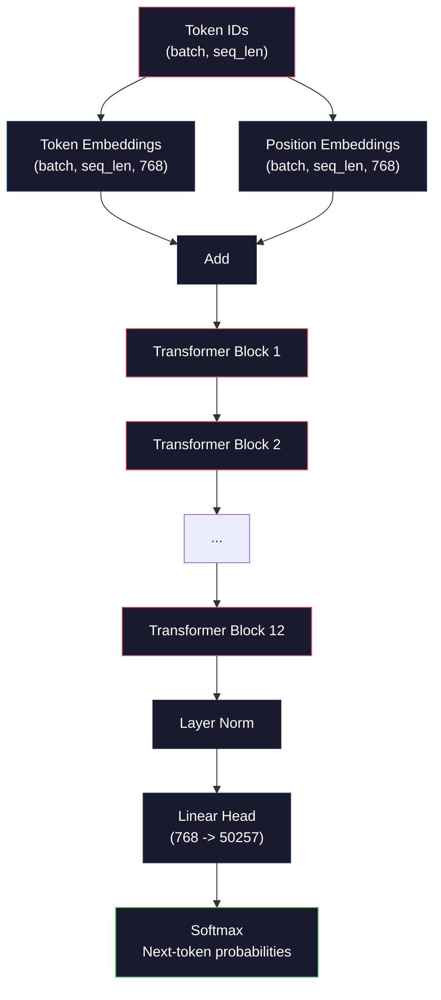
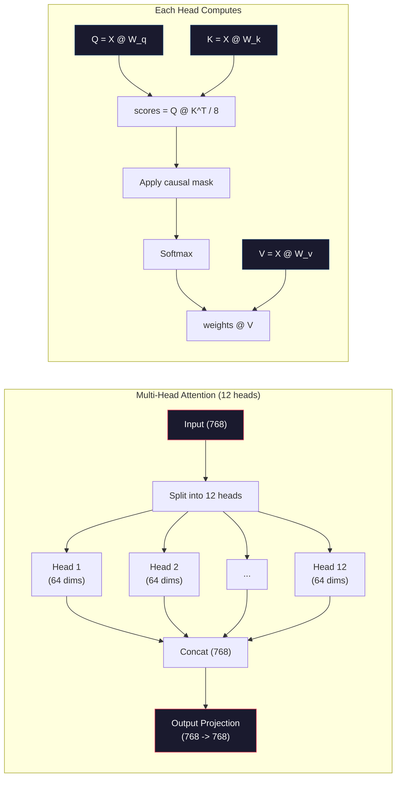
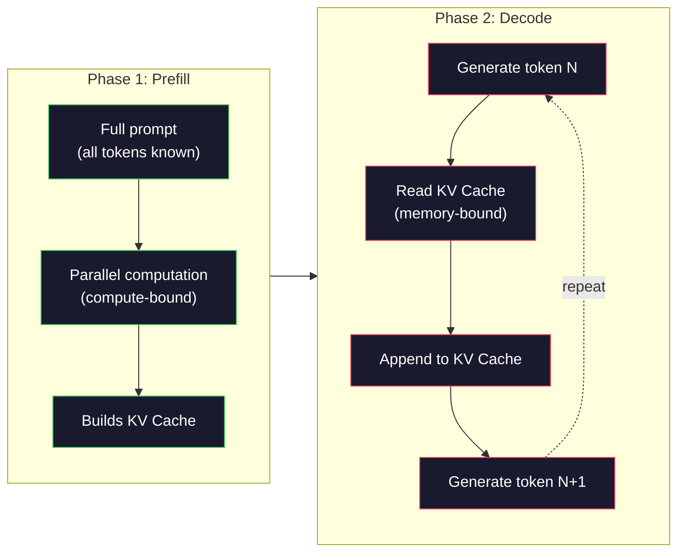

# 預訓練迷你 GPT（1.24 億參數）

> GPT-2 Small 擁有 1.24 億個參數。那是 12 個 transformer 層、12 個注意力頭，以及 768 維的 embedding。你可以在單張 GPU 上花幾個小時從零訓練它。大多數人從未這麼做過，他們只使用預訓練的 checkpoint。但如果你不曾親手訓練過一個，你就無法真正理解你在其上打造產品的模型（model）內部究竟發生了什麼。

**Type:** Build
**Languages:** Python (with numpy)
**Prerequisites:** Phase 10, Lessons 01-03 (Tokenizers, Building a Tokenizer, Data Pipelines)
**Time:** ~120 minutes

## Learning Objectives｜學習目標

- 從零實作完整的 GPT-2 架構（1.24 億參數）：token embedding、位置 embedding、transformer 區塊與語言模型輸出頭
- 使用交叉熵損失的next-token prediction，在文字語料庫上訓練 GPT 模型
- 實作具備溫度取樣（temperature sampling）與 top-k/top-p 過濾的自回歸文字生成
- 監控訓練損失曲線，驗證模型學會了連貫的語言模式

## The Problem｜問題

你知道什麼是 transformer。你讀過架構圖。你能背誦「attention is all you need」，也能在白板上畫出標記為「Multi-Head Attention」的方塊。

但這些都不代表你理解模型在生成文字時究竟發生了什麼。

GPT-2 Small 中有 124,438,272 個參數（包含權重綁定）。每一個參數都是透過執行訓練迴圈設定出來的：前向傳遞、計算損失、反向傳遞（backward pass）、更新權重。12 個 transformer 區塊。每個區塊 12 個注意力頭。768 維的 embedding 空間。50,257 個 token 的詞彙表。模型每生成一個 token，這 1.24 億個參數全都參與在單一矩陣乘法鏈中，接收一串 token ID 序列，並產出下一個 token 的機率分布。

如果你從未親手打造過它，你就是在面對一個黑盒子。你可以呼叫 API，可以進行 fine-tune。但當出現問題時——當模型產生幻覺、自我重複，或拒絕遵循指示時——你完全沒有心智模型去理解*為什麼*會這樣。

本課將從零開始打造 GPT-2 Small。不是使用 PyTorch，而是使用 numpy。每一個矩陣乘法都清晰可見。每一個梯度都由你的程式碼計算。你將親眼目睹 1.24 億個數字如何協同運作來預測下一個字詞。

## The Concept｜核心概念

### GPT 架構

GPT 是一個自回歸語言模型。「自回歸（Autoregressive）」意味著它一次生成一個 token，每個 token 都以之前的所有 token 為條件。其架構是由 transformer 解碼器區塊堆疊而成。

以下是從 token ID 到下一個 token 機率的完整計算圖：

1. 輸入 token ID。形狀：(batch_size, seq_len)。
2. Token embedding 查找。每個 ID 映射到一個 768 維向量。形狀：(batch_size, seq_len, 768)。
3. 位置 embedding 查找。每個位置（0, 1, 2, ...）映射到一個 768 維向量。相同形狀。
4. 將 token embedding 與位置 embedding 相加。
5. 經過 12 個 transformer 區塊。
6. 最終層正規化（Layer Normalization）。
7. 線性投影到詞彙表大小。形狀：(batch_size, seq_len, vocab_size)。
8. Softmax 取得機率。

這就是整個模型。沒有卷積，沒有循環。只有 embedding、注意力機制、前饋網路與層正規化重複堆疊 12 次。



### Transformer 區塊

這 12 個區塊中的每一個都遵循相同的模式。Pre-norm 架構（GPT-2 使用 pre-norm，而不是原始 transformer 的 post-norm）：

1. LayerNorm
2. 多頭自注意力機制（Multi-Head Self-Attention）
3. 殘差連接（加上原始輸入）
4. LayerNorm
5. 前饋網路（Feed-Forward Network，MLP）
6. 殘差連接（加上輸入）

殘差連接至關重要。若沒有殘差連接，反向傳遞（backward pass）時梯度在傳回第 1 區塊前就會消失殆盡。有了殘差連接，梯度可以透過「跳躍（skip）」路徑直接從損失流向任何一層。這就是為什麼你可以堆疊 12、32 甚至 96 個區塊（傳聞 GPT-4 使用了 120 個區塊）。

### 注意力機制：核心引擎

自注意力機制讓每個 token 能審視所有先前的 token，並決定對每一個 token 給予多少注意力。以下是其數學原理。

對於每個 token 位置，從輸入計算出三個向量：
- **查詢向量（Query，Q）**：「我在尋找什麼？」
- **鍵向量（Key，K）**：「我包含什麼內容？」
- **值向量（Value，V）**：「我承載什麼資訊？」

```
Q = input @ W_q    (768 -> 768)
K = input @ W_k    (768 -> 768)
V = input @ W_v    (768 -> 768)

attention_scores = Q @ K^T / sqrt(d_k)
attention_scores = mask(attention_scores)   # causal mask: -inf for future positions
attention_weights = softmax(attention_scores)
output = attention_weights @ V
```

因果遮罩（causal mask）是使 GPT 具備自回歸特性的關鍵。位置 5 可以關注位置 0 到 5，但不能關注 6、7、8 等後續位置。這防止了模型在訓練過程中透過偷看未來的 token 來「作弊」。

**多頭注意力（Multi-head attention）**將 768 維空間拆分為 12 個頭，每個頭 64 維。每個頭學習不同的注意力模式。一個頭可能追蹤句法關係（主詞動詞一致性），另一個頭可能追蹤語意相似性（同義詞），還有一個頭可能追蹤位置鄰近性（鄰近字詞）。所有 12 個頭的輸出會被串接在一起，並投影回 768 維。



除以 sqrt(d_k)——即 sqrt(64) = 8——是一種縮放操作。如果沒有它，高維向量的內積會變得非常大，導致 softmax 被推入梯度幾乎為零的飽和區域。這是原始「Attention Is All You Need」論文中的關鍵洞見之一。

### KV Cache：為什麼推論（inference）能如此迅速

訓練期間，你會一次處理整個序列。但在推論期間，你是一次生成一個 token。若不進行最佳化，生成第 N 個 token 就必須為之前所有 N-1 個 token 重新計算注意力。這使得每個生成的 token 需耗費 O(N^2) 的代價，整個長度為 N 的序列總計需 O(N^3)。

KV Cache 解決了這個問題。在為每個 token 計算出 K 與 V 之後，將它們快取起來。當生成第 N+1 個 token 時，你只需為新 token 計算 Q，並直接讀取之前所有 token 已快取的 K 與 V。這將計算 K 與 V 的單一 token 成本從 O(N) 降低到 O(1)。注意力分數的計算依然是 O(N)，因為你必須關注之前的所有位置，但你避免了對輸入進行多餘的矩陣乘法。

對於具有 12 層與 12 個頭的 GPT-2，KV cache 每個 token 需要儲存 2 (K + V) x 12 層 x 12 個頭 x 64 維 = 18,432 個數值。對於 1024 token 的序列，在 FP32 下約為 75MB。對於具有 128 層的 Llama 3 405B，單一序列的 KV cache 就可能超過 10GB。這就是長脈絡推論受到記憶體頻寬限制的原因。

### Prefill 與 Decode：推論的兩個階段

當你向 LLM 發送 prompt 時，推論會分為兩個截然不同的階段進行。

**Prefill（預填）**平行處理你的完整 prompt。所有 token 都是已知的，因此模型可以同時計算所有位置的注意力。這個階段受到算力限制（compute-bound）——GPU 正以全速執行矩陣乘法。對於 A100 上的 1000 token prompt，prefill 大約需要 20 到 50 毫秒。

**Decode（解碼）**一次生成一個 token。每個新 token 都取決於之前的所有 token。這個階段受到記憶體頻寬限制（memory-bound）——瓶頸在於從 GPU 記憶體讀取模型權重與 KV cache，而不是矩陣運算本身。GPU 的運算核心大多處於閒置狀態等待記憶體讀取。對於 GPT-2，無論矩陣乘法需要多少 FLOPs，每個 decode 步驟所花費的時間都差不多，因為瓶頸在記憶體頻寬。

這個區別對於正式環境系統至關重要。Prefill 吞吐量隨 GPU 運算能力擴展（更多 FLOPS = 更快的 prefill）。Decode 吞吐量則隨記憶體頻寬擴展（更快的記憶體 = 更快的 decode）。這也是為什麼 NVIDIA H100 相較於 A100 特別著重於記憶體頻寬的提升——它能直接加速 token 的生成。



### 訓練迴圈

訓練 LLM 就是在進行下一個 token 的預測。給定 token [0, 1, 2, ..., N-1]，預測 token [1, 2, 3, ..., N]。損失函數是模型預測的機率分布與實際下一個 token 之間的交叉熵（cross-entropy）。

一個訓練步驟：

1. **前向傳遞**：將批次輸入傳入所有 12 個區塊。取得每個位置的 logits（未經 softmax 的分數）。
2. **計算損失**：計算 logits 與目標 token（向右平移一位的輸入）之間的交叉熵。
3. **反向傳遞（backward pass）**：使用反向傳遞（backward pass）演算法計算所有 1.24 億參數的梯度。
4. **最佳化器更新**：更新權重。GPT-2 使用帶有學習率暖機（warmup）與餘弦衰減（cosine decay）的 Adam 最佳化器。

學習率排程的重要性超乎你的想像。GPT-2 在前 2,000 步中從 0 暖機到最高學習率，隨後依照餘弦曲線衰減。一開始就使用高學習率會導致模型發散。在訓練後期保持固定高學習率則會引起震盪。這種先暖機後衰減的模式被所有主流 LLM 普遍採用。

### GPT-2 Small：規格數字

| 元件 | 形狀 | 參數數量 |
|-----------|-------|------------|
| Token embeddings | (50257, 768) | 38,597,376 |
| Position embeddings | (1024, 768) | 786,432 |
| 每個區塊注意力（W_q, W_k, W_v, W_out） | 4 x (768, 768) | 2,359,296 |
| 每個區塊 FFN（擴展 + 收縮） | (768, 3072) + (3072, 768) | 4,718,592 |
| 每個區塊 LayerNorms（2x） | 2 x 768 x 2 | 3,072 |
| 最終 LayerNorm | 768 x 2 | 1,536 |
| **每個區塊總計** | | **7,080,960** |
| **總計（12 個區塊）** | | **85,054,464 + 39,383,808 = 124,438,272** |

輸出投影（logits head）與 token embedding 矩陣共享權重。這被稱為權重綁定（weight tying）——它減少了 3,800 萬個參數，並提升了模型效能，因為它迫使模型在輸入理解與輸出預測時使用相同的向量空間表示。

## Build It｜動手實作

### 步驟 1：Embedding 層

Token embedding 將 50,257 個可能 token 中的每一個映射到一個 768 維向量。位置 embedding 則加入了每個 token 在序列中位置的資訊。兩者直接相加。

```python
import numpy as np

class Embedding:
    def __init__(self, vocab_size, embed_dim, max_seq_len):
        self.token_embed = np.random.randn(vocab_size, embed_dim) * 0.02
        self.pos_embed = np.random.randn(max_seq_len, embed_dim) * 0.02

    def forward(self, token_ids):
        seq_len = token_ids.shape[-1]
        tok_emb = self.token_embed[token_ids]
        pos_emb = self.pos_embed[:seq_len]
        return tok_emb + pos_emb
```

初始化時採用的 0.02 標準差來自 GPT-2 論文。數值太大，初期的前向傳遞會產生極端數值而破壞訓練穩定性。數值太小，初期所有輸入的輸出幾乎完全相同，導致早期梯度訊號毫無作用。

### 步驟 2：帶有因果遮罩的自注意力機制

先實作單頭注意力。因果遮罩在 softmax 之前將未來位置設為負無窮大，確保每個位置只能關注自身及更早的位置。

```python
def attention(Q, K, V, mask=None):
    d_k = Q.shape[-1]
    scores = Q @ K.transpose(0, -1, -2 if Q.ndim == 4 else 1) / np.sqrt(d_k)
    if mask is not None:
        scores = scores + mask
    weights = np.exp(scores - scores.max(axis=-1, keepdims=True))
    weights = weights / weights.sum(axis=-1, keepdims=True)
    return weights @ V
```

在計算 softmax 時減去最大值以避免指數爆炸。如果不這麼做，exp(大數字) 會溢位為無窮大。這是一個數值穩定性技巧，且由於對任何常數 c 都有 softmax(x - c) = softmax(x)，因此不會改變輸出結果。

### 步驟 3：多頭注意力機制

將 768 維的輸入拆分成 12 個頭，每個頭 64 維。每個頭獨立計算注意力。最後將結果串接並投影回 768 維。

```python
class MultiHeadAttention:
    def __init__(self, embed_dim, num_heads):
        self.num_heads = num_heads
        self.head_dim = embed_dim // num_heads
        self.W_q = np.random.randn(embed_dim, embed_dim) * 0.02
        self.W_k = np.random.randn(embed_dim, embed_dim) * 0.02
        self.W_v = np.random.randn(embed_dim, embed_dim) * 0.02
        self.W_out = np.random.randn(embed_dim, embed_dim) * 0.02

    def forward(self, x, mask=None):
        batch, seq_len, d = x.shape
        Q = (x @ self.W_q).reshape(batch, seq_len, self.num_heads, self.head_dim).transpose(0, 2, 1, 3)
        K = (x @ self.W_k).reshape(batch, seq_len, self.num_heads, self.head_dim).transpose(0, 2, 1, 3)
        V = (x @ self.W_v).reshape(batch, seq_len, self.num_heads, self.head_dim).transpose(0, 2, 1, 3)

        scores = Q @ K.transpose(0, 1, 3, 2) / np.sqrt(self.head_dim)
        if mask is not None:
            scores = scores + mask
        weights = np.exp(scores - scores.max(axis=-1, keepdims=True))
        weights = weights / weights.sum(axis=-1, keepdims=True)
        attn_out = weights @ V

        attn_out = attn_out.transpose(0, 2, 1, 3).reshape(batch, seq_len, d)
        return attn_out @ self.W_out
```

這種 reshape-transpose-reshape 的轉換過程往往是多頭注意力中最容易混淆的部分。以下是實際發生的操作：形狀為 (batch, seq_len, 768) 的張量先變為 (batch, seq_len, 12, 64)，再透過轉置變為 (batch, 12, seq_len, 64)。現在 12 個頭各自擁有一個 (seq_len, 64) 矩陣來執行注意力運算。計算完成後，我們將此過程倒轉：(batch, 12, seq_len, 64) 變回 (batch, seq_len, 12, 64)，再還原為 (batch, seq_len, 768)。

### 步驟 4：Transformer 區塊

一個完整的 transformer 區塊：LayerNorm、帶有殘差的多頭注意力、LayerNorm、帶有殘差的前饋網路。

```python
class LayerNorm:
    def __init__(self, dim, eps=1e-5):
        self.gamma = np.ones(dim)
        self.beta = np.zeros(dim)
        self.eps = eps

    def forward(self, x):
        mean = x.mean(axis=-1, keepdims=True)
        var = x.var(axis=-1, keepdims=True)
        return self.gamma * (x - mean) / np.sqrt(var + self.eps) + self.beta


class FeedForward:
    def __init__(self, embed_dim, ff_dim):
        self.W1 = np.random.randn(embed_dim, ff_dim) * 0.02
        self.b1 = np.zeros(ff_dim)
        self.W2 = np.random.randn(ff_dim, embed_dim) * 0.02
        self.b2 = np.zeros(embed_dim)

    def forward(self, x):
        h = x @ self.W1 + self.b1
        h = np.maximum(0, h)  # GELU approximation: ReLU for simplicity
        return h @ self.W2 + self.b2


class TransformerBlock:
    def __init__(self, embed_dim, num_heads, ff_dim):
        self.ln1 = LayerNorm(embed_dim)
        self.attn = MultiHeadAttention(embed_dim, num_heads)
        self.ln2 = LayerNorm(embed_dim)
        self.ffn = FeedForward(embed_dim, ff_dim)

    def forward(self, x, mask=None):
        x = x + self.attn.forward(self.ln1.forward(x), mask)
        x = x + self.ffn.forward(self.ln2.forward(x))
        return x
```

前饋網路將 768 維的輸入擴展到 3,072 維（擴展 4 倍），套用非線性轉換，再投影回 768 維。這種擴展再收縮的模式讓模型在每個位置都能擁有更寬廣的內部表示空間。GPT-2 採用 GELU 活化函數，但我們此處為求簡潔採用了 ReLU——這對於理解架構來說差異極小。

### 步驟 5：完整 GPT 模型

堆疊 12 個 transformer 區塊。前端加上 embedding 層，後端加上輸出投影。

```python
class MiniGPT:
    def __init__(self, vocab_size=50257, embed_dim=768, num_heads=12,
                 num_layers=12, max_seq_len=1024, ff_dim=3072):
        self.embedding = Embedding(vocab_size, embed_dim, max_seq_len)
        self.blocks = [
            TransformerBlock(embed_dim, num_heads, ff_dim)
            for _ in range(num_layers)
        ]
        self.ln_f = LayerNorm(embed_dim)
        self.vocab_size = vocab_size
        self.embed_dim = embed_dim

    def forward(self, token_ids):
        seq_len = token_ids.shape[-1]
        mask = np.triu(np.full((seq_len, seq_len), -1e9), k=1)

        x = self.embedding.forward(token_ids)
        for block in self.blocks:
            x = block.forward(x, mask)
        x = self.ln_f.forward(x)

        logits = x @ self.embedding.token_embed.T
        return logits

    def count_parameters(self):
        total = 0
        total += self.embedding.token_embed.size
        total += self.embedding.pos_embed.size
        for block in self.blocks:
            total += block.attn.W_q.size + block.attn.W_k.size
            total += block.attn.W_v.size + block.attn.W_out.size
            total += block.ffn.W1.size + block.ffn.b1.size
            total += block.ffn.W2.size + block.ffn.b2.size
            total += block.ln1.gamma.size + block.ln1.beta.size
            total += block.ln2.gamma.size + block.ln2.beta.size
        total += self.ln_f.gamma.size + self.ln_f.beta.size
        return total
```

請注意權重綁定：`logits = x @ self.embedding.token_embed.T`。輸出投影重複使用了轉置後的 token embedding 矩陣。這不僅僅是節省參數的技巧，它意味著模型在理解 token（embedding）與預測 token（輸出）時，共享同一個向量空間。

### 步驟 6：訓練迴圈

在 1.24 億參數上進行真正的訓練需要 GPU 與 PyTorch。這個訓練迴圈在純 numpy 上演示了一套小型模型的運作機制。我們使用極小規模的模型（4 層、4 頭、128 維）使其能夠執行。

```python
def cross_entropy_loss(logits, targets):
    batch, seq_len, vocab_size = logits.shape
    logits_flat = logits.reshape(-1, vocab_size)
    targets_flat = targets.reshape(-1)

    max_logits = logits_flat.max(axis=-1, keepdims=True)
    log_softmax = logits_flat - max_logits - np.log(
        np.exp(logits_flat - max_logits).sum(axis=-1, keepdims=True)
    )

    loss = -log_softmax[np.arange(len(targets_flat)), targets_flat].mean()
    return loss


def train_mini_gpt(text, vocab_size=256, embed_dim=128, num_heads=4,
                   num_layers=4, seq_len=64, num_steps=200, lr=3e-4):
    tokens = np.array(list(text.encode("utf-8")[:2048]))
    model = MiniGPT(
        vocab_size=vocab_size, embed_dim=embed_dim, num_heads=num_heads,
        num_layers=num_layers, max_seq_len=seq_len, ff_dim=embed_dim * 4
    )

    print(f"Model parameters: {model.count_parameters():,}")
    print(f"Training tokens: {len(tokens):,}")
    print(f"Config: {num_layers} layers, {num_heads} heads, {embed_dim} dims")
    print()

    for step in range(num_steps):
        start_idx = np.random.randint(0, max(1, len(tokens) - seq_len - 1))
        batch_tokens = tokens[start_idx:start_idx + seq_len + 1]

        input_ids = batch_tokens[:-1].reshape(1, -1)
        target_ids = batch_tokens[1:].reshape(1, -1)

        logits = model.forward(input_ids)
        loss = cross_entropy_loss(logits, target_ids)

        if step % 20 == 0:
            print(f"Step {step:4d} | Loss: {loss:.4f}")

    return model
```

損失值一開始會接近 ln(vocab_size)——對於 256 個 token 的位元組層級詞彙表而言，約為 ln(256) = 5.55。隨機初始化的模型為每個 token 分配相等的機率。隨著訓練進行，損失值會下降，因為模型學會了預測常見規律：「t」之後接「th」、句號之後接空格等等。

在正式環境中，你會使用帶有梯度累積、學習率暖機與梯度裁剪的 Adam 最佳化器。前向傳遞、計算損失、反向更新的迴圈本質上完全相同，只是最佳化器更加精密。

### 步驟 7：文字生成

生成過程使用訓練好的模型一次預測一個 token。每次預測都是從輸出分布中取樣（或貪婪地選取 argmax 最大值）。

```python
def generate(model, prompt_tokens, max_new_tokens=100, temperature=0.8):
    tokens = list(prompt_tokens)
    seq_len = model.embedding.pos_embed.shape[0]

    for _ in range(max_new_tokens):
        context = np.array(tokens[-seq_len:]).reshape(1, -1)
        logits = model.forward(context)
        next_logits = logits[0, -1, :]

        next_logits = next_logits / temperature
        probs = np.exp(next_logits - next_logits.max())
        probs = probs / probs.sum()

        next_token = np.random.choice(len(probs), p=probs)
        tokens.append(next_token)

    return tokens
```

溫度（Temperature）控制了隨機性。溫度 1.0 使用原始分布。溫度 0.5 使分布更陡峭（更加確定性——模型更頻繁地挑選最高機率的選項）。溫度 1.5 使分布更平緩（更加隨機——低機率 token 獲得更大機會）。溫度 0.0 則是貪婪解碼（永遠選取機率最高的 token）。

`tokens[-seq_len:]` 視窗是必要的，因為模型具有最大脈絡長度（GPT-2 為 1024）。一旦超過此長度，就必須捨棄最舊的 token。這就是所有人常說的「脈絡視窗（context window）」。

```figure
sampling-decoder
```

## Use It｜實際應用

### 完整訓練與生成展示

```python
corpus = """The transformer architecture has revolutionized natural language processing.
Attention mechanisms allow the model to focus on relevant parts of the input.
Self-attention computes relationships between all pairs of positions in a sequence.
Multi-head attention splits the representation into multiple subspaces.
Each attention head can learn different types of relationships.
The feedforward network provides nonlinear transformations at each position.
Residual connections enable gradient flow through deep networks.
Layer normalization stabilizes training by normalizing activations.
Position embeddings give the model information about token ordering.
The causal mask ensures autoregressive generation during training.
Pre-training on large text corpora teaches the model general language understanding.
Fine-tuning adapts the pre-trained model to specific downstream tasks."""

model = train_mini_gpt(corpus, num_steps=200)

prompt = list("The transformer".encode("utf-8"))
output_tokens = generate(model, prompt, max_new_tokens=100, temperature=0.8)
generated_text = bytes(output_tokens).decode("utf-8", errors="replace")
print(f"\nGenerated: {generated_text}")
```

在極小語料庫與極小模型下，生成的文字頂多處於半連貫狀態。它會從訓練文字中學會一些位元組層級的模式，但無法像 GPT-2 那樣在 40GB 訓練資料與完整 1.24 億參數架構下進行泛化。重點不在於輸出品質，而在於你能追蹤每一個步驟：embedding 查找、注意力計算、前饋轉換、logit 投影、softmax 以及取樣。每一個運算都清晰可見。

## Ship It｜交付成果

本課產出 `outputs/prompt-gpt-architecture-analyzer.md`——一個用於分析任何 GPT 風格模型架構選擇的 prompt。提供模型卡（model card）或技術報告，它會為你拆解參數配置、注意力設計與縮放決策。

## Exercises｜練習

1. 修改模型，使其使用 24 層與 16 個頭，而不是原本的 12/12。計算參數量。深度加倍與寬度加倍（embedding 維度）相比，參數量如何變化？

2. 實作 GELU 活化函數（GELU(x) = x * 0.5 * (1 + erf(x / sqrt(2)))），並取代前饋網路中的 ReLU。分別使用兩種活化函數訓練 500 步，並比較最終損失。

3. 為生成函數新增 KV cache。在首次前向傳遞後儲存每一層的 K 與 V 張量，並在後續 token 中重複使用。測量加速效果：在有和沒有快取的情況下各生成 200 個 token，並比較實際時鐘時間（wall-clock time）。

4. 實作 top-k 取樣（僅考慮機率最高的 k 個 token）與 top-p 取樣（核取樣：考慮累積機率超過 p 的最小 token 集合）。在溫度 0.8 下，比較 top-k=50 與 top-p=0.95 的輸出品質。

5. 建立訓練損失曲線繪圖工具。訓練模型 1000 步並繪製損失對步數的曲線。識別出三個階段：初期的迅速下降（學習常見位元組）、中期的較平緩階段（學習位元組模式），以及平台期（在小型語料庫上過度擬合）。無論你是在訓練 128 維模型還是 GPT-4，這條曲線的形狀完全相同。

## Key Terms｜關鍵術語

| 術語 | 常見說法 | 實際意義 |
|------|----------------|----------------------|
| 自回歸（Autoregressive） | 「一次生成一個字」 | 每個輸出的 token 都以所有先前的 token 為條件——模型預測 P(token_n \| token_0, ..., token_{n-1}) |
| 因果遮罩（Causal mask） | 「它看不到未來」 | 由負無窮大數值組成的上三角矩陣，防止在訓練期間關注未來的 token 位置 |
| 多頭注意力（Multi-head attention） | 「多種注意力模式」 | 將 Q、K、V 拆分到平行的多個頭（例如 GPT-2 拆分為 12 個頭，每頭 64 維），使每個頭能學習不同的關係類型 |
| KV Cache | 「為了速度做快取」 | 儲存先前 token 計算好的 Key 與 Value 張量，避免在自回歸生成過程中重複計算 |
| Prefill（預填） | 「處理 prompt」 | 第一個推論階段，所有 prompt token 同時平行處理——在 GPU FLOPS 算力上受限 |
| Decode（解碼） | 「生成 token」 | 第二個推論階段，token 一次生成一個——受限於 GPU 記憶體頻寬 |
| 權重綁定（Weight tying） | 「共享 embedding」 | 在輸入 token embedding 與輸出投影頭之間使用相同的矩陣——在 GPT-2 中節省了 3,800 萬個參數 |
| 殘差連接（Residual connection） | 「跳躍連接」 | 將輸入直接加到子層的輸出（x + sublayer(x)）——使深層網路中的梯度能夠順暢流動 |
| 層正規化（Layer normalization） | 「將激勵值正規化」 | 跨特徵維度進行正規化至平均值為 0、變異數為 1，並帶有可學習的縮放與偏置參數 |
| 交叉熵損失（Cross-entropy loss） | 「預測錯得有多離譜」 | 正確下一個 token 被賦予機率的負對數 -log(P)，對所有位置取平均——標準的 LLM 訓練目標 |

## Further Reading｜延伸閱讀

- [Radford et al., 2019 -- "Language Models are Unsupervised Multitask Learners" (GPT-2)](https://cdn.openai.com/better-language-models/language_models_are_unsupervised_multitask_learners.pdf) ——推出 1.24 億至 15 億參數模型家族的 GPT-2 論文
- [Vaswani et al., 2017 -- "Attention Is All You Need"](https://arxiv.org/abs/1706.03762) ——提出縮放點積注意力與多頭注意力的原始 transformer 論文
- [Llama 3 Technical Report](https://arxiv.org/abs/2407.21783) ——Meta 如何使用 1.6 萬張 GPU 將 GPT 架構擴展至 4,050 億參數
- [Pope et al., 2022 -- "Efficiently Scaling Transformer Inference"](https://arxiv.org/abs/2211.05102) ——形式化定義 prefill 與 decode 以及 KV cache 分析的經典論文
