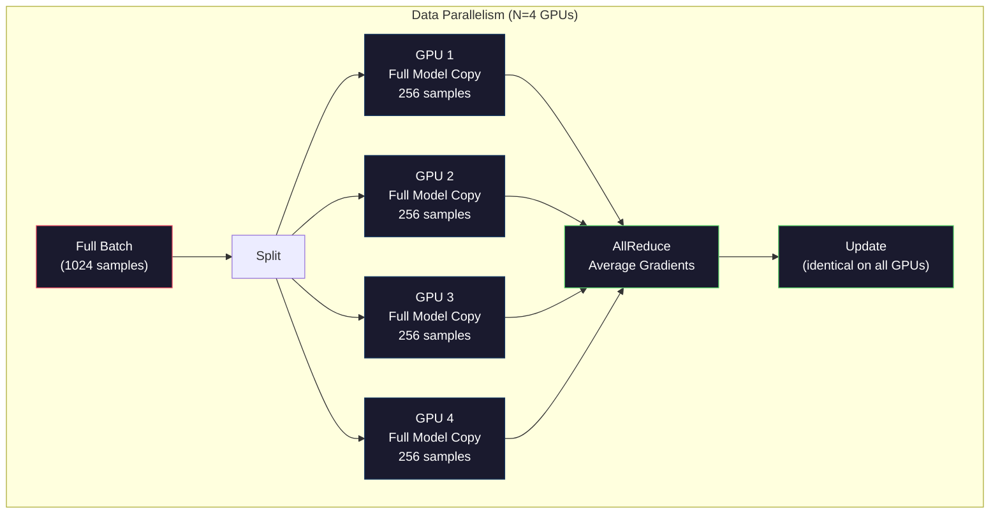
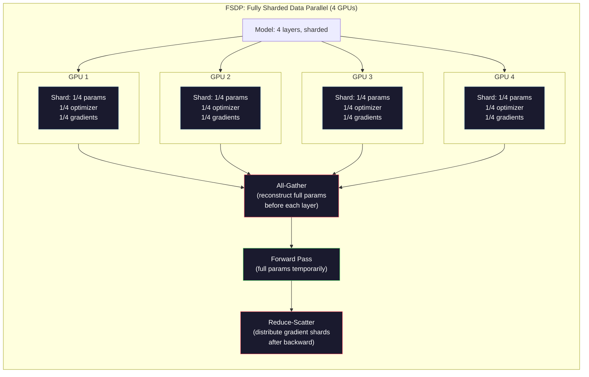
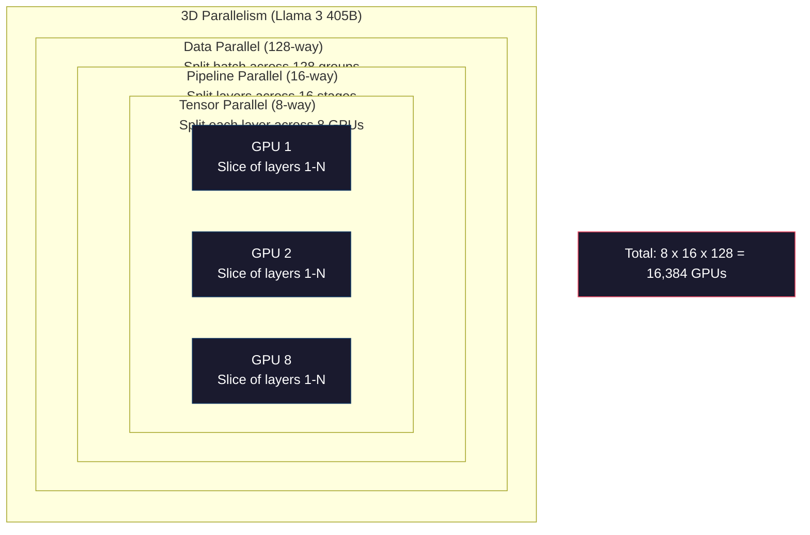

# 規模擴展：分散式訓練、FSDP、DeepSpeed

> 你的 1.24 億參數模型在單張 GPU 上就能訓練。現在試試 70 億參數。模型塞不進記憶體。資料在單台機器上要跑好幾個星期。在大型規模下，分散式訓練不是選項，它是唯一的路徑。

**Type:** Build
**Languages:** Python
**Prerequisites:** Phase 10, Lesson 04 (Pre-Training a Mini GPT)
**Time:** ~120 minutes

## Learning Objectives｜學習目標

- 解釋三種平行處理類型（資料平行、張量平行、管線平行）以及根據模型與叢集規模判斷各自適用的時機
- 使用 PyTorch DDP 實作資料平行訓練，並在多張 GPU 之間進行梯度同步（gradient synchronization）
- 計算指定模型規模的記憶體預算（權重 + 最佳化器狀態 + 梯度 + 活化值），以評估最低硬體需求
- 配置 FSDP 或 DeepSpeed ZeRO 階段以跨 GPU 對模型狀態（model states）進行分片，從而容納超出單張 GPU 記憶體容量的模型

## The Problem｜問題

一個 FP16 精度的 7B 參數模型，光是權重本身就需要 14GB。Adam 最佳化器為每個參數儲存兩份額外複本（一階矩與二階矩估計）。這又要額外消耗 28GB。反向傳播（backpropagation）期間的梯度再增加 14GB。在還沒儲存任何一個活化值（activation）之前，你已經消耗了 56GB。

一張 NVIDIA A100 只有 80GB 的記憶體。

80GB 中已經用掉了 56GB。這只剩下 24GB 給活化值——即前向傳遞（forward pass）期間計算出來的中間數值，必須在記憶體中保留以供反向傳播使用。對於一個 4096 維模型與 2048 token 序列，單一層的活化值約需 64MB。在 32 層下，每個樣本需要 2GB。批次大小為 8 時就需要 16GB。你只剩下 24GB，當批次大小達到 12 時記憶體就會直接爆炸（OOM）。

現在試試 70B 參數。光是 FP16 權重就需要 140GB。單張 GPU 根本裝不下。你至少需要 2 張 A100（2 x 80GB = 160GB）才能僅僅裝下權重。加上最佳化器狀態與梯度後，需求遠超於此：最少需要 3 張以上 GPU，而實務上根據分片策略通常需要 8 到 16 張。

Llama 3 405B 是在 16,384 張 NVIDIA H100 GPU 上訓練完成的，該次訓練的運算成本估計約 1 億美元；而 DeepSeek V3 訓練出能力相當的模型僅花費約 560 萬美元，全靠巧妙的架構設計（混合專家 MoE，意味著每個 token 僅啟動一小部分參數）與極致的訓練效率。

本課涵蓋實現大規模訓練的四種策略：資料平行（data parallelism）、張量平行（tensor parallelism）、管線平行（pipeline parallelism）以及全分片資料平行（fully sharded data parallelism）。你將在純 Python 中模擬這每一種策略，在接觸複雜的分散式訓練框架之前了解各策略的運作機制。

## The Concept｜核心概念

### 為什麼必須採用分散式架構

以下是真實模型的記憶體數學計算。每個數字都是精確算出的，絕非憑空猜測。

| 模型 | 參數量 | 權重（FP16） | Adam 狀態 | 梯度（FP16） | 總計（不含活化值） |
|-------|--------|----------------|-------------|------------------|----------------------|
| GPT-2 Small | 124M | 248 MB | 992 MB | 248 MB | 1.5 GB |
| Llama 3 8B | 8B | 16 GB | 64 GB | 16 GB | 96 GB |
| Llama 3 70B | 70B | 140 GB | 560 GB | 140 GB | 840 GB |
| Llama 3 405B | 405B | 810 GB | 3,240 GB | 810 GB | 4,860 GB |

「Adam 狀態」這一欄才是真正的記憶體殺手。Adam 為每個參數維護一個滑動平均（running mean，m）與一個滑動變異數（running variance，v），兩者皆以 FP32 存放。對於一個 70B 模型，那就是 70B x 4 位元組 x 2 = 560GB。光是最佳化器本身就需要七張 A100。

單張 H100 只有 80GB。Llama 3 405B 至少需要 61 張 H100 才能裝得下權重、最佳化器與梯度。加上活化值後，數字還會進一步暴增。Meta 使用 16,384 張 GPU 不是因為想用，而是因為不得不用。

### 資料平行（Data Parallelism）

最簡單的分散式策略。將完整模型複製到 N 張 GPU 上。將每個訓練批次切分成 N 等份。每張 GPU 在其所分到的資料分片上執行前向與反向傳遞。反向傳遞後，在所有 GPU 之間對梯度取平均。每張 GPU 使用相同的平均梯度來更新其權重複本，使所有複本維持完全同步。

**優點：** 線性吞吐量擴展。N 張 GPU 每步可處理 N 倍的資料量。通訊僅限於梯度平均，可與計算重疊進行。

**缺點：** 每張 GPU 都要持有模型、最佳化器狀態與梯度的完整複本。對於 70B 模型，每張 GPU 都需要 840GB。資料平行完全無法減少每張 GPU 的記憶體負擔，它只能縮短訓練時間。

**數學關係：** 有效批次大小 = 每張 GPU 批次大小 x N。對於 N=64 張 GPU 且每張批次為 16，有效批次大小為 1,024。Llama 3 每步的有效批次大小為 1,600 萬個 token。



### 張量平行（Tensor Parallelism）

將個別層拆分到多張 GPU 上。單一矩陣乘法被劃分給多張 GPU，各自計算一部分結果。

考慮前饋層中形狀為 (8192, 8192) 的權重矩陣。在 4 路張量平行下，每張 GPU 持有 (8192, 2048) 的分片。每張 GPU 將輸入與其分片相乘，產生局部結果。隨後透過 all-reduce 或 all-gather 將這些局部結果組合，產出完整的輸出。

**優點：** 降低每張 GPU 用於模型權重的記憶體。將 70B 模型拆分到 8 張 GPU 上，每張 GPU 僅需持有約 87.5 億參數的權重。

**缺點：** 每一層計算後都需要極高速的 GPU 間通訊。每次矩陣乘法後的 all-reduce 都會引入延遲。這在 NVLink（同節點 GPU 間 900 GB/s）下運作良好，但透過 InfiniBand（400 Gb/s，約 50 GB/s）跨節點時表現極差。因此張量平行幾乎僅限於單一節點內（8 張 GPU）。

**實務應用：** Megatron-LM 開創了張量平行。Llama 3 405B 在每個節點內部使用 8 路張量平行。

### 管線平行（Pipeline Parallelism）

按層將模型拆分。GPU 1 執行第 1 到 8 層。GPU 2 執行第 9 到 16 層。GPU 3 執行第 17 到 24 層。GPU 4 執行第 25 到 32 層。資料沿著管線流動：GPU 1 計算其層別並將活化值傳遞給 GPU 2，GPU 2 計算並傳遞給 GPU 3，依此類推。

**優點：** GPU 之間的通訊極小——僅在層邊界傳遞活化值，相較於梯度或權重而言體積極小。由於頻寬需求低，非常適合跨節點運作。

**缺點：** 管線氣泡（Pipeline bubbles）。當 GPU 4 正在微批次 1 上計算前向傳遞時，GPU 1、2、3 處於閒置狀態（因為它們已經完成了各自的部分）。在反向傳遞期間，情況反轉。在天真的管線化下，對於 N 個管線階段，GPU 利用率僅為 1/N。

**GPipe 與 PipeDream** 透過將批次切分成微批次（micro-batch）解決了氣泡問題。GPU 1 在完成微批次 1 的前向傳遞後，立刻開始處理微批次 2。這使計算跨管線階段重疊起來。在 M 個微批次與 N 個階段下，氣泡比例降低至 (N-1)/M。若使用 M=16 個微批次與 N=4 個階段，氣泡僅佔 3/16 = 18.75% 的閒置時間。

### FSDP：全分片資料平行

FSDP 結合了資料平行的可擴展性與分片的記憶體效率。與其每張 GPU 都持有模型的完整複本，每張 GPU 僅持有參數、梯度與最佳化器狀態的 1/N。

在某一層前向傳遞之前，FSDP 執行 **all-gather**，將所有 GPU 的完整參數收集到每張 GPU 的記憶體中。前向傳遞完成後，每張 GPU 立即丟棄非本地的參數。反向傳遞時，再次執行 all-gather 以重建參數來計算梯度。反向傳遞後，透過 **reduce-scatter** 分散梯度分片，使每張 GPU 僅需儲存 1/N 的梯度。

**8 張 GPU 上訓練 70B 模型的記憶體對比：**

| 元件 | 無 FSDP | 使用 FSDP |
|-----------|-------------|-----------|
| 權重（FP16） | 每張 GPU 140 GB | 每張 GPU 17.5 GB |
| Adam 狀態（FP32） | 每張 GPU 560 GB | 每張 GPU 70 GB |
| 梯度（FP16） | 每張 GPU 140 GB | 每張 GPU 17.5 GB |
| **總計** | **每張 GPU 840 GB** | **每張 GPU 105 GB** |

若沒有 FSDP，你無法在單張 80GB GPU 上裝下 70B 模型。在 8 張 GPU 上使用 FSDP，每張 GPU 仍需 105GB——依然無法塞入 80GB 卡中。你至少需要 16 張 GPU 才能壓低至每張 80GB 以下，或者將 FSDP 與活化值檢查點（activation checkpointing，反向時重新計算活化值而非全部儲存）相結合。

由於每層都需要 all-gather，其通訊開銷高於純資料平行。但記憶體的巨額節省使先前不可能進行的訓練任務變得可行。



### DeepSpeed ZeRO

DeepSpeed 的 ZeRO（Zero Redundancy Optimizer）在概念上與 FSDP 完全一致，但由微軟獨立研發。它定義了三個階段，分片程度逐級遞增：

| 階段 | 分片內容 | 記憶體節省 | 通訊開銷 |
|-------|--------|---------------|---------------|
| ZeRO-1 | 僅最佳化器狀態 | 約 4 倍減少 | 與資料平行相同 |
| ZeRO-2 | + 梯度 | 約 8 倍減少 | 略微增加 |
| ZeRO-3 | + 參數 | 約 N 倍減少（N 張 GPU） | 每層皆需 all-gather |

ZeRO-3 在功能上等價於 FSDP。命名不同，底層機制相同。PyTorch 在 DeepSpeed 證明此概念後，將 FSDP 作為原生實作引入。

DeepSpeed 還引入了 ZeRO-Offload（將最佳化器狀態卸載至更便宜且容量更大的 CPU RAM）與 ZeRO-Infinity（卸載至 NVMe SSD）。這些技術以運算速度交換記憶體容量——卸載操作較慢，但能釋放寶貴的 GPU 記憶體。

### 混合精度訓練

現代訓練同時結合使用多種浮點數格式：

- **前向傳遞**：FP16 或 BF16（16 位元）。記憶體僅為 FP32 的一半。在 Tensor Core 上的矩陣乘法速度快 2 倍。
- **主權重（Master weights）**：FP32（32 位元）。由最佳化器維護，確保權重更新時的數值精度。
- **損失縮放（Loss scaling）**：在反向傳遞前將損失乘以一個大常數，防止 FP16 梯度下溢為零。在最佳化器步驟前再除以該常數。

BF16（Brain Float 16）具有與 FP32 相同的指數範圍（8 個指數位元），但精度較低（7 個尾數位元，FP32 為 23 個）。它幾乎不需要損失縮放，因為它能表示相同範圍的數值。FP16 具有 5 個指數位元與 10 個尾數位元——它能表示更細膩的數值，但在極端數值下容易上溢或下溢。

Google 的 TPU 原生使用 BF16。NVIDIA 的 A100 與 H100 同時支援 FP16 與 BF16。業界已大幅轉向 BF16，因為它徹底免去了調整損失縮放的困擾。

**7B 模型的記憶體對比：**

| 精度模式 | 權重 | 最佳化器 | 梯度 | 總計 |
|-----------|---------|-----------|-----------|-------|
| 全程 FP32 | 28 GB | 56 GB | 28 GB | 112 GB |
| 混合精度（BF16 + FP32 主權重） | 14 GB | 56 GB | 14 GB | 84 GB |

混合精度為該模型節省了 28GB。無論精度如何，最佳化器狀態始終保持在 FP32——這才是記憶體消耗的大頭。

### Megatron-LM 與 3D 平行

真正的大規模訓練結合了所有三種平行方式：

- 跨節點組的**資料平行**（擴展批次大小）
- 節點內部的**張量平行**（跨 8 張 GPU 拆分各層）
- 跨節點的**管線平行**（跨機器拆分層群組）

在 16,384 張 H100 上的 Llama 3 405B：
- 每個節點內部 8 路張量平行（每節點 8 張 GPU）
- 跨節點 16 路管線平行（16 個管線階段）
- 剩餘維度上 128 路資料平行（16,384 / 8 / 16 = 128）

這種 3D 分解（8 x 16 x 128 = 16,384）正是擴展至數千張 GPU 的方法。每張 GPU 處理不同的資料分片（資料平行）、持有每一層的一塊切片（張量平行），並計算不同的一組層（管線平行）。

DeepSeek V3 採取了不同策略。他們的混合專家架構每個 token 僅啟動 6,710 億參數中的 370 億參數。這意味著每張 GPU 僅需計算並儲存活躍參數的活化值。他們在 2,048 張 H800 GPU（不到 Meta GPU 數量的八分之一）上完成了訓練，成本約為 560 萬美元，對比 Meta 估計的 1 億美元。



```figure
paged-kv-cache
```

## Build It｜動手實作

### 步驟 1：模擬資料平行

將批次資料切分至各模擬 GPU。每張 GPU 在其分片上執行前向傳遞。隨後對「梯度」取平均（我們以損失值模擬）。

```python
import numpy as np

def simulate_data_parallelism(data, num_gpus, model_fn):
    batch_size = len(data)
    shard_size = batch_size // num_gpus
    remainder = batch_size % num_gpus

    gpu_losses = []
    gpu_gradients = []

    offset = 0
    for gpu_id in range(num_gpus):
        extra = 1 if gpu_id < remainder else 0
        shard = data[offset:offset + shard_size + extra]
        offset += shard_size + extra

        loss, grad = model_fn(shard)
        gpu_losses.append(loss)
        gpu_gradients.append(grad)

    avg_loss = np.mean(gpu_losses)
    avg_gradient = np.mean(gpu_gradients, axis=0)

    return avg_loss, avg_gradient
```

all-reduce 操作（對梯度取平均）是資料平行中唯一的通訊。在實務中，NVIDIA GPU 上使用 NCCL 函式庫實作 ring all-reduce：每張 GPU 將其梯度的 1/N 傳送給鄰居，並接收來自另一鄰居的 1/N，在 N-1 步之後每張 GPU 都獲得了完整的平均值。總通訊量為 2 x gradient_size x (N-1)/N，在大型 N 下接近 2 倍的梯度大小。

### 步驟 2：模擬張量平行

跨 GPU 拆分權重矩陣。每張 GPU 計算局部矩陣乘法，最後組合結果。

```python
def simulate_tensor_parallelism(input_data, weight_matrix, num_gpus):
    d_in, d_out = weight_matrix.shape
    assert d_out % num_gpus == 0, f"d_out {d_out} not divisible by num_gpus {num_gpus}"
    shard_size = d_out // num_gpus

    partial_results = []
    for gpu_id in range(num_gpus):
        start = gpu_id * shard_size
        end = start + shard_size
        weight_shard = weight_matrix[:, start:end]

        partial = input_data @ weight_shard
        partial_results.append(partial)

    full_output = np.concatenate(partial_results, axis=-1)

    direct_output = input_data @ weight_matrix
    error = np.abs(full_output - direct_output).max()

    return full_output, error
```

誤差應嚴格為零（或機器精度等級）。張量平行在數學上是完全等價的——它產生的結果與在單張 GPU 上計算完整矩陣乘法完全相同。拆分是沿著輸出維度進行的，因此每張 GPU 產生不同區塊的欄，串接即可還原完整結果。

對於欄平行（column-parallel）線性層（拆分輸出維度），使用串接。對於列平行（row-parallel，拆分輸入維度），則使用加總。在 transformer FFN 中，第一個線性層（擴展）使用欄平行，第二個線性層（收縮）使用列平行。這避免了在兩層之間進行 all-reduce。

### 步驟 3：模擬管線平行

跨虛擬 GPU 拆分模型的層級。展示前段階段閒置、後段階段仍在計算的氣泡問題。

```python
def simulate_pipeline_parallelism(num_layers, num_stages, num_microbatches):
    layers_per_stage = num_layers // num_stages

    timeline = {}
    clock = 0

    for mb in range(num_microbatches):
        for stage in range(num_stages):
            start_time = max(
                timeline.get((stage, mb - 1, "fwd"), (0, 0))[1] if mb > 0 else 0,
                timeline.get((stage - 1, mb, "fwd"), (0, 0))[1] if stage > 0 else 0,
            )
            end_time = start_time + layers_per_stage
            timeline[(stage, mb, "fwd")] = (start_time, end_time)

    last_fwd_end = max(v[1] for v in timeline.values())

    for mb in range(num_microbatches - 1, -1, -1):
        for stage in range(num_stages - 1, -1, -1):
            deps = [last_fwd_end]
            if mb < num_microbatches - 1 and (stage, mb + 1, "bwd") in timeline:
                deps.append(timeline[(stage, mb + 1, "bwd")][1])
            if stage < num_stages - 1 and (stage + 1, mb, "bwd") in timeline:
                deps.append(timeline[(stage + 1, mb, "bwd")][1])
            start_time = max(deps)
            end_time = start_time + layers_per_stage
            timeline[(stage, mb, "bwd")] = (start_time, end_time)

    total_time = max(v[1] for v in timeline.values())
    compute_time = num_microbatches * num_stages * layers_per_stage * 2
    bubble_fraction = 1.0 - compute_time / (total_time * num_stages)

    return timeline, total_time, bubble_fraction
```

在 4 個階段與 1 個微批次下，氣泡比例為 75%——任何時刻都有四分之三的 GPU 處於閒置狀態。使用 16 個微批次時，氣泡降至約 19%。消除氣泡的代價是記憶體：你必須同時儲存所有在傳輸中微批次的活化值。

### 步驟 4：記憶體計算器

計算訓練任何模型大小所需的精確記憶體需求。

```python
def memory_calculator(
    params_billions,
    precision_bytes=2,
    optimizer="adam",
    num_gpus=1,
    sharding="none",
    sequence_length=2048,
    batch_size_per_gpu=1,
    hidden_dim=None,
    num_layers=None,
):
    params = params_billions * 1e9

    weight_memory = params * precision_bytes

    if optimizer == "adam":
        optimizer_memory = params * 4 * 2
    elif optimizer == "sgd":
        optimizer_memory = params * 4
    else:
        optimizer_memory = 0

    gradient_memory = params * precision_bytes

    total_no_activation = weight_memory + optimizer_memory + gradient_memory

    if hidden_dim and num_layers:
        activation_per_layer = (
            sequence_length * batch_size_per_gpu * hidden_dim * precision_bytes * 4
        )
        activation_memory = activation_per_layer * num_layers
    else:
        activation_memory = params * precision_bytes * 0.5

    if sharding == "fsdp" or sharding == "zero3":
        weight_memory /= num_gpus
        optimizer_memory /= num_gpus
        gradient_memory /= num_gpus
    elif sharding == "zero2":
        optimizer_memory /= num_gpus
        gradient_memory /= num_gpus
    elif sharding == "zero1":
        optimizer_memory /= num_gpus

    per_gpu_total = weight_memory + optimizer_memory + gradient_memory + activation_memory

    return {
        "params_billions": params_billions,
        "weights_gb": weight_memory / 1e9,
        "optimizer_gb": optimizer_memory / 1e9,
        "gradients_gb": gradient_memory / 1e9,
        "activations_gb": activation_memory / 1e9,
        "per_gpu_total_gb": per_gpu_total / 1e9,
        "total_across_gpus_gb": per_gpu_total * num_gpus / 1e9,
        "fits_on_80gb": per_gpu_total / 1e9 <= 80,
        "num_gpus": num_gpus,
        "sharding": sharding,
    }
```

這個計算器回答了每位 ML 工程師必問的問題：「我需要多少張 GPU？」輸入模型大小，確認是否裝得下。調整分片策略，直到每張 GPU 的總記憶體降至 80GB 以下。

### 步驟 5：混合精度模擬

比較 FP32、FP16 與混合精度訓練之間的記憶體使用量。

```python
def mixed_precision_comparison(params_billions):
    params = params_billions * 1e9

    fp32_weights = params * 4
    fp32_optimizer = params * 4 * 2
    fp32_gradients = params * 4
    fp32_total = fp32_weights + fp32_optimizer + fp32_gradients

    fp16_weights = params * 2
    fp16_master = params * 4
    fp16_optimizer = params * 4 * 2
    fp16_gradients = params * 2
    fp16_total = fp16_weights + fp16_master + fp16_optimizer + fp16_gradients

    mixed_weights = params * 2
    mixed_optimizer = params * 4 * 2
    mixed_gradients = params * 2
    mixed_total = mixed_weights + mixed_optimizer + mixed_gradients

    return {
        "fp32_total_gb": fp32_total / 1e9,
        "fp16_with_master_gb": fp16_total / 1e9,
        "mixed_bf16_gb": mixed_total / 1e9,
        "savings_vs_fp32": 1 - mixed_total / fp32_total,
    }
```

最令大多數人驚訝的是：混合精度並沒有讓記憶體減半。最佳化器狀態（Adam 的 m 與 v）無論如何都保留在 FP32。對於 7B 模型，FP32 訓練使用 112GB。混合精度使用 84GB。這僅減少了 25%，而不是 50%。最佳化器佔據了主導地位。

## Use It｜實際應用

### 執行所有模擬示範

```python
def run_all_demos():
    print("=" * 70)
    print("DATA PARALLELISM SIMULATION")
    print("=" * 70)

    np.random.seed(42)
    data = np.random.randn(64, 32)
    weight = np.random.randn(32, 16)

    def model_fn(batch):
        output = batch @ weight
        loss = np.mean(output ** 2)
        grad = 2 * batch.T @ (batch @ weight) / len(batch)
        return loss, grad

    for n_gpus in [1, 2, 4, 8]:
        loss, grad = simulate_data_parallelism(data, n_gpus, model_fn)
        print(f"  {n_gpus} GPUs: loss={loss:.4f}, grad_norm={np.linalg.norm(grad):.4f}")

    print()
    print("=" * 70)
    print("TENSOR PARALLELISM SIMULATION")
    print("=" * 70)

    x = np.random.randn(4, 8192)
    W = np.random.randn(8192, 8192)

    for n_gpus in [1, 2, 4, 8]:
        output, error = simulate_tensor_parallelism(x, W, n_gpus)
        print(f"  {n_gpus} GPUs: output_shape={output.shape}, max_error={error:.2e}")

    print()
    print("=" * 70)
    print("PIPELINE PARALLELISM SIMULATION")
    print("=" * 70)

    for n_mb in [1, 4, 8, 16, 32]:
        _, total_t, bubble = simulate_pipeline_parallelism(32, 4, n_mb)
        print(f"  {n_mb:2d} micro-batches: total_time={total_t:4d}, bubble={bubble:.1%}")

    print()
    print("=" * 70)
    print("MEMORY CALCULATOR")
    print("=" * 70)

    configs = [
        (7, "none", 1),
        (7, "fsdp", 8),
        (70, "none", 1),
        (70, "fsdp", 8),
        (70, "fsdp", 16),
        (405, "fsdp", 64),
        (405, "fsdp", 128),
    ]

    print(f"  {'Model':>8} {'Sharding':>8} {'GPUs':>5} {'Per-GPU':>10} {'Fits 80GB':>10}")
    print("  " + "-" * 50)
    for params, shard, gpus in configs:
        result = memory_calculator(params, num_gpus=gpus, sharding=shard)
        fits = "Yes" if result["fits_on_80gb"] else "No"
        print(f"  {params:>6}B {shard:>8} {gpus:>5} {result['per_gpu_total_gb']:>8.1f}GB {fits:>10}")

    print()
    print("=" * 70)
    print("MIXED PRECISION COMPARISON")
    print("=" * 70)

    for params_b in [7, 13, 70, 405]:
        result = mixed_precision_comparison(params_b)
        print(f"  {params_b}B: FP32={result['fp32_total_gb']:.0f}GB, "
              f"Mixed BF16={result['mixed_bf16_gb']:.0f}GB, "
              f"Savings={result['savings_vs_fp32']:.0%}")
```

## Ship It｜交付成果

本課產出 `outputs/prompt-distributed-training-planner.md`——一個接收模型大小與現有硬體規格，並產出完整分散式訓練規劃的 prompt：包含平行策略、記憶體預算、通訊開銷與預期吞吐量。

## Exercises｜練習

1. 修改記憶體計算器以納入活化值檢查點（activation checkpointing）。透過檢查點，僅在每隔 K 層儲存活化值（典型 K=1，即全部重算）。展示記憶體與運算的權衡取捨：檢查點能節省多少記憶體，以及會使訓練減慢多少（完整檢查點大約增加 33% 運算量）？

2. 擴展管線平行模擬以實作 PipeDream 所採用的 1F1B（一前向一反向）排程。在 4 個階段與 8 個微批次下，將其氣泡比例與天真排程進行比較。1F1B 排程因為更早啟動反向傳遞，其峰值記憶體應該更小。

3. 實作梯度累積模擬器。與其在每個微批次後都進行 all-reduce，不如在本地累積 K 步梯度後再進行 all-reduce。展示這如何將通訊量減少 K 倍，同時產出完全相同的最終梯度（從而產生完全相同的訓練結果）。

4. 打造成本估算器。給定模型大小、目標 token 數、GPU 類型（A100 每小時 2 美元，H100 每小時 3.50 美元）以及平行策略，估算總美元訓練成本。與已知成本進行比對驗證：Llama 3 405B 據報約 1 億美元，DeepSeek V3 約 560 萬美元。

5. 為記憶體計算器新增 ZeRO-Offload。假設每個節點的 CPU RAM 為 512GB，NVMe 為 2TB。展示將最佳化器狀態卸載至 CPU 如何讓 70B 模型在 4 張 GPU 上訓練而非 16 張，其代價是最佳化器步驟慢 30 到 50%。

## Key Terms｜關鍵術語

| 術語 | 常見說法 | 實際意義 |
|------|----------------|----------------------|
| 資料平行（Data parallelism） | 「把模型複製到每張 GPU」 | 每張 GPU 處理不同的資料分片；每步結束後透過 all-reduce 對梯度取平均 |
| 張量平行（Tensor parallelism） | 「跨 GPU 拆分一層」 | 劃分權重矩陣，使每張 GPU 計算矩陣乘法的一部分；需要極高速的 NVLink 互連 |
| 管線平行（Pipeline parallelism） | 「跨 GPU 拆分層級」 | 每張 GPU 執行不同的一組層；資料以微批次在管線中流動以減少氣泡 |
| FSDP | 「分片一切」 | 全分片資料平行（Fully Sharded Data Parallel）——每張 GPU 持有 1/N 的權重、梯度與最佳化器狀態；計算前執行 all-gather |
| ZeRO | 「DeepSpeed 版本的 FSDP」 | Zero Redundancy Optimizer，具備 3 個階段：分片最佳化器（階段 1）、+ 梯度（階段 2）、+ 參數（階段 3） |
| All-reduce | 「跨 GPU 取平均」 | 集合通訊操作，每張 GPU 最終獲得所有 GPU 輸入的加總（或平均值）——通常以 ring all-reduce 實作 |
| All-gather | 「從所有 GPU 收集」 | 集合通訊操作，每張 GPU 最終獲得所有 GPU 資料的串接結果——在 FSDP 中用於重建完整參數 |
| Reduce-scatter | 「規約並分散」 | 集合通訊操作，對資料進行歸約（求和）並將不同區塊分散給不同 GPU——在 FSDP 中用於梯度分片 |
| 混合精度（Mixed precision） | 「用半精度訓練」 | 前向／反向使用 FP16/BF16，最佳化器狀態使用 FP32——節省約 25% 記憶體而非 50%，因為最佳化器佔據主導 |
| 管線氣泡（Pipeline bubble） | 「管線中的閒置時間」 | GPU 等待來自前一階段資料的閒置時間比例——可透過使用更多微批次來降低 |

## Further Reading｜延伸閱讀

- [Rajbhandari et al., 2020 -- "ZeRO: Memory Optimizations Toward Training Trillion Parameter Models"](https://arxiv.org/abs/1910.02054) ——定義三個分片階段的 DeepSpeed ZeRO 開創性論文
- [Shoeybi et al., 2020 -- "Megatron-LM: Training Multi-Billion Parameter Language Models Using Model Parallelism"](https://arxiv.org/abs/1909.08053) ——NVIDIA 針對 transformer 的張量平行技術
- [Narayanan et al., 2021 -- "Efficient Large-Scale Language Model Training on GPU Clusters Using Megatron-LM"](https://arxiv.org/abs/2104.04473) ——結合資料、張量與管線的 3D 平行技術
- [Zhao et al., 2023 -- "PyTorch FSDP: Experiences on Scaling Fully Sharded Data Parallel"](https://arxiv.org/abs/2304.11277) ——PyTorch 原生 FSDP 實作的經驗分享
- [Llama 3 Technical Report](https://arxiv.org/abs/2407.21783) ——使用 16,384 張 GPU 進行 3D 平行訓練的詳細細節
- [DeepSeek-V3 Technical Report](https://arxiv.org/abs/2412.19437) ——MoE 架構如何將訓練成本降低一個數量級
