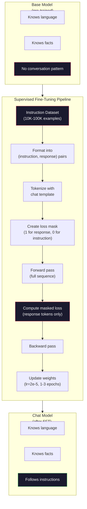

# 指令調校：Instruction Tuning（SFT）

> 基模型只會預測下一個 token。僅此而已。它不會遵循指令、不會回答問題，也不會拒絕有害請求。SFT（Supervised Fine-Tuning）是連接 token 預測器與實用助理之間的橋樑。你曾交談過的每一個模型——Claude、GPT、Llama Chat——都經歷過這一步驟。

**Type:** Build
**Languages:** Python (with numpy)
**Prerequisites:** Phase 10, Lesson 04 (Pre-Training a Mini GPT)
**Time:** ~90 minutes

## Learning Objectives｜學習目標

- 實作監督式 fine-tuning（Supervised Fine-Tuning）（SFT），將基語言模型轉化為遵循指令的助理
- 使用包含系統、使用者與助理角色的聊天範本格式化訓練資料，並對非助理 token 進行損失遮罩
- 解釋為何 SFT 是必要的：基模型只會接續文字，而非回答問題
- 透過在保留指令集上比對基模型與 fine-tuning 後模型的回應，評估 SFT 的品質

## The Problem｜問題

你在第 4 課中訓練了一個模型。它能在給定序列下預測下一個 token。餵給它「The transformer architecture」，它可能會接續「has revolutionized natural language processing。」對於一個下一個 token 預測器來說，這令人印象深刻。

現在試試這個：餵給它「What is the capital of France?」基模型不會回答「Paris」。它會延續這種句型模式。它可能會產出「What is the capital of Germany? What is the capital of Spain?」，因為它從包含問題清單的文件中學到了這種規律。或者它可能會產出「is a question that many people ask」，因為這也是一個合理的下一個 token 接續。模型完全沒有「回答」的概念。它只知道「接續」。

這就是 GPT-3（基模型，2020 年 6 月發布）與 ChatGPT（經過指令調校的模型，2022 年 11 月發布）之間的鴻溝。兩者擁有相同的架構、相同的預訓練。差別在於 2 萬到 10 萬組精心打造的（指令，回應）配對，教會了模型遵循對話模式。

史丹佛的 Alpaca 證明了你不需要數百萬個範例。2023 年 3 月，他們僅使用由 GPT-3.5 生成的 52,000 組指令－回應配對，就對 Llama 7B 進行了 fine-tuning。總成本僅 600 美元，訓練數小時即產出能遵循指令、回答問題並進行對話的聊天機器人，雖不及 ChatGPT，但已相當接近。

Meta 的 Llama 2 Chat 在最初的 SFT 階段僅使用了約 27,000 個高品質範例。核心洞見在於：品質遠比數量重要。由專業標註人員撰寫的 27,000 個範例，擊敗了從網路爬取、充斥雜訊的 100 萬個範例。

## The Concept｜核心概念

### SFT 實際上在做什麼

監督式 fine-tuning（Supervised Fine-Tuning）沿用了預訓練中相同的訓練迴圈——前向傳遞、計算損失、反向傳遞、更新權重——但採用了不同類型的資料。你不是在原始文字上訓練，而是在結構化對話上訓練：

```json
{
  "system": "You are a helpful assistant.",
  "user": "What is the capital of France?",
  "assistant": "The capital of France is Paris."
}
```

模型早已知道巴黎是法國的首都。它在預訓練期間從維基百科、教科書與網頁中學會了這一點。SFT 並不是在教模型新的事實，而是在教模型一種新的*行為*：當你看到問題時，產生答案。當你看到指令時，產生續寫內容。當你看到有害請求時，產生拒絕。

你可以這樣理解：預訓練賦予模型知識，SFT 賦予模型教養。

### 資料格式

業界主要由三種格式主導。每一種都編碼了相同的資訊——誰說了什麼——只是使用了不同的分隔符號。

**Alpaca 格式**（史丹佛，2023 年 3 月）：

```json
{
  "instruction": "Summarize the following article in 3 sentences.",
  "input": "The European Central Bank raised interest rates...",
  "output": "The ECB increased rates by 25 basis points..."
}
```

簡單且廣泛被使用。`input` 欄位是可選的——許多指令不需要額外脈絡。史丹佛以這種格式發布了 52,000 個範例，由 GPT-3.5 以 600 美元的成本生成。這掀起了開源指令調校運動。

**ShareGPT 格式**（社群，2023 年）：

```json
{
  "conversations": [
    {"from": "system", "value": "You are a helpful assistant."},
    {"from": "human", "value": "What causes tides?"},
    {"from": "gpt", "value": "Tides are caused by the gravitational pull of the Moon..."},
    {"from": "human", "value": "How often do they occur?"},
    {"from": "gpt", "value": "Most coastal areas experience two high tides and two low tides per day..."}
  ]
}
```

支援多回合對話。無論背後真實模型為何，依照慣例「from」欄位都使用「human」與「gpt」。Vicuna 使用從使用者分享的 ChatGPT 對話記錄中蒐集的 70,000 段 ShareGPT 對話進行訓練。

**ChatML 格式**（OpenAI，為許多開源模型所採用）：

```
<|im_start|>system
You are a helpful assistant.<|im_end|>
<|im_start|>user
What is the capital of France?<|im_end|>
<|im_start|>assistant
The capital of France is Paris.<|im_end|>
```

使用特殊 token（`<|im_start|>`、`<|im_end|>`）來分隔角色。這些 token 在 fine-tuning 期間會被加入 tokenizer 的詞彙表中。Qwen、Yi 與許多其他模型都採用 ChatML。

這三種格式達成了相同的目的：它們告訴模型「這是指令，這是回應，請學習這個規律」。

### 為什麼這套方法能奏效

模型在預訓練期間已經掌握了語言能力。它已經看過數十億個問答相隨、指令接續完成，以及人與人之間對話的範例。這些模式早已編碼在權重之中。

SFT 凝聚了這種潛在能力。模型不需要從語境中推敲自己究竟該回答問題還是接續文件，SFT 明確針對對話模式進行訓練。在看過幾千個範例後，模型便學會了：當你看到助理角色標記時，產生有幫助的回應。

這就是為什麼 27,000 個範例就足夠了。你不是在教模型英語，也不是在教它世界的知識，而是在教它一種簡單的行為模式：對指令做出回應。知識早已深植其中。

### 損失遮罩（Masked Loss）

這是 SFT 中最重要的技術細節，而大多數教學都略過了這一點。

在預訓練期間，你會對序列中的每個 token 計算損失。模型學習預測序列中的每個後續 token。在 SFT 期間，你**只對回應 token 計算損失**。指令 token 的存在是為了提供脈絡，但模型不會因為「預測」指令 token 錯誤而受到懲罰。

為什麼？因為你不希望模型學會去*生成*指令。你希望它學會去*回應*指令。如果你對指令 token 計算損失，你就是在訓練模型去預測「What is the capital of France?」，彷彿它是提問的那一方。這會浪費梯度訊號，並可能使模型對自己的角色產生混淆。

在實務中，你會建立一個損失遮罩（loss mask）：回應 token 設為 1，指令 token 設為 0。在取平均之前，將每個 token 的損失乘以這個遮罩。

```
Tokens:    [SYS] You are helpful [USER] What is the capital? [ASST] Paris is the capital [EOS]
Loss mask:   0    0    0     0      0     0   0  0     0       1     1    1   1     1      1
```

只有在 `[ASST]` 之後的 token 才會對損失做出貢獻。模型在前向傳遞期間能看到完整的對話（它需要指令來產生正確的回應），但僅根據它預測回應的準確程度來更新權重。

### 訓練超參數

SFT 所使用的超參數與預訓練截然不同。你不是從零開始訓練，而是在調整一個已經能正常運作的模型。

| 參數 | 預訓練（Llama 2 7B） | SFT（Llama 2 Chat） |
|-----------|---------------------------|---------------------|
| 學習率 | 3e-4（峰值） | 2e-5 |
| Epoch 數 | 1（資料跑一次） | 2 |
| 批次大小 | 400 萬 token | 64 個範例 |
| 暖機步數 | 2,000 | 0-100 |
| 權重衰減 | 0.1 | 0.0-0.1 |
| 資料規模 | 2 兆 token | 27,000 個範例 |

SFT 的學習率是預訓練的 15 分之一。這一點至關重要。fine-tuning 期間如果使用高學習率，會摧毀預訓練學到的知識。模型會「遺忘」它所學過的內容，並在小規模資料集上產生過度擬合。這就是災難性遺忘（catastrophic forgetting）。

兩個 epoch 意味著模型能將每個訓練範例看過兩次。在小型資料集上超過 3 個 epoch 容易導致死記硬背——模型開始逐字背誦訓練範例，而不是學會泛化。

### 災難性遺忘

fine-tuning 可能會摧毀模型的通用能力。在遵循指令的資料上訓練時間過長，模型就會失去撰寫程式碼、解數學題或創作文字的能力。它會在訓練資料的特定格式上變得極其優秀，而在其他所有任務上一塌糊塗。

三項緩解措施：

1. **極低的學習率。** 1e-5 到 5e-5。更小的更新幅度意味著對預訓練特徵的破壞更小。

2. **短時間訓練。** 1 到 3 個 epoch。在模型過度擬合前及時停止。

3. **混入預訓練資料。** Llama 2 Chat 在 SFT 資料集中混入了少部分（2% 到 5%）的原始預訓練資料。這在學習新的指令遵循行為時，能持續「提醒」模型其具備的通用能力。

### 真實世界數字

在單張 NVIDIA A100 80GB GPU 上，在 10,000 組高品質指令配對上 fine-tune 一個 7B 模型大約只需 1 小時。以下是具體算式：

- 10,000 個範例 x 平均 512 個 token = 512 萬個 token
- 2 個 epoch = 總計 1,024 萬個 token
- A100 在 7B 模型 fine-tuning 時的吞吐量：約每秒 3,000 個 token
- 10,240,000 / 3,000 = 約 3,400 秒 = 約 57 分鐘

對於我們的迷你 GPT（4 層、128 維），訓練幾乎是瞬間完成的。重點在於理解其運作機制，而非規模本身。



```figure
loss-masking
```

## Build It｜動手實作

### 步驟 1：指令資料集

建立一個合成指令資料集。在正式環境中，像 Scale AI 與 Anthropic 這樣的公司會聘請專業標註員來撰寫這些資料。我們將透過程式碼建立資料集以展示其格式。

```python
import numpy as np

INSTRUCTION_DATA = [
    {
        "instruction": "What is the capital of France?",
        "response": "The capital of France is Paris."
    },
    {
        "instruction": "Explain gravity in one sentence.",
        "response": "Gravity is the force that attracts objects with mass toward each other."
    },
    {
        "instruction": "Write a haiku about the ocean.",
        "response": "Waves crash on the shore, salt and foam beneath the sun, endless blue expanse."
    },
    {
        "instruction": "What is 15 multiplied by 7?",
        "response": "15 multiplied by 7 is 105."
    },
    {
        "instruction": "Name three programming languages.",
        "response": "Three programming languages are Python, Rust, and TypeScript."
    },
    {
        "instruction": "Summarize photosynthesis.",
        "response": "Photosynthesis converts sunlight, water, and carbon dioxide into glucose and oxygen."
    },
    {
        "instruction": "What year did World War II end?",
        "response": "World War II ended in 1945."
    },
    {
        "instruction": "Define machine learning.",
        "response": "Machine learning is a field where algorithms learn patterns from data to make predictions."
    },
]
```

8 個範例雖然極少（Stanford Alpaca 使用了 52,000 個），但無論你擁有 8 個還是 52,000 個，其運作機制完全相同：tokenization、建立遮罩，並僅在回應上計算損失。

### 步驟 2：使用聊天範本進行 Tokenization

使用特殊角色標記將指令－回應配對轉換為 token 序列。這些標記告訴模型指令在哪裡結束、回應在哪裡開始。

```python
SPECIAL_TOKENS = {
    "INST_START": 253,
    "INST_END": 254,
    "RESP_START": 255,
}


def tokenize_instruction_pair(instruction, response, vocab_size=256):
    inst_tokens = list(instruction.encode("utf-8"))
    resp_tokens = list(response.encode("utf-8"))

    inst_tokens = [min(t, vocab_size - 4) for t in inst_tokens]
    resp_tokens = [min(t, vocab_size - 4) for t in resp_tokens]

    tokens = (
        [SPECIAL_TOKENS["INST_START"]]
        + inst_tokens
        + [SPECIAL_TOKENS["INST_END"]]
        + [SPECIAL_TOKENS["RESP_START"]]
        + resp_tokens
    )

    return tokens


def create_loss_mask(tokens):
    mask = np.zeros(len(tokens), dtype=np.float32)
    in_response = False

    for i, token in enumerate(tokens):
        if token == SPECIAL_TOKENS["RESP_START"]:
            in_response = True
            continue
        if in_response:
            mask[i] = 1.0

    return mask
```

損失遮罩對指令 token 全為 0，對回應 token 全為 1。`RESP_START` token 本身的遮罩也是 0，因為它是分隔符號，而非回應內容的一部分。

### 步驟 3：遮罩交叉熵損失

標準的交叉熵，但乘以損失遮罩。只有回應 token 會對梯度產生貢獻。

```python
def masked_cross_entropy_loss(logits, targets, loss_mask):
    batch, seq_len, vocab_size = logits.shape
    logits_flat = logits.reshape(-1, vocab_size)
    targets_flat = targets.reshape(-1)
    mask_flat = loss_mask.reshape(-1)

    max_logits = logits_flat.max(axis=-1, keepdims=True)
    log_softmax = logits_flat - max_logits - np.log(
        np.exp(logits_flat - max_logits).sum(axis=-1, keepdims=True)
    )

    per_token_loss = -log_softmax[np.arange(len(targets_flat)), targets_flat]

    masked_loss = per_token_loss * mask_flat
    num_response_tokens = mask_flat.sum()
    if num_response_tokens == 0:
        return 0.0
    loss = masked_loss.sum() / num_response_tokens

    return loss
```

分母是 `num_response_tokens`，而不是 `seq_len`。如果除以總序列長度，較長的指令會稀釋梯度訊號。除以回應 token 數量可確保無論指令長度為何，每個回應 token 都獲得均等的權重。

### 步驟 4：SFT 訓練迴圈

重複使用第 4 課的 MiniGPT。訓練迴圈與預訓練幾乎完全相同，但加入了指令格式化與遮罩損失。

```python
import sys
import os
sys.path.insert(0, os.path.join(os.path.dirname(__file__), "..", "..", "04-pre-training-mini-gpt", "code"))
from main import MiniGPT, LayerNorm, FeedForward, MultiHeadAttention, TransformerBlock, Embedding


def sft_train(model, dataset, num_epochs=2, lr=2e-5, seq_len=64):
    formatted_data = []
    for example in dataset:
        tokens = tokenize_instruction_pair(example["instruction"], example["response"])
        mask = create_loss_mask(tokens)
        formatted_data.append((tokens, mask))

    print(f"SFT Training: {len(formatted_data)} examples, {num_epochs} epochs, lr={lr}")
    print(f"Total tokens: {sum(len(t) for t, _ in formatted_data):,}")
    print()

    losses = []

    for epoch in range(num_epochs):
        epoch_loss = 0.0
        num_batches = 0

        indices = np.random.permutation(len(formatted_data))

        for idx in indices:
            tokens, mask = formatted_data[idx]

            if len(tokens) < 3:
                continue
            if len(tokens) > seq_len:
                tokens = tokens[:seq_len]
                mask = mask[:seq_len]

            input_ids = np.array(tokens[:-1]).reshape(1, -1)
            target_ids = np.array(tokens[1:]).reshape(1, -1)
            loss_mask = np.array(mask[1:]).reshape(1, -1)

            logits = model.forward(input_ids)
            loss = masked_cross_entropy_loss(logits, target_ids, loss_mask)

            batch_size, s_len, v_size = logits.shape
            probs = np.exp(logits - logits.max(axis=-1, keepdims=True))
            probs = probs / probs.sum(axis=-1, keepdims=True)
            dlogits = probs.copy()
            dlogits[np.arange(batch_size)[:, None], np.arange(s_len), target_ids] -= 1.0

            mask_expanded = loss_mask[:, :, np.newaxis]
            num_resp = loss_mask.sum()
            if num_resp > 0:
                dlogits = dlogits * mask_expanded / num_resp

            for block in model.blocks:
                block.ffn.W1 -= lr * np.random.randn(*block.ffn.W1.shape) * 0.01
                block.ffn.W2 -= lr * np.random.randn(*block.ffn.W2.shape) * 0.01
                block.ffn.b1 -= lr * np.random.randn(*block.ffn.b1.shape) * 0.01
                block.ffn.b2 -= lr * np.random.randn(*block.ffn.b2.shape) * 0.01

            epoch_loss += loss
            num_batches += 1
            losses.append(loss)

        avg_loss = epoch_loss / max(num_batches, 1)
        print(f"Epoch {epoch + 1}/{num_epochs} | Avg Loss: {avg_loss:.4f}")

    return model, losses
```

學習率為 2e-5，與 Llama 2 Chat 相符。相較於預訓練中使用的 3e-4，這是其 15 分之一。梯度經過遮罩：指令 token 產生零梯度，只有回應 token 能推動權重更新。

### 步驟 5：比較基模型與 SFT 模型

SFT 的核心在於改變行為。我們透過檢查模型面對指令格式輸入時的回應，相較於面對原始文字接續時的表現，來衡量這種轉變。

```python
def generate_response(model, prompt_tokens, max_new_tokens=50, temperature=0.8):
    tokens = list(prompt_tokens)
    seq_len = model.embedding.pos_embed.shape[0]

    for _ in range(max_new_tokens):
        context = np.array(tokens[-seq_len:]).reshape(1, -1)
        logits = model.forward(context)
        next_logits = logits[0, -1, :]

        next_logits = next_logits / max(temperature, 1e-8)
        probs = np.exp(next_logits - next_logits.max())
        probs = probs / probs.sum()
        probs = np.clip(probs, 1e-10, 1.0)
        probs = probs / probs.sum()

        next_token = np.random.choice(len(probs), p=probs)
        tokens.append(int(next_token))

    return tokens


def evaluate_instruction_following(model, instructions):
    print("Evaluating instruction following:")
    print("-" * 50)

    for instruction in instructions:
        tokens = (
            [SPECIAL_TOKENS["INST_START"]]
            + [min(t, 252) for t in list(instruction.encode("utf-8"))]
            + [SPECIAL_TOKENS["INST_END"]]
            + [SPECIAL_TOKENS["RESP_START"]]
        )

        output = generate_response(model, tokens, max_new_tokens=30, temperature=0.6)
        response_start = len(tokens)
        response_tokens = output[response_start:]
        response_bytes = bytes([t for t in response_tokens if t < 128])
        response_text = response_bytes.decode("utf-8", errors="replace")

        print(f"  Q: {instruction}")
        print(f"  A: {response_text[:80]}")
        print()
```

在只有 8 個範例的微型模型上，回應不會具有太多實質意義。這是預期之內的。重要的是其**結構**：模型學會了在回應標記之後產出內容，而不是接續生成更多指令。

### 步驟 6：衡量災難性遺忘

比較模型在 SFT 前後的下一個 token 預測能力。如果 SFT 損害了通用能力，原始文字上的損失就會上升。

```python
def measure_forgetting(model, test_text, seq_len=64):
    tokens = np.array(list(test_text.encode("utf-8")[:512]))

    total_loss = 0.0
    num_windows = 0

    for start in range(0, len(tokens) - seq_len - 1, seq_len):
        input_ids = tokens[start:start + seq_len].reshape(1, -1)
        target_ids = tokens[start + 1:start + seq_len + 1].reshape(1, -1)

        logits = model.forward(input_ids)

        batch, s_len, vocab_size = logits.shape
        logits_flat = logits.reshape(-1, vocab_size)
        targets_flat = target_ids.reshape(-1)

        max_logits = logits_flat.max(axis=-1, keepdims=True)
        log_softmax = logits_flat - max_logits - np.log(
            np.exp(logits_flat - max_logits).sum(axis=-1, keepdims=True)
        )

        loss = -log_softmax[np.arange(len(targets_flat)), targets_flat].mean()
        total_loss += loss
        num_windows += 1

    return total_loss / max(num_windows, 1)
```

在真實 fine-tuning 中，你應該在整個訓練過程中持續追蹤此指標。如果原始文字上的損失上升超過 10% 到 15%，就表示 SFT 過於激進。應降低學習率或減少 epoch 數。

## Use It｜實際應用

### 完整 SFT 管線示範

```python
if __name__ == "__main__":
    np.random.seed(42)

    test_text = """The transformer architecture processes sequences through self-attention.
Each layer applies multi-head attention followed by a feedforward network.
Residual connections and layer normalization stabilize deep networks.
The model learns to predict the next token given all previous tokens."""

    print("=" * 70)
    print("INSTRUCTION TUNING (SFT) DEMO")
    print("=" * 70)
    print()

    model = MiniGPT(
        vocab_size=256, embed_dim=128, num_heads=4,
        num_layers=4, max_seq_len=128, ff_dim=512
    )
    print(f"Model: {model.count_parameters():,} parameters")
    print(f"Config: 4 layers, 4 heads, 128 dims (mini GPT from Lesson 04)")
    print()

    print("PRE-SFT: Measuring base model loss on raw text")
    base_loss = measure_forgetting(model, test_text)
    print(f"  Base model loss: {base_loss:.4f}")
    print()

    print("=" * 70)
    print("SFT TRAINING")
    print("=" * 70)

    model, losses = sft_train(
        model, INSTRUCTION_DATA, num_epochs=3, lr=2e-5, seq_len=128
    )

    print()
    print("POST-SFT: Measuring fine-tuned model loss on raw text")
    sft_loss = measure_forgetting(model, test_text)
    print(f"  SFT model loss: {sft_loss:.4f}")
    print(f"  Change: {((sft_loss - base_loss) / base_loss * 100):+.1f}%")
    if abs(sft_loss - base_loss) / base_loss < 0.15:
        print("  Minimal forgetting (< 15% change)")
    else:
        print("  Significant forgetting detected")
    print()

    print("=" * 70)
    print("INSTRUCTION FOLLOWING EVALUATION")
    print("=" * 70)
    print()

    test_instructions = [
        "What is the capital of France?",
        "Name a programming language.",
        "Define gravity.",
    ]
    evaluate_instruction_following(model, test_instructions)

    print("=" * 70)
    print("DATA FORMAT EXAMPLES")
    print("=" * 70)
    print()

    for i, example in enumerate(INSTRUCTION_DATA[:3]):
        tokens = tokenize_instruction_pair(example["instruction"], example["response"])
        mask = create_loss_mask(tokens)
        resp_count = int(mask.sum())
        total_count = len(tokens)
        print(f"  Example {i + 1}: {total_count} tokens, {resp_count} response tokens ({resp_count/total_count:.0%} of sequence)")
        print(f"    Instruction: {example['instruction']}")
        print(f"    Response: {example['response']}")
        print()

    print("=" * 70)
    print("TRAINING LOSS CURVE")
    print("=" * 70)
    print()

    if losses:
        window = max(1, len(losses) // 5)
        for i in range(0, len(losses), window):
            chunk = losses[i:i + window]
            avg = sum(chunk) / len(chunk)
            print(f"  Steps {i:3d}-{i + len(chunk) - 1:3d}: avg loss = {avg:.4f}")
```

## Ship It｜交付成果

本課產出 `outputs/prompt-sft-data-curator.md`——一個協助你設計與整理 SFT 指令資料集的 prompt。給定目標能力（程式碼生成、數學、對話），它會產生一份資料收集計畫，包含格式規範、品質標準與多樣性要求。

## Exercises｜練習

1. 新增系統 prompt 支援。修改 `tokenize_instruction_pair` 以接收系統訊息並將其加在指令之前。建立 5 個帶有不同系統 prompt 的範例（「You are a poet」、「You are a math tutor」），並確認模型在訓練期間能看到不同的系統 prompt。

2. 實作資料混合（data mixing）。建立一個函數，接收 SFT 資料集與原始文字語料庫，並產出訓練批次，其中 5% 的範例為原始文字（無遮罩），95% 為指令配對（帶遮罩）。執行 3 個 epoch，並將遺忘指標與純 SFT 訓練進行比較。

3. 打造資料品質評分器。對於每一組指令－回應配對，計算：(a) 回應 token 長度、(b) 指令與回應比例、(c) 詞彙多樣性（不重複 token 數 / 總 token 數）。過濾掉回應長度 < 10 個 token 或多樣性 < 0.3 的範例。展示過濾如何影響最終損失。

4. 實作多回合對話訓練。擴展 tokenization 以處理 3 回合對話（user-assistant-user-assistant-user-assistant）。損失遮罩應涵蓋所有三個 assistant 回合。透過印出單一範例的 token 與遮罩對齊情況，驗證遮罩的正確性。

5. 比較學習率。分別使用 lr=1e-4、lr=2e-5 與 lr=1e-6 訓練相同的模型三次。繪製損失曲線。1e-4 的訓練應展現出初期的迅速下降但最終損失較高（過度擬合）。1e-6 的訓練則幾乎沒有進展。2e-5 的訓練應該是最佳的甜蜜點（sweet spot）。

## Key Terms｜關鍵術語

| 術語 | 常見說法 | 實際意義 |
|------|----------------|----------------------|
| SFT | 「在對話上 fine-tune」 | 監督式 fine-tuning（Supervised Fine-Tuning）：在（指令，回應）配對上接續訓練，僅在回應 token 上計算損失 |
| 指令調校（Instruction tuning） | 「教會模型遵循指令」 | 在明確的指令－回應配對上訓練，讓基模型學會對話模式，而非學習新知識 |
| 損失遮罩（Loss masking） | 「忽略 prompt」 | 將指令 token 的損失設為零，使梯度僅由回應 token 的預測流出 |
| ChatML | 「Chat Markup Language」 | 一種使用 `<\|im_start\|>` 與 `<\|im_end\|>` 分隔符號來標記對話中說話者角色的 token 格式 |
| Alpaca 格式 | 「史丹佛格式」 | 包含 instruction/input/output 欄位的 JSON 格式，曾用於以 600 美元成本生成的 5.2 萬個 GPT-3.5 範例 |
| 災難性遺忘（Catastrophic forgetting） | 「模型變笨了」 | fine-tuning 破壞了預訓練能力，因為梯度更新以特定任務模式覆蓋了通用知識 |
| 權重綁定（Weight tying） | 「共享 embedding」 | 在輸入 token embedding 與輸出預測頭之間使用同一個矩陣，節省參數並改善一致性 |
| 聊天範本（Chat template） | 「如何格式化 prompt」 | 針對模型組織對話結構的特定 token 序列（角色標記、分隔符號） |

## Further Reading｜延伸閱讀

- [Ouyang et al., 2022 -- "Training language models to follow instructions with human feedback" (InstructGPT)](https://arxiv.org/abs/2203.02155) ——OpenAI 提出指令調校與 RLHF 的開創性論文
- [Taori et al., 2023 -- "Stanford Alpaca: An Instruction-following LLaMA Model"](https://github.com/tatsu-lab/stanford_alpaca) ——花費 600 美元獲得 5.2 萬個指令範例，證明 SFT 能在小型資料集上成功
- [Touvron et al., 2023 -- "Llama 2: Open Foundation and Fine-Tuned Chat Models"](https://arxiv.org/abs/2307.09288) ——Meta 採用 2.7 萬個高品質範例的 SFT 與 RLHF 管線
- [Chiang et al., 2023 -- "Vicuna: An Open-Source Chatbot Impressing GPT-4"](https://lmsys.org/blog/2023-03-30-vicuna/) ——在 7 萬筆 ShareGPT 對話上訓練開源模型的里程碑
- [Zhou et al., 2023 -- "LIMA: Less Is More for Alignment"](https://arxiv.org/abs/2305.11206) ——證明 1,000 個精心挑選的範例就能匹敵大規模 SFT 的經典論文
