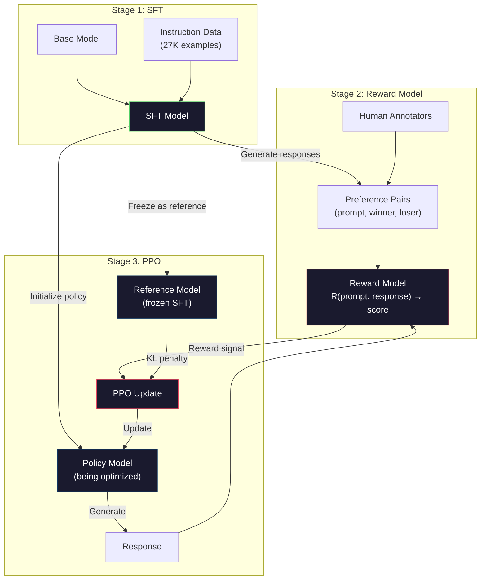
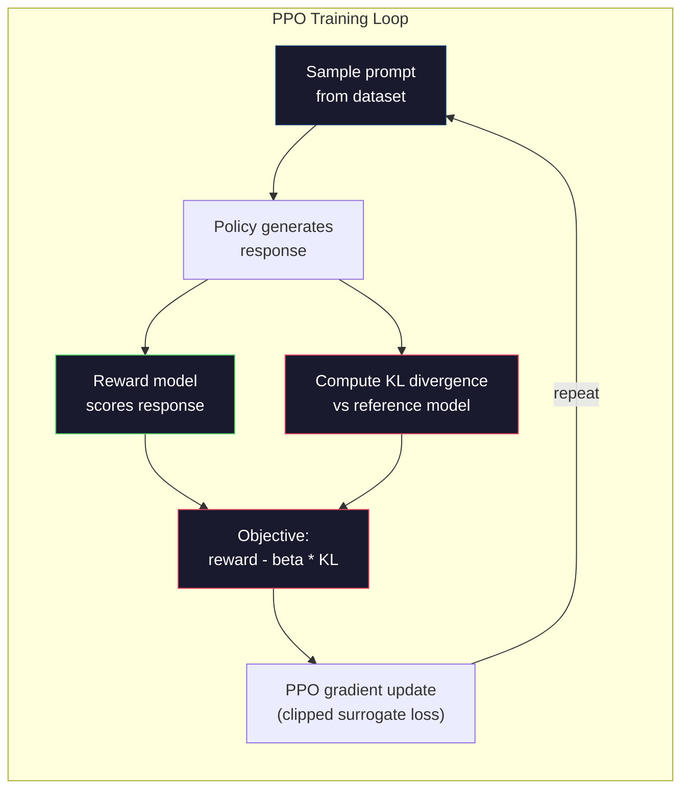

# RLHF：獎勵模型（reward model）與 PPO

> SFT 教會了模型遵循指令。但它沒有教會模型哪種回應「更好」。兩段在文法與事實上都完全正確的回答，在實用價值上可能天差地別。RLHF 是將人類判斷力編碼進模型行為的方式。這正是讓 Claude 樂於助人、讓 GPT 彬彬有禮的關鍵。

**Type:** Build
**Languages:** Python (with numpy)
**Prerequisites:** Phase 10, Lesson 06 (Instruction Tuning / SFT)
**Time:** ~90 minutes

## Learning Objectives｜學習目標

- 建構一個獎勵模型，根據人類偏好配對（勝出 vs 落敗）為回應品質評分
- 實作 PPO 訓練迴圈，在帶有 KL 懲罰的條件下針對獎勵模型最佳化語言模型策略
- 解釋為何 RLHF 需要三個模型（SFT、獎勵模型、策略模型），以及 KL 約束如何防止獎勵操弄（reward hacking）
- 透過在偏好最佳化前後比較回應品質，評估 RLHF 的實際效果

## The Problem｜問題

詢問一個模型「Explain quantum computing」，它可能會給出兩種回應：

**回應 A：**「量子運算使用能處於疊加態（superposition）的量子位元（qubit），意味著它們可以同時是 0、1，或兩者兼具。這讓量子電腦在某些計算上能以指數級的速度超越古典電腦。關鍵演算法包括用於分解大數的 Shor 演算法，以及用於搜尋未排序資料庫的 Grover 演算法。」

**回應 B：**「量子運算是一種利用量子力學現象的運算方式。它最早在 1980 年代被提出。Richard Feynman 曾建議，量子系統可以由量子電腦來模擬。此後這個領域成長顯著。如今許多公司都在研發量子電腦，IBM、Google 等也都有所進展。Google 於 2019 年宣稱達成了量子優越性（quantum supremacy）。」

兩種回應在事實上都是正確的。兩者文法無懈可擊。兩者都遵循了指令。但回應 A 明顯更好：更精煉、資訊密度更高、結構更分明。人類每次都會毫不猶豫地選擇 A。

SFT 無法捕捉這種層次的差異。它是在「正確」的回應上訓練模型，但它沒有機制去表達「這個回應比那個更好」。它將每個訓練樣本視為同等優良。如果 A 和 B 同時出現在 SFT 資料集中，模型就會平等地向兩者學習。

RLHF 解決了這個難題。它訓練一個獎勵模型來預測人類更偏好哪一個回應，接著利用該獎勵訊號推動語言模型產出更高品質的輸出。InstructGPT（ChatGPT 的前身）利用 RLHF 顯著提升了 GPT-3 的實用性、真實性與無害性。OpenAI 的內部評測人員在 85% 的情況下更偏好 InstructGPT 的輸出而非原始 GPT-3，儘管 InstructGPT 的參數量小了 135 倍（13 億對比 1,750 億參數）。

## The Concept｜核心概念

### 三個階段

RLHF 不是單一一次訓練。它是一條由三個循序漸進階段組成的管線，每一階段都建立在前一階段的基礎之上。

**第 1 階段：SFT。** 在指令－回應配對上訓練基模型（第 6 課）。這會賦予你一個能遵循指令的模型，但它還不知道哪些回應比其他回應更優秀。

**第 2 階段：獎勵模型。** 收集人類偏好資料：向標註員展示同一個 prompt 的兩種回應，並詢問「哪一個更好？」訓練一個模型來預測這些偏好。獎勵模型接收（prompt，回應）作為輸入，並輸出純量分數。

**第 3 階段：PPO。** 使用獎勵模型為語言模型產生訓練訊號。語言模型生成回應，獎勵模型為其評分，PPO 演算法更新語言模型以產出更高分的回應。KL 散度懲罰（KL divergence penalty）則防止語言模型偏離 SFT checkpoint 太遠。



### 獎勵模型

獎勵模型本質上是一個改作評分器的語言模型。取用 SFT 模型，將語言建模輸出頭（輸出整個詞彙表的分布）替換為純量輸出頭（輸出單一數值）。除了最後一層之外，架構完全相同。

輸入：串接在一起的 prompt 與回應。輸出：單一純量獎勵分數。

訓練資料是人類偏好配對。針對每個 prompt，標註員會看見兩種回應並挑選出較好的一個。這構成了訓練三元組：（prompt，勝出回應，落敗回應）。

損失函數採用成對偏好的 Bradley-Terry 模型：

```
loss = -log(sigmoid(reward(preferred) - reward(rejected)))
```

這是核心公式。`sigmoid(reward(A) - reward(B))` 給出回應 A 比回應 B 更受偏好的機率。損失函數推動獎勵模型為勝出回應賦予更高的分數。

為什麼採用成對比對而非絕對分數？因為人類在給出絕對品質評分時極不可靠（「這個回答是 7.3 分還是 7.5 分？」），但在進行相對比較時卻非常精準（「A 是否比 B 好？」）。Bradley-Terry 模型巧妙地將相對比較轉換為一致的絕對評分系統。

**InstructGPT 的數字：** OpenAI 聘請了 40 位外包人員收集了 33,000 組比較配對。每次比較約需 5 分鐘。為了訓練獎勵模型總共耗費了 2,750 小時的人工勞動。

### PPO：近端策略最佳化

PPO 是一種強化學習演算法。在 RLHF 中，「環境」是獎勵模型，「agent」是語言模型，而「動作」則是生成一個 token。

目標函數：

```
maximize: E[R(prompt, response)] - beta * KL(policy || reference)
```

第一項促使模型生成高獎勵的回應。第二項（KL 散度懲罰）則限制模型不能偏離原本的 SFT checkpoint 太遠。

為什麼需要 KL 懲罰？若沒有它，模型就會找出退化的投機取巧解。獎勵模型是在有限的人類偏好資料集上訓練出來的，必然存在盲點。語言模型會利用這些盲點——尋找能在獎勵模型上拿下高分、但實際上毫無意義的輸出。經典案例包括：

- 不斷重複「I'm so helpful and harmless!」，在實用/無害獎勵模型上拿下高分
- 產生冗長、語氣正式卻空洞的回應，只在表面模式上貼近「高品質」
- 反覆濫用某些碰巧在訓練資料中與高獎勵正相關的特定句式

KL 懲罰宣告了遊戲規則：你可以自我改進，但你不能變成一個完全面目全非的模型。必須維持在原本已經相當合理的 SFT 版本附近。一旦偏離太遠，KL 懲罰的代價就會壓過所得的獎勵。

**InstructGPT 的參數：** PPO 訓練使用 lr=1.5e-5、KL 係數 beta=0.02、256K 個 episode（prompt－回應配對），每個批次執行 4 個 PPO epoch。整條 RLHF 管線在 GPU 叢集上花費了數天時間。



### PPO 目標函數細節

PPO 採用「截斷代理目標（clipped surrogate objective）」來防止過大的更新步伐。新策略與舊策略的機率比率被截斷在 [1 - epsilon, 1 + epsilon] 區間內，其中 epsilon 通常設為 0.2。

```
ratio = pi_new(action | state) / pi_old(action | state)
clipped_ratio = clip(ratio, 1 - epsilon, 1 + epsilon)
loss = -min(ratio * advantage, clipped_ratio * advantage)
```

優勢函數（Advantage）衡量當前回應相對於預期品質好了多少。在 RLHF 中：

```
advantage = reward(prompt, response) - baseline
```

基準線通常是近期回應的平均獎勵。正的優勢值意味著回應優於平均水準；負的優勢值意味著低於平均水準。PPO 提高優於平均的回應機率，降低低於平均的回應機率。

截斷機制防止了災難性更新。如果單一回應獲得異常高分的獎勵，未經截斷的比率可能會非常龐大，導致模型劇烈倒向該回應。截斷為更新幅度設下了上限，維持了訓練的穩定性。

### 獎勵操弄（Reward Hacking）

RLHF 陰暗的一面。語言模型正針對獎勵模型進行最佳化，而獎勵模型只是人類真實偏好的一個不完美代理。隨著語言模型越來越擅長最大化獎勵，它開始無情地鑽獎勵模型的弱點漏洞。

常見失敗模式：

| 失敗模式 | 具體現象 | 原因 |
|---------|-------------|-----|
| 冗長（Verbosity） | 模型產生越來越長的回應 | 人類標註員往往偏好更長、更詳盡的回應，導致獎勵模型將長度與高分掛鉤 |
| 諂媚（Sycophancy） | 模型無條件附和使用者所說的一切 | 標註員偏好贊同問題前提的回應 |
| 模稜兩可（Hedging） | 模型拒絕給出明確答案 | 模稜兩可的回應（「這是一個複雜的議題，包含許多視角……」）極少被判定為錯誤 |
| 格式套版（Format gaming） | 模型過度濫用列點與標題 | 格式排版整齊的回應在標註員眼中顯得更加「專業」 |

緩解策略：增強 KL 懲罰（限制模型偏離太遠以致鑽漏洞）、在對抗性範例上訓練獎勵模型（修補已知的失敗模式），以及同時採用不同架構的多個獎勵模型（很難同時鑽所有模型的漏洞）。

### 真實的 RLHF 管線規格

| 模型 | 比較配對數 | 標註員人數 | 獎勵模型大小 | PPO 步數 | KL 係數 |
|-------|-----------------|------------|---------|-----------|----------|
| InstructGPT | 33K | 40 | 6B | 256K | 0.02 |
| Llama 2 Chat | 約 100 萬 | 未公開 | 70B | 未公開 | 0.01 |
| Claude | 未公開 | 未公開 | 未公開 | 未公開 | 未公開 |
| Anthropic RLHF 論文 | 22K | 20 | 52B | 50K | 0.001 |

Anthropic 在 2022 年的論文中，於 22,000 組比較上訓練了一個 52B 的獎勵模型。較大的獎勵模型能提供更可靠的訊號，使 PPO 訓練更加穩定。使用小獎勵模型來訓練大型語言模型極具風險——小獎勵模型沒有足夠容量去捕捉優秀與劣質回應之間的細微差別。

```figure
rlhf-pipeline
```

## Build It｜動手實作

### 步驟 1：合成偏好資料

在正式環境中，偏好資料由人類標註員建立。我們將建立合成配對，其中「勝出」回應客觀上更加優質（更精確、更正確、更有幫助）。

```python
import numpy as np

PREFERENCE_DATA = [
    {
        "prompt": "What is the capital of France?",
        "preferred": "The capital of France is Paris.",
        "rejected": "France is a country in Europe. It has many cities. The capital is Paris. Paris is known for the Eiffel Tower.",
    },
    {
        "prompt": "Explain gravity in one sentence.",
        "preferred": "Gravity is the force that attracts objects with mass toward each other.",
        "rejected": "Gravity is something that makes things fall down when you drop them.",
    },
    {
        "prompt": "What is 15 times 7?",
        "preferred": "15 times 7 is 105.",
        "rejected": "Let me think about this. 15 times 7. Well, 10 times 7 is 70, and 5 times 7 is 35, so the answer might be around 105.",
    },
    {
        "prompt": "Name three programming languages.",
        "preferred": "Python, Rust, and TypeScript.",
        "rejected": "There are many programming languages. Some popular ones include various languages like Python and others.",
    },
    {
        "prompt": "What year did World War II end?",
        "preferred": "World War II ended in 1945.",
        "rejected": "World War II was a major global conflict. It involved many countries. The war ended in the mid-1940s, specifically in 1945.",
    },
    {
        "prompt": "Define machine learning.",
        "preferred": "Machine learning is a field where algorithms learn patterns from data to make predictions without being explicitly programmed.",
        "rejected": "Machine learning is a type of AI. AI stands for artificial intelligence. Machine learning uses data to learn.",
    },
]
```

勝出的回應簡明扼要。落敗的回應表現出典型的失敗模式：無意義的湊字數、模稜兩可、冗餘解釋與不精確。這正是 SFT 無法區分、但 RLHF 能夠準確捕捉的差異。

### 步驟 2：獎勵模型架構

獎勵模型重複使用了迷你 GPT 的 transformer 架構，但將詞彙表大小的輸出頭替換為單一純量投影。

```python
import sys
import os
sys.path.insert(0, os.path.join(os.path.dirname(__file__), "..", "..", "04-pre-training-mini-gpt", "code"))
from main import MiniGPT, LayerNorm, Embedding, TransformerBlock


class RewardModel:
    def __init__(self, vocab_size=256, embed_dim=128, num_heads=4,
                 num_layers=4, max_seq_len=128, ff_dim=512):
        self.embedding = Embedding(vocab_size, embed_dim, max_seq_len)
        self.blocks = [
            TransformerBlock(embed_dim, num_heads, ff_dim)
            for _ in range(num_layers)
        ]
        self.ln_f = LayerNorm(embed_dim)
        self.reward_head = np.random.randn(embed_dim) * 0.02

    def forward(self, token_ids):
        seq_len = token_ids.shape[-1]
        mask = np.triu(np.full((seq_len, seq_len), -1e9), k=1)

        x = self.embedding.forward(token_ids)
        for block in self.blocks:
            x = block.forward(x, mask)
        x = self.ln_f.forward(x)

        last_hidden = x[:, -1, :]
        reward = last_hidden @ self.reward_head

        return reward
```

獎勵模型取用**最後一個** token 位置的隱藏狀態，並將其投影為純量。為什麼是最後一個 token？因為因果注意力遮罩意味著最後一個位置已經關注了先前的每一個 token，它對整個（prompt，回應）序列的表示最完整。

### 步驟 3：Bradley-Terry 損失

使用 Bradley-Terry 成對損失在偏好配對上訓練獎勵模型。

```python
def tokenize_for_reward(prompt, response, vocab_size=256):
    prompt_tokens = [min(t, vocab_size - 1) for t in list(prompt.encode("utf-8"))]
    response_tokens = [min(t, vocab_size - 1) for t in list(response.encode("utf-8"))]
    return prompt_tokens + [0] + response_tokens


def sigmoid(x):
    return np.where(
        x >= 0,
        1.0 / (1.0 + np.exp(-x)),
        np.exp(x) / (1.0 + np.exp(x))
    )


def bradley_terry_loss(reward_preferred, reward_rejected):
    diff = reward_preferred - reward_rejected
    loss = -np.log(sigmoid(diff) + 1e-8)
    return loss


def train_reward_model(rm, preference_data, num_epochs=10, lr=1e-4, max_seq_len=128):
    print(f"Training Reward Model: {len(preference_data)} preference pairs, {num_epochs} epochs")
    print()

    losses = []
    accuracies = []

    for epoch in range(num_epochs):
        epoch_loss = 0.0
        epoch_correct = 0
        num_pairs = 0

        indices = np.random.permutation(len(preference_data))

        for idx in indices:
            pair = preference_data[idx]

            preferred_tokens = tokenize_for_reward(pair["prompt"], pair["preferred"])
            rejected_tokens = tokenize_for_reward(pair["prompt"], pair["rejected"])

            preferred_tokens = preferred_tokens[:max_seq_len]
            rejected_tokens = rejected_tokens[:max_seq_len]

            preferred_ids = np.array(preferred_tokens).reshape(1, -1)
            rejected_ids = np.array(rejected_tokens).reshape(1, -1)

            r_preferred = rm.forward(preferred_ids)[0]
            r_rejected = rm.forward(rejected_ids)[0]

            loss = bradley_terry_loss(r_preferred, r_rejected)

            if r_preferred > r_rejected:
                epoch_correct += 1

            diff = r_preferred - r_rejected
            grad = sigmoid(diff) - 1.0

            rm.reward_head -= lr * grad * rm.ln_f.forward(
                rm.embedding.forward(preferred_ids)
            )[:, -1, :].flatten()

            epoch_loss += loss
            num_pairs += 1

        avg_loss = epoch_loss / max(num_pairs, 1)
        accuracy = epoch_correct / max(num_pairs, 1)
        losses.append(avg_loss)
        accuracies.append(accuracy)

        if epoch % 2 == 0:
            print(f"  Epoch {epoch + 1:3d} | Loss: {avg_loss:.4f} | Accuracy: {accuracy:.1%}")

    return rm, losses, accuracies
```

準確率指標非常直接：獎勵模型正確排名的偏好配對比例是多少？隨機模型的準確率為 50%。在乾淨資料上訓練良好的獎勵模型應超過 70%。InstructGPT 的獎勵模型在保留比較集上達到了約 72% 的準確率，這聽起來不高，但實際上相當出色——因為許多偏好配對即使對人類而言也充滿模糊性（標註員之間的一致性大約只有 73%）。

### 步驟 4：簡化版 PPO 迴圈

完整的 PPO 相當繁複。這個實作捕捉了其核心機制：生成回應、為其評分、計算優勢值，並加入 KL 懲罰來更新策略。

```python
def compute_kl_divergence(policy_logits, reference_logits):
    policy_probs = np.exp(policy_logits - policy_logits.max(axis=-1, keepdims=True))
    policy_probs = policy_probs / policy_probs.sum(axis=-1, keepdims=True)
    policy_probs = np.clip(policy_probs, 1e-10, 1.0)

    ref_probs = np.exp(reference_logits - reference_logits.max(axis=-1, keepdims=True))
    ref_probs = ref_probs / ref_probs.sum(axis=-1, keepdims=True)
    ref_probs = np.clip(ref_probs, 1e-10, 1.0)

    kl = np.sum(policy_probs * np.log(policy_probs / ref_probs), axis=-1)
    return kl.mean()


def generate_response(model, prompt_tokens, max_new_tokens=30, temperature=0.8, max_seq_len=128):
    tokens = list(prompt_tokens)

    for _ in range(max_new_tokens):
        context = np.array(tokens[-max_seq_len:]).reshape(1, -1)
        logits = model.forward(context)
        next_logits = logits[0, -1, :]

        next_logits = next_logits / max(temperature, 1e-8)
        probs = np.exp(next_logits - next_logits.max())
        probs = probs / probs.sum()
        probs = np.clip(probs, 1e-10, 1.0)
        probs = probs / probs.sum()

        next_token = np.random.choice(len(probs), p=probs)
        tokens.append(int(next_token))

    return tokens


def copy_model_weights(source, target):
    target.embedding.token_embed = source.embedding.token_embed.copy()
    target.embedding.pos_embed = source.embedding.pos_embed.copy()
    target.ln_f.gamma = source.ln_f.gamma.copy()
    target.ln_f.beta = source.ln_f.beta.copy()
    for s_block, t_block in zip(source.blocks, target.blocks):
        t_block.attn.W_q = s_block.attn.W_q.copy()
        t_block.attn.W_k = s_block.attn.W_k.copy()
        t_block.attn.W_v = s_block.attn.W_v.copy()
        t_block.attn.W_out = s_block.attn.W_out.copy()
        t_block.ffn.W1 = s_block.ffn.W1.copy()
        t_block.ffn.W2 = s_block.ffn.W2.copy()
        t_block.ffn.b1 = s_block.ffn.b1.copy()
        t_block.ffn.b2 = s_block.ffn.b2.copy()
        t_block.ln1.gamma = s_block.ln1.gamma.copy()
        t_block.ln1.beta = s_block.ln1.beta.copy()
        t_block.ln2.gamma = s_block.ln2.gamma.copy()
        t_block.ln2.beta = s_block.ln2.beta.copy()


def ppo_training(policy_model, reference_model, reward_model, prompts,
                 num_episodes=20, lr=1.5e-5, kl_coeff=0.02, max_seq_len=128):
    print(f"PPO Training: {num_episodes} episodes, lr={lr}, KL coeff={kl_coeff}")
    print()

    rewards_history = []
    kl_history = []

    for episode in range(num_episodes):
        prompt_text = prompts[episode % len(prompts)]
        prompt_tokens = [min(t, 252) for t in list(prompt_text.encode("utf-8"))]

        response_tokens = generate_response(
            policy_model, prompt_tokens,
            max_new_tokens=20, temperature=0.8, max_seq_len=max_seq_len
        )

        response_ids = np.array(response_tokens[:max_seq_len]).reshape(1, -1)
        reward = reward_model.forward(response_ids)[0]

        policy_logits = policy_model.forward(response_ids)
        ref_logits = reference_model.forward(response_ids)
        kl = compute_kl_divergence(policy_logits, ref_logits)

        total_reward = reward - kl_coeff * kl

        rewards_history.append(float(reward))
        kl_history.append(float(kl))

        for block in policy_model.blocks:
            update_scale = lr * total_reward
            block.ffn.W1 += update_scale * np.random.randn(*block.ffn.W1.shape) * 0.01
            block.ffn.W2 += update_scale * np.random.randn(*block.ffn.W2.shape) * 0.01

        if episode % 5 == 0:
            avg_reward = np.mean(rewards_history[-5:]) if rewards_history else 0
            avg_kl = np.mean(kl_history[-5:]) if kl_history else 0
            print(f"  Episode {episode:3d} | Reward: {reward:.4f} | KL: {kl:.4f} | "
                  f"Avg Reward: {avg_reward:.4f}")

    return policy_model, rewards_history, kl_history
```

核心迴圈：(1) 抽樣 prompt，(2) 生成回應，(3) 透過獎勵模型評分，(4) 計算相對於凍結參考模型的 KL 散度，(5) 計算調整後的獎勵（獎勵扣除 KL 懲罰），(6) 更新策略。當策略偏離參考模型時，KL 懲罰會自動增加，從而自動遏制獎勵操弄。

### 步驟 5：獎勵分數對比

在 RLHF 之後，策略模型產出的回應在獎勵模型上的得分應高於原本的 SFT 模型。

```python
def compare_models(sft_model, rlhf_model, reward_model, prompts, max_seq_len=128):
    print("Model Comparison (reward scores)")
    print("-" * 60)
    print(f"  {'Prompt':<35} {'SFT':>10} {'RLHF':>10}")
    print("  " + "-" * 55)

    sft_total = 0.0
    rlhf_total = 0.0

    for prompt in prompts:
        prompt_tokens = [min(t, 252) for t in list(prompt.encode("utf-8"))]

        sft_response = generate_response(
            sft_model, prompt_tokens,
            max_new_tokens=20, temperature=0.6, max_seq_len=max_seq_len
        )
        rlhf_response = generate_response(
            rlhf_model, prompt_tokens,
            max_new_tokens=20, temperature=0.6, max_seq_len=max_seq_len
        )

        sft_ids = np.array(sft_response[:max_seq_len]).reshape(1, -1)
        rlhf_ids = np.array(rlhf_response[:max_seq_len]).reshape(1, -1)

        sft_reward = reward_model.forward(sft_ids)[0]
        rlhf_reward = reward_model.forward(rlhf_ids)[0]

        sft_total += sft_reward
        rlhf_total += rlhf_reward

        truncated_prompt = prompt[:33] + ".." if len(prompt) > 35 else prompt
        print(f"  {truncated_prompt:<35} {sft_reward:>10.4f} {rlhf_reward:>10.4f}")

    n = len(prompts)
    print("  " + "-" * 55)
    print(f"  {'Average':<35} {sft_total/n:>10.4f} {rlhf_total/n:>10.4f}")

    return sft_total / n, rlhf_total / n
```

## Use It｜實際應用

### 完整 RLHF 管線示範

```python
if __name__ == "__main__":
    np.random.seed(42)

    print("=" * 70)
    print("RLHF PIPELINE: REWARD MODEL + PPO")
    print("=" * 70)
    print()

    print("STAGE 1: SFT Model (from Lesson 06)")
    print("-" * 40)
    sft_model = MiniGPT(
        vocab_size=256, embed_dim=128, num_heads=4,
        num_layers=4, max_seq_len=128, ff_dim=512
    )
    print(f"  Parameters: {sft_model.count_parameters():,}")
    print()

    print("STAGE 2: Train Reward Model")
    print("-" * 40)
    rm = RewardModel(
        vocab_size=256, embed_dim=128, num_heads=4,
        num_layers=4, max_seq_len=128, ff_dim=512
    )

    rm, rm_losses, rm_accuracies = train_reward_model(rm, PREFERENCE_DATA, num_epochs=10, lr=1e-4)
    print()

    print("Reward Model Evaluation:")
    print("-" * 40)
    correct = 0
    for pair in PREFERENCE_DATA:
        pref_tokens = tokenize_for_reward(pair["prompt"], pair["preferred"])[:128]
        rej_tokens = tokenize_for_reward(pair["prompt"], pair["rejected"])[:128]

        r_pref = rm.forward(np.array(pref_tokens).reshape(1, -1))[0]
        r_rej = rm.forward(np.array(rej_tokens).reshape(1, -1))[0]

        if r_pref > r_rej:
            correct += 1
        print(f"  Preferred: {r_pref:+.4f} | Rejected: {r_rej:+.4f} | {'Correct' if r_pref > r_rej else 'Wrong'}")

    print(f"\n  Accuracy: {correct}/{len(PREFERENCE_DATA)} = {correct/len(PREFERENCE_DATA):.1%}")
    print()

    print("STAGE 3: PPO Training")
    print("-" * 40)

    policy_model = MiniGPT(
        vocab_size=256, embed_dim=128, num_heads=4,
        num_layers=4, max_seq_len=128, ff_dim=512
    )
    reference_model = MiniGPT(
        vocab_size=256, embed_dim=128, num_heads=4,
        num_layers=4, max_seq_len=128, ff_dim=512
    )

    copy_model_weights(sft_model, policy_model)
    copy_model_weights(sft_model, reference_model)

    train_prompts = [pair["prompt"] for pair in PREFERENCE_DATA]

    policy_model, rewards, kls = ppo_training(
        policy_model, reference_model, rm,
        train_prompts, num_episodes=20, lr=1.5e-5, kl_coeff=0.02
    )
    print()

    print("=" * 70)
    print("COMPARISON: SFT vs RLHF")
    print("=" * 70)
    print()

    eval_prompts = [
        "What is the capital of France?",
        "Explain gravity.",
        "Name three programming languages.",
    ]

    sft_avg, rlhf_avg = compare_models(sft_model, policy_model, rm, eval_prompts)
    print()

    print("=" * 70)
    print("KL DIVERGENCE ANALYSIS")
    print("=" * 70)
    print()

    if kls:
        print(f"  Initial KL: {kls[0]:.4f}")
        print(f"  Final KL:   {kls[-1]:.4f}")
        print(f"  Max KL:     {max(kls):.4f}")
        kl_threshold = 0.1
        print(f"  KL > {kl_threshold}: {'Yes (model drifted significantly)' if max(kls) > kl_threshold else 'No (model stayed close to reference)'}")
```

## Ship It｜交付成果

本課產出 `outputs/prompt-reward-model-designer.md`——一個用於設計獎勵模型訓練管線的 prompt。給定目標行為（實用性、程式撰寫能力、安全性），它會產生一份資料收集協議、標註員指引與獎勵模型評估標準。

## Exercises｜練習

1. 修改獎勵模型以使用所有隱藏狀態的平均值（mean pooling），而非僅使用最後一個位置。比較準確率。平均池化方法為每個 token 賦予相等的權重，而最後位置方法則依賴因果注意力來聚合資訊。在 6 組偏好配對上測試，並報告哪種方法的準確率更高。

2. 實作獎勵模型校準（calibration）。訓練後，讓所有偏好配對通過獎勵模型並計算：(a) 勝出回應的平均獎勵、(b) 落敗回應的平均獎勵、(c) 分數間隔（勝出減去落敗）。校準良好的模型應該具有明確的分數間隔。接著新增 4 組未見過的偏好配對，檢查該差距在未見資料上是否依然成立。

3. 模擬獎勵操弄（reward hacking）。建立一個為長回應給予高分的瑕疵獎勵模型（reward = len(response) / 100）。在此瑕疵模型下執行 PPO，觀察策略模型生成越來越長且充斥重複內容的輸出。隨後加入 0.1 的 KL 懲罰，證明其能遏制這種退化行為。

4. 實作多目標獎勵。訓練兩個獎勵模型——一個針對實用性，一個針對精簡性。將兩者組合成 R = 0.7 * R_helpful + 0.3 * R_concise。展示組合目標如何產出兼具實用與精練的回應，避開單一實用性獎勵導致的冗長陷阱。

5. 比較不同的 KL 係數。分別使用 beta=0.001（太低，出現獎勵操弄）、beta=0.02（標準）與 beta=0.5（太高，無法學習）執行 PPO。為每一組繪製獎勵曲線與 KL 曲線。beta=0.02 的執行應展現出穩定的獎勵提升與有界的 KL 散度。

## Key Terms｜關鍵術語

| 術語 | 常見說法 | 實際意義 |
|------|----------------|----------------------|
| RLHF | 「利用人類回饋進行訓練」 | 人類回饋強化學習（Reinforcement Learning from Human Feedback）：由三個階段（SFT、獎勵模型、PPO）組成的管線，利用人類偏好訊號最佳化語言模型輸出 |
| 獎勵模型（reward model） | 「為回應評分的模型」 | 一個帶有純量輸出頭的 transformer，在人類成對偏好上使用 Bradley-Terry 損失訓練 |
| Bradley-Terry | 「比較模型」 | 一種機率模型，其中 P(A > B) = sigmoid(score(A) - score(B))，將成對偏好轉換為一致的評分函數 |
| PPO | 「那個強化學習演算法」 | 近端策略最佳化（Proximal Policy Optimization）：更新策略以最大化獎勵，同時截斷更新幅度以防止不穩定 |
| KL 散度（KL divergence） | 「兩個分布相差多少」 | 衡量策略模型的 token 分布與參考模型之間的差異程度——用作懲罰以防止獎勵操弄 |
| KL 懲罰（KL penalty） | 「栓在模型上的牽繩」 | 從獎勵訊號中減去的 Beta * KL(policy \|\| reference)——防止策略偏離 SFT checkpoint 太遠 |
| 獎勵操弄（Reward hacking） | 「鑽獎勵的漏洞」 | 當策略透過利用獎勵模型的弱點而非真正改進品質，找出退化的高獎勵輸出 |
| 偏好配對（Preference pair） | 「A 或 B 哪一個更好？」 | 由（prompt，勝出回應，落敗回應）組成的訓練樣本——RLHF 訓練資料的基本單位 |
| 參考模型（Reference model） | 「凍結的 SFT checkpoint」 | 一份權重永不改變的 SFT 模型複本——作為計算 KL 散度的基準錨點 |

## Further Reading｜延伸閱讀

- [Ouyang et al., 2022 -- "Training language models to follow instructions with human feedback" (InstructGPT)](https://arxiv.org/abs/2203.02155) ——讓 RLHF 在大型語言模型上具備實用可行性的開創性論文
- [Schulman et al., 2017 -- "Proximal Policy Optimization Algorithms"](https://arxiv.org/abs/1707.06347) ——OpenAI 提出 PPO 演算法的原始論文
- [Bai et al., 2022 -- "Training a Helpful and Harmless Assistant with Reinforcement Learning from Human Feedback"](https://arxiv.org/abs/2204.05862) ——Anthropic 的 RLHF 論文，詳細分析了獎勵操弄與 KL 懲罰
- [Stiennon et al., 2020 -- "Learning to summarize with human feedback"](https://arxiv.org/abs/2009.01325) ——將 RLHF 應用於文字摘要，證明獎勵模型能捕捉細微的品質判斷
- [Christiano et al., 2017 -- "Deep reinforcement learning from human preferences"](https://arxiv.org/abs/1706.03741) ——從人類比較中學習獎勵函數的基礎開創工作
