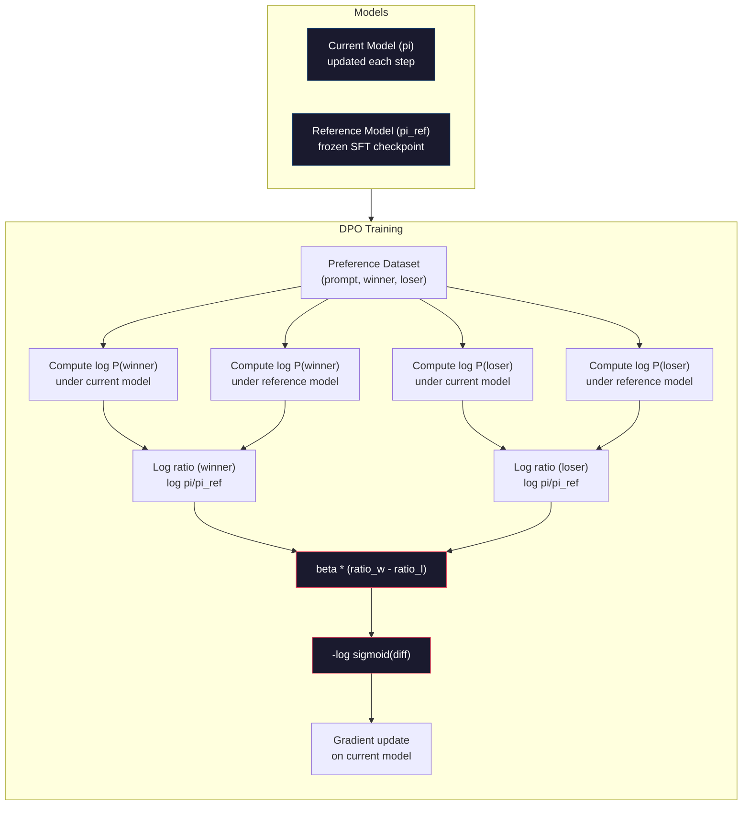

# DPO：直接偏好最佳化

> RLHF 確實有效。但它同時需要訓練三個模型（SFT、獎勵模型（reward model）、策略模型（policy model））、駕馭 PPO 的不穩定性，並仔細調校 KL 懲罰。DPO 問了一個問題：如果可以跳過這一切呢？DPO 直接在偏好配對（preference pair）上最佳化語言模型。不需要獎勵模型，不需要 PPO，只需單一訓練迴圈，達到相同成果。

**Type:** Build
**Languages:** Python (with numpy)
**Prerequisites:** Phase 10, Lesson 07 (RLHF)
**Time:** ~90 minutes

## Learning Objectives｜學習目標

- 實作 DPO 訓練，直接在偏好配對上最佳化語言模型，而無需獨立的獎勵模型
- 推導 DPO 損失函數，並解釋它如何透過策略模型的對數機率隱式表示獎勵模型
- 在訓練穩定性、運算成本與所需模型數量方面比較 DPO 與 RLHF
- 調校 beta 參數以控制訓練後的策略模型偏離參考模型的程度

## The Problem｜問題

你在第 7 課打造了一條 RLHF 管線。三個階段、三個模型：SFT 模型、獎勵模型，以及使用 PPO 進行最佳化的策略模型。光是獎勵模型就需要數千組人類偏好配對與單獨的訓練迴圈。PPO 則需要針對 KL 係數、學習率、截斷比率與 epoch 數進行細緻的調校。

在實務中，PPO 訓練以極度不穩定著稱。超參數的微小變動就會導致訓練發散。獎勵模型只是人類偏好的不完美代理，策略模型總能找到鑽漏洞的方法。KL 懲罰雖然有所幫助，但本身也需要調校——設太低會引發獎勵操弄，設太高模型則幾乎無法學到東西。

這種複雜性正是為何在 InstructGPT 發布後的數年間，大多數開源模型都在 RLHF 面前碰壁的原因。三階段管線太過脆弱，每一階段都有自己的失敗模式，而誤差會層層疊加。

2023 年 5 月，史丹佛大學的 Rafael Rafailov、Archit Sharma 與其團隊發表了《Direct Preference Optimization: Your Language Model is Secretly a Reward Model》。核心洞見在於：你根本不需要獨立的獎勵模型。最佳獎勵函數在數學上完全由語言模型本身的 token 機率所決定。你可以徹底省略獎勵模型，直接在偏好配對上最佳化語言模型。

DPO 將 RLHF 簡化為單一步驟的監督式學習。一個模型、一個損失函數、一個訓練迴圈。沒有強化學習。Zephyr-7B 作為首批在大規模下使用 DPO 的模型之一，在多項基準測試上打平甚至超越了使用完整 RLHF 訓練的模型。Meta 將 DPO 納入 Llama 3 對齊管線的一部分；Anthropic 也在其對齊研究中引用了 DPO 風格的方法。

## The Concept｜核心概念

### 核心洞見

RLHF 最佳化以下目標：

```
maximize: E[R(x, y)] - beta * KL(pi || pi_ref)
```

其中 R 為獎勵模型，pi 為策略模型，pi_ref 為參考模型，beta 為 KL 係數。

DPO 論文證明此目標存在閉式解析解（closed-form optimal solution）。對於任何獎勵函數 R，其最佳策略為：

```
pi*(y | x) = pi_ref(y | x) * exp(R(x, y) / beta) / Z(x)
```

其中 Z(x) 為正規化常數。移項整理後：

```
R(x, y) = beta * log(pi*(y | x) / pi_ref(y | x)) + beta * log Z(x)
```

這就是突破所在。獎勵完全可以用策略模型的機率與參考模型的機率來表達。你不需要訓練獨立的獎勵模型。獎勵已經**隱式存在**於機率比率之中。

將此代入 Bradley-Terry 偏好模型：

```
P(y_w > y_l | x) = sigmoid(R(x, y_w) - R(x, y_l))
                  = sigmoid(beta * (log pi(y_w|x)/pi_ref(y_w|x) - log pi(y_l|x)/pi_ref(y_l|x)))
```

Z(x) 項被消去了，因為兩種回應都以同一個 prompt x 為條件。剩下的式子僅取決於策略模型與參考模型在勝出與落敗回應上的對數機率。

### DPO 損失函數

```
L_DPO = -log(sigmoid(beta * (log pi(y_w|x)/pi_ref(y_w|x) - log pi(y_l|x)/pi_ref(y_l|x))))
```

剖析各個元件：

- **y_w** = 勝出（preferred）回應
- **y_l** = 落敗（rejected）回應
- **x** = prompt
- **pi** = 當前模型（正在訓練）
- **pi_ref** = 參考模型（凍結的 SFT checkpoint）
- **beta** = 控制偏離參考模型程度的溫度參數（通常為 0.1 到 0.5）

比率 `log pi(y|x) / pi_ref(y|x)` 是對數機率比。當此比率為正時，表示當前模型賦予回應 y 的機率高於參考模型。為負時，則表示機率低於參考模型。

DPO 損失促使模型提高勝出回應的對數機率比，並降低落敗回應的對數機率比。beta 參數控制模型偏離參考模型的積極程度——較小的 beta 允許較大偏離，較大的 beta 則讓模型緊貼參考模型。



### 為什麼 DPO 更加簡潔

| 面向 | RLHF（PPO） | DPO |
|--------|-----------|-----|
| 需訓練的模型數 | 3（SFT + 獎勵模型 + 策略模型） | 1（僅策略模型） |
| 訓練迴圈次數 | 3（SFT、獎勵模型訓練、PPO） | 2（SFT、DPO） |
| 超參數 | 學習率、KL 係數、截斷比率、RM 學習率、各階段 epoch 數 | 學習率、beta、epoch 數 |
| 獎勵模型 | 必要（獨立訓練） | 隱式存在於模型機率中 |
| 強化學習演算法 | PPO（複雜且不穩定） | 監督式學習（穩定） |
| GPU 記憶體需求 | PPO 期間記憶體中需有 3 到 4 個模型 | 2 個模型（當前模型 + 參考模型） |
| 訓練穩定性 | 對超參數極度敏感 | 強健穩定，類似一般 SFT |

DPO 在訓練期間只需要在記憶體中保留兩個模型——當前模型與凍結的參考模型。RLHF 則需要三到四個：策略模型、參考模型、獎勵模型，以及可選的價值函數基準線。對於 70B 模型而言，FP16 下每份複本就需要 140GB。省去獎勵模型所帶來的記憶體節省非常顯著。

### DPO 何時優於 RLHF

**小規模資料集。** 在 5,000 到 20,000 組偏好配對下，DPO 通常打平或勝過 RLHF。RLHF 中的獎勵模型需要足夠資料才能具備泛化能力——在有限資料下容易過度擬合並產出不可靠的獎勵訊號。DPO 根本不需要獎勵模型，因此完全避開了這個問題。

**算力受限的情境。** DPO 所需的算力大約只有完整 RLHF 的三分之一（只需一個訓練迴圈而非三個）。對於沒有大型 GPU 叢集的團隊來說，這是最實際的選擇。

**快速迭代。** 想嘗試 10 種不同的偏好資料集以找出最佳模型？DPO 讓你在幾小時內完成每次實驗。RLHF 則需要為每個資料集重新訓練獎勵模型。

### RLHF 何時優於 DPO

**超大規模訓練。** 在 GPT-4 或 Claude 這種規模下，RLHF 獨立的獎勵模型能捕捉更細膩的偏好訊號。獎勵模型扮演著可學習損失函數的角色，能適應複雜的品質標準。

**複雜多目標獎勵訊號。** 當「更好」涉及多個維度（實用性、無害性、真實性）時，獎勵模型可以學習這種多目標權衡。DPO 將每組偏好配對視為二元訊號——一個好，一個差——無法對背後原因進行建模。

**迭代式對齊。** RLHF 管線可以使用當前策略生成新回應，交由人類評分，並在持續迭代的迴圈中重新訓練獎勵模型。DPO 則運作於固定的偏好配對資料集上。Constitutional AI（Anthropic 的方法）大量運用了 RLHF 的這種迭代特性。

### DPO 之後：KTO、ORPO、SimPO

DPO 啟發了一系列簡化對齊方法。

**KTO（Kahneman-Tversky Optimization，2024 年）：** 連配對都不需要。KTO 適用於非成對的回饋——只需將每個回應標記為「好」或「壞」，無需與替代選項進行比較。這大幅簡化了資料收集。與其展示兩個回應並詢問「哪一個更好？」，不如展示一個回應並詢問「這好嗎？」。其損失函數應用了展望理論中的損失趨避（loss aversion）：對壞回應的懲罰重於對好回應的獎勵。

**ORPO（Odds Ratio Preference Optimization，2024 年）：** 將 SFT 與對齊整合至單一訓練步驟中。ORPO 不必先做 SFT 再做 DPO，而是直接修改 SFT 損失以納入偏好訊號。其損失包含兩項：針對勝出回應的標準 next-token prediction 損失，加上一個擴大勝出與落敗回應機率差距的勝算比項。一個訓練迴圈搞定一切。

**SimPO（Simple Preference Optimization，2024 年）：** 徹底移除了參考模型。SimPO 不再計算相對於凍結參考模型的對數機率比，而是直接使用以長度正規化後的回應平均對數機率作為隱式獎勵。這節省了記憶體（不需要參考模型）並簡化了訓練。長度正規化防止了模型盲目偏好較短的回應。

| 方法 | 年份 | 記憶體中的模型數 | 需要配對？ | 需要參考模型？ | 訓練迴圈次數 |
|--------|------|-----------------|-------------|-----------------|----------------|
| RLHF | 2022 | 3-4 | 是（用於獎勵模型） | 是 | 3 |
| DPO | 2023 | 2 | 是 | 是 | 2 |
| KTO | 2024 | 2 | 否（非成對） | 是 | 2 |
| ORPO | 2024 | 1 | 是 | 否 | 1 |
| SimPO | 2024 | 1 | 是 | 否 | 1 |

趨勢一目了然：每種新方法都在消除一層複雜度。RLHF 需要獎勵模型與 PPO，DPO 兩者皆除。KTO 移除了成對資料的需求。ORPO 移除了獨立的 SFT 階段。SimPO 移除了參考模型。「對齊稅（alignment tax）」——從基模型走向對齊模型所需的算力與複雜度成本——持續降低。

### 真實世界部署

**Zephyr-7B（HuggingFace，2023 年 10 月）：** Mistral 7B 基模型，在 UltraChat（20 萬範例）上進行 SFT，隨後在 UltraFeedback（6 萬偏好配對）上執行 DPO。在 MT-Bench 上拿下 6.47 分——為當時 7B 模型的最高分。相比之下，Llama 2 Chat 70B 的得分為 6.86，意味著 Zephyr 僅透過 DPO 對齊就達到了參數量是其 10 倍的模型 94% 以上的實力。

**Llama 3（Meta，2024 年 4 月）：** 在初期 RLHF 階段之後接續使用了 DPO。這種結合表明 DPO 與 RLHF 可以相輔相成——以 RLHF 進行廣泛對齊，以 DPO 進行針對性精煉。

**Neural Magic / nm-chat（2024 年）：** 對多個開源模型套用 DPO，在各對齊基準上一致展現出相較於僅做 SFT 基準模型提升 5% 到 15% 的水準。

```figure
dpo-loss
```

## Build It｜動手實作

### 步驟 1：偏好資料集

與 RLHF 相同的格式——（prompt，勝出，落敗）三元組。DPO 可直接使用這些資料，不需要中介的獎勵模型。

```python
import numpy as np
import sys
import os
sys.path.insert(0, os.path.join(os.path.dirname(__file__), "..", "..", "04-pre-training-mini-gpt", "code"))
from main import MiniGPT, LayerNorm, Embedding, TransformerBlock

PREFERENCE_DATA = [
    {
        "prompt": "What is the capital of France?",
        "preferred": "The capital of France is Paris.",
        "rejected": "France is a country in Europe. It has many cities. The capital is Paris. Paris is known for the Eiffel Tower.",
    },
    {
        "prompt": "Explain gravity in one sentence.",
        "preferred": "Gravity is the force that attracts objects with mass toward each other.",
        "rejected": "Gravity is something that makes things fall down when you drop them.",
    },
    {
        "prompt": "What is 15 times 7?",
        "preferred": "15 times 7 is 105.",
        "rejected": "Let me think about this. 15 times 7. Well, 10 times 7 is 70, and 5 times 7 is 35, so the answer might be around 105.",
    },
    {
        "prompt": "Name three programming languages.",
        "preferred": "Python, Rust, and TypeScript.",
        "rejected": "There are many programming languages. Some popular ones include various languages like Python and others.",
    },
    {
        "prompt": "What year did World War II end?",
        "preferred": "World War II ended in 1945.",
        "rejected": "World War II was a major global conflict. It involved many countries. The war ended in the mid-1940s, specifically in 1945.",
    },
    {
        "prompt": "Define machine learning.",
        "preferred": "Machine learning is a field where algorithms learn patterns from data to make predictions without being explicitly programmed.",
        "rejected": "Machine learning is a type of AI. AI stands for artificial intelligence. Machine learning uses data to learn.",
    },
]
```

### 步驟 2：序列對數機率計算

DPO 損失需要計算給定 prompt 下回應的總對數機率。這意味著在完整的（prompt + 回應）序列上執行模型，並將每個回應 token 的對數機率相加。

```python
def tokenize_sequence(text, vocab_size=256):
    return [min(t, vocab_size - 1) for t in list(text.encode("utf-8"))]


def compute_sequence_log_prob(model, prompt_tokens, response_tokens, max_seq_len=128):
    full_sequence = prompt_tokens + response_tokens
    if len(full_sequence) > max_seq_len:
        full_sequence = full_sequence[:max_seq_len]

    if len(full_sequence) < 2:
        return 0.0

    input_ids = np.array(full_sequence[:-1]).reshape(1, -1)
    target_ids = np.array(full_sequence[1:])

    logits = model.forward(input_ids)
    logits = logits[0]

    max_logits = logits.max(axis=-1, keepdims=True)
    log_probs = logits - max_logits - np.log(
        np.exp(logits - max_logits).sum(axis=-1, keepdims=True)
    )

    prompt_len = len(prompt_tokens)
    response_start = max(0, prompt_len - 1)
    response_end = len(target_ids)

    if response_start >= response_end:
        return 0.0

    response_log_probs = log_probs[response_start:response_end, :]
    response_targets = target_ids[response_start:response_end]

    total_log_prob = 0.0
    for i, target in enumerate(response_targets):
        total_log_prob += response_log_probs[i, target]

    return total_log_prob
```

這個函數是 DPO 的運算核心。對於每組偏好配對，它會執行四次：模型在勝出回應上、模型在落敗回應上、參考模型在勝出回應上、參考模型在落敗回應上。每個訓練範例只需 4 次前向傳遞，對比 RLHF 的生成 + 獎勵評分 + 價值估計 + PPO 更新，更加簡約、快速且穩定。

### 步驟 3：DPO 損失函數

將論文精華轉化為程式碼。一個函數、一個損失值，完全沒有獎勵模型。

```python
def sigmoid(x):
    return np.where(
        x >= 0,
        1.0 / (1.0 + np.exp(-x)),
        np.exp(x) / (1.0 + np.exp(x))
    )


def dpo_loss(policy_logprob_preferred, policy_logprob_rejected,
             ref_logprob_preferred, ref_logprob_rejected, beta=0.1):
    preferred_ratio = policy_logprob_preferred - ref_logprob_preferred
    rejected_ratio = policy_logprob_rejected - ref_logprob_rejected

    logit = beta * (preferred_ratio - rejected_ratio)

    loss = -np.log(sigmoid(logit) + 1e-8)

    preferred_reward = beta * preferred_ratio
    rejected_reward = beta * rejected_ratio

    return loss, {
        "preferred_ratio": float(preferred_ratio),
        "rejected_ratio": float(rejected_ratio),
        "logit": float(logit),
        "implicit_preferred_reward": float(preferred_reward),
        "implicit_rejected_reward": float(rejected_reward),
        "reward_margin": float(preferred_reward - rejected_reward),
    }
```

`preferred_ratio` 與 `rejected_ratio` 是 DPO 推導中的對數機率比。當當前模型相較於參考模型賦予勝出回應更高的機率、賦予落敗回應更低的機率時，logit 為正且損失值很低。訓練訊號正是推動模型往這個方向演進。

`implicit_preferred_reward` 與 `implicit_rejected_reward` 是 DPO 損失隱式賦予的獎勵。你可以將它們提取出來以驗證訓練是否發揮作用——勝出與落敗獎勵之間的分數間隔在訓練過程中應持續擴大。

### 步驟 4：DPO 訓練迴圈

標準的監督式訓練迴圈。沒有 PPO，沒有獎勵模型。只有單純的前向傳遞與梯度更新。

```python
def copy_model_weights(source, target):
    target.embedding.token_embed = source.embedding.token_embed.copy()
    target.embedding.pos_embed = source.embedding.pos_embed.copy()
    target.ln_f.gamma = source.ln_f.gamma.copy()
    target.ln_f.beta = source.ln_f.beta.copy()
    for s_block, t_block in zip(source.blocks, target.blocks):
        t_block.attn.W_q = s_block.attn.W_q.copy()
        t_block.attn.W_k = s_block.attn.W_k.copy()
        t_block.attn.W_v = s_block.attn.W_v.copy()
        t_block.attn.W_out = s_block.attn.W_out.copy()
        t_block.ffn.W1 = s_block.ffn.W1.copy()
        t_block.ffn.W2 = s_block.ffn.W2.copy()
        t_block.ffn.b1 = s_block.ffn.b1.copy()
        t_block.ffn.b2 = s_block.ffn.b2.copy()
        t_block.ln1.gamma = s_block.ln1.gamma.copy()
        t_block.ln1.beta = s_block.ln1.beta.copy()
        t_block.ln2.gamma = s_block.ln2.gamma.copy()
        t_block.ln2.beta = s_block.ln2.beta.copy()


def dpo_train(policy_model, reference_model, preference_data,
              num_epochs=5, lr=5e-6, beta=0.1, max_seq_len=128):
    print(f"DPO Training: {len(preference_data)} pairs, {num_epochs} epochs, "
          f"lr={lr}, beta={beta}")
    print()

    losses = []
    margins = []

    for epoch in range(num_epochs):
        epoch_loss = 0.0
        epoch_margin = 0.0
        num_examples = 0

        indices = np.random.permutation(len(preference_data))

        for idx in indices:
            pair = preference_data[idx]

            prompt_tokens = tokenize_sequence(pair["prompt"])
            preferred_tokens = tokenize_sequence(pair["preferred"])
            rejected_tokens = tokenize_sequence(pair["rejected"])

            pi_logprob_w = compute_sequence_log_prob(
                policy_model, prompt_tokens, preferred_tokens, max_seq_len
            )
            pi_logprob_l = compute_sequence_log_prob(
                policy_model, prompt_tokens, rejected_tokens, max_seq_len
            )
            ref_logprob_w = compute_sequence_log_prob(
                reference_model, prompt_tokens, preferred_tokens, max_seq_len
            )
            ref_logprob_l = compute_sequence_log_prob(
                reference_model, prompt_tokens, rejected_tokens, max_seq_len
            )

            loss, metrics = dpo_loss(
                pi_logprob_w, pi_logprob_l,
                ref_logprob_w, ref_logprob_l, beta
            )

            update_direction = 1.0 if metrics["logit"] < 0 else -0.1
            for block in policy_model.blocks:
                block.ffn.W1 += lr * update_direction * np.random.randn(*block.ffn.W1.shape) * 0.01
                block.ffn.W2 += lr * update_direction * np.random.randn(*block.ffn.W2.shape) * 0.01

            epoch_loss += loss
            epoch_margin += metrics["reward_margin"]
            num_examples += 1
            losses.append(float(loss))
            margins.append(metrics["reward_margin"])

        avg_loss = epoch_loss / max(num_examples, 1)
        avg_margin = epoch_margin / max(num_examples, 1)

        print(f"  Epoch {epoch + 1}/{num_epochs} | Loss: {avg_loss:.4f} | "
              f"Avg Margin: {avg_margin:.4f}")

    return policy_model, losses, margins
```

相較於 RLHF，這個訓練迴圈簡潔許多。針對每組偏好配對：計算四個對數機率（兩個模型、兩種回應），帶入 DPO 損失函數，計算梯度，更新策略。不需要生成步驟，不需要獎勵模型推論，不需要優勢估計，也不需要截斷操作。

### 步驟 5：比較 DPO 與 RLHF

測量隱式獎勵邊界差距與對數機率偏移，將 DPO 與第 7 課的 RLHF 模型進行對比。

```python
def evaluate_preference_accuracy(model, reference_model, preference_data, beta=0.1, max_seq_len=128):
    correct = 0
    total = 0

    for pair in preference_data:
        prompt_tokens = tokenize_sequence(pair["prompt"])
        preferred_tokens = tokenize_sequence(pair["preferred"])
        rejected_tokens = tokenize_sequence(pair["rejected"])

        pi_w = compute_sequence_log_prob(model, prompt_tokens, preferred_tokens, max_seq_len)
        pi_l = compute_sequence_log_prob(model, prompt_tokens, rejected_tokens, max_seq_len)
        ref_w = compute_sequence_log_prob(reference_model, prompt_tokens, preferred_tokens, max_seq_len)
        ref_l = compute_sequence_log_prob(reference_model, prompt_tokens, rejected_tokens, max_seq_len)

        preferred_reward = beta * (pi_w - ref_w)
        rejected_reward = beta * (pi_l - ref_l)

        if preferred_reward > rejected_reward:
            correct += 1
        total += 1

    return correct / max(total, 1)


def analyze_implicit_rewards(model, reference_model, preference_data, beta=0.1, max_seq_len=128):
    print("Implicit Reward Analysis:")
    print("-" * 65)
    print(f"  {'Prompt':<30} {'Pref Reward':>12} {'Rej Reward':>12} {'Margin':>10}")
    print("  " + "-" * 60)

    for pair in preference_data:
        prompt_tokens = tokenize_sequence(pair["prompt"])
        preferred_tokens = tokenize_sequence(pair["preferred"])
        rejected_tokens = tokenize_sequence(pair["rejected"])

        pi_w = compute_sequence_log_prob(model, prompt_tokens, preferred_tokens, max_seq_len)
        pi_l = compute_sequence_log_prob(model, prompt_tokens, rejected_tokens, max_seq_len)
        ref_w = compute_sequence_log_prob(reference_model, prompt_tokens, preferred_tokens, max_seq_len)
        ref_l = compute_sequence_log_prob(reference_model, prompt_tokens, rejected_tokens, max_seq_len)

        pref_reward = beta * (pi_w - ref_w)
        rej_reward = beta * (pi_l - ref_l)
        margin = pref_reward - rej_reward

        truncated = pair["prompt"][:28] + ".." if len(pair["prompt"]) > 30 else pair["prompt"]
        print(f"  {truncated:<30} {pref_reward:>12.4f} {rej_reward:>12.4f} {margin:>10.4f}")

    print()
```

### 步驟 6：Beta 敏感度分析

DPO 的 beta 參數對應於 RLHF 的 KL 係數。它控制了模型能偏離參考模型多遠。本實驗展示其影響。

```python
def beta_sensitivity_analysis(sft_model, preference_data, betas, max_seq_len=128):
    print("Beta Sensitivity Analysis")
    print("-" * 60)
    print(f"  {'Beta':>8} {'Final Loss':>12} {'Final Margin':>14} {'Accuracy':>10}")
    print("  " + "-" * 55)

    results = []

    for beta in betas:
        policy = MiniGPT(
            vocab_size=256, embed_dim=128, num_heads=4,
            num_layers=4, max_seq_len=max_seq_len, ff_dim=512
        )
        reference = MiniGPT(
            vocab_size=256, embed_dim=128, num_heads=4,
            num_layers=4, max_seq_len=max_seq_len, ff_dim=512
        )
        copy_model_weights(sft_model, policy)
        copy_model_weights(sft_model, reference)

        policy, losses, margins_list = dpo_train(
            policy, reference, preference_data,
            num_epochs=3, lr=5e-6, beta=beta, max_seq_len=max_seq_len
        )

        accuracy = evaluate_preference_accuracy(
            policy, reference, preference_data, beta, max_seq_len
        )

        final_loss = losses[-1] if losses else 0
        final_margin = margins_list[-1] if margins_list else 0

        print(f"  {beta:>8.3f} {final_loss:>12.4f} {final_margin:>14.4f} {accuracy:>10.1%}")
        results.append({
            "beta": beta,
            "final_loss": final_loss,
            "final_margin": final_margin,
            "accuracy": accuracy,
        })

        print()

    return results
```

較小的 beta（0.01）允許模型自由偏離參考模型——學習迅速但存在陷入退化解的風險。較大的 beta（1.0）讓模型緊貼參考模型——穩定但學習緩慢。對大多數應用而言，最佳甜蜜點（sweet spot）落在 0.1 到 0.3 之間。

## Use It｜實際應用

### 完整 DPO 管線示範

```python
if __name__ == "__main__":
    np.random.seed(42)

    print("=" * 70)
    print("DPO: DIRECT PREFERENCE OPTIMIZATION")
    print("=" * 70)
    print()

    print("STEP 1: Initialize SFT Model (from Lesson 06)")
    print("-" * 50)
    sft_model = MiniGPT(
        vocab_size=256, embed_dim=128, num_heads=4,
        num_layers=4, max_seq_len=128, ff_dim=512
    )
    print(f"  Parameters: {sft_model.count_parameters():,}")
    print()

    print("STEP 2: DPO Training")
    print("-" * 50)

    policy_model = MiniGPT(
        vocab_size=256, embed_dim=128, num_heads=4,
        num_layers=4, max_seq_len=128, ff_dim=512
    )
    reference_model = MiniGPT(
        vocab_size=256, embed_dim=128, num_heads=4,
        num_layers=4, max_seq_len=128, ff_dim=512
    )
    copy_model_weights(sft_model, policy_model)
    copy_model_weights(sft_model, reference_model)

    policy_model, losses, margins = dpo_train(
        policy_model, reference_model, PREFERENCE_DATA,
        num_epochs=5, lr=5e-6, beta=0.1
    )
    print()

    print("=" * 70)
    print("STEP 3: Evaluate")
    print("=" * 70)
    print()

    pre_accuracy = evaluate_preference_accuracy(
        sft_model, reference_model, PREFERENCE_DATA, beta=0.1
    )
    post_accuracy = evaluate_preference_accuracy(
        policy_model, reference_model, PREFERENCE_DATA, beta=0.1
    )

    print(f"  Preference accuracy (pre-DPO):  {pre_accuracy:.1%}")
    print(f"  Preference accuracy (post-DPO): {post_accuracy:.1%}")
    print()

    analyze_implicit_rewards(policy_model, reference_model, PREFERENCE_DATA, beta=0.1)

    print("=" * 70)
    print("STEP 4: Training Dynamics")
    print("=" * 70)
    print()

    if losses:
        print("  Loss curve:")
        window = max(1, len(losses) // 5)
        for i in range(0, len(losses), window):
            chunk = losses[i:i + window]
            avg = sum(chunk) / len(chunk)
            print(f"    Steps {i:3d}-{i + len(chunk) - 1:3d}: loss = {avg:.4f}")
        print()

    if margins:
        print("  Reward margin curve:")
        window = max(1, len(margins) // 5)
        for i in range(0, len(margins), window):
            chunk = margins[i:i + window]
            avg = sum(chunk) / len(chunk)
            print(f"    Steps {i:3d}-{i + len(chunk) - 1:3d}: margin = {avg:.4f}")
        print()

    print("=" * 70)
    print("STEP 5: Beta Sensitivity")
    print("=" * 70)
    print()

    beta_results = beta_sensitivity_analysis(
        sft_model, PREFERENCE_DATA, betas=[0.01, 0.1, 0.3, 1.0]
    )

    print("=" * 70)
    print("DPO vs RLHF COMPARISON")
    print("=" * 70)
    print()
    print("  DPO advantages:")
    print("    - 1 training loop (vs 3 for RLHF)")
    print("    - 2 models in memory (vs 3-4 for RLHF)")
    print("    - Supervised learning (vs RL, more stable)")
    print("    - No reward model to train or maintain")
    print()
    print("  RLHF advantages:")
    print("    - Separate reward model captures complex preferences")
    print("    - Online learning: generate, rate, retrain")
    print("    - Better for multi-objective alignment")
    print("    - Proven at largest scales (GPT-4, Claude)")
    print()
    print("  Practical guidance:")
    print("    - Start with DPO. It's simpler and often sufficient.")
    print("    - Switch to RLHF if DPO plateaus on your eval metrics.")
    print("    - Many production systems use both: RLHF first, DPO to refine.")
```

## Ship It｜交付成果

本課產出 `outputs/prompt-alignment-method-selector.md`——一個協助你根據應用場景選擇合適對齊方法（SFT、RLHF、DPO、KTO、ORPO、SimPO）的 prompt。輸入你的資料可用性、運算預算與對齊目標，它會推薦最佳方法與訓練計畫。

## Exercises｜練習

1. 實作 KTO（Kahneman-Tversky Optimization）。KTO 不需要配對——只需將每個回應標記為「好」或「壞」。好回應的損失為 `-log(sigmoid(beta * log_ratio))`，壞回應的損失為 `-log(1 - sigmoid(beta * log_ratio))`，並在壞回應損失上加入損失趨避乘數（通常為 1.5 倍）。在相同的資料上訓練（將勝出獨立視為「好」，落敗獨立視為「壞」），並與 DPO 的準確率進行比較。

2. 實作長度正規化的 DPO。與其使用原始對數機率，不如除以回應的 token 數量：`normalized_logprob = total_logprob / num_tokens`。這可以防止模型偏愛較短的回應（較短回應的總對數機率天然較高）。比較在有與沒有長度正規化下的隱式獎勵邊界差距。

3. 打造 ORPO 風格的組合損失。在 DPO 損失中加入勝出回應的標準next-token prediction損失：`L = L_sft(preferred) + alpha * L_dpo`。嘗試 alpha 值 0.1、0.5 與 1.0。此組合損失應產出一個既能遵循指令（來自 SFT 項）又偏好更優回應（來自 DPO 項）的模型，從而省去獨立的 SFT 階段。

4. 實作迭代式 DPO。執行 DPO 訓練 3 個 epoch，接著從訓練好的模型生成新回應，並將它們與原始勝出回應組合成新的偏好配對，然後再次執行 DPO。進行兩輪此種「自我對弈」過程。比較第 1 輪與第 2 輪之後的偏好準確率，觀察迭代式精煉是否有助於提升效能。

5. 比較不同的參考模型對 DPO 的影響。與其使用 SFT checkpoint 作為參考，不如嘗試：(a) 基模型（SFT 之前）、(b) DPO 第 1 個 epoch 的 checkpoint、(c) 策略模型的指數移動平均（EMA）。報告哪種參考模型能產出最高的偏好準確率與最穩定的訓練曲線。

## Key Terms｜關鍵術語

| 術語 | 常見說法 | 實際意義 |
|------|----------------|----------------------|
| DPO | 「沒有強化學習的 RLHF」 | 直接偏好最佳化（Direct Preference Optimization）：一種監督式學習演算法，直接在偏好配對上最佳化語言模型，跳過獎勵模型與 PPO |
| 隱式獎勵（Implicit reward） | 「獎勵藏在模型裡」 | 獎勵函數完全由策略模型與參考模型之間的對數機率比所決定——不需要獨立的獎勵模型 |
| Beta（DPO） | 「溫度參數」 | 控制策略模型能偏離參考模型多遠——較小的 beta 允許較大偏離，較大的 beta 讓模型緊貼參考模型 |
| 對數機率比（Log-probability ratio） | 「模型改變了多少」 | log pi(y\|x) - log pi_ref(y\|x)——正值代表當前模型賦予的機率高於參考模型 |
| 參考模型（Reference model） | 「凍結的 checkpoint」 | 權重永不改變的 SFT 模型複本——作為計算機率比率的固定錨點 |
| KTO | 「沒有配對的 DPO」 | Kahneman-Tversky Optimization：適用於非成對的「好」或「壞」標籤，無需偏好配對 |
| ORPO | 「一步到位對齊」 | Odds Ratio Preference Optimization：透過在 SFT 損失中加入偏好項，將 SFT 與對齊合併為單一訓練迴圈 |
| SimPO | 「不需要參考模型」 | Simple Preference Optimization：使用長度正規化的平均對數機率作為隱式獎勵，徹底移除了參考模型 |
| 對齊稅（Alignment tax） | 「讓模型安全的成本」 | 從基模型走向對齊模型所需的額外運算、資料與複雜度開銷——DPO 大幅降低了這項成本 |

## Further Reading｜延伸閱讀

- [Rafailov et al., 2023 -- "Direct Preference Optimization: Your Language Model is Secretly a Reward Model"](https://arxiv.org/abs/2305.18290) ——將對齊從 RLHF 簡化為監督式學習的 DPO 開創性論文
- [Tunstall et al., 2023 -- "Zephyr: Direct Distillation of LM Alignment"](https://arxiv.org/abs/2310.16944) ——Zephyr-7B 論文，證明在 UltraFeedback 上使用 DPO 能在多項基準上匹敵 RLHF
- [Ethayarajh et al., 2024 -- "KTO: Model Alignment as Prospect Theoretic Optimization"](https://arxiv.org/abs/2402.01306) ——消除成對偏好需求的創新對齊演算法
- [Hong et al., 2024 -- "ORPO: Monolithic Preference Optimization without Reference Model"](https://arxiv.org/abs/2403.07691) ——將 SFT 與對齊一步完成的簡化架構
- [Meng et al., 2024 -- "SimPO: Simple Preference Optimization with a Reference-Free Reward"](https://arxiv.org/abs/2405.14734) ——徹底移除參考模型的偏好最佳化方法
- [Llama 3 Technical Report](https://arxiv.org/abs/2407.21783) ——Meta 結合 RLHF 與 DPO 的實際對齊管線
