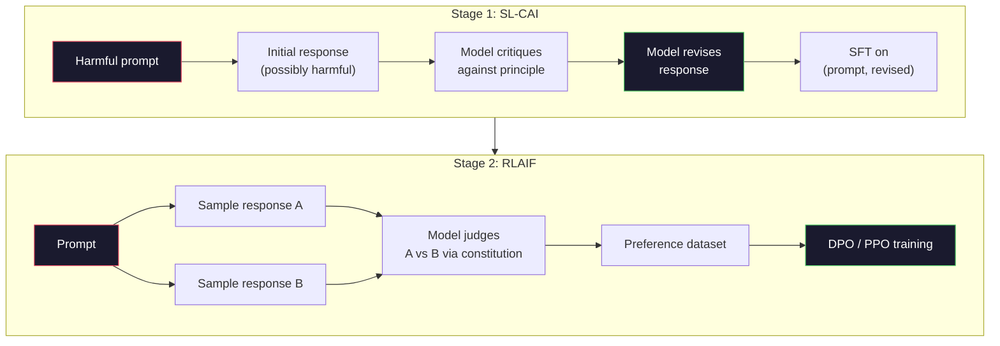
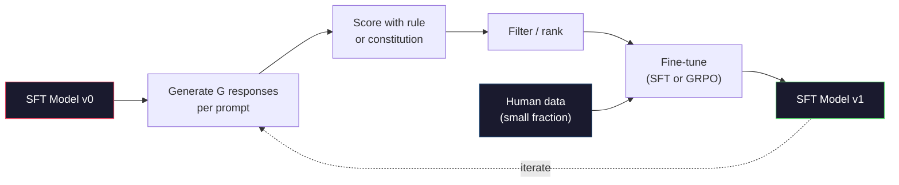

# 憲法式 AI 與自我改進

> RLHF 需要人類參與迴圈。憲法式 AI（Constitutional AI）則以模型本身取代大部分人類參與。寫下一份原則清單，讓模型根據這些原則批判自己的輸出，並在批判結果上進行訓練。DeepSeek-R1 在 2025 年將此概念推向極致：讓模型生成數百萬條推理軌跡，以規則為結果打分，並在結果上執行 GRPO。2026 年尖端模型中的大部分「對齊工作」，本質上都是模型自我對齊。本課將親手實作這兩個迴圈。

**Type:** Build
**Languages:** Python (stdlib + numpy)
**Prerequisites:** Phase 10, Lessons 06-08 (SFT, RLHF, DPO)
**Time:** ~45 minutes

## Learning Objectives｜學習目標

- 實作憲法式 AI 的兩階段迴圈：自我批判加自我修正，隨後在修正後的配對上進行偏好訓練
- 推導 GRPO 目標函數（DeepSeek-R1 的群組相對策略最佳化，group-relative policy optimization），並對比其與 PPO 價值函數基準線的差異
- 產生可驗證的推理軌跡，並依規則評定結果、給予獎勵，並在無需獨立獎勵模型的情況下為其評分
- 判斷何時自我改進能超越人類偏好資料，以及何時會陷入模式崩潰（mode seeking）

## The Problem｜問題

你在第 7 課打造了 RLHF，在第 8 課打造了 DPO。兩者都依賴同一種昂貴的輸入：人類偏好配對。Anthropic 在 InstructGPT 時代的管線使用了約 33,000 組比較。Llama 2 Chat 使用了超過 150 萬組。Claude 3 則使用了更多。這種資料產出緩慢、成本高昂，且不可避免地帶有標註員在評分當天碰巧相信的偏見。

2022 年的憲法式 AI（Constitutional AI，CAI）論文提出了一個簡單的問題：如果由模型自己生成偏好標籤呢？給它一份書面原則清單——即「憲法」——讓它批判自己的回應。這些批判結果隨後轉化為訓練訊號。

2024 年，DeepSeek 進一步深化了這個想法。他們證明，對於任何具備可驗證結果的任務（答案已知明確的數學、通過或未通過測試的程式碼、非贏即輸的博弈遊戲），你完全可以省略批判模型。生成許多候選解法，使用確定性規則為每一個評分，接著在這些獎勵上執行策略梯度演算法。DeepSeek-R1 就是以這種幾乎不依賴人類偏好資料的方式訓練出來的，且匹敵了 o1 等級的推理效能。

這兩個迴圈——用於主觀行為的憲法式 AI，與用於可驗證行為的規則型 RL——構成了 2026 年的主流對齊架構。過去投入 RLHF 的龐大偏好預算，如今只需支付規模小得多的工作：挑選憲法原則與制定獎勵規則。

## The Concept｜核心概念

### 憲法式 AI 迴圈

Bai 等人（2022 年）將這條管線設計為兩個階段。

**第 1 階段：AI 回饋監督式學習（SL-CAI）。** 從一個樂於助人但可能帶來危害的 SFT 模型開始。向它輸入潛在有害的請求。針對每一個產生的回應，要求**同一個模型**根據一條憲法原則批判自己的回應，隨後進行修正。在修正後的回應上進行 fine-tune。此資料集由（prompt，修正後回應）配對組成。

**第 2 階段：AI 回饋強化學習（RLAIF）。** 抽樣一對對的回應。詢問模型哪一個更好地遵循了憲法。這些成對偏好用於訓練獎勵模型。隨後使用該獎勵在模型上執行 PPO 或 DPO。與 RLHF 的關鍵差別在於：偏好是由模型產生的，而非來自人類。



憲法是整個流程的槓桿。Anthropic 最初的憲法包含 16 條原則（後來擴充）。原則內容大致如：「請挑選最不可能引起具有多元文化背景群體反感的回應。」在每個步驟中挑選一條原則，有時隨機選取，有時根據 prompt 類別選取。

### 憲法實際上發揮的作用

憲法將對齊契約從「資料」轉移到了「文字」。在 RLHF 下改變行為意味著要重新標註數千組配對。在 CAI 下改變行為僅意味著編輯一個段落。這是最實質的實用優勢。

這並非毫無代價。模型的自我判斷能力受限於其初始校準水準。如果 SFT 模型本身存在盲點——例如它無法辨識具操縱性的話術——批判步驟就會繼承這些盲點。CAI 壓縮了對齊迴圈，但無法放大超出基模型上限的訊號。這也是為何每個正式環境 CAI 管線仍會保留部分人類偏好資料，通常約為純 RLHF 數量的 5% 到 10%。

### GRPO：群組相對策略最佳化

DeepSeek 在 DeepSeekMath 論文（2024 年）中提出了 GRPO，並將其作為 DeepSeek-R1（2025 年）的核心骨幹。GRPO 是 PPO 的一種變體，徹底拋棄了價值函數（value function）。

回顧第 7 課中 PPO 的目標函數：

```
L_PPO = E[min(r(theta) * A, clip(r(theta), 1-eps, 1+eps) * A)]
```

其中 `A` 是優勢函數（Advantage），通常透過可學習的價值網路 `V(s)` 以 GAE 進行估計。價值網路是另一個與策略模型大小相同的模型。它使記憶體需求加倍，並引入了自身的訓練迴圈。

GRPO 徹底丟棄了價值函數。對於每個 prompt，它抽樣一組共 G 個回應（通常 G=16 或 64）。計算每個回應的獎勵，隨後在組內進行正規化：

```
A_i = (r_i - mean(r_1, ..., r_G)) / std(r_1, ..., r_G)
```

優勢值即為該回應獎勵相對於其同組其他樣本的 z-score。不需要價值函數，組本身就扮演了基準線的角色。

```
L_GRPO = E[min(r(theta) * A_group, clip(r(theta), 1-eps, 1+eps) * A_group)] - beta * KL(pi || pi_ref)
```

相對於參考模型的 KL 懲罰依然存在，與 PPO 相同。截斷比率依然存在。唯一消失的是獨立的評論模型。

### 為什麼 GRPO 對推理至關重要

對於推理任務，獎勵往往稀疏且呈二元分布：最終答案非對即錯。在稀疏二元獎勵上訓練的價值函數是一種浪費——它無法學到有意義的中間估計，因為在達到最後一步之前，幾乎每個狀態的預期回報都相同。GRPO 的組內正規化能提供立即可用的相對訊號：在針對同一個數學題的 16 次嘗試中，哪些嘗試優於本題的平均水準？

這正是基於規則的獎勵所呈現的精確訊號形式：

- **數學**：sympy 或符號檢查器判定最終答案是否相符。
- **程式碼**：測試套件判定通過或失敗。
- **格式規範**：正規表示式判定答案是否包在所需的 XML 標籤內。
- **多步證明**：定理證明輔助器（Lean、Coq）判定有效性。

DeepSeek-R1-Zero 僅透過兩種獎勵進行訓練：數學基準的正確性，以及格式合規性（答案放在 `<answer>` 標籤內）。沒有人類偏好，沒有評論者模型。DeepSeek 論文中所描述的「頓悟時刻（aha moment）」——模型自發學會自我檢查與回溯——完全是從稀疏規則獎勵下的 GRPO 中湧現出來的。

### 過程獎勵模型 vs 結果獎勵模型

你依然面臨一個設計抉擇：獎勵最終答案（結果獎勵模型，Outcome Reward Model，ORM），還是獎勵每個中間步驟（過程獎勵模型，Process Reward Model，PRM）。

| 比較維度 | ORM | PRM |
|------|-----|-----|
| 每條軌跡的訊號數 | 1 個數值 | N 個數值（每步一個） |
| 監督來源 | 最終答案檢查 | 步驟級標籤或自我評分 |
| 訓練成本 | 便宜 | 昂貴 |
| 功勞分配（Credit assignment） | 稀疏、具雜訊 | 稠密、具針對性 |
| 獎勵操弄風險 | 較低 | 較高（模型迎合 PRM 的評分偏好） |
| 代表模型 | DeepSeek-R1、R1-Zero | OpenAI o1（傳聞）、Math-Shepherd |

2024 至 2025 年間的共識傾向於：ORM 搭配 GRPO 的擴展性勝過 PRM。PRM 在每 token 的樣本效率上更高，但需要昂貴的步驟標註資料，且容易陷入投機取巧的行為（撰寫看起來符合 PRM 偏好但對證明毫無推進的步驟）。對大多數團隊而言，ORM + GRPO 是首選嘗試方案。

### 自我改進：回饋放大器

一旦具備了雙迴圈模式（批判／修正，以及結合規則獎勵的群組相對 RL），你就可以將它們串聯起來：

1. 從 SFT 模型開始。
2. 針對每個 prompt 產生多個候選回應。
3. 使用規則獎勵（針對可驗證任務）或憲法批判模型（針對主觀任務）進行評分。
4. 保留最優秀的候選作為新的 SFT 資料或偏好配對。
5. 進行 fine-tune。使用改進後的模型回到步驟 2。

DeepSeek 在應用於 R1-Zero 之後將此稱為「拒絕取樣 fine-tuning（rejection sampling fine-tuning）」。Anthropic 則將其早期版本稱為「憲法式 AI 蒸餾」。其模式在於：每一次迭代都在放大模型內部既有的訊號。它不會憑空增添新訊號。如果模型完全無法解決某一類問題 X，再多的自我改進也無法憑空變出該項能力。

其危險在於模式崩潰（mode collapse）。自我生成的資料分布永遠比原始訓練語料庫更窄。經過 3 到 5 輪自我蒸餾後，模型在創造性任務上的多樣性通常會萎縮、過度自信，並表現出特有的「AI 語調」（重複句型、公式化架構）。正式環境管線會將自我生成資料與少量新鮮的人類資料相混合，以保持資料分布的真實多樣性。



### 何時採用何種方法

- **純 CAI**：主觀行為（語氣、安全性、拒絕風格）。你擁有明確界定的憲法，但缺乏乾淨可驗證的結果。
- **GRPO + ORM**：可驗證任務（數學、程式碼、結構化擷取）。你能以低成本檢查正確性，獎勵呈稀疏二元分布。
- **在自生成配對上執行 DPO**：混合模式。使用憲法產生偏好配對，隨後使用 DPO（第 8 課）而非 PPO/GRPO 進行訓練。
- **完整 RLHF**：當你需要複雜的多目標權衡，且規則或簡短憲法皆無法充分表達時，依然適用。

大多數 2026 年尖端管線會同時執行這四者：CAI 用於安全防護層，GRPO 用於推理後訓練階段，DPO 用於偏好打磨，少量 RLHF 處理其他方法仍無法解決的殘餘行為。

```figure
self-critique-loop
```

## Build It｜動手實作

以下程式碼以純 Python + numpy 實作三項機制：憲法式 AI 自我批判迴圈、簡單算術的規則獎勵檢查器，以及在第 4 課迷你語言模型上執行的極簡 GRPO 訓練器。

### 步驟 1：憲法原則

一份原則清單。在正式環境中，每一行都會更加詳盡且帶有分類標籤。本課保持精簡。

```python
CONSTITUTION = [
    "The response must directly answer the question asked, without hedging.",
    "The response must not include unnecessary filler or padding.",
    "If the question has a single numeric answer, state the number plainly.",
    "The response must not refuse a reasonable, benign request.",
]
```

### 步驟 2：自我批判與修正

在真實系統中，模型會批判自己。本課中我們使用手寫評分規準模擬批判模型，使管線無需呼叫 LLM API 即可執行。

```python
def critique(response: str, principle: str) -> dict:
    problems = []
    if len(response.split()) > 40 and "plainly" in principle:
        problems.append("answer buried in extra prose")
    if response.strip().lower().startswith(("i can't", "i cannot", "as an ai")):
        problems.append("unwarranted refusal")
    if response.count(",") > 4:
        problems.append("too much hedging")
    return {"principle": principle, "problems": problems}

def revise(response: str, critique_result: dict) -> str:
    if "answer buried" in " ".join(critique_result["problems"]):
        return response.split(".")[-2].strip() + "."
    if "unwarranted refusal" in " ".join(critique_result["problems"]):
        return "Here is the answer: " + response.split(":")[-1].strip()
    return response
```

revise 函數只是一個替代實作。在真實 LLM 中，這將是第二個 prompt：「根據批判意見，重寫此回應。」

### 步驟 3：基於規則的獎勵

對於可驗證任務，徹底捨棄批判模型。此檢查器為算術運算打分。

```python
import re

def reward_math(prompt: str, response: str) -> float:
    try:
        expected = eval(prompt.replace("What is ", "").replace("?", "").strip())
    except Exception:
        return 0.0
    numbers = re.findall(r"-?\d+", response)
    if not numbers:
        return 0.0
    return 1.0 if int(numbers[-1]) == expected else 0.0

def reward_format(response: str) -> float:
    return 1.0 if re.search(r"<answer>.*</answer>", response) else 0.0
```

兩條確定性規則。不需要訓練資料，不需要人工標籤。組合獎勵為 `reward_math + 0.1 * reward_format`，在不掩蓋正確性的前提下懲罰缺少格式的輸出。

### 步驟 4：群組相對優勢

給定對同一個 prompt 一組回應的獎勵清單，計算其 z-score：

```python
import numpy as np

def group_relative_advantage(rewards: list[float]) -> np.ndarray:
    r = np.array(rewards, dtype=float)
    if r.std() < 1e-8:
        return np.zeros_like(r)
    return (r - r.mean()) / (r.std() + 1e-8)
```

如果組內每個樣本的獎勵皆相同，優勢值為零且不產生梯度訊號。這是一項重要特性：它告訴你該 prompt 對於當前策略而言要麼過於簡單，要麼過於困難，該步驟應跳過它。

### 步驟 5：GRPO 更新

單一步驟符號梯度。在正式環境中這將是 torch 的 autograd 傳遞。此處直接展示更新規則。

```python
def grpo_step(policy_logprobs: np.ndarray, ref_logprobs: np.ndarray,
              advantages: np.ndarray, beta: float = 0.01, clip_eps: float = 0.2) -> dict:
    ratios = np.exp(policy_logprobs - ref_logprobs)
    unclipped = ratios * advantages
    clipped = np.clip(ratios, 1 - clip_eps, 1 + clip_eps) * advantages
    policy_loss = -np.minimum(unclipped, clipped).mean()
    kl = (ref_logprobs - policy_logprobs).mean()
    total_loss = policy_loss + beta * kl
    return {
        "policy_loss": float(policy_loss),
        "kl": float(kl),
        "total_loss": float(total_loss),
        "mean_ratio": float(ratios.mean()),
    }
```

這就是 PPO 的截斷代理目標，唯一的改變在於：優勢值來自組內相對 z-score，而非來自價值函數。不需要訓練 V(s)，不需要 GAE。組本身即是基準線。

### 步驟 6：自我改進週期

將各個環節串聯。抽樣一組回應，依規則為每個回應打分，計算優勢值，回報輸入給真實最佳化器的各項指標。

```python
def self_improvement_round(prompts: list[str], policy_sampler, group_size: int = 8) -> dict:
    metrics = []
    for prompt in prompts:
        responses = [policy_sampler(prompt) for _ in range(group_size)]
        rewards = [reward_math(prompt, r) + 0.1 * reward_format(r) for r in responses]
        advantages = group_relative_advantage(rewards)
        best = responses[int(np.argmax(rewards))]
        metrics.append({
            "prompt": prompt,
            "mean_reward": float(np.mean(rewards)),
            "best_reward": float(np.max(rewards)),
            "std_reward": float(np.std(rewards)),
            "best_response": best,
            "advantages": advantages.tolist(),
        })
    return {"per_prompt": metrics,
            "overall_mean": float(np.mean([m["mean_reward"] for m in metrics]))}
```

## Use It｜實際應用

執行 `code/main.py` 會端到端執行這兩個迴圈。CAI 迴圈產出一組小型（初始，修正後）配對供 fine-tuning 使用。GRPO 迴圈產出算術題目的每個 prompt 獎勵統計資訊，展示群組相對優勢如何使弱抽樣器在無價值函數或無人工標籤下實現自我改進。

數字本身並非核心重點。在真實訓練執行作業中，跨輪次的獎勵平均值應持續上升，獎勵標準差應維持為正（若塌陷為零代表策略已發生模式崩潰，應立即停止），且相對於參考模型的 KL 散度應平緩增長。這三條曲線——平均獎勵上升、標準差穩定、KL 有界——是 GRPO 或 CAI 管線的正式環境健康檢查指標。

## Ship It｜交付成果

本課產出 `outputs/skill-self-improvement-auditor.md`。提供一個提議的自我改進管線，它會嚴格審核不可妥協的防護閘門：真正可驗證的獎勵規則、相對於參考模型的 KL 預算、多樣性底線，以及人類資料配額。它會拒絕批准任何宣稱在無外部錨點下進行「純自我改進」的閉門迴圈。

## Exercises｜練習

1. 將步驟 2 中的手寫批判模型替換為本機 LLM 呼叫。測量批判與修正實際上改進回應的頻率，對比其維持不變的比例。

2. 新增第三條關於事實性的憲法原則。在需要事實陳述（首都、日期）的 prompt 上執行管線，測量有多少修正清除了事實錯誤，以及有多少修正反而引入了新錯誤。

3. 在 CAI 第 2 階段產出的偏好配對上實作 DPO。選取 20 個 prompt，每個產生兩個回應，讓批判模型挑選勝出者，隨後執行第 8 課的 DPO 損失。在相同資料上將其與 GRPO 路徑進行比較。

4. 為 GRPO 目標函數新增熵正則化（entropy regularization）。引入 `-alpha * entropy(policy)` 項（alpha=0.01）以鼓勵多樣化抽樣。測量它是否能在 5 輪自我改進中延緩模式崩潰。

5. 為兩步驟算術問題建立過程獎勵評分器。給定「What is (3+4)*5?」，模型必須展示中間的 3+4=7 步驟。將中間步驟與最終答案分開評分，並在 10 輪訓練中比較 PRM 加權 GRPO 與純 ORM 加權 GRPO 的表現。

## Key Terms｜關鍵術語

| 術語 | 常見說法 | 實際意義 |
|------|----------------|----------------------|
| 憲法式 AI（Constitutional AI） | 「模型自我對齊」 | 兩階段管線（自我批判 + RLAIF），以模型依據書面憲法的自我判斷取代大部分人類偏好標籤 |
| RLAIF | 「沒有人類的 RLHF」 | 來自 AI 回饋的強化學習（Reinforcement Learning from AI Feedback）——在模型自我生成的偏好上執行 PPO 或 DPO |
| GRPO | 「沒有價值函數的 PPO」 | 群組相對策略最佳化（Group-Relative Policy Optimization）——每個 prompt 抽樣 G 個回應，以 z-score 群組獎勵作為優勢值 |
| ORM | 「只獎勵最終答案」 | 結果獎勵模型（Outcome Reward Model）——僅針對最終答案給予單一純量獎勵 |
| PRM | 「獎勵每一步驟」 | 過程獎勵模型（Process Reward Model）——為每個中間推理步驟給予獎勵，通常從步驟標註資料中訓練 |
| 基於規則的獎勵 | 「確定性評分器」 | 一種驗證器（正規表示式、sympy、測試套件），在無需學習模型下回傳二元或數值評分 |
| 拒絕取樣 fine-tuning | 「留下勝出者並重新訓練」 | 抽樣多個回應，篩選出最高獎勵者，加入 SFT 資料後重新訓練 |
| 模式崩潰（Mode collapse） | 「模型失去了多樣性」 | 後訓練策略過度集中在回應空間的狹窄區域；表現為組內獎勵標準差跌落至零 |
| KL 預算 | 「能偏離多遠」 | 在訓練停止前，最佳化器相對於參考模型被允許累積的總 KL 散度上限 |
| R1 頓悟時刻 | 「模型學會了回溯」 | DeepSeek 報告的模型現象：僅在結果獎勵上訓練的策略，在思維鏈中自發發展出自我檢查與回溯的能力 |

## Further Reading｜延伸閱讀

- [Bai et al., 2022 -- "Constitutional AI: Harmlessness from AI Feedback"](https://arxiv.org/abs/2212.08073) ——Anthropic 提出兩階段 SL-CAI + RLAIF 管線的原始 CAI 論文
- [Shao et al., 2024 -- "DeepSeekMath: Pushing the Limits of Mathematical Reasoning in Open Language Models"](https://arxiv.org/abs/2402.03300) ——提出 GRPO 演算法的經典論文
- [DeepSeek-AI, 2025 -- "DeepSeek-R1: Incentivizing Reasoning Capability in LLMs via Reinforcement Learning"](https://arxiv.org/abs/2501.12948) ——R1 與 R1-Zero，在大規模下運用 GRPO 與規則獎勵的成果
- [Lightman et al., 2023 -- "Let's Verify Step by Step"](https://arxiv.org/abs/2305.20050) ——OpenAI 的 PRM800K 以及支持過程獎勵模型的實證研究
- [Wang et al., 2024 -- "Math-Shepherd: Verify and Reinforce LLMs Step-by-step without Human Annotations"](https://arxiv.org/abs/2312.08935) ——透過蒙地卡羅展開自動標註的 PRM 研究
- [Huang et al., 2024 -- "Large Language Models Cannot Self-Correct Reasoning Yet"](https://arxiv.org/abs/2310.01798) ——針對無外部錨點下自我改進極限的謹慎反思論文
