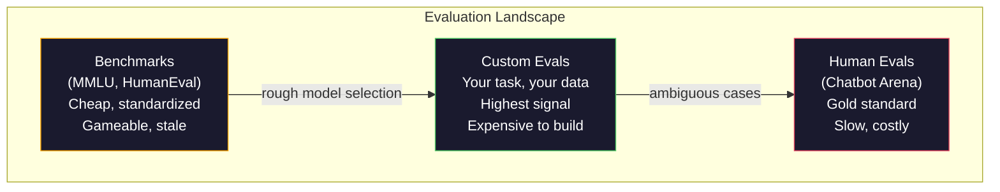
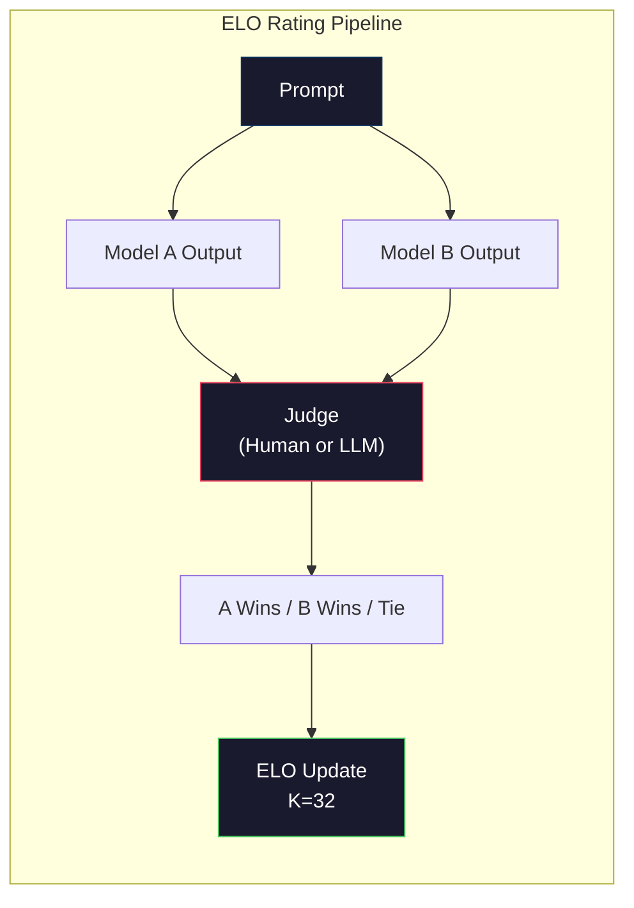

# 評估：基準測試、Eval 與 LM Harness

> 古德哈特定律（Goodhart's Law）：當一項指標變成目標時，它就不再是一項好指標。所有頂尖實驗室都在鑽基準測試的漏洞。MMLU 分數一路狂飆，但模型依然無法可靠地數出「strawberry」裡有幾個 R。唯一重要的評估是你自己的 eval——在你的任務上，用你的資料進行。

**Type:** Build
**Languages:** Python
**Prerequisites:** Phase 10, Lessons 01-05 (LLMs from Scratch)
**Time:** ~90 minutes

## Learning Objectives｜學習目標

- 建構自訂評估框架（eval harness），針對語言模型執行選擇題與開放式基準測試
- 解釋為何標準基準測試（MMLU、HumanEval）會迅速飽和且無法區分頂尖模型
- 實作具備適當指標的任務專用 eval：完全相符（exact match）、F1、BLEU 以及 LLM 作為裁判（LLM-as-judge）評分
- 設計針對特定應用場景的自訂評估套件，而非僅依賴公開排行榜

## The Problem｜問題

MMLU 於 2020 年發布，包含涵蓋 57 個學科的 15,908 道題目。短短三年內，頂尖模型就將其刷至飽和。GPT-4 獲得 86.4%，Claude 3 Opus 獲得 86.8%，Llama 3 405B 獲得 88.6%。排行榜被壓縮在 3 個百分點的極小區間內，這點差距在統計上純屬雜訊，而非真正的能力代差。

與此同時，這些模型卻在 10 歲小孩不假思索就能解決的任務上栽跟頭。在 MMLU 上拿下 88.7% 的 Claude 3.5 Sonnet，最初連「strawberry」裡有幾個字母都數不清楚——這項任務完全不需要任何世界知識或邏輯推理，只需要單純的字元層級迭代。測試程式碼生成能力的 HumanEval 包含 164 道題目，模型在上面能拿下 90% 以上的分數，卻依然會寫出在任何初階工程師都能抓出的邊界條件下直接崩潰的程式碼。

基準測試表現與真實世界可靠性之間的斷層，是 LLM 評估的核心難題。基準測試只告訴你模型在該基準測試上的表現如何。它幾乎無法預測該模型在你的具體任務、你的具體資料，以及你的特定失敗模式下的真實表現。如果你在打造客服機器人，MMLU 毫無關聯。如果你在打造程式碼助理，HumanEval 僅涵蓋函數層級的生成——對跨檔案的除錯、重構或程式碼解釋隻字未提。

你需要自訂 eval。這不是因為基準測試毫無價值——它們在初步模型篩選時很有幫助——而是因為最終評估必須與你的上線服務條件完全相符。

## The Concept｜核心概念

### 評估的全景圖

評估主要分為三大類別，各自具備不同的成本與訊號品質。

**基準測試（Benchmarks）** 是標準化的測試套件。例如 MMLU、HumanEval、SWE-bench、MATH、ARC、HellaSwag。你對模型執行基準測試並獲得分數。優點：每個人都使用相同的考卷，因此可以客觀橫向比較模型。缺點：模型與訓練資料對這些基準測試的污染日益嚴重。實驗室在包含測試題目的資料上進行訓練，分數上升了，能力卻未必提升。

**自訂評估（Custom evals）** 是針對你的具體應用場景建構的測試套件。你自行定義輸入、預期輸出與評分函數。法律文件摘要模型就在法律文件上評估；SQL 生成器就在你的資料庫綱要上評估。建構這些套件成本高昂，但它們是唯一能準確預測正式環境表現的評估方式。

**人工評估（Human evals）** 聘請付費標註員，根據實用性、正確性、流暢度與安全性等標準對模型輸出進行評分。對於自動化評分無效的開放式任務而言，這是黃金標準。Chatbot Arena 已經收集了跨 100 多個模型的超過 200 萬張人類偏好選票。缺點在於成本（每次評判 $0.10-$2.00）與速度（需數小時至數天）。



### 基準測試為何失效

有三大機制導致基準測試分數無法反映真實能力。

**資料污染（Data contamination）。** 訓練語料庫收錄了從網路爬取的內容，而基準測試題目就放在網路上。模型在訓練期間就看過了答案。這在傳統意義上並非作弊——實驗室並非蓄意塞入測試題目，但網路規模的巨量爬蟲使得徹底排除變得幾近不可能。

**針對考試特化訓練（Teaching to the test）。** 實驗室針對基準測試表現來最佳化訓練混合配比。如果訓練配比中有 5% 是 MMLU 風格的選擇題，模型就會學會其格式與答案分布。MMLU 是四選一選擇題，模型學到了答案在 A/B/C/D 之間大致均勻分布，這即便在模型不知道答案時也能提供猜題優勢。

**飽和（Saturation）。** 當每個頂尖模型在基準測試上都拿下 85% 到 90% 時，該基準測試便失去了鑑別度。剩下的 10% 到 15% 題目往往語意模糊、標籤有誤，或是需要冷僻的領域知識。在 MMLU 上從 87% 提升至 89%，可能僅意味著模型多背下了兩道冷僻怪題，而不是整體智力提升。

### 困惑度：快速健康檢查

困惑度（Perplexity，PPL）衡量模型對一段 token 序列感到多麼意外。形式上，它是平均負對數概似的指數：

```
PPL = exp(-1/N * sum(log P(token_i | context)))
```

困惑度為 10 意味著模型在每個 token 位置上的不確定程度，平均而言相當於在 10 個選項中均勻隨機猜測。數值越低越好。GPT-2 在 WikiText-103 上的困惑度約為 30，GPT-3 約為 20，Llama 3 8B 則約為 7。

困惑度適合用來在相同測試集上比較模型，但它存在盲點。模型可能擅長預測常見規律因而擁有極低困惑度，但在罕見卻關鍵的規律上表現一塌糊塗。它也完全無法反映遵循指令、邏輯推理或事實正確性。請將其作為合理性檢查（sanity check），而非最終定論。

### LLM 作為裁判（LLM-as-Judge）

使用強大的模型來評估較弱模型的輸出。概念很直觀：要求 GPT-4o 或 Claude Sonnet 依照 1 到 5 分的量表為回應的正確性、實用性與安全性打分。使用 GPT-4o-mini 時每次評判成本僅約 0.01 美元，且在大多數任務上與人類評判的高度吻合——達到約 80% 的一致性。

評分 prompt 的設計比模型本身更為重要。模糊的 prompt（「請為這段回應打分」）會產出充斥雜訊的分數。帶有評分標準表（rubric）的結構化 prompt（「若答案事實正確且引用了來源給 5 分，若正確但未附來源給 4 分，若部分正確給 3 分……」）則能產出一致且具可重現性的分數。

失敗模式：裁判模型表現出位置偏見（成對比較時偏好第一個選項）、冗長偏見（偏好較長的回應），以及自我偏好（GPT-4 為 GPT-4 輸出的打分高於品質相當的 Claude 輸出）。緩解措施：打亂順序隨機化、按長度正規化，以及使用與被評估模型不同的外部裁判。

### 來自成對比較的 ELO 評分

Chatbot Arena 採用的方法。向人類（或 LLM 裁判）展示不同模型對同一個 prompt 的兩個回應，挑選出較好的一個。從數千次此類比較中，為每個模型計算出 ELO 評分——與西洋棋完全相同的評分體系。

ELO 的優點：相對排名比絕對打分更為可靠、能優雅處理平手局，且收斂所需的比較次數遠少於獨立評分每個輸出。截至 2026 年初，Chatbot Arena 的頂尖榜單顯示 GPT-4o、Claude 3.5 Sonnet 與 Gemini 1.5 Pro 在最高處彼此差距在 20 個 ELO 分之內。



### 評估框架

**lm-evaluation-harness**（EleutherAI）：標準開源評估框架。支援 200 多個基準測試。只需一行指令即可在 MMLU、HellaSwag、ARC 等基準上評估任何 Hugging Face 模型。為 Open LLM Leaderboard 所採用。

**RAGAS**：專門針對 RAG 管線設計的評估框架。測量忠實度（faithfulness，答案是否忠於檢索到的脈絡？）、相關性（relevance，檢索到的脈絡是否切題？），以及答案正確性。

**promptfoo**：由設定檔驅動的 prompt 工程評估工具。在 YAML 中定義測試案例，對多個模型執行，並獲得通過／失敗報告。非常適合用於 prompt 的回歸測試（regression testing）——確保調整 prompt 不會破壞既有測試案例。

### 建構自訂 Eval

唯一對正式環境至關重要的評估流程：

1. **定義任務。** 模型究竟該做什麼？請保持精確。「回答問題」太過模糊；「給定一封客戶抱怨郵件，擷取產品名稱、問題類別與情緒傾向」才是一個可以評估的具體任務。

2. **建立測試案例。** 原型 eval 至少需要 50 個案例，正式環境需要 200 個以上。每個案例都是（輸入，預期輸出）配對。務必包含邊界情況：空字串輸入、對抗性輸入、含糊不清的輸入，以及其他語言的輸入。

3. **定義評分機制。** 結構化輸出採用完全相符（exact match）。文字相似度採用 BLEU/ROUGE。開放式品質採用 LLM-as-judge。擷取任務採用 F1。以權重整合多項指標。

4. **全面自動化。** 每次 eval 都應能一鍵執行，無人工介入。將結果儲存為易於跨時間比對的格式。

5. **跨時間追蹤。** 單一 eval 分數孤立來看毫無意義，你需要趨勢線。上次調整 prompt 後分數進步了嗎？切換模型後發生回歸（regression）了嗎？將你的 eval 與 prompt 進行版本控制。

| 評估類型 | 單次判定成本 | 與人類的一致性 | 最適合用於 |
|-----------|------------------|----------------------|----------|
| 完全相符（Exact match） | ~$0 | 100%（適用時） | 結構化輸出、分類任務 |
| BLEU/ROUGE | ~$0 | 約 60% | 翻譯、摘要 |
| LLM-as-judge | ~$0.01 | 約 80% | 開放式生成 |
| 人工評估（Human eval） | $0.10-$2.00 | N/A（本身即為真實標準） | 模糊、高風險任務 |

```figure
perplexity-loss
```

## Build It｜動手實作

### 步驟 1：極簡 Eval 框架

定義核心抽象。一個 eval 案例包含輸入、預期輸出，以及可選的詮釋資料字典。評分器接收預測值與參考答案，並回傳 0 到 1 之間的分數。

```python
import json
from collections import Counter

class EvalCase:
    def __init__(self, input_text, expected, metadata=None):
        self.input_text = input_text
        self.expected = expected
        self.metadata = metadata or {}

class EvalSuite:
    def __init__(self, name, cases, scorers):
        self.name = name
        self.cases = cases
        self.scorers = scorers

    def run(self, model_fn):
        results = []
        for case in self.cases:
            prediction = model_fn(case.input_text)
            scores = {}
            for scorer_name, scorer_fn in self.scorers.items():
                scores[scorer_name] = scorer_fn(prediction, case.expected)
            results.append({
                "input": case.input_text,
                "expected": case.expected,
                "prediction": prediction,
                "scores": scores,
            })
        return results
```

### 步驟 2：評分函數

實作完全相符、token F1，以及模擬的 LLM 裁判評分器。

```python
def exact_match(prediction, expected):
    return 1.0 if prediction.strip().lower() == expected.strip().lower() else 0.0

def token_f1(prediction, expected):
    pred_tokens = set(prediction.lower().split())
    exp_tokens = set(expected.lower().split())
    if not pred_tokens or not exp_tokens:
        return 0.0
    common = pred_tokens & exp_tokens
    precision = len(common) / len(pred_tokens)
    recall = len(common) / len(exp_tokens)
    if precision + recall == 0:
        return 0.0
    return 2 * (precision * recall) / (precision + recall)

def llm_judge_simulated(prediction, expected):
    pred_words = set(prediction.lower().split())
    exp_words = set(expected.lower().split())
    if not exp_words:
        return 0.0
    overlap = len(pred_words & exp_words) / len(exp_words)
    length_penalty = min(1.0, len(prediction) / max(len(expected), 1))
    return round(overlap * 0.7 + length_penalty * 0.3, 3)
```

### 步驟 3：ELO 評分系統

實作成對比較與 ELO 更新。這正是 Chatbot Arena 用來為模型排名的核心機制。

```python
class ELOTracker:
    def __init__(self, k=32, initial_rating=1500):
        self.ratings = {}
        self.k = k
        self.initial_rating = initial_rating
        self.history = []

    def _ensure_player(self, name):
        if name not in self.ratings:
            self.ratings[name] = self.initial_rating

    def expected_score(self, rating_a, rating_b):
        return 1 / (1 + 10 ** ((rating_b - rating_a) / 400))

    def record_match(self, player_a, player_b, outcome):
        self._ensure_player(player_a)
        self._ensure_player(player_b)

        ea = self.expected_score(self.ratings[player_a], self.ratings[player_b])
        eb = 1 - ea

        if outcome == "a":
            sa, sb = 1.0, 0.0
        elif outcome == "b":
            sa, sb = 0.0, 1.0
        else:
            sa, sb = 0.5, 0.5

        self.ratings[player_a] += self.k * (sa - ea)
        self.ratings[player_b] += self.k * (sb - eb)

        self.history.append({
            "a": player_a, "b": player_b,
            "outcome": outcome,
            "rating_a": round(self.ratings[player_a], 1),
            "rating_b": round(self.ratings[player_b], 1),
        })

    def leaderboard(self):
        return sorted(self.ratings.items(), key=lambda x: -x[1])
```

### 步驟 4：困惑度計算

使用 token 機率計算困惑度。在實務中你會從模型 logits 取得這些機率。此處我們使用機率分布進行模擬。

```python
import numpy as np

def perplexity(log_probs):
    if not log_probs:
        return float("inf")
    avg_neg_log_prob = -np.mean(log_probs)
    return float(np.exp(avg_neg_log_prob))

def token_log_probs_simulated(text, model_quality=0.8):
    np.random.seed(hash(text) % 2**31)
    tokens = text.split()
    log_probs = []
    for i, token in enumerate(tokens):
        base_prob = model_quality
        if len(token) > 8:
            base_prob *= 0.6
        if i == 0:
            base_prob *= 0.7
        prob = np.clip(base_prob + np.random.normal(0, 0.1), 0.01, 0.99)
        log_probs.append(float(np.log(prob)))
    return log_probs
```

### 步驟 5：彙整評估結果

計算 eval 執行作業的統計概括：平均值、中位數、特定閾值下的通過率，以及各指標的細部拆解。

```python
def summarize_results(results, threshold=0.8):
    all_scores = {}
    for r in results:
        for metric, score in r["scores"].items():
            all_scores.setdefault(metric, []).append(score)

    summary = {}
    for metric, scores in all_scores.items():
        arr = np.array(scores)
        summary[metric] = {
            "mean": round(float(np.mean(arr)), 3),
            "median": round(float(np.median(arr)), 3),
            "std": round(float(np.std(arr)), 3),
            "min": round(float(np.min(arr)), 3),
            "max": round(float(np.max(arr)), 3),
            "pass_rate": round(float(np.mean(arr >= threshold)), 3),
            "n": len(scores),
        }
    return summary

def print_summary(summary, suite_name="Eval"):
    print(f"\n{'=' * 60}")
    print(f"  {suite_name} Summary")
    print(f"{'=' * 60}")
    for metric, stats in summary.items():
        print(f"\n  {metric}:")
        print(f"    Mean:      {stats['mean']:.3f}")
        print(f"    Median:    {stats['median']:.3f}")
        print(f"    Std:       {stats['std']:.3f}")
        print(f"    Range:     [{stats['min']:.3f}, {stats['max']:.3f}]")
        print(f"    Pass rate: {stats['pass_rate']:.1%} (threshold >= 0.8)")
        print(f"    N:         {stats['n']}")
```

### 步驟 6：執行完整管線

串聯所有元件。定義任務、建立測試案例、模擬兩個模型、執行 eval、從成對比較計算 ELO，並印出排行榜。

```python
def demo_model_good(prompt):
    responses = {
        "What is the capital of France?": "Paris",
        "What is 2 + 2?": "4",
        "Who wrote Hamlet?": "William Shakespeare",
        "What language is PyTorch written in?": "Python and C++",
        "What is the boiling point of water?": "100 degrees Celsius",
    }
    return responses.get(prompt, "I don't know")

def demo_model_bad(prompt):
    responses = {
        "What is the capital of France?": "Paris is the capital city of France",
        "What is 2 + 2?": "The answer is four",
        "Who wrote Hamlet?": "Shakespeare",
        "What language is PyTorch written in?": "Python",
        "What is the boiling point of water?": "212 Fahrenheit",
    }
    return responses.get(prompt, "Unknown")

cases = [
    EvalCase("What is the capital of France?", "Paris"),
    EvalCase("What is 2 + 2?", "4"),
    EvalCase("Who wrote Hamlet?", "William Shakespeare"),
    EvalCase("What language is PyTorch written in?", "Python and C++"),
    EvalCase("What is the boiling point of water?", "100 degrees Celsius"),
]

suite = EvalSuite(
    name="General Knowledge",
    cases=cases,
    scorers={
        "exact_match": exact_match,
        "token_f1": token_f1,
        "llm_judge": llm_judge_simulated,
    },
)

results_good = suite.run(demo_model_good)
results_bad = suite.run(demo_model_bad)

print_summary(summarize_results(results_good), "Model A (concise)")
print_summary(summarize_results(results_bad), "Model B (verbose)")
```

「優秀」模型給出精確答案，「拙劣」模型給出冗長換句話說的回答。完全相符對冗長模型懲罰嚴厲，而 Token F1 與 LLM 裁判則寬容得多。這說明了指標選擇的重要性：同一款模型根據不同的評分方式，看起來可能極好或極差。

### 步驟 7：ELO 錦標賽

在多輪中執行模型間的成對比較。

```python
elo = ELOTracker(k=32)

for case in cases:
    pred_a = demo_model_good(case.input_text)
    pred_b = demo_model_bad(case.input_text)

    score_a = token_f1(pred_a, case.expected)
    score_b = token_f1(pred_b, case.expected)

    if score_a > score_b:
        outcome = "a"
    elif score_b > score_a:
        outcome = "b"
    else:
        outcome = "tie"

    elo.record_match("model_a_concise", "model_b_verbose", outcome)

print("\nELO Leaderboard:")
for name, rating in elo.leaderboard():
    print(f"  {name}: {rating:.0f}")
```

### 步驟 8：困惑度比較

跨不同品質等級的「模型」比較困惑度。

```python
test_text = "The quick brown fox jumps over the lazy dog in the garden"

for quality, label in [(0.9, "Strong model"), (0.7, "Medium model"), (0.4, "Weak model")]:
    log_probs = token_log_probs_simulated(test_text, model_quality=quality)
    ppl = perplexity(log_probs)
    print(f"  {label} (quality={quality}): perplexity = {ppl:.2f}")
```

## Use It｜實際應用

### lm-evaluation-harness（EleutherAI）

在任何模型上執行基準測試的標準工具。

```python
# pip install lm-eval
# Command line:
# lm_eval --model hf --model_args pretrained=meta-llama/Llama-3.1-8B --tasks mmlu --batch_size 8

# Python API:
# import lm_eval
# results = lm_eval.simple_evaluate(
#     model="hf",
#     model_args="pretrained=meta-llama/Llama-3.1-8B",
#     tasks=["mmlu", "hellaswag", "arc_easy"],
#     batch_size=8,
# )
# print(results["results"])
```

### promptfoo

用於 prompt 工程的設定檔驅動評估工具。在 YAML 中定義測試，並對多個提供者執行。

```yaml
# promptfoo.yaml
providers:
  - openai:gpt-4o-mini
  - anthropic:claude-3-haiku

prompts:
  - "Answer in one word: {{question}}"

tests:
  - vars:
      question: "What is the capital of France?"
    assert:
      - type: contains
        value: "Paris"
  - vars:
      question: "What is 2 + 2?"
    assert:
      - type: equals
        value: "4"
```

### 針對 RAG 評估的 RAGAS

```python
# pip install ragas
# from ragas import evaluate
# from ragas.metrics import faithfulness, answer_relevancy, context_precision
#
# result = evaluate(
#     dataset,
#     metrics=[faithfulness, answer_relevancy, context_precision],
# )
# print(result)
```

RAGAS 衡量了通用 eval 所遺漏的維度：模型的回答是否忠實建立在檢索到的脈絡上，而不僅僅是答案在抽象層面上是否「正確」。

## Ship It｜交付成果

本課產出 `outputs/prompt-eval-designer.md`——一個可重複使用的 prompt，為任何任務設計自訂 eval 套件。提供任務描述，它會為你產生測試案例、評分函數與通過／失敗閾值建議。

同時產出 `outputs/skill-llm-evaluation.md`——一個根據你的任務類型、預算與延遲要求，選擇合適評估策略的決策架構。

## Exercises｜練習

1. 新增「一致性（consistency）」評分器，將相同的輸入傳給模型 5 次，並測量輸出結果完全相符的頻率。在確定性輸入上產出不一致的答案揭示了脆弱的 prompt 或過高的溫度設定。

2. 擴展 ELO 追蹤器以支援多個裁判函數（完全相符、F1、LLM 作為裁判）並為它們賦予權重。比較當你大幅偏向完全相符對比大幅偏向 F1 時，排行榜如何改變。

3. 為具體任務建構 eval 套件：將電子郵件分類為 5 個類別。建立 100 個包含邊界情況的多樣化測試案例（可能屬於多個類別的郵件、空郵件、其他語言郵件）。測量不同「模型」（基於規則、關鍵字比對、模擬 LLM）的表現。

4. 實作污染偵測：給定一組 eval 問題與訓練語料庫，檢查有多少比例的 eval 問題（或相近的換句話說）出現在訓練資料中。這正是研究人員稽核基準測試有效性的方法。

5. 打造「模型差異（model diff）」工具。給定來自兩個模型版本的 eval 結果，標示出哪些具體測試案例進步了、哪些退步了，以及哪些維持不變。這是評估領域的 code diff 等價物——對於理解一項變更是有益還是有害不可或缺。

## Key Terms｜關鍵術語

| 術語 | 常見說法 | 實際意義 |
|------|----------------|----------------------|
| MMLU | 「那個基準測試」 | 大規模多任務語言理解（Massive Multitask Language Understanding）——橫跨 57 個學科的 15,908 道選擇題，到 2025 年已在 88% 以上飽和 |
| HumanEval | 「程式碼評估」 | 來自 OpenAI 的 164 道 Python 函數補全題目，僅測試孤立的函數生成能力 |
| SWE-bench | 「真實世界程式碼評估」 | 來自 12 個 Python 專案的 2,294 個 GitHub issue，衡量包含測試生成的端到端除錯修復能力 |
| 困惑度（Perplexity） | 「模型感到多困惑」 | exp(-avg(log P(token_i 給定脈絡)))——數值越低代表模型為真實 token 賦予的機率越高 |
| ELO 評分 | 「模型的西洋棋排名」 | 從成對勝負記錄計算出的相對實力評分，被 Chatbot Arena 用來為 100 多個模型排名 |
| LLM 作為裁判（LLM-as-judge） | 「用 AI 給 AI 打分」 | 強大的模型根據評分標準表為較弱模型的輸出評分，以每次約 $0.01 的成本達到與人類裁判約 80% 的一致性 |
| 資料污染（Data contamination） | 「模型看過考卷」 | 訓練資料包含了基準測試題目，在未實質提升能力下虛假拉高分數 |
| Eval 套件（Eval suite） | 「一組測試」 | 具備版本控制的（輸入，預期輸出，評分器）三元組集合，用於衡量特定能力 |
| 通過率（Pass rate） | 「它答對的百分比」 | 得分超過特定閾值的 eval 案例比例——比平均分數更具行動參考價值，因為它衡量了可靠性 |
| Chatbot Arena | 「模型排名網站」 | LMSYS 平台，擁有超過 200 萬張人類偏好選票，透過 ELO 評分產生最受信任的真實世界 LLM 排行榜 |

## Further Reading｜延伸閱讀

- [Hendrycks et al., 2021 -- "Measuring Massive Multitask Language Understanding"](https://arxiv.org/abs/2009.03300) ——MMLU 論文，儘管飽和仍是引用次數最多的 LLM 基準測試
- [Chen et al., 2021 -- "Evaluating Large Language Models Trained on Code"](https://arxiv.org/abs/2107.03374) ——來自 OpenAI 的 HumanEval 論文，確立了程式碼生成評估方法學
- [Zheng et al., 2023 -- "Judging LLM-as-a-Judge"](https://arxiv.org/abs/2306.05685) ——系統性分析使用 LLM 評估 LLM 的經典論文，包含位置偏見與冗長偏見的發現
- [Arena (formerly LMSYS Chatbot Arena)](https://arena.ai/leaderboard) ——擁有超過 200 萬選票的群眾外包模型比較平台，最受信賴的真實世界 LLM 排名
