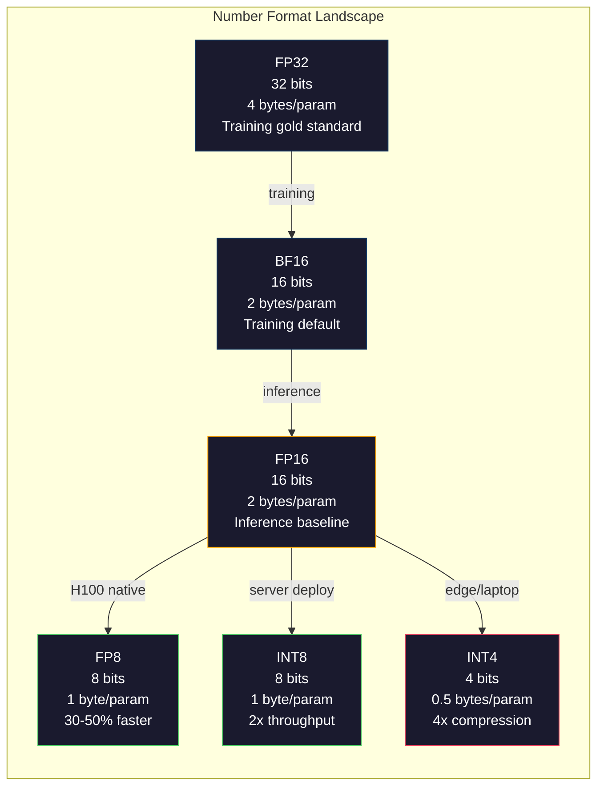
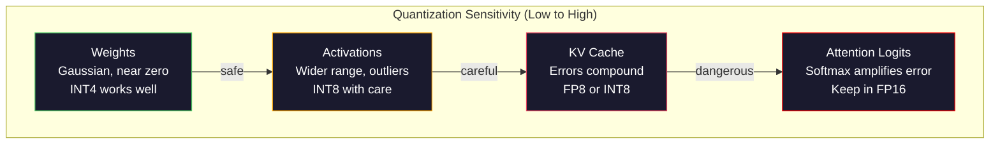
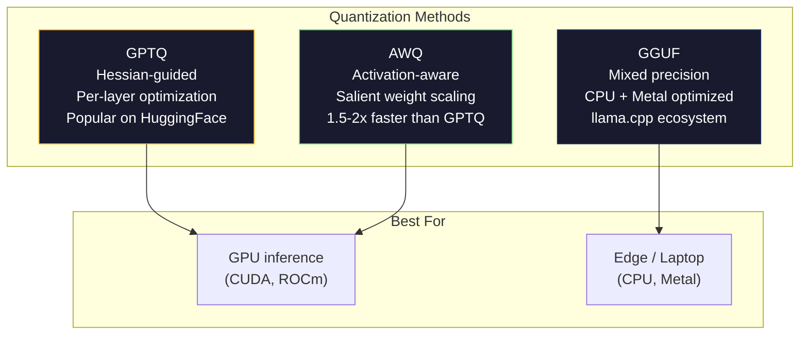

# 量化：讓模型裝得下

> FP16 精度的 70B 模型需要 140GB。光是放模型權重（model weights）就需要兩張 A100。量化至 FP8：單張 80GB GPU 搞定。INT4：一台 MacBook 就能跑。

**Type:** Build
**Languages:** Python (with numpy)
**Prerequisites:** Phase 10, Lessons 01-10 (LLMs from Scratch)
**Time:** ~120 minutes

## Learning Objectives｜學習目標

- 實作從 FP16 到 INT8 與 INT4 的對稱與非對稱量化，包含逐張量（per-tensor）與逐通道（per-channel）縮放
- 計算量化帶來的記憶體節省，並判斷特定精度能否裝入指定 GPU 的 VRAM
- 解釋訓練後量化（PTQ）與量化感知訓練（QAT）之間的差異
- 套用 GPTQ 或 AWQ 量化真實模型，並在基準測試上衡量精度與記憶體之間的權衡取捨

## The Problem｜問題

Llama 3 70B 擁有 700 億個參數。每個參數都是一個 16 位元浮點數。那是 1,400 億個位元組，也就是 140GB。一張單獨的 A100 只有 80GB 的 VRAM。在單張 GPU 上你連模型權重都載入不了，更遑論執行推論。你至少需要兩張 A100（每張每小時約 2 美元）才能提供單一模型的服務。

但每個參數使用 16 位元其實極其浪費。神經網路中的絕大多數模型權重都聚集在零附近。FP16 的完整動態範圍（從 0.000000059 到 65,504）幾乎完全處於閒置狀態。如果你實際測量 Llama 3 70B 的模型權重分布，會發現 95% 的數值都落在 -0.1 到 +0.1 之間。你耗費了 16 個位元，去表示只需 4 個位元就能裝得下的數值。

量化（Quantization）以低精度數值取代高精度數值。從 FP16 轉為 FP8 能讓記憶體直接減半。從 FP16 轉為 INT4 則將其縮減為四分之一。那個 140GB 的龐然大物縮減為 35GB，剛好能裝進單張消費級 GPU。若進一步推向 2 位元量化（極端且具損耗性，但在部分任務中堪用），同一個模型甚至能在 16GB 的筆記型電腦上執行。

其代價是精準度。每丟棄一個位元都會損毀部分資訊。問題在於究竟損失了多少精準度，以及損失發生在何處。一個經過良好量化的 INT4 模型，在大多數基準測試上仍能保留原始模型 95% 到 99% 的品質。天真的 INT4 量化則可能徹底摧毀模型。這之間的鴻溝純粹取決於技術。

社群使用 GPTQ 將 Llama 3 量化至 INT4 的結果顯示，在 WikiText 上僅損失約 1 到 2 個困惑度點數。Mistral 發布的 Mixtral 8x22B FP8 checkpoint 在 MMLU 上沒有任何可測量到的品質損失。GGUF 格式驅動了 llama.cpp，使 70B 模型能夠在搭載 M 系列晶片的 MacBook 上流暢執行。量化絕非權宜之計的旁門左道，它是所有大於 7B 模型上線部署的標準路徑。

## The Concept｜核心概念

### 數字格式：每個位元各司其職

每個浮點數都由三個部分組成：符號位元（sign）、指數（exponent）與尾數（mantissa，亦稱有效數）。符號佔 1 個位元。指數決定了數值範圍（數字能有多大或多小）。尾數決定了精度（能提供多少位有效數字）。

```
FP32:  [1 sign] [8 exponent] [23 mantissa]  = 32 bits
FP16:  [1 sign] [5 exponent] [10 mantissa]  = 16 bits
BF16:  [1 sign] [8 exponent] [7  mantissa]  = 16 bits
FP8:   [1 sign] [4 exponent] [3  mantissa]  = 8  bits (E4M3)
FP8:   [1 sign] [5 exponent] [2  mantissa]  = 8  bits (E5M2)
INT8:  [1 sign] [7 value]                   = 8  bits (uniform steps)
INT4:  [1 sign] [3 value]                   = 4  bits (16 levels total)
```

**FP32** 是全精度。23 個尾數位元提供約 7 位十進位有效數字。數值範圍：約 1.2 x 10^-38 到 3.4 x 10^38。過去的模型訓練完全在 FP32 下進行。如今在矩陣乘法的累加計算中依然採用 FP32。

**FP16** 將位元數減半。10 個尾數位元提供約 3.3 位十進位有效數字。指數縮減至 5 個位元，大幅縮小了數值範圍（最大值約為 65,504）。這對集中在零附近的模型權重來說沒有問題，但對訓練期間可能劇烈暴增的活化值與梯度極具危險性。FP16 訓練需要損失縮放以防止數值下溢。

**BF16**（Brain Float 16）保留了 FP32 的 8 位元指數，但將尾數縮減至 7 個位元。具備與 FP32 相同的數值範圍，但精度低於 FP16。Google 專為深度學習設計了此格式。其核心直覺在於：對神經網路而言，數值範圍的重要性遠勝於單純的精度。在 FP16 中下溢為零的 10^-20 梯度能在 BF16 中存活。一個原本為 0.07342 的模型權重在 BF16 中四捨五入為 0.0734，對模型表現而言已經足夠接近。現代訓練無一例外皆採用 BF16 或 BF16/FP32 混合模式。

**FP8** 有兩種常見格式。E4M3（4 個指數位元、3 個尾數位元）在推論期間用於模型權重與活化值。E5M2（5 個指數位元、2 個尾數位元）則用於訓練期間的梯度，此時數值範圍重於精度。在 H100 GPU 上執行 FP8 推論，相較於 FP16 能帶來 30% 到 50% 的速度提升，且品質損失微乎其微。

**INT8** 是整數格式。沒有指數，沒有尾數。只有從 -128 到 127 的 256 個等距數值。你需要一個縮放因子（scale factor）將浮點數模型權重映射進這個範圍。優勢在於：整數運算比浮點數運算更快速且更省電。A100 上的 INT8 矩陣乘法運算能力達 624 TOPS，而 FP16 僅為 312 TFLOPS。

**INT4** 則更進一步。總共只有 16 個可能的數值。縮放因子承擔了極其關鍵的任務。品質好壞完全取決於你如何挑選縮放因子以及選擇量化哪些模型權重。頂尖的 INT4 方法（GPTQ、AWQ）能保留原始模型 95% 以上的品質。



### 量化的運作機制

核心運算非常直接。取得一個浮點數張量，找出縮放因子，進行縮放，四捨五入至最接近的整數，最後儲存該整數與縮放因子。

**量化（Quantize）：**
```
scale = max(abs(tensor)) / max_int_value
quantized = round(tensor / scale)
```

**反量化（Dequantize）：**
```
reconstructed = quantized * scale
```

對於對稱範圍（-127 到 127）的 INT8：
```
scale = max(abs(tensor)) / 127
quantized = clamp(round(tensor / scale), -128, 127)
```

誤差即為捨入誤差。每個數值的誤差最大不超過 `scale / 2`。整層的總誤差取決於你有多少個模型權重，以及模型對這些模型權重擾動的敏感程度。

**逐張量（Per-tensor）vs 逐通道（Per-channel）量化。** 逐張量量化為整個模型權重矩陣使用單一縮放因子。實作簡單但損耗較大：如果一欄的數值較大、另一欄的數值較小，數值較小的那一欄就會失去大部分精度。逐通道量化為每個輸出通道（模型權重矩陣的每一列或每一行）使用獨立的縮放因子。雖然增加了少量額外開銷（必須儲存 N 個縮放因子而非 1 個），但品質有著飛躍性的提升。所有正式環境的量化方法皆採用逐通道或更細粒度的縮放。

**非對稱量化（Asymmetric quantization）** 加入了零點（zero-point）偏移：`quantized = round(tensor / scale) + zero_point`。這能妥善處理未以零為中心的分布。例如 ReLU 活化值永遠為非負數。對稱量化會將整整一半的整數範圍浪費在永遠不會出現的負數上。非對稱量化則將實際的 [min, max] 區間完整映射到整個整數範圍。

### 敏感度階層

模型內部各個元件對量化的容忍度截然不同。存在一個清晰的敏感度階層。

**模型權重（最穩健）。** 模型權重在訓練期間變化平緩，且遵循以零為中心的大致高斯分布。它們非常適合量化。帶有逐通道縮放的 INT8 模型權重幾乎能達到無損效果。INT4 雖然需要更精密的方法，但同樣具備高度可行性。

**活化值（中等敏感）。** 活化值是推論期間流經網路的中間數值。它們的動態範圍比模型權重更廣，且包含極端離群值（outliers）。單一注意力頭產生的活化值可能比平均值大上 100 倍。這些離群值對模型品質至關重要，天真地對其進行量化會嚴重破壞資訊。解決方案：將離群特徵保留在高精度（LLM.int8()），或採用逐 token / 逐通道的活化值縮放。

**KV 快取（高度敏感）。** 鍵值快取（KV cache）儲存了所有先前 token 的注意力狀態。在長脈絡長度下，KV 快取會霸佔大部分記憶體。對於處於 32K 脈絡下的 70B 模型，光是 FP16 的 KV 快取就高達 40GB。將 KV 快取量化至 FP8 或 INT8 能節省巨量記憶體，但任何誤差都會在所有後續的注意力計算中層層疊加。品質影響會隨序列長度增加而加重。

**注意力 Logits（最敏感）。** 注意力機制中的 softmax 對輸入的微小變化極度敏感。在 softmax 之前的 logit 產生 0.01 的量化誤差，就會對注意力分布產生實質扭曲。大多數部署方案即使將其他所有部分都進行量化，也會將注意力計算保留在較高精度（FP16 或 BF16）。



### PTQ vs QAT

**訓練後量化（PTQ）** 對已經訓練好的模型進行量化，無需重新訓練。你取得 FP16 模型權重，計算縮放因子，進行四捨五入，然後上線。速度極快（數分鐘至數小時）且成本低廉。在 INT8 與 FP8 下表現極佳。在 INT4 下，天真的 PTQ 往往會因為捨入誤差疊加而嚴重失敗。進階的 PTQ 方法（GPTQ、AWQ）使用校準資料來最小化量化誤差。

**量化感知訓練（QAT）** 在訓練期間的前向傳遞中插入偽量化（fake quantization）操作。模型學會將模型權重置於捨入誤差較小的位置。梯度透過直通估計器（Straight-Through Estimator，STE）穿透偽量化操作：假裝四捨五入操作的梯度為 1。QAT 在 INT4 與 INT2 下產生的模型優於 PTQ，但需要完整的訓練執行作業。Google 在 Gemini 的高效服務中採用了 QAT，Meta 也在部分 Llama 部署目標中採用了 QAT。

| 面向 | PTQ | QAT |
|--------|-----|-----|
| 成本 | 數分鐘至數小時 | 完整訓練週期 |
| INT8 下品質 | 極佳（損失 < 0.1%） | 極佳 |
| INT4 下品質 | 搭配 GPTQ/AWQ 良好（損失 1-3%） | 更佳（損失 < 1%） |
| INT2 下品質 | 拙劣 | 在部分任務上堪用 |
| 校準資料需求 | 128 到 1024 個範例 | 完整訓練資料集 |
| 適用時機 | 上線部署、快速迭代 | 在極低位元寬度下追求極致品質 |

### GPTQ、AWQ、GGUF

**GPTQ（GPT Quantization）** 是一種單次（one-shot）PTQ 方法。它逐層量化模型權重，使用小型校準資料集（通常為 128 個範例）來測量 Hessian 矩陣（二階曲率資訊，反映輸出對每個模型權重的敏感程度）。Hessian 判定為重要的模型權重會被更謹慎地量化。GPTQ 是第一個讓 LLM 的 INT4 量化具備實用可行性的演算法。Hugging Face 上的 TheBloke 透過發布數百個模型的 GPTQ 版本將其發揚光大。

**AWQ（Activation-Aware Weight Quantization）** 觀察到極少數模型權重（約 1%）因與龐大的活化值相乘而顯得格外重要。AWQ 利用校準資料辨識出這些顯著模型權重（salient weights），並在量化前將其放大（同時等比縮小相應的活化值）。這將重要模型權重保護在 INT4 能準確量化的數值範圍內。AWQ 的品質通常打平或略勝 GPTQ，且執行速度快 1.5 到 2 倍。

**GGUF（GPT-Generated Unified Format）** 是 llama.cpp 生態系統所使用的檔案格式。它支援混合量化：不同層級採用不同位元寬度。第一層與最後一層（embedding 與輸出頭）通常保留在較高精度，中間層則採用 INT4 或 INT3。GGUF 檔案完全自給自足：模型權重、tokenizer、詮釋資料全包在單一檔案內。該格式專為 CPU 與 Apple Silicon 推論設計，將整個模型載入記憶體並在 CPU 或 Metal GPU 上執行矩陣乘法是其標準路徑。Q4_K_M 是最受歡迎的 GGUF 量化變體，在品質與檔案大小之間取得平衡。



### 品質檢驗

如何確認量化後的模型依然保有良好能力？

**困惑度（Perplexity）。** 最常用的指標，數值越低越好。在保留資料集（標準為 WikiText-2）上分別計算原始模型與量化模型的困惑度。兩者的差距（delta）揭示了量化損毀了多少資訊。經驗法則：delta < 0.5 為極佳，0.5 到 1.0 為良好，1.0 到 2.0 在多數任務中可接受，> 2.0 表示量化過程發生了異常。

**任務專用基準測試。** 在 MMLU、HumanEval、GSM8K 或自訂 eval 套件上評估量化模型。量化對不同能力的衝擊並不均勻，數學與程式碼任務對精度損失的敏感度遠高於一般常識理解。

**輸出比較。** 在相同 prompt 下分別使用兩個模型產生回應並進行比對。第 10 課介紹的 LLM 作為裁判在此非常實用。計算勝率：量化模型在多少比例的 prompt 上打平或擊敗了原始模型？

**延遲與吞吐量。** 量化的初衷是為了讓模型更快、更省成本。測量每秒生成的 token 數、首字延遲（time to first token）以及記憶體使用量。一個變慢的量化模型毫無存在價值。

| 模型 | 格式 | 體積 | 困惑度（WikiText-2） | MMLU | Tokens/秒（A100） |
|-------|--------|------|------------------------|------|-------------------|
| Llama 3 70B | FP16 | 140GB | 3.12 | 79.5% | 38 |
| Llama 3 70B | FP8 | 70GB | 3.14 | 79.3% | 55 |
| Llama 3 70B | GPTQ INT4 | 35GB | 4.32 | 77.8% | 72 |
| Llama 3 70B | AWQ INT4 | 35GB | 4.18 | 78.1% | 75 |
| Llama 3 70B | GGUF Q4_K_M | 40GB | 4.25 | 77.9% | 28（CPU） |

規律非常清晰：FP8 幾乎毫無代價。INT4 損失約 1 到 2 個 MMLU 百分點，但吞吐量翻倍且記憶體減少為四分之一。對於幾乎所有部署而言，這項權衡都極具價值。

### 真實世界數字

在 H100 上從 FP16 轉為 FP8：推論加速 30% 到 50%，品質損失 < 0.1%。這是完全不需要猶豫的選擇，每個 H100 部署都應啟用它。

從 FP16 轉為 INT8（LLM.int8()）：記憶體減少 2 倍，品質損失 < 0.5%。混合精度方法將離群特徵保留在 FP16，其餘部分量化為 INT8。

從 FP16 轉為 INT4（GPTQ/AWQ）：記憶體減少 4 倍，品質損失依模型與方法約 1% 到 3%。使 70B 模型得以在單張 48GB GPU 上執行。

從 FP16 轉為 INT4（GGUF Q4_K_M）：記憶體減少 3.5 倍，品質損失 1% 到 2%。專為 CPU 推論最佳化。Q4_K_M 的 70B 模型約為 40GB，在配備 64GB 記憶體的 M3 Max 上執行速度約為每秒 10 到 15 個 token。

從 FP16 轉為 INT2：記憶體減少 8 倍，品質損失 5% 到 15%。僅在能容忍明顯退化的特定狹窄任務中可行。屬於前沿研究領域，尚未達到通用的生產級成熟度。

```figure
quantization
```

## Build It｜動手實作

### 步驟 1：數字格式的二進位表示

建立各格式的位元層級表示，親眼觀察符號、指數與尾數各自的作用。

```python
import numpy as np


def float_to_fp32_bits(value):
    bits = np.float32(value).view(np.uint32)
    sign = (bits >> 31) & 1
    exponent = (bits >> 23) & 0xFF
    mantissa = bits & 0x7FFFFF
    return {"sign": int(sign), "exponent": int(exponent), "mantissa": int(mantissa),
            "exponent_bits": format(int(exponent), '08b'),
            "mantissa_bits": format(int(mantissa), '023b'),
            "value": float(value),
            "actual_exponent": int(exponent) - 127}


def float_to_fp16_bits(value):
    fp16 = np.float16(value)
    bits = fp16.view(np.uint16)
    sign = (bits >> 15) & 1
    exponent = (bits >> 10) & 0x1F
    mantissa = bits & 0x3FF
    return {"sign": int(sign), "exponent": int(exponent), "mantissa": int(mantissa),
            "exponent_bits": format(int(exponent), '05b'),
            "mantissa_bits": format(int(mantissa), '010b'),
            "value": float(fp16),
            "actual_exponent": int(exponent) - 15}


def float_to_bf16_bits(value):
    fp32_bits = np.float32(value).view(np.uint32)
    bf16_bits = (fp32_bits >> 16).astype(np.uint16)
    sign = (bf16_bits >> 15) & 1
    exponent = (bf16_bits >> 7) & 0xFF
    mantissa = bf16_bits & 0x7F
    reconstructed = np.uint32(bf16_bits.astype(np.uint32) << 16).view(np.float32)
    return {"sign": int(sign), "exponent": int(exponent), "mantissa": int(mantissa),
            "exponent_bits": format(int(exponent), '08b'),
            "mantissa_bits": format(int(mantissa), '07b'),
            "value": float(reconstructed),
            "actual_exponent": int(exponent) - 127}


def simulate_fp8_e4m3(value):
    sign = 1 if value < 0 else 0
    abs_val = abs(value)
    max_val = 448.0
    abs_val = min(abs_val, max_val)
    if abs_val == 0:
        return {"sign": sign, "exponent": 0, "mantissa": 0, "value": 0.0,
                "exponent_bits": "0000", "mantissa_bits": "000"}
    exp = int(np.floor(np.log2(abs_val)))
    exp = max(-6, min(8, exp))
    mantissa_val = abs_val / (2.0 ** exp) - 1.0
    mantissa_quant = round(mantissa_val * 8) / 8
    mantissa_quant = max(0, min(0.875, mantissa_quant))
    reconstructed = (1.0 + mantissa_quant) * (2.0 ** exp)
    if sign:
        reconstructed = -reconstructed
    mantissa_int = int(round(mantissa_quant * 8))
    return {"sign": sign, "exponent": exp + 7, "mantissa": mantissa_int,
            "exponent_bits": format(exp + 7, '04b'),
            "mantissa_bits": format(mantissa_int, '03b'),
            "value": float(reconstructed),
            "actual_exponent": exp}


def display_format_comparison(value):
    fp32 = float_to_fp32_bits(value)
    fp16 = float_to_fp16_bits(value)
    bf16 = float_to_bf16_bits(value)
    fp8 = simulate_fp8_e4m3(value)

    print(f"\n  Value: {value}")
    print(f"  {'Format':<8} {'Stored Value':>14} {'Error':>12} {'Sign':>5} {'Exp Bits':>10} {'Man Bits':>25}")
    print(f"  {'-'*76}")
    print(f"  {'FP32':<8} {fp32['value']:>14.6f} {abs(fp32['value'] - value):>12.8f} {fp32['sign']:>5} {fp32['exponent_bits']:>10} {fp32['mantissa_bits']:>25}")
    print(f"  {'FP16':<8} {fp16['value']:>14.6f} {abs(fp16['value'] - value):>12.8f} {fp16['sign']:>5} {fp16['exponent_bits']:>10} {fp16['mantissa_bits']:>25}")
    print(f"  {'BF16':<8} {bf16['value']:>14.6f} {abs(bf16['value'] - value):>12.8f} {bf16['sign']:>5} {bf16['exponent_bits']:>10} {bf16['mantissa_bits']:>25}")
    print(f"  {'FP8e4m3':<8} {fp8['value']:>14.6f} {abs(fp8['value'] - value):>12.8f} {fp8['sign']:>5} {fp8['exponent_bits']:>10} {fp8['mantissa_bits']:>25}")
```

### 步驟 2：對稱量化（逐張量與逐通道）

基礎量化操作。逐張量為整個矩陣使用單一縮放。逐通道為每列或每行使用獨立縮放。

```python
def quantize_symmetric(tensor, num_bits=8):
    qmin = -(2 ** (num_bits - 1))
    qmax = 2 ** (num_bits - 1) - 1
    abs_max = np.max(np.abs(tensor))
    if abs_max == 0:
        return np.zeros_like(tensor, dtype=np.int32), 1.0
    scale = abs_max / qmax
    quantized = np.clip(np.round(tensor / scale), qmin, qmax).astype(np.int32)
    return quantized, float(scale)


def dequantize_symmetric(quantized, scale):
    return quantized.astype(np.float64) * scale


def quantize_per_channel(tensor, num_bits=8, axis=0):
    qmin = -(2 ** (num_bits - 1))
    qmax = 2 ** (num_bits - 1) - 1

    if axis == 0:
        abs_max = np.max(np.abs(tensor), axis=1, keepdims=True)
    else:
        abs_max = np.max(np.abs(tensor), axis=0, keepdims=True)

    abs_max = np.where(abs_max == 0, 1.0, abs_max)
    scales = abs_max / qmax
    quantized = np.clip(np.round(tensor / scales), qmin, qmax).astype(np.int32)
    return quantized, scales.squeeze()


def dequantize_per_channel(quantized, scales, axis=0):
    if axis == 0:
        return quantized.astype(np.float64) * scales.reshape(-1, 1)
    else:
        return quantized.astype(np.float64) * scales.reshape(1, -1)


def quantize_asymmetric(tensor, num_bits=8):
    qmin = 0
    qmax = 2 ** num_bits - 1
    t_min = np.min(tensor)
    t_max = np.max(tensor)
    if t_max == t_min:
        return np.zeros_like(tensor, dtype=np.int32), 1.0, 0
    scale = (t_max - t_min) / (qmax - qmin)
    zero_point = int(np.round(qmin - t_min / scale))
    zero_point = max(qmin, min(qmax, zero_point))
    quantized = np.clip(np.round(tensor / scale + zero_point), qmin, qmax).astype(np.int32)
    return quantized, float(scale), int(zero_point)


def dequantize_asymmetric(quantized, scale, zero_point):
    return (quantized.astype(np.float64) - zero_point) * scale
```

### 步驟 3：品質量測

測量量化損毀了多少資訊：原始張量與重建張量之間的均方誤差（MSE）、訊噪比（SNR）以及餘弦相似度。

```python
def quantization_error(original, reconstructed):
    diff = original - reconstructed
    mse = float(np.mean(diff ** 2))
    rmse = float(np.sqrt(mse))
    max_error = float(np.max(np.abs(diff)))
    signal_power = float(np.mean(original ** 2))
    snr_db = 10 * np.log10(signal_power / max(mse, 1e-20))

    orig_flat = original.flatten()
    recon_flat = reconstructed.flatten()
    norm_orig = np.linalg.norm(orig_flat)
    norm_recon = np.linalg.norm(recon_flat)
    if norm_orig == 0 or norm_recon == 0:
        cosine_sim = 0.0
    else:
        cosine_sim = float(np.dot(orig_flat, recon_flat) / (norm_orig * norm_recon))

    return {"mse": mse, "rmse": rmse, "max_error": max_error,
            "snr_db": float(snr_db), "cosine_similarity": cosine_sim}


def compare_quantization_methods(tensor, num_bits=8):
    q_pt, s_pt = quantize_symmetric(tensor, num_bits)
    recon_pt = dequantize_symmetric(q_pt, s_pt)
    err_pt = quantization_error(tensor, recon_pt)

    q_pc, s_pc = quantize_per_channel(tensor, num_bits, axis=0)
    recon_pc = dequantize_per_channel(q_pc, s_pc, axis=0)
    err_pc = quantization_error(tensor, recon_pc)

    q_asym, s_asym, zp = quantize_asymmetric(tensor, num_bits)
    recon_asym = dequantize_asymmetric(q_asym, s_asym, zp)
    err_asym = quantization_error(tensor, recon_asym)

    print(f"\n  Quantization Comparison ({num_bits}-bit, tensor shape {tensor.shape}):")
    print(f"  {'Method':<20} {'MSE':>12} {'SNR (dB)':>10} {'Cosine Sim':>12} {'Max Error':>12}")
    print(f"  {'-'*68}")
    print(f"  {'Per-tensor sym':<20} {err_pt['mse']:>12.8f} {err_pt['snr_db']:>10.2f} {err_pt['cosine_similarity']:>12.8f} {err_pt['max_error']:>12.8f}")
    print(f"  {'Per-channel sym':<20} {err_pc['mse']:>12.8f} {err_pc['snr_db']:>10.2f} {err_pc['cosine_similarity']:>12.8f} {err_pc['max_error']:>12.8f}")
    print(f"  {'Asymmetric':<20} {err_asym['mse']:>12.8f} {err_asym['snr_db']:>10.2f} {err_asym['cosine_similarity']:>12.8f} {err_asym['max_error']:>12.8f}")

    return {"per_tensor": err_pt, "per_channel": err_pc, "asymmetric": err_asym}
```

### 步驟 4：位元寬度掃描

在不同的位元寬度（2、3、4、8、16）下量化同一個張量，並測量每個等級的品質。這能精確揭示品質斷崖發生的位置。

```python
def bit_width_sweep(tensor):
    print(f"\n  Bit-Width Sweep (tensor shape {tensor.shape}):")
    print(f"  {'Bits':>6} {'Levels':>8} {'MSE':>14} {'SNR (dB)':>10} {'Cosine Sim':>12} {'Compression':>12}")
    print(f"  {'-'*64}")

    results = []
    for bits in [2, 3, 4, 8, 16]:
        q, s = quantize_per_channel(tensor, bits, axis=0)
        recon = dequantize_per_channel(q, s, axis=0)
        err = quantization_error(tensor, recon)
        levels = 2 ** bits
        compression = 32.0 / bits

        print(f"  {bits:>6} {levels:>8} {err['mse']:>14.8f} {err['snr_db']:>10.2f} {err['cosine_similarity']:>12.8f} {compression:>11.1f}x")
        results.append({"bits": bits, "levels": levels, "error": err, "compression": compression})

    return results
```

### 步驟 5：敏感度實驗

模擬量化 transformer 的不同部分，測量哪些元件最為敏感。這展示了敏感度階層：模型權重 < 活化值 < KV 快取 < 注意力。

```python
def simulate_transformer_layer(input_data, weights, kv_scale=1.0):
    hidden = input_data @ weights["qkv"]
    seq_len = hidden.shape[1]
    d_model = weights["qkv"].shape[1] // 3
    q, k, v = hidden[:, :, :d_model], hidden[:, :, d_model:2*d_model], hidden[:, :, 2*d_model:]

    attn_scores = (q @ k.transpose(0, 2, 1)) / np.sqrt(d_model) * kv_scale
    attn_max = np.max(attn_scores, axis=-1, keepdims=True)
    attn_exp = np.exp(attn_scores - attn_max)
    attn_weights = attn_exp / np.sum(attn_exp, axis=-1, keepdims=True)

    attn_output = attn_weights @ v
    output = attn_output @ weights["out"]
    return output, {"q": q, "k": k, "v": v, "attn_scores": attn_scores,
                    "attn_weights": attn_weights, "attn_output": attn_output}


def sensitivity_experiment(batch_size=2, seq_len=16, d_model=64, num_bits=8):
    np.random.seed(42)
    input_data = np.random.randn(batch_size, seq_len, d_model) * 0.1

    weights = {
        "qkv": np.random.randn(d_model, 3 * d_model) * (2.0 / d_model) ** 0.5,
        "out": np.random.randn(d_model, d_model) * (2.0 / d_model) ** 0.5,
    }

    baseline_output, baseline_internals = simulate_transformer_layer(input_data, weights)

    experiments = {}

    q_qkv, s_qkv = quantize_per_channel(weights["qkv"], num_bits, axis=0)
    q_out, s_out = quantize_per_channel(weights["out"], num_bits, axis=0)
    quantized_weights = {
        "qkv": dequantize_per_channel(q_qkv, s_qkv, axis=0),
        "out": dequantize_per_channel(q_out, s_out, axis=0),
    }
    weight_quant_output, _ = simulate_transformer_layer(input_data, quantized_weights)
    experiments["Weights only"] = quantization_error(baseline_output, weight_quant_output)

    _, fresh_internals = simulate_transformer_layer(input_data, weights)
    q_act, s_act = quantize_per_channel(
        fresh_internals["attn_output"].reshape(-1, d_model), num_bits, axis=0
    )
    quant_attn_out = dequantize_per_channel(q_act, s_act, axis=0).reshape(batch_size, seq_len, d_model)
    act_quant_output = quant_attn_out @ weights["out"]
    experiments["Activations only"] = quantization_error(baseline_output, act_quant_output)

    q_k, s_k = quantize_per_channel(fresh_internals["k"].reshape(-1, d_model), num_bits, axis=0)
    q_v, s_v = quantize_per_channel(fresh_internals["v"].reshape(-1, d_model), num_bits, axis=0)
    quant_k = dequantize_per_channel(q_k, s_k, axis=0).reshape(batch_size, seq_len, d_model)
    quant_v = dequantize_per_channel(q_v, s_v, axis=0).reshape(batch_size, seq_len, d_model)
    attn_scores_kv = (fresh_internals["q"] @ quant_k.transpose(0, 2, 1)) / np.sqrt(d_model)
    attn_max_kv = np.max(attn_scores_kv, axis=-1, keepdims=True)
    attn_exp_kv = np.exp(attn_scores_kv - attn_max_kv)
    attn_weights_kv = attn_exp_kv / np.sum(attn_exp_kv, axis=-1, keepdims=True)
    kv_quant_output = (attn_weights_kv @ quant_v) @ weights["out"]
    experiments["KV cache only"] = quantization_error(baseline_output, kv_quant_output)

    noise_scale = np.std(fresh_internals["attn_scores"]) * 0.05
    noisy_scores = fresh_internals["attn_scores"] + np.random.randn(*fresh_internals["attn_scores"].shape) * noise_scale
    noisy_max = np.max(noisy_scores, axis=-1, keepdims=True)
    noisy_exp = np.exp(noisy_scores - noisy_max)
    noisy_weights = noisy_exp / np.sum(noisy_exp, axis=-1, keepdims=True)
    attn_quant_output = (noisy_weights @ fresh_internals["v"]) @ weights["out"]
    experiments["Attention logits (5% noise)"] = quantization_error(baseline_output, attn_quant_output)

    print(f"\n  Sensitivity Experiment ({num_bits}-bit quantization):")
    print(f"  {'Component':<30} {'MSE':>14} {'SNR (dB)':>10} {'Cosine Sim':>12}")
    print(f"  {'-'*68}")
    for name, err in sorted(experiments.items(), key=lambda x: x[1]["mse"]):
        print(f"  {name:<30} {err['mse']:>14.8f} {err['snr_db']:>10.2f} {err['cosine_similarity']:>12.8f}")

    return experiments
```

### 步驟 6：模擬 GPTQ

GPTQ 一次量化一欄，利用 Hessian 矩陣決定如何分散捨入誤差。這是捕捉其核心思想的簡化版本：使用校準資料衡量模型權重重要性，隨後更積極地量化次要模型權重。

```python
def simulated_gptq(weight_matrix, calibration_inputs, num_bits=4):
    n_in, n_out = weight_matrix.shape
    qmin = -(2 ** (num_bits - 1))
    qmax = 2 ** (num_bits - 1) - 1

    H = np.zeros((n_in, n_in))
    for x in calibration_inputs:
        x = x.reshape(-1, 1) if x.ndim == 1 else x
        for row in range(x.shape[0]):
            xi = x[row].reshape(-1, 1)
            H += xi @ xi.T
    H /= len(calibration_inputs)
    H += np.eye(n_in) * 1e-4

    weight_importance = np.diag(H)

    quantized = np.zeros_like(weight_matrix, dtype=np.int32)
    scales = np.zeros(n_out)
    errors = np.zeros(n_out)

    W = weight_matrix.copy()

    for col in range(n_out):
        w_col = W[:, col]
        abs_max = np.max(np.abs(w_col))
        if abs_max == 0:
            scales[col] = 1.0
            continue
        scale = abs_max / qmax
        scales[col] = scale

        q_col = np.clip(np.round(w_col / scale), qmin, qmax).astype(np.int32)
        quantized[:, col] = q_col

        quant_error = w_col - q_col * scale
        errors[col] = np.sqrt(np.mean(quant_error ** 2))

        if col < n_out - 1:
            importance_weights = weight_importance / (np.max(weight_importance) + 1e-10)
            for next_col in range(col + 1, min(col + 4, n_out)):
                compensation = quant_error * importance_weights * 0.1
                W[:, next_col] += compensation

    return quantized, scales, {"column_errors": errors,
                               "mean_error": float(np.mean(errors)),
                               "max_error": float(np.max(errors))}


def dequantize_gptq(quantized, scales):
    result = np.zeros_like(quantized, dtype=np.float64)
    for col in range(quantized.shape[1]):
        result[:, col] = quantized[:, col] * scales[col]
    return result
```

### 步驟 7：AWQ 模擬

AWQ 辨識顯著模型權重（與大型活化值相乘的模型權重），並在量化前透過縮放加以保護。

```python
def simulated_awq(weight_matrix, calibration_inputs, num_bits=4, salient_fraction=0.01):
    n_in, n_out = weight_matrix.shape
    qmin = -(2 ** (num_bits - 1))
    qmax = 2 ** (num_bits - 1) - 1

    activation_magnitudes = np.zeros(n_in)
    for x in calibration_inputs:
        if x.ndim == 1:
            activation_magnitudes += np.abs(x)
        else:
            activation_magnitudes += np.mean(np.abs(x), axis=0)
    activation_magnitudes /= len(calibration_inputs)

    n_salient = max(1, int(n_in * salient_fraction))
    salient_indices = np.argsort(activation_magnitudes)[-n_salient:]

    scale_factors = np.ones(n_in)
    for idx in salient_indices:
        col_max = np.max(np.abs(weight_matrix[idx, :]))
        if col_max > 0:
            scale_factors[idx] = min(4.0, 1.0 / (col_max + 1e-8) * np.mean(np.abs(weight_matrix)))

    scaled_weights = weight_matrix * scale_factors.reshape(-1, 1)

    quantized, scales = quantize_per_channel(scaled_weights, num_bits, axis=0)
    dequantized = dequantize_per_channel(quantized, scales, axis=0)

    result = dequantized / scale_factors.reshape(-1, 1)

    err = quantization_error(weight_matrix, result)

    return result, {"salient_indices": salient_indices,
                    "scale_factors": scale_factors[salient_indices],
                    "error": err,
                    "n_salient": n_salient}
```

### 步驟 8：完整管線

將所有環節串聯。在同一個模型權重矩陣上比較天真量化、逐通道量化、GPTQ 與 AWQ。

```python
def full_quantization_comparison(d_in=256, d_out=512, num_bits=4, n_calibration=32):
    np.random.seed(42)

    weight = np.random.randn(d_in, d_out) * 0.02
    outlier_rows = np.random.choice(d_in, size=5, replace=False)
    weight[outlier_rows] *= 10

    calibration = [np.random.randn(8, d_in) * 0.1 for _ in range(n_calibration)]

    q_naive, s_naive = quantize_symmetric(weight, num_bits)
    recon_naive = dequantize_symmetric(q_naive, s_naive)
    err_naive = quantization_error(weight, recon_naive)

    q_pc, s_pc = quantize_per_channel(weight, num_bits, axis=0)
    recon_pc = dequantize_per_channel(q_pc, s_pc, axis=0)
    err_pc = quantization_error(weight, recon_pc)

    q_gptq, s_gptq, gptq_info = simulated_gptq(weight, calibration, num_bits)
    recon_gptq = dequantize_gptq(q_gptq, s_gptq)
    err_gptq = quantization_error(weight, recon_gptq)

    recon_awq, awq_info = simulated_awq(weight, calibration, num_bits)
    err_awq = awq_info["error"]

    print(f"\n  Full Quantization Comparison ({num_bits}-bit, {d_in}x{d_out} matrix)")
    print(f"  Matrix has {len(outlier_rows)} outlier rows (10x scale)")
    print()
    print(f"  {'Method':<20} {'MSE':>14} {'SNR (dB)':>10} {'Cosine Sim':>12}")
    print(f"  {'-'*58}")
    print(f"  {'Naive per-tensor':<20} {err_naive['mse']:>14.8f} {err_naive['snr_db']:>10.2f} {err_naive['cosine_similarity']:>12.8f}")
    print(f"  {'Per-channel':<20} {err_pc['mse']:>14.8f} {err_pc['snr_db']:>10.2f} {err_pc['cosine_similarity']:>12.8f}")
    print(f"  {'Simulated GPTQ':<20} {err_gptq['mse']:>14.8f} {err_gptq['snr_db']:>10.2f} {err_gptq['cosine_similarity']:>12.8f}")
    print(f"  {'Simulated AWQ':<20} {err_awq['mse']:>14.8f} {err_awq['snr_db']:>10.2f} {err_awq['cosine_similarity']:>12.8f}")

    test_input = np.random.randn(4, d_in) * 0.1
    baseline = test_input @ weight
    output_naive = test_input @ recon_naive
    output_pc = test_input @ recon_pc
    output_gptq = test_input @ recon_gptq
    output_awq = test_input @ recon_awq

    print(f"\n  End-to-End Output Error (matmul with test input):")
    print(f"  {'Method':<20} {'Output MSE':>14} {'Output Cosine':>14}")
    print(f"  {'-'*50}")
    for name, output in [("Naive", output_naive), ("Per-channel", output_pc),
                          ("GPTQ", output_gptq), ("AWQ", output_awq)]:
        out_err = quantization_error(baseline, output)
        print(f"  {name:<20} {out_err['mse']:>14.8f} {out_err['cosine_similarity']:>14.8f}")

    return {"naive": err_naive, "per_channel": err_pc, "gptq": err_gptq, "awq": err_awq}


def memory_calculator(num_params_billions, bits_per_param):
    bytes_per_param = bits_per_param / 8
    total_bytes = num_params_billions * 1e9 * bytes_per_param
    total_gb = total_bytes / (1024 ** 3)
    return total_gb


def print_memory_table():
    print("\n  Memory Requirements by Model and Precision:")
    print(f"  {'Model':<15} {'FP32':>8} {'FP16':>8} {'FP8':>8} {'INT8':>8} {'INT4':>8} {'INT2':>8}")
    print(f"  {'-'*64}")
    for name, params in [("7B", 7), ("13B", 13), ("34B", 34), ("70B", 70), ("405B", 405)]:
        fp32 = memory_calculator(params, 32)
        fp16 = memory_calculator(params, 16)
        fp8 = memory_calculator(params, 8)
        int8 = memory_calculator(params, 8)
        int4 = memory_calculator(params, 4)
        int2 = memory_calculator(params, 2)
        print(f"  {name:<15} {fp32:>7.1f}G {fp16:>7.1f}G {fp8:>7.1f}G {int8:>7.1f}G {int4:>7.1f}G {int2:>7.1f}G")


if __name__ == "__main__":
    np.random.seed(42)

    print("=" * 70)
    print("QUANTIZATION: MAKING MODELS FIT")
    print("=" * 70)

    print("\nSTEP 1: Number Format Comparison")
    print("-" * 50)
    for val in [0.1, 3.14159, -0.00073, 42.5, 0.0000012]:
        display_format_comparison(val)

    print("\n\nSTEP 2: Memory Requirements")
    print("-" * 50)
    print_memory_table()

    print("\n\nSTEP 3: Quantization Methods Comparison")
    print("-" * 50)
    weight_matrix = np.random.randn(128, 256) * 0.02
    weight_matrix[0] *= 15
    weight_matrix[42] *= 8
    compare_quantization_methods(weight_matrix, num_bits=8)
    compare_quantization_methods(weight_matrix, num_bits=4)

    print("\n\nSTEP 4: Bit-Width Sweep")
    print("-" * 50)
    sweep_tensor = np.random.randn(64, 128) * 0.05
    bit_width_sweep(sweep_tensor)

    print("\n\nSTEP 5: Sensitivity Experiment")
    print("-" * 50)
    print("\n  INT8:")
    sensitivity_experiment(num_bits=8)
    print("\n  INT4:")
    sensitivity_experiment(num_bits=4)

    print("\n\nSTEP 6: GPTQ vs AWQ vs Naive (INT4)")
    print("-" * 50)
    full_quantization_comparison(d_in=256, d_out=512, num_bits=4)

    print("\n\nSTEP 7: Distribution Analysis")
    print("-" * 50)
    np.random.seed(0)
    simulated_weights = np.random.randn(1000) * 0.02
    abs_vals = np.abs(simulated_weights)
    pct_in_range = np.mean(abs_vals < 0.1) * 100
    print(f"\n  Simulated weight distribution (1000 params, std=0.02):")
    print(f"  Weights in [-0.1, 0.1]: {pct_in_range:.1f}%")
    print(f"  Weights in [-0.05, 0.05]: {np.mean(abs_vals < 0.05) * 100:.1f}%")
    print(f"  Weights in [-0.01, 0.01]: {np.mean(abs_vals < 0.01) * 100:.1f}%")
    print(f"  Max absolute value: {np.max(abs_vals):.6f}")
    print(f"  Mean absolute value: {np.mean(abs_vals):.6f}")

    histogram = np.histogram(simulated_weights, bins=20)
    print(f"\n  Weight histogram:")
    max_count = max(histogram[0])
    for i in range(len(histogram[0])):
        bar_len = int(histogram[0][i] / max_count * 40)
        lo = histogram[1][i]
        hi = histogram[1][i + 1]
        print(f"  [{lo:>7.4f}, {hi:>7.4f}] {'#' * bar_len} ({histogram[0][i]})")

    print("\n\n" + "=" * 70)
    print("DONE")
    print("=" * 70)
```

## Use It｜實際應用

### 使用 GPTQModel 進行量化

```python
# pip install gptqmodel
# from gptqmodel import GPTQConfig, GPTQModel
#
# model_id = "meta-llama/Llama-3.1-8B"
# quant_config = GPTQConfig(bits=4, group_size=128)
#
# model = GPTQModel.load(model_id, quant_config)
# model.quantize(calibration_texts[:128], batch_size=1)
# model.save("llama-8b-gptq-int4")
```

### 使用 LLM Compressor 量化為 AWQ

```python
# pip install llmcompressor
# from transformers import AutoModelForCausalLM, AutoTokenizer
# from llmcompressor import oneshot
# from llmcompressor.modifiers.quantization import QuantizationModifier
# from llmcompressor.modifiers.transform.awq import AWQModifier
#
# model_id = "meta-llama/Llama-3.1-8B"
# model = AutoModelForCausalLM.from_pretrained(model_id)
# tokenizer = AutoTokenizer.from_pretrained(model_id)
#
# recipe = [
#     AWQModifier(duo_scaling="both"),
#     QuantizationModifier(ignore=["lm_head"], scheme="W4A16_ASYM", targets=["Linear"]),
# ]
# oneshot(
#     model=model,
#     dataset="perfectblend",
#     splits="train[:512]",
#     recipe=recipe,
#     max_seq_length=512,
#     num_calibration_samples=256,
# )
# model.save_pretrained("llama-8b-awq-int4", save_compressed=True)
# tokenizer.save_pretrained("llama-8b-awq-int4")
```

AutoGPTQ 與 AutoAWQ 作為這兩種方法的原始工具已被歸檔封存。GPTQModel 與 LLM Compressor 是其目前持續維護的繼任者。

### 轉換為 GGUF

```bash
# git clone https://github.com/ggml-org/llama.cpp
# cmake -S llama.cpp -B llama.cpp/build && cmake --build llama.cpp/build --config Release
# pip install -r llama.cpp/requirements.txt
# hf download meta-llama/Llama-3.1-8B --local-dir Llama-3.1-8B
# python llama.cpp/convert_hf_to_gguf.py Llama-3.1-8B --outtype f16 --outfile llama-8b-f16.gguf
# llama.cpp/build/bin/llama-quantize llama-8b-f16.gguf llama-8b-q4km.gguf Q4_K_M
# llama.cpp/build/bin/llama-server -m llama-8b-q4km.gguf -c 4096 -ngl 99
```

轉換工具沒有 K-quant 輸出（`--outtype` 接受 `f32`、`f16`、`bf16`、`q8_0`、`tq1_0`、`tq2_0` 或 `auto`），因此 `llama-quantize` 用來產出 Q4_K_M 檔案。

### 部署量化模型服務

```python
# pip install vllm
# vllm serve llama-8b-awq-int4 --max-model-len 8192
```

vLLM 原生支援 AWQ 與 GPTQ 模型，並從 checkpoint 的 config 自動讀取量化方法，因此不需要額外帶 `--quantization` 旗標。它會在矩陣乘法期間自動處理反量化，並為 KV 快取採用分頁注意力（paged attention）。若要在 H100 上使用 FP8，只需加上 `--quantization fp8_per_tensor`，即可在載入時量化 16 位元 checkpoint 的模型權重。

## Ship It｜交付成果

本課產出 `outputs/skill-quantization.md`——一個用於選擇正確量化策略的決策架構。給定模型大小、目標硬體與品質要求，它會指出應使用哪種格式、方法與驗證步驟。內容包含記憶體預算計算、各元件精度建議，以及針對 vLLM、llama.cpp 與 TensorRT-LLM 的部署方案。

## Exercises｜練習

1. 實作群組量化（group quantization）。在單一通道內，不再為整個通道使用單一縮放，而是每 128 個模型權重組成一個群組使用獨立縮放。這正是 GPTQ 與 AWQ 實際採用的方式。在相同的模型權重矩陣上比較群組大小為 32、64、128 與 256 的表現。較小的群組帶來更佳品質，但需要更多儲存空間來放置縮放因子。

2. 打造混合精度量化器。將多層網路的第一層與最後一層量化為 INT8，同時將中間層量化為 INT4。將端到端輸出品質與全 INT4 及全 INT8 進行比較，並測量相對於全 INT8 節省的記憶體。

3. 實作用於量化感知訓練的直通估計器（STE）。在針對迴歸任務訓練的簡單雙層網路的前向傳遞中插入偽量化／反量化操作。比較正常訓練後 PTQ 至 INT4 的模型，與從一開始就進行 QAT 訓練的模型之間的最終損失。

4. 打造受 LLM.int8() 啟發的離群值感知量化器。偵測活化值幅度超過平均值 6 倍的通道。將這些通道保留在 FP16，並將其他所有通道量化為 INT8。在第 5 步的 transformer 層上，使用不同的離群值閾值（3x、6x、10x）測量端到端品質。

5. 實作量化品質儀表板。給定模型權重矩陣，計算並顯示：模型權重分布長條圖、量化誤差分布、逐通道縮放因子、量化最差的通道（重建誤差最高者），以及跨 100 個隨機輸入時原始與量化輸出之間的餘弦相似度。識別哪些通道應保留在較高精度。

## Key Terms｜關鍵術語

| 術語 | 常見說法 | 實際意義 |
|------|----------------|----------------------|
| FP16 | 「半精度」 | 具有 5 個指數位元與 10 個尾數位元的 16 位元浮點數，最大值 65,504，標準推論格式 |
| BF16 | 「Brain float」 | 具有 8 個指數位元（與 FP32 相同範圍）與 7 個尾數位元的 16 位元浮點數，由 Google 專為訓練設計 |
| FP8 | 「八位元浮點數」 | 兩種變體：E4M3（推論，精度更高）與 E5M2（訓練，數值範圍更廣），在 H100 上原生支援 |
| INT8 | 「八位元整數」 | 從 -128 到 127 的 256 個等距數值，需要縮放因子將浮點數映射進來 |
| INT4 | 「四位元整數」 | 總共 16 個離散等級，需要精密方法（GPTQ、AWQ）來維持模型品質 |
| 逐通道量化（Per-channel quantization） | 「每列一個縮放因子」 | 為每個輸出通道使用獨立的縮放因子，而非整個張量共用一個，大幅降低誤差 |
| GPTQ | 「Hessian 方法」 | 逐層使用二階曲率資訊最小化輸出誤差的訓練後量化方法 |
| AWQ | 「活化值感知」 | 在量化前放大顯著模型權重（與大型活化值相乘者）以保護它們不受損 |
| GGUF | 「llama.cpp 格式」 | 自給自足的模型檔案，具備混合精度層，專為 CPU 與 Apple Silicon 推論最佳化 |
| PTQ | 「訓練後量化」 | 在不重新訓練的情況下將訓練好的模型權重轉換為較低精度，速度快但在極端壓縮下受限 |
| QAT | 「量化感知訓練」 | 在前向傳遞中插入偽量化，使模型學會容忍捨入誤差，在 INT4/INT2 下品質更佳 |
| 校準資料（Calibration data） | 「那 128 個範例」 | 傳入模型用以計算活化值統計量以設定縮放因子的小型資料集 |
| 縮放因子（Scale factor） | 「乘數」 | 在浮點數範圍與整數範圍之間進行轉換：`float_val = int_val * scale` |
| 困惑度差值（Perplexity delta） | 「變差了多少」 | 原始模型與量化模型之間的困惑度差異，< 0.5 為極佳，> 2.0 表示存在異常 |

## Further Reading｜延伸閱讀

- [Frantar et al., 2022 -- "GPTQ: Accurate Post-Training Quantization for Generative Pre-trained Transformers"](https://arxiv.org/abs/2210.17323) ——利用 Hessian 引導模型權重四捨五入讓 LLM 的 INT4 量化具備實用可行性的論文
- [Lin et al., 2023 -- "AWQ: Activation-aware Weight Quantization for LLM Compression and Acceleration"](https://arxiv.org/abs/2306.00978) ——在量化前透過縮放保護顯著模型權重，打平或超越 GPTQ 的經典方法
- [Dettmers et al., 2022 -- "LLM.int8(): 8-bit Matrix Multiplication for Transformers at Scale"](https://arxiv.org/abs/2208.07339) ——將離群特徵保留在 FP16 的混合精度 INT8，實現無損 INT8 推論
- [Xiao et al., 2023 -- "SmoothQuant: Accurate and Efficient Post-Training Quantization for Large Language Models"](https://arxiv.org/abs/2211.10438) ——將量化難度從活化值遷移至模型權重以實現 W8A8 部署
- [Micikevicius et al., 2022 -- "FP8 Formats for Deep Learning"](https://arxiv.org/abs/2209.05433) ——由 NVIDIA、ARM 與 Intel 聯合發表、定義 H100 原生 E4M3 與 E5M2 格式的論文
