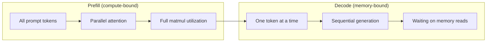
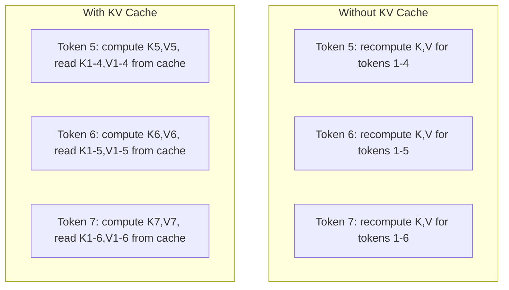
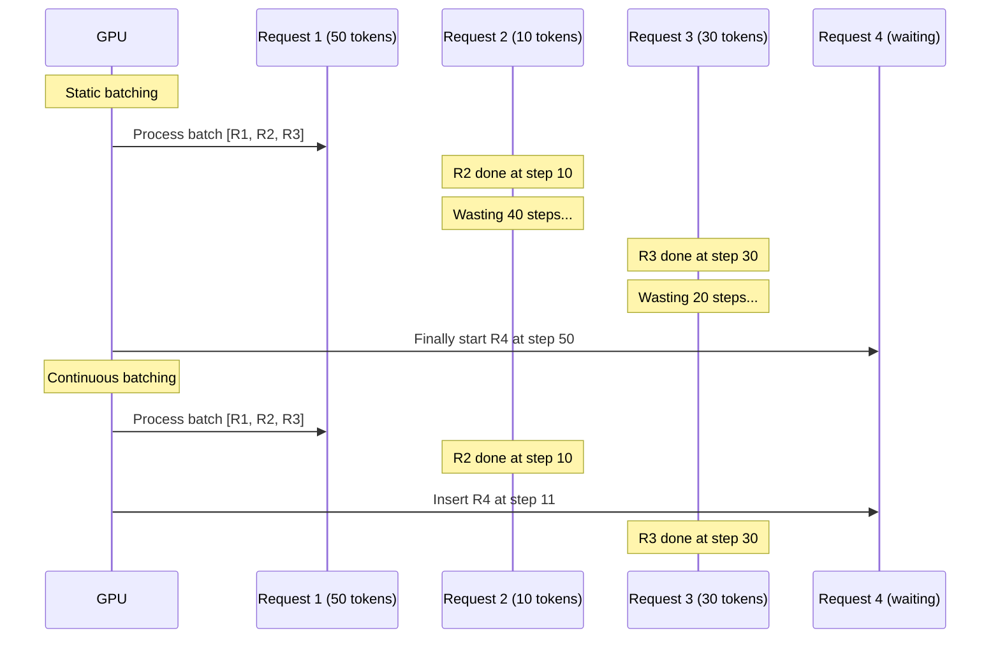
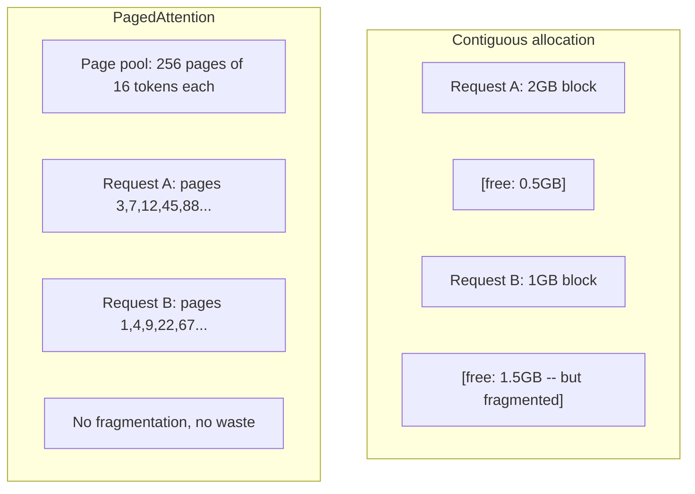
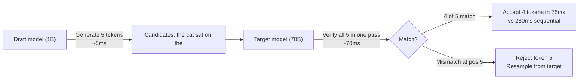

# 推論最佳化

> 兩個階段定義了 LLM 的推論。Prefill 平行處理你的 prompt——受限於算力。Decode 一次生成一個 token——受限於記憶體頻寬。每一項最佳化技術都針對其中之一或兩者兼顧。

**Type:** Build
**Languages:** Python
**Prerequisites:** Phase 10, Lessons 01-08 (Transformer architecture, attention)
**Time:** ~120 minutes

## Learning Objectives｜學習目標

- 實作 KV 快取（KV-cache），消除自回歸 token 生成過程中的冗餘計算
- 解釋 LLM 推論中的 prefill 與 decode 階段，以及為何兩者面臨不同的瓶頸（算力受限 vs 記憶體頻寬受限）
- 實作連續批次處理（continuous batching）與 PagedAttention 概念，在並行請求下最大化 GPU 利用率
- 比較各種推論最佳化技術（KV 快取、推測解碼、FlashAttention）及其吞吐量／延遲權衡

## The Problem｜問題

你在 4 張 A100 GPU 上部署了 Llama 3 70B。單一使用者能獲得每秒約 50 個 token。感覺非常迅速。隨後 100 位使用者同時向端點發出請求，每個使用者的吞吐量暴跌至每秒 3 個 token。你每月高達 25,000 美元的 GPU 帳單，服務速度竟然比人類打字還慢。

模型本身在面對 1 個使用者還是 100 個使用者時並無不同。相同的權重、相同的架構、相同的數學運算。改變的是你如何排程這項工作。天真的推論方式浪費了 90% 以上可用的 GPU 算力。一位正在等待第 47 個 token 的使用者霸佔了整條批次槽位，而 GPU 記憶體匯流排在兩次矩陣乘法之間只能無所事事地閒置。與此同時，另一位新使用者的 2,000 token prompt 原本完全可以填補這段閒置時間來執行實質運算。

這不是規模問題，而是排程問題。本課介紹的技術——KV 快取、連續批次處理、PagedAttention、推測解碼（speculative decoding）、前綴快取（prefix caching）——正是將每月 2.5 萬美元的推論帳單，與服務相同流量、每月僅 5,000 美元的帳單區隔開來的關鍵所在。

vLLM 在 4xA100-80GB 上部署 Llama 3 70B 時，在低並行下每個使用者能達到約 50 TPS，而在 100 個並行請求下透過連續批次處理與 PagedAttention 仍能維持每個使用者 15 到 25 TPS。若缺少這些最佳化，相同硬體在該並行度下只能提供每位使用者 5 TPS。相同的 GPU、相同的模型，卻帶來了整整 4 倍的吞吐量提升。

## The Concept｜核心概念

### Prefill 與 Decode

每個 LLM 推論請求都包含兩個截然不同的階段。

**Prefill（預填）** 處理完整的輸入 prompt。所有 token 都是已知的，因此可以在整個序列上平行計算注意力。這是一個龐大的矩陣乘法——GPU 運算核心全力運轉。其瓶頸在於算力（compute-bound）：你的硬體每秒能提供多少 FLOPS。一張 A100 具備 312 TFLOPS（BF16）。在單張 A100 上為 70B 模型處理 4,096 token 的 prompt 大約需要 400 毫秒。

**Decode（解碼）** 一次生成一個輸出 token。每個新 token 都關注所有先前的 token，但每次前向傳遞僅產出一個 token。權重矩陣的大小與 prefill 期間完全相同，但你現在是用它們去乘以一個向量而非整個矩陣。GPU 核心在微秒內完成運算，接著便只能乾等下一批權重從記憶體送達。其瓶頸在於記憶體頻寬（memory-bound）：你能以多快的速度將模型權重從 HBM 串流傳輸至運算單元。一張 A100 擁有 2 TB/s 的頻寬。一個 FP16 的 70B 模型大小為 140 GB。將完整模型讀取一次就需要 70 毫秒——這就是單次 decode 步驟的時間下限。



**運算位元組比（ops:byte ratio，亦稱算術強度）** 捕捉了這項權衡。它衡量從記憶體載入每位元組資料所執行的運算次數：

```
ops:byte ratio = FLOPs per token / bytes read from memory
```

在批次為 4,096 token 的 prefill 期間，每載入一個權重約執行 4,096 次乘累加運算。該比率很高——處於算力受限（compute-bound）。在批次為 1 的 decode 期間，載入每個權重僅執行約 1 次運算。該比率極低——處於記憶體受限（memory-bound）。

核心洞見在於：*decode 之所以受到記憶體頻寬限制，是因為你讀取了整個模型僅為了產出一個 token*。以下介紹的每項最佳化，不是減少你所讀取的資料量，就是增加每次讀取所能處理的 token 批次，或者徹底避免重複讀取。

### KV 快取（KV Cache）

在計算注意力時，每個 token 的 query 都會關注先前所有 token 的 key 與 value 向量。如果沒有快取，生成第 N 個 token 就必須為先前的所有 N-1 個 token 重新計算 key 與 value 投影。生成第 2 個 token 時投影第 1 個 token，生成第 3 個 token 時再投影一次，生成第 4 個 token 時又投影一次。到了第 1,000 個 token 時，你已經將第 1 個 token 重複投影了整整 999 次。

KV 快取儲存了先前所有 token 的 key 與 value 投影。生成第 N 個 token 時，你只需計算第 N 個 token 的 key 與 value，隨後將其與先前快取的 token 1 到 N-1 的 K/V 串接。



**KV 快取記憶體公式：**

```
KV cache size = 2 * num_layers * num_kv_heads * head_dim * seq_len * bytes_per_param
```

對於 Llama 3 70B（80 層、8 個 GQA KV 頭、head_dim=128、BF16 精度）：

```
per token: 2 * 80 * 8 * 128 * 2 bytes = 327,680 bytes = 320 KB
at 4,096 tokens: 320 KB * 4,096 = 1.28 GB
at 128K tokens: 320 KB * 131,072 = 40 GB
```

單一對話在 128K 脈絡下，光是 Llama 3 70B 的 KV 快取就要吃掉 40 GB——相當於半張 A100 的全部記憶體。當 100 位並行使用者各使用 4K token 時，光是 KV 快取就高達 128 GB。這就是為何 KV 快取管理是推論最佳化的核心挑戰。

### 連續批次處理（Continuous Batching）

靜態批次處理（static batching）等待 N 個請求湊齊成批後一起處理，並等待*所有*請求全數完成後才接收新請求。如果一個請求需要 500 個 token，而另一個只需要 10 個 token，較短的請求在完成後只能在接下來的 490 個 decode 步驟中空轉等待。

連續批次處理（亦稱迭代級批次處理，iteration-level batching）只要有任何請求完成，就會立即將新請求插入批次中。在每一個 decode 步驟都會重新評估整個批次。一個在 10 個 token 後結束的請求，會立刻被等待隊列中的新請求所取代。



吞吐量的提升幅度取決於輸出長度的變異程度。若輸出長度完全均勻，連續批次與靜態批次無異；但在常見的長度各異情境下，連續批次能帶來 2 到 5 倍的吞吐量提升，因為 GPU 的運算槽位永遠不會閒置。

### PagedAttention

每個請求的 KV 快取原本都是一整塊連續的記憶體。隨著請求的進入與結束，記憶體會產生碎片化——這與作業系統中的 RAM 碎片完全一樣。一個 4K token 的請求需要 1.28 GB 的連續空間。即使你總共剩下 2 GB 空閒記憶體，但若沒有 1.28 GB 的**連續**區塊，你不是浪費記憶體就是只能拒絕該請求。

vLLM 提出的 PagedAttention 將作業系統的虛擬記憶體概念搬到了 KV 快取上。它不再為每個請求分配單一連續區塊，而是分配固定大小的「分頁（pages）」（通常每頁 16 個 token）。分頁可以分散在實體 GPU 記憶體的任何位置。分頁表（page table）負責將每個請求的邏輯序列位置映射到實體分頁位置。



PagedAttention 還能為共享前綴實現**寫入時複製（copy-on-write）**。若 50 個請求共享同一個 system prompt，該 system prompt 的 KV 快取分頁只需儲存一次，並由這 50 個請求共同引用。只有當請求產生分歧（不同的使用者訊息）時，它才會被分配屬於自己的分頁。這對帶有共享系統設定的應用大幅削減了記憶體開銷。

vLLM 回報透過 PagedAttention 將記憶體浪費壓至近乎為零（約 4%，對比天真分配下的約 60% 到 80%）。

### 推測解碼（Speculative Decoding）

Decode 緩慢是因為它是循序進行的——你生成一個 token，餵回輸入，再生成下一個。但如果能先以極低成本猜測接下來的 5 個 token，然後一口氣驗證它們呢？

推測解碼使用輕量快速的**草稿模型（draft model）**預測 K 個候選 token。隨後龐大的**目標模型（target model）**在單次前向傳遞中一次處理所有 K 個候選（這在計算上形同 prefill——平行、受限於算力且極有效率）。如果目標模型認可草稿模型的預測，你就能在單次目標模型前向傳遞的時間內一口氣接受全部 K 個 token。若在位置 j 出現歧異，則接受前 j-1 個 token 並捨棄其餘部分。



加速幅度取決於**接受率（acceptance rate）**——草稿模型與目標模型預測一致的頻率。以 Llama 3 8B 為 Llama 3 70B 擔任草稿模型時，在自然語言上的接受率通常為 70% 到 85%，這直接轉化為 2 到 3 倍的 decode 加速。

推測解碼的三種主要途徑：

| 方法 | 草稿來源 | 接受率 | 額外開銷 |
|--------|-------------|-----------------|----------|
| 草稿-目標架構（Leviathan 等人） | 獨立的小型模型 | 70-85% | 草稿模型佔用記憶體 |
| EAGLE（Li 等人） | 目標模型頂層的輕量輸出頭 | 75-90% | 約 1% 額外參數量 |
| N-gram 查表 | Token n-gram 雜湊表 | 40-60% | 微乎其微 |

**EAGLE** 在目標模型的隱藏狀態之上訓練一個微小的自回歸輸出頭。它使用目標模型倒數第二層的特徵來預測下一個 token 的 embedding。由於它直接在目標模型本身的表示上運作，因此能以極少的額外記憶體取得更高的接受率。EAGLE-2 更進一步加入了動態草稿樹，依語境自動調整候選數量。

**N-gram 推測解碼** 維護目前語境或預先建構語料庫的 n-gram 接續表。若草稿與對話先前出現過的內容相符（重複模式、程式碼、結構化輸出），它不需要神經網路就能瞬間發動。雖然平均接受率較低，但每次猜測的運算開銷幾乎為零。

推測解碼在**數學上是完全等價的**——其輸出分布與目標模型原始分布百分之百相同，絕非近似演算法。驗證步驟確保了每個被接受的 token 其出現機率與目標模型親自生成毫無二致。

### 前綴快取（Prefix Caching）

大量請求共享完全相同的前綴：聊天機器人的 system prompt、RAG 檢索到的背景知識區塊、few-shot 範例集。若沒有前綴快取，每個請求都必須從零開始為這些重複 token 重新計算 KV 快取。

前綴快取儲存了常見前綴的 KV 快取，並跨請求重複使用。當帶有已知前綴的新請求到達時，系統直接引用已快取的 KV，只需為獨特的後綴部分計算 KV。

對於一個所有請求共享的 2,000 token system prompt，前綴快取為每個請求省去了約 400 毫秒的 prefill。在每秒 100 個請求下，每秒可省下 40 秒的 GPU 運算時間，相當於超過一張 GPU 的工作量。

SGLang 的 RadixAttention 利用基數樹（radix tree / trie）以 token 內容為索引實作前綴快取。任何匹配既有前綴的請求都能免費取得 KV 快取。該架構支援部分匹配——若你與快取條目共享 2,000 個前綴 token 中的 1,500 個，你就能直接重複使用這 1,500 個，只需為剩下的 500 個重新計算。

### 推論引擎

三大引擎主導了生產級 LLM 的服務部署：

| 引擎 | 核心創新 | 最佳適用場景 |
|--------|---------------|----------|
| vLLM | PagedAttention、連續批次處理 | 通用模型服務、最高的相容性與生態整合 |
| SGLang | RadixAttention（前綴快取）、結構化生成 | 多回合對話機器人、約束解碼與工具呼叫 |
| TensorRT-LLM | NVIDIA 核心融合、原生 FP8 量化 | 在 NVIDIA 硬體上榨乾單卡極致吞吐量 |

**vLLM** 是預設的首選起點。它支援最廣泛的模型架構，可在任何 GPU 廠商（NVIDIA、AMD、Intel）上執行，並透過 PagedAttention + 連續批次處理提供強勁吞吐量。其相容於 OpenAI 的 API 介面意味著能無縫抽換既有程式碼。

**SGLang** 建立在與 vLLM 相同的基礎之上，但加入了用於前綴快取的 RadixAttention 以及用於結構化 LLM 程式的領域特定語言。如果你的工作負載涉及多回合對話、工具使用或約束解碼（JSON 輸出、正規表示式引導生成），SGLang 透過前綴重複使用往往能比 vLLM 快上 2 到 5 倍。

**TensorRT-LLM** 將模型編譯為經過深度最佳化的 NVIDIA GPU 核心。它能融合各項操作（將注意力 + 線性層 + 活化函數融合至單一核心）、在 H100 GPU 上運用原生 FP8，並與 NVIDIA Triton Inference Server 整合。它在 NVIDIA 硬體上具備最高的單卡極致效能，但設定較為複雜且僅限 NVIDIA 平台。

Llama 3 70B（4xA100-80GB，BF16）的實際測試數字：

| 指標 | vLLM | SGLang | TensorRT-LLM |
|--------|------|--------|---------------|
| 吞吐量（單一使用者） | ~50 TPS | ~55 TPS | ~65 TPS |
| 吞吐量（100 位使用者） | 總計 ~2,500 TPS | 總計 ~3,200 TPS | 總計 ~3,000 TPS |
| 首字延遲（TTFT） | ~400ms | ~300ms（前綴命中） | ~350ms |
| 最大脈絡長度 | 128K | 128K | 128K |

### 運算位元組比分析架構

無法衡量的東西就無法最佳化。運算位元組比（ops:byte ratio）告訴你當前處於算力瓶頸還是頻寬瓶頸，這決定了哪些最佳化措施才真正有效。

```
Compute roof: peak FLOPS of the GPU
Memory roof:  peak bandwidth * ops:byte ratio
```

當 ops:byte 較低時（decode 階段、小批次），你會撞上記憶體頻寬上限。此時增加更多算力（更高時脈、更多核心）毫無助益。你需要減少記憶體讀取（量化、KV 快取壓縮），或是增加批次大小，將讀取開銷分攤到更多有價值的運算上。

當 ops:byte 較高時（prefill 階段、大批次），你會撞上算力天花板。記憶體頻寬最佳化毫無用武之地。你需要更快速的 GPU、核心融合，或是降低精度以擠出更多 FLOPS。

| 場景 | ops:byte | 瓶頸類型 | 最佳化手段 |
|----------|----------|-------|---------------|
| Prefill，批次=1 | ~4,096 | 算力受限（Compute） | 核心融合、FP8 |
| Decode，批次=1 | ~1 | 記憶體頻寬受限（Memory） | 量化、KV 快取壓縮 |
| Decode，批次=32 | ~32 | 記憶體頻寬受限（Memory） | 更大批次、連續批次處理 |
| Decode，批次=256 | ~256 | 處於過渡交界 | 兩者皆重要 |
| Decode，批次=1024 | ~1,024 | 算力受限（Compute） | 核心融合、張量平行 |

在 A100 上的交界平衡點大約是 ops:byte = 156（312 TFLOPS / 2 TB/s）。低於 156 屬於記憶體頻寬受限；高於 156 則屬於算力受限。連續批次處理透過在每次迭代中打包更多 token，有力地將 decode 階段推向這個交界點。

```figure
context-window-slide
```

## Build It｜動手實作

### 步驟 1：從零打造 KV 快取

我們建構一個多頭 KV 快取，在每一層、每個頭儲存 key 與 value 投影，並展示其記憶體增長模式。

```python
import numpy as np

class KVCache:
    def __init__(self, num_layers, num_heads, head_dim, max_seq_len, dtype=np.float16):
        self.num_layers = num_layers
        self.num_heads = num_heads
        self.head_dim = head_dim
        self.max_seq_len = max_seq_len
        self.dtype = dtype

        self.k_cache = np.zeros(
            (num_layers, num_heads, max_seq_len, head_dim), dtype=dtype
        )
        self.v_cache = np.zeros(
            (num_layers, num_heads, max_seq_len, head_dim), dtype=dtype
        )
        self.seq_len = 0

    def update(self, layer_idx, new_keys, new_values):
        num_new = new_keys.shape[1]
        end = self.seq_len + num_new
        self.k_cache[layer_idx, :, self.seq_len:end, :] = new_keys
        self.v_cache[layer_idx, :, self.seq_len:end, :] = new_values
        return (
            self.k_cache[layer_idx, :, :end, :],
            self.v_cache[layer_idx, :, :end, :]
        )

    def advance(self, num_tokens):
        self.seq_len += num_tokens

    def memory_bytes(self):
        return self.k_cache.nbytes + self.v_cache.nbytes

    def used_bytes(self):
        per_token = 2 * self.num_layers * self.num_heads * self.head_dim * np.dtype(self.dtype).itemsize
        return per_token * self.seq_len
```

### 步驟 2：結合 KV 快取的注意力機制

使用 KV 快取執行 decode 步驟的簡化版多頭注意力。

```python
def scaled_dot_product_attention(query, keys, values):
    head_dim = query.shape[-1]
    scores = np.matmul(query, keys.transpose(0, 1, 3, 2)) / np.sqrt(head_dim)
    seq_len_q = scores.shape[-2]
    seq_len_k = scores.shape[-1]
    if seq_len_q > 1:
        mask = np.triu(np.ones((seq_len_q, seq_len_k), dtype=np.float32), k=seq_len_k - seq_len_q + 1)
        scores = scores + mask * (-1e9)
    max_scores = np.max(scores, axis=-1, keepdims=True)
    exp_scores = np.exp(scores - max_scores)
    attn_weights = exp_scores / np.sum(exp_scores, axis=-1, keepdims=True)
    return np.matmul(attn_weights, values)


class MultiHeadAttention:
    def __init__(self, d_model, num_heads):
        self.num_heads = num_heads
        self.head_dim = d_model // num_heads
        scale = np.sqrt(2.0 / d_model)
        self.W_q = np.random.randn(d_model, d_model).astype(np.float32) * scale
        self.W_k = np.random.randn(d_model, d_model).astype(np.float32) * scale
        self.W_v = np.random.randn(d_model, d_model).astype(np.float32) * scale
        self.W_o = np.random.randn(d_model, d_model).astype(np.float32) * scale

    def forward(self, x, kv_cache=None, layer_idx=0):
        batch, seq_len, d_model = x.shape
        Q = np.matmul(x, self.W_q).reshape(batch, seq_len, self.num_heads, self.head_dim).transpose(0, 2, 1, 3)
        K = np.matmul(x, self.W_k).reshape(batch, seq_len, self.num_heads, self.head_dim).transpose(0, 2, 1, 3)
        V = np.matmul(x, self.W_v).reshape(batch, seq_len, self.num_heads, self.head_dim).transpose(0, 2, 1, 3)

        if kv_cache is not None:
            K_full, V_full = kv_cache.update(layer_idx, K[0], V[0])
            K = K_full[np.newaxis, :, :, :]
            V = V_full[np.newaxis, :, :, :]
            if seq_len == 1:
                kv_cache.advance(1)

        attn_out = scaled_dot_product_attention(Q, K, V)
        attn_out = attn_out.transpose(0, 2, 1, 3).reshape(batch, -1, d_model)
        return np.matmul(attn_out, self.W_o)
```

### 步驟 3：連續批次處理模擬器

模擬靜態批次與連續批次處理在排程上的效能差異。

```python
import heapq

class Request:
    def __init__(self, request_id, prompt_tokens, output_tokens, arrival_step):
        self.request_id = request_id
        self.prompt_tokens = prompt_tokens
        self.output_tokens = output_tokens
        self.arrival_step = arrival_step
        self.tokens_generated = 0
        self.start_step = None
        self.end_step = None

    def is_done(self):
        return self.tokens_generated >= self.output_tokens


def simulate_static_batching(requests, batch_size):
    step = 0
    completed = []
    queue = list(requests)
    queue.sort(key=lambda r: r.arrival_step)

    while queue:
        batch = []
        while queue and len(batch) < batch_size:
            r = queue.pop(0)
            r.start_step = max(step, r.arrival_step)
            batch.append(r)

        if batch:
            step = max(step, max(r.start_step for r in batch))
            max_output = max(r.output_tokens for r in batch)
            for r in batch:
                r.tokens_generated = r.output_tokens
                r.end_step = step + max_output
            step += max_output
            completed.extend(batch)

    return completed


def simulate_continuous_batching(requests, batch_size):
    step = 0
    completed = []
    queue = sorted(requests, key=lambda r: r.arrival_step)
    queue_idx = 0
    active = []
    waiting = []

    while queue_idx < len(queue) or active or waiting:
        while queue_idx < len(queue) and queue[queue_idx].arrival_step <= step:
            waiting.append(queue[queue_idx])
            queue_idx += 1

        while waiting and len(active) < batch_size:
            r = waiting.pop(0)
            r.start_step = step
            active.append(r)

        if not active:
            if waiting:
                step += 1
                continue
            elif queue_idx < len(queue):
                step = queue[queue_idx].arrival_step
                continue
            else:
                break

        for r in active:
            r.tokens_generated += 1

        done = [r for r in active if r.is_done()]
        for r in done:
            r.end_step = step + 1
            completed.append(r)
        active = [r for r in active if not r.is_done()]

        step += 1

    return completed


def batching_stats(completed):
    latencies = [r.end_step - r.arrival_step for r in completed]
    total_time = max(r.end_step for r in completed) - min(r.arrival_step for r in completed)
    total_tokens = sum(r.output_tokens for r in completed)
    return {
        "avg_latency": np.mean(latencies),
        "p50_latency": np.median(latencies),
        "p99_latency": np.percentile(latencies, 99),
        "total_time": total_time,
        "throughput": total_tokens / total_time if total_time > 0 else 0,
    }
```

### 步驟 4：前綴快取

基於基數樹（Trie）的前綴快取，儲存共享前綴的 KV 條目。

```python
class TrieNode:
    def __init__(self):
        self.children = {}
        self.kv_data = None
        self.hit_count = 0


class PrefixCache:
    def __init__(self, max_entries=1000):
        self.root = TrieNode()
        self.max_entries = max_entries
        self.total_entries = 0
        self.hits = 0
        self.misses = 0

    def _walk(self, token_ids):
        node = self.root
        depth = 0
        for tid in token_ids:
            if tid not in node.children:
                break
            node = node.children[tid]
            depth += 1
        return node, depth

    def lookup(self, token_ids):
        node, depth = self._walk(token_ids)
        if depth > 0:
            self.hits += 1
            current = self.root
            for tid in token_ids[:depth]:
                current = current.children[tid]
                current.hit_count += 1
            kv_entries = []
            current = self.root
            for tid in token_ids[:depth]:
                current = current.children[tid]
                if current.kv_data is not None:
                    kv_entries.append(current.kv_data)
            return depth, kv_entries
        self.misses += 1
        return 0, []

    def insert(self, token_ids, kv_per_token):
        node = self.root
        for i, tid in enumerate(token_ids):
            if tid not in node.children:
                if self.total_entries >= self.max_entries:
                    return i
                node.children[tid] = TrieNode()
                self.total_entries += 1
            node = node.children[tid]
            if i < len(kv_per_token):
                node.kv_data = kv_per_token[i]
        return len(token_ids)

    def hit_rate(self):
        total = self.hits + self.misses
        return self.hits / total if total > 0 else 0.0
```

### 步驟 5：推測解碼模擬器

我們模擬具備可配置接受率的草稿-目標推測解碼機制。

```python
class DraftModel:
    def __init__(self, vocab_size, acceptance_rate=0.8):
        self.vocab_size = vocab_size
        self.acceptance_rate = acceptance_rate

    def generate(self, context, num_tokens):
        tokens = np.random.randint(0, self.vocab_size, size=num_tokens)
        return tokens

    def get_probs(self, context, token):
        probs = np.random.dirichlet(np.ones(self.vocab_size))
        return probs


class TargetModel:
    def __init__(self, vocab_size):
        self.vocab_size = vocab_size

    def get_probs(self, context, tokens=None):
        if tokens is not None:
            return [np.random.dirichlet(np.ones(self.vocab_size)) for _ in tokens]
        return np.random.dirichlet(np.ones(self.vocab_size))


def speculative_decode(draft_model, target_model, context, num_speculative=5,
                       draft_cost=1.0, target_cost=10.0, verify_cost=12.0):
    total_tokens = 0
    total_cost = 0.0
    accepted_counts = []
    context = list(context)

    max_tokens = 100

    while total_tokens < max_tokens:
        draft_tokens = draft_model.generate(context, num_speculative)
        total_cost += draft_cost * num_speculative

        target_probs = target_model.get_probs(context, draft_tokens)
        total_cost += verify_cost

        accepted = 0
        for i, token in enumerate(draft_tokens):
            draft_p = draft_model.get_probs(context + list(draft_tokens[:i]), token)
            target_p = target_probs[i]

            r = np.random.random()
            acceptance_prob = min(1.0, target_p[token] / (draft_p[token] + 1e-10))

            if r < draft_model.acceptance_rate:
                accepted += 1
                context.append(token)
                total_tokens += 1
            else:
                new_token = np.random.choice(draft_model.vocab_size, p=target_p)
                context.append(new_token)
                total_tokens += 1
                break

        accepted_counts.append(accepted)

        if accepted == num_speculative:
            bonus_probs = target_model.get_probs(context)
            bonus_token = np.random.choice(draft_model.vocab_size, p=bonus_probs)
            context.append(bonus_token)
            total_tokens += 1

    sequential_cost = total_tokens * target_cost
    return {
        "total_tokens": total_tokens,
        "speculative_cost": total_cost,
        "sequential_cost": sequential_cost,
        "speedup": sequential_cost / total_cost if total_cost > 0 else 1.0,
        "avg_accepted": np.mean(accepted_counts),
        "acceptance_rate": np.mean(accepted_counts) / num_speculative,
    }


def compare_speculation_strategies(vocab_size=1000, num_trials=20):
    results = {}

    for name, acceptance_rate, spec_tokens in [
        ("Draft-target (8B->70B)", 0.78, 5),
        ("EAGLE", 0.85, 6),
        ("N-gram", 0.50, 4),
        ("No speculation", 0.0, 0),
    ]:
        if spec_tokens == 0:
            results[name] = {
                "speedup": 1.0,
                "acceptance_rate": 0.0,
                "avg_accepted": 0.0,
            }
            continue

        trial_results = []
        for _ in range(num_trials):
            draft = DraftModel(vocab_size, acceptance_rate=acceptance_rate)
            target = TargetModel(vocab_size)
            context = list(np.random.randint(0, vocab_size, size=10))
            result = speculative_decode(draft, target, context, num_speculative=spec_tokens)
            trial_results.append(result)

        results[name] = {
            "speedup": np.mean([r["speedup"] for r in trial_results]),
            "acceptance_rate": np.mean([r["acceptance_rate"] for r in trial_results]),
            "avg_accepted": np.mean([r["avg_accepted"] for r in trial_results]),
        }

    return results
```

### 步驟 6：KV 快取記憶體效能分析器

為真實模型配置計算 KV 快取的記憶體需求。

```python
MODEL_CONFIGS = {
    "Llama-3-8B": {
        "num_layers": 32, "num_kv_heads": 8, "head_dim": 128,
        "model_params_b": 8, "gqa": True,
    },
    "Llama-3-70B": {
        "num_layers": 80, "num_kv_heads": 8, "head_dim": 128,
        "model_params_b": 70, "gqa": True,
    },
    "Llama-3-405B": {
        "num_layers": 126, "num_kv_heads": 8, "head_dim": 128,
        "model_params_b": 405, "gqa": True,
    },
    "Mistral-7B": {
        "num_layers": 32, "num_kv_heads": 8, "head_dim": 128,
        "model_params_b": 7, "gqa": True,
    },
    "GPT-4-est": {
        "num_layers": 120, "num_kv_heads": 96, "head_dim": 128,
        "model_params_b": 1800, "gqa": False,
    },
}


def kv_cache_memory(config, seq_len, dtype_bytes=2):
    per_token = 2 * config["num_layers"] * config["num_kv_heads"] * config["head_dim"] * dtype_bytes
    total = per_token * seq_len
    return {
        "per_token_bytes": per_token,
        "per_token_kb": per_token / 1024,
        "total_bytes": total,
        "total_mb": total / (1024 ** 2),
        "total_gb": total / (1024 ** 3),
    }


def memory_budget(config, gpu_memory_gb, model_dtype_bytes=2, kv_dtype_bytes=2):
    model_memory_gb = config["model_params_b"] * 1e9 * model_dtype_bytes / (1024 ** 3)
    overhead_gb = gpu_memory_gb * 0.1
    available_for_kv = gpu_memory_gb - model_memory_gb - overhead_gb

    if available_for_kv <= 0:
        return {"error": "Model does not fit in GPU memory", "model_memory_gb": model_memory_gb}

    per_token = 2 * config["num_layers"] * config["num_kv_heads"] * config["head_dim"] * kv_dtype_bytes
    max_tokens = int(available_for_kv * (1024 ** 3) / per_token)

    return {
        "gpu_memory_gb": gpu_memory_gb,
        "model_memory_gb": round(model_memory_gb, 1),
        "overhead_gb": round(overhead_gb, 1),
        "available_for_kv_gb": round(available_for_kv, 1),
        "max_total_tokens": max_tokens,
        "max_users_at_2k": max_tokens // 2048,
        "max_users_at_4k": max_tokens // 4096,
        "max_users_at_32k": max_tokens // 32768,
    }
```

## Use It｜實際應用

使用 vLLM：

```python
from vllm import LLM, SamplingParams

llm = LLM(
    model="meta-llama/Meta-Llama-3-70B-Instruct",
    tensor_parallel_size=4,
    enable_prefix_caching=True,
    max_model_len=8192,
    gpu_memory_utilization=0.9,
)

params = SamplingParams(temperature=0.7, max_tokens=256)
outputs = llm.generate(["Explain inference optimization in one paragraph."], params)
```

使用 SGLang 進行前綴快取與結構化輸出：

```python
import sglang as sgl

@sgl.function
def classify(s, text):
    s += sgl.system("You are a classifier. Output JSON only.")
    s += sgl.user(f"Classify this text: {text}")
    s += sgl.assistant(sgl.gen("result", regex=r'\{"label": "(positive|negative|neutral)"\}'))

runtime = sgl.Runtime(model_path="meta-llama/Meta-Llama-3-70B-Instruct", tp_size=4)
sgl.set_default_backend(runtime)

results = classify.run_batch([
    {"text": "This product is amazing!"},
    {"text": "Terrible experience."},
    {"text": "It was okay I guess."},
])
```

使用 TensorRT-LLM：

```python
import tensorrt_llm
from tensorrt_llm.runtime import ModelRunner

runner = ModelRunner.from_dir("./llama-70b-trt-engine/", rank=0)

outputs = runner.generate(
    batch_input_ids=[tokenizer.encode("Explain KV caching.")],
    max_new_tokens=256,
    temperature=0.7,
)
```

## Ship It｜交付成果

本課產出：
- `outputs/skill-inference-optimization.md`——用於診斷與最佳化 LLM 推論服務的專業 skill

## Exercises｜練習

1. 修改 KV 快取分析器以比較 FP16、FP8 與 INT4 的 KV 快取量化。對於 4K 脈絡下的 Llama 3 70B，計算在 4xA100-80GB 上每種精度所能支援的最大並行使用者數。INT4 量化應能將使用者容量提升約 4 倍。

2. 擴展連續批次處理模擬器以追蹤 GPU 利用率（每步被填滿的批次槽位比例）。在輸出長度遵循帕雷托分布（Pareto distribution，shape=1.5，scale=20）的 50 個請求下，繪製靜態批次與連續批次的利用率時間曲線。連續批次應能維持 80% 以上的利用率。

3. 實作分組查詢注意力（Grouped-Query Attention，GQA）版本的 KV 快取，其中 `num_kv_heads < num_query_heads`。Llama 3 70B 使用 64 個 query 頭但只有 8 個 KV 頭。計算相對於全多頭注意力的記憶體節省（KV 快取體積減少 8 倍）。

4. 建構採用 LRU 淘汰機制的前綴快取。將 max_entries 設為 500，並生成 1,000 個請求，其中 60% 共享 5 個常見前綴之一。測量命中率並與無限制快取進行比較。在良好的淘汰機制下，命中率應能維持在 55% 以上。

5. 擴展推測解碼模擬器以實作樹狀推測（EAGLE-2 風格）。與其使用單一條 K 個草稿 token 的鏈條，不如生成候選樹（例如 3 層、每層 2 個分岔 = 8 個葉節點候選）。比較每輪驗證接受的總 token 數相對於線性推測的表現。

## Key Terms｜關鍵術語

| 術語 | 常見說法 | 實際意義 |
|------|----------------|----------------------|
| Prefill（預填） | 「處理 prompt」 | 平行計算所有輸入 token 的注意力——受限於算力，因為全矩陣乘法讓 GPU 核心全速運轉 |
| Decode（解碼） | 「生成 token」 | 每次前向傳遞產出一個 token，每次皆需讀取完整模型權重——受限於記憶體頻寬，因為運算在下一批權重抵達前便已完成 |
| KV 快取（KV cache） | 「快取注意力狀態」 | 儲存先前所有 token 的 key 與 value 投影，避免在每個 decode 步驟中重複計算——以記憶體換取算力 |
| 連續批次處理（Continuous batching） | 「動態批次」 | 只要有任何請求結束便立即將新請求插入執行中的批次，在每個 decode 迭代進行評估而非等待整批結束 |
| PagedAttention | 「KV 快取的虛擬記憶體」 | 以固定大小分頁而非連續區塊分配 KV 快取，消除記憶體碎片化並支援共享前綴的寫入時複製 |
| 推測解碼（Speculative decoding） | 「草稿與驗證」 | 使用快速草稿模型預測多個 token，隨後在目標模型單次前向傳遞中一次驗證——數學上完全等價，提速 2 到 3 倍 |
| EAGLE | 「自我推測解碼」 | 推測解碼變體，在目標模型自身的隱藏狀態上訓練輕量輸出頭，獲得比獨立草稿模型更高的接受率 |
| 前綴快取（Prefix caching） | 「重複使用系統 prompt 的 KV」 | 儲存常見前綴（system prompt、few-shot 範例）計算好的 KV 快取條目並跨請求複用，跳過多餘的 prefill |
| 運算位元組比（Ops:byte ratio） | 「算術強度」 | 運算次數與記憶體讀取位元組數的比例——決定負載是算力受限（高比率）還是記憶體頻寬受限（低比率） |
| 首字延遲（Time to first token，TTFT） | 「TTFT」 | 從接收請求到產出第一個輸出 token 的延遲時間——長 prompt 下由 prefill 時間主導 |

## Further Reading｜延伸閱讀

- Kwon et al., "Efficient Memory Management for Large Language Model Serving with PagedAttention" (2023) ——推出分頁式 KV 快取管理的 vLLM 論文，如今已是推論服務的業界標準。
- Leviathan et al., "Fast Inference from Transformers via Speculative Decoding" (2023) ——奠基性的論文，證明草稿—驗證式推測能產生與目標模型完全一致的分布，同時達到 2-3 倍加速。
- Li et al., "EAGLE: Speculative Sampling Requires Rethinking Feature Uncertainty" (2024) ——透過在目標模型自身的特徵上訓練一個預測頭，而非使用獨立的草稿模型，達到更高的接受率。
- Zheng et al., "SGLang: Efficient Execution of Structured Language Model Programs" (2024) ——提出用於前綴快取的 RadixAttention，以及多次呼叫 LLM 程式的程式設計模型。
- Williams et al., "Roofline: An Insightful Visual Performance Model for Multicore Architectures" (2009) ——首篇 roofline 論文，將用於推理運算與記憶體瓶頸的 ops:byte 框架形式化。
