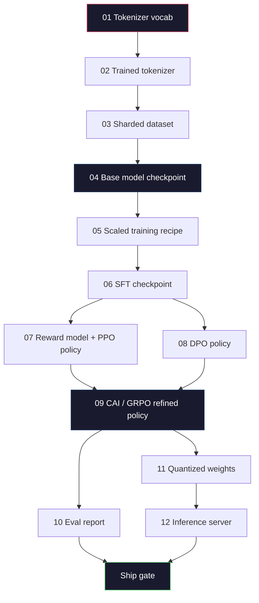
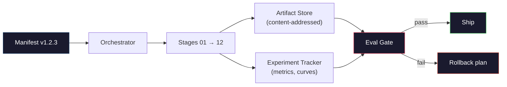

# 打造完整的 LLM 管線

> 第 1 課到第 12 課的每一樣東西，都只是單一管線中的一個階段。本課是將這些零散階段串聯為單一端到端執行的鷹架：tokenizer、預訓練、規模擴展、SFT、對齊、評估、量化、服務。你不會在筆記型電腦上訓練 70B 模型，但你將親手實作編排層、資訊清單（manifest）、評估閘門（eval gate）以及回滾計畫（rollback plan）——這正是 2026 年頂尖團隊用來決定模型能否發布交付的關鍵骨幹。這是總驗收專案。

**Type:** Build
**Languages:** Python (stdlib)
**Prerequisites:** All Phase 10 lessons 01-12
**Time:** ~120 minutes

## Learning Objectives｜學習目標

- 將先前的 11 門課程（tokenizer、資料、預訓練、規模擴展、SFT、RLHF、DPO、CAI、評估、量化、推論）組裝成單一具備可重現性的管線規格
- 定義各階段之間的產物契約（artifact contract）：每個階段接收什麼、產出什麼，以及下一個階段如何驗證輸入
- 打造一個追蹤實驗、計算產物雜湊值，並根據評估閾值進行發布決策閘門控制的編排器（orchestrator）
- 設計回滾計畫：辨識哪些產物重新執行的代價低廉、哪些代價極高，以及損毀的 checkpoint 所造成的具體損失

## The Problem｜問題

先前的每一課都能獨立運作。Tokenizer 訓練好了，迷你 GPT 預訓練完成了，SFT 資料集組裝好了，獎勵模型訓練完成了，DPO 跑通了，eval 量測出來了，量化權重匯出了，推論伺服器也架設起來了。但每一個都只是一個獨立的 notebook，各自擁有自己的命名慣例、輸出路徑與隨機種子。

尖端模型的訓練執行作業絕不是一個 notebook。Llama 3 405B 在大約 54 天內消耗了 3,000 萬個 H100 GPU 小時。DeepSeek-V3 消耗了大約 280 萬個 H800 GPU 小時。在這漫長的時間裡，單一損毀的 checkpoint、一次資料污染，或是一次 eval 指標回歸，都可能讓團隊損失整整一週的實際耗時，以及一個月的 GPU 預算。團隊賴以生存的法寶是嚴格的管線紀律：每個階段都擁有確定性的輸入、確定性的輸出、一份資訊清單、一個雜湊值，以及一道檢驗閘門。

這是總驗收專案。你不會在筆記型電腦上端到端跑完整個管線，但你將撰寫協調各階段的編排器、描述整個執行作業的資訊清單、把關發布決策的驗證器，以及讓第三方能憑單一檔案重現你所有成果的重播計畫。程式碼很精煉，背後的工程紀律要求卻很高。

這套模式從 1 億參數無縫擴展到 1 兆參數。運算 Llama 3 與運算你自己的玩具 GPT，背後依靠的是完全相同的四個核心元件——資訊清單、編排器、評估閘門、產物儲存庫。唯一的差別在於各階段設定檔中的數值大小，而非管線本身的骨幹架構。

## The Concept｜核心概念

### 十二個階段

第 10 階段的每一課都是一個階段。以下是完整的依賴圖（DAG）。



階段 07 與 08 可以平行執行。其他所有環節都存在嚴格的先後依賴關係。階段 02（tokenizer）的任何變更都會使下游的所有產物徹底作廢。階段 10（eval）的變更則僅影響最終的發布決策。

### 資訊清單（The Manifest）

資訊清單是一個單一檔案，足夠完整地描述一次執行，使其他人能夠完全重現它。管線產生的任何東西，都不應依賴未記錄在清單中的隱性狀態。欄位樸實無華且不可或缺：

```
pipeline_version: 1.2.3
seed: 42
git_commit: a1b2c3d4
stages:
  01_tokenizer:
    recipe: bpe_32k
    input_hash: sha256:...
    output_hash: sha256:...
    wall_clock_sec: 3600
    cost_usd: 12
```

階段 N 的輸出雜湊就是階段 N+1 的輸入雜湊。一旦出現任何偏差，管線立即中斷。這正是及早抓出資料損毀的方式，也是身處不同大洲的隊友驗證其重播是否產出與你完全一致產物的方法。

實務上，團隊會使用簡單的 YAML 綱要搭配一個清單檢查器，將當前結果與前一次成功的執行作業進行 diff 比對。預期欄位（成本、耗時）以外的任何差異都是危險信號。

### 產物型別化（Artifact Typing）

每個階段的輸出都是一個強型別的產物（typed artifact）。不是一個目錄雜湊包，不是一個 pickle 檔案，而是一個具備已知 schema 的具名型別。

| 階段 | 產物型別 | 關鍵欄位 |
|-------|--------------|-----------|
| 01-02 | Tokenizer | vocab.json、merges.txt、config.json、hash |
| 03 | Dataset | shards[]、列數、token 總數、去重複統計資訊 |
| 04-05 | Checkpoint | weights.safetensors、config.json、最佳化器狀態、步數 |
| 06 | SFT Model | checkpoint + SFT 配方 + 資料混合比例 |
| 07 | Reward Model | 獎勵模型 checkpoint + 偏好資料雜湊 |
| 08-09 | Policy | checkpoint + 參考模型雜湊 + beta + 消耗的 KL 預算 |
| 10 | Eval Report | 基準測試分數 + 回歸差異 + 評估資料雜湊 |
| 11 | Quantized Model | 量化權重 + 校準資料 + 相較於 FP16 的精度差異 |
| 12 | Server Spec | 端點 + 模型雜湊 + 設定檔 + 可觀測性掛鉤 |

型別化防止了最常見的低級錯誤：將階段 08 的輸出誤當作階段 06 的輸入，把 DPO 訓練後的模型誤送進 SFT 流程。強型別產物與強型別簽章讓這些失誤在編譯期錯誤，而不是在第五天才被發現。

### 評估閘門（The Eval Gate）

交付發布不等於「訓練跑完了」。交付是「訓練跑完了且評估閘門全數通過」。閘門在訓練開始前就已明文敲定：

```
gates:
  mmlu:      >= baseline + 0.5   # no regression
  humaneval: >= baseline + 1.0
  truthfulqa: >= baseline         # no drop
  safety_refusal_rate: <= 0.05
  kl_from_reference: <= 25.0
  cost_total_usd: <= 50000
```

每個閘門都是明確的數值門檻。沒有「看起來不錯」這種模稜兩可的標準，沒有主觀審批。若每個閘門皆通過，產物被標記為可發布；若任一閘門未過，該執行會被擱置，等待指定審閱者具名手動覆寫（且該覆寫紀錄會被寫入清單）。

兩道閘門能攔截絕大多數災難：**回歸閘門**（新模型在核心基準上必須至少與舊版本持平）能抓出訓練 bug；**KL 預算閘門**（對齊後的策略模型偏離參考模型不得超過 X）能抓出對齊過度的情況。每個正式環境管線都必備這兩者。

### 編排器（The Orchestrator）

一小段程式碼，負責讀取清單、分派階段、追蹤產物，並在任何契約被破壞時立即中止。這不是 Airflow，也不是 Kubeflow。為了維持管線流程可靠，你需要自己撰寫一段簡單直白的核心邏輯。

編排器的任務非常明確：

1. 從清單中解析出 DAG。
2. 針對每個階段，檢查預期輸出是否已經存在且雜湊相符（若相符則直接略過）。
3. 執行該階段，捕捉 stdout/stderr，測量耗時與成本。
4. 驗證輸出雜湊是否與下游階段的預期輸入雜湊一致。
5. 若失敗，寫出包含精確失敗階段的局部清單，並以非零狀態碼退出。

這只需大約 200 行 Python 程式碼，就如同本課的 `code/main.py`。在底層，真實管線會使用 `torchrun` 或 `ray` 在叢集上執行個別階段，但編排器本身只在一台機器上運作。

### 實驗追蹤與產物儲存

兩套外部系統穩固了整個管線：

**實驗追蹤器（wandb、neptune、mlflow）。** 記錄每階段的損失曲線、評估指標與系統遙測資料。當你需要比對三週前執行作業 A 與執行 B 的細節時，追蹤器就是你的去處。團隊幾乎都會使用代管服務——自己架設這套系統純屬浪費寶貴的訓練時間。

**產物儲存庫（S3、R2、GCS）。** 用於存放 checkpoints、資料集、tokenizers 與評估報告的不可變物件儲存。產物透過內容雜湊定址，而非檔名。像 `latest.pt` 這樣的檔名是極端危險的陷阱；`ckpt-7b-step-20000-sha256:abc123.safetensors` 才是穩固的契約。

編排器會同時寫入兩端：追蹤器供人類查看圖表，產物儲存庫供下游階段尋找輸入。

### 成本控制

頂尖訓練執行作業都附帶著驚人的美元數字。預算紀律在兩個節點發揮作用：

**執行前預估。** 根據清單計算預期 FLOPs（預訓練：6 x 參數量 x token 數）、預期 GPU 小時（FLOPs / 峰值吞吐量 / 利用率），以及按當前租賃費率計算的美元成本。若預估超出預算閘門，管線直接拒絕啟動。

**執行中追蹤。** 每個階段的耗時與成本都會記錄進清單。每階段完成後都會檢查剩餘預算。若某階段超支，下一階段的閘門會依照最新剩餘預算重新評估。你絕不會等到創投打電話催款時才發現錢花光了。

Llama 3 據報的主要預訓練成本為 6,100 萬美元，而 DeepSeek-V3 據報僅花費約 560 萬美元。這巨大的差距主要歸功於硬體效率與混合專家架構——但具體成本之所以清晰可見，是因為兩個團隊都是按階段而非整批粗估來追蹤成本。

### 可重現性 vs 確定性

這兩者截然不同。「可重現（Reproducible）」意味著相同的清單、相同的程式碼加上相同的基礎設施，能產出下游指標等價的 checkpoint。「確定性（Deterministic）」則意味著位元完全相同（bit-identical）。

現代 LLM 訓練具備可重現性，但不具備嚴格的確定性。分散式訓練中的 reduce 順序、GPU 核心的非確定性（cuBLAS、flash-attn），以及混合精度四捨五入，都會導致不同執行間的浮點數在 1e-5 層級產生微小差異。這對最終指標毫無影響（指標完全一致），但如果你試圖透過逐位元比對來除錯，這將是致命的。解方在於記錄每階段的輸入雜湊、輸出雜湊與核心指標——只要這些對得上，即便權重在位元層級不完全一致，該執行就算成功重現。



### 回滾計畫（Rollback Plan）

在執行開始前，就必須預先寫下各階段失敗時的應對措施。分為三大類別：

- **重新執行代價低廉**（數小時）：tokenizer、評估、量化、推論伺服器。直接重新執行即可。
- **中等**（數天）：SFT、DPO、CAI。保留基模型；僅重新執行對齊階段。
- **極其昂貴**（數週且耗資數百萬美元）：預訓練。此處的回滾計畫絕非「從頭重跑」，而是「回退至最後一個良好的 checkpoint，並以修正後的資料重新執行代價較低的下游階段」。

由於階段依賴已進行型別化與雜湊化，編排器能自動計算回滾集合：使失敗的階段及其所有後續子孫階段失效。階段 06（SFT）失敗會使 06、07、08、09、10、11、12 失效；階段 11（量化）失敗則僅使 11 與 12 失效。預先白紙黑字寫明，能避免團隊在凌晨四點精疲力竭時倉促做出錯誤決策。

### 2026 年的主流生產配方

絕大多數尖端團隊已趨同於相同的核心骨架：

- **Tokenizer**：12.8 萬詞彙表的 BPE 搭配位元組回退，在小型且平衡的多語言切片上訓練。
- **預訓練**：10 到 20 兆 token，主要是網路文字、程式碼與合成資料。採用 Muon 或 AdamW 最佳化器，FSDP2 或 DeepSpeed ZeRO-3，活化值檢查點，BF16 權重搭配 FP32 主權重。
- **SFT**：50 萬到 200 萬組指令配對，人類標註與合成資料混合，且與 eval 集進行嚴格去重複。
- **對齊**：DPO 或 CAI + GRPO。僅在偏好訊號維度過於複雜時才採用 RLHF。
- **評估**：MMLU-Pro、MATH、HumanEval+、GPQA、SWE-Bench Verified、LiveBench，加上大眾從未見過的私有保留測試集。
- **量化**：服務端採用 4 位元 GPTQ 或 AWQ，在精度差異會影響判斷的安全評估中採用 8 位元。
- **推論服務**：vLLM、TensorRT-LLM 或自研架構。連續批次處理、推測解碼、KV 快取淘汰。

數值每半年都在變，但這套架構骨骼始終如一。

```figure
beam-search
```

## Build It｜動手實作

本課的程式碼是一個編排器與清單檢查器，而非 12 個龐大的訓練腳本。每個階段都由一個能產生正確結構與雜湊產物的佔位符（placeholder）模擬。端到端執行此編排器，能在你把真金白銀砸向真實 GPU 之前，先驗證整個管線的管路完全暢通。

完整的實作請參閱 `code/main.py`。核心元件包括：

- `Manifest` dataclass：管線版本、種子、git commit、各階段、各閘門。
- `Stage` dataclass：名稱、型別、輸入（雜湊值）、輸出（雜湊值）、耗時、成本。
- `Orchestrator.run()`：解析 DAG、分派階段、驗證雜湊、更新清單。
- `EvalGate.check()`：讀取閾值、與最新評估報告比對、回傳通過／失敗。
- `ArtifactStore`（記憶體虛擬實作）：根據雜湊 put/get，模擬 S3。
- `CostTracker`：逐階段與累計成本追蹤，超出上限時中止。

`main.py` 中的管線會執行 12 個模擬階段、產生清單，並測試未通過的評估閘門以展示執行被擱置時的樣貌。將每個佔位符替換為相應課程中的真實訓練腳本，你就擁有了真實尖端團隊所使用的骨幹系統。

## Use It｜實際應用

標準工作流程包含三個核心指令：

```
python code/main.py plan    # validate manifest, compute cost estimate, print DAG
python code/main.py run     # execute stages, writing to manifest.out.yaml
python code/main.py gate    # read manifest.out.yaml, apply eval gates, ship-or-hold
```

每次務必先執行 `plan`。絕大多數管線 bug 在 plan 階段就會現形——缺少閘門閾值、陳舊雜湊值、預算超支。執行 `plan` 完全免費，執行 `run` 則代價高昂，在低成本階段及早抓出 bug 能替你省下巨額開銷。

`gate` 的輸出不是 `SHIP` 就是 `HOLD: <reason>`。被擱置的執行作業不是失敗，而是一個決策點：由具名審閱者進行手動覆寫（並記錄於清單），或是批准執行回滾計畫。

## Ship It｜交付成果

本課產出 `outputs/skill-llm-pipeline-reviewer.md`。提供一份提議的管線清單，它會全面檢核所有契約：階段型別化、雜湊鏈、評估閘門、回滾計畫與成本預估。它會嚴格拒絕批准缺少評估閘門、帶有無限 KL 預算，或是混雜了評估與訓練資料的清單。

## Exercises｜練習

1. 擴展編排器以支援階段 07 與 08 的平行執行。使用標準函式庫的 `concurrent.futures` 模組。確認最終清單記錄了兩個階段的輸出，且階段 09 的輸入雜湊是兩者的確定性組合。

2. 新增「污染檢查」閘門。給定評估資料集的雜湊與訓練資料集分片，計算其重疊比例（完全字串比對或 13-gram 比對）。若重疊超過 0.1% 則閘門判定失敗。輸入受污染的訓練集，確認閘門能成功擱置該執行。

3. 從第一原理實作成本估算器。針對階段 04（預訓練），估算 FLOPs 為 6 x 參數量 x token 數，假設在 989 TFLOPs BF16 的 H100 上達到 40% MFU（模型 FLOPS 利用率），每 GPU 小時費率為 2.50 美元。計算在 2 兆 token 上訓練 7B 模型的預估成本，並與公開的 Llama 2 數字進行比對。

4. 建構局部回滾機制。模擬階段 09（CAI）發生失敗，隨後重新執行階段 09 到 12，同時保留階段 01 到 08 的快取產物。編排器應能透過雜湊偵測已快取的產物並予以略過。測量相較於全量重跑所節省的實際耗時。

5. 導入可觀測性。為每個階段發出 OpenTelemetry spans，帶有參數量、已處理 token、損失值與成本等屬性。將 spans 傳遞至本機收集器。重點不在於精美儀表板，而在於每階段的健康狀態都能從單一 trace ID 完整追溯。

## Key Terms｜關鍵術語

| 術語 | 常見說法 | 實際意義 |
|------|----------------|----------------------|
| 資訊清單（Manifest） | 「配方檔案」 | 描述管線版本、隨機種子、逐階段設定與閘門閾值的 YAML 或 JSON——足以完整重播一次執行作業 |
| 內容定址（Content-addressed） | 「依雜湊而非檔名儲存」 | 根據內容的 SHA-256 儲存產物，確保絕對不會混淆版本 A 與版本 B |
| 評估閘門（Eval gate） | 「發布標準」 | 在基準測試與安全評分上的明確數值門檻，產物必須全數通過才能標記為可交付發布 |
| KL 預算（KL budget） | 「對齊偏離了多遠」 | 跨對齊階段累積的 KL(policy || reference) 上限，以閘門形式進行硬性約束 |
| MFU | 「GPU 利用率有多高」 | 模型 FLOPS 利用率（Model FLOPs Utilization）——實際達到的 FLOPs 除以理論峰值。70B 規模下典型約為 40%，7B 約為 55% |
| 回滾計畫（Rollback plan） | 「出問題時怎麼辦」 | 預先針對每個階段寫好的失敗應對措施：重新執行、版本回退，或是以修正後的輸入重新訓練 |
| 編排器（Orchestrator） | 「指揮家」 | 讀取清單、分派各階段、驗證雜湊，並在契約被破壞時立即中止的常駐程序 |
| 產物儲存庫（Artifact store） | 「存放權重的版本化 S3」 | 不可變的內容定址物件儲存——Checkpoints、資料集與評估報告的唯一真實來源 |
| 可重現（Reproducible） | 「重跑有一樣的指標」 | 位元層級權重可能微小不同，但下游評估指標完全等價——分散式 LLM 訓練的真實追求目標 |
| 成本閘門（Cost gate） | 「花費不能超過 X」 | 執行前成本預估加上執行中追蹤器——若預估超過預算上限，管線直接拒絕啟動 |

## Further Reading｜延伸閱讀

- [Dubey et al., 2024 -- "The Llama 3 Herd of Models"](https://arxiv.org/abs/2407.21783) ——關於尖端管線最詳盡的公開論文，涵蓋資料、訓練、對齊與評估
- [DeepSeek-AI, 2024 -- "DeepSeek-V3 Technical Report"](https://arxiv.org/abs/2412.19437) ——極致效率導向的管線，成本僅為 Llama 3 等級訓練的約十分之一
- [Kaplan et al., 2020 -- "Scaling Laws for Neural Language Models"](https://arxiv.org/abs/2001.08361) ——定義算力-資料-參數經典縮放關係的開創性研究
- [Hoffmann et al., 2022 -- "Training Compute-Optimal Large Language Models (Chinchilla)"](https://arxiv.org/abs/2203.15556) ——重新校準現代資料預算、修正 Kaplan 定律的 Chinchilla 論文
- [PyTorch FSDP2 文件](https://pytorch.org/docs/stable/fsdp.html) ——在 PyTorch 2.4+ 中取代 FSDP1 的新世代分散式訓練原語
- [Weights & Biases LLM Reports](https://wandb.ai/site/solutions/llms/) ——開源 LLM 執行的真實資訊清單與實驗追蹤輸出，極佳的參考範本
