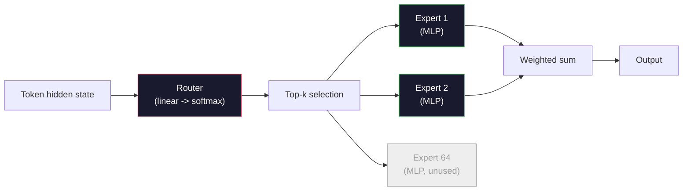

# 開源模型：架構導覽

> 你在第 4 課從零打造了 GPT-2 Small。2026 年的尖端開源模型本質上都屬於同一個家族，只是帶有五到六處具體的改進：以 RMSNorm 取代 LayerNorm、以 SwiGLU 取代 GELU、以 RoPE 取代學習得來的位置編碼、以 GQA 或 MLA 取代完整的 MHA，以及在大規模下引入混合專家（MoE）。你已經掌握的數學原理足以涵蓋其中 95% 的內容。本課將並列審視 Llama 3、DeepSeek-V3、Mixtral、Qwen 與 Gemma，精確指出每個架構分道揚鑣的關鍵點。

**Type:** Learn
**Languages:** Python (stdlib)
**Prerequisites:** Phase 10, Lessons 04, 05, 12 (Pre-training, Scaling, Inference)
**Time:** ~45 minutes

## Learning Objectives｜學習目標

- 閱讀 Llama 3、Mistral、Mixtral、Gemma 2、Qwen 2.5 與 DeepSeek-V3 的 config.json，並能解釋其中的每一個欄位
- 指出每個模型相對於 GPT-2 Small 所做的具體架構變革，並從第一原理說明其合理依據
- 僅憑設定檔即可計算任何開源模型的參數量、KV 快取大小與活化值記憶體需求
- 給定延遲、記憶體與能力限制，為部署目標挑選合適的開源模型

## The Problem｜問題

在第 4 課中，你寫了 350 行 numpy 程式碼，得到了一個 GPT-2 形狀的模型。而 Llama 3 405B 卻附帶了一份長達 200 頁的技術報告。你的第一直覺是：這兩者肯定是完全不同的架構怪物。但事實並非如此。那 200 頁描述的依然是同一個物件，只帶有五到六處經過深思熟慮的修改，外加成千上萬項關於規模擴展的工程實作細節。核心骨架——embedding、transformer 區塊、注意力機制、MLP、正規化、輸出頭——架構骨幹保持不變。

本課本質上是一份架構 diff。針對每個主流開源模型家族，我們列出它相對於 GPT-2 到底改變了什麼、背後的原因是什麼，以及付出了什麼代價。學完之後，當你面對一份全新的模型卡（model card），就能在腦海中輕易將其映射回 GPT-2 基準線。

其深遠的實務價值在於：當 Meta 發布 Llama 5 或 DeepSeek 發布 V4 時，你不需要重建新的心智模型。你只需檢視其設定檔，看看六個常見旋鈕中哪些被撥動了，就能立即明瞭其下游影響。2026 年的架構本質上是一個有限的工具箱，每個新模型只是從中挑選了不同的子集。

## The Concept｜核心概念

### 不變的核心

所有自回歸開源模型都共享：

- Token embedding 矩陣（vocab_size x hidden_dim）。
- N 個解碼器區塊的堆疊：正規化、自注意力機制、殘差連接、正規化、MLP、殘差連接。
- 最終正規化層與線性輸出頭，投影回 vocab_size（通常與 embedding 權重綁定）。
- 因果遮罩、下一個 token 交叉熵損失。

這就是永恆的骨架。其餘全都是可調旋鈕。

### 真正會動的六個旋鈕

在 2024 至 2026 年的所有頂尖開源模型中，翻來覆去被挑選的始終是這六個設計決策：

1. **正規化方法。** LayerNorm -> RMSNorm。
2. **位置編碼。** 學習得來的絕對位置 -> RoPE（加上變體：YaRN、NTK）。
3. **活化函數。** GELU -> SwiGLU（或 GeGLU）。
4. **注意力頭共享模式。** MHA -> GQA -> MQA -> MLA。
5. **稠密 vs 稀疏 MLP。** 稠密（Dense）-> 混合專家（Mixture-of-Experts，MoE）。
6. **Pre-norm 位置。** Pre-norm 被確立下來，Post-norm 已徹底絕跡。

其他一切（學習率排程、資料混合配比、批次大小、脈絡長度）都屬於訓練設定，而非模型架構。只有這六個核心旋鈕。

### 旋鈕 1：RMSNorm

LayerNorm 減去平均值、除以標準差、縮放並平移。RMSNorm 則僅保留縮放：

```
RMSNorm(x) = x / sqrt(mean(x^2) + eps) * gamma
```

不需減去平均值，沒有偏置項。每個 token 減少了一次矩陣運算。Zhang 與 Sennrich（2019 年）證明它在機器翻譯上能匹敵 LayerNorm 的品質，同時速度快上 10%。每個現代開源模型都採用了它。

代價：無。收益：微幅吞吐量提升，程式碼更精簡。

### 旋鈕 2：RoPE

GPT-2 中的位置 embedding 是一個擁有 1024 個槽位的查表。當脈絡達到 1025 時，就會超出查表範圍。模型完全無法外推到超過訓練長度的文本。

旋轉位置編碼（Rotary Position Embedding，RoPE，Su 等人，2021 年）在計算注意力內積之前，將每個 Q 與 K 向量成對進行旋轉。旋轉的角度是位置的確定性函數，因此沒有任何需要學習的參數，也永遠不會有用盡的一天。搭配縮放技巧（內插（interpolation）、YaRN），在 8k 脈絡下訓練的模型可以在推論時延伸至 128k，且精度損失微小。

```
q_rotated = rotate(q, angle(pos))
k_rotated = rotate(k, angle(pos))
score = q_rotated . k_rotated
```

Llama、Mistral、Qwen、DeepSeek 與 Gemma 全數採用 RoPE。Gemma 2 採用了混合架構（多數層採用 RoPE，其餘層採用局部滑動視窗注意力）。

### 旋鈕 3：SwiGLU

GPT-2 的 MLP 是 `x -> gelu(xW1 + b1) -> (...)W2 + b2`。SwiGLU（Shazeer，2020 年）以門控乘積取代該活化函數：

```
SwiGLU(x) = (xW1) * sigmoid(xW1) * xV
```

以兩個平行投影取代原本的單一投影，並由 Swish 活化函數進行門控。實證顯示在單位參數的困惑度表現上顯著更強。Llama 2 率先採用，隨後所有模型相繼跟進。MLP 的隱藏層大小通常會經過調整，以確保總參數量與原本的稠密 MLP 相當：若 GPT-2 採用 `ff_dim = 4 * hidden`，SwiGLU 通常會設定為 `ff_dim = (2/3) * 4 * hidden = 8/3 * hidden`。

### 旋鈕 4：注意力頭共享模式

GPT-2 採用**多頭注意力（MHA）**：每個頭都擁有自己專屬的 Q、K、V 投影。

**多查詢注意力（MQA，Shazeer，2019 年）** 跨所有頭共享同一組 K 與 V。這將 KV 快取縮減了 num_heads 倍（在典型模型中可縮減 12 到 32 倍），但在高難度基準測試上精準度略有下滑。

**分組查詢注意力（GQA，Ainslie 等人，2023 年）** 找到了折衷的甜蜜點：由 G 個 Q 頭組成的群組共享同一組 K 與 V。Llama 3 8B 採用 GQA，具有 32 個 Q 頭與 8 個 KV 頭（G=8），因此 KV 快取相較於全 MHA 縮減了整整 4 倍。

**多頭潛在注意力（MLA，DeepSeek，2024 年）** 將 K 與 V 壓縮至一個共享的低秩潛在表示中，並在每個頭上解壓縮。在保留每個頭表現力的同時，進一步大幅壓低了 KV 快取體積。DeepSeek-V2 與 V3 正是仰賴這項創新來達成卓越的長脈絡效能。

| 架構模式 | KV 頭數量 | KV 快取體積 | 精準度表現 |
|--------|----------|----------|----------|
| MHA    | num_heads | 全量基準 | 最佳 |
| GQA    | num_groups（G < num_heads） | 縮減 num_heads / G 倍 | 近乎等同 MHA |
| MQA    | 1 | 縮減 num_heads 倍 | 略微下降 |
| MLA    | 潛在壓縮，逐頭解壓縮 | 比 MQA 更小 | 近乎等同 MHA |

對於任何大於約 13B 參數的模型，GQA 或 MLA 在實務上近乎是強制標配。在大規模下堅持採用全 MHA 會導致 KV 快取的災難性膨脹。

### 旋鈕 5：混合專家（Mixture of Experts）

稠密（Dense）MLP 在處理每個 token 時都會啟動全部參數。而 MoE MLP 在每個區塊中擁有 K 個專家，並由一個路由器（router）為每個 token 挑選 top-k 個專家（通常為 top-2）。該 token 僅會在這些獲選專家的權重上執行前向傳遞。

```
router_logits = xW_r
indices, weights = top_k(router_logits, k=2)
output = sum_i weights[i] * expert[indices[i]](x)
```

其核心吸引力在於：你可以擁有 64 個各為 7B 大小的專家（總參數量龐大無比），但每個 token 僅需執行其中的 2 個（每個 token 的算力消耗與純 7B 稠密模型完全相同）。Mixtral 8x7B 擁有 470 億個總參數，但每個 token 僅啟動 130 億個。DeepSeek-V3 擁有 6,710 億個總參數，但每個 token 僅啟動 370 億個。



優點：相同的算力消耗下擁有更多參數與更大容量。缺點：專家權重依然必須常駐記憶體（因此提供服務時需要比同等稠密模型大得多的 VRAM）、路由器的負載平衡極具挑戰，且在對齊期間 fine-tune 路由器本身也是一個前沿研究課題。

### 旋鈕 6：Pre-norm 位置定案

原始 transformer 在每個子層之後套用層正規化（Post-norm）。而自 GPT-2 以來的所有開源模型都將其放在每個子層*之前*（Pre-norm）。Pre-norm 在深層網路中更容易訓練。

### 模型架構全覽表

以下表格將上述所有差異具體呈現：

| 模型 | 年份 | 總參數量 | 活躍參數量 | 正規化 | 活化函數 | 位置編碼 | 注意力機制 | MoE | 脈絡長度 |
|-------|------|-------------|---------------|------|-----------|----------|-----------|-----|---------|
| GPT-2 Small | 2019 | 124M | 124M | LayerNorm | GELU | 學習得來 | MHA（12 頭） | 否 | 1k |
| Llama 3 8B | 2024 | 8B | 8B | RMSNorm | SwiGLU | RoPE | GQA（32/8） | 否 | 128k |
| Llama 3 70B | 2024 | 70B | 70B | RMSNorm | SwiGLU | RoPE | GQA（64/8） | 否 | 128k |
| Llama 3 405B | 2024 | 405B | 405B | RMSNorm | SwiGLU | RoPE | GQA（128/16） | 否 | 128k |
| Mistral 7B | 2023 | 7.2B | 7.2B | RMSNorm | SwiGLU | RoPE | GQA | 否 | 32k |
| Mixtral 8x7B | 2023 | 47B | 13B | RMSNorm | SwiGLU | RoPE | GQA | 是（8 專家，top-2） | 32k |
| Gemma 2 9B | 2024 | 9B | 9B | RMSNorm（pre+post） | GeGLU | RoPE + 滑動視窗 | GQA | 否 | 8k |
| Qwen 2.5 72B | 2024 | 72B | 72B | RMSNorm | SwiGLU | RoPE（YaRN） | GQA（64/8） | 否 | 128k |
| DeepSeek V2 236B | 2024 | 236B | 21B | RMSNorm | SwiGLU | RoPE | MLA | 是（160 專家，top-6） | 128k |
| DeepSeek V3 | 2024 | 671B | 37B | RMSNorm | SwiGLU | RoPE | MLA | 是（256 專家，top-8） | 128k |

審視各欄：RMSNorm 全面普及；SwiGLU 或其 GeGLU 近親全面普及；RoPE 全面普及；7B 以上除 MLA 外 GQA 全面普及；MoE 則是高階超大模型的最大分水嶺。

### 解讀 config.json

Llama 3 8B 設定檔：

```
{
  "hidden_size": 4096,
  "intermediate_size": 14336,
  "num_hidden_layers": 32,
  "num_attention_heads": 32,
  "num_key_value_heads": 8,
  "max_position_embeddings": 131072,
  "rope_theta": 500000.0,
  "rms_norm_eps": 1e-5,
  "vocab_size": 128256
}
```

每個欄位都對應著你已經實作過的機制：

- `hidden_size`：embedding 維度。
- `intermediate_size`：MLP 隱藏層大小（約 3.5 倍 hidden，源自 SwiGLU 數學推導）。
- `num_hidden_layers`：堆疊深度。
- `num_attention_heads`：Q 頭數量。
- `num_key_value_heads`：KV 頭數量（GQA）。
- `max_position_embeddings`：訓練脈絡長度。
- `rope_theta`：RoPE 基底頻率。Meta 將其從預設的 1 萬放大至 50 萬以進行長脈絡外推。
- `rms_norm_eps`：數值穩定性常數。
- `vocab_size`：token 總數。

單憑這些數值，你就能精確算出總參數、KV 快取體積以及峰值活化值記憶體。完整公式請參閱 `code/main.py`。

### 活化值記憶體預算

在數十億參數以上，活化值開始主導訓練記憶體。預訓練期間（啟用活化值檢查點時）的經驗法則：

```
activation_mem ~ batch_size * seq_len * hidden_size * num_layers * bytes_per_element
```

對於 Llama 3 8B 在批次 1、序列長度 8192、BF16 精度、32 層、隱藏維度 4096 下：啟用檢查點時光是活化值就需約 8 GB，未啟用時更高達 40 GB。這正是 FlashAttention 與 RingAttention 至關重要的原因——它們重寫了注意力計算流程，使活化值能裝進記憶體。

### KV 快取預算

推論在最大脈絡長度下：

```
kv_cache = 2 * num_layers * num_kv_heads * head_dim * max_seq_len * bytes_per_element
```

Llama 3 8B 在 128k 脈絡、BF16 精度、head_dim = hidden / num_heads = 128 下：
每個序列需消耗 `2 * 32 * 8 * 128 * 131072 * 2 = 17.2 GB`。

8B 模型的權重在 BF16 下本身才 16 GB。單一條 128k 序列的 KV 快取體積竟然超過了模型權重本身！這項巨大的記憶體壓力，正是推動 GQA、MLA 以及 KV 快取量化研究的核心驅動力。

### 何時選用何種模型

- **單張 80GB GPU，無 MoE**：Llama 3 8B、Mistral 7B、Gemma 2 9B。易於部署服務，生態工具支援最廣。
- **單一節點（8x80GB），強大容量**：Llama 3 70B、Qwen 2.5 72B。開源稠密模型的最高戰力。
- **極致開源能力，願意承擔 MoE 複雜度**：DeepSeek V3、Mixtral 8x22B。每個活躍 FLOP 具備最高能力。
- **長脈絡需求**：Llama 3（128k 搭配 RoPE 縮放）、DeepSeek（MLA 帶來的巨幅快取優勢）。
- **超低延遲服務**：Gemma 2 9B（滑動視窗大幅削減了長脈絡運算量）。

```figure
rmsnorm-vs-layernorm
```

## Build It｜動手實作

本課的程式碼是一個模型計算器。給定任何 config.json，它會印出按元件分類的參數量、最大脈絡下的 KV 快取體積、SwiGLU MLP 比率，以及對該架構的簡要技術評定（稠密 / GQA / MLA / MoE）。

```python
config = {
    "hidden_size": 4096, "intermediate_size": 14336,
    "num_hidden_layers": 32, "num_attention_heads": 32,
    "num_key_value_heads": 8, "vocab_size": 128256,
    "max_position_embeddings": 131072,
}
```

該程式檔逐欄位解析架構，計算 embedding、注意力（納入 GQA 縮減）、MLP（納入 SwiGLU 擴展）、正規化層與輸出頭的參數量，隨後計算給定脈絡長度下的 KV 快取並印出摘要報告。

實作細節請參閱 `code/main.py`。

## Use It｜實際應用

在程式檔內建的 Llama 3 8B、Mistral 7B、Mixtral 8x7B 與 DeepSeek V3 設定檔上執行計算器。比較各參數拆解，你會發現 MoE 模型的總參數量使稠密模型相形見絀，但其活躍參數量往往更小；你還會發現 DeepSeek V3 的 KV 快取體積比 Llama 3 405B 還要小，儘管其總參數量遠多於後者——這正是 MLA 發揮威力的實證。

隨後載入你本地擁有的任何模型設定檔，檢視摘要，並評估它能否裝入你的 GPU。

## Ship It｜交付成果

本課產出 `outputs/skill-open-model-picker.md`。給定部署目標（GPU 類型、VRAM、脈絡長度、延遲預算）與任務特性（對話、程式碼、推理、長脈絡），它會推薦合適的開源模型、來自第 11 課的量化方案，以及來自第 12 課的推論技術堆疊，並針對這六大架構旋鈕給出清晰明確的決策依據。

## Exercises｜練習

1. 從 HuggingFace 讀取 Qwen 2.5 72B 的設定檔。從零計算總參數量，與 HF 官方回報數值比對，並找出任何細微差異的來源（head_dim 四捨五入、KV 共享因子等）。

2. DeepSeek V3 使用 256 個專家並搭配 top-8 路由。計算啟動專家佔總專家的比例，並與 Mixtral 8x7B（8 個選 2 個）進行比較。從稀疏（25%）走向極度稀疏（3%）對單位 FLOP 的模型容量意味著什麼？

3. 計算 Llama 3 405B 在 128k 脈絡下以 FP8 與 BF16 存放時的 KV 快取大小。在單一 8xH100 節點（每張 80GB = 總計 640GB，扣除權重佔用後）上，FP8 究竟能支援同時服務多少條並行序列？

4. Gemma 2 交替使用全注意力層與滑動視窗注意力層。寫出當一半層數使用 4096 token 滑動視窗時的 KV 快取數學計算。在 8k 總脈絡下，這項設計能節省多少記憶體？

5. 尋找一款在本課撰寫之後才發布的最新尖端開源模型。辨識它挑選了這六個旋鈕中的哪些選項，以及它是否引入了第七個全新旋鈕。課程內容可能會隨時間推移顯得不夠即時，但我們的核心目標是在不推翻心智模型的前提下，從容擴充你的架構對照表。

## Key Terms｜關鍵術語

| 術語 | 常見說法 | 實際意義 |
|------|----------------|----------------------|
| RMSNorm | 「沒有平均值的 LayerNorm」 | 僅以均方根進行正規化並帶有可學習縮放——運算更省且效果匹敵 LayerNorm |
| RoPE | 「旋轉位置編碼」 | 將 Q 與 K 向量在 2D 平面上按依賴位置的角度進行成對旋轉——可透過縮放技巧外推至訓練長度之外 |
| SwiGLU | 「新世代 MLP 活化函數」 | 帶有 Swish 的門控線性單元：`(xW1) * sigmoid(xW1) * xV`——2024 年後所有開源模型的標準配備 |
| GQA | 「折衷型注意力」 | 分組查詢注意力（Grouped-Query Attention）：G 個 Q 頭組成的群組共享一個 K 與一個 V 頭——縮減 KV 快取且無 MQA 的精度暴跌 |
| MLA | 「DeepSeek 的注意力機制」 | 多頭潛在注意力（Multi-Head Latent Attention）：將 K/V 壓縮進共享低秩潛在表示中並逐頭解壓縮——大模型下體積最小的 KV 快取方案 |
| MoE | 「稀疏專家」 | 混合專家（Mixture of Experts）：每個區塊包含 N 個 MLP，由路由器為每個 token 挑選 top-k——總參數量龐大，活躍參數量精簡 |
| Top-k 路由（Top-k routing） | 「每個 token 挑選 k 個專家」 | 路由器為每個專家計算得分並啟動最高的 k 個——典型 k 為 2（Mixtral）到 8（DeepSeek） |
| YaRN | 「拉伸 RoPE」 | 一種進階 RoPE 擴展方法——在推論時內插旋轉角度，將脈絡長度從 8k 拉伸至 128k 以上 |
| 滑動視窗注意力（Sliding-window attention） | 「不要關注全部內容」 | 每個 token 僅關注過去的 W 個 token——將注意力運算成本限制在每 token O(W)，用於 Gemma 2 與早期 Mistral |
| 活躍參數（Active params） | 「每個 token 實際執行的參數量」 | 在 MoE 模型中，處理每個 token 時實際參與前向傳遞的參數量（遠小於總參數量）——直接決定了每 token 的運算 FLOPs |

## Further Reading｜延伸閱讀

- [Dubey et al., 2024 -- "The Llama 3 Herd of Models"](https://arxiv.org/abs/2407.21783) ——稠密型 Llama 3 家族在架構與訓練上的權威技術參考
- [DeepSeek-AI, 2024 -- "DeepSeek-V3 Technical Report"](https://arxiv.org/abs/2412.19437) ——涵蓋 MLA、無輔助損失負載平衡與 671B MoE 的極致效率之作
- [Jiang et al., 2024 -- "Mixtral of Experts"](https://arxiv.org/abs/2401.04088) ——開源 MoE 領域的代表性開創論文
- [Su et al., 2021 -- "RoFormer: Enhanced Transformer with Rotary Position Embedding"](https://arxiv.org/abs/2104.09864) ——提出 RoPE 旋轉位置編碼的奠基之作
- [Shazeer, 2020 -- "GLU Variants Improve Transformer"](https://arxiv.org/abs/2002.05202) ——深入探討 SwiGLU、GeGLU 及其變體的開創性研究
- [Ainslie et al., 2023 -- "GQA: Training Generalized Multi-Query Transformer Models"](https://arxiv.org/abs/2305.13245) ——提出 GQA 分組查詢注意力的經典論文
- [Gemma 2 Team, 2024 -- "Gemma 2: Improving Open Language Models at a Practical Size"](https://arxiv.org/abs/2408.00118) ——探索混合全注意力+滑動視窗、Pre+Post-norm 的精巧設計
- [Qwen Team, 2024 -- "Qwen 2.5 Technical Report"](https://arxiv.org/abs/2412.15115) ——YaRN 脈絡擴展與超長脈絡訓練配方的權威技術報告
