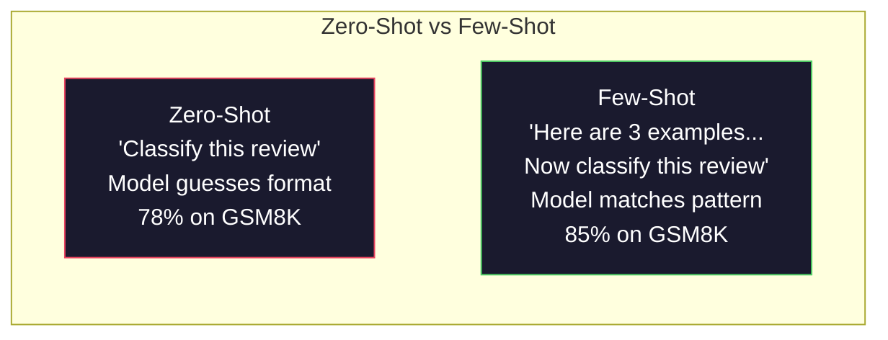
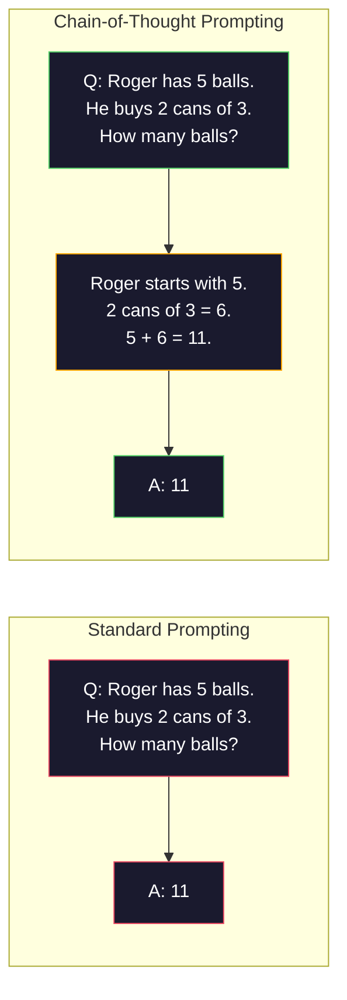
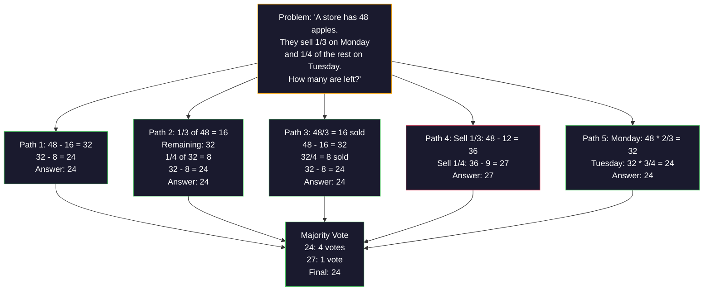
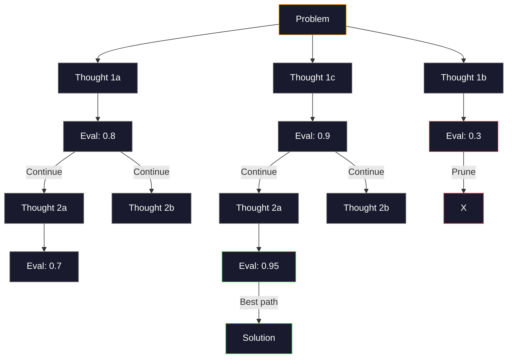

# 少樣本（few-shot）、思維鏈（chain of thought，CoT）與思維樹（tree of thoughts，ToT）

> 告訴模型要做什麼是 prompt。示範如何思考則是工程。在相同的模型、相同的任務與相同的資料下，78% 與 91% 準確率之間的差距，並非來自更優秀的模型，而是來自更卓越的推理策略。

**Type:** Build
**Languages:** Python
**Prerequisites:** Lesson 11.01 (Prompt Engineering)
**Time:** ~45 minutes

## Learning Objectives｜學習目標

- 實作少樣本提示（few-shot prompting），透過挑選並格式化示範範例，將任務準確率最大化
- 套用思維鏈（Chain-of-Thought, CoT）推理，以提升在多步驟問題（如數學應用題）上的準確率
- 建構探索多條推理路徑並選出最佳路徑的思維樹（Tree-of-Thought）Prompt
- 在標準基準測試上測量零樣本（zero-shot） vs 少樣本 vs CoT 所帶來的準確率提升

## The Problem｜問題

你開發了一款數學家教應用程式。你的 Prompt 寫著：「請解這道應用題。」GPT-5 在 GSM8K（標準小學數學基準測試）上的正確率為 94%。你以為這已經達到極限了。其實不然——思維鏈依然能再添上 3 到 4 個百分點。

加上五個英文單字——「我們一步一步思考」（Let's think step by step）——準確率提高至 91%。再加上幾個詳解範例，正確率更達到 95%。相同的模型、相同的溫度（temperature）、相同的 API 成本。唯一的差別，是你給了模型一張草稿紙。

這不是投機取巧的 hack，這是推理的本質。人類無法在單一思維跳躍中直接解出多步驟難題，Transformer 也同樣做不到。當你迫使模型生成中間 token 時，這些 token 便會成為生成下一個 token 的脈絡。每個推理步驟都會為下一步提供輸入。模型是在字面意義上「透過計算逐步走向答案」。

但「一步一步思考」只是起點，而非終點。如果你抽樣 5 條推理路徑並進行多數決（majority vote）投票呢？如果你允許模型探索一棵可能性之樹，評估並剪除不具潛力的 branch呢？如果你將推理與工具呼叫（tool calling）交織進行呢？這些都不是憑空假設，它們是已有研究並以實驗驗證的技術，而你在本課中將會親手實作它們。

## The Concept｜核心概念

### 零樣本 vs 少樣本：範例勝於純指令

零樣本（Zero-shot）提示僅給予模型任務說明，不附帶任何範例。少樣本（Few-shot）提示則會先給出示範範例。

Wei 等人（2022）在 8 個基準測試上對此進行了測量。對於像情緒分類這樣的簡單任務，零樣本與少樣本文本表現差異在 2% 以內。而對於多步驟算術與符號推理等複雜任務，少樣本將準確率提升了 10% 到 25%。

其核心直覺在於：範例可視為精簡的指令。你不必詳述描述輸出格式，而是直接展示它；你無需抽象解釋推理過程，而是直接示範它。模型在範例上的模式匹配能力，遠比它解讀抽象文字指令來得更可靠。



**少樣本勝出的場景：** 格式敏感任務、分類任務、結構化擷取、特定領域術語，以及任何需要模型精確匹配特定模式的任務。

**零樣本勝出的場景：** 簡單的事實問答（question answering）、範例會過度限制創意的發散性任務，以及尋找優質範例的成本高於直接撰寫好指令的任務。

### 範例挑選：相似性遠勝隨機挑選

並非所有範例都具備同等價值。挑選與目標輸入相似的範例，在分類任務上比隨機挑選高出 5% 到 15% 的準確率（Liu 等人，2022）。三項原則：

1. **語意相似性**：挑選在 embedding 空間中與當前輸入最接近的範例
2. **標籤多樣性**：範例需完整覆蓋所有輸出類別
3. **難度匹配**：示範範例的複雜度需與目標問題相當

對大多數任務而言，最佳範例數量為 3 到 5 個。少於 3 個時，模型缺乏足夠訊號以擷取潛在模式；多於 5 個時，會遭遇效益遞減並白白浪費脈絡視窗的 token。對於標籤眾多的分類任務，建議為每個標籤提供一個範例。

### 思維鏈：提供草稿空間

思維鏈（CoT）提示由 Google Brain 的 Wei 等人（2022）提出。其核心概念非常純粹：與其只向模型索取最終答案，不如先要求它列出中間的推理步驟。



從機械原理來看，為什麼這能奏效？Transformer 生成的每一個 token 都會成為下一個 token 的脈絡。如果沒有 CoT，模型必須在單次前向傳遞的隱藏狀態中壓縮所有推理過程；有了 CoT，模型能將中間計算外化為具體的 token。每一個推理 token 實質上都在拓展有效的計算深度。

**GSM8K 基準測試（小學數學，8,500 道題）：**

| 模型 | 零樣本 | 零樣本 CoT | 少樣本 CoT |
|-------|-----------|---------------|--------------|
| GPT-4o | 78% | 91% | 95% |
| GPT-5 | 94% | 97% | 98% |
| o4-mini（推理模型） | 97% | — | — |
| Claude Opus 4.7 | 93% | 97% | 98% |
| Gemini 3 Pro | 92% | 96% | 98% |
| Llama 4 70B | 80% | 89% | 94% |
| DeepSeek-V3.1 | 89% | 94% | 96% |

**關於推理模型的注意事項。** 像 OpenAI 的 o 系列（o3、o4-mini）與 DeepSeek-R1 等模型，在輸出答案之前已在內部自主執行思維鏈。對推理模型加入「我們一步一步思考」是多餘且有時適得其反的——因為它們在內部早已完成了這項推理。

CoT 的兩種形式：

**零樣本 CoT**：在 Prompt 末端加上「Let's think step by step」（我們一步一步思考）。無需提供範例。Kojima 等人（2022）證明了單憑這句話就能顯著提升算術、常識與符號推理任務的準確率。

**少樣本 CoT**：提供包含完整推理步驟的範例。其效果優於零樣本 CoT，因為模型能看到你期望它展現的確切推理格式。

**CoT 適得其反的場景**：簡單的事實檢索（「法國的首都在哪裡？」）、單步驟分類，以及速度優先於精度的任務。CoT 在每次查詢中會額外增加 50 到 200 個 token 的推理開銷。對於高吞吐、低複雜度的任務而言，這是完全不必要的成本浪費。

### 自洽性（self-consistency）：多路抽樣，一次投票

Wang 等人（2023）提出了自洽性（Self-Consistency）。其深刻洞見在於：單一 CoT 推理路徑可能會包含邏輯偏差或計算錯誤。但如果你在溫度大於 0 的設定下抽樣 N 條獨立的推理路徑，並對最終答案進行多數決投票，隨機的個別錯誤就會被相互抵消。



在 PaLM 540B 的原始實驗中，當 N=40 時，自洽性將 GSM8K 的準確率從單路 CoT 的 56.5% 提高到了 74.4%。在 GPT-5 上，由於基準準確率已經非常高，提升相對較小（97% 到 98%）。這項技術在基礎 CoT 準確率為 60% 到 85% 的模型上表現最為耀眼——這是單路錯誤頻繁但並非系統性錯誤的甜蜜點。對於內建取樣機制的推理模型（o 系列、R1），自洽性已被其內建的內部多次取樣所涵蓋。

權衡之處在於：N 個樣本意味著 N 倍的 API 成本與延遲。在實踐中，N=5 通常已能取得絕大部分收益；N=3 是有意義投票的最低門檻；而對多數任務而言，N > 10 的邊際回報極低。

### 思維樹：樹狀探索

Yao 等人（2023）提出了思維樹（Tree-of-Thought, ToT）。CoT 遵循單一線性推理軌跡，而 ToT 則會探索多條分岔路徑，並在繼續深入前評估哪些路徑最有潛力。



ToT 包含三個核心模組：

1. **思維生成（Thought generation）**：產出多個候選的下一步想法
2. **狀態評估（State evaluation）**：為每個候選想法評分（亦可使用 LLM 本身作為評估器）
3. **搜尋演算法（Search algorithm）**：在樹狀空間中使用 BFS 或 DFS 搜尋，並剪除低分路徑

在 24 點遊戲（Game of 24，透過四則運算將 4 個數字湊成 24）任務中，GPT-4 使用標準提示僅能解出 7.3% 的問題。使用 CoT 時，正確率甚至掉到 4.0%（在此類寬廣搜尋空間下，單線 CoT 容易走進死胡同）。而使用 ToT，正確率飆升至 74%。

ToT 的代價是昂貴的。樹上的每個節點（node）都需要一次獨立的 LLM 呼叫。一個分岔度為 3、深度為 3 的搜尋樹可能需要多達 39 次 LLM 呼叫。因此請僅在搜尋空間廣闊但步驟容易量化評估的場景下使用它——例如複雜規劃、謎題求解，或附帶多重約束的創意思考。

### ReAct：思考與行動並行

Yao 等人（2022）將推理軌跡與實際行動相互結合。模型在思考（生成推理依據）與行動（呼叫工具、檢索、計算）之間輪替進行。

```mermaid
graph LR
    Q["Question:\nWhat is the\npopulation of the\ncountry where\nthe Eiffel Tower\nis located?"]
    T1["Thought: I need to\nfind which country\nhas the Eiffel Tower"]
    A1["Action: search\n'Eiffel Tower location'"]
    O1["Observation:\nParis, France"]
    T2["Thought: Now I need\nFrance's population"]
    A2["Action: search\n'France population 2024'"]
    O2["Observation:\n68.4 million"]
    T3["Thought: I have\nthe answer"]
    F["Answer:\n68.4 million"]

    Q --> T1 --> A1 --> O1 --> T2 --> A2 --> O2 --> T3 --> F

    style Q fill:#1a1a2e,stroke:#ffa500,color:#fff
    style T1 fill:#1a1a2e,stroke:#51cf66,color:#fff
    style A1 fill:#1a1a2e,stroke:#e94560,color:#fff
    style O1 fill:#1a1a2e,stroke:#808080,color:#fff
    style T2 fill:#1a1a2e,stroke:#51cf66,color:#fff
    style A2 fill:#1a1a2e,stroke:#e94560,color:#fff
    style O2 fill:#1a1a2e,stroke:#808080,color:#fff
    style T3 fill:#1a1a2e,stroke:#51cf66,color:#fff
    style F fill:#1a1a2e,stroke:#51cf66,color:#fff
```



在知識密集型任務上，ReAct 的表現顯著超越純粹的 CoT，因為它能將推理扎根於真實世界的即時資訊。在 HotpotQA（多跳問答任務）上，使用 GPT-4 的 ReAct 取得了 35.1% 的完全匹配率，而單純 CoT 僅有 29.4%。其最強大的力量在於：推理錯誤會被觀察結果（Observation）即時修正——模型能在執行途中動態調整其計畫。

ReAct 是現代 AI Agent 的基石。主流 Agent 框架（LangChain、CrewAI、AutoGen）皆實作了「思考—行動—觀察」（Thought-Action-Observation）迴圈的某種變體。你將在 Phase 14 實作完整的 Agent。本課聚焦於該模式的 Prompt 設計原理。

### 結構化提示（structured prompting）：XML 標籤、分隔符號（delimiters）與標題

隨著 Prompt 變得複雜，清晰的結構能防止模型混淆各個段落。三種實用方法：

**XML 標籤**（在 Claude 上表現最佳，在其他模型上亦極為穩健）：
```
<context>
You are reviewing a pull request.
The codebase uses TypeScript and React.
</context>

<task>
Review the following diff for bugs, security issues, and style violations.
</task>

<diff>
{diff_content}
</diff>

<output_format>
List each issue with: file, line, severity (critical/warning/info), description.
</output_format>
```

**Markdown 標題**（通用性最強）：
```
## Role
Senior security engineer at a fintech company.

## Task
Analyze this API endpoint for vulnerabilities.

## Input
{api_code}

## Rules
- Focus on OWASP Top 10
- Rate each finding: critical, high, medium, low
- Include remediation steps
```

**分隔符號**（極簡但有效）：
```
---INPUT---
{user_text}
---END INPUT---

---INSTRUCTIONS---
Summarize the above in 3 bullet points.
---END INSTRUCTIONS---
```

### Prompt 串接：循序分解

某些任務過於複雜，難以由單一 Prompt 承擔。Prompt 串接（Prompt chaining）將大任務拆解為一系列連續步驟，上一個 Prompt 的輸出順理成章成為下一個 Prompt 的輸入。


串接設計優於單一 Prompt 的三大主因：

1. **各步驟更加簡單**：模型一次只專注於單一目標，而非同時兼顧多重需求
2. **中間產物可被檢查**：你可以在步驟之間進行驗證與修正
3. **不同步驟可配置不同模型**：在擷取步驟使用成本低廉的模型，在核心推理步驟呼叫昂貴的高階模型

### 各項技術效能對比

| 技術名稱 | 最適合場景 | GSM8K 準確率（GPT-5） | API 呼叫次數 | Token 額外開銷 | 實作複雜度 |
|-----------|----------|------------------------|-----------|----------------|------------|
| 零樣本 | 簡易任務 | 94% | 1 | 無 | 極低 |
| 少樣本 | 格式匹配 | 96% | 1 | 200-500 tokens | 低 |
| 零樣本 CoT | 快速提升推理能力 | 97% | 1 | 50-200 tokens | 極低 |
| 少樣本 CoT | 單次呼叫的最大準確率 | 98% | 1 | 300-600 tokens | 低 |
| 自洽性（N=5） | 高風險關鍵推理任務 | 98.5% | 5 | 5 倍 token 成本 | 中 |
| 推理模型（o4-mini） | 免手動設置的 CoT 替代方案 | 97% | 1 | 隱藏內部計算（2-10 倍） | 極低 |
| 思維樹 | 搜尋／規劃類問題 | 不適用（Game of 24 達 74%） | 10-40+ | 10-40 倍 token 成本 | 高 |
| ReAct | 需結合外部知識的推理 | 不適用（HotpotQA 達 35.1%） | 3-10+ | 視輪次而定 | 高 |
| Prompt 串接 | 複雜的多步驟工作流 | 96%（整個管線） | 2-5 | 2-5 倍 token 成本 | 中 |

選擇合適技術取決於三個維度：準確率要求、延遲預算與成本容忍度。對多數正式環境系統而言，少樣本 CoT 搭配 3 樣本的自洽性備援，已能涵蓋 90% 的實務需求。

```figure
few-shot-curve
```

## Build It｜動手實作

我們將建構一套數學解題器，將少樣本提示、思維鏈推理與自洽性投票整合為單一管線。接著，我們將為高難度難題加入思維樹探索機制。

完整實作位於 `code/advanced_prompting.py`。以下為核心元件剖析。

### 步驟 1：少樣本範例儲存庫

第一個元件負責管理少樣本範例，並針對給定問題篩選出最具關聯性的範例。

```python
GSM8K_EXAMPLES = [
    {
        "question": "Janet's ducks lay 16 eggs per day. She eats three for breakfast every morning and bakes muffins for her friends every day with four. She sells every egg at the farmers' market for $2. How much does she make every day at the farmers' market?",
        "reasoning": "Janet's ducks lay 16 eggs per day. She eats 3 and bakes 4, using 3 + 4 = 7 eggs. So she has 16 - 7 = 9 eggs left. She sells each for $2, so she makes 9 * 2 = $18 per day.",
        "answer": "18"
    },
    ...
]
```

每個範例皆包含三個部分：問題、推理鏈以及最終答案。正是推理鏈將一般少樣本範例轉化為了 CoT 少樣本範例。

### 步驟 2：思維鏈 Prompt 組裝器

Prompt 組裝器將系統訊息、帶有推理鏈的少樣本範例以及目標問題整合為單一 Prompt。

```python
def build_cot_prompt(question, examples, num_examples=3):
    system = (
        "You are a math problem solver. "
        "For each problem, show your step-by-step reasoning, "
        "then give the final numerical answer on the last line "
        "in the format: 'The answer is [number]'."
    )

    example_text = ""
    for ex in examples[:num_examples]:
        example_text += f"Q: {ex['question']}\n"
        example_text += f"A: {ex['reasoning']} The answer is {ex['answer']}.\n\n"

    user = f"{example_text}Q: {question}\nA:"
    return system, user
```

格式約束（「The answer is [number]」）至關重要。缺乏這項要求，自洽性機制將無法在不同抽樣結果間自動擷取並比較答案。

### 步驟 3：自洽性投票

抽樣 N 條推理路徑並選出獲得最多票數的答案。

```python
def self_consistency_solve(question, examples, client, model, n_samples=5):
    system, user = build_cot_prompt(question, examples)

    answers = []
    reasonings = []
    for _ in range(n_samples):
        response = client.chat.completions.create(
            model=model,
            messages=[
                {"role": "system", "content": system},
                {"role": "user", "content": user}
            ],
            temperature=0.7
        )
        text = response.choices[0].message.content
        reasonings.append(text)
        answer = extract_answer(text)
        if answer is not None:
            answers.append(answer)

    vote_counts = Counter(answers)
    best_answer = vote_counts.most_common(1)[0][0] if vote_counts else None
    confidence = vote_counts[best_answer] / len(answers) if best_answer else 0

    return best_answer, confidence, reasonings, vote_counts
```

將溫度設為 0.7 極具深意。若在溫度 0.0 下執行，所有 N 個樣本將完全相同，失去抽樣意義。你需要足夠的隨機性來探索多樣化的推理路徑，但又不能過高以免模型產出胡言亂語。

### 步驟 4：思維樹求解器

針對線性推理容易受挫的題目，ToT 探索多種解題方向並評估哪條路徑最具潛力。

```python
def tree_of_thought_solve(question, client, model, breadth=3, depth=3):
    thoughts = generate_initial_thoughts(question, client, model, breadth)
    scored = [(t, evaluate_thought(t, question, client, model)) for t in thoughts]
    scored.sort(key=lambda x: x[1], reverse=True)

    for current_depth in range(1, depth):
        next_thoughts = []
        for thought, score in scored[:2]:
            extensions = extend_thought(thought, question, client, model, breadth)
            for ext in extensions:
                ext_score = evaluate_thought(ext, question, client, model)
                next_thoughts.append((ext, ext_score))
        scored = sorted(next_thoughts, key=lambda x: x[1], reverse=True)

    best_thought = scored[0][0] if scored else ""
    return extract_answer(best_thought), best_thought
```

評估器本身也是一次獨立的 LLM 呼叫。你向模型提問：「在 0.0 到 1.0 的尺度上，這條推理路徑對於解決該問題的前景如何？」這正是 ToT 的核心精髓——模型主動評估自己產出的部分解。

### 步驟 5：完整管線整合

此管線結合了所有技術並建立階梯式升級（escalation）策略。

```python
def solve_with_escalation(question, examples, client, model):
    single_answer, _ = few_shot_cot_solve(question, examples, client, model)

    sc_answer, confidence, _, _ = self_consistency_solve(
        question, examples, client, model, n_samples=5
    )

    if confidence >= 0.8 and single_answer == sc_answer:
        return sc_answer, "self_consistency", confidence

    tot_answer, _ = tree_of_thought_solve(question, client, model)
    return tot_answer, "tree_of_thought", None
```

升級邏輯：優先嘗試成本低廉的單路 CoT。單一確定性路徑無法提供得票率，因此其品質檢驗仰賴一致性驗證：溫度為 0 的解答必須與抽樣路徑的多數決解答相符。如果不符，或者自洽性的信心度低於 0.8（5 個樣本中少於 4 個達成共識），管線便自動升級至 ToT。此策略兼顧成本與準確率——絕大多數問題以極低成本快速解出，棘手難題則獲得充足的計算資源支援。

## Use It｜實際應用

### 範本驅動的少樣本 Prompt

LangChain 內建了 Prompt 範本與輸出解析支援，大幅簡化少樣本與 CoT 模式的建置：

```python
from langchain_core.prompts import FewShotPromptTemplate, PromptTemplate
from langchain_openai import ChatOpenAI

example_prompt = PromptTemplate(
    input_variables=["question", "reasoning", "answer"],
    template="Q: {question}\nA: {reasoning} The answer is {answer}."
)

few_shot_prompt = FewShotPromptTemplate(
    examples=examples,
    example_prompt=example_prompt,
    suffix="Q: {input}\nA: Let's think step by step.",
    input_variables=["input"]
)

llm = ChatOpenAI(model="gpt-4o", temperature=0.7)
chain = few_shot_prompt | llm
result = chain.invoke({"input": "If a train travels 120 km in 2 hours..."})
```

LangChain 亦提供了透過語意相似度挑選範例的 `ExampleSelector` 類別：

```python
from langchain_core.example_selectors import SemanticSimilarityExampleSelector
from langchain_openai import OpenAIEmbeddings

selector = SemanticSimilarityExampleSelector.from_examples(
    examples,
    OpenAIEmbeddings(),
    k=3
)
```

### 編譯式 Prompt

DSPy 將提示策略視為可最佳化的程式模組。你無需手動撰寫 CoT Prompt，只需定義輸入輸出簽署（Signature），DSPy 會自動為你最佳化 Prompt：

```python
import dspy

dspy.configure(lm=dspy.LM("openai/gpt-4o", temperature=0.7))

class MathSolver(dspy.Module):
    def __init__(self):
        self.solve = dspy.ChainOfThought("question -> answer")

    def forward(self, question):
        return self.solve(question=question)

solver = MathSolver()
result = solver(question="Janet's ducks lay 16 eggs per day...")
```

DSPy 的 `ChainOfThought` 會自動加入推理軌跡，而 `dspy.majority` 則直接實作了自洽性投票：

```python
result = dspy.majority(
    [solver(question=q) for _ in range(5)],
    field="answer"
)
```

### 對比：手刻自建 vs 成熟框架

| 特性 | 從零實作（本課內容） | LangChain | DSPy |
|---------|--------------------------|-----------|------|
| 對 Prompt 格式的控制度 | 完全自主掌控 | 依賴範本模式 | 系統全自動生成 |
| 自洽性投票 | 手動實作多數決邏輯 | 手動撰寫邏輯 | 內建支援（`dspy.majority`） |
| 範例挑選機制 | 自訂比對邏輯 | 內建 `ExampleSelector` | `dspy.BootstrapFewShot` 自動挑選 |
| 思維樹（ToT） | 自訂樹狀搜尋與剪枝 | 社群擴充鏈 | 未內建支援 |
| Prompt 最佳化 | 手動反覆調校 | 手動調整 | 自動編譯與自我最佳化 |
| 最適用場景 | 深度學習底層、自訂管線 | 標準化工作流 | 學術研究、自動化調校 |

## Ship It｜交付成果

本課產出兩項實用產物。

**1. 推理鏈 Prompt**（`outputs/prompt-reasoning-chain.md`）：一套生產級別的少樣本 CoT 搭配自洽性的 Prompt 範本。直接填入你的示範範例與特定領域問題即可上線運作。

**2. CoT 模式選型技能**（`outputs/skill-cot-patterns.md`）：一套依據任務類型、準確率要求與成本限制，挑選最適推理技術的決策框架。

## Exercises｜練習

1. **測量準確率差距**：挑選 10 道 GSM8K 題目，分別以零樣本、少樣本、零樣本 CoT 與少樣本 CoT 進行求解。記錄每種方式的準確率，觀察哪種技術在你選用的模型上帶來最大躍升。

2. **範例挑選對比實驗**：針對相同的 10 道題目，對比隨機選取範例與手動精選相似範例的成效。測量準確率差異，探討在何種臨界點上範例品質會凌駕於範例數量。

3. **自洽性成本曲線分析**：在 20 道 GSM8K 題目上，分別以 N=1、3、5、7、10 執行自洽性抽樣。繪製準確率對成本（總消耗 token 數）的折線圖，找出適合你模型的性價比拐點。

4. **打造 ReAct 迴圈**：為管線擴充計算機工具。當模型產出數學運算式時，在沙盒環境中使用 Python 的 `eval()` 執行並將結果回填給模型。測量結合工具的推理是否優於純文字 CoT。

5. **探索創意思維樹**：將思維樹求解器改造為創意寫作工具，題目為：「寫一個只有 6 個單字的故事，既令人發笑又讓人悲傷。」使用 LLM 作為評審員。樹狀路徑探索相較於單次生成，是否能產出更具驚喜感的創意內容？

## Key Terms｜關鍵術語

| 術語 | 常見說法 | 實際意義 |
|------|----------------|----------------------|
| 少樣本提示（Few-shot prompting） | 「給它看幾個範例」 | 在 Prompt 中置入輸入—輸出示範範例，以定錨模型的輸出格式與行為風格 |
| 思維鏈（Chain-of-Thought） | 「讓它一步一步想」 | 引導模型輸出中間推理 token，在產出最終答案前實質拓展其有效計算深度 |
| 自洽性（Self-Consistency） | 「多跑幾次看哪個多」 | 在溫度大於 0 下抽樣 N 條多樣化推理路徑，並透過多數決投票選出出現頻率最高的答案 |
| 思維樹（Tree-of-Thought） | 「讓它探索不同選項」 | 在推理路徑上進行結構化搜尋，評估每個部分解並僅對具備潛力的路徑進行展開 |
| ReAct | 「一邊想一邊動手」 | 在「思考—行動—觀察」迴圈中，將內在推理軌跡與外部工具呼叫（搜尋、計算、API 呼叫）交織進行 |
| Prompt 串接（Prompt chaining） | 「拆成多個步驟」 | 將複雜任務拆解為循序執行的多個 Prompt，前一個 Prompt 的輸出作為下一個的輸入 |
| 零樣本 CoT（Zero-shot CoT） | 「直接加『一步步思考』」 | 在 Prompt 末端附加推理觸發句且不附帶任何範例，完全依賴模型內在的潛在推理能力 |

## Further Reading｜延伸閱讀

- [Chain-of-Thought Prompting Elicits Reasoning in Large Language Models](https://arxiv.org/abs/2201.11903) ——Wei 等人（2022）。Google Brain 原創 CoT 論文，建議精讀第 2 與第 3 節以掌握核心實驗結果。
- [Self-Consistency Improves Chain of Thought Reasoning in Language Models](https://arxiv.org/abs/2203.11171) ——Wang 等人（2023）。自洽性奠基論文，表 1 詳列了完整的對比結果。
- [Tree of Thoughts: Deliberate Problem Solving with Large Language Models](https://arxiv.org/abs/2305.10601) ——Yao 等人（2023）。思維樹原創論文，第 4 節的 24 點遊戲實驗為全篇精華所在。
- [ReAct: Synergizing Reasoning and Acting in Language Models](https://arxiv.org/abs/2210.03629) ——Yao 等人（2022）。現代 AI Agent 的理論基礎，第 3 節詳解了「思考—行動—觀察」迴圈。
- [Large Language Models are Zero-Shot Reasoners](https://arxiv.org/abs/2205.11916) ——Kojima 等人（2022）。「我們一步一步思考」的發跡論文，以極致簡單的設計取得驚人成果。
- [DSPy: Compiling Declarative Language Model Calls into Self-Improving Pipelines](https://arxiv.org/abs/2310.03714) ——Khattab 等人（2023）。將提示工程視為編譯問題的先鋒之作，渴望超越手動 Prompt 工程的讀者必讀。
- [OpenAI — Reasoning models guide](https://platform.openai.com/docs/guides/reasoning) ——官方指南，剖析何時思維鏈會成為內部按 token 計費的「推理」模式，何時仍為 Prompt 層級的引導技巧。
- [Lightman et al., "Let's Verify Step by Step" (2023)](https://arxiv.org/abs/2305.20050) ——針對鏈條中每個步驟評分的過程獎勵模型（PRM），是超越純結果獎勵的全新推理監督訊號。
- [Snell et al., "Scaling LLM Test-Time Compute Optimally" (2024)](https://arxiv.org/abs/2408.03314) ——系統性研究 CoT 長度、自洽性抽樣與 MCTS 的重要文獻，探討當準確率凌駕於延遲時，「一步一步思考」在測試階段的計算延伸。
