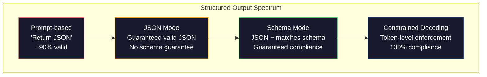
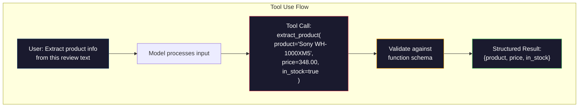

# 結構化輸出：JSON、Schema 驗證與受限解碼（constrained decoding）

> 你的 LLM 回傳了一個字串。但你的應用程式需要 JSON。這道鴻溝所造成的正式環境故障，比任何模型幻覺（hallucination）都要多。結構化輸出是自然語言與型別化資料（typed data）之間的橋樑。做好它，你的 LLM 就會成為可靠的 API；做錯則，你將在凌晨三點用正規表達式狼狽地解析自由文字。

**Type:** Build
**Languages:** Python
**Prerequisites:** Phase 10, Lessons 01-05 (LLMs from Scratch)
**Time:** ~90 minutes
**Related:** Phase 5 · 20 (Structured Outputs & Constrained Decoding) covers the decoder-level theory (FSM/CFG logit processors, Outlines, XGrammar). This lesson focuses on the production SDK surface (OpenAI `response_format`, Anthropic tool use, Instructor) — read Phase 5 · 20 first if you want to understand what is happening below the API.

## Learning Objectives｜學習目標

- 使用 OpenAI 與 Anthropic API 參數實作 JSON 模式與 Schema 約束輸出
- 建構 Pydantic 驗證層，拒絕格式錯誤的 LLM 輸出並透過錯誤反饋進行重試
- 解釋受限解碼如何在 token 層級強制生成合法 JSON，而無需任何後處理
- 設計穩健的擷取（extraction） Prompt，可靠地將非結構化文字轉化為型別化資料結構

## The Problem｜問題

你向 LLM 提問：「從這段文字中擷取產品名稱、價格與是否有庫存。」它回答：

```
The product is the Sony WH-1000XM5 headphones, which cost $348.00 and are currently in stock.
```

這是一個完全正確的回答。但對於你的應用程式來說，它對應用程式毫無用處。你的庫存系統需要的是 `{"product": "Sony WH-1000XM5", "price": 348.00, "in_stock": true}`。你需要一個具有特定鍵值、特定型別與數值限制條件的 JSON 物件，而不是一句通順的話。

直覺的解法是在 Prompt 中加入「請以 JSON 回應」。這在 90% 的情況下有效。另外的 10%，模型會將 JSON 包裹在 Markdown 程式碼區塊中，或者加上「這是您的 JSON：」等開場贅字，又或者因為提早閉合括號而產生語法錯誤的 JSON。你的 JSON 解析器崩潰，整個資料管線失效。你加入了 try/except 與重試迴圈。重試有時又會產出不同的資料。現在，除了解析問題之外，你還得面對資料一致性問題。

這不是 Prompt 工程問題，這是解碼問題。模型由左至右生成 token。在每個位置上，它從包含 10 萬個以上選項的詞彙庫中挑選最可能的下一個 token。在任何特定位置上，絕大多數選項都會導致無效的 JSON。如果模型剛輸出了 `{"price":`，下一個 token 必須是數字、引號（若為字串）、`null`、`true`、`false` 或負號。其他任何內容都會產生無效的 JSON。缺乏約束時，模型很可能會挑選出一個語意合理但語法上徹底崩潰的英文字詞。

## The Concept｜核心概念

### 結構化輸出的光譜

結構化輸出控制有四個層級，每一層級的可靠度都高於前一層。



**基於 Prompt（Prompt-based）**（「以合法的 JSON 回應」）：毫無強制約束。模型通常會配合，但偶爾會失控。可靠度約為 90%。失效模式：Markdown 標籤包裝、前置說明文字、截斷輸出、錯誤的層級結構。

**JSON 模式（JSON mode）**：API 保證輸出為合法的 JSON。OpenAI 的 `response_format: { type: "json_object" }` 即啟用了此功能。輸出解析時絕不會報錯，但它可能不符合你預期的 Schema——可能出現多餘的鍵、型別錯誤或缺失欄位。

**Schema 模式（Schema mode）**：API 接收一個 JSON Schema，並保證輸出符合該規範。在 2026 年，所有主流服務供應商（provider）皆原生支援此功能：OpenAI 的 `response_format: { type: "json_schema", json_schema: {...} }`（亦可透過 `tool_choice="required"` 達成）、Anthropic 帶有 `input_schema` 的工具呼叫（tool calling），以及 Gemini 的 `response_schema` 搭配 `response_mime_type: "application/json"`。輸出將嚴格具備你指定的鍵值、型別與約束條件。

**受限解碼（Constrained decoding）**：在生成過程中的每個 token 位置，解碼器（decoder）會遮除所有會導致非法輸出的候選 token。若 Schema 要求輸入數字，而模型正打算產出字母，該字母 token 的機率會被直接強制設為零。模型只能產出導向合法結構的 token。這正是 OpenAI 結構化輸出模式以及 Outlines、Guidance 等開源函式庫的底層機制。

### JSON Schema：合約語言

JSON Schema 是你向模型（或驗證層）描述輸出結構型態的合約規格。所有主流的結構化輸出系統皆採用它作為通用標準。

```json
{
  "type": "object",
  "properties": {
    "product": { "type": "string" },
    "price": { "type": "number", "minimum": 0 },
    "in_stock": { "type": "boolean" },
    "categories": {
      "type": "array",
      "items": { "type": "string" }
    }
  },
  "required": ["product", "price", "in_stock"]
}
```

這份 Schema 宣告：輸出必須是一個物件，包含字串型別的 `product`、非負數的 `price`、布林值的 `in_stock`，以及可選的字串陣列 `categories`。任何不符合此規範的輸出都會遭到拒絕。

Schema 能處理複雜的邊界情況：巢狀物件、具有型別的陣列項目、列舉（enum，將字串限制在特定候選值內）、模式匹配（字串的正規表達式），以及組合器（oneOf、anyOf、allOf 用於多型輸出）。

### Pydantic 模式

在 Python 中，通常無須手寫 JSON Schema。你只需定義一個 Pydantic 模型，它會自動為你產生對應 Schema。

```python
from pydantic import BaseModel

class Product(BaseModel):
    product: str
    price: float
    in_stock: bool
    categories: list[str] = []
```

這會產生與上述完全相同的 JSON Schema。Instructor 函式庫（以及 OpenAI SDK）直接接受 Pydantic 模型：傳入模型類別，即可取回經驗證的實例。若 LLM 輸出不符合規格，Instructor 會自動處理重試。

### 函式呼叫／工具呼叫（Function Calling / Tool Use）

解決相同問題的另一種介面形態。與其要求模型直接產出 JSON，不如定義帶有型別的參數的「工具」（函式）。模型會輸出帶有結構化引數的函式呼叫。OpenAI 稱其為「函式呼叫（function calling）」，Anthropic 稱其為「工具呼叫（tool use）」。產出的結果是一樣的：型別化的結構化資料。



當模型需要自主決定該呼叫哪一個函式，而不僅僅是填寫參數時，工具呼叫更具優勢。如果你有 10 種不同的擷取 Schema，且模型必須依據輸入內容選出最適方案，工具呼叫便能同時完成 Schema 挑選與結構化輸出。

### 常見失效模式

即使具備 Schema 強制約束，結構化輸出仍可能出現微妙的失敗情況。

**幻覺數值**：輸出嚴格符合 Schema，但包含憑空捏造的內容。原始文字標註價格為 $348，模型卻產出 `{"price": 299.99}`。Schema 驗證無法察覺此問題——型別完全正確，但數值本身是錯的。

**列舉值混淆**：你將某個欄位限制在 `["in_stock", "out_of_stock", "preorder"]`。模型輸出了 `"available"`——語意上完全通順，但不在允許的候選集合內。優良的受限解碼能從源頭杜絕此問題，而純 Prompt 方法則無法保證。

**巢狀物件過深**：深層巢狀 Schema（4 層以上）會引發更多錯誤。每一層巢狀結構都是模型可能導致模型無法維持結構。

**陣列長度偏差**：模型在陣列中產出的項目數量可能過多或過少。Schema 支援 `minItems` 與 `maxItems`，但並非所有服務供應商都在解碼層級嚴格執行這項限制。

**遺漏可選欄位**：模型經常省略在技術上定義為可選、但對你的業務邏輯至關重要的欄位。即使資料偶爾缺失，也請在 Schema 中將其設為必填——迫使模型明確輸出 `null`。

```figure
mx-schema-funnel
```

## Build It｜動手實作

### 步驟 1：JSON Schema 驗證器

從零建構一個驗證器，檢查 Python 物件是否符合給定的 JSON Schema。這套邏輯在輸出端執行以驗證合規性。

```python
import json

def validate_schema(data, schema):
    errors = []
    _validate(data, schema, "", errors)
    return errors

def _validate(data, schema, path, errors):
    schema_type = schema.get("type")

    if schema_type == "object":
        if not isinstance(data, dict):
            errors.append(f"{path}: expected object, got {type(data).__name__}")
            return
        for key in schema.get("required", []):
            if key not in data:
                errors.append(f"{path}.{key}: required field missing")
        properties = schema.get("properties", {})
        for key, value in data.items():
            if key in properties:
                _validate(value, properties[key], f"{path}.{key}", errors)

    elif schema_type == "array":
        if not isinstance(data, list):
            errors.append(f"{path}: expected array, got {type(data).__name__}")
            return
        min_items = schema.get("minItems", 0)
        max_items = schema.get("maxItems", float("inf"))
        if len(data) < min_items:
            errors.append(f"{path}: array has {len(data)} items, minimum is {min_items}")
        if len(data) > max_items:
            errors.append(f"{path}: array has {len(data)} items, maximum is {max_items}")
        items_schema = schema.get("items", {})
        for i, item in enumerate(data):
            _validate(item, items_schema, f"{path}[{i}]", errors)

    elif schema_type == "string":
        if not isinstance(data, str):
            errors.append(f"{path}: expected string, got {type(data).__name__}")
            return
        enum_values = schema.get("enum")
        if enum_values and data not in enum_values:
            errors.append(f"{path}: '{data}' not in allowed values {enum_values}")

    elif schema_type == "number":
        if not isinstance(data, (int, float)):
            errors.append(f"{path}: expected number, got {type(data).__name__}")
            return
        minimum = schema.get("minimum")
        maximum = schema.get("maximum")
        if minimum is not None and data < minimum:
            errors.append(f"{path}: {data} is less than minimum {minimum}")
        if maximum is not None and data > maximum:
            errors.append(f"{path}: {data} is greater than maximum {maximum}")

    elif schema_type == "boolean":
        if not isinstance(data, bool):
            errors.append(f"{path}: expected boolean, got {type(data).__name__}")

    elif schema_type == "integer":
        if not isinstance(data, int) or isinstance(data, bool):
            errors.append(f"{path}: expected integer, got {type(data).__name__}")
```

### 步驟 2：Pydantic 風格模型轉 Schema

建構一個輕量級的類別至 Schema 轉換工具。定義 Python 類別並自動產生對應的 JSON Schema。

```python
class SchemaField:
    def __init__(self, field_type, required=True, default=None, enum=None, minimum=None, maximum=None):
        self.field_type = field_type
        self.required = required
        self.default = default
        self.enum = enum
        self.minimum = minimum
        self.maximum = maximum

def python_type_to_schema(field):
    type_map = {
        str: "string",
        int: "integer",
        float: "number",
        bool: "boolean",
    }

    schema = {}

    if field.field_type in type_map:
        schema["type"] = type_map[field.field_type]
    elif field.field_type == list:
        schema["type"] = "array"
        schema["items"] = {"type": "string"}
    elif isinstance(field.field_type, dict):
        schema = field.field_type

    if field.enum:
        schema["enum"] = field.enum
    if field.minimum is not None:
        schema["minimum"] = field.minimum
    if field.maximum is not None:
        schema["maximum"] = field.maximum

    return schema

def model_to_schema(name, fields):
    properties = {}
    required = []

    for field_name, field in fields.items():
        properties[field_name] = python_type_to_schema(field)
        if field.required:
            required.append(field_name)

    return {
        "type": "object",
        "properties": properties,
        "required": required,
    }
```

### 步驟 3：受限 Token 過濾器

模擬受限解碼。給定部分的 JSON 字串與目標 Schema，推斷出在當前位置上哪些 token 類別在目前位置有效。

```python
def next_valid_tokens(partial_json, schema):
    stripped = partial_json.strip()

    if not stripped:
        return ["{"]

    try:
        json.loads(stripped)
        return ["<EOS>"]
    except json.JSONDecodeError:
        pass

    last_char = stripped[-1] if stripped else ""

    if last_char == "{":
        return ['"', "}"]
    elif last_char == '"':
        if stripped.endswith('":'):
            return ['"', "0-9", "true", "false", "null", "[", "{"]
        return ["a-z", '"']
    elif last_char == ":":
        return [" ", '"', "0-9", "true", "false", "null", "[", "{"]
    elif last_char == ",":
        return [" ", '"', "{", "["]
    elif last_char in "0123456789":
        return ["0-9", ".", ",", "}", "]"]
    elif last_char == "}":
        return [",", "}", "]", "<EOS>"]
    elif last_char == "]":
        return [",", "}", "<EOS>"]
    elif last_char == "[":
        return ['"', "0-9", "true", "false", "null", "{", "[", "]"]
    else:
        return ["any"]

def demonstrate_constrained_decoding():
    partial_states = [
        '',
        '{',
        '{"product"',
        '{"product":',
        '{"product": "Sony"',
        '{"product": "Sony",',
        '{"product": "Sony", "price":',
        '{"product": "Sony", "price": 348',
        '{"product": "Sony", "price": 348}',
    ]

    print(f"{'Partial JSON':<45} {'Valid Next Tokens'}")
    print("-" * 80)
    for state in partial_states:
        valid = next_valid_tokens(state, {})
        display = state if state else "(empty)"
        print(f"{display:<45} {valid}")
```

### 步驟 4：擷取管線

將所有模組整合為擷取管線：定義 Schema、模擬 LLM 產出結構化輸出、驗證輸出並處理重試。

```python
def simulate_llm_extraction(text, schema, attempt=0):
    if "headphones" in text.lower() or "sony" in text.lower():
        if attempt == 0:
            return '{"product": "Sony WH-1000XM5", "price": 348.00, "in_stock": true, "categories": ["audio", "headphones"]}'
        return '{"product": "Sony WH-1000XM5", "price": 348.00, "in_stock": true}'

    if "laptop" in text.lower():
        return '{"product": "MacBook Pro 16", "price": 2499.00, "in_stock": false, "categories": ["computers"]}'

    return '{"product": "Unknown", "price": 0, "in_stock": false}'

def extract_with_retry(text, schema, max_retries=3):
    for attempt in range(max_retries):
        raw = simulate_llm_extraction(text, schema, attempt)

        try:
            data = json.loads(raw)
        except json.JSONDecodeError as e:
            print(f"  Attempt {attempt + 1}: JSON parse error -- {e}")
            continue

        errors = validate_schema(data, schema)
        if not errors:
            return data

        print(f"  Attempt {attempt + 1}: Schema validation errors -- {errors}")

    return None

product_schema = {
    "type": "object",
    "properties": {
        "product": {"type": "string"},
        "price": {"type": "number", "minimum": 0},
        "in_stock": {"type": "boolean"},
        "categories": {"type": "array", "items": {"type": "string"}},
    },
    "required": ["product", "price", "in_stock"],
}
```

### 步驟 5：執行完整管線展示

```python
def run_demo():
    print("=" * 60)
    print("  Structured Output Pipeline Demo")
    print("=" * 60)

    print("\n--- Schema Definition ---")
    product_fields = {
        "product": SchemaField(str),
        "price": SchemaField(float, minimum=0),
        "in_stock": SchemaField(bool),
        "categories": SchemaField(list, required=False),
    }
    generated_schema = model_to_schema("Product", product_fields)
    print(json.dumps(generated_schema, indent=2))

    print("\n--- Schema Validation ---")
    test_cases = [
        ({"product": "Test", "price": 10.0, "in_stock": True}, "Valid object"),
        ({"product": "Test", "price": -5.0, "in_stock": True}, "Negative price"),
        ({"product": "Test", "in_stock": True}, "Missing price"),
        ({"product": "Test", "price": "ten", "in_stock": True}, "String as price"),
        ("not an object", "String instead of object"),
    ]

    for data, label in test_cases:
        errors = validate_schema(data, product_schema)
        status = "PASS" if not errors else f"FAIL: {errors}"
        print(f"  {label}: {status}")

    print("\n--- Constrained Decoding Simulation ---")
    demonstrate_constrained_decoding()

    print("\n--- Extraction Pipeline ---")
    texts = [
        "The Sony WH-1000XM5 headphones are priced at $348 and currently available.",
        "The new MacBook Pro 16-inch laptop costs $2499 but is sold out.",
        "This is a random sentence with no product info.",
    ]

    for text in texts:
        print(f"\n  Input: {text[:60]}...")
        result = extract_with_retry(text, product_schema)
        if result:
            print(f"  Output: {json.dumps(result)}")
        else:
            print(f"  Output: FAILED after retries")
```

## Use It｜實際應用

### OpenAI 結構化輸出

```python
# from openai import OpenAI
# from pydantic import BaseModel
#
# client = OpenAI()
#
# class Product(BaseModel):
#     product: str
#     price: float
#     in_stock: bool
#
# response = client.beta.chat.completions.parse(
#     model="gpt-5-mini",
#     messages=[
#         {"role": "system", "content": "Extract product information."},
#         {"role": "user", "content": "Sony WH-1000XM5, $348, in stock"},
#     ],
#     response_format=Product,
# )
#
# product = response.choices[0].message.parsed
# print(product.product, product.price, product.in_stock)
```

OpenAI 的結構化輸出模式在內部採用了受限解碼。模型生成的每一個 token 都保證產出符合 Pydantic Schema 的規格。無需重試，無需額外驗證，約束條件直接整合進解碼過程。

### Anthropic 工具呼叫

```python
# import anthropic
#
# client = anthropic.Anthropic()
#
# response = client.messages.create(
#     model="claude-opus-4-7",
#     max_tokens=1024,
#     tools=[{
#         "name": "extract_product",
#         "description": "Extract product information from text",
#         "input_schema": {
#             "type": "object",
#             "properties": {
#                 "product": {"type": "string"},
#                 "price": {"type": "number"},
#                 "in_stock": {"type": "boolean"},
#             },
#             "required": ["product", "price", "in_stock"],
#         },
#     }],
#     messages=[{"role": "user", "content": "Extract: Sony WH-1000XM5, $348, in stock"}],
# )
```

Anthropic 透過工具呼叫實現結構化輸出。模型發出一個工具呼叫，其結構化引數嚴格符合宣告的 input_schema。相同的成果，不同的 不同的 API 介面。

### Instructor 函式庫

```python
# pip install instructor
# import instructor
# from openai import OpenAI
# from pydantic import BaseModel
#
# client = instructor.from_openai(OpenAI())
#
# class Product(BaseModel):
#     product: str
#     price: float
#     in_stock: bool
#
# product = client.chat.completions.create(
#     model="gpt-5-mini",
#     response_model=Product,
#     messages=[{"role": "user", "content": "Sony WH-1000XM5, $348, in stock"}],
# )
```

Instructor 封裝了任何 LLM 用戶端，並自動加入驗證與重試機制。若首次嘗試未能通過驗證，它會將具體錯誤訊息作為脈絡傳回給模型並要求修正輸出。這在任何服務供應商上皆能平穩執行，不僅限於 OpenAI。

## Ship It｜交付成果

本課產出 `outputs/prompt-structured-extractor.md`——一個可重複使用的 Prompt 範本，能在給定 Schema 定義下從任何文字中擷取結構化資料。輸入 JSON Schema 與非結構化文字，即可獲得驗證通過的 JSON。

此外還包含 `outputs/skill-structured-outputs.md`——一套依據服務供應商、可靠度要求與 Schema 複雜度，挑選最適結構化輸出策略的決策框架。

## Exercises｜練習

1. 擴充 Schema 驗證器以支援 `oneOf`（資料必須嚴格匹配多個 Schema 中恰好符合其中一個）。這能妥善處理多型輸出——例如某欄位既可能是 `Product` 物件，也可能是具有不同欄位結構的 `Service` 物件。

2. 打造一套「Schema 差異分析（schema diff）」工具，用以比對兩份 Schema 並識別出破壞性變更（刪除必填欄位、變更型別）與非破壞性變更（新增可選欄位、放寬約束）。這是在正式環境中對擷取 Schema 進行版本管理的核心工具。

3. 實作更逼真的受限解碼模擬器。給定一個 JSON Schema 與包含 100 個 token 的詞彙表（vocabulary，字母、數字、標點符號、關鍵字），逐步走訪生成流程，並在每個位置上遮除非法 token。測量在每一步驟中詞彙表保持合法的百分比。

4. 建構一套擷取評估套件。建立 50 份帶有人工標註標準 JSON 輸出的產品描述。在全部 50 份資料上執行你的擷取管線，測量完全匹配率、欄位級準確率與型別合規（type compliance）度。找出哪些欄位最難被正確擷取。

5. 為你的擷取管線加入「信心分數」（confidence score）。對每個擷取出的欄位估算模型的置信度（基於 token 機率，或透過重複執行 3 次並測量一致性）。將低信心度欄位標記出來以供人工審核。

## Key Terms｜關鍵術語

| 術語 | 常見說法 | 實際意義 |
|------|----------------|----------------------|
| JSON 模式（JSON mode） | 「回傳 JSON」 | API 參數旗標，保證輸出符合語法合法的 JSON，但不強制任何特定的 Schema 結構 |
| 結構化輸出（Structured output） | 「帶型別的 JSON」 | 嚴格符合特定 JSON Schema 的輸出，具備正確的鍵值、型別與邊界約束 |
| 受限解碼（Constrained decoding） | 「引導生成」 | 在生成過程中的每個 token 位置，主動遮除會導致無效輸出的 token——保證 100% 符合 Schema |
| JSON Schema | 「JSON 範本」 | 一種用以描述 JSON 資料結構、型別與約束的宣告式規範語言（由 OpenAPI、JSON Forms 等廣泛採用） |
| Pydantic | 「強化版 Python 資料類別」 | 透過型別驗證定義資料模型的 Python 函式庫，被 FastAPI 與 Instructor 用於自動生成 JSON Schema |
| 函式呼叫（Function calling） | 「工具呼叫」 | LLM 輸出結構化的函式呼叫請求（名稱 + 具型別引數）而非自由文字——OpenAI 與 Anthropic 皆原生支援 |
| Instructor | 「LLM 的 Pydantic」 | 封裝 LLM 用戶端以回傳通過驗證的 Pydantic 實例的 Python 函式庫，並在驗證失敗時自動重試 |
| Token 遮罩（Token masking） | 「過濾詞彙表」 | 在生成期間將特定 token 的機率強制設為零，使模型完全無法產出這些 token |
| Schema 合規（Schema compliance） | 「符合結構外觀」 | 輸出具備所有必填欄位、型別完全正確、數值符合限制條件，且無多餘不允許的欄位 |
| 重試迴圈（Retry loop） | 「重試直到成功」 | 將驗證錯誤回傳給模型並要求其修復輸出——Instructor 能在可設定的上限內自動執行此流程 |

## Further Reading｜延伸閱讀

- [OpenAI Structured Outputs Guide](https://platform.openai.com/docs/guides/structured-outputs) ——OpenAI 官方指南，剖析 API 中基於 JSON Schema 的受限解碼技術
- [Willard & Louf, 2023 -- "Efficient Guided Generation for Large Language Models"](https://arxiv.org/abs/2307.09702) ——Outlines 論文，探討如何將 JSON Schema 編譯為有限狀態機以實作 token 層級約束
- [Instructor documentation](https://python.useinstructor.com/) ——透過 Pydantic 驗證與自動重試，從任何 LLM 取得結構化輸出的標準函式庫
- [Anthropic Tool Use Guide](https://docs.anthropic.com/en/docs/tool-use) ——Claude 如何透過帶有 JSON Schema input_schema 的工具呼叫實現結構化輸出
- [JSON Schema specification](https://json-schema.org/) ——被所有主流結構化輸出系統採用的 Schema 語言完整規範
- [Outlines library](https://github.com/outlines-dev/outlines) ——使用正規表達式與編譯為有限狀態機的 JSON Schema 的開源受限生成引擎
- [Dong et al., "XGrammar: Flexible and Efficient Structured Generation Engine for Large Language Models" (MLSys 2025)](https://arxiv.org/abs/2411.15100) ——當前最尖端的語法引擎；下推自動機編譯能在每 token 約 100 ns 內完成遮除
- [Beurer-Kellner et al., "Prompting Is Programming: A Query Language for Large Language Models" (LMQL)](https://arxiv.org/abs/2212.06094) ——LMQL 論文，將受限解碼框架化為帶有型別與數值約束的查詢語言
- [Microsoft Guidance (framework docs)](https://github.com/guidance-ai/guidance) ——範本驅動的受限生成框架；作為 Outlines 與 XGrammar 的跨廠商補充方案
