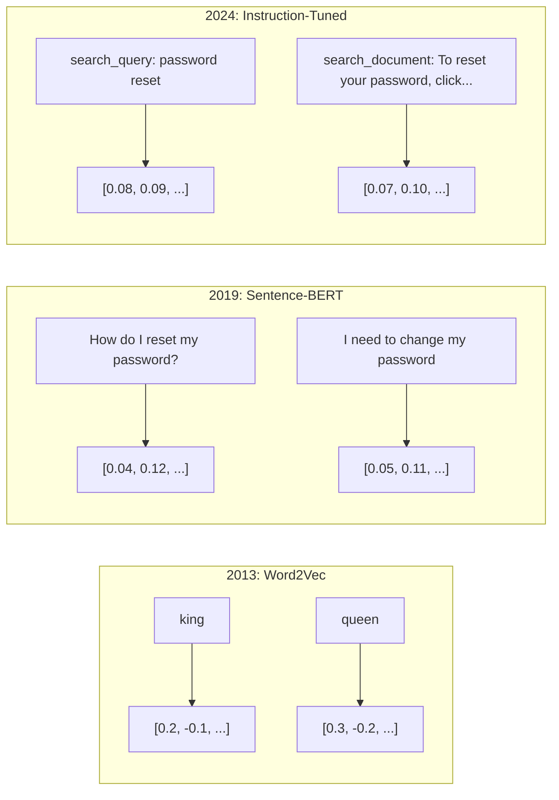
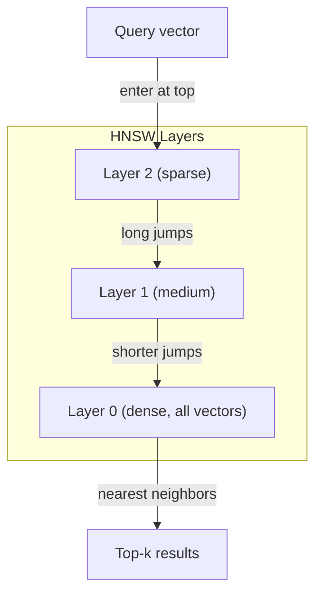
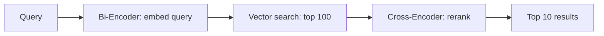

# Embedding 與向量表示法

> 文字是離散的。數學是連續的。每當你要求 LLM 尋找「相似」的文件、比較語意或超越關鍵字搜尋時，你都在仰賴連結這兩個世界的一座橋樑。這座橋樑就是 embedding。如果你不理解 embedding，你就無法真正理解現代 AI。你只是在被動使用它而已。

**Type:** Build
**Languages:** Python
**Prerequisites:** Phase 11, Lesson 01 (Prompt Engineering)
**Time:** ~75 minutes
**Related:** Phase 5 · 22 (Embedding Models Deep Dive) covers dense vs sparse vs multi-vector, Matryoshka truncation, and per-axis model selection. This lesson focuses on the production pipeline (vector DBs, HNSW, similarity math). Read Phase 5 · 22 before picking a model.

## Learning Objectives｜學習目標

- 使用 API 服務供應商與開源模型生成文字 embedding，並計算兩者之間的餘弦相似度（cosine similarity）
- 解釋為何 embedding 能解決關鍵字搜尋無法應對的詞彙不匹配問題
- 建構一套依據語意而非字面關鍵字精確比對來檢索文件的語意搜尋索引
- 使用檢索基準測試（precision@k、recall）評估 embedding 品質，並為你的任務挑選合適的 embedding 模型

## The Problem｜問題

你手上有 10,000 張客服工單。一位客戶寫道：「my payment didn't go through」（我的付款沒成功）。你需要找出過去類似的工單。關鍵字搜尋能找到包含「payment」與「didn't go through」的工單，卻會徹底漏掉「transaction failed」（交易失敗）、「charge was declined」（扣款遭拒）以及「billing error」（帳務錯誤）。這些工單以截然不同的詞彙描述了描述相同問題。

這就是詞彙不匹配問題（vocabulary mismatch problem）。人類語言有數十種表達相同概念的方式。關鍵字搜尋將每個單字視為孤立且缺乏語意內涵的符號，它無法知曉「declined」與「didn't go through」指向同一種狀況。

你需要一種由語意而非拼字決定相似度的文字表示法。你需要一種方式，能將「my payment didn't go through」與「transaction was declined」在某個數學空間中緊密擺放在一起，同時將包含「payment」一詞的「my payment arrived on time」（我的付款準時入帳）推向遙遠的一端。

這種表示法就是 embedding。

## The Concept｜核心概念

### 什麼是 Embedding？

Embedding 是一個由浮點數構成的密集向量（dense vector），用以表示文字的語意。這裡「密集」二字至關重要——每個維度都承載著實質資訊，不同於大多數維度皆為零的稀疏表示法（如詞袋模型 bag-of-words 或 TF-IDF）。

「The cat sat on the mat」會被轉化為類似 `[0.023, -0.041, 0.087, ..., 0.012]` 的向量——依模型不同，長度通常在 768 到 3072 個數字之間。這些數字編碼了語意。你從不需要直接人工解讀它們，而是比較它們。

### Word2Vec 的重大突破

2013 年，Tomas Mikolov 與 Google 的研究同仁發表了 Word2Vec。其核心洞見在於：訓練一個神經網路從上下文預測中心字詞（或由中心字詞預測上下文），該網路隱藏層（hidden layer）的權重便會成為具語意資訊的向量表示法。

其最著名的經典成果：

```
king - man + woman = queen
```

在文字 embedding 上執行的向量運算捕捉到了語意關係。「man」到「woman」的向量方向，與「king」到「queen」的向量方向大致平行。這正是整個領域恍然大悟的歷史性時刻：幾何結構竟能精準編碼語意。

Word2Vec 產生的是 300 維的向量。每個字詞無論在何種語境中都只分配到單一固定向量。「river bank」（河岸）與「bank account」（銀行帳戶）中的「bank」擁有完全相同的 embedding。這項限制驅動了隨後整整十年的前沿研究。

### 從字詞邁向句子

word embedding 僅代表單一 token。正式環境系統則需要對整個句子、段落或完整文件建立 embedding。歷史上發展出四種主要方法：

**平均法（Averaging）**：取句子中所有詞向量的平均值。計算成本極低、帶有資訊損失，但對簡短文字效果出奇不錯。主要缺點是完全丟失了詞序——「dog bites man」（狗咬人）與「man bites dog」（人咬狗）會得到完全相同的 embedding。

**CLS token**：Transformer 模型（BERT, 2018）輸出一個特殊的 [CLS] token embedding，用以代表整個輸入序列。雖優於簡單平均，但 [CLS] token 的訓練目標是預測下一句，而非衡量語意相似度。

**對比學習（Contrastive learning）**：顯式訓練模型將語意相似的成對樣本拉近，將相異的成對樣本推開。Sentence-BERT（Reimers & Gurevych, 2019）採用此途徑，並奠定了現代 embedding 模型的基石。給定「How do I reset my password?」與「I need to change my password」，模型學會賦予它們近乎一致的向量。

**指令調校 Embedding（Instruction-tuned embeddings）**：最新的主流途徑。如 E5 與 GTE 等模型接受任務前綴（「search_query:」、「search_document:」），指導模型該產出何種類型的 embedding。這使得讓單一模型支援多種下游任務。



### 現代 Embedding 模型

當前市場已收斂至少數幾個適用於正式環境的熱門選項（MTEB 分數基準為 2026 年初，MTEB v2）：

| 模型 | 服務供應商 | 維度 | MTEB | 脈絡長度 | 成本 / 1M tokens |
|-------|----------|-----------|------|---------|------------------|
| Gemini Embedding 2 | Google | 3072（Matryoshka） | 67.7（檢索） | 8192 | $0.15 |
| embed-v4 | Cohere | 1024（Matryoshka） | 65.2 | 128K | $0.12 |
| voyage-4 | Voyage AI | 1024/2048（Matryoshka） | 66.8 | 32K | $0.12 |
| text-embedding-3-large | OpenAI | 3072（Matryoshka） | 64.6 | 8192 | $0.13 |
| text-embedding-3-small | OpenAI | 1536（Matryoshka） | 62.3 | 8192 | $0.02 |
| BGE-M3 | BAAI | 1024（密集+稀疏+ColBERT） | 63.0 多語言 | 8192 | 開源權重 |
| Qwen3-Embedding | 阿里巴巴 | 4096（Matryoshka） | 66.9 | 32K | 開源權重 |
| Nomic-embed-v2 | Nomic | 768（Matryoshka） | 63.1 | 8192 | 開源權重 |

MTEB（海量文字 Embedding 基準測試，Massive Text Embedding Benchmark）v2 涵蓋了跨檢索、分類、群集（clustering）、重新排序與摘要的 100 多項評測任務。分數越高越好。至 2026 年，開源權重模型（Qwen3-Embedding、BGE-M3）在多數維度上已追平甚至超越封閉式代管模型。Gemini Embedding 2 在純檢索在該指標領先；Voyage/Cohere 在金融、法律與程式碼等特定垂直領域拔得頭籌。在正式導入前，務必先在你自己的真實查詢資料集上進行基準評測。

### 相似度度量指標

給定兩個 embedding 向量，有三種主流方式計算它們的相似程度：

**餘弦相似度（Cosine similarity）**：兩向量夾角的餘弦值。範圍介於 -1（完全相反）到 1（方向相同）之間。它完全忽略向量的絕對長度——一個 10 字短句與一篇 500 字長文若朝向相同方向，分數可高達 1.0。這是 90% 應用場景的預設首選。

```
cosine_sim(a, b) = dot(a, b) / (||a|| * ||b||)
```

**點積（Dot product）**：兩向量的原始內積（inner product）。當向量已經過正規化（長度為 1 的單位向量）時，點積與餘弦相似度在數值上完全等價，且計算速度更快。OpenAI 的 embedding 皆已預先正規化，因此點積與餘弦相似度產生的排序結果完全相同。

```
dot(a, b) = sum(a_i * b_i)
```

**歐氏（L2）距離（Euclidean distance）**：向量空間中的直線幾何距離。距離越小 = 越相似。對向量長度差異極為敏感。適用於空間中的絕對座標絕對位置有意義、而非僅僅關注方向的場景。

```
L2(a, b) = sqrt(sum((a_i - b_i)^2))
```

指標選型指南：

| 度量指標 | 適用時機 | 應避免的時機 |
|--------|----------|------------|
| 餘弦相似度 | 比對長度差異懸殊的文字；絕大多數檢索任務 | 向量長度本身具備特定資訊量 |
| 點積 | 向量已事先完成單位正規化；追求極致運算速度 | 各向量長度不一致且未正規化 |
| 歐氏距離 | 分群演算法；空間最近鄰問題 | 比對長度落差極大的各類文件 |

### 向量資料庫與 HNSW

暴力搜尋（Brute-force similarity search）是將查詢向量與儲存庫中的每一個向量逐一比對。在包含 100 萬個 1536 維向量的資料庫中，單次查詢就需要 15 億次乘加運算，延遲難以承受。

向量資料庫透過近似最近鄰（Approximate Nearest Neighbor, ANN）演算法破解了這個瓶頸。目前最常用的演算法是 HNSW（分層導航小世界，Hierarchical Navigable Small World）：

1. 建立向量的多層次圖結構
2. 頂層極為稀疏——在遙遠群集間建立長距離跳轉連接
3. 底層高度密集——在鄰近向量間建立細粒度連接
4. 搜尋由頂層切入，逐層向下搜尋並縮小範圍
5. 以 O(log n) 的時間複雜度取代 O(n)，快速回傳近似 top-k 結果

HNSW 犧牲了極微小的精度損失（召回率（recall）通常落在 95% 到 99%），換取了大幅提升速度。在 1000 萬個向量的規模下，暴力搜尋需要數秒，而 HNSW 僅需數毫秒。



正式環境可選方案：

| 資料庫 | 類型 | 最佳場景 | 最大規模 |
|----------|------|----------|-----------|
| Pinecone | 代管 SaaS | 免維運的正式環境 | 數十億級 |
| Weaviate | 開源 | 自架、混合檢索 | 1 億以上 |
| Qdrant | 開源 | 高效能、複合過濾 | 1 億以上 |
| ChromaDB | 內嵌式 | 原型驗證、本機開發 | 100 萬級 |
| pgvector | Postgres 擴充套件 | 原本已重度依賴 Postgres | 1000 萬級 |
| FAISS | 函式庫 | 行程內高效運算、學術研究 | 10 億以上 |

### 分塊（chunking）策略

長篇文件無法作為單一向量直接建立 embedding。一份 50 頁的 PDF 涵蓋數十個子主題——其整體 embedding 會淪為所有主題的平庸平均，與任何具體細節都不足夠相似。你必須將文件切分為多個區塊（chunk），並為每個區塊分別建立 embedding。

**固定大小分塊（Fixed-size chunking）**：每隔 N 個 token 進行切分，並保留 M 個 token 的重疊（overlap）。實作簡單且完全可預期。當文件缺乏清晰章節結構時效果顯著。例如 512 token 的分塊搭配 50 token 的重疊：區塊 1 涵蓋 token 0-511，區塊 2 涵蓋 token 462-973。

**基於句子的分塊（Sentence-based chunking）**：在句子邊界處切分，持續累加句子直到逼近 token 上限。每個區塊至少包含一個完整句子。顯著優於固定切分，因為它絕不會在句子中途將避免切斷句子中的內容。

**遞迴分塊（Recursive chunking）**：優先嘗試在最大邊界處切分（如章節標題）。若區塊依然過大，再嘗試段落邊界，接著是句子標點，最後才退回字元限制。這正是 LangChain 的 `RecursiveCharacterTextSplitter` 機制，極適合格式雜亂的混合文件。

**語意分塊（Semantic chunking）**：先為每個句子生成 embedding，接著計算相鄰句子間的語意相似度。當相似度跌破閾值（threshold）時，便另起新區塊。雖然成本高昂（需為每句話單獨呼叫 embedding），但能產出語意凝聚度最高的優質區塊。

| 策略 | 複雜度 | 品質 | 最佳場景 |
|----------|-----------|---------|----------|
| 固定大小 | 低 | 普通 | 非結構化文字、日誌紀錄 |
| 基於句子 | 低 | 良好 | 一般文章、電子郵件 |
| 遞迴分塊 | 中 | 良好 | Markdown、HTML、多格式文件 |
| 語意分塊 | 高 | 最優 | 對檢索品質要求嚴苛的場景 |

絕大多數系統的常見的折衷點：256 到 512 個 token 的區塊大小，搭配 50 個 token 的重疊。

### 雙編碼器（bi-encoder） vs 交叉編碼器（cross-encoder）

雙編碼器（Bi-encoder）將查詢與文件各自獨立編碼為向量，隨後僅比對向量。速度極快——查詢只需編碼一次，即可與預先算好的長篇文件向量庫快速比對。這是大規模檢索的主要選擇。

交叉編碼器（Cross-encoder）將查詢與候選文件合併為單一輸入，直接輸出相關性分數。速度緩慢——它必須讓每一對「查詢—文件」重新通過整個神經網路運算。但其準確度遠遠超越雙編碼器，因為它的注意力機制能同時在查詢與文件的 token 之間交叉運算。

正式環境的黃金架構：先用雙編碼器快速撈出 top-100 候選清單，再由交叉編碼器進行精細重新排序（rerank），產出最終的 top-10。這就是「檢索後重排」（retrieve-then-rerank）管線。



主流重新排序模型：Cohere Rerank 3.5（每 1000 次查詢收費 2 美元）、BGE-reranker-v2（免費開源）、Jina Reranker v2（免費開源）。

### 可截斷 embedding Embedding

傳統 embedding 具有「全有或全無」的僵化特性。一個 1536 維的向量必須佔用 1536 個浮點數空間。若不重新訓練模型，你無法隨意將其截斷至 256 維。

可截斷 embedding表示法學習（Matryoshka Representation Learning, Kusupati 等人，2022）解決了此困境。模型在訓練時以此方式訓練，使其前 N 個維度已凝聚了最重要的核心資訊，如同層層嵌套的俄羅斯娃娃。將 1536 維的 Matryoshka embedding 直接截斷至前 256 維，只會損失微量精度，但依然保有高度鑑別力。

OpenAI 的 text-embedding-3-small 與 text-embedding-3-large 透過 `dimensions` 參數原生支援 Matryoshka 截斷。請求 256 維而非 1536 維可使儲存開銷銳減至 縮減為原來的 1/6，而在 MTEB 基準測試上的精度損失僅約 3% 到 5%。

### 二值量化

以 float32 儲存的 1536 維 embedding 單一向量需消耗 6,144 位元組。乘以 1000 萬份文件：光是向量本身就需吞噬 61 GB 儲存空間。

二值量化（Binary quantization）將每個浮點數壓縮為單個位元：正數轉為 1，負數轉為 0。儲存容量瞬間從 6,144 位元組降至至 192 位元組——達成高達 32 倍的驚人壓縮。相似度計算改採漢明距離（Hamming distance，計算相異位元數），現代 CPU 可以在單一指令週期內完成該計算。

其對檢索召回率的衝擊通常約在 5% 到 10% 之間。業界常見的標準架構：先用二值量化在數百萬個向量中進行超高速初篩，篩選出前 1,000 個候選，再用完整浮點精度的向量進行精準重評分。這讓你能在享有 32 倍儲存空間節省的同時，保有 95% 以上的原生精度。

```figure
cosine-similarity
```

## Build It｜動手實作

我們將從零建構一套語意搜尋引擎。不使用現成的向量資料庫，不呼叫外部 embedding API。使用純 Python 搭配 numpy 進行數學運算。

### 步驟 1：文字分塊

```python
def chunk_text(text, chunk_size=200, overlap=50):
    words = text.split()
    chunks = []
    start = 0
    while start < len(words):
        end = start + chunk_size
        chunk = " ".join(words[start:end])
        chunks.append(chunk)
        start += chunk_size - overlap
    return chunks


def chunk_by_sentences(text, max_chunk_tokens=200):
    sentences = text.replace("\n", " ").split(".")
    sentences = [s.strip() + "." for s in sentences if s.strip()]
    chunks = []
    current_chunk = []
    current_length = 0
    for sentence in sentences:
        sentence_length = len(sentence.split())
        if current_length + sentence_length > max_chunk_tokens and current_chunk:
            chunks.append(" ".join(current_chunk))
            current_chunk = []
            current_length = 0
        current_chunk.append(sentence)
        current_length += sentence_length
    if current_chunk:
        chunks.append(" ".join(current_chunk))
    return chunks
```

### 步驟 2：從零實作 Embedding

我們使用結合 L2 正規化的 TF-IDF 演算法實作簡易的密集 embedding。這並非神經網路 embedding，但它具備相同的技術合約：輸入文字，輸出固定維度向量，相似文字產出相似向量。

```python
import math
import numpy as np
from collections import Counter

class SimpleEmbedder:
    def __init__(self):
        self.vocab = []
        self.idf = []
        self.word_to_idx = {}

    def fit(self, documents):
        vocab_set = set()
        for doc in documents:
            vocab_set.update(doc.lower().split())
        self.vocab = sorted(vocab_set)
        self.word_to_idx = {w: i for i, w in enumerate(self.vocab)}
        n = len(documents)
        self.idf = np.zeros(len(self.vocab))
        for i, word in enumerate(self.vocab):
            doc_count = sum(1 for doc in documents if word in doc.lower().split())
            self.idf[i] = math.log((n + 1) / (doc_count + 1)) + 1

    def embed(self, text):
        words = text.lower().split()
        count = Counter(words)
        total = len(words) if words else 1
        vec = np.zeros(len(self.vocab))
        for word, freq in count.items():
            if word in self.word_to_idx:
                tf = freq / total
                vec[self.word_to_idx[word]] = tf * self.idf[self.word_to_idx[word]]
        norm = np.linalg.norm(vec)
        if norm > 0:
            vec = vec / norm
        return vec
```

### 步驟 3：相似度函式

```python
def cosine_similarity(a, b):
    dot = np.dot(a, b)
    norm_a = np.linalg.norm(a)
    norm_b = np.linalg.norm(b)
    if norm_a == 0 or norm_b == 0:
        return 0.0
    return float(dot / (norm_a * norm_b))


def dot_product(a, b):
    return float(np.dot(a, b))


def euclidean_distance(a, b):
    return float(np.linalg.norm(a - b))
```

### 步驟 4：暴力搜尋向量索引（vector index）

```python
class VectorIndex:
    def __init__(self):
        self.vectors = []
        self.texts = []
        self.metadata = []

    def add(self, vector, text, meta=None):
        self.vectors.append(vector)
        self.texts.append(text)
        self.metadata.append(meta or {})

    def search(self, query_vector, top_k=5, metric="cosine"):
        scores = []
        for i, vec in enumerate(self.vectors):
            if metric == "cosine":
                score = cosine_similarity(query_vector, vec)
            elif metric == "dot":
                score = dot_product(query_vector, vec)
            elif metric == "euclidean":
                score = -euclidean_distance(query_vector, vec)
            else:
                raise ValueError(f"Unknown metric: {metric}")
            scores.append((i, score))
        scores.sort(key=lambda x: x[1], reverse=True)
        results = []
        for idx, score in scores[:top_k]:
            results.append({
                "text": self.texts[idx],
                "score": score,
                "metadata": self.metadata[idx],
                "index": idx
            })
        return results

    def size(self):
        return len(self.vectors)
```

### 步驟 5：語意搜尋引擎

```python
class SemanticSearchEngine:
    def __init__(self, chunk_size=200, overlap=50):
        self.embedder = SimpleEmbedder()
        self.index = VectorIndex()
        self.chunk_size = chunk_size
        self.overlap = overlap

    def index_documents(self, documents, source_names=None):
        all_chunks = []
        all_sources = []
        for i, doc in enumerate(documents):
            chunks = chunk_text(doc, self.chunk_size, self.overlap)
            all_chunks.extend(chunks)
            name = source_names[i] if source_names else f"doc_{i}"
            all_sources.extend([name] * len(chunks))
        self.embedder.fit(all_chunks)
        for chunk, source in zip(all_chunks, all_sources):
            vec = self.embedder.embed(chunk)
            self.index.add(vec, chunk, {"source": source})
        return len(all_chunks)

    def search(self, query, top_k=5, metric="cosine"):
        query_vec = self.embedder.embed(query)
        return self.index.search(query_vec, top_k, metric)

    def search_with_scores(self, query, top_k=5):
        results = self.search(query, top_k)
        return [
            {
                "text": r["text"][:200],
                "source": r["metadata"].get("source", "unknown"),
                "score": round(r["score"], 4)
            }
            for r in results
        ]
```

### 步驟 6：相似度度量比較

```python
def compare_metrics(engine, query, top_k=3):
    results = {}
    for metric in ["cosine", "dot", "euclidean"]:
        hits = engine.search(query, top_k=top_k, metric=metric)
        results[metric] = [
            {"score": round(h["score"], 4), "preview": h["text"][:80]}
            for h in hits
        ]
    return results
```

## Use It｜實際應用

在使用正式環境 embedding API 時，整體架構完全保持一致，只需抽換底層的 embedder 實作：

```python
from openai import OpenAI

client = OpenAI()

def openai_embed(texts, model="text-embedding-3-small", dimensions=None):
    kwargs = {"model": model, "input": texts}
    if dimensions:
        kwargs["dimensions"] = dimensions
    response = client.embeddings.create(**kwargs)
    return [item.embedding for item in response.data]
```

使用 OpenAI 進行 Matryoshka 截斷——相同的模型，更少的維度，極大幅度縮減儲存體積：

```python
full = openai_embed(["semantic search query"], dimensions=1536)
compact = openai_embed(["semantic search query"], dimensions=256)
```

256 維的向量節省了 6 倍的儲存空間。在 1000 萬份文件的規模下，容量需求從 61 GB 降至至 10 GB，而在標準基準測試上的準確率損失僅約 3% 到 5%。

使用 Cohere 進行重新排序：

```python
import cohere

co = cohere.ClientV2()

results = co.rerank(
    model="rerank-v3.5",
    query="What is the refund policy?",
    documents=["Full refund within 30 days...", "No refunds after 90 days..."],
    top_n=3
)
```

若要在本機端執行且不依賴外部 API：

```python
from sentence_transformers import SentenceTransformer

model = SentenceTransformer("BAAI/bge-small-en-v1.5")
embeddings = model.encode(["semantic search query", "another document"])
```

我們先前實作的 VectorIndex 類別能無縫相容上述任何一種方案。只需抽換 embedding 生成函式，核心搜尋邏輯不需修改搜尋邏輯。

## Ship It｜交付成果

本課產出兩項產物：
- `outputs/prompt-embedding-advisor.md`——為特定業務場景評估並挑選最適 embedding 模型與策略的決策 Prompt
- `outputs/skill-embedding-patterns.md`——傳授 agent 如何在正式環境中高效運用 embedding 的技能指引

## Exercises｜練習

1. **度量指標對比實驗**：在範例文件集上，分別使用餘弦相似度、點積與歐氏距離執行相同的 5 組查詢。記錄每組查詢的 top-3 結果。在哪些查詢中度量指標出現了分歧？背後原因為何？

2. **區塊大小實驗**：分別以 50、100、200 與 500 字的區塊大小對範例文件建立索引。對每組索引執行 5 個查詢並記錄 top-1 相似度分數。繪製區塊大小與檢索品質之間的關係圖，找出較大區塊開始對精準度產生負面影響的臨界點。

3. **Matryoshka 模擬器**：建構產出 500 維向量的 SimpleEmbedder。將其分別截斷至 50、100、200 與 500 維，測量在各個截斷維度下的檢索召回率衰減程度。這能在不需複雜訓練技巧的前提下直觀體會 Matryoshka 的運作特徵。

4. **二值量化實作**：取得搜尋引擎產出的 embedding，將其轉為二進位形式（正數為 1，負數為 0），並實作漢明距離搜尋。將其產出的 top-10 結果與全精度餘弦相似度比較，測量兩者的重疊比例。

5. **基於句子的分塊改進**：將固定大小分塊替換為 `chunk_by_sentences`。執行相同的查詢並比對檢索評分。尊重句子邊界是否帶來了更佳的檢索效果？

## Key Terms｜關鍵術語

| 術語 | 常見說法 | 實際意義 |
|------|----------------|----------------------|
| Embedding | 「文字轉數字」 | 一個幾何鄰近性精確編碼語意相似度的密集向量 |
| Word2Vec | 「始祖級 embedding」 | 2013 年透過預測上下文學習詞向量的模型；首次證明向量運算能編碼抽象語意 |
| 餘弦相似度（Cosine similarity） | 「兩向量有多相似」 | 兩向量夾角的餘弦值；1 = 方向完全相同，0 = 正交（orthogonal）無關，-1 = 方向完全相反 |
| HNSW | 「高速向量搜尋」 | 分層導航小世界圖結構——透過多層圖拓撲實現 O(log n) 的近似最近鄰搜尋 |
| 雙編碼器（Bi-encoder） | 「各自編碼，高速比對」 | 將查詢與文件分別獨立編碼為向量；支援預先計算與超大規模高速檢索 |
| 交叉編碼器（Cross-encoder） | 「慢速但極精確的重排器」 | 將查詢—文件對合併輸入整個模型進行聯合推論；精度更高，但無法預先計算向量 |
| 可截斷 embedding Embedding（Matryoshka embeddings） | 「可截斷的向量」 | 經過特殊訓練使得前 N 個維度已凝聚核心資訊的向量，支援可變尺寸的彈性儲存 |
| 二值量化（Binary quantization） | 「1-bit embedding」 | 將浮點向量壓縮為僅保留符號位元的二進位值，達成 32 倍空間節省並搭配漢明距離運算 |
| 分塊（Chunking） | 「切分文件以利 embedding」 | 將長篇文件拆解為 256 到 512 token 的語意片段，使每個區塊皆能獨立建立向量與精準檢索 |
| 向量資料庫（Vector database） | 「專為 embedding 設計的搜尋引擎」 | 針對向量儲存與大規模近似最近鄰搜尋進行深度最佳化的資料庫系統 |
| 對比學習（Contrastive learning） | 「透過比較進行訓練」 | 將相似樣本對的向量拉近、相異樣本對的向量推開的訓練方法論 |
| MTEB | 「Embedding 權威基準」 | 海量文字 Embedding 基準測試——涵蓋 8 大任務類別的 56 個資料集；評估 embedding 模型的業界標準 |

## Further Reading｜延伸閱讀

- Mikolov et al., "Efficient Estimation of Word Representations in Vector Space" (2013) ——以國王與女王類比開啟 embedding 革命的 Word2Vec 奠基論文
- Reimers & Gurevych, "Sentence-BERT: Sentence Embeddings using Siamese BERT-Networks" (2019) ——探討如何訓練用於句子層級相似度的雙編碼器，現代 embedding 模型的共同基石
- Kusupati et al., "Matryoshka Representation Learning" (2022) ——可變維度 embedding 背後的原創技術，被 OpenAI text-embedding-3 全面採納
- Malkov & Yashunin, "Efficient and Robust Approximate Nearest Neighbor using Hierarchical Navigable Small World Graphs" (2018) ——支撐絕大多數正式環境向量搜尋引擎的 HNSW 原創演算法論文
- OpenAI Embeddings Guide (platform.openai.com/docs/guides/embeddings) ——text-embedding-3 模型的實務操作指南，包含 Matryoshka 維度縮減技術
- MTEB Leaderboard (huggingface.co/spaces/mteb/leaderboard) ——橫跨多任務與多語言、持續更新的即時 embedding 排行榜
- [Muennighoff et al., "MTEB: Massive Text Embedding Benchmark" (EACL 2023)](https://arxiv.org/abs/2210.07316) ——定義了排行榜所追蹤的 8 大任務類別（分類、分群、成對分類、重新排序、檢索、STS、摘要、雙語探勘）的基準論文；在採信任何單一 MTEB 分數前務必詳讀
- [Sentence Transformers documentation](https://www.sbert.net/) ——雙編碼器 vs 交叉編碼器、池化策略以及本課所實作的「導入—切分—向量化—儲存」RAG 管線的權威技術參考
