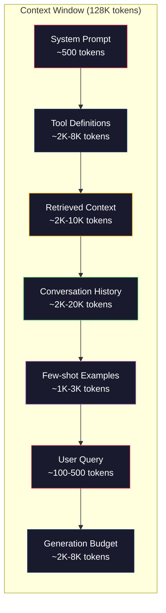
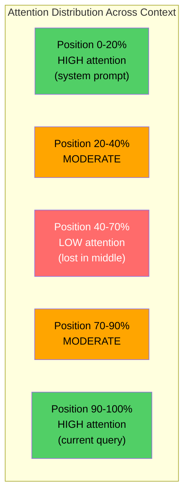
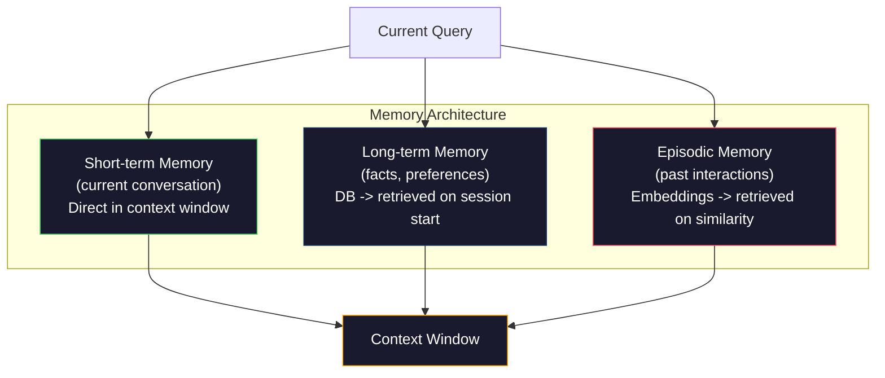

# 脈絡工程（context engineering）：視窗、預算、記憶與檢索

> Prompt 工程只是一個子集。脈絡工程涵蓋整個流程。Prompt 只是你輸入的一段字串。而脈絡是進入模型視窗的一切內容：系統指示、檢索出的文件、工具定義（tool definition）、對話歷程、少樣本（few-shot）範例，以及 Prompt 本身。2026 年最頂尖的 AI 工程師，都是脈絡工程師脈絡工程師。他們決定什麼該放入視窗、什麼該排除在外，以及各項內容該以何種順序排列。

**Type:** Build
**Languages:** Python
**Prerequisites:** Phase 10 (LLMs from Scratch), Phase 11 Lesson 01-02
**Time:** ~90 minutes
**Related:** Phase 11 · 15 (Prompt Caching) — the cache-friendly layout is an extension of context engineering. Phase 5 · 28 (Long-Context Evaluation) for how to measure lost-in-the-middle with NIAH/RULER.

## Learning Objectives｜學習目標

- 計算跨所有脈絡視窗元件（系統提示、工具、歷程、檢索文件、生成緩衝（generation buffer）裕度）的 token 預算
- 實作脈絡視窗管理策略：針對對話歷程的截斷、摘要與滑動視窗（sliding window）
- 排序與安排脈絡元件優先級，以最大化模型對最關鍵資訊的注意力
- 建構一套依據查詢類型與可用視窗容量動態分配 token 的脈絡組裝器

## The Problem｜問題

Claude Opus 4.7 擁有 200K token 的脈絡視窗（beta 測試期間上限為 1M）。GPT-5 具備 400K。Gemini 3 Pro 提供 2M。Llama 4 宣稱支援 10M。在還沒填滿之前，這些數字聽起來無比龐大。

以下是一個程式碼助理的程式碼助理的 token 配置範例。系統提示：500 tokens。50 個工具的定義規格：8,000 tokens。檢索出的參考文件：4,000 tokens。對話歷程（10 輪對話）：6,000 tokens。當前使用者查詢：200 tokens。生成預算（最大輸出限制）：4,000 tokens。總計：22,700 tokens。這只佔了 128K 視窗的 18%。

然而，注意力機制並不會隨著脈絡長度線性擴展。擁有 128K token 脈絡的模型在原生 Transformer 中需承受二次方注意力成本（O(n^2) 在原生 Transformer 中，儘管多數生產級模型採用了高效率注意力變體）。更關鍵的是，檢索精準度會嚴重劣化。「大海撈針」（Needle in a Haystack, NIAH）測試顯示，模型在長脈絡正中央尋找細節資訊時極易遭遇困難。Liu 等人（2023）的研究證實，LLM 檢索長脈絡開頭與結尾處的資訊時擁有近乎完美的準確率，但對於放置於中間段落（脈絡 40% 到 70% 位置）的資訊，正確率驟降 10% 到 20%。這種「迷失在中間」（lost-in-the-middle）現象在各模型間程度不一，但無一倖免地影響了當前所有的架構。

這帶來了非常務實的工程啟示：擁有 200K token 的空間，不表示實際使用全部容量就有效 200K token 是有效率的。一份精心打磨的 10K token 脈絡，其表現往往大幅超越未經篩選的 100K 臃腫脈絡。脈絡工程就是一門在脈絡視窗內最大化訊噪比（signal-to-noise ratio）的工程紀律。

你在視窗中塞入的每一個無效 token，都在擠占原本能承載更高價值資訊的寶貴空間。每個無關的工具定義、每輪過期的陳舊對話、每段未能回答當前問題的檢索文字——每一個都在降低模型完成任務的能力。

## The Concept｜核心概念

### 脈絡視窗是稀缺資源

請將脈絡視窗視為記憶體（RAM），而非硬碟。它高速且具備直接存取能力，但容量有限。你無法塞入所有東西，你必須做出取捨。



每個元件都在競爭有限的空間。加入更多工具定義，意味著對話歷程的對話歷程可用的空間減少；塞入更多檢索文件，意味著少樣本範例的配額被縮減。脈絡工程正是合理調配這項預算以最大化整體任務效能的藝術。

### 迷失在中間

這是脈絡工程中最關鍵的實證發現。模型對開頭與結尾的資訊具有天然的高注意力權重，置於中間位置的資訊所獲得的注意力分數偏低，更容易遭到忽視。

Liu 等人（2023）系統性測試。他們將一份關鍵文件穿插在 20 份無關文件中的不同位置，並測量回答的正確率。當關鍵文件位於最前或最後時，正確率高達 85% 到 90%；而當關鍵文件位於正中間（第 10 份位置）時，正確率跌落至 60% 到 70%。

這指引了工程上的直接啟示：

- 將最關鍵的核心資訊放在最前面（系統提示、重要規則）
- 將當前查詢與最具關聯性的脈絡放在最後面（利用近因效應）
- 將脈絡的中間區段視為最低優先級區域
- 若某些關鍵資訊不得不置於中間，請務必在尾端再次重複強調



### 脈絡元件組成

**系統提示（System prompt）**：確立人設定位、約束條件與行為法則。它置於最前，並在多輪互動中維持恆定。Claude Code 的系統提示（包含工具定義與行為指引）消耗約 6,000 tokens。請保持極度精煉，因為系統提示中的每一個字詞都會在每次 API 呼叫中被反覆計費。

**工具定義（Tool definitions）**：每個工具約消耗 50 到 200 tokens（包含名稱、描述、參數 Schema）。在尚未展開任何對話之前，50 個工具（每個 150 tokens）就已吞噬了 7,500 tokens。採用動態工具選取——僅注入與當前查詢相關的工具——能將此開銷削減 60% 到 80%。

**檢索脈絡（Retrieved context）**：來自向量資料庫、搜尋引擎或本機檔案的文件內容。檢索的品質直接決定了回答的品質。劣質的檢索比不檢索更具破壞性——它以雜訊填滿視窗並主動誤導模型。

**對話歷程（Conversation history）**：過去所有的使用者訊息與助理回應。它隨對話長度線性增長。一場 50 輪對話（每輪 200 tokens）會累積 10,000 tokens 的歷史，而其中絕大多數與當前問題毫無關聯。

**少樣本範例（Few-shot examples）**：展示預期行為的輸入／輸出範例。兩到三個精心挑選的範例對輸出品質的提升，往往勝過最重要的置首、重要的置尾，可選內容置中，但它們同樣佔用配額。

**生成預算（Generation budget）**：專為模型輸出預留的 token 配額。若將視窗容量全部填滿，模型將毫無施展回答的空間。請預留預留至少 2,000 到 4,000 tokens 作為生成裕度。

### 脈絡壓縮策略

**歷史歷程摘要（History summarization）**：與其逐字完整保留先前的所有輪次，不如定期將對話濃縮摘要。「我們討論了 X，決定採用 Y，而使用者期望獲得 Z」——僅用 100 tokens 即可替代原本耗費 2,000 tokens 的 10 輪對話。當歷程長度超過特定閾值（如 5,000 tokens）時自動觸發摘要機制。

**關聯度過濾（Relevance filtering）**：根據當前查詢為每個檢索到的文件片段打分，並篩除低於閾值的內容。若檢索出 10 個片段但僅有 3 個切中要害，請移除其餘 7 個。擁有 3 個高訊號片段，遠勝於混合了 10 個平庸片段。

**工具剪裁（Tool pruning）**：分類使用者查詢的真實意圖，僅注入與該意圖匹配的工具定義。程式碼問題不需要行事曆工具，排程問題不需要檔案系統工具。這能直接將工具定義的消耗從 8,000 tokens 減少至 1,000 tokens 左右。

**遞迴式摘要（Recursive summarization）**：對於超長篇文件，分階段循序壓縮。先對每個章節進行局部摘要，隨後再對各章節摘要進行第二輪濃縮。一份 50 頁的厚重文件得以收斂為 500 token 且濃縮為 500-token 摘要。

### 記憶系統架構

脈絡工程涵蓋三個不同時間尺度的記憶維度：

**短期記憶（Short-term memory）**：當前對話。直接置於脈絡視窗中，隨每輪互動持續增長，透過摘要與滑動截斷進行由摘要和截斷管理。

**長期記憶（Long-term memory）**：跨對話留存的事實與偏好設定。「該使用者偏好 TypeScript」、「此專案使用 PostgreSQL」。持久化儲存於外部資料庫中，在工作階段開始時按需載入。Claude Code 將此類記憶持久化於 CLAUDE.md 中；ChatGPT 則體現在其 Memory 功能中。

**情節記憶（Episodic memory）**：可能具備參考價值的特定歷史互動案例。「上週二我們曾在驗證模組修復過類似的 bug」。將歷史互動轉化為 embedding 儲存，當前對話在語意上命中過去情節時觸發精準檢索。



### 動態脈絡組裝（dynamic context assembly）

核心洞見：不同的查詢需要截然不同的脈絡配比。靜態系統提示 + 靜態全量工具 + 靜態全量歷程是極大的浪費。最頂尖的系統會針對每個查詢進行動態脈絡組裝：

1. 分類查詢意圖
2. 挑選關聯工具（而非全量注入）
3. 檢索關聯文件（而非固定清單）
4. 納入關聯對話輪次（而非堆疊全部內容全部歷程）
5. 加入切合該任務類型的少樣本範例
6. 依重要性排序：極重要置首，重要置尾，次要與可選置中

這正是劃分普通 AI 應用與卓越 AI 應用的分水嶺。模型相同，脈絡品質決定勝負。

```figure
lost-in-the-middle
```

## Build It｜動手實作

### 步驟 1：Token 計數器

無法度量，便無法管理。我們建構一個簡易的 token 計數器（使用基於空格切分的近似估算，因精確計數取決於各家 tokenizer）。

```python
import json
import numpy as np
from collections import OrderedDict

def count_tokens(text):
    if not text:
        return 0
    return int(len(text.split()) * 1.3)

def count_tokens_json(obj):
    return count_tokens(json.dumps(obj))
```

### 步驟 2：脈絡預算管理器

核心抽象。預算管理器追蹤每個元件消耗了多少 token，並設定並執行元件上限。

```python
class ContextBudget:
    def __init__(self, max_tokens=128000, generation_reserve=4000):
        self.max_tokens = max_tokens
        self.generation_reserve = generation_reserve
        self.available = max_tokens - generation_reserve
        self.allocations = OrderedDict()

    def allocate(self, component, content, max_tokens=None):
        tokens = count_tokens(content)
        if max_tokens and tokens > max_tokens:
            words = content.split()
            target_words = int(max_tokens / 1.3)
            content = " ".join(words[:target_words])
            tokens = count_tokens(content)

        used = sum(self.allocations.values())
        if used + tokens > self.available:
            allowed = self.available - used
            if allowed <= 0:
                return None, 0
            words = content.split()
            target_words = int(allowed / 1.3)
            content = " ".join(words[:target_words])
            tokens = count_tokens(content)

        self.allocations[component] = tokens
        return content, tokens

    def remaining(self):
        used = sum(self.allocations.values())
        return self.available - used

    def utilization(self):
        used = sum(self.allocations.values())
        return used / self.max_tokens

    def report(self):
        total_used = sum(self.allocations.values())
        lines = []
        lines.append(f"Context Budget Report ({self.max_tokens:,} token window)")
        lines.append("-" * 50)
        for component, tokens in self.allocations.items():
            pct = tokens / self.max_tokens * 100
            bar = "#" * int(pct / 2)
            lines.append(f"  {component:<25} {tokens:>6} tokens ({pct:>5.1f}%) {bar}")
        lines.append("-" * 50)
        lines.append(f"  {'Used':<25} {total_used:>6} tokens ({total_used/self.max_tokens*100:.1f}%)")
        lines.append(f"  {'Generation reserve':<25} {self.generation_reserve:>6} tokens")
        lines.append(f"  {'Remaining':<25} {self.remaining():>6} tokens")
        return "\n".join(lines)
```

### 步驟 3：克服迷失在中間的重排策略

實作重排策略：最重要的最重要的內容置首與置尾，重要性較低的項目置於中間。

```python
def reorder_lost_in_middle(items, scores):
    paired = sorted(zip(scores, items), reverse=True)
    sorted_items = [item for _, item in paired]

    if len(sorted_items) <= 2:
        return sorted_items

    first_half = sorted_items[::2]
    second_half = sorted_items[1::2]
    second_half.reverse()

    return first_half + second_half

def score_relevance(query, documents):
    query_words = set(query.lower().split())
    scores = []
    for doc in documents:
        doc_words = set(doc.lower().split())
        if not query_words:
            scores.append(0.0)
            continue
        overlap = len(query_words & doc_words) / len(query_words)
        scores.append(round(overlap, 3))
    return scores
```

### 步驟 4：對話歷程壓縮器

將陳舊的對話輪次進行摘要壓縮，以收回寶貴的 token 預算。

```python
class ConversationManager:
    def __init__(self, max_history_tokens=5000):
        self.turns = []
        self.summaries = []
        self.max_history_tokens = max_history_tokens

    def add_turn(self, role, content):
        self.turns.append({"role": role, "content": content})
        self._compress_if_needed()

    def _compress_if_needed(self):
        total = sum(count_tokens(t["content"]) for t in self.turns)
        if total <= self.max_history_tokens:
            return

        while total > self.max_history_tokens and len(self.turns) > 4:
            old_turns = self.turns[:2]
            summary = self._summarize_turns(old_turns)
            self.summaries.append(summary)
            self.turns = self.turns[2:]
            total = sum(count_tokens(t["content"]) for t in self.turns)

    def _summarize_turns(self, turns):
        parts = []
        for t in turns:
            content = t["content"]
            if len(content) > 100:
                content = content[:100] + "..."
            parts.append(f"{t['role']}: {content}")
        return "Previous: " + " | ".join(parts)

    def get_context(self):
        parts = []
        if self.summaries:
            parts.append("[Conversation Summary]")
            for s in self.summaries:
                parts.append(s)
        parts.append("[Recent Conversation]")
        for t in self.turns:
            parts.append(f"{t['role']}: {t['content']}")
        return "\n".join(parts)

    def token_count(self):
        return count_tokens(self.get_context())
```

### 步驟 5：動態工具挑選（dynamic tool selection）器

僅注入與當前查詢高度相關的工具。先對意圖進行分類，隨後實施篩選。

```python
TOOL_REGISTRY = {
    "read_file": {
        "description": "Read contents of a file",
        "tokens": 120,
        "categories": ["code", "files"],
    },
    "write_file": {
        "description": "Write content to a file",
        "tokens": 150,
        "categories": ["code", "files"],
    },
    "search_code": {
        "description": "Search for patterns in codebase",
        "tokens": 130,
        "categories": ["code"],
    },
    "run_command": {
        "description": "Execute a shell command",
        "tokens": 140,
        "categories": ["code", "system"],
    },
    "create_calendar_event": {
        "description": "Create a new calendar event",
        "tokens": 180,
        "categories": ["calendar"],
    },
    "list_emails": {
        "description": "List recent emails",
        "tokens": 160,
        "categories": ["email"],
    },
    "send_email": {
        "description": "Send an email message",
        "tokens": 200,
        "categories": ["email"],
    },
    "web_search": {
        "description": "Search the web for information",
        "tokens": 140,
        "categories": ["research"],
    },
    "query_database": {
        "description": "Run a SQL query on the database",
        "tokens": 170,
        "categories": ["code", "data"],
    },
    "generate_chart": {
        "description": "Generate a chart from data",
        "tokens": 190,
        "categories": ["data", "visualization"],
    },
}

def classify_intent(query):
    query_lower = query.lower()

    intent_keywords = {
        "code": ["code", "function", "bug", "error", "file", "implement", "refactor", "debug", "test"],
        "calendar": ["meeting", "schedule", "calendar", "appointment", "event"],
        "email": ["email", "mail", "send", "inbox", "message"],
        "research": ["search", "find", "what is", "how does", "explain", "look up"],
        "data": ["data", "query", "database", "chart", "graph", "analytics", "sql"],
    }

    scores = {}
    for intent, keywords in intent_keywords.items():
        score = sum(1 for kw in keywords if kw in query_lower)
        if score > 0:
            scores[intent] = score

    if not scores:
        return ["code"]

    max_score = max(scores.values())
    return [intent for intent, score in scores.items() if score >= max_score * 0.5]

def select_tools(query, token_budget=2000):
    intents = classify_intent(query)
    relevant = {}
    total_tokens = 0

    for name, tool in TOOL_REGISTRY.items():
        if any(cat in intents for cat in tool["categories"]):
            if total_tokens + tool["tokens"] <= token_budget:
                relevant[name] = tool
                total_tokens += tool["tokens"]

    return relevant, total_tokens
```

### 步驟 6：完整脈絡組裝管線

將所有模組整合。給定查詢，動態組裝出最佳脈絡。

```python
class ContextEngine:
    def __init__(self, max_tokens=128000, generation_reserve=4000):
        self.budget = ContextBudget(max_tokens, generation_reserve)
        self.conversation = ConversationManager(max_history_tokens=5000)
        self.system_prompt = (
            "You are a helpful AI assistant. You have access to tools for "
            "code editing, file management, web search, and data analysis. "
            "Use the appropriate tools for each task. Be concise and accurate."
        )
        self.knowledge_base = [
            "Python 3.12 introduced type parameter syntax for generic classes using bracket notation.",
            "The project uses PostgreSQL 16 with pgvector for embedding storage.",
            "Authentication is handled by Supabase Auth with JWT tokens.",
            "The frontend is built with Next.js 15 using the App Router.",
            "API rate limits are set to 100 requests per minute per user.",
            "The deployment pipeline uses GitHub Actions with Docker multi-stage builds.",
            "Test coverage must be above 80% for all new modules.",
            "The codebase follows the repository pattern for data access.",
        ]

    def assemble(self, query):
        self.budget = ContextBudget(self.budget.max_tokens, self.budget.generation_reserve)

        system_content, _ = self.budget.allocate("system_prompt", self.system_prompt, max_tokens=1000)

        tools, tool_tokens = select_tools(query, token_budget=2000)
        tool_text = json.dumps(list(tools.keys()))
        tool_content, _ = self.budget.allocate("tools", tool_text, max_tokens=2000)

        relevance = score_relevance(query, self.knowledge_base)
        threshold = 0.1
        relevant_docs = [
            doc for doc, score in zip(self.knowledge_base, relevance)
            if score >= threshold
        ]

        if relevant_docs:
            doc_scores = [s for s in relevance if s >= threshold]
            reordered = reorder_lost_in_middle(relevant_docs, doc_scores)
            doc_text = "\n".join(reordered)
            doc_content, _ = self.budget.allocate("retrieved_context", doc_text, max_tokens=3000)

        history_text = self.conversation.get_context()
        if history_text.strip():
            history_content, _ = self.budget.allocate("conversation_history", history_text, max_tokens=5000)

        query_content, _ = self.budget.allocate("user_query", query, max_tokens=500)

        return self.budget

    def chat(self, query):
        self.conversation.add_turn("user", query)
        budget = self.assemble(query)
        response = f"[Response to: {query[:50]}...]"
        self.conversation.add_turn("assistant", response)
        return budget


def run_demo():
    print("=" * 60)
    print("  Context Engineering Pipeline Demo")
    print("=" * 60)

    engine = ContextEngine(max_tokens=128000, generation_reserve=4000)

    print("\n--- Query 1: Code task ---")
    budget = engine.chat("Fix the bug in the authentication module where JWT tokens expire too early")
    print(budget.report())

    print("\n--- Query 2: Research task ---")
    budget = engine.chat("What is the best approach for implementing vector search in PostgreSQL?")
    print(budget.report())

    print("\n--- Query 3: After conversation history builds up ---")
    for i in range(8):
        engine.conversation.add_turn("user", f"Follow-up question number {i+1} about the implementation details of the system")
        engine.conversation.add_turn("assistant", f"Here is the response to follow-up {i+1} with technical details about the architecture")

    budget = engine.chat("Now implement the changes we discussed")
    print(budget.report())

    print("\n--- Tool Selection Examples ---")
    test_queries = [
        "Fix the bug in auth.py",
        "Schedule a meeting with the team for Tuesday",
        "Show me the database query performance stats",
        "Search for best practices on error handling",
    ]

    for q in test_queries:
        tools, tokens = select_tools(q)
        intents = classify_intent(q)
        print(f"\n  Query: {q}")
        print(f"  Intents: {intents}")
        print(f"  Tools: {list(tools.keys())} ({tokens} tokens)")

    print("\n--- Lost-in-the-Middle Reordering ---")
    docs = ["Doc A (most relevant)", "Doc B (somewhat relevant)", "Doc C (least relevant)",
            "Doc D (relevant)", "Doc E (moderately relevant)"]
    scores = [0.95, 0.60, 0.20, 0.80, 0.50]
    reordered = reorder_lost_in_middle(docs, scores)
    print(f"  Original order: {docs}")
    print(f"  Scores:         {scores}")
    print(f"  Reordered:      {reordered}")
    print(f"  (Most relevant at start and end, least relevant in middle)")
```

## Use It｜實際應用

### 測試框架管轄的脈絡

Claude Code 透過分層式架構管理脈絡。系統提示包含行為準則與工具定義（約 6K tokens）。當你開啟檔案時，其內容被注入為脈絡；當你搜尋時，結果會被動態追加；過時的對話輪次會被自動摘要。CLAUDE.md 則作為跨工作階段的長期記憶的長期記憶。

核心的工程決策在於：Claude Code 絕不會將整個程式碼庫避免整個程式碼庫全部載入脈絡中，而是依需求精準檢索。這正是脈絡工程的最佳實踐典範。

### 動態脈絡載入

Cursor 將你的整個程式碼庫預先索引為 embedding。當你輸入查詢時，它利用向量相似度檢索出最具關聯性的檔案與程式碼區塊。僅有這些篩選後的精華會進入脈絡視窗。一個 50 萬行的龐大專案，整理為 5 到 10 個最相關的程式碼區塊為 5 到 10 個核心程式碼區塊。

這就是標準模式：為一切建立 embedding，按需精準檢索，僅將不可或缺的內容送入視窗。

### 助理長期記憶

ChatGPT 將使用者的個人偏好與關鍵事實儲存為長期記憶。在每場對話啟動時，關聯記憶被檢索並注入至系統提示中。「該使用者偏好 Python」僅耗費 5 個 token，卻能在跨對話中省去數百個重複指令 token。

### RAG 是脈絡工程的具體實作脈絡工程

檢索增強生成（RAG）正是形式化後的脈絡工程。你不再試圖將所有知識強塞進模型權重（模型訓練）或塞進系統提示（靜態脈絡），而是在查詢發生的瞬間精準檢索相關文件並注入脈絡視窗中。整個 RAG 管線——分塊、向量化、檢索、重新排序——存在的唯一目的，就是將最正確的資訊送進脈絡視窗。

## Ship It｜交付成果

本課產出 `outputs/prompt-context-optimizer.md`——一個可重複使用的稽核 Prompt，能評估脈絡組裝策略並提出提出最佳化建議。向其提供你的系統提示、工具數量、平均歷程長度與檢索策略，它能自動標記 token 浪費並指引改進方向。

此外還產出 `outputs/skill-context-engineering.md`——一套依據任務類型、脈絡視窗容量與延遲預算，設計脈絡組裝管線的決策框架。

## Exercises｜練習

1. 為 ContextBudget 類別擴充「token 浪費偵測器」。它應自動標記佔用超過 30% 預算的個別元件，並針對各元件類型提出具體的壓縮建議（例如摘要歷程、剪裁工具、重排文件）。

2. 實作檢索脈絡的語意去重（semantic deduplication）機制。若兩份檢索出的文件相似度超過 80%（透過單字重疊率或 embedding 餘弦相似度（cosine similarity）判定），僅保留評分較高者。測量此舉能為你收回多少 token 預算。

3. 打造「脈絡回放」（context replay）工具。給定一份對話紀錄，將其逐輪回放進 ContextEngine，並將預算分配的逐輪演變視覺化。繪製各元件隨時間變化的 token 消耗曲線，精確定位出脈絡首度脈絡首次開始壓縮的回合。

4. 實作基於優先級的工具挑選器。取代二元的納入／排除決策，而是為每個工具計算與當前查詢的關聯度分數。依關聯度降序依序納入工具，直至工具預算耗盡。在分別納入 5、10、20 與 50 個工具的條件下，比較任務執行品質。

5. 建構多策略脈絡壓縮器（context compressor）。實作三種壓縮途徑（直接截斷、語意摘要、關鍵句抽取），並在 20 份文件集上進行效能基準比較。測量壓縮率與資訊保留度之間的權衡（壓縮後的版本是否仍包含足以回答問題的關鍵資訊？）。

## Key Terms｜關鍵術語

| 術語 | 常見說法 | 實際意義 |
|------|----------------|----------------------|
| 脈絡視窗（Context window） | 「模型能讀多少內容」 | 模型在單次前向傳播中所能處理的最大 token 總量（輸入 + 輸出）——GPT-5 為 400K，Claude Opus 4.7 為 200K（測試版 1M），Gemini 3 Pro 為 2M |
| 脈絡工程（Context engineering） | 「進階版 Prompt 工程」 | 決定什麼該放入脈絡視窗、以何種順序排列、分配何種優先級別的工程紀律——涵蓋檢索、壓縮、工具挑選與記憶管理 |
| 迷失在中間（Lost-in-the-middle） | 「模型容易忘記中間的細節」 | 實證研究發現 LLM 對脈絡首尾具有天然高注意力，對置於中間位置的資訊，其檢索與回答準確率下降 10% 到 20% |
| Token 預算（Token budget） | 「還剩多少 token 可用」 | 在各元件（系統提示、工具、歷程、檢索、生成）之間對脈絡視窗容量進行顯式分配，並設定嚴格的上限保護 |
| 動態脈絡（Dynamic context） | 「動態即時載入所需內容」 | 依據依查詢意圖分類、相關工具挑選與檢索結果，為每個獨立查詢量身組裝出完全相異的脈絡視窗內容 |
| 歷程摘要（History summarization） | 「濃縮對話內容」 | 以簡明扼要的摘要取代逐字完整的陳舊對話輪次，在顯著降低 token 成本的同時完整保全關鍵上下文資訊 |
| 工具剪裁（Tool pruning） | 「僅注入用得到的工具」 | 分類查詢意圖並僅載入匹配的工具定義，將工具本身的 token 開銷大幅削減 60% 到 80% |
| 長期記憶（Long-term memory） | 「跨連線階段的持久記憶」 | 持久化儲存於資料庫中並在連線階段啟動時載入的事實與偏好——如 CLAUDE.md、ChatGPT Memory 等架構 |
| 情節記憶（Episodic memory） | 「記住特定歷史互動事件」 | 將過去的互動儲存為 embedding，當當前查詢與過去某段對話相似時精準檢索重現 |
| 生成預算（Generation budget） | 「留給模型回答的空間」 | 專為模型輸出預留的 token 容量——若輸入脈絡填滿整個視窗，模型將徹底失去生成回答的空間 |

## Further Reading｜延伸閱讀

- [Liu et al., 2023 -- "Lost in the Middle: How Language Models Use Long Contexts"](https://arxiv.org/abs/2307.03172) ——位置依賴型注意力的權威經典論文，揭示模型在長脈絡中央容易迷失方向
- [Anthropic's Contextual Retrieval blog post](https://www.anthropic.com/news/contextual-retrieval) ——Anthropic 探討脈絡感知區塊檢索的深度專文，將檢索失敗率大幅降低 49%
- [Simon Willison's "Context Engineering"](https://simonwillison.net/2025/Jun/27/context-engineering/) ——正式為該學科定名並將其與傳統 Prompt 工程劃清界線的開創性專文
- [LangChain documentation on RAG](https://python.langchain.com/docs/tutorials/rag/) ——將檢索增強生成作為脈絡工程典型模式的實務指南
- [Greg Kamradt's Needle in a Haystack test](https://github.com/gkamradt/LLMTest_NeedleInAHaystack) ——揭示所有主流模型在不同位置上檢索失敗現象的標竿測試基準
- [Pope et al., "Efficiently Scaling Transformer Inference" (2022)](https://arxiv.org/abs/2211.05102) ——深入探討脈絡長度為何主導了記憶體與延遲，以及 KV 快取、MQA 與 GQA 如何重塑預算計算模型
- [Agrawal et al., "SARATHI: Efficient LLM Inference by Piggybacking Decodes with Chunked Prefills" (2023)](https://arxiv.org/abs/2308.16369) ——推論兩階段分析，闡明為何長 Prompt 在 TTFT 上成本高昂但在 TPOT 上代價低廉；脈絡組裝權衡背後的底層真相
- [Ainslie et al., "GQA: Training Generalized Multi-Query Transformer Models from Multi-Head Checkpoints" (EMNLP 2023)](https://arxiv.org/abs/2305.13245) ——分組查詢注意力經典論文，在生產級解碼器中將 KV 記憶體壓縮 8 倍且幾乎毫無品質損失
