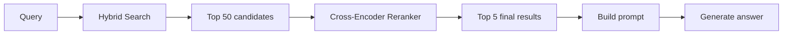
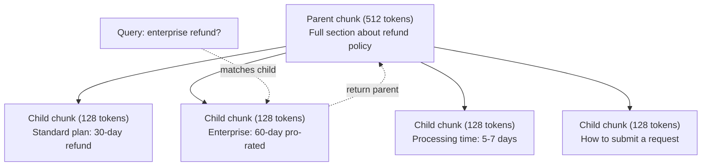
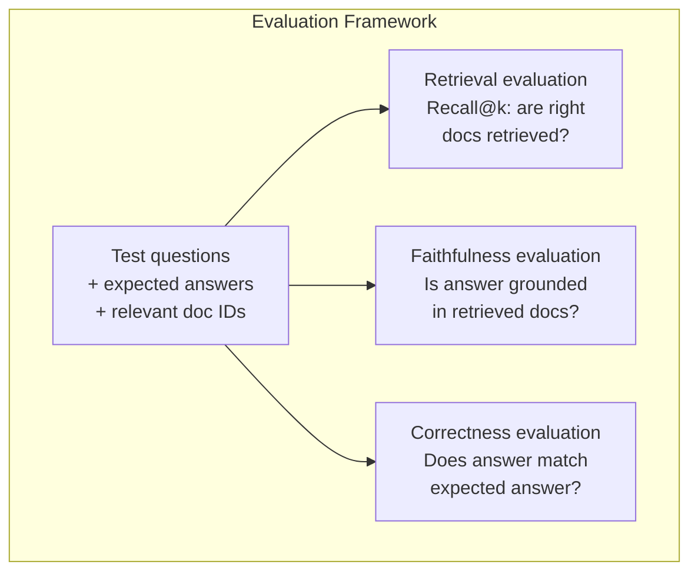

# 進階 RAG（分塊、重新排序與混合搜尋）

> 基礎 RAG 僅僅是檢索 top-k 個最相似的區塊。這對簡單問題尚能應付。一旦面對多跳推理（multi-hop reasoning）、語意模糊的查詢與海量語料庫時，它便徹底瓦解。進階 RAG 正是在「只能在 10 份文件上運作的示範」與「能在 1,000 萬份文件上穩定執行的生產級系統」之間的關鍵差異。

**Type:** Build
**Languages:** Python
**Prerequisites:** Phase 11, Lesson 06 (RAG)
**Time:** ~90 minutes
**Related:** Phase 5 · 23 (Chunking Strategies for RAG) covers all six chunking algorithms — recursive, semantic, sentence, parent-document, late chunking, contextual retrieval — with Vectara/Anthropic benchmarks. This lesson builds on top: hybrid search, reranking, query transformation.

## Learning Objectives｜學習目標

- 實作進階分塊策略（語意分塊、遞迴分塊、父子分塊），以完整保全文獻結構與背景脈絡
- 建構融合 BM25 關鍵字比對、語意向量搜尋與交叉編碼器重新排序（cross-encoder reranker）的混合搜尋管線
- 套用查詢轉換技術（HyDE、多重查詢（multi-query）、後退提問 step-back），提升在模糊或複雜問題上的檢索召回能力
- 診斷並修復常見的 RAG 失效問題：檢索到錯誤區塊、答案未包含於脈絡中、多跳推理鏈斷裂

## The Problem｜問題

你在第 06 課建構了基礎 RAG 管線。在小型語料庫上處理簡單直白的問題時，它運作良好。現在試著處理以下情境：

**模糊查詢（Ambiguous query）**：「上季度的營收是多少？」語意搜尋回傳了關於營收策略、營收預測以及財務長對營收成長看法的片段。它們在語意上皆與「營收」一詞高度相似，但沒有一個包含具體的數字。包含答案的區塊寫的是 2025 年第三季為 4,720 萬美元，但用的是「earnings」（獲利）一詞而非「revenue」（營收）。embedding 模型認為「revenue strategy」比「第三季 earnings 為 4,720 萬美元」更接近查詢。

**多跳問題（Multi-hop question）**：「哪一個團隊的客戶滿意度提升幅度最高？」這需要先分別找出每個團隊的歷史滿意度評分、計算差異進行比較，最後得出最大值。沒有任何單一區塊直接包含最終答案，關鍵資訊分散在各團隊的獨立報告中。

**海量語料庫挑戰（Large corpus problem）**：當系統擁有 200 萬個區塊，正確答案位於第 1,847,293 號區塊。你的 top-5 檢索撈出了第 14 號、第 89,201 號、第 1,200,000 號、第 44 號與第 901,333 號區塊。它們在 embedding 空間中確實很近，但全都不包含實質答案。在此規模下，近似最近鄰（approximate nearest neighbor）搜尋引入了足夠的近似搜尋造成的誤差，將真正相關的結果擠出了 top-k 之外。

基礎 RAG 之所以失效，是因為向量相似度並不等同於問題關聯度。一個區塊可以在語意上與查詢高度相似，卻對解答問題毫無實質幫助。進階 RAG 透過四大關鍵技術破解此困境：混合搜尋（加入關鍵字精確比對）、重新排序（對候選名單進行再次評分候選文件）、查詢轉換（在搜尋前重構查詢語句），以及更精細的分塊設計（以合適粒度檢索）。

## The Concept｜核心概念

### 混合搜尋：語意 + 關鍵字

語意搜尋（向量相似度）擅長掌握抽象概念。「如何取消我的訂閱？」能精準命中「終止方案的具體步驟」，即便兩者沒有任何共享詞彙。但它極易漏掉精確的符號比對。如果 embedding 模型將特定的錯誤碼視為無意義雜訊，它便可能無法精準檢索包含「錯誤碼 E-4021」的技術手冊。

關鍵字搜尋（BM25）則恰恰相反。它在字面精確比對上能精確比對。「E-4021」能完全吻合；但若文件寫著「終止方案」，搜尋「取消訂閱」便會完全沒有結果。

混合搜尋同時平行執行這兩套機制，並將結果融合。

**BM25**（Best Matching 25）是標準演算法的關鍵字搜尋演算法，自 1990 年代起便一直是現代搜尋引擎的核心骨幹（backbone）。其計算公式：

```
BM25(q, d) = sum over terms t in q:
    IDF(t) * (tf(t,d) * (k1 + 1)) / (tf(t,d) + k1 * (1 - b + b * |d| / avgdl))
```

其中 tf(t,d) 是詞 t 在文件 d 中的詞頻（term frequency），IDF(t) 是逆文件頻率（inverse document frequency），|d| 是文件長度，avgdl 是語料庫的平均文件長度，k1 控制詞頻飽和（saturation）度（預設值為 1.2），b 控制長度正規化程度（預設值為 0.75）。

白話來說：當文件包含查詢詞（特別是罕見詞）時，BM25 會給予較高分數，但對重複出現的單字施加邊際收益遞減。包含「營收」一詞 50 次的文件，其關聯性絕不會是出現 1 次的文件的 50 倍。

### 倒數排名融合（Reciprocal Rank Fusion, RRF）

當你擁有兩份排序清單（一份來自向量搜尋，一份來自 BM25），該如何將它們融合成單一榜單？倒數排名融合（RRF）是業界公認的常見做法：

```
RRF_score(d) = sum over rankings R:
    1 / (k + rank_R(d))
```

其中 k 是一個平滑常數（通常設為 60），用以避免排在第一名的結果過度主導總分。

某份文件在向量搜尋中排名第 1，在 BM25 中排名第 5，其得分為：1/(60+1) + 1/(60+5) = 0.0164 + 0.0154 = 0.0318

另一份文件在向量搜尋中排名第 3，在 BM25 中排名第 2，其得分為：1/(60+3) + 1/(60+2) = 0.0159 + 0.0161 = 0.0320

RRF 能自然權衡兩路訊號。在兩份清單中皆名列前茅的文件會獲得最高綜合分；僅在其中一份榜單奪冠但在另一份榜上無名的文件，則獲得中等評分。這套演算法極具穩健性，因為它純粹依據排名（Rank）而非原始相似度分數進行融合，徹底規避了兩套系統間分數尺度與分布不對稱的棘手難題。

### 重新排序（Reranking）

初步檢索（無論是純向量、純關鍵字或混合搜尋）追求的是速度，精度相對粗糙。它採用雙編碼器（Bi-encoders）：查詢與文件各自獨立向量化並比對，文件向量能事先預先計算並快取，進而能輕易擴展至數百萬文件規模。

重新排序則採用交叉編碼器（Cross-encoders）：將查詢與候選文件合併輸入至單一模型中，直接預測細緻的關聯度評分。模型能同時綜觀雙方文字，精準捕捉字詞間深度的交叉互動。交叉編碼器能清晰理解「第三季獲利是多少？」與包含「Q3 數字為 4,720 萬美元」的區塊具有極高關聯，即使雙編碼器未能辨識此關聯了這層關聯。

其權衡在於速度：交叉編碼器比雙編碼器慢 100 到 1000 倍，因為它必須對每對「查詢—文件」重新執行完整的推論計算，不可能事先為數百萬文件預算分數。標準解決方案：先以混合搜尋快速撈出較大的候選清單（如 top-50），再由交叉編碼器進行重新排序，取回最終 top-5的 top-5。



主流重新排序模型（2026 最新陣容）：
- Cohere Rerank 3.5：代管 API、強大多語言支援、在混合語料庫上具備最高召回增益
- Voyage rerank-2.5：代管 API、代管方案中延遲最低
- Jina-Reranker-v2 Multilingual：開源權重、支援 100+ 種語言
- bge-reranker-v2-m3：開源權重、綜合表現強勁的標竿基準
- cross-encoder/ms-marco-MiniLM-L-6-v2：開源權重、可在 CPU 上高效執行以供快速原型驗證
- ColBERTv2 / Jina-ColBERT-v2：晚期互動多向量重新排序器——在評分時複雜度取決於 token 數而非完整文件推論

### 查詢轉換（Query Transformation）

有時檢索品質低劣的根源並非檢索器本身，而是使用者提出的查詢本身不夠明確。「上週說的那個新政策改動是什麼？」是一句極差的搜尋指令：缺乏具體名詞、embedding 極度模糊，沒有任何檢索系統能單憑此句在海量資料庫中找出正確文件。

**查詢改寫（Query rewriting）**：由 LLM 將使用者的口語提問重構為更符合搜尋引擎特性的高品質查詢詞：

```
User: "What was that thing about the new policy change?"
Rewritten: "Recent policy changes and updates"
```

**HyDE（假設性文件 Embedding，Hypothetical Document Embeddings）**：不再直接拿問題去搜尋，而是讓 LLM 先虛擬生成一份「假設性答案」，將該假想答案轉化為 embedding，再去搜尋相似的真實文件：

```
Query: "What is the refund policy for enterprise?"
Hypothetical answer: "Enterprise customers are eligible for a full refund
within 60 days of purchase. Refunds are pro-rated based on the remaining
subscription period and processed within 5-7 business days."
```

為這份假想答案生成 embedding，並在向量庫中搜尋與之最為鄰近的真實文件。其核心直覺在於：在 embedding 幾何空間中，假想答案往往比起原始問題更加貼近真實答案。問題與答案本質上具備不同的語言結構；透過生成假想答案，你成功搭建了跨越「問題空間」與「解答空間」的語意橋樑。

HyDE 的代價是在檢索前增加了一次 LLM 呼叫，會額外引入 500 到 2000ms 的延遲。但當原始查詢極度口語或模糊時，這項投入對檢索品質的提升無可替代。

### 父子分塊（Parent-Child Chunking）

傳統分塊面臨著難以調和的兩難：小區塊能帶來精準的向量檢索，但大區塊才能為解答提供足夠完整的脈絡。父子分塊徹底打破了這項妥協。

將小區塊（128 tokens）建立索引專門用於向量檢索；當某個小區塊被命中撈出時，系統自動將其所屬的完整大父區塊（512 tokens）注入至最終的 Prompt 中。小區塊負責精確咬合查詢語意，父區塊負責為 LLM 提供充沛的推理依據。



查詢「enterprise refund?」極其精準地命中了子區塊 C2。但在送入 LLM 時，Prompt 接收到的是包含審核時效與申請途徑等周邊完整上下文的整個父區塊 P。

### 詮釋資料過濾（Metadata Filtering）

在執行向量搜尋之前，先透過結構化詮釋資料（日期、來源、類別、作者、語言）對語料庫進行預先過濾。這能大幅縮小搜尋空間，杜絕無關雜訊的干擾。

「上個月資安政策有何更動？」在檢索時理應僅鎖定過去 30 天內且歸屬於資安分類的文件。若缺乏詮釋資料過濾，搜尋將被迫在全量語料庫中漫遊，極可能撈出一份在語意上碰巧相似、但已過期兩年的陳舊規範。

生產級 RAG 系統會在每個區塊旁綁定豐富的詮釋資料：來源文件、建立時間、類別標籤、作者版本等。向量資料庫在向量相似度比對前先執行詮釋資料預過濾，這對於百萬規模以上的大型系統效能至關重要。

### 評估機制

你建置了一套 RAG 系統，該如何客觀衡量其品質？三大核心維度：

**檢索關聯度（Recall@k）**：針對附帶標準答案文件標註的測試問題集，衡量相關文件出現在 top-k 結果中的比例。若某問題的解答位於第 47 號區塊，第 47 號區塊是否成功闖進前 5 名？

**忠實度（Faithfulness）**：生成的解答是否嚴格扎根於檢索出的參考文件？若檢索區塊載明「60 天退款期限」，而模型回答「90 天退款期限」，這便是典型的忠實度失效。模型即便拿到了正確脈絡，依然脫軌產生了幻覺。

**答案正確性（Answer correctness）**：生成的回答是否在實質上符合預期標準答案？這是終端使用者最在意的端到端指標，綜合體現了檢索品質與生成推理的總成果。

簡易的忠實度檢查：將生成解答拆解為獨立事實陳述句，逐一檢驗每句話是否在實質語意上皆能由檢索區塊所支撐。若解答中出現了任何不存在於檢索內容中的外部資訊，極有可能是模型幻覺所致。



```figure
agentic-rag-loop
```

## Build It｜動手實作

### 步驟 1：BM25 實作

```python
import math
from collections import Counter

class BM25:
    def __init__(self, k1=1.2, b=0.75):
        self.k1 = k1
        self.b = b
        self.docs = []
        self.doc_lengths = []
        self.avg_dl = 0
        self.doc_freqs = {}
        self.n_docs = 0

    def index(self, documents):
        self.docs = documents
        self.n_docs = len(documents)
        self.doc_lengths = []
        self.doc_freqs = {}

        for doc in documents:
            words = doc.lower().split()
            self.doc_lengths.append(len(words))
            unique_words = set(words)
            for word in unique_words:
                self.doc_freqs[word] = self.doc_freqs.get(word, 0) + 1

        self.avg_dl = sum(self.doc_lengths) / self.n_docs if self.n_docs else 1

    def score(self, query, doc_idx):
        query_words = query.lower().split()
        doc_words = self.docs[doc_idx].lower().split()
        doc_len = self.doc_lengths[doc_idx]
        word_counts = Counter(doc_words)
        score = 0.0

        for term in query_words:
            if term not in word_counts:
                continue
            tf = word_counts[term]
            df = self.doc_freqs.get(term, 0)
            idf = math.log((self.n_docs - df + 0.5) / (df + 0.5) + 1)
            numerator = tf * (self.k1 + 1)
            denominator = tf + self.k1 * (1 - self.b + self.b * doc_len / self.avg_dl)
            score += idf * numerator / denominator

        return score

    def search(self, query, top_k=10):
        scores = [(i, self.score(query, i)) for i in range(self.n_docs)]
        scores.sort(key=lambda x: x[1], reverse=True)
        return scores[:top_k]
```

### 步驟 2：倒數排名融合

```python
def reciprocal_rank_fusion(ranked_lists, k=60):
    scores = {}
    for ranked_list in ranked_lists:
        for rank, (doc_id, _) in enumerate(ranked_list):
            if doc_id not in scores:
                scores[doc_id] = 0.0
            scores[doc_id] += 1.0 / (k + rank + 1)
    fused = sorted(scores.items(), key=lambda x: x[1], reverse=True)
    return fused
```

### 步驟 3：混合搜尋管線

```python
def hybrid_search(query, chunks, vector_embeddings, vocab, idf, bm25_index, top_k=5, fusion_k=60):
    query_emb = tfidf_embed(query, vocab, idf)
    vector_results = search(query_emb, vector_embeddings, top_k=top_k * 3)
    bm25_results = bm25_index.search(query, top_k=top_k * 3)
    fused = reciprocal_rank_fusion([vector_results, bm25_results], k=fusion_k)
    return fused[:top_k]
```

### 步驟 4：簡易重新排序器

在正式環境中，此處通常會呼叫交叉編碼器模型。此處我們實作一個依據字詞重疊、關鍵詞權重與短語匹配對「查詢—文件」進行關聯度評分的重新排序器。

```python
def rerank(query, candidates, chunks):
    query_words = set(query.lower().split())
    stop_words = {"the", "a", "an", "is", "are", "was", "were", "what", "how",
                  "why", "when", "where", "do", "does", "for", "of", "in", "to",
                  "and", "or", "on", "at", "by", "it", "its", "this", "that",
                  "with", "from", "be", "has", "have", "had", "not", "but"}
    query_terms = query_words - stop_words

    scored = []
    for doc_id, initial_score in candidates:
        chunk = chunks[doc_id].lower()
        chunk_words = set(chunk.split())

        term_overlap = len(query_terms & chunk_words)

        query_bigrams = set()
        q_list = [w for w in query.lower().split() if w not in stop_words]
        for i in range(len(q_list) - 1):
            query_bigrams.add(q_list[i] + " " + q_list[i + 1])
        bigram_matches = sum(1 for bg in query_bigrams if bg in chunk)

        position_boost = 0
        for term in query_terms:
            pos = chunk.find(term)
            if pos != -1 and pos < len(chunk) // 3:
                position_boost += 0.5

        rerank_score = (
            term_overlap * 1.0
            + bigram_matches * 2.0
            + position_boost
            + initial_score * 5.0
        )
        scored.append((doc_id, rerank_score))

    scored.sort(key=lambda x: x[1], reverse=True)
    return scored
```

### 步驟 5：HyDE（假設性文件 Embedding）

```python
def hyde_generate_hypothesis(query):
    templates = {
        "what": "The answer to '{query}' is as follows: Based on our documentation, {topic} involves specific policies and procedures that define how the process works.",
        "how": "To address '{query}': The process involves several steps. First, you need to initiate the request. Then, the system processes it according to the defined rules.",
        "default": "Regarding '{query}': Our records indicate specific details and policies related to this topic that provide a comprehensive answer."
    }
    query_lower = query.lower()
    if query_lower.startswith("what"):
        template = templates["what"]
    elif query_lower.startswith("how"):
        template = templates["how"]
    else:
        template = templates["default"]

    topic_words = [w for w in query.lower().split()
                   if w not in {"what", "is", "the", "how", "do", "does", "a", "an",
                                "for", "of", "to", "in", "on", "at", "by", "and", "or"}]
    topic = " ".join(topic_words) if topic_words else "this topic"

    return template.format(query=query, topic=topic)


def hyde_search(query, chunks, vector_embeddings, vocab, idf, top_k=5):
    hypothesis = hyde_generate_hypothesis(query)
    hypothesis_emb = tfidf_embed(hypothesis, vocab, idf)
    results = search(hypothesis_emb, vector_embeddings, top_k)
    return results, hypothesis
```

### 步驟 6：父子分塊

```python
def create_parent_child_chunks(text, parent_size=200, child_size=50):
    words = text.split()
    parents = []
    children = []
    child_to_parent = {}

    parent_idx = 0
    start = 0
    while start < len(words):
        parent_end = min(start + parent_size, len(words))
        parent_text = " ".join(words[start:parent_end])
        parents.append(parent_text)

        child_start = start
        while child_start < parent_end:
            child_end = min(child_start + child_size, parent_end)
            child_text = " ".join(words[child_start:child_end])
            child_idx = len(children)
            children.append(child_text)
            child_to_parent[child_idx] = parent_idx
            child_start += child_size

        parent_idx += 1
        start += parent_size

    return parents, children, child_to_parent
```

### 步驟 7：忠實度評估

```python
def evaluate_faithfulness(answer, retrieved_chunks):
    answer_sentences = [s.strip() for s in answer.split(".") if len(s.strip()) > 10]
    if not answer_sentences:
        return 1.0, []

    grounded = 0
    ungrounded = []
    context = " ".join(retrieved_chunks).lower()

    for sentence in answer_sentences:
        words = set(sentence.lower().split())
        stop_words = {"the", "a", "an", "is", "are", "was", "were", "and", "or",
                      "to", "of", "in", "for", "on", "at", "by", "it", "this", "that"}
        content_words = words - stop_words
        if not content_words:
            grounded += 1
            continue

        matched = sum(1 for w in content_words if w in context)
        ratio = matched / len(content_words) if content_words else 0

        if ratio >= 0.5:
            grounded += 1
        else:
            ungrounded.append(sentence)

    score = grounded / len(answer_sentences) if answer_sentences else 1.0
    return score, ungrounded


def evaluate_retrieval_recall(queries_with_relevant, retrieval_fn, k=5):
    total_recall = 0.0
    results = []

    for query, relevant_indices in queries_with_relevant:
        retrieved = retrieval_fn(query, k)
        retrieved_indices = set(idx for idx, _ in retrieved)
        relevant_set = set(relevant_indices)
        hits = len(retrieved_indices & relevant_set)
        recall = hits / len(relevant_set) if relevant_set else 1.0
        total_recall += recall
        results.append({
            "query": query,
            "recall": recall,
            "hits": hits,
            "total_relevant": len(relevant_set)
        })

    avg_recall = total_recall / len(queries_with_relevant) if queries_with_relevant else 0
    return avg_recall, results
```

## Use It｜實際應用

使用真實的交叉編碼器進行重新排序：

```python
from sentence_transformers import CrossEncoder

reranker = CrossEncoder("cross-encoder/ms-marco-MiniLM-L-6-v2")

def rerank_with_cross_encoder(query, candidates, chunks, top_k=5):
    pairs = [(query, chunks[doc_id]) for doc_id, _ in candidates]
    scores = reranker.predict(pairs)
    scored = list(zip([doc_id for doc_id, _ in candidates], scores))
    scored.sort(key=lambda x: x[1], reverse=True)
    return scored[:top_k]
```

使用 Cohere 代管的重新排序服務：

```python
import cohere

co = cohere.Client()

def rerank_with_cohere(query, candidates, chunks, top_k=5):
    docs = [chunks[doc_id] for doc_id, _ in candidates]
    response = co.rerank(
        model="rerank-english-v3.0",
        query=query,
        documents=docs,
        top_n=top_k
    )
    return [(candidates[r.index][0], r.relevance_score) for r in response.results]
```

搭配真實 LLM 實作 HyDE：

```python
import anthropic

client = anthropic.Anthropic()

def hyde_with_llm(query):
    response = client.messages.create(
        model="claude-sonnet-5",
        max_tokens=256,
        messages=[{
            "role": "user",
            "content": f"Write a short paragraph that would be a good answer to this question. Do not say you don't know. Just write what the answer would look like.\n\nQuestion: {query}"
        }]
    )
    return response.content[0].text
```

使用 Weaviate 實作生產級混合搜尋：

```python
import weaviate

client = weaviate.connect_to_local()

collection = client.collections.get("Documents")
response = collection.query.hybrid(
    query="enterprise refund policy",
    alpha=0.5,
    limit=10
)
```

其中 alpha 參數控制平衡比例：0.0 代表純關鍵字（BM25），1.0 代表純向量，0.5 代表兩者等權重。大多數正式環境系統會將 alpha 設定在 0.3 到 0.7 之間。

## Ship It｜交付成果

本課產出兩項產物：
- `outputs/prompt-advanced-rag-debugger.md`——用於診斷與排除 RAG 檢索品質瑕疵的除錯 Prompt
- `outputs/skill-advanced-rag.md`——涵蓋混合搜尋與重新排序機制的正式環境 RAG 建置技能手冊

## Exercises｜練習

1. 在範例文件上比對 BM25 vs 向量搜尋 vs 混合搜尋的表現。針對 5 個測試查詢分別記錄哪種方法能在第 1 名回傳最具關聯性的區塊。混合搜尋應在至少 3 個查詢中勝出。

2. 實作詮釋資料過濾器。為每份文件附加「category」欄位（資安 security、計費 billing、API、產品 product）。在執行向量搜尋前，將區塊限制在相關分類中。測試查詢「採用了何種加密技術？」，確認系統僅搜尋 security 分類下的區塊。

3. 使用第 06 課的簡易生成函式建構完整的 HyDE 管線。針對 5 個測試查詢，比較直接查詢與 HyDE 搜尋的 top-3 關聯度。HyDE 在語意模糊的口語查詢上應展現出明顯優勢。

4. 在範例文件上實作父子分塊策略。設定 child_size=30 與 parent_size=100。透過子區塊檢索，但將父區塊注入 Prompt 中。將生成的答案與 chunk_size=50 的標準分塊進行品質對比。

5. 建立一套評估資料集：包含 10 道問題及其已知的答案區塊編號。分別測量 (a) 純向量搜尋、(b) 純 BM25、(c) 混合搜尋，以及 (d) 混合搜尋 + 重新排序的 Recall@3、Recall@5 與 Recall@10。繪製對比圖，分析重新排序在哪些場景助益最大。

## Key Terms｜關鍵術語

| 術語 | 常見說法 | 實際意義 |
|------|----------------|----------------------|
| BM25 | 「關鍵字搜尋」 | 一種機率排名演算法，依據詞頻、逆文件頻率與文件長度正規化為文件評分 |
| 混合搜尋（Hybrid search） | 「兼採兩者之長」 | 平行執行語意向量搜尋與 BM25 關鍵字搜尋，隨後透過排名融合演算法合併結果 |
| 倒數排名融合（Reciprocal Rank Fusion, RRF） | 「合併排名清單」 | 透過對所有清單累加 1/(k + rank) 來合併多份排序榜單，完全不受各系統分數尺度影響 |
| 重新排序（Reranking） | 「二次細部打分」 | 使用運算成本較高但極度精準的交叉編碼器模型，對初篩候選集進行深度重新評分 |
| 交叉編碼器（Cross-encoder） | 「聯合評估模型」 | 將查詢與文件合併為單一輸入並輸出關聯度分數的模型；精度遠高於雙編碼器，但無法預先計算整個語料庫的交叉編碼器分數；因此只對初篩候選集重新排序 |
| 雙編碼器（Bi-encoder） | 「獨立向量化模型」 | 將查詢與文件各自獨立編碼為向量的模型；速度飛快因為向量可預先快取，但交互精細度遜於交叉編碼器 |
| HyDE | 「用假想答案搜尋」 | 先為問題生成一份虛擬答案並向量化，隨後搜尋與之語意鄰近的真實文件以架構橋樑 |
| 父子分塊（Parent-child chunking） | 「小塊檢索，大塊回答」 | 以細粒度的小區塊負責精準命中檢索，以大篇幅的父區塊注入 Prompt 提供充沛脈絡 |
| 詮釋資料過濾（Metadata filtering） | 「搜尋前先縮小範圍」 | 在執行向量比對前，先依據結構化屬性（日期、來源、類別）剔除無關文件以縮小搜尋空間 |
| 忠實度（Faithfulness） | 「答案是否有所本」 | 生成的回答是否嚴格由檢索出的文件所支撐，而非來自模型訓練資料庫中未經證實的內在幻覺 |

## Further Reading｜延伸閱讀

- Robertson & Zaragoza, "The Probabilistic Relevance Framework: BM25 and Beyond" (2009) ——BM25 權威經典參考文獻，闡明公式背後的機率論理論基礎
- Cormack et al., "Reciprocal Rank Fusion Outperforms Condorcet and Individual Rank Learning Methods" (2009) ——證明 RRF 優於更複雜機器學習融合方法的原創奠基論文
- Gao et al., "Precise Zero-Shot Dense Retrieval without Relevance Labels" (2022) ——證明假設性文件 embedding 在無需任何訓練資料下顯著提升檢索品質的 HyDE 原創論文
- Nogueira & Cho, "Passage Re-ranking with BERT" (2019) ——證實以交叉編碼器在 BM25 之上重新排序能大幅拉升檢索品質的先驅研究
- [Khattab et al., "DSPy: Compiling Declarative Language Model Calls into Self-Improving Pipelines" (2023)](https://arxiv.org/abs/2310.03714) ——將 Prompt 建構與權重挑選視為檢索管線上的編譯最佳化問題；邁向「程式化呼叫 LLM」的必讀之作
- [Edge et al., "From Local to Global: A Graph RAG Approach to Query-Focused Summarization" (Microsoft Research 2024)](https://arxiv.org/abs/2404.16130) ——微軟 GraphRAG 論文：結合實體關係抽取與 Leiden 社群偵測（community detection）技術，專門解決巨觀全域性摘要檢索
- [Asai et al., "Self-RAG: Learning to Retrieve, Generate, and Critique through Self-Reflection" (ICLR 2024)](https://arxiv.org/abs/2310.11511) ——透過反思 token 實現自我評估與動態檢索的 Self-RAG，跨越靜態檢索邁向 Agent 前沿
- [LangChain Query Construction blog](https://blog.langchain.dev/query-construction/) ——如何在檢索前將自然語言查詢轉換為結構化資料庫查詢（Text-to-SQL、Cypher）的實用專文
