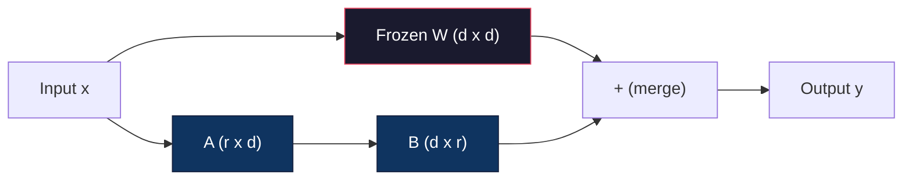
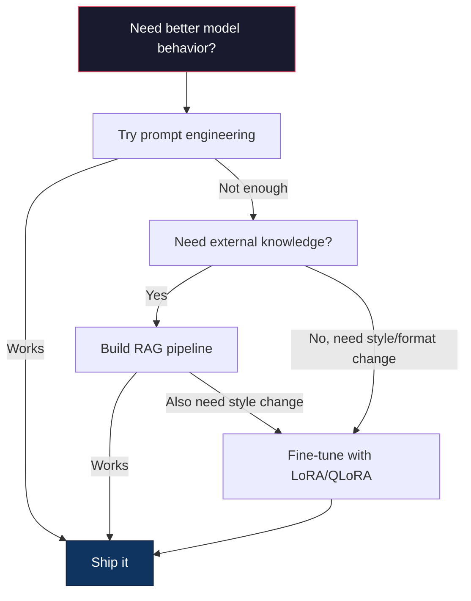

# 使用 LoRA 與 QLoRA 進行 Fine-Tuning

> 完整 fine-tuning 一個 7B 模型需要 56GB 的 VRAM。你沒有這樣的硬體，大多數公司也沒有。LoRA 讓你只需訓練不到 1% 的參數，就能在 6GB 記憶體內完成同一個模型的 fine-tuning。這並非退而求其次的妥協——在多數任務上，它的表現媲美全量 fine-tuning。整個開源 fine-tuning 生態系都建立在這一項技巧之上。

**Type:** Build
**Languages:** Python
**Prerequisites:** Phase 10, Lesson 06 (Instruction Tuning / SFT)
**Time:** ~75 minutes
**Related:** Phase 10 covers the SFT/DPO loops from scratch. This lesson plugs those into the 2026 PEFT toolkits (PEFT, TRL, Unsloth, Axolotl, LLaMA-Factory).

## Learning Objectives｜學習目標

- 透過將低秩轉接矩陣（A 與 B）注入預訓練（pretraining）模型的注意力層（attention layer）來實作 LoRA
- 計算 LoRA 相較於全量 fine-tuning 的參數節省效益：在 d_model 維度下使用秩 r 僅需訓練 2*r*d 個參數，而非 d^2
- 使用 QLoRA（4 位元量化基模型 + LoRA 轉接器）進行模型 fine-tuning，使其能容納於消費級 GPU 記憶體中
- 將 LoRA 權重合併回基模型以便部署，並對比附加轉接器與合併後的推論速度

## The Problem｜問題

你擁有一個基模型：Llama 3 8B。你希望它以你公司的特定語氣回答客服工單。SFT（監督式 fine-tuning）是正解。但 SFT 的成本是個問題。

全量 fine-tuning 會更新模型中的每一個參數。Llama 3 8B 擁有 80 億個參數。在 fp16 精度下，每個參數佔用 2 個位元組。光是載入模型權重就需 16GB。在訓練期間，你還需要為梯度預留 16GB、為 Adam 最佳化器（optimizer）狀態（動量 + 變異數）預留 32GB，再加上活化值（activations）記憶體。總計：單一 8B 模型大約需要 56GB 的 VRAM。

一張 A100 80GB 顯卡勉強放得下。在雲端服務供應商租用兩張 A100 的費用約為每小時 3 到 4 美元；在 50,000 筆樣本上訓練 3 個 epoch 需 6 到 10 小時，單次實驗成本約 30 到 40 美元。若執行 10 次實驗以調校超參數，在尚未正式部署任何系統前，你就已經花掉了 $400。

若將此規模擴展到 Llama 3 70B，數字將變得荒謬：單是存放權重就需要 140GB，必須調動多節點叢集，單次實驗成本動輒 $100+。

此外還有較深層的問題。全量 fine-tuning 會修改模型中的每一個權重。若你針對客服資料進行訓練，可能會損害模型的通用泛化能力。這被稱為災難性遺忘（catastrophic forgetting）——模型在你的專業任務上變強了，但在其他所有領域卻變差了。

你需要一種訓練極少參數、佔用極少記憶體，且不會破壞模型既有知識的方法。

## The Concept｜核心概念

### LoRA：低秩適應

微軟的 Edward Hu 等人於 2021 年 6 月發表了 LoRA。該論文的洞見在於：神經網路在 fine-tuning 期間的權重更新矩陣具有較低的「內在秩」（intrinsic rank）。你不需要更新 4096x4096 權重矩陣中的全部 1,670 萬個參數；更新中所蘊含的有效資訊，能由秩數為 16 或 32 的低秩矩陣捕捉。

其底層數學原理如下。標準線性層（linear layer）計算：

```
y = Wx
```

其中 W 為 d_out x d_in 矩陣。對於 4096x4096 的注意力投影層而言，這相當於 16,777,216 個參數。

LoRA 凍結原始權重 W，並疊加一個低秩分解矩陣：

```
y = Wx + BAx
```

其中 B 的維度為 (d_out x r)，A 的維度為 (r x d_in)。秩數 r 遠小於原始維度 d——實務上通常設為 8、16 或 32。

以 4096x4096 線性層搭配 r=16 為例：
- 原始參數量：4096 x 4096 = 16,777,216
- LoRA 參數量：(4096 x 16) + (16 x 4096) = 65,536 + 65,536 = 131,072
- 參數縮減比例（parameter reduction ratio）：131,072 / 16,777,216 = 0.78%

你只訓練了 0.78% 的參數，卻能達到原有品質的 95% 到 100%。



矩陣 A 採用常態高斯分布隨機初始化（initialization）；矩陣 B 則初始化為零。這意味著在訓練啟動的瞬間，LoRA 旁路的輸出為零——模型從原本的行為出發，隨後逐步學習對特定任務的適應調整。

### 縮放因子（scaling factor）：Alpha

LoRA 引入了一個縮放因子 alpha，用以控制低秩更新項對最終輸出的影響權重：

```
y = Wx + (alpha / r) * BAx
```

當 alpha = r 時，縮放倍率為 1x；當 alpha = 2r（社群常見的預設值）時，縮放倍率為 2x。這項超參數允許你在不更動基礎學習率的前提下，獨立調節 LoRA 旁路更新的學習強度。

實務調校法則：
- alpha = 2 * rank 是開源社群廣泛採納的慣例（原始論文在多數實驗中採用 alpha = rank）
- alpha = rank 提供 1x 的保守穩定縮放
- 較高的 alpha 意味著每一步的權重調整幅度更大，有助於加速收斂，但也可能導致數值不穩定

### 該在哪些層套用 LoRA？

Transformer 內部包含眾多線性層。你並不需要為所有線性層都附加 LoRA。原始論文測試了不同組合的效益：

| 目標層（target layers） | 可訓練參數量（7B） | 品質 |
|--------------|----------------------|---------|
| 僅 q_proj | 4.7M | 良好 |
| q_proj + v_proj | 9.4M | 更佳 |
| q_proj + k_proj + v_proj + o_proj | 18.9M | 注意力層的最佳組合 |
| 全量線性層（注意力 + MLP） | 37.7M | 邊際增益微弱，參數量翻倍 |

多數任務的最佳折衷點：q_proj + v_proj。這針對自注意力機制中的 Query 與 Value 投影矩陣，後者控制了模型關注何處以及擷取何種資訊。針對程式碼生成等較複雜的任務，加入 MLP 層有所幫助，但在一般任務中它會使參數量翻倍且邊際回報遞減。

### 秩數的挑選

秩數 r 決定了適應調校的表達容量：

| 秩數（Rank） | 每個線性層可訓練參數量 | 適用場景 |
|------|---------------------------|----------|
| 4 | 32,768 | 簡易文字分類、情緒分析 |
| 8 | 65,536 | 單一領域問答、文章摘要 |
| 16 | 131,072 | 多領域綜合任務、指令遵循 |
| 32 | 262,144 | 複雜邏輯推理、程式碼生成 |
| 64 | 524,288 | 對多數任務已出現邊際效益遞減 |
| 128 | 1,048,576 | 極少有實務正當理由 |

Hu 等人的實驗顯示，r=4 在簡易任務上就已能捕捉大部分的適應調整（adaptation）。在實務上，r=8 與 r=16 是最普遍的首選。將 r 擴大至超過 64 極少能帶來品質提升，並逐漸失去 LoRA 的記憶體節省優勢。

### QLoRA：4 位元量化 + LoRA

華盛頓大學的 Tim Dettmers 等人於 2023 年 5 月發表了 QLoRA。其核心想法是：先將凍結的基模型權重以 4 位元精度量化，再於其上附加 fp16 精度的 LoRA 轉接器。

這大幅改變了訓練記憶體的公式：

| 方案 | 權重記憶體（7B） | 訓練期總記憶體（7B） | 所需硬體規格 |
|--------|-------------------|---------------------|-------------|
| 全量 fine-tuning（fp16） | 14GB | ~56GB | 1x A100 80GB |
| LoRA（fp16 基模型） | 14GB | ~18GB | 1x A100 40GB |
| QLoRA（4 位元基模型） | 3.5GB | ~6GB | 1x RTX 3090 24GB |

QLoRA 在技術上有三項貢獻：

**NF4（Normal Float 4 位元）**：專為神經網路權重分布量身打造的全新資料型別（data type）。神經網路權重大致符合常態分布（normal distribution）。NF4 將其 16 個量化階梯設在標準常態分布的分位數上。這在資訊理論上是常態分布資料的最佳量化表示法，保留的資訊比均勻 4 位元量化（INT4）或標準 Float4 更多。

**二次量化（Double quantization）**：量化常數本身也需要消耗空間。每 64 個權重區塊需要一個 fp32 縮放因子（4 位元組）。在 7B 模型中，這會額外佔用 0.4GB。二次量化將這些縮放因子進一步壓縮為 fp8，將額外開銷壓低至 0.1GB。節省的記憶體雖不多，但積少成多。

**分頁最佳化器（Paged optimizers）**：在訓練長序列文本時，最佳化器狀態（Adam 的動量與變異數）可能會超出 GPU 記憶體上限。分頁最佳化器運用 NVIDIA 的統一記憶體（Unified Memory）機制，當 GPU 顯存（GPU memory）即將耗盡時，自動將最佳化器狀態分頁置換至 CPU RAM，並在需要時換回。這在付出些微吞吐代價的前提下，避免了 OOM 崩潰。

### 品質衰減疑慮

減少參數或量化基模型，是否會損害產出品質？多篇論文的結果如下：

| 方案 | MMLU（5-shot） | MT-Bench | HumanEval |
|--------|--------------|----------|-----------|
| 全量 fine-tuning（Llama 2 7B） | 48.3 | 6.72 | 14.6 |
| LoRA r=16 | 47.9 | 6.68 | 14.0 |
| QLoRA r=16（NF4） | 47.5 | 6.61 | 13.4 |
| QLoRA r=64（NF4） | 48.1 | 6.70 | 14.2 |

LoRA 在 r=16 時，在多數基準測試上與全量 fine-tuning 的差距不到 1%。QLoRA 在 r=16 時僅再微幅落後零點幾個百分點；而當提升至 r=64 時，QLoRA 在節省 90% 記憶體開銷的同時，表現幾乎完全追平全量 fine-tuning。

### 真實環境下的成本估算

在 50,000 筆樣本上對 Llama 3 8B 進行 3 個 epoch 的訓練成本對比：

| 方案 | GPU 規格 | 耗時 | 費用估算 |
|--------|-----|------|------|
| 全量 fine-tuning | 2x A100 80GB | 8 小時 | ~$32 |
| LoRA r=16 | 1x A100 40GB | 4 小時 | ~$8 |
| QLoRA r=16 | 1x RTX 4090 24GB | 6 小時 | ~$5 |
| QLoRA r=16（Unsloth） | 1x RTX 4090 24GB | 2.5 小時 | ~$2 |
| QLoRA r=16 | 1x T4 16GB | 12 小時 | ~$4 |

在單張消費級顯卡上執行 QLoRA，成本還比一頓便當便宜。這正是開放權重（open-weight）模型的 fine-tuning 社群在 2023 年迅速成長的原因，也是 2026 年下述所有主流訓練框架皆預設支援 QLoRA 的原因。

### 2026 PEFT 工具鏈生態

| 框架 | 定位與特色 | 適用時機 |
|-----------|-----------|-----------|
| **Hugging Face PEFT** | 涵蓋 LoRA/QLoRA/DoRA/IA3 的標準函式庫 | 需要原始精細控制權，且訓練迴圈已建置於 `transformers.Trainer` 上 |
| **TRL** | HF 旗下的回饋強化學習訓練器（SFT、DPO、GRPO、PPO、ORPO） | 在 SFT 之後需串接 DPO/GRPO；底層基於 PEFT 建構 |
| **Unsloth** | 以手寫 Triton 核心改寫前向與反向傳遞 | 追求 2 到 5 倍加速、VRAM 減半且沒有準確率損失；支援 Llama/Mistral/Qwen 家族 |
| **Axolotl** | 封裝 PEFT + TRL + DeepSpeed + Unsloth 的 YAML 設定式框架 | 追求可重現、納入版本控制的訓練流程 |
| **LLaMA-Factory** | 建構於 PEFT 與 TRL 之上、提供 GUI/CLI/API 的訓練套件 | 追求免寫程式碼即可訓練；支援 100 多種主流模型家族 |
| **torchtune** | 官方 PyTorch 原生訓練配方，不需 `transformers` 相依套件 | 追求較少的外部相依，且團隊內部已標準化為 PyTorch 原生架構 |

實務選型經驗法則：學術研究或單次探索實驗 → PEFT。可重現的正式環境訓練管線 → 啟用 Unsloth 核心的 Axolotl。快速原型開發 → LLaMA-Factory。

### 轉接器合併

訓練告一段落後，你手上有兩樣資產：被凍結的基模型，以及一個小型的 LoRA 轉接器（通常僅 10 到 100MB）。你有兩種部署策略：

1. **保持獨立分離**：載入基模型，並在執行期載入轉接器。可隨任務切換不同轉接器。這是單一基模型同時服務多種特定任務的標準模式。

2. **永久合併**：計算 W' = W + (alpha/r) * BA，並將結果另存為一個新的完整模型。合併後的模型大小與原始模型相同，沒有額外的推論開銷。

若需兼顧多種不同業務任務（客服轉接器、程式碼轉接器、翻譯轉接器），請保持分離架構；若專門為單一特定業務部署專屬模型，建議直接合併。

進階的多轉接器融合技術：

- **TIES-Merging**（Yadav 等人，2023）：先剔除微小參數、化解正負號衝突，隨後進行融合。降低多個轉接器間的干擾。
- **DARE**（Yu 等人，2023）：在融合前隨機丟棄轉接器參數並對剩餘權重重新縮放。在跨領域能力融合上效果出乎意料地好。
- **任務向量四則運算（Task arithmetic）**：直接對轉接器權重做向量加減運算。將「程式碼」轉接器與「數學」轉接器直接向量相加，通常能得到同時擅長兩者的模型。

### 何時「不該」進行 Fine-Tuning？

Fine-tuning 是第三種選項，而不是第一選項。

**第一優先：Prompt 工程。** 撰寫更好的系統提示、加入少樣本範例、使用思維鏈。這不需要額外硬體成本，只要幾分鐘就能迭代。如果純 Prompt 能解決 80% 的問題，你通常不需要 fine-tuning。

**第二優先：RAG。** 若模型需要吸收的是專屬業務知識（內部文件、知識庫、產品目錄），檢索架構比將資料寫入神經權重的做法成本更低，也更容易維護。詳見第 06 課。

**第三選擇：Fine-tuning。** 僅在以下情境採用：需要模型內化純靠 Prompt 無法達成的特定風格、固定輸出格式或推理模式；需要穩定一致的結構化輸出；需要將較大的模型蒸餾為較小的模型；或者在延遲很重要的場景下，無法負擔少樣本提示所帶來的額外 token 開銷。



```figure
lora-params
```

## Build It｜動手實作

我們使用純 PyTorch 從零實作 LoRA。不依賴外部函式庫，也沒有隱藏的黑箱。你將親手建構 LoRA 層、注入模型、完成訓練並將權重融合回原本的線性層。

### 步驟 1：LoRA 層

```python
import torch
import torch.nn as nn
import math

class LoRALayer(nn.Module):
    def __init__(self, in_features, out_features, rank=8, alpha=16):
        super().__init__()
        self.rank = rank
        self.alpha = alpha
        self.scaling = alpha / rank

        self.A = nn.Parameter(torch.randn(in_features, rank) * (1 / math.sqrt(rank)))
        self.B = nn.Parameter(torch.zeros(rank, out_features))

    def forward(self, x):
        return (x @ self.A @ self.B) * self.scaling
```

矩陣 A 採用縮放常態分布隨機初始化；矩陣 B 初始化為零。乘積 BA 的起步貢獻為零，確保模型在訓練一開始維持原本的行為。

### 步驟 2：封裝 LoRA 的線性層

```python
class LinearWithLoRA(nn.Module):
    def __init__(self, linear, rank=8, alpha=16):
        super().__init__()
        self.linear = linear
        self.lora = LoRALayer(
            linear.in_features, linear.out_features, rank, alpha
        )

        for param in self.linear.parameters():
            param.requires_grad = False

    def forward(self, x):
        return self.linear(x) + self.lora(x)
```

原始線性層凍結，唯有 LoRA 的參數（A 與 B）設定為可訓練。

### 步驟 3：將 LoRA 注入模型中

```python
def inject_lora(model, target_modules, rank=8, alpha=16):
    for param in model.parameters():
        param.requires_grad = False

    lora_layers = {}
    for name, module in model.named_modules():
        if isinstance(module, nn.Linear):
            if any(t in name for t in target_modules):
                parent_name = ".".join(name.split(".")[:-1])
                child_name = name.split(".")[-1]
                parent = dict(model.named_modules())[parent_name]
                lora_linear = LinearWithLoRA(module, rank, alpha)
                setattr(parent, child_name, lora_linear)
                lora_layers[name] = lora_linear
    return lora_layers
```

首先凍結模型中的每一個權重參數。接著走訪模型樹狀結構，尋找名稱命中目標的線性層，並以封裝好的 LoRA 線性層原地替換。LoRA 的 A 與 B 矩陣便成為全模型中唯一可訓練的參數。

### 步驟 4：統計參數數量

```python
def count_parameters(model):
    total = sum(p.numel() for p in model.parameters())
    trainable = sum(p.numel() for p in model.parameters() if p.requires_grad)
    frozen = total - trainable
    return {
        "total": total,
        "trainable": trainable,
        "frozen": frozen,
        "trainable_pct": 100 * trainable / total if total > 0 else 0
    }
```

### 步驟 5：將權重合併回基模型

```python
def merge_lora_weights(model):
    for name, module in model.named_modules():
        if isinstance(module, LinearWithLoRA):
            with torch.no_grad():
                merged = (
                    module.lora.A @ module.lora.B
                ) * module.lora.scaling
                module.linear.weight.data += merged.T
            parent_name = ".".join(name.split(".")[:-1])
            child_name = name.split(".")[-1]
            if parent_name:
                parent = dict(model.named_modules())[parent_name]
            else:
                parent = model
            setattr(parent, child_name, module.linear)
```

完成合併後，LoRA 旁路層被移除。模型大小與原始模型相同，調校成果已寫入底層權重矩陣中，推論時沒有額外開銷。

### 步驟 6：模擬 QLoRA 量化

```python
def quantize_to_nf4(tensor, block_size=64):
    blocks = tensor.reshape(-1, block_size)
    scales = blocks.abs().max(dim=1, keepdim=True).values / 7.0
    scales = torch.clamp(scales, min=1e-8)
    quantized = torch.round(blocks / scales).clamp(-8, 7).to(torch.int8)
    return quantized, scales

def dequantize_from_nf4(quantized, scales, original_shape):
    dequantized = quantized.float() * scales
    return dequantized.reshape(original_shape)
```

這在 CPU/GPU 上透過 64 個數字的分塊區間，將浮點權重對應至 16 個離散階梯，模擬 4 位元量化行為。正式環境的 QLoRA 會使用 bitsandbytes 函式庫，在 GPU 上執行真正的 NF4 運算。

### 步驟 7：訓練迴圈

```python
def train_lora(model, data, epochs=5, lr=1e-3, batch_size=4):
    optimizer = torch.optim.AdamW(
        [p for p in model.parameters() if p.requires_grad], lr=lr
    )
    criterion = nn.MSELoss()

    losses = []
    for epoch in range(epochs):
        epoch_loss = 0.0
        n_batches = 0
        indices = torch.randperm(len(data["inputs"]))

        for i in range(0, len(indices), batch_size):
            batch_idx = indices[i:i + batch_size]
            x = data["inputs"][batch_idx]
            y = data["targets"][batch_idx]

            output = model(x)
            loss = criterion(output, y)

            optimizer.zero_grad()
            loss.backward()
            optimizer.step()

            epoch_loss += loss.item()
            n_batches += 1

        avg_loss = epoch_loss / n_batches
        losses.append(avg_loss)

    return losses
```

### 步驟 8：完整實戰展示

```python
def demo():
    torch.manual_seed(42)
    d_model = 256
    n_classes = 10

    model = nn.Sequential(
        nn.Linear(d_model, 512),
        nn.ReLU(),
        nn.Linear(512, 512),
        nn.ReLU(),
        nn.Linear(512, n_classes),
    )

    n_samples = 500
    x = torch.randn(n_samples, d_model)
    y = torch.randint(0, n_classes, (n_samples,))
    y_onehot = torch.zeros(n_samples, n_classes).scatter_(1, y.unsqueeze(1), 1.0)

    data = {"inputs": x, "targets": y_onehot}

    params_before = count_parameters(model)

    lora_layers = inject_lora(
        model, target_modules=["0", "2"], rank=8, alpha=16
    )

    params_after = count_parameters(model)

    losses = train_lora(model, data, epochs=20, lr=1e-3)

    merge_lora_weights(model)
    params_merged = count_parameters(model)

    return {
        "params_before": params_before,
        "params_after": params_after,
        "params_merged": params_merged,
        "losses": losses,
    }
```

展示流程建立一個輕量模型、在兩層線性層中注入 LoRA、執行訓練，並把權重合併回去。可訓練參數在 LoRA 訓練期間降至約 1%，合併後則回到原本的架構。

## Use It｜實際應用

在 Hugging Face 生態系中，對真實大型語言模型實作 LoRA 僅需約 20 行程式碼：

```python
from transformers import AutoModelForCausalLM, AutoTokenizer
from peft import LoraConfig, get_peft_model, TaskType

model = AutoModelForCausalLM.from_pretrained("meta-llama/Llama-3.1-8B")
tokenizer = AutoTokenizer.from_pretrained("meta-llama/Llama-3.1-8B")

lora_config = LoraConfig(
    task_type=TaskType.CAUSAL_LM,
    r=16,
    lora_alpha=32,
    lora_dropout=0.05,
    target_modules=["q_proj", "v_proj"],
)

model = get_peft_model(model, lora_config)
model.print_trainable_parameters()
```

若要啟用 QLoRA，加入 bitsandbytes 量化組態：

```python
from transformers import BitsAndBytesConfig

bnb_config = BitsAndBytesConfig(
    load_in_4bit=True,
    bnb_4bit_quant_type="nf4",
    bnb_4bit_compute_dtype=torch.bfloat16,
    bnb_4bit_use_double_quant=True,
)

model = AutoModelForCausalLM.from_pretrained(
    "meta-llama/Llama-3.1-8B",
    quantization_config=bnb_config,
    device_map="auto",
)

model = get_peft_model(model, lora_config)
```

就是這麼簡單。相同的訓練迴圈，相同的資料管線。基模型改以 4 位元格式存放，LoRA 轉接器以 fp16 精度訓練，整個訓練流程能在 6GB 記憶體內執行。

搭配 Hugging Face Trainer 開始訓練：

```python
from transformers import TrainingArguments, Trainer
from datasets import load_dataset

dataset = load_dataset("tatsu-lab/alpaca", split="train[:5000]")

training_args = TrainingArguments(
    output_dir="./lora-llama",
    num_train_epochs=3,
    per_device_train_batch_size=4,
    gradient_accumulation_steps=4,
    learning_rate=2e-4,
    fp16=True,
    logging_steps=10,
    save_strategy="epoch",
    optim="paged_adamw_8bit",
)

trainer = Trainer(
    model=model,
    args=training_args,
    train_dataset=dataset,
)

trainer.train()

model.save_pretrained("./lora-adapter")
```

產出的轉接器僅有 10 到 100MB。基模型維持不變。你可以在 Hugging Face Hub 上分享你的 LoRA 轉接器，而不需要重新傳遞龐大的基模型。

## Ship It｜交付成果

本課產出兩項產物：
- `outputs/prompt-lora-advisor.md`——協助你針對特定業務任務決定合適的 LoRA 秩數、目標層位與超參數的諮詢 Prompt
- `outputs/skill-fine-tuning-guide.md`——傳授 agent 何時該採用 fine-tuning 以及如何正確選型的決策架構手冊

## Exercises｜練習

1. **秩數消融實驗（Rank ablation study）**：使用秩數 2、4、8、16、32 與 64 分別執行展示程式碼。繪製最終損失（loss）對秩數的折線圖。找出「將秩數翻倍已無法讓損失減半」的邊際收益遞減臨界點。在 256 維特徵的分類任務上，該點大約會落在 r=8 到 16 之間。

2. **目標層效益對比**：修改 inject_lora 分別僅針對層「0」、僅針對層「2」、僅針對層「4」，以及同時針對這三層。每組設定訓練 20 個 epoch。比較收斂速度與最終損失，觀察實務中在 q_proj vs v_proj vs 全量線性層之間的選型權衡。

3. **量化誤差分析**：取得訓練後的模型在 quantize_to_nf4 與 dequantize_from_nf4 處理前後的權重矩陣。計算均方誤差（MSE）、最大絕對誤差，以及原始權重與還原權重之間的相關性係數（correlation coefficient）。嘗試不同的 block_size（32、64、128 與 256）進行對比。

4. **多轉接器動態切換**：在不同的資料子集上分別訓練兩個 LoRA 轉接器（偶數索引 vs 奇數索引）。將兩個轉接器分別存檔。僅載入基模型一次，在推論期動態置換轉接器，並驗證相同輸入在不同轉接器下產出不同的輸出。這是正式環境中，單一基模型服務多條業務線的常見做法。

5. **合併前後的推論效能對比**：在相同的 100 筆測試輸入上，比對 merge_lora_weights 執行前後的輸出數值。確認輸出在浮點數誤差容許度（1e-5）內完全一致。隨後評測兩者的推論延遲——合併後的版本因消除了額外的矩陣乘法與相加運算，速度應略快。

## Key Terms｜關鍵術語

| 術語 | 常見說法 | 實際意義 |
|------|----------------|----------------------|
| LoRA | 「高效 fine-tuning」 | 低秩適應：凍結基模型權重，僅訓練 A 與 B 兩個低秩小矩陣，其乘積近似全量權重更新 |
| QLoRA | 「在筆電上跑 fine-tuning」 | 量化 LoRA：以 4 位元 NF4 精度載入基模型，在其外層附加 fp16 的 LoRA 轉接器，使 7B 模型能在 6GB VRAM 內完成訓練 |
| 秩數（Rank, r） | 「模型能學多少」 | 矩陣 A 與 B 的內部低維度大小；控制模型的適應表達容量與參數量開銷 |
| Alpha | 「LoRA 的學習率乘數」 | 作用於 LoRA 輸出的縮放常數；以 alpha/r 的比例調節適應路徑對最終輸出的貢獻 |
| NF4 | 「4 位元量化」 | Normal Float 4：一種將量化階梯對齊於常態分布分位數的 4 位元型別，最適合神經網路權重 |
| 轉接器（Adapter） | 「訓練出來的小檔案」 | 獨立儲存為檔案（10 到 100MB）的 LoRA A 與 B 權重矩陣，可動態載入至任何相同基模型之上 |
| 目標層（Target modules） | 「要對哪幾層做 LoRA」 | 被選中注入 LoRA 轉接器的特定線性層（如 q_proj、v_proj、k_proj 等） |
| 權重合併（Merging） | 「直接融進模型」 | 計算 W + (alpha/r) * BA 並直接替換原始權重矩陣，消除推論期間的轉接器額外開銷 |
| 分頁最佳化器（Paged optimizers） | 「避免訓練時 OOM」 | 當 GPU 記憶體告急時，利用統一記憶體架構自動將最佳化器狀態分頁置換至 CPU 記憶體 |
| 災難性遺忘（Catastrophic forgetting） | 「學了新東西忘了舊本事」 | 當更新全部神經權重時，模型會失去先前學到的能力 |

## Further Reading｜延伸閱讀

- Hu et al., "LoRA: Low-Rank Adaptation of Large Language Models" (2021) ——提出低秩分解適應方法的原始論文，在 GPT-3 175B 上測試，秩最低至 r=4
- Dettmers et al., "QLoRA: Efficient Finetuning of Quantized Language Models" (2023) ——提出 NF4、二次量化與分頁最佳化器，使在單張 48GB 顯卡上 fine-tuning 65B 模型成為可能
- PEFT library documentation (huggingface.co/docs/peft) ——Hugging Face 生態系中支援 LoRA、QLoRA 與其他參數量效率方法的標準函式庫
- Yadav et al., "TIES-Merging: Resolving Interference When Merging Models" (2023) ——探討如何合併多個 LoRA 轉接器，同時避免品質劣化
- [Rafailov et al., "Direct Preference Optimization: Your Language Model is Secretly a Reward Model" (NeurIPS 2023)](https://arxiv.org/abs/2305.18290) ——DPO 數學推導論文；接續在 SFT 之後的偏好對齊階段，無需額外訓練獎勵模型
- [TRL documentation](https://huggingface.co/docs/trl/) ——官方技術手冊，涵蓋 `SFTTrainer`、`DPOTrainer`、`KTOTrainer` 以及與 PEFT/bitsandbytes/Unsloth 整合的介面
- [Unsloth documentation](https://docs.unsloth.ai/) ——透過融合核心，使 fine-tuning 吞吐量翻倍、記憶體減半
- [Axolotl documentation](https://axolotl-ai-cloud.github.io/axolotl/) ——基於 YAML 宣告式設定的多 GPU SFT/DPO/QLoRA 訓練套件；「設定即程式碼」的替代方案
