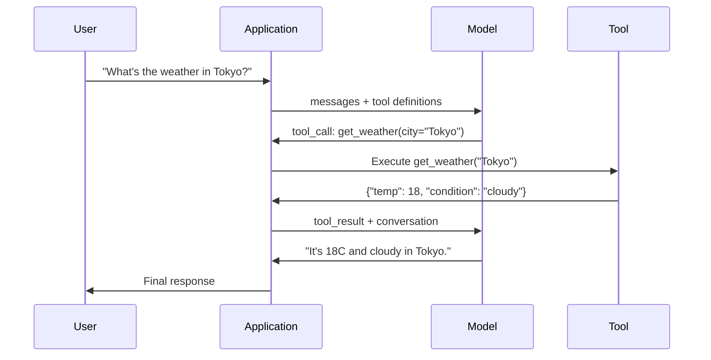

# 函式呼叫與工具呼叫（Function Calling & Tool Use）

> LLM 本身無法執行任何實際操作。它們生成文字，這就是它們的全部能耐。它們無法查詢天氣、無法查詢資料庫、無法寄送電子郵件、無法執行程式碼，也無法讀取檔案。你所見過的所有「AI agent」，都是 LLM 產出指示該呼叫何種函式的 JSON——接著由你的程式碼去真正執行。模型是大腦，工具是雙手，而函式呼叫就是串聯兩者的神經系統。

**Type:** Build
**Languages:** Python
**Prerequisites:** Phase 11 Lesson 03 (Structured Outputs)
**Time:** ~75 minutes
**Related:** Phase 11 · 14 (Model Context Protocol) — when a tool is shared across hosts, graduate from inline function-calling to an MCP server. This lesson covers the inline case; MCP covers the protocol case.

## Learning Objectives｜學習目標

- 實作函式呼叫迴圈（function-calling loop）：定義工具 Schema、剖析模型產出的工具呼叫 JSON、執行函式並回傳結果
- 設計具備清晰語意描述與型別化參數的工具 Schema，讓模型能可靠地發起呼叫
- 建構能串接多次函式呼叫以回答複雜問題的多輪 agent 迴圈
- 妥善處理函式呼叫的邊界情況：平行工具呼叫、錯誤傳播，以及防止無限工具迴圈

## The Problem｜問題

你建置了一款聊天機器人。使用者提問：「東京現在的天氣如何？」

模型回答：「我無法存取即時天氣資料，但根據當前季節，東京的氣溫大約在攝氏 15 度左右……」

這是一段包裝在免責聲明裡的幻覺。模型不知道天氣，它永遠不會知道。天氣每小時都在變動，而模型的訓練資料已是數個月前的陳舊紀錄。

正確的解答需要呼叫 OpenWeatherMap API，取得目前溫度，並回傳實際的數字。模型自己無法呼叫 API，但你的程式碼可以。缺少的環節是一套結構化的通訊協定：讓模型能表達「我需要帶著這些引數呼叫天氣 API」，並允許你的程式碼執行該呼叫後將結果回填給模型。

這就是函式呼叫（Function Calling）。模型輸出結構化的 JSON，描述該以何種引數呼叫何種函式。你的應用程式執行該函式，將執行結果送回對話流中，模型再根據這項真實資料產出最終解答。

沒有函式呼叫，LLM 只是靜態的百科全書；有了函式呼叫，它們就變成了 agent。

## The Concept｜核心概念

### 函式呼叫迴圈

每一次工具呼叫互動皆遵循相同的 5 步驟迴圈：



步驟 1：使用者送出訊息。步驟 2：模型接收到訊息以及工具定義（描述可用函式的 JSON Schema）。步驟 3：模型不直接回傳文字，而是輸出一個工具呼叫——一個包含函式名稱與引數的結構化 JSON 物件。步驟 4：你的程式碼執行該函式並捕捉回傳結果。步驟 5：結果送回給模型，模型此時擁有了客觀資料以產出最終解答。

模型自始至終都不會親自執行任何程式碼。它只負責決定「該呼叫什麼」以及「傳入什麼引數」。你的程式碼才是真正的執行者。

### 工具定義：JSON Schema 合約

每個工具皆由一份 JSON Schema 進行宣告，向模型說明該函式的用途、接受哪些引數，以及各引數的型別約束：

```json
{
  "type": "function",
  "function": {
    "name": "get_weather",
    "description": "Get current weather for a city. Returns temperature in Celsius and conditions.",
    "parameters": {
      "type": "object",
      "properties": {
        "city": {
          "type": "string",
          "description": "City name, e.g. 'Tokyo' or 'San Francisco'"
        },
        "units": {
          "type": "string",
          "enum": ["celsius", "fahrenheit"],
          "description": "Temperature units"
        }
      },
      "required": ["city"]
    }
  }
}
```

其中 `description` 欄位很關鍵。模型依據這段文字描述來判斷何時以及如何呼叫該工具。模糊的描述（如「gets weather」）產出的工具選擇結果較差，不如精確詳盡的說明（「Get current weather for a city. Returns temperature in Celsius and conditions.」）。這段描述本質上就是寫給模型看的工具挑選 Prompt。

### 各家服務供應商（provider）對比

當前所有主流服務供應商皆原生支援函式呼叫，但在 API 介面定義上略有分歧：

| 服務供應商（provider） | API 參數名稱 | 工具呼叫格式 | 平行呼叫能力 | 強制呼叫設定 |
|----------|--------------|-----------------|---------------|----------------|
| OpenAI (GPT-5, o4) | `tools` | `tool_calls[].function` | 支援（每輪可多個） | `tool_choice="required"` |
| Anthropic (Claude 4.6/4.7) | `tools` | `content[].type="tool_use"` | 支援（多個區塊） | `tool_choice={"type":"any"}` |
| Google (Gemini 3) | `function_declarations` | `functionCall` | 支援 | `function_calling_config` |
| 開放權重模型 (Llama 4, Qwen3, DeepSeek-V3) | Llama 4 原生支援 `tools`；其他採 Hermes 或 ChatML | 格式各異 | 視模型而定 | 基於 Prompt 或特定 `tool_choice` |

至 2026 年，三大封閉式服務供應商已趨於一致，採用近乎相同的 JSON-Schema 格式。Llama 4 提供了與 OpenAI 原生相容的 `tools` 欄位。開放權重的 fine-tuned 模型仍有差異——NousResearch 的 Hermes 格式是第三方調校中最普遍的規範。對於需要在多主機間共享的通用工具，建議優先採用 MCP（Phase 11 · 14）而非行內寫死的函式呼叫——因為其伺服器端實作對所有平台通用。

### 工具挑選模式：自動、強制與指定

你能控制模型何時使用工具：

**Auto（自動，預設值）**：模型自主決定該呼叫工具還是直接文字回應。「2+2 是多少？」——直接回答；「現在天氣如何？」——發起工具呼叫。

**Required（強制）**：模型必須在此輪至少呼叫一個工具。當你已確定使用者意圖必須由工具處理時採用此設定，能避免模型不查詢真實資料、只靠猜測作答。

**Specific function（指定特定函式）**：強制模型必須呼叫某個指定函式。例如 `tool_choice={"type":"function", "function": {"name": "get_weather"}}` 能確保無論使用者說什麼，模型都必定呼叫天氣工具。這適合用於路由分發——當上游邏輯已經決定需要哪個工具時。

### 平行函式呼叫（parallel function calling）

GPT-4o 與 Claude 能在單一回應輪次中同時呼叫多個函式。當使用者詢問：「東京和紐約現在的天氣如何？」模型能一次輸出兩個平行的工具呼叫：

```json
[
  {"name": "get_weather", "arguments": {"city": "Tokyo"}},
  {"name": "get_weather", "arguments": {"city": "New York"}}
]
```

你的程式碼能平行執行兩者、蒐集兩者的結果並送回，模型隨後整合輸出一份連貫的解答。這將往返輪次從 2 次縮減為 1 次。對於每次查詢需觸發 5 到 10 次工具呼叫的 agent 而言，平行呼叫能降低 60% 到 80% 的延遲。

### 結構化輸出（structured output）vs 函式呼叫

第 03 課探討了結構化輸出。函式呼叫採用了相同的 JSON Schema 底層機制，但用途不同：

**結構化輸出**：迫使模型產出符合特定形狀的資料。這個輸出就是最終成果。例如：從文字中擷取產品資訊，輸出為 `{name, price, in_stock}` JSON 物件。

**函式呼叫**：模型宣告執行特定動作的意向。這個輸出只是中間步驟。例如：`get_weather(city="Tokyo")`——模型正在請求外部系統協助執行操作，而非直接產出最終回答。

當你的目標是純資料擷取時，請使用結構化輸出；當你期望模型與外部真實系統進行動態互動時，請使用函式呼叫。

### 資安防護：不可妥協的規則

函式呼叫是你能賦予 LLM 的能力中，風險最高的一項。由模型自主決定執行內容：如果你的工具庫包含資料庫查詢，模型負責構造 SQL；如果包含終端機指令，模型負責撰寫 Shell script。

**規則 1：絕不要將模型生成的 SQL 直接送入資料庫執行。** 模型可能產生 DROP TABLE、UNION 注入，或回傳所有資料列的查詢。永遠實施參數化查詢，永遠進行輸入驗證，並永遠限制在使用允許操作的白名單內。

**規則 2：以白名單限定函式。** 模型僅能呼叫你明確定義的函式，絕不要實作「依名稱動態呼叫任意內部函式」的通用函式執行工具。即便你有 50 個內部函式，也僅能對模型暴露該業務場景所需的 5 個。

**規則 3：驗證所有引數。** 模型傳入的城市名稱可能是 `"; DROP TABLE users; --"`。在執行函式前，必須根據預期型別、數值範圍與格式逐一驗證每個引數。

**規則 4：過濾工具回傳結果。** 若工具回傳了機密或敏感資料（API Key、個人隱私 PII、內部錯誤），在送回給模型前必須完成過濾與脫敏。模型會將這些內容逐字納入最終回答中。

**規則 5：實施工具呼叫速率限制（rate limit）。** 陷入迴圈的模型可能會呼叫工具數百次。請設定上限（單一對話內 10 到 20 次呼叫是合理的防線），阻斷無限迴圈。

### 錯誤處理機制

工具難免會遭遇失敗：第三方 API 逾時、資料庫斷線、檔案不存在。模型必須能理解工具為何失敗以及失敗的細節。

請將錯誤包裝為結構化的工具回傳結果，而非直接拋出例外中斷整個程式：

```json
{
  "error": true,
  "message": "City 'Toky' not found. Did you mean 'Tokyo'?",
  "code": "CITY_NOT_FOUND"
}
```

模型讀取到這段錯誤脈絡後，會自動修正其傳入的引數並發起重新嘗試。現代 LLM 很擅長依據結構化錯誤訊息自我修正；但若你只回傳空字串或模糊的「something went wrong」，它們就難以從中恢復。

### MCP：模型脈絡協定

MCP 是 Anthropic 發起的工具互通開放標準。與其讓每個應用程式各自定義工具，MCP 提供了一套通用通訊協定：由 MCP 伺服器端提供工具，由 MCP 用戶端（如 Claude Code、Cursor 或你自己的應用）使用。

單一 MCP 伺服器能將工具暴露給任何相容的用戶端。一套 Postgres MCP 伺服器能賦予所有支援 MCP 的 agent 存取資料庫的能力；一套 GitHub MCP 伺服器能讓所有 agent 存取程式碼倉庫。工具只需實作一次，就能在任何地方使用。

MCP 之於函式呼叫，正如 HTTP 之於網路。它將傳輸層標準化，使工具具備可移植性。

```figure
mx-tool-call-loop
```

## Build It｜動手實作

### 步驟 1：定義工具註冊表（tool registry）

建置一個儲存工具定義與其具體實作的註冊中心。每個工具包含一份給模型看的 JSON Schema 定義，以及一份供程式碼執行的 Python 函式。

```python
import ast
import json
import math
import time
import hashlib


TOOL_REGISTRY = {}


def register_tool(name, description, parameters, function):
    TOOL_REGISTRY[name] = {
        "definition": {
            "type": "function",
            "function": {
                "name": name,
                "description": description,
                "parameters": parameters,
            },
        },
        "function": function,
    }
```

### 步驟 2：實作 5 個實用工具

實作計算機、天氣查詢、網路搜尋模擬器、檔案讀取器，以及具備防護機制的程式碼執行器。

```python
def calculator(expression, precision=2):
    allowed = set("0123456789+-*/.() ")
    if not all(c in allowed for c in expression):
        return {"error": True, "message": f"Invalid characters in expression: {expression}"}
    try:
        result = eval(expression, {"__builtins__": {}}, {"math": math})
        return {"result": round(float(result), precision), "expression": expression}
    except Exception as e:
        return {"error": True, "message": str(e)}


WEATHER_DB = {
    "tokyo": {"temp_c": 18, "condition": "cloudy", "humidity": 72, "wind_kph": 14},
    "new york": {"temp_c": 22, "condition": "sunny", "humidity": 45, "wind_kph": 8},
    "london": {"temp_c": 12, "condition": "rainy", "humidity": 88, "wind_kph": 22},
    "san francisco": {"temp_c": 16, "condition": "foggy", "humidity": 80, "wind_kph": 18},
    "sydney": {"temp_c": 25, "condition": "sunny", "humidity": 55, "wind_kph": 10},
}


def get_weather(city, units="celsius"):
    key = city.lower().strip()
    if key not in WEATHER_DB:
        suggestions = [c for c in WEATHER_DB if c.startswith(key[:3])]
        return {
            "error": True,
            "message": f"City '{city}' not found.",
            "suggestions": suggestions,
            "code": "CITY_NOT_FOUND",
        }
    data = WEATHER_DB[key].copy()
    if units == "fahrenheit":
        data["temp_f"] = round(data["temp_c"] * 9 / 5 + 32, 1)
        del data["temp_c"]
    data["city"] = city
    return data


SEARCH_DB = {
    "python function calling": [
        {"title": "OpenAI Function Calling Guide", "url": "https://platform.openai.com/docs/guides/function-calling", "snippet": "Learn how to connect LLMs to external tools."},
        {"title": "Anthropic Tool Use", "url": "https://docs.anthropic.com/en/docs/tool-use", "snippet": "Claude can interact with external tools and APIs."},
    ],
    "MCP protocol": [
        {"title": "Model Context Protocol", "url": "https://modelcontextprotocol.io", "snippet": "An open standard for connecting AI models to data sources."},
    ],
    "weather API": [
        {"title": "OpenWeatherMap API", "url": "https://openweathermap.org/api", "snippet": "Free weather API with current, forecast, and historical data."},
    ],
}


def web_search(query, max_results=3):
    key = query.lower().strip()
    for db_key, results in SEARCH_DB.items():
        if db_key in key or key in db_key:
            return {"query": query, "results": results[:max_results], "total": len(results)}
    return {"query": query, "results": [], "total": 0}


FILE_SYSTEM = {
    "data/config.json": '{"model": "gpt-4o", "temperature": 0.7, "max_tokens": 4096}',
    "data/users.csv": "name,email,role\nAlice,alice@example.com,admin\nBob,bob@example.com,user",
    "README.md": "# My Project\nA tool-use agent built from scratch.",
}


def read_file(path):
    if ".." in path or path.startswith("/"):
        return {"error": True, "message": "Path traversal not allowed.", "code": "FORBIDDEN"}
    if path not in FILE_SYSTEM:
        available = list(FILE_SYSTEM.keys())
        return {"error": True, "message": f"File '{path}' not found.", "available_files": available, "code": "NOT_FOUND"}
    content = FILE_SYSTEM[path]
    return {"path": path, "content": content, "size_bytes": len(content), "lines": content.count("\n") + 1}


def run_code(code, language="python"):
    if language != "python":
        return {"error": True, "message": f"Language '{language}' not supported. Only 'python' is available."}
    try:
        tree = ast.parse(code)
    except SyntaxError as e:
        return {"error": True, "message": f"SyntaxError: {e}", "code": "SYNTAX_ERROR"}
    unsafe_names = {"exec", "eval", "compile", "__import__", "open", "globals", "locals", "vars", "getattr", "setattr", "delattr"}
    for node in ast.walk(tree):
        if isinstance(node, (ast.Import, ast.ImportFrom)):
            return {"error": True, "message": "Forbidden operation: import is not allowed", "code": "SECURITY_VIOLATION"}
        if isinstance(node, ast.Attribute) and node.attr.startswith("__") and node.attr.endswith("__"):
            return {"error": True, "message": "Forbidden operation: dunder attribute access is not allowed", "code": "SECURITY_VIOLATION"}
        if isinstance(node, ast.Name) and node.id in unsafe_names:
            return {"error": True, "message": f"Forbidden operation: {node.id} is not allowed", "code": "SECURITY_VIOLATION"}
    try:
        local_vars = {}
        exec(code, {"__builtins__": {"print": print, "range": range, "len": len, "str": str, "int": int, "float": float, "list": list, "dict": dict, "sum": sum, "min": min, "max": max, "abs": abs, "round": round, "sorted": sorted, "enumerate": enumerate, "zip": zip, "map": map, "filter": filter, "math": math}}, local_vars)
        result = local_vars.get("result", None)
        return {"success": True, "result": result, "variables": {k: str(v) for k, v in local_vars.items() if not k.startswith("_")}}
    except Exception as e:
        return {"error": True, "message": f"{type(e).__name__}: {e}"}
```

單純的字串黑名單僅是把程式碼當作字面文字掃描，容易漏掉任何未被字面命中的變形。將程式碼剖析為抽象語法樹（AST）並進行遍歷，使防護層能從語法結構層級攔截 `import` 陳述式、雙底線特殊屬性存取（試圖回溯至直譯器核心物件的 `__class__` 與 `__globals__` 鏈結），以及危險的內建函式名稱。即便如此，仍應將此視為教學用的過濾器，而不是真正的邊界。任何行程內的軟體防護都會與其執行的程式碼共享同一個直譯器空間，具備決心的攻擊者仍可能找到可以觸及的物件。正式環境系統應在隔離的獨立行程或輕量容器（如卸除特權的子行程、gVisor、Firecracker 或外部沙盒服務）中執行不可信程式碼，如此一來即使發生逃逸，攻擊者也僅是被困在拋棄式的沙盒環境中，無法危及你的主機服務。

### 步驟 3：註冊所有工具

```python
def register_all_tools():
    register_tool(
        "calculator", "Evaluate a mathematical expression. Supports +, -, *, /, parentheses, and decimals. Returns the numeric result.",
        {"type": "object", "properties": {"expression": {"type": "string", "description": "Math expression, e.g. '(10 + 5) * 3'"}, "precision": {"type": "integer", "description": "Decimal places in result", "default": 2}}, "required": ["expression"]},
        calculator,
    )
    register_tool(
        "get_weather", "Get current weather for a city. Returns temperature, condition, humidity, and wind speed.",
        {"type": "object", "properties": {"city": {"type": "string", "description": "City name, e.g. 'Tokyo' or 'San Francisco'"}, "units": {"type": "string", "enum": ["celsius", "fahrenheit"], "description": "Temperature units, defaults to celsius"}}, "required": ["city"]},
        get_weather,
    )
    register_tool(
        "web_search", "Search the web for information. Returns a list of results with title, URL, and snippet.",
        {"type": "object", "properties": {"query": {"type": "string", "description": "Search query"}, "max_results": {"type": "integer", "description": "Maximum results to return", "default": 3}}, "required": ["query"]},
        web_search,
    )
    register_tool(
        "read_file", "Read the contents of a file. Returns the file content, size, and line count.",
        {"type": "object", "properties": {"path": {"type": "string", "description": "Relative file path, e.g. 'data/config.json'"}}, "required": ["path"]},
        read_file,
    )
    register_tool(
        "run_code", "Run a small Python snippet behind a static-analysis guard and a restricted interpreter. This is a teaching filter, not real isolation. Set a 'result' variable to return output.",
        {"type": "object", "properties": {"code": {"type": "string", "description": "Python code to execute"}, "language": {"type": "string", "enum": ["python"], "description": "Programming language"}}, "required": ["code"]},
        run_code,
    )
```

### 步驟 4：建構函式呼叫迴圈

這是核心引擎。它模擬模型決定該呼叫哪個工具、執行該工具並將結果回填給上下文。

```python
def simulate_model_decision(user_message, tools, conversation_history):
    msg = user_message.lower()

    if any(word in msg for word in ["weather", "temperature", "forecast"]):
        cities = []
        for city in WEATHER_DB:
            if city in msg:
                cities.append(city)
        if not cities:
            for word in msg.split():
                if word.capitalize() in [c.title() for c in WEATHER_DB]:
                    cities.append(word)
        if not cities:
            cities = ["tokyo"]
        calls = []
        for city in cities:
            calls.append({"name": "get_weather", "arguments": {"city": city.title()}})
        return calls

    if any(word in msg for word in ["calculate", "compute", "math", "what is", "how much"]):
        for token in msg.split():
            if any(c in token for c in "+-*/"):
                return [{"name": "calculator", "arguments": {"expression": token}}]
        if "+" in msg or "-" in msg or "*" in msg or "/" in msg:
            expr = "".join(c for c in msg if c in "0123456789+-*/.() ")
            if expr.strip():
                return [{"name": "calculator", "arguments": {"expression": expr.strip()}}]
        return [{"name": "calculator", "arguments": {"expression": "0"}}]

    if any(word in msg for word in ["search", "find", "look up", "google"]):
        query = msg.replace("search for", "").replace("look up", "").replace("find", "").strip()
        return [{"name": "web_search", "arguments": {"query": query}}]

    if any(word in msg for word in ["read", "file", "open", "cat", "show"]):
        for path in FILE_SYSTEM:
            if path.split("/")[-1].split(".")[0] in msg:
                return [{"name": "read_file", "arguments": {"path": path}}]
        return [{"name": "read_file", "arguments": {"path": "README.md"}}]

    if any(word in msg for word in ["run", "execute", "code", "python"]):
        return [{"name": "run_code", "arguments": {"code": "result = 'Hello from the sandbox!'", "language": "python"}}]

    return []


def execute_tool_call(tool_call):
    name = tool_call["name"]
    args = tool_call["arguments"]

    if name not in TOOL_REGISTRY:
        return {"error": True, "message": f"Unknown tool: {name}", "code": "UNKNOWN_TOOL"}

    tool = TOOL_REGISTRY[name]
    func = tool["function"]
    start = time.time()

    try:
        result = func(**args)
    except TypeError as e:
        result = {"error": True, "message": f"Invalid arguments: {e}"}

    elapsed_ms = round((time.time() - start) * 1000, 2)
    return {"tool": name, "result": result, "execution_time_ms": elapsed_ms}


def run_function_calling_loop(user_message, max_iterations=5):
    conversation = [{"role": "user", "content": user_message}]
    tool_definitions = [t["definition"] for t in TOOL_REGISTRY.values()]
    all_tool_results = []

    for iteration in range(max_iterations):
        tool_calls = simulate_model_decision(user_message, tool_definitions, conversation)

        if not tool_calls:
            break

        results = []
        for call in tool_calls:
            result = execute_tool_call(call)
            results.append(result)

        conversation.append({"role": "assistant", "content": None, "tool_calls": tool_calls})

        for result in results:
            conversation.append({"role": "tool", "content": json.dumps(result["result"]), "tool_name": result["tool"]})

        all_tool_results.extend(results)
        break

    return {"conversation": conversation, "tool_results": all_tool_results, "iterations": iteration + 1 if tool_calls else 0}
```

### 步驟 5：引數合法性驗證

建構一個在執行前根據 JSON Schema 驗證工具引數的驗證器。

```python
def validate_tool_arguments(tool_name, arguments):
    if tool_name not in TOOL_REGISTRY:
        return [f"Unknown tool: {tool_name}"]

    schema = TOOL_REGISTRY[tool_name]["definition"]["function"]["parameters"]
    errors = []

    if not isinstance(arguments, dict):
        return [f"Arguments must be an object, got {type(arguments).__name__}"]

    for required_field in schema.get("required", []):
        if required_field not in arguments:
            errors.append(f"Missing required argument: {required_field}")

    properties = schema.get("properties", {})
    for arg_name, arg_value in arguments.items():
        if arg_name not in properties:
            errors.append(f"Unknown argument: {arg_name}")
            continue

        prop_schema = properties[arg_name]
        expected_type = prop_schema.get("type")

        type_checks = {"string": str, "integer": int, "number": (int, float), "boolean": bool, "array": list, "object": dict}
        if expected_type in type_checks:
            if not isinstance(arg_value, type_checks[expected_type]):
                errors.append(f"Argument '{arg_name}': expected {expected_type}, got {type(arg_value).__name__}")

        if "enum" in prop_schema and arg_value not in prop_schema["enum"]:
            errors.append(f"Argument '{arg_name}': '{arg_value}' not in {prop_schema['enum']}")

    return errors
```

### 步驟 6：執行實戰展示

```python
def run_demo():
    register_all_tools()

    print("=" * 60)
    print("  Function Calling & Tool Use Demo")
    print("=" * 60)

    print("\n--- Registered Tools ---")
    for name, tool in TOOL_REGISTRY.items():
        desc = tool["definition"]["function"]["description"][:60]
        params = list(tool["definition"]["function"]["parameters"].get("properties", {}).keys())
        print(f"  {name}: {desc}...")
        print(f"    params: {params}")

    print(f"\n--- Argument Validation ---")
    validation_tests = [
        ("get_weather", {"city": "Tokyo"}, "Valid call"),
        ("get_weather", {}, "Missing required arg"),
        ("get_weather", {"city": "Tokyo", "units": "kelvin"}, "Invalid enum value"),
        ("calculator", {"expression": 123}, "Wrong type (int for string)"),
        ("unknown_tool", {"x": 1}, "Unknown tool"),
    ]
    for tool_name, args, label in validation_tests:
        errors = validate_tool_arguments(tool_name, args)
        status = "VALID" if not errors else f"ERRORS: {errors}"
        print(f"  {label}: {status}")

    print(f"\n--- Tool Execution ---")
    direct_tests = [
        {"name": "calculator", "arguments": {"expression": "(10 + 5) * 3 / 2"}},
        {"name": "get_weather", "arguments": {"city": "Tokyo"}},
        {"name": "get_weather", "arguments": {"city": "Mars"}},
        {"name": "web_search", "arguments": {"query": "python function calling"}},
        {"name": "read_file", "arguments": {"path": "data/config.json"}},
        {"name": "read_file", "arguments": {"path": "../etc/passwd"}},
        {"name": "run_code", "arguments": {"code": "result = sum(range(1, 101))"}},
        {"name": "run_code", "arguments": {"code": "import os; os.system('rm -rf /')"}},
    ]
    for call in direct_tests:
        result = execute_tool_call(call)
        print(f"\n  {call['name']}({json.dumps(call['arguments'])})")
        print(f"    -> {json.dumps(result['result'], indent=None)[:100]}")
        print(f"    time: {result['execution_time_ms']}ms")

    print(f"\n--- Full Function Calling Loop ---")
    test_queries = [
        "What's the weather in Tokyo?",
        "Calculate (100 + 250) * 0.15",
        "Search for MCP protocol",
        "Read the config file",
        "Run some Python code",
        "Tell me a joke",
    ]
    for query in test_queries:
        print(f"\n  User: {query}")
        result = run_function_calling_loop(query)
        if result["tool_results"]:
            for tr in result["tool_results"]:
                print(f"    Tool: {tr['tool']} ({tr['execution_time_ms']}ms)")
                print(f"    Result: {json.dumps(tr['result'], indent=None)[:90]}")
        else:
            print(f"    [No tool called -- direct response]")
        print(f"    Iterations: {result['iterations']}")

    print(f"\n--- Parallel Tool Calls ---")
    multi_city_query = "What's the weather in tokyo and london?"
    print(f"  User: {multi_city_query}")
    result = run_function_calling_loop(multi_city_query)
    print(f"  Tool calls made: {len(result['tool_results'])}")
    for tr in result["tool_results"]:
        city = tr["result"].get("city", "unknown")
        temp = tr["result"].get("temp_c", "N/A")
        print(f"    {city}: {temp}C, {tr['result'].get('condition', 'N/A')}")

    print(f"\n--- Security Checks ---")
    security_tests = [
        ("read_file", {"path": "../../etc/passwd"}),
        ("run_code", {"code": "import subprocess; subprocess.run(['ls'])"}),
        ("calculator", {"expression": "__import__('os').system('ls')"}),
    ]
    for tool_name, args in security_tests:
        result = execute_tool_call({"name": tool_name, "arguments": args})
        blocked = result["result"].get("error", False)
        print(f"  {tool_name}({list(args.values())[0][:40]}): {'BLOCKED' if blocked else 'ALLOWED'}")
```

## Use It｜實際應用

### OpenAI 函式呼叫

```python
# from openai import OpenAI
#
# client = OpenAI()
#
# tools = [{
#     "type": "function",
#     "function": {
#         "name": "get_weather",
#         "description": "Get current weather for a city",
#         "parameters": {
#             "type": "object",
#             "properties": {
#                 "city": {"type": "string"},
#                 "units": {"type": "string", "enum": ["celsius", "fahrenheit"]}
#             },
#             "required": ["city"]
#         }
#     }
# }]
#
# response = client.chat.completions.create(
#     model="gpt-4o",
#     messages=[{"role": "user", "content": "Weather in Tokyo?"}],
#     tools=tools,
#     tool_choice="auto",
# )
#
# tool_call = response.choices[0].message.tool_calls[0]
# args = json.loads(tool_call.function.arguments)
# result = get_weather(**args)
#
# final = client.chat.completions.create(
#     model="gpt-4o",
#     messages=[
#         {"role": "user", "content": "Weather in Tokyo?"},
#         response.choices[0].message,
#         {"role": "tool", "tool_call_id": tool_call.id, "content": json.dumps(result)},
#     ],
# )
# print(final.choices[0].message.content)
```

OpenAI 將工具呼叫回傳於 `response.choices[0].message.tool_calls`。每個呼叫皆附帶一個專屬 `id`，你在回填結果時必須附上此 ID 以供模型辨識配對。GPT-4o 能在單一回應中回傳多個工具呼叫——你的程式碼應遍歷並執行所有呼叫。

### Anthropic 工具呼叫

```python
# import anthropic
#
# client = anthropic.Anthropic()
#
# response = client.messages.create(
#     model="claude-sonnet-5",
#     max_tokens=1024,
#     tools=[{
#         "name": "get_weather",
#         "description": "Get current weather for a city",
#         "input_schema": {
#             "type": "object",
#             "properties": {
#                 "city": {"type": "string"},
#                 "units": {"type": "string", "enum": ["celsius", "fahrenheit"]}
#             },
#             "required": ["city"]
#         }
#     }],
#     messages=[{"role": "user", "content": "Weather in Tokyo?"}],
# )
#
# tool_block = next(b for b in response.content if b.type == "tool_use")
# result = get_weather(**tool_block.input)
#
# final = client.messages.create(
#     model="claude-sonnet-5",
#     max_tokens=1024,
#     tools=[...],
#     messages=[
#         {"role": "user", "content": "Weather in Tokyo?"},
#         {"role": "assistant", "content": response.content},
#         {"role": "user", "content": [{"type": "tool_result", "tool_use_id": tool_block.id, "content": json.dumps(result)}]},
#     ],
# )
```

Anthropic 將工具呼叫封裝在 `type: "tool_use"` 的內容區塊中。工具執行結果則置於使用者訊息的 `type: "tool_result"` 區塊送回。請留意核心差異：Anthropic 使用 `input_schema` 宣告參數，而 OpenAI 使用 `parameters`。

### MCP 協定整合

```python
# MCP servers expose tools over a standardized protocol.
# Any MCP-compatible client can discover and call these tools.
#
# Example: connecting to a Postgres MCP server
#
# from mcp import ClientSession, StdioServerParameters
# from mcp.client.stdio import stdio_client
#
# server_params = StdioServerParameters(
#     command="npx",
#     args=["-y", "@modelcontextprotocol/server-postgres", "postgresql://localhost/mydb"],
# )
#
# async with stdio_client(server_params) as (read, write):
#     async with ClientSession(read, write) as session:
#         await session.initialize()
#         tools = await session.list_tools()
#         result = await session.call_tool("query", {"sql": "SELECT count(*) FROM users"})
```

MCP 將「工具實作」與「工具使用端」解耦。Postgres 伺服器熟悉 SQL，GitHub 伺服器熟悉 API。你的 agent 只需專注於探索與呼叫工具——不需要為每個外部整合撰寫特定服務供應商的膠水程式碼。

## Ship It｜交付成果

本課產出 `outputs/prompt-tool-designer.md`——一個可重複使用的 Prompt 範本，用於設計工具定義。給予它你期望工具完成的功能描述，它便能產出包含完整描述、型別與約束的 JSON Schema 定義。

它同時產出 `outputs/skill-function-calling-patterns.md`——一套在正式環境中實作函式呼叫的決策框架，涵蓋工具設計、錯誤處理、安全防護與各服務供應商專屬模式。

## Exercises｜練習

1. **新增第 6 個工具：資料庫查詢**。實作一個帶有記憶體表格的模擬 SQL 工具。該工具接受表格名稱與過濾條件（而非原始 SQL 字串）。驗證表格名稱位於白名單中，且過濾運算子僅限於 `=`, `>`, `<`, `>=`, `<=`。將匹配的資料列以 JSON 格式回傳。

2. **實作帶有錯誤回饋的重試機制**。當工具呼叫失敗時（例如找不到城市），將具體的錯誤訊息回傳給決策函式，讓模型自我修正引數。追蹤每次呼叫所需的重試次數，並設定單一工具呼叫最多 3 次重試上限。

3. **建構多步驟 Agent**。某些查詢需要串接多個工具呼叫：「讀取設定檔並告訴我設定了哪款模型，隨後搜尋網路查詢該模型的定價。」實作一個持續執行的迴圈，直至模型判斷不再需要呼叫工具為止，將每一步累積的結果持續帶入後續決策中。設定最大 10 次迭代上限以防無限迴圈。

4. **測量工具挑選準確率**。建立 30 組附帶預期工具名稱的測試查詢。在全部 30 組查詢上執行你的決策函式，計算正確選中工具的百分比。分析哪些查詢最容易引發工具之間的混淆誤判。

5. **實作工具呼叫快取**。若 60 秒內以完全相同的引數再次呼叫同一個工具，直接回傳快取結果而不重新執行。使用以 `(tool_name, frozenset(args.items()))` 為鍵值的字典進行管理。在包含 20 次查詢的連續對話中測量快取命中率。

## Key Terms｜關鍵術語

| 術語 | 常見說法 | 實際意義 |
|------|----------------|----------------------|
| 函式呼叫（Function calling） | 「呼叫工具」 | 模型輸出描述該以何種特定引數呼叫何種函式的結構化 JSON——真正執行操作的是你的程式碼，而非模型本身 |
| 工具定義（Tool definition） | 「函式 Schema」 | 描述工具名稱、用途說明、參數與型別的 JSON Schema 物件——模型讀取此說明以決定何時及如何使用該工具 |
| 工具挑選（Tool choice） | 「呼叫模式」 | 控制模型必須呼叫工具（required）、可自主決定（auto），或必須呼叫特定工具（named）的運作模式 |
| 平行呼叫（Parallel calling） | 「一次叫多個工具」 | 模型在單一輪次中同時輸出多個工具呼叫以縮短往返延遲——GPT-4o 與 Claude 皆原生支援 |
| 工具結果（Tool result） | 「函式輸出」 | 執行工具所回傳的運算數值，作為訊息重新送回給模型，使其能依據客觀真實資料產出回應 |
| 引數驗證（Argument validation） | 「檢查輸入」 | 在真正呼叫函式前，驗證模型生成的引數是否符合預期型別、範圍與業務約束的防護層 |
| MCP | 「工具通訊協定」 | 模型脈絡協定（Model Context Protocol）——Anthropic 發起的跨應用開放標準，透過伺服器對外暴露可被發現與呼叫的工具 |
| Agent 迴圈（Agent loop） | 「ReAct 迴圈」 | 「模型決定工具—程式執行工具—結果回填脈絡」的循環迭代過程，直至模型獲得充足資訊產出最終回答 |
| 工具中毒（Tool poisoning） | 「透過工具進行 Prompt 注入」 | 一種攻擊手法，工具回傳的資料中夾帶了旨在操控模型行為的惡意指令——必須過濾與消毒所有工具輸出 |
| 速率限制（Rate limiting） | 「呼叫次數預算」 | 設定單場對話中允許的工具呼叫次數上限，以防止模型陷入無限迴圈，並避免 API 費用失控 |

## Further Reading｜延伸閱讀

- [OpenAI Function Calling Guide](https://platform.openai.com/docs/guides/function-calling) ——GPT-4o 工具呼叫的權威參考，涵蓋平行呼叫、強制呼叫與結構化引數
- [Anthropic Tool Use Guide](https://docs.anthropic.com/en/docs/tool-use) ——Claude 的工具呼叫實作教學，包含 input_schema、多工具回應與 tool_choice 設定
- [Model Context Protocol Specification](https://modelcontextprotocol.io) ——跨 AI 應用工具互通性的開放架構規範，詳解伺服器端與用戶端拓撲
- [Schick et al., 2023 -- "Toolformer: Language Models Can Teach Themselves to Use Tools"](https://arxiv.org/abs/2302.04761) ——訓練 LLM 自主學會何時與如何呼叫外部工具的奠基性論文
- [Patil et al., 2023 -- "Gorilla: Large Language Model Connected with Massive APIs"](https://arxiv.org/abs/2305.15334) ——對 LLM 做 fine-tuning，使其能在 1,645 個 API 上準確呼叫，並減少幻覺
- [Berkeley Function Calling Leaderboard](https://gorilla.cs.berkeley.edu/leaderboard.html) ——即時基準比較 GPT-4o、Claude、Gemini 與各家開源模型函式呼叫準確率的排行榜
- [Yao et al., "ReAct: Synergizing Reasoning and Acting in Language Models" (ICLR 2023)](https://arxiv.org/abs/2210.03629) ——作為每次工具呼叫外層 agent 核心骨架的「思考—行動—觀察」迴圈；本課的終點即是 Phase 14 的起點
- [Anthropic — Building effective agents (Dec 2024)](https://www.anthropic.com/research/building-effective-agents) ——由單一工具呼叫原語構成的五種可組合架構模式（Prompt 串接、路由、平行化、編排器—工作者、評估器—最佳化器）
