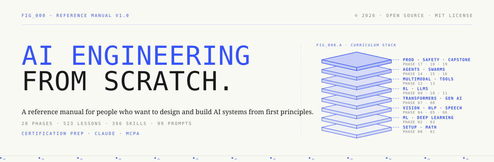
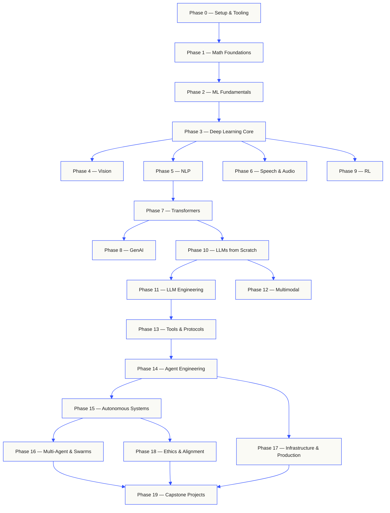
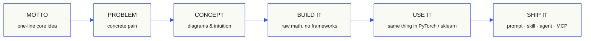
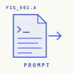
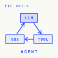
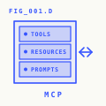

<p align="center"><sub>社区翻译，以<a href="../../README.md">英文原文为准</a> · <a href="https://aiengineeringfromscratch.com">aiengineeringfromscratch.com</a></sub></p>
<p align="center">
  
</p>

<p align="center">
  <b>选择你的语言阅读：</b>
  <a href="../../i18n/es/README.md">Español</a> ·
  <a href="../../i18n/fr/README.md">Français</a> ·
  <a href="../../i18n/pt/README.md">Português</a> ·
  <a href="../../i18n/de/README.md">Deutsch</a> ·
  <a href="../../i18n/it/README.md">Italiano</a> ·
  <a href="../../i18n/zh/README.md">简体中文</a> ·
  <a href="../../i18n/ja/README.md">日本語</a> ·
  <a href="../../i18n/ko/README.md">한국어</a> ·
  <a href="../../i18n/hi/README.md">हिन्दी</a> ·
  <a href="../../i18n/ar/README.md">العربية</a> ·
  <a href="../../i18n/ru/README.md">Русский</a> ·
  <a href="../../i18n/tr/README.md">Türkçe</a>
  <br><sub>翻译版首页已提交到本仓库；简体中文课程译文由人工维护，位于 <code>translations</code> 分支。英文版为准。详见 <a href="../../docs/i18n.md">docs/i18n.md</a>。</sub>
</p>

<p align="center">
  <a href="../../LICENSE"></a>
  <a href="../../ROADMAP.md"></a>
  <a href="#contents"></a>
  <a href="https://github.com/rohitg00/ai-engineering-from-scratch/stargazers"></a>
  <a href="https://aiengineeringfromscratch.com"></a>
</p>

## 来自 [Agent Memory——排名第一的持久记忆项目 ⭐](https://github.com/rohitg00/agentmemory) <a href="https://github.com/rohitg00/agentmemory/stargazers"></a> 的创作者。Agent Memory 可直接配合各种智能体和聊天助手使用。

```text
░░░▒▒▒░░░▒▒▒░░░▒▒▒░░░▒▒▒░░░▒▒▒░░░▒▒▒░░░▒▒▒░░░▒▒▒░░░▒▒▒░░░▒▒▒░░░▒▒▒░░░▒▒▒░░░▒▒▒░░░▒▒▒░░░▒▒▒
```

> **84% 的学生已经在使用 AI 工具，却只有 18% 觉得自己能够专业地运用它们。** 这套课程正是为了弥合这一差距。
>
> 523 节课。20 个阶段。约 342 小时。涵盖 Python、TypeScript、Rust 和 Julia。每节课都会交付一项可复用成果：提示词、技能、智能体或 MCP 服务器。免费、开源，采用 MIT 许可证。
>
> 你不只学习 AI，还会亲手从头到尾把它构建出来。

<!-- STATS:START (generated from site/stats.json by build.js — do not edit by hand) -->
<p align="center"><sub><b>114,584</b> 位读者 &nbsp;·&nbsp; 最近 30 天 <b>181,995</b> 次页面浏览 &nbsp;·&nbsp; 截至 2026-08-29</sub></p>
<!-- STATS:END -->

## 从这里开始：选择你想构建的内容

开始前无需浏览全部 523 节课。先选择一个目标。每个链接都会在 GitHub 或网站上打开同一套课程，两个版本使用完全相同的课程代码。

| 你的目标 | 在 GitHub 上学习 | 在网站上学习 |
|---|---|---|
| 我是新手，想系统打好基础 | [第 0 阶段：环境搭建与工具](../../phases/00-setup-and-tooling/) | [开发环境](https://aiengineeringfromscratch.com/lesson?path=phases/00-setup-and-tooling/01-dev-environment) |
| 我会 Python，想学习数学和机器学习基础 | [第 1 阶段：数学基础](../../phases/01-math-foundations/) | [线性代数直觉](https://aiengineeringfromscratch.com/lesson?path=phases/01-math-foundations/01-linear-algebra-intuition) |
| 我想构建生产级 LLM 应用 | [第 11 阶段：LLM 工程](../../phases/11-llm-engineering/) | [提示工程](https://aiengineeringfromscratch.com/lesson?path=phases/11-llm-engineering/01-prompt-engineering) |
| 我想构建智能体 | [第 14 阶段：智能体工程](../../phases/14-agent-engineering/) | [智能体循环](https://aiengineeringfromscratch.com/lesson?path=phases/14-agent-engineering/01-the-agent-loop) |
| 我想在真实代码仓库中使用编程智能体 | [智能体辅助工程路线](../../learning-paths/using-coding-agents.json) | [智能体辅助工程](https://aiengineeringfromscratch.com/lesson?path=phases/14-agent-engineering/31-agent-workbench-why-models-fail&learningPath=using-coding-agents) |
| 我想在实现前塑造正确的构建方案 | [产品判断与交付路线](../../learning-paths/shaping-the-build.json) | [产品判断与交付](https://aiengineeringfromscratch.com/lesson?path=phases/14-agent-engineering/47-outcomes-before-output&learningPath=shaping-the-build) |
| 我想使用 Model Context Protocol (MCP) 构建系统 | [Model Context Protocol (MCP) 路线](../../phases/13-tools-and-protocols/README.md#model-context-protocol-mcp-path) | [Model Context Protocol (MCP) 学习路线](https://aiengineeringfromscratch.com/lesson?path=phases/13-tools-and-protocols/06-mcp-fundamentals&learningPath=model-context-protocol) |
| 我想编写并发布 Agent Skills | [Agent Skills 专项路线](../../phases/13-tools-and-protocols/README.md#agent-skills-fast-path) | [Agent Skills 学习路线](https://aiengineeringfromscratch.com/lesson?path=phases/13-tools-and-protocols/22-skills-and-agent-sdks&learningPath=agent-skills) |
| 我想备考 Claude 认证 | [认证入门指南](../../certifications/claude/GETTING_STARTED.md) | [认证学院](https://aiengineeringfromscratch.com/certifications.html) |

不确定该从哪里开始？请使用 [`start-learning` 分级导师](../../skills/start-learning/SKILL.md)，或查看[网站上的先决条件指南](https://aiengineeringfromscratch.com/prereqs.html)。

在 [AI 工程学习路线](https://aiengineeringfromscratch.com/learning-paths.html)中比较四个核心领域和六条职业路线。

### 以同样的方式学习每一节课

1. **阅读** `docs/en.md`，并用自己的话解释核心思想。
2. **亲手输入并构建** 重要代码，不要只把代码块当作装饰。
3. 从仓库根目录（即包含 `README.md` 和 `phases/` 的目录）**运行**课程命令。
4. **保留证据**：命令、工作目录、退出码、有意义的输出，以及你修改或产出的成果。
5. 只有当你能解释输出，并且无需猜测就能完成一处小修改时，才**继续**学习。

除非课程明确要求切换目录，否则课程页面中的命令路径都以仓库根目录为起点。如果一节课提供多种语言，请运行与你正在学习的语言对应的实现。

### 克隆仓库，产出第一份学习证据

```bash
git clone https://github.com/rohitg00/ai-engineering-from-scratch.git
cd ai-engineering-from-scratch
python3 phases/00-setup-and-tooling/01-dev-environment/code/verify.py --route beginner
python3 phases/01-math-foundations/01-linear-algebra-intuition/code/vectors.py
```

预检会区分当前必需的条件和以后才会用到的工具。每个必检项一旦失败，都会说明检测到的原因并提供修复命令。第二条命令运行一节零依赖课程，最后会展示矩阵乘以向量正是神经网络层内部执行的运算。请将这段终端输出保存为你的第一份学习证据。

## 30 秒添加 AI 导师

如果已经安装 Node.js、`npx` 和支持技能的编程智能体，只需两条命令就能让它成为你的导师。安装或读取导师无需克隆仓库。运行专项路线中的实验需要 `python3`；Agent Skills 宿主实验还需要选定宿主，并拥有可写的用户级或项目级安装范围。

先检查本地环境要求：

```bash
node --version
npx --version
python3 --version
```

然后安装课程技能，并在安装器询问时选择你要使用的宿主和安装范围：

```bash
npx skills add rohitg00/ai-engineering-from-scratch
```

调用语法由宿主决定，而不是由可移植的 `SKILL.md` 格式决定：

| 宿主 | 开始课程 | 开始学习 Model Context Protocol (MCP) | 开始学习 Agent Skills | 运行阶段测验 |
|---|---|---|---|---|
| Codex | `start-learning`，或从 `/skills` 中选择 | `learn-mcp`，或从 `/skills` 中选择 | `learn-agent-skills`，或从 `/skills` 中选择 | `check-understanding 13`，或从 `/skills` 中选择 |
| Claude Code | `/start-learning` | `/learn-mcp` | `/learn-agent-skills` | `/check-understanding 13` |
| 其他兼容宿主 | `Use start-learning to begin the course.` | `Use learn-mcp to start the Model Context Protocol (MCP) path.` | `Use learn-agent-skills to start the Agent Skills Engineering path.` | `Use check-understanding to quiz me on Phase 13.` |

一份十题分级测验会根据你已有的知识确定起始阶段，并将个性化学习计划保存到 `LEARNING.md`。此后，`learn` 技能每次会话讲授一节课，依次涵盖概念、数学、代码和测验。它会直接从本仓库读取课程内容；遇到困难时，`course-guide` 技能会带你跳转到对应课程。在 Codex 中，以 `learn` 和 `course-guide` 调用这些技能；在 Claude Code 中，使用 `/learn` 和 `/course-guide`；在其他兼容宿主中，按名称要求宿主使用相应技能。

只想学习 Model Context Protocol (MCP)？请使用适用于你的宿主的 MCP 调用方式。它会创建 `MCP-LEARNING.md`，并引导你沿一条包含 17 节课的路线，依次学习无状态请求、传输机制、双向通信、安全性、可靠性、注册表治理和符合性证据。确切顺序和检查点见 [Model Context Protocol (MCP) 清单](../../learning-paths/model-context-protocol.json)。

只想学习 Agent Skills？请使用适用于你的宿主的 Agent Skills 调用方式。它会创建 `AGENT-SKILLS-LEARNING.md`，并沿一条连贯的五课路线学习：契约、发现、调用和沙箱边界，最后完成发布评测，并验证在真实宿主之间的可移植性。也可以从网页上的 [Agent Skills 学习路线](https://aiengineeringfromscratch.com/lesson?path=phases/13-tools-and-protocols/22-skills-and-agent-sdks&learningPath=agent-skills)开始。

安装器会列出它能够配置的宿主，并询问安装位置。如果你尚未具备 Node.js、`npx`、`python3`、受支持的宿主或可写的安装范围，请先使用网站，或手动阅读 `docs/en.md`。这种方式可以学习相关概念；等具备预检条件后，再补充真实宿主中的发现、调用、脚本运行和卸载证据。请前往 [aiengineeringfromscratch.com](https://aiengineeringfromscratch.com) 阅读课程。

## 运作方式

大多数 AI 资料都以零散片段的方式教学：这里一篇论文，那里一篇微调文章，别处再来一个炫目的智能体演示。这些碎片很少能连成体系。你或许发布了一个聊天机器人，却解释不了它的损失曲线；你或许给智能体接入了一个函数，却说不清调用它的模型内部，注意力机制究竟做了什么。

这套课程是一条贯穿始终的主线：20 个阶段、523 节课、四种语言——Python、TypeScript、Rust 和 Julia。一端是线性代数，另一端是自主智能体群。每个算法都先从基础数学开始亲手实现：反向传播、分词器、注意力机制、智能体循环。等到 PyTorch 登场时，你已经知道它在底层做什么。

每节课都遵循同一个循环：阅读问题、推导数学原理、编写代码、运行测试、保留成果。没有五分钟速成视频，没有复制粘贴式部署，也不会事无巨细地牵着你走。课程免费、开源，并且可以在你自己的笔记本电脑上运行。

```text
░░░▒▒▒░░░▒▒▒░░░▒▒▒░░░▒▒▒░░░▒▒▒░░░▒▒▒░░░▒▒▒░░░▒▒▒░░░▒▒▒░░░▒▒▒░░░▒▒▒░░░▒▒▒░░░▒▒▒░░░▒▒▒░░░▒▒▒
```

## 课程的整体结构

二十个阶段逐层搭建。数学是地基，智能体和生产实践是屋顶。如果你已经掌握了底层知识，可以直接往后学；但别跳过基础后，又困惑为什么上层内容出了问题。



```text
░░░▒▒▒░░░▒▒▒░░░▒▒▒░░░▒▒▒░░░▒▒▒░░░▒▒▒░░░▒▒▒░░░▒▒▒░░░▒▒▒░░░▒▒▒░░░▒▒▒░░░▒▒▒░░░▒▒▒░░░▒▒▒░░░▒▒▒
```

## 单节课的结构

每节课都有独立的文件夹，整套课程采用统一的目录结构：

```text
phases/<NN>-<phase-name>/<NN>-<lesson-name>/
├── code/      runnable implementations (Python, TypeScript, Rust, Julia)
├── docs/
│   └── en.md  lesson narrative
└── outputs/   prompts, skills, agents, or MCP servers this lesson produces
```

每节课都按六个环节展开。*Build It / Use It* 是课程主线——你先从零实现算法，再使用生产级库完成同样的操作。因为亲手写过它的精简版本，你才能真正理解框架在底层做什么。



## 快速开始

三种入门方式，任选其一。

**方式 A——在终端中学习 *（推荐）*。** 完成上方针对 Node.js、`npx`、宿主和安装范围的预检后，将学习技能安装到兼容的智能体中，让课程自动引导你的学习：

```bash
npx skills add rohitg00/ai-engineering-from-scratch
```

请使用上方针对各宿主的调用方式表。安装后可使用 `start-learning`、`learn`、`course-guide`，以及专项学习路线 `learn-mcp` 和 `learn-agent-skills`。无需克隆仓库，即可直接从本仓库读取课程正文；但若要运行从仓库复制的代码命令，或执行 MCP 或 Agent Skills 实验，则需要在本地克隆仓库。学习进度保存在项目中的 `LEARNING.md`、`MCP-LEARNING.md` 或 `AGENT-SKILLS-LEARNING.md`，因此每次会话都可以接着上次继续。

**方式 B——阅读。** 打开 [aiengineeringfromscratch.com](https://aiengineeringfromscratch.com) 上任意已完成的课程，或展开[目录](#contents)下的某个阶段。无需配置，也无需克隆。

**方式 C——克隆并运行。**

```bash
git clone https://github.com/rohitg00/ai-engineering-from-scratch.git
cd ai-engineering-from-scratch
python3 phases/01-math-foundations/01-linear-algebra-intuition/code/vectors.py
```

克隆仓库后，Claude Code 还会自动加载学习技能，并将每节课的代码交给 `learn` 导师实际运行，而不只是陪你边读边学。

### 先决条件

- 你会编写代码（任何语言均可；会 Python 更有帮助）。
- 你想理解 AI **真正的运作原理**，而不只是调用 API。

### 备考 Claude 认证

[Claude 认证学院](../../certifications/claude/README.md) 是一套免费、开源的备考项目，覆盖四条 Claude 官方认证路线：Associate Foundations、Developer Foundations、Architect Foundations 和 Architect Professional。每条路线都包含与考试蓝图对应的课程、可运行实验、诊断测评、综合项目和一套完整的原创模拟考试。

可搭配 Claude Code、Codex、ChatGPT、Cursor 或其他智能体使用 [AI 原生 GitHub 入门指南](../../certifications/claude/GETTING_STARTED.md)。在 Codex 中运行 `claude-certification`，在 Claude Code 中运行 `/claude-certification`，或让其他宿主调用 `claude-certification`。它会帮助你选择认证路线，在 `CLAUDE-CERTIFICATION.md` 中创建持久化学习路径，逐步授课、运行真实实验，并根据你的成果提供反馈。同一套课程也可在[认证网站](https://aiengineeringfromscratch.com/certifications.html)学习。

这套学院课程是依据公开考试目标编写的独立学习资料，与 Anthropic 无附属关系，也未获得其认可、赞助或授权；课程不会复现正式考试题，也不保证通过考试。

### 学习技能

| 技能 | 功能 |
|---|---|
| [`start-learning`](../../skills/start-learning/SKILL.md) | 一次性入门：明确学习动机、完成分级测验，并将个性化计划保存到 `LEARNING.md`。 |
| [`learn`](../../skills/learn/SKILL.md) | 导师循环：先进行热身回忆，再以互动方式讲授下一节课并完成测验；同时记录进度和复习队列。 |
| [`course-guide`](../../skills/course-guide/SKILL.md) | 主题导航器。无论你想知道“在哪里学习注意力机制？”，还是遇到“损失值变成 NaN”之类的问题，它都会给出对应课程及链接。 |
| [`learn-mcp`](../../skills/learn-mcp/SKILL.md) | Model Context Protocol (MCP) 专项导师。创建 `MCP-LEARNING.md`，按 17 节课的清单推进，并记录传输、安全性、可靠性和符合性证据。 |
| [`learn-agent-skills`](../../skills/learn-agent-skills/SKILL.md) | Agent Skills 专项导师。创建 `AGENT-SKILLS-LEARNING.md`，讲授第 22、24、25、26 和 27 课，并记录真实宿主中的操作证据。 |
| [`claude-certification`](../../skills/claude-certification/SKILL.md) | 认证导师。选择 CCAO-F、CCDV-F、CCAR-F 或 CCAR-P；讲授各节课程、运行实验、评审成果、组织诊断测评与模拟考试，并保存进度。 |
| [`find-your-level`](../../skills/find-your-level/SKILL.md) | 十题分级测验。根据你的知识水平确定起始阶段，并生成带有课时估算的个性化路线。 |
| [`check-understanding <phase>`](../../skills/check-understanding/SKILL.md) | 每阶段八道题的测验，提供反馈并指出需要复习的具体课程。请使用上方调用表中的 Codex、Claude Code 或自然语言形式。 |

```text
░░░▒▒▒░░░▒▒▒░░░▒▒▒░░░▒▒▒░░░▒▒▒░░░▒▒▒░░░▒▒▒░░░▒▒▒░░░▒▒▒░░░▒▒▒░░░▒▒▒░░░▒▒▒░░░▒▒▒░░░▒▒▒░░░▒▒▒
```

## 以书籍形式阅读核心课程

`phases/` 下的 20 个核心课程阶段可以编译成六卷本系列。CI 使用同一套核心课程源文件构建 EPUB 和 PDF，并将文件附加到每个 [GitHub 发行版](https://github.com/rohitg00/ai-engineering-from-scratch/releases)；下方链接始终指向最新发行版。卷号表示丛书顺序，不是版本号：每册都标有发行日期，旧版仍可从对应的发行版下载。

认证课程特意不编入书籍。AI 导师状态、可运行实验、交互式图示、诊断测评和限时模拟考试仍完整保留在 GitHub 和网站上。

| 卷 | 书名 | 阶段 | 下载 |
|-----|-------|--------|----------|
| 1 | 基础篇 · 数学、工具与经典机器学习 | 00-02 | [EPUB](https://github.com/rohitg00/ai-engineering-from-scratch/releases/latest/download/aiefs-vol1-foundations.epub) · [PDF](https://github.com/rohitg00/ai-engineering-from-scratch/releases/latest/download/aiefs-vol1-foundations.pdf) |
| 2 | 深度学习篇 · 神经网络、视觉与语音 | 03, 04, 06 | [EPUB](https://github.com/rohitg00/ai-engineering-from-scratch/releases/latest/download/aiefs-vol2-deep-learning.epub) · [PDF](https://github.com/rohitg00/ai-engineering-from-scratch/releases/latest/download/aiefs-vol2-deep-learning.pdf) |
| 3 | 语言篇 · NLP 基础与 Transformer | 05, 07 | [EPUB](https://github.com/rohitg00/ai-engineering-from-scratch/releases/latest/download/aiefs-vol3-language.epub) · [PDF](https://github.com/rohitg00/ai-engineering-from-scratch/releases/latest/download/aiefs-vol3-language.pdf) |
| 4 | 大语言模型篇 · 生成、强化学习、预训练与工程 | 08-11 | [EPUB](https://github.com/rohitg00/ai-engineering-from-scratch/releases/latest/download/aiefs-vol4-llms.epub) · [PDF](https://github.com/rohitg00/ai-engineering-from-scratch/releases/latest/download/aiefs-vol4-llms.pdf) |
| 5 | 智能体篇 · 多模态、协议、自主系统与群体智能 | 12-16 | [EPUB](https://github.com/rohitg00/ai-engineering-from-scratch/releases/latest/download/aiefs-vol5-agents.epub) · [PDF](https://github.com/rohitg00/ai-engineering-from-scratch/releases/latest/download/aiefs-vol5-agents.pdf) |
| 6 | 生产篇 · 基础设施、安全与综合项目 | 17-19 | [EPUB](https://github.com/rohitg00/ai-engineering-from-scratch/releases/latest/download/aiefs-vol6-production.epub) · [PDF](https://github.com/rohitg00/ai-engineering-from-scratch/releases/latest/download/aiefs-vol6-production.pdf) |

书籍保存的是一个时间点的内容，本仓库则会持续更新。每章末尾都会链接回相应课程的动态图示、测验和可运行代码。可使用 `python3 scripts/build_book.py` 在本地构建（需要 pandoc）；构建流程详见 [book/README.md](../../book/README.md)。

```text
░░░▒▒▒░░░▒▒▒░░░▒▒▒░░░▒▒▒░░░▒▒▒░░░▒▒▒░░░▒▒▒░░░▒▒▒░░░▒▒▒░░░▒▒▒░░░▒▒▒░░░▒▒▒░░░▒▒▒░░░▒▒▒░░░▒▒▒
```

## 每节课都有产出

其他课程往往以*“恭喜，你学会了 X。”*收尾；这里的每节课则以一个可安装或粘贴到日常工作流中的**可复用工具**收尾。

<table>
<tr>
<th align="left" width="25%"><br/><sub>FIG_001 · A</sub><br/><b>提示词</b></th>
<th align="left" width="25%"><br/><sub>FIG_001 · B</sub><br/><b>技能</b></th>
<th align="left" width="25%"><br/><sub>FIG_001 · C</sub><br/><b>智能体</b></th>
<th align="left" width="25%"><br/><sub>FIG_001 · D</sub><br/><b>MCP 服务器</b></th>
</tr>
<tr>
<td valign="top">粘贴到任意 AI 助手中，针对特定任务获得专家级帮助。</td>
<td valign="top">放入 Claude、Cursor、Codex、OpenClaw、Hermes，或任何能够读取 <code>SKILL.md</code> 的智能体中。</td>
<td valign="top">部署为自主执行的智能体——你已在第 14 阶段亲手编写了这个循环。</td>
<td valign="top">接入任意兼容 MCP 的客户端。第 13 阶段会带你从头到尾构建它。</td>
</tr>
</table>

> 使用 `python3 scripts/install_skills.py <target>` 一次性安装全部工具。它们是真正能用的工具，不是作业。学完整套课程后，你将拥有由 523 个成果组成的作品集；因为每一个都是你亲手构建的，所以你真正理解它们。

### FIG_002 · 实操示例

第 14 阶段第 1 课：智能体循环。约 120 行纯 Python，不依赖任何第三方库。

<table>
<tr>
<td valign="top" width="50%">

**`code/agent_loop.py`** &nbsp; <sub><i>动手构建</i></sub>

```python
def run(query, tools):
    history = [user(query)]
    for step in range(MAX_STEPS):
        msg = llm(history)
        if msg.tool_calls:
            for call in msg.tool_calls:
                result = tools[call.name](**call.args)
                history.append(tool_result(call.id, result))
            continue
        return msg.content
    raise StepLimitExceeded
```

</td>
<td valign="top" width="50%">

**`outputs/skill-agent-loop.md`** &nbsp; <sub><i>交付成果</i></sub>

```markdown
---
name: agent-loop
description: ReAct-style loop for any tool list
phase: 14
lesson: 01
---

Implement a minimal agent loop that...
```

**`outputs/prompt-debug-agent.md`**

```markdown
You are an agent debugger. Given the trace
of an agent run, identify the step where
the agent went wrong and explain why...
```

</td>
</tr>
</table>

```text
░░░▒▒▒░░░▒▒▒░░░▒▒▒░░░▒▒▒░░░▒▒▒░░░▒▒▒░░░▒▒▒░░░▒▒▒░░░▒▒▒░░░▒▒▒░░░▒▒▒░░░▒▒▒░░░▒▒▒░░░▒▒▒░░░▒▒▒
```

<a id="contents"></a>

## 目录

共二十个阶段。点击任一阶段即可展开课程列表。

<a id="phase-0"></a>
### 第 0 阶段：设置与工具 `12 节课`
> 为后续所有学习内容准备好开发环境。

| # | 课程 | 类型 | 语言 |
|:---:|--------|:----:|------|
| 01 | [开发环境](../../phases/00-setup-and-tooling/01-dev-environment/) | 实践 | Python |
| 02 | [Git 与协作](../../phases/00-setup-and-tooling/02-git-and-collaboration/) | 学习 | — |
| 03 | [GPU 配置与云环境](../../phases/00-setup-and-tooling/03-gpu-setup-and-cloud/) | 实践 | Python |
| 04 | [API 与密钥管理](../../phases/00-setup-and-tooling/04-apis-and-keys/) | 实践 | Python |
| 05 | [Jupyter Notebook](../../phases/00-setup-and-tooling/05-jupyter-notebooks/) | 实践 | Python |
| 06 | [Python 环境管理](../../phases/00-setup-and-tooling/06-python-environments/) | 实践 | Shell |
| 07 | [面向 AI 的 Docker](../../phases/00-setup-and-tooling/07-docker-for-ai/) | 实践 | Docker |
| 08 | [编辑器配置](../../phases/00-setup-and-tooling/08-editor-setup/) | 实践 | — |
| 09 | [数据管理](../../phases/00-setup-and-tooling/09-data-management/) | 实践 | Python |
| 10 | [终端与 Shell](../../phases/00-setup-and-tooling/10-terminal-and-shell/) | 学习 | — |
| 11 | [面向 AI 的 Linux](../../phases/00-setup-and-tooling/11-linux-for-ai/) | 学习 | — |
| 12 | [调试与性能分析](../../phases/00-setup-and-tooling/12-debugging-and-profiling/) | 实践 | Python |

<details id="phase-1">
<summary><b>第 1 阶段 — 数学基础</b> &nbsp;<code>22 节课</code>&nbsp; <em>通过代码建立对各类 AI 算法背后数学原理的直觉。</em></summary>
<br/>

| # | 课程 | 类型 | 语言 |
|:---:|--------|:----:|------|
| 01 | [线性代数直觉](../../phases/01-math-foundations/01-linear-algebra-intuition/) | 学习 | Python, Julia |
| 02 | [向量、矩阵与运算](../../phases/01-math-foundations/02-vectors-matrices-operations/) | 实践 | Python, Julia |
| 03 | [矩阵变换与特征值](../../phases/01-math-foundations/03-matrix-transformations/) | 实践 | Python, Julia |
| 04 | [机器学习微积分：导数与梯度](../../phases/01-math-foundations/04-calculus-for-ml/) | 学习 | Python |
| 05 | [链式法则与自动微分](../../phases/01-math-foundations/05-chain-rule-and-autodiff/) | 实践 | Python |
| 06 | [概率与概率分布](../../phases/01-math-foundations/06-probability-and-distributions/) | 学习 | Python |
| 07 | [贝叶斯定理与统计思维](../../phases/01-math-foundations/07-bayes-theorem/) | 实践 | Python |
| 08 | [优化：梯度下降方法族](../../phases/01-math-foundations/08-optimization/) | 实践 | Python |
| 09 | [信息论：熵与 KL 散度](../../phases/01-math-foundations/09-information-theory/) | 学习 | Python |
| 10 | [降维：PCA、t-SNE 与 UMAP](../../phases/01-math-foundations/10-dimensionality-reduction/) | 实践 | Python |
| 11 | [奇异值分解](../../phases/01-math-foundations/11-singular-value-decomposition/) | 实践 | Python, Julia |
| 12 | [张量运算](../../phases/01-math-foundations/12-tensor-operations/) | 实践 | Python |
| 13 | [数值稳定性](../../phases/01-math-foundations/13-numerical-stability/) | 实践 | Python |
| 14 | [范数与距离](../../phases/01-math-foundations/14-norms-and-distances/) | 实践 | Python |
| 15 | [机器学习统计学](../../phases/01-math-foundations/15-statistics-for-ml/) | 实践 | Python |
| 16 | [采样方法](../../phases/01-math-foundations/16-sampling-methods/) | 实践 | Python |
| 17 | [线性方程组](../../phases/01-math-foundations/17-linear-systems/) | 实践 | Python |
| 18 | [凸优化](../../phases/01-math-foundations/18-convex-optimization/) | 实践 | Python |
| 19 | [AI 中的复数](../../phases/01-math-foundations/19-complex-numbers/) | 学习 | Python |
| 20 | [傅里叶变换](../../phases/01-math-foundations/20-fourier-transform/) | 实践 | Python |
| 21 | [机器学习图论](../../phases/01-math-foundations/21-graph-theory/) | 实践 | Python |
| 22 | [随机过程](../../phases/01-math-foundations/22-stochastic-processes/) | 学习 | Python |

</details>

<details id="phase-2">
<summary><b>第 2 阶段 — 机器学习基础</b> &nbsp;<code>18 节课</code>&nbsp; <em>经典机器学习至今仍是大多数生产级 AI 系统的支柱。</em></summary>
<br/>

| # | 课程 | 类型 | 语言 |
|:---:|--------|:----:|------|
| 01 | [什么是机器学习](../../phases/02-ml-fundamentals/01-what-is-machine-learning/) | 学习 | Python |
| 02 | [从零实现线性回归](../../phases/02-ml-fundamentals/02-linear-regression/) | 实践 | Python |
| 03 | [逻辑回归与分类](../../phases/02-ml-fundamentals/03-logistic-regression/) | 实践 | Python |
| 04 | [决策树与随机森林](../../phases/02-ml-fundamentals/04-decision-trees/) | 实践 | Python |
| 05 | [支持向量机](../../phases/02-ml-fundamentals/05-support-vector-machines/) | 实践 | Python |
| 06 | [KNN 与距离度量](../../phases/02-ml-fundamentals/06-knn-and-distances/) | 实践 | Python |
| 07 | [无监督学习：K-Means 与 DBSCAN](../../phases/02-ml-fundamentals/07-unsupervised-learning/) | 实践 | Python |
| 08 | [特征工程与特征选择](../../phases/02-ml-fundamentals/08-feature-engineering/) | 实践 | Python |
| 09 | [模型评估：指标与交叉验证](../../phases/02-ml-fundamentals/09-model-evaluation/) | 实践 | Python |
| 10 | [偏差、方差与学习曲线](../../phases/02-ml-fundamentals/10-bias-variance/) | 学习 | Python |
| 11 | [集成方法：Boosting、Bagging 与 Stacking](../../phases/02-ml-fundamentals/11-ensemble-methods/) | 实践 | Python |
| 12 | [超参数调优](../../phases/02-ml-fundamentals/12-hyperparameter-tuning/) | 实践 | Python |
| 13 | [机器学习流水线与实验跟踪](../../phases/02-ml-fundamentals/13-ml-pipelines/) | 实践 | Python |
| 14 | [朴素贝叶斯](../../phases/02-ml-fundamentals/14-naive-bayes/) | 实践 | Python |
| 15 | [时间序列基础](../../phases/02-ml-fundamentals/15-time-series/) | 实践 | Python |
| 16 | [异常检测](../../phases/02-ml-fundamentals/16-anomaly-detection/) | 实践 | Python |
| 17 | [不平衡数据处理](../../phases/02-ml-fundamentals/17-imbalanced-data/) | 实践 | Python |
| 18 | [特征选择](../../phases/02-ml-fundamentals/18-feature-selection/) | 实践 | Python |

</details>

<details id="phase-3">
<summary><b>第 3 阶段 — 深度学习核心</b> &nbsp;<code>13 节课</code>&nbsp; <em>从第一性原理理解神经网络：先亲手构建，再使用框架。</em></summary>
<br/>

| # | 课程 | 类型 | 语言 |
|:---:|--------|:----:|------|
| 01 | [感知机：一切的起点](../../phases/03-deep-learning-core/01-the-perceptron/) | 实践 | Python |
| 02 | [多层网络与前向传播](../../phases/03-deep-learning-core/02-multi-layer-networks/) | 实践 | Python |
| 03 | [从零实现反向传播](../../phases/03-deep-learning-core/03-backpropagation/) | 实践 | Python |
| 04 | [激活函数：ReLU、Sigmoid、GELU 及其原理](../../phases/03-deep-learning-core/04-activation-functions/) | 实践 | Python |
| 05 | [损失函数：MSE、交叉熵与对比损失](../../phases/03-deep-learning-core/05-loss-functions/) | 实践 | Python |
| 06 | [优化器：SGD、Momentum、Adam 与 AdamW](../../phases/03-deep-learning-core/06-optimizers/) | 实践 | Python |
| 07 | [正则化：Dropout、权重衰减与 BatchNorm](../../phases/03-deep-learning-core/07-regularization/) | 实践 | Python |
| 08 | [权重初始化与训练稳定性](../../phases/03-deep-learning-core/08-weight-initialization/) | 实践 | Python |
| 09 | [学习率调度与预热](../../phases/03-deep-learning-core/09-learning-rate-schedules/) | 实践 | Python |
| 10 | [构建自己的迷你深度学习框架](../../phases/03-deep-learning-core/10-mini-framework/) | 实践 | Python |
| 11 | [PyTorch 入门](../../phases/03-deep-learning-core/11-intro-to-pytorch/) | 实践 | Python |
| 12 | [JAX 入门](../../phases/03-deep-learning-core/12-intro-to-jax/) | 实践 | Python |
| 13 | [神经网络调试](../../phases/03-deep-learning-core/13-debugging-neural-networks/) | 实践 | Python |

</details>

<details id="phase-4">
<summary><b>第 4 阶段 — 计算机视觉</b> &nbsp;<code>28 节课</code>&nbsp; <em>从像素到理解：涵盖图像、视频、3D、视觉语言模型与世界模型。</em></summary>
<br/>

| # | 课程 | 类型 | 语言 |
|:---:|--------|:----:|------|
| 01 | [图像基础：像素、通道与色彩空间](../../phases/04-computer-vision/01-image-fundamentals/) | 学习 | Python |
| 02 | [从零实现卷积](../../phases/04-computer-vision/02-convolutions-from-scratch/) | 实践 | Python |
| 03 | [CNN：从 LeNet 到 ResNet](../../phases/04-computer-vision/03-cnns-lenet-to-resnet/) | 实践 | Python |
| 04 | [图像分类](../../phases/04-computer-vision/04-image-classification/) | 实践 | Python |
| 05 | [迁移学习与微调](../../phases/04-computer-vision/05-transfer-learning/) | 实践 | Python |
| 06 | [目标检测：从零实现 YOLO](../../phases/04-computer-vision/06-object-detection-yolo/) | 实践 | Python |
| 07 | [语义分割：U-Net](../../phases/04-computer-vision/07-semantic-segmentation-unet/) | 实践 | Python |
| 08 | [实例分割：Mask R-CNN](../../phases/04-computer-vision/08-instance-segmentation-mask-rcnn/) | 实践 | Python |
| 09 | [图像生成：GAN](../../phases/04-computer-vision/09-image-generation-gans/) | 实践 | Python |
| 10 | [图像生成：扩散模型](../../phases/04-computer-vision/10-image-generation-diffusion/) | 实践 | Python |
| 11 | [Stable Diffusion：架构与微调](../../phases/04-computer-vision/11-stable-diffusion/) | 实践 | Python |
| 12 | [视频理解：时序建模](../../phases/04-computer-vision/12-video-understanding/) | 实践 | Python |
| 13 | [3D 视觉：点云与 NeRF](../../phases/04-computer-vision/13-3d-vision-nerf/) | 实践 | Python |
| 14 | [视觉 Transformer（ViT）](../../phases/04-computer-vision/14-vision-transformers/) | 实践 | Python |
| 15 | [实时视觉：边缘部署](../../phases/04-computer-vision/15-real-time-edge/) | 实践 | Python |
| 16 | [构建完整的视觉流水线](../../phases/04-computer-vision/16-vision-pipeline-capstone/) | 实践 | Python |
| 17 | [自监督视觉：SimCLR、DINO 与 MAE](../../phases/04-computer-vision/17-self-supervised-vision/) | 实践 | Python |
| 18 | [开放词汇视觉：CLIP](../../phases/04-computer-vision/18-open-vocab-clip/) | 实践 | Python |
| 19 | [OCR 与文档理解](../../phases/04-computer-vision/19-ocr-document-understanding/) | 实践 | Python |
| 20 | [图像检索与度量学习](../../phases/04-computer-vision/20-image-retrieval-metric/) | 实践 | Python |
| 21 | [关键点检测与姿态估计](../../phases/04-computer-vision/21-keypoint-pose/) | 实践 | Python |
| 22 | [从零实现 3D 高斯泼溅](../../phases/04-computer-vision/22-3d-gaussian-splatting/) | 实践 | Python |
| 23 | [扩散 Transformer 与整流流](../../phases/04-computer-vision/23-diffusion-transformers-rectified-flow/) | 实践 | Python |
| 24 | [SAM 3 与开放词汇分割](../../phases/04-computer-vision/24-sam3-open-vocab-segmentation/) | 实践 | Python |
| 25 | [视觉语言模型（ViT-MLP-LLM）](../../phases/04-computer-vision/25-vision-language-models/) | 实践 | Python |
| 26 | [单目深度与几何估计](../../phases/04-computer-vision/26-monocular-depth/) | 实践 | Python |
| 27 | [多目标跟踪与视频记忆](../../phases/04-computer-vision/27-multi-object-tracking/) | 实践 | Python |
| 28 | [世界模型与视频扩散](../../phases/04-computer-vision/28-world-models-video-diffusion/) | 实践 | Python |

</details>

<details id="phase-5">
<summary><b>第 5 阶段 — 自然语言处理：从基础到进阶</b> &nbsp;<code>29 节课</code>&nbsp; <em>语言是通往智能的接口。</em></summary>
<br/>

| # | 课程 | 类型 | 语言 |
|:---:|--------|:----:|------|
| 01 | [文本处理：分词、词干提取与词形还原](../../phases/05-nlp-foundations-to-advanced/01-text-processing/) | 实践 | Python |
| 02 | [词袋模型、TF-IDF 与文本表示](../../phases/05-nlp-foundations-to-advanced/02-bag-of-words-tfidf/) | 实践 | Python |
| 03 | [词嵌入：从零实现 Word2Vec](../../phases/05-nlp-foundations-to-advanced/03-word-embeddings-word2vec/) | 实践 | Python |
| 04 | [GloVe、FastText 与子词嵌入](../../phases/05-nlp-foundations-to-advanced/04-glove-fasttext-subword/) | 实践 | Python |
| 05 | [情感分析](../../phases/05-nlp-foundations-to-advanced/05-sentiment-analysis/) | 实践 | Python |
| 06 | [命名实体识别（NER）](../../phases/05-nlp-foundations-to-advanced/06-named-entity-recognition/) | 实践 | Python |
| 07 | [词性标注与句法分析](../../phases/05-nlp-foundations-to-advanced/07-pos-tagging-parsing/) | 实践 | Python |
| 08 | [文本分类：用于文本的 CNN 与 RNN](../../phases/05-nlp-foundations-to-advanced/08-cnns-rnns-for-text/) | 实践 | Python |
| 09 | [序列到序列模型](../../phases/05-nlp-foundations-to-advanced/09-sequence-to-sequence/) | 实践 | Python |
| 10 | [注意力机制：关键突破](../../phases/05-nlp-foundations-to-advanced/10-attention-mechanism/) | 实践 | Python |
| 11 | [机器翻译](../../phases/05-nlp-foundations-to-advanced/11-machine-translation/) | 实践 | Python |
| 12 | [文本摘要](../../phases/05-nlp-foundations-to-advanced/12-text-summarization/) | 实践 | Python |
| 13 | [问答系统](../../phases/05-nlp-foundations-to-advanced/13-question-answering/) | 实践 | Python |
| 14 | [信息检索与搜索](../../phases/05-nlp-foundations-to-advanced/14-information-retrieval-search/) | 实践 | Python |
| 15 | [主题建模：LDA 与 BERTopic](../../phases/05-nlp-foundations-to-advanced/15-topic-modeling/) | 实践 | Python |
| 16 | [文本生成](../../phases/05-nlp-foundations-to-advanced/16-text-generation-pre-transformer/) | 实践 | Python |
| 17 | [聊天机器人：从规则驱动到神经网络](../../phases/05-nlp-foundations-to-advanced/17-chatbots-rule-to-neural/) | 实践 | Python |
| 18 | [多语言 NLP](../../phases/05-nlp-foundations-to-advanced/18-multilingual-nlp/) | 实践 | Python |
| 19 | [子词分词：BPE、WordPiece、Unigram 与 SentencePiece](../../phases/05-nlp-foundations-to-advanced/19-subword-tokenization/) | 学习 | Python |
| 20 | [结构化输出与约束解码](../../phases/05-nlp-foundations-to-advanced/20-structured-outputs-constrained-decoding/) | 实践 | Python |
| 21 | [自然语言推理与文本蕴含](../../phases/05-nlp-foundations-to-advanced/21-nli-textual-entailment/) | 学习 | Python |
| 22 | [深入解析嵌入模型](../../phases/05-nlp-foundations-to-advanced/22-embedding-models-deep-dive/) | 学习 | Python |
| 23 | [面向 RAG 的文本分块策略](../../phases/05-nlp-foundations-to-advanced/23-chunking-strategies-rag/) | 实践 | Python |
| 24 | [共指消解](../../phases/05-nlp-foundations-to-advanced/24-coreference-resolution/) | 学习 | Python |
| 25 | [实体链接与消歧](../../phases/05-nlp-foundations-to-advanced/25-entity-linking/) | 实践 | Python |
| 26 | [关系抽取与知识图谱构建](../../phases/05-nlp-foundations-to-advanced/26-relation-extraction-kg/) | 实践 | Python |
| 27 | [LLM 评估：RAGAS、DeepEval 与 G-Eval](../../phases/05-nlp-foundations-to-advanced/27-llm-evaluation-frameworks/) | 实践 | Python |
| 28 | [长上下文评估：NIAH、RULER、LongBench 与 MRCR](../../phases/05-nlp-foundations-to-advanced/28-long-context-evaluation/) | 学习 | Python |
| 29 | [对话状态跟踪](../../phases/05-nlp-foundations-to-advanced/29-dialogue-state-tracking/) | 实践 | Python |

</details>

<details id="phase-6">
<summary><b>第 6 阶段 — 语音与音频</b> &nbsp;<code>17 节课</code>&nbsp; <em>聆听、理解、表达。</em></summary>
<br/>

| # | 课程 | 类型 | 语言 |
|:---:|--------|:----:|------|
| 01 | [音频基础：波形、采样与 FFT](../../phases/06-speech-and-audio/01-audio-fundamentals) | 学习 | Python |
| 02 | [频谱图、梅尔尺度与音频特征](../../phases/06-speech-and-audio/02-spectrograms-mel-features) | 实践 | Python |
| 03 | [音频分类](../../phases/06-speech-and-audio/03-audio-classification) | 实践 | Python |
| 04 | [语音识别（ASR）](../../phases/06-speech-and-audio/04-speech-recognition-asr) | 实践 | Python |
| 05 | [Whisper：架构与微调](../../phases/06-speech-and-audio/05-whisper-architecture-finetuning) | 实践 | Python |
| 06 | [说话人识别与验证](../../phases/06-speech-and-audio/06-speaker-recognition-verification) | 实践 | Python |
| 07 | [文本转语音（TTS）](../../phases/06-speech-and-audio/07-text-to-speech) | 实践 | Python |
| 08 | [声音克隆与声音转换](../../phases/06-speech-and-audio/08-voice-cloning-conversion) | 实践 | Python |
| 09 | [音乐生成](../../phases/06-speech-and-audio/09-music-generation) | 实践 | Python |
| 10 | [音频语言模型](../../phases/06-speech-and-audio/10-audio-language-models) | 实践 | Python |
| 11 | [实时音频处理](../../phases/06-speech-and-audio/11-real-time-audio-processing) | 实践 | Python |
| 12 | [构建语音助手流水线](../../phases/06-speech-and-audio/12-voice-assistant-pipeline) | 实践 | Python |
| 13 | [神经音频编解码器：EnCodec、SNAC、Mimi 与 DAC](../../phases/06-speech-and-audio/13-neural-audio-codecs) | 学习 | Python |
| 14 | [语音活动检测与话轮转换](../../phases/06-speech-and-audio/14-voice-activity-detection-turn-taking) | 实践 | Python |
| 15 | [流式语音到语音：Moshi 与 Hibiki](../../phases/06-speech-and-audio/15-streaming-speech-to-speech-moshi-hibiki) | 学习 | Python |
| 16 | [语音反欺骗与音频水印](../../phases/06-speech-and-audio/16-anti-spoofing-audio-watermarking) | 实践 | Python |
| 17 | [音频评估：WER、MOS、MMAU 与排行榜](../../phases/06-speech-and-audio/17-audio-evaluation-metrics) | 学习 | Python |

</details>

<details id="phase-7">
<summary><b>第 7 阶段 — 深入解析 Transformer</b> &nbsp;<code>16 节课</code>&nbsp; <em>改变一切的架构。</em></summary>
<br/>

| # | 课程 | 类型 | 语言 |
|:---:|--------|:----:|------|
| 01 | [为什么需要 Transformer：RNN 的局限](../../phases/07-transformers-deep-dive/01-why-transformers/) | 学习 | Python |
| 02 | [从零实现自注意力](../../phases/07-transformers-deep-dive/02-self-attention-from-scratch/) | 实践 | Python |
| 03 | [多头注意力](../../phases/07-transformers-deep-dive/03-multi-head-attention/) | 实践 | Python |
| 04 | [位置编码：正弦编码、RoPE 与 ALiBi](../../phases/07-transformers-deep-dive/04-positional-encoding/) | 实践 | Python |
| 05 | [完整 Transformer：编码器与解码器](../../phases/07-transformers-deep-dive/05-full-transformer/) | 实践 | Python |
| 06 | [BERT：掩码语言建模](../../phases/07-transformers-deep-dive/06-bert-masked-language-modeling/) | 实践 | Python |
| 07 | [GPT：因果语言建模](../../phases/07-transformers-deep-dive/07-gpt-causal-language-modeling/) | 实践 | Python |
| 08 | [T5、BART：编码器-解码器模型](../../phases/07-transformers-deep-dive/08-t5-bart-encoder-decoder/) | 学习 | Python |
| 09 | [视觉 Transformer（ViT）](../../phases/07-transformers-deep-dive/09-vision-transformers/) | 实践 | Python |
| 10 | [音频 Transformer：Whisper 架构](../../phases/07-transformers-deep-dive/10-audio-transformers-whisper/) | 学习 | Python |
| 11 | [混合专家模型（MoE）](../../phases/07-transformers-deep-dive/11-mixture-of-experts/) | 实践 | Python |
| 12 | [KV 缓存、FlashAttention 与推理优化](../../phases/07-transformers-deep-dive/12-kv-cache-flash-attention/) | 实践 | Python |
| 13 | [缩放定律](../../phases/07-transformers-deep-dive/13-scaling-laws/) | 学习 | Python |
| 14 | [从零构建 Transformer](../../phases/07-transformers-deep-dive/14-build-a-transformer-capstone/) | 实践 | Python |
| 15 | [注意力变体：滑动窗口、稀疏注意力与差分注意力](../../phases/07-transformers-deep-dive/15-attention-variants/) | 实践 | Python |
| 16 | [推测解码：草拟、验证、重复](../../phases/07-transformers-deep-dive/16-speculative-decoding/) | 实践 | Python |

</details>

<details id="phase-8">
<summary><b>第 8 阶段 — 生成式 AI</b> &nbsp;<code>15 节课</code>&nbsp; <em>生成图像、视频、音频、3D 内容等。</em></summary>
<br/>

| # | 课程 | 类型 | 语言 |
|:---:|--------|:----:|------|
| 01 | [生成模型：分类体系与发展历程](../../phases/08-generative-ai/01-generative-models-taxonomy-history/) | 学习 | Python |
| 02 | [自编码器与 VAE](../../phases/08-generative-ai/02-autoencoders-vae/) | 实践 | Python |
| 03 | [GAN：生成器与判别器](../../phases/08-generative-ai/03-gans-generator-discriminator/) | 实践 | Python |
| 04 | [条件 GAN 与 Pix2Pix](../../phases/08-generative-ai/04-conditional-gans-pix2pix/) | 实践 | Python |
| 05 | [StyleGAN](../../phases/08-generative-ai/05-stylegan/) | 实践 | Python |
| 06 | [从零实现扩散模型 DDPM](../../phases/08-generative-ai/06-diffusion-ddpm-from-scratch/) | 实践 | Python |
| 07 | [潜空间扩散与 Stable Diffusion](../../phases/08-generative-ai/07-latent-diffusion-stable-diffusion/) | 实践 | Python |
| 08 | [ControlNet、LoRA 与条件控制](../../phases/08-generative-ai/08-controlnet-lora-conditioning/) | 实践 | Python |
| 09 | [图像修复、扩图与编辑](../../phases/08-generative-ai/09-inpainting-outpainting-editing/) | 实践 | Python |
| 10 | [视频生成](../../phases/08-generative-ai/10-video-generation/) | 实践 | Python |
| 11 | [音频生成](../../phases/08-generative-ai/11-audio-generation/) | 实践 | Python |
| 12 | [3D 生成](../../phases/08-generative-ai/12-3d-generation/) | 实践 | Python |
| 13 | [流匹配与整流流](../../phases/08-generative-ai/13-flow-matching-rectified-flows/) | 实践 | Python |
| 14 | [生成质量评估：FID 与 CLIP Score](../../phases/08-generative-ai/14-evaluation-fid-clip-score/) | 实践 | Python |
| 19 | [视觉自回归建模（VAR）：下一尺度预测](../../phases/08-generative-ai/19-visual-autoregressive-var/) | 实践 | Python |

</details>

<details id="phase-9">
<summary><b>第 9 阶段 — 强化学习</b> &nbsp;<code>12 节课</code>&nbsp; <em>RLHF 和游戏 AI 的基础。</em></summary>
<br/>

| # | 课程 | 类型 | 语言 |
|:---:|--------|:----:|------|
| 01 | [MDP、状态、动作与奖励](../../phases/09-reinforcement-learning/01-mdps-states-actions-rewards/) | 学习 | Python |
| 02 | [动态规划](../../phases/09-reinforcement-learning/02-dynamic-programming/) | 实践 | Python |
| 03 | [蒙特卡洛方法](../../phases/09-reinforcement-learning/03-monte-carlo-methods/) | 实践 | Python |
| 04 | [Q-Learning 与 SARSA](../../phases/09-reinforcement-learning/04-q-learning-sarsa/) | 实践 | Python |
| 05 | [深度 Q 网络（DQN）](../../phases/09-reinforcement-learning/05-dqn/) | 实践 | Python |
| 06 | [策略梯度：REINFORCE](../../phases/09-reinforcement-learning/06-policy-gradients-reinforce/) | 实践 | Python |
| 07 | [Actor-Critic：A2C 与 A3C](../../phases/09-reinforcement-learning/07-actor-critic-a2c-a3c/) | 实践 | Python |
| 08 | [PPO](../../phases/09-reinforcement-learning/08-ppo/) | 实践 | Python |
| 09 | [奖励建模与 RLHF](../../phases/09-reinforcement-learning/09-reward-modeling-rlhf/) | 实践 | Python |
| 10 | [多智能体强化学习](../../phases/09-reinforcement-learning/10-multi-agent-rl/) | 实践 | Python |
| 11 | [从仿真到现实的迁移](../../phases/09-reinforcement-learning/11-sim-to-real-transfer/) | 实践 | Python |
| 12 | [面向游戏的强化学习](../../phases/09-reinforcement-learning/12-rl-for-games/) | 实践 | Python |

</details>

<details id="phase-10">
<summary><b>第 10 阶段 — 从零构建大语言模型</b> &nbsp;<code>24 节课</code>&nbsp; <em>构建、训练并深入理解大语言模型。</em></summary>
<br/>

| # | 课程 | 类型 | 语言 |
|:---:|--------|:----:|------|
| 01 | [分词器：BPE、WordPiece 与 SentencePiece](../../phases/10-llms-from-scratch/01-tokenizers/) | 实践 | Python, Rust |
| 02 | [从零构建分词器](../../phases/10-llms-from-scratch/02-building-a-tokenizer/) | 实践 | Python |
| 03 | [预训练数据流水线](../../phases/10-llms-from-scratch/03-data-pipelines/) | 实践 | Python |
| 04 | [预训练迷你 GPT（1.24 亿参数）](../../phases/10-llms-from-scratch/04-pre-training-mini-gpt/) | 实践 | Python |
| 05 | [分布式训练、FSDP 与 DeepSpeed](../../phases/10-llms-from-scratch/05-scaling-distributed/) | 实践 | Python |
| 06 | [指令微调：SFT](../../phases/10-llms-from-scratch/06-instruction-tuning-sft/) | 实践 | Python |
| 07 | [RLHF：奖励模型与 PPO](../../phases/10-llms-from-scratch/07-rlhf/) | 实践 | Python |
| 08 | [DPO：直接偏好优化](../../phases/10-llms-from-scratch/08-dpo/) | 实践 | Python |
| 09 | [宪法式 AI 与自我改进](../../phases/10-llms-from-scratch/09-constitutional-ai-self-improvement/) | 实践 | Python |
| 10 | [评估：基准测试与 Evals](../../phases/10-llms-from-scratch/10-evaluation/) | 实践 | Python |
| 11 | [量化：INT8、GPTQ、AWQ 与 GGUF](../../phases/10-llms-from-scratch/11-quantization/) | 实践 | Python |
| 12 | [推理优化](../../phases/10-llms-from-scratch/12-inference-optimization/) | 实践 | Python |
| 13 | [构建完整的大语言模型流水线](../../phases/10-llms-from-scratch/13-building-complete-llm-pipeline/) | 实践 | Python |
| 14 | [开放模型架构解析](../../phases/10-llms-from-scratch/14-open-models-architecture-walkthroughs/) | 学习 | Python |
| 15 | [推测解码与 EAGLE-3](../../phases/10-llms-from-scratch/15-speculative-decoding-eagle3/) | 实践 | Python |
| 16 | [差分注意力（V2）](../../phases/10-llms-from-scratch/16-differential-attention-v2/) | 实践 | Python |
| 17 | [原生稀疏注意力（DeepSeek NSA）](../../phases/10-llms-from-scratch/17-native-sparse-attention/) | 实践 | Python |
| 18 | [多词元预测（MTP）](../../phases/10-llms-from-scratch/18-multi-token-prediction/) | 实践 | Python |
| 19 | [DualPipe 并行](../../phases/10-llms-from-scratch/19-dualpipe-parallelism/) | 学习 | Python |
| 20 | [DeepSeek-V3 架构解析](../../phases/10-llms-from-scratch/20-deepseek-v3-walkthrough/) | 学习 | Python |
| 21 | [Jamba：混合 SSM-Transformer](../../phases/10-llms-from-scratch/21-jamba-hybrid-ssm-transformer/) | 学习 | Python |
| 22 | [异步与 Hogwild! 推理](../../phases/10-llms-from-scratch/22-async-hogwild-inference/) | 实践 | Python |
| 25 | [推测解码与 EAGLE](../../phases/10-llms-from-scratch/25-speculative-decoding/) | 实践 | Python |
| 34 | [梯度检查点与激活重计算](../../phases/10-llms-from-scratch/34-gradient-checkpointing/) | 实践 | Python |

</details>

<details id="phase-11">
<summary><b>第 11 阶段 — 大语言模型工程</b> &nbsp;<code>17 节课</code>&nbsp; <em>让大语言模型在生产环境中发挥作用。</em></summary>
<br/>

| # | 课程 | 类型 | 语言 |
|:---:|--------|:----:|------|
| 01 | [提示工程：技术与模式](../../phases/11-llm-engineering/01-prompt-engineering/) | 实践 | Python |
| 02 | [少样本、思维链与思维树](../../phases/11-llm-engineering/02-few-shot-cot/) | 实践 | Python |
| 03 | [结构化输出](../../phases/11-llm-engineering/03-structured-outputs/) | 实践 | Python |
| 04 | [嵌入与向量表示](../../phases/11-llm-engineering/04-embeddings/) | 实践 | Python |
| 05 | [上下文工程](../../phases/11-llm-engineering/05-context-engineering/) | 实践 | Python |
| 06 | [RAG：检索增强生成](../../phases/11-llm-engineering/06-rag/) | 实践 | Python |
| 07 | [高级 RAG：分块与重排序](../../phases/11-llm-engineering/07-advanced-rag/) | 实践 | Python |
| 08 | [使用 LoRA 与 QLoRA 进行微调](../../phases/11-llm-engineering/08-fine-tuning-lora/) | 实践 | Python |
| 09 | [函数调用与工具使用](../../phases/11-llm-engineering/09-function-calling/) | 实践 | Python |
| 10 | [评估与测试](../../phases/11-llm-engineering/10-evaluation/) | 实践 | Python |
| 11 | [缓存、速率限制与成本](../../phases/11-llm-engineering/11-caching-cost/) | 实践 | Python |
| 12 | [护栏与安全](../../phases/11-llm-engineering/12-guardrails/) | 实践 | Python |
| 13 | [构建生产级大语言模型应用](../../phases/11-llm-engineering/13-production-app/) | 实践 | Python |
| 14 | [模型上下文协议（MCP）](../../phases/11-llm-engineering/14-model-context-protocol/) | 实践 | Python |
| 15 | [提示缓存与上下文缓存](../../phases/11-llm-engineering/15-prompt-caching/) | 实践 | Python |
| 16 | [智能体状态机：图、节点与检查点](../../phases/11-llm-engineering/16-langgraph-state-machines/) | 实践 | Python |
| 17 | [智能体框架的权衡](../../phases/11-llm-engineering/17-agent-framework-tradeoffs/) | 学习 | Python |

</details>

<details id="phase-12">
<summary><b>第 12 阶段 — 多模态 AI</b> &nbsp;<code>25 节课</code>&nbsp; <em>跨模态处理视觉、音频和文本并进行推理：从 ViT 图像块到计算机操作智能体。</em></summary>
<br/>

| # | 课程 | 类型 | 语言 |
|:---:|--------|:----:|------|
| 01 | [视觉 Transformer 与图像块词元原语](../../phases/12-multimodal-ai/01-vision-transformer-patch-tokens/) | 学习 | Python |
| 02 | [CLIP 与对比式视觉-语言预训练](../../phases/12-multimodal-ai/02-clip-contrastive-pretraining/) | 实践 | Python |
| 03 | [BLIP-2 Q-Former：模态桥梁](../../phases/12-multimodal-ai/03-blip2-qformer-bridge/) | 实践 | Python |
| 04 | [Flamingo 与门控交叉注意力](../../phases/12-multimodal-ai/04-flamingo-gated-cross-attention/) | 学习 | Python |
| 05 | [LLaVA 与视觉指令微调](../../phases/12-multimodal-ai/05-llava-visual-instruction-tuning/) | 实践 | Python |
| 06 | [任意分辨率视觉：Patch-n'-Pack 与 NaFlex](../../phases/12-multimodal-ai/06-any-resolution-patch-n-pack/) | 实践 | Python |
| 07 | [开放权重 VLM 实践指南：真正重要的因素](../../phases/12-multimodal-ai/07-open-weight-vlm-recipes/) | 学习 | Python |
| 08 | [LLaVA-OneVision：单图、多图与视频](../../phases/12-multimodal-ai/08-llava-onevision-single-multi-video/) | 实践 | Python |
| 09 | [Qwen-VL 系列与动态 FPS 视频](../../phases/12-multimodal-ai/09-qwen-vl-family-dynamic-fps/) | 学习 | Python |
| 10 | [InternVL3 原生多模态预训练](../../phases/12-multimodal-ai/10-internvl3-native-multimodal/) | 学习 | Python |
| 11 | [Chameleon：纯词元早期融合](../../phases/12-multimodal-ai/11-chameleon-early-fusion-tokens/) | 实践 | Python |
| 12 | [Emu3：以预测下一词元实现生成](../../phases/12-multimodal-ai/12-emu3-next-token-for-generation/) | 学习 | Python |
| 13 | [Transfusion：自回归 + 扩散](../../phases/12-multimodal-ai/13-transfusion-autoregressive-diffusion/) | 实践 | Python |
| 14 | [Show-o：统一离散扩散](../../phases/12-multimodal-ai/14-show-o-discrete-diffusion-unified/) | 学习 | Python |
| 15 | [Janus-Pro 解耦编码器](../../phases/12-multimodal-ai/15-janus-pro-decoupled-encoders/) | 实践 | Python |
| 16 | [MIO 任意模态间流式处理](../../phases/12-multimodal-ai/16-mio-any-to-any-streaming/) | 学习 | Python |
| 17 | [视频-语言时序定位](../../phases/12-multimodal-ai/17-video-language-temporal-grounding/) | 实践 | Python |
| 18 | [百万词元上下文中的长视频](../../phases/12-multimodal-ai/18-long-video-million-token/) | 实践 | Python |
| 19 | [音频语言模型：从 Whisper 到 AF3](../../phases/12-multimodal-ai/19-audio-language-whisper-to-af3/) | 实践 | Python |
| 20 | [全模态模型：Thinker-Talker 流式处理](../../phases/12-multimodal-ai/20-omni-models-thinker-talker/) | 实践 | Python |
| 21 | [具身 VLA：RT-2、OpenVLA、π0 与 GR00T](../../phases/12-multimodal-ai/21-embodied-vlas-openvla-pi0-groot/) | 学习 | Python |
| 22 | [文档与图表理解](../../phases/12-multimodal-ai/22-document-diagram-understanding/) | 实践 | Python |
| 23 | [ColPali：视觉原生文档 RAG](../../phases/12-multimodal-ai/23-colpali-vision-native-rag/) | 实践 | Python |
| 24 | [多模态 RAG 与跨模态检索](../../phases/12-multimodal-ai/24-multimodal-rag-cross-modal/) | 实践 | Python |
| 25 | [多模态智能体与计算机操作（综合项目）](../../phases/12-multimodal-ai/25-multimodal-agents-computer-use/) | 实践 | Python |

</details>

<details id="phase-13">
<summary><b>第 13 阶段 — 工具与协议</b> &nbsp;<code>31 节课</code>&nbsp; <em>连接 AI 与现实世界的接口。</em></summary>
<br/>

| # | 课程 | 类型 | 语言 |
|:---:|--------|:----:|------|
| 01 | [工具接口](../../phases/13-tools-and-protocols/01-the-tool-interface/) | 学习 | Python |
| 02 | [深入解析函数调用](../../phases/13-tools-and-protocols/02-function-calling-deep-dive/) | 实践 | Python |
| 03 | [并行与流式工具调用](../../phases/13-tools-and-protocols/03-parallel-and-streaming-tool-calls/) | 实践 | Python |
| 04 | [结构化输出](../../phases/13-tools-and-protocols/04-structured-output/) | 实践 | Python |
| 05 | [工具 Schema 设计](../../phases/13-tools-and-protocols/05-tool-schema-design/) | 学习 | Python |
| 06 | [MCP 基础：无状态请求与 JSON-RPC](../../phases/13-tools-and-protocols/06-mcp-fundamentals/) | 学习 | Python |
| 07 | [构建 MCP 服务器：无状态 Python 与 TypeScript](../../phases/13-tools-and-protocols/07-building-an-mcp-server/) | 实践 | Python, TypeScript |
| 08 | [构建 MCP 客户端：发现、路由与双时代兼容回退](../../phases/13-tools-and-protocols/08-building-an-mcp-client/) | 实践 | Python |
| 09 | [MCP 传输：stdio 与无状态 Streamable HTTP](../../phases/13-tools-and-protocols/09-mcp-transports/) | 学习 | Python |
| 10 | [MCP 资源与提示词：无状态服务器的可寻址上下文](../../phases/13-tools-and-protocols/10-mcp-resources-and-prompts/) | 实践 | Python |
| 11 | [MCP 模型输入：Sampling 迁移与无状态 MRTR](../../phases/13-tools-and-protocols/11-mcp-sampling/) | 实践 | Python |
| 12 | [显式作用域与无状态信息征询（Elicitation）](../../phases/13-tools-and-protocols/12-mcp-roots-and-elicitation/) | 实践 | Python |
| 13 | [MCP Tasks 扩展：基于无状态核心的持久任务](../../phases/13-tools-and-protocols/13-mcp-async-tasks/) | 实践 | Python |
| 14 | [无状态协议上的 MCP Apps](../../phases/13-tools-and-protocols/14-mcp-apps/) | 实践 | Python |
| 15 | [MCP 安全：污染元数据、路由与 MRTR 状态](../../phases/13-tools-and-protocols/15-mcp-security-tool-poisoning/) | 学习 | Python |
| 16 | [MCP 授权：CIMD、颁发者绑定、PKCE 与升级认证](../../phases/13-tools-and-protocols/16-mcp-security-oauth-2-1/) | 实践 | Python |
| 17 | [无状态 MCP 网关与注册表准入](../../phases/13-tools-and-protocols/17-mcp-gateways-and-registries/) | 学习 | Python |
| 18 | [生产环境中的 MCP 认证：颁发者绑定的注册与令牌](../../phases/13-tools-and-protocols/18-mcp-auth-production/) | 实践 | Python |
| 19 | [A2A 协议](../../phases/13-tools-and-protocols/19-a2a-protocol/) | 实践 | Python |
| 20 | [OpenTelemetry GenAI](../../phases/13-tools-and-protocols/20-opentelemetry-genai/) | 实践 | Python |
| 21 | [LLM 路由层](../../phases/13-tools-and-protocols/21-llm-routing-layer/) | 学习 | Python |
| 22 | [智能体技能：可移植契约与运行时边界](../../phases/13-tools-and-protocols/22-skills-and-agent-sdks/) | 实践 | Python |
| 23 | [综合项目：无状态工具生态系统](../../phases/13-tools-and-protocols/23-capstone-tool-ecosystem/) | 实践 | Python |
| 24 | [技能发现与渐进式披露](../../phases/13-tools-and-protocols/24-skill-discovery-and-progressive-disclosure/) | 实践 | Python |
| 25 | [技能调用与路由](../../phases/13-tools-and-protocols/25-skill-invocation-and-routing/) | 实践 | Python |
| 26 | [技能权限、沙箱与信任](../../phases/13-tools-and-protocols/26-skill-permissions-sandboxes-and-trust/) | 实践 | Python |
| 27 | [技能评估、打包与可移植性](../../phases/13-tools-and-protocols/27-skill-evals-packaging-and-portability/) | 实践 | Python |
| 28 | [MCP 工具契约与内容](../../phases/13-tools-and-protocols/28-mcp-tool-contracts-and-content/) | 实践 | Python |
| 29 | [MCP 可靠性、取消与流量控制](../../phases/13-tools-and-protocols/29-mcp-reliability-cancellation-and-flow-control/) | 实践 | Python |
| 30 | [MCP 注册表供应链：准入、漂移与回滚](../../phases/13-tools-and-protocols/30-mcp-registry-supply-chain-and-drift/) | 实践 | Python |
| 31 | [MCP 符合性工程：版本管理、证据与运维](../../phases/13-tools-and-protocols/31-mcp-conformance-versioning-and-operations/) | 实践 | Python |

第 06–18 课和第 28–31 课组成聚焦的 [Model Context Protocol (MCP) 路线](../../learning-paths/model-context-protocol.json)。清单规定的顺序为 06、07、08、09、10、11、12、13、14、15、16、18、17、28、29、30、31。请使用上文针对具体宿主的 `learn-mcp` 调用方式开始学习。第 23 课是这条路线中唯一的可选综合项目，同时还要求先完成第 19 课和第 20 课。

第 22 课和第 24–27 课组成聚焦的 [Agent Skills 学习路线](../../learning-paths/agent-skills.json)，内容从软件包契约一直延伸到真实宿主的发布门禁。请使用上文针对具体宿主的 `learn-agent-skills` 调用方式开始学习；不要按数字顺序从第 22 课跳转到第 23 课。

</details>

<details id="phase-14">
<summary><b>第 14 阶段 — 智能体工程</b> &nbsp;<code>54 节课</code>&nbsp; <em>从第一性原理构建智能体：循环、记忆、规划、框架、基准测试、生产部署与工作台。</em></summary>
<br/>

| # | 课程 | 类型 | 语言 |
|:---:|--------|:----:|------|
| 01 | [智能体循环](../../phases/14-agent-engineering/01-the-agent-loop/) | 实践 | Python |
| 02 | [ReWOO 与规划-执行](../../phases/14-agent-engineering/02-rewoo-plan-and-execute/) | 实践 | Python |
| 03 | [Reflexion 与语言强化学习](../../phases/14-agent-engineering/03-reflexion-verbal-rl/) | 实践 | Python |
| 04 | [思维树与 LATS](../../phases/14-agent-engineering/04-tree-of-thoughts-lats/) | 实践 | Python |
| 05 | [Self-Refine 与 CRITIC](../../phases/14-agent-engineering/05-self-refine-and-critic/) | 实践 | Python |
| 06 | [工具使用与函数调用](../../phases/14-agent-engineering/06-tool-use-and-function-calling/) | 实践 | Python |
| 07 | [智能体记忆：虚拟上下文与记忆分页](../../phases/14-agent-engineering/07-memory-virtual-context-memgpt/) | 实践 | Python |
| 08 | [记忆块与休眠时计算](../../phases/14-agent-engineering/08-memory-blocks-sleep-time-compute/) | 实践 | Python |
| 09 | [混合记忆：向量 + 图 + KV](../../phases/14-agent-engineering/09-hybrid-memory-mem0/) | 实践 | Python |
| 10 | [技能库与终身学习（Voyager）](../../phases/14-agent-engineering/10-skill-libraries-voyager/) | 实践 | Python |
| 11 | [使用 HTN 与进化搜索进行规划](../../phases/14-agent-engineering/11-planning-htn-and-evolutionary/) | 实践 | Python |
| 12 | [Anthropic 的工作流模式](../../phases/14-agent-engineering/12-anthropic-workflow-patterns/) | 实践 | Python |
| 13 | [有状态图编排：持久执行与检查点](../../phases/14-agent-engineering/13-langgraph-stateful-graphs/) | 实践 | Python |
| 14 | [面向智能体的 Actor 模型](../../phases/14-agent-engineering/14-autogen-actor-model/) | 实践 | Python |
| 15 | [基于角色的智能体团队：角色、任务与流程](../../phases/14-agent-engineering/15-crewai-role-based-crews/) | 实践 | Python |
| 16 | [OpenAI Agents SDK：移交、护栏与追踪](../../phases/14-agent-engineering/16-openai-agents-sdk/) | 实践 | Python |
| 17 | [智能体运行框架即库：子智能体与会话存储](../../phases/14-agent-engineering/17-claude-agent-sdk/) | 实践 | Python |
| 18 | [生产级智能体运行时](../../phases/14-agent-engineering/18-agno-and-mastra-runtimes/) | 学习 | Python |
| 19 | [基准测试：SWE-bench、GAIA 与 AgentBench](../../phases/14-agent-engineering/19-benchmarks-swebench-gaia/) | 学习 | Python |
| 20 | [基准测试：WebArena 与 OSWorld](../../phases/14-agent-engineering/20-benchmarks-webarena-osworld/) | 学习 | Python |
| 21 | [计算机操作：Claude、OpenAI CUA 与 Gemini](../../phases/14-agent-engineering/21-computer-use-agents/) | 实践 | Python |
| 22 | [语音智能体：Pipecat 与 LiveKit](../../phases/14-agent-engineering/22-voice-agents-pipecat-livekit/) | 实践 | Python |
| 23 | [OpenTelemetry GenAI 语义约定](../../phases/14-agent-engineering/23-otel-genai-conventions/) | 实践 | Python |
| 24 | [智能体可观测性：Langfuse、Phoenix 与 Opik](../../phases/14-agent-engineering/24-agent-observability-platforms/) | 学习 | Python |
| 25 | [多智能体辩论与协作](../../phases/14-agent-engineering/25-multi-agent-debate/) | 实践 | Python |
| 26 | [失效模式：智能体为何失效](../../phases/14-agent-engineering/26-failure-modes-agentic/) | 实践 | Python |
| 27 | [提示词注入与 PVE 防御](../../phases/14-agent-engineering/27-prompt-injection-defense/) | 实践 | Python |
| 28 | [编排模式：监督者、群体与分层](../../phases/14-agent-engineering/28-orchestration-patterns/) | 实践 | Python |
| 29 | [生产运行时：队列、事件与 Cron](../../phases/14-agent-engineering/29-production-runtimes/) | 学习 | Python |
| 30 | [评估驱动的智能体开发](../../phases/14-agent-engineering/30-eval-driven-agent-development/) | 实践 | Python |
| 31 | [智能体工作台：高能力模型为何仍会失败](../../phases/14-agent-engineering/31-agent-workbench-why-models-fail/) | 学习 | Python |
| 32 | [最小化智能体工作台](../../phases/14-agent-engineering/32-minimal-agent-workbench/) | 实践 | Python |
| 33 | [将智能体指令作为可执行约束](../../phases/14-agent-engineering/33-instructions-as-executable-constraints/) | 实践 | Python |
| 34 | [仓库记忆与持久状态](../../phases/14-agent-engineering/34-repo-memory-and-state/) | 实践 | Python |
| 35 | [智能体初始化脚本](../../phases/14-agent-engineering/35-initialization-scripts/) | 实践 | Python |
| 36 | [作用域契约与任务边界](../../phases/14-agent-engineering/36-scope-contracts/) | 实践 | Python |
| 37 | [运行时反馈循环](../../phases/14-agent-engineering/37-runtime-feedback-loops/) | 实践 | Python |
| 38 | [验证门禁](../../phases/14-agent-engineering/38-verification-gates/) | 实践 | Python |
| 39 | [评审智能体：将构建者与评分者分离](../../phases/14-agent-engineering/39-reviewer-agent/) | 实践 | Python |
| 40 | [多会话交接](../../phases/14-agent-engineering/40-multi-session-handoff/) | 实践 | Python |
| 41 | [在真实代码仓库中使用工作台](../../phases/14-agent-engineering/41-workbench-for-real-repos/) | 实践 | Python |
| 42 | [综合项目：发布可复用的智能体工作台套件](../../phases/14-agent-engineering/42-agent-workbench-capstone/) | 实践 | Python |
| 43 | [在智能体编写代码前明确任务](../../phases/14-agent-engineering/43-frame-the-task-before-code/) | 实践 | Python |
| 44 | [制定以证据为支撑的执行计划](../../phases/14-agent-engineering/44-plan-from-evidence/) | 实践 | Python |
| 45 | [通过隔离与合并契约委派智能体工作](../../phases/14-agent-engineering/45-delegate-with-isolation/) | 实践 | Python |
| 46 | [将每次智能体纠正转化为系统改进](../../phases/14-agent-engineering/46-turn-feedback-into-system/) | 实践 | Python |
| 47 | [先定义成果，再选择输出形式](../../phases/14-agent-engineering/47-outcomes-before-output/) | 实践 | Python |
| 48 | [发现人们实际执行的工作流](../../phases/14-agent-engineering/48-discover-the-real-workflow/) | 实践 | Python |
| 49 | [梳理假设并优先化解最大风险](../../phases/14-agent-engineering/49-map-assumptions-and-risk/) | 实践 | Python |
| 50 | [选择足以改变决策的最小切片](../../phases/14-agent-engineering/50-choose-the-smallest-testable-slice/) | 实践 | Python |
| 51 | [编写保留判断空间的规格说明](../../phases/14-agent-engineering/51-write-specifications-that-preserve-judgment/) | 实践 | Python |
| 52 | [在结果产生前设计成功指标](../../phases/14-agent-engineering/52-design-success-metrics/) | 实践 | Python |
| 53 | [审慎选择原型、试点或生产](../../phases/14-agent-engineering/53-prototype-pilot-or-production/) | 实践 | Python |
| 54 | [构建具备责任归属与退出机制的反馈棘轮](../../phases/14-agent-engineering/54-build-the-feedback-ratchet/) | 实践 | Python |

第 14 阶段的每节工作台课程（31–42）都附带一份 `mission.md`，供智能体在打开完整课程文档前了解任务简报。

第 31–46 课组成[智能体辅助工程路线](../../learning-paths/using-coding-agents.json)。其清单顺序将工作台基础与任务界定、规划、委派和持久反馈结合起来。第 47–54 课组成[产品判断与交付路线](../../learning-paths/shaping-the-build.json)，涵盖成果界定、证据、风险、范围、度量、分阶段发布和反馈责任归属。

</details>

<details id="phase-15">
<summary><b>第 15 阶段 — 自主系统</b> &nbsp;<code>22 节课</code>&nbsp; <em>长时程智能体、自我改进，以及 2026 年的安全技术栈。</em></summary>
<br/>

| # | 课程 | 类型 | 语言 |
|:---:|--------|:----:|------|
| 01 | [从聊天机器人到长时程智能体（METR）](../../phases/15-autonomous-systems/01-long-horizon-agents/) | 学习 | Python |
| 02 | [STaR、V-STaR、Quiet-STaR：自学式推理](../../phases/15-autonomous-systems/02-star-family-reasoning/) | 学习 | Python |
| 03 | [AlphaEvolve：进化式编程智能体](../../phases/15-autonomous-systems/03-alphaevolve-evolutionary-coding/) | 学习 | Python |
| 04 | [Darwin Gödel Machine：自修改智能体](../../phases/15-autonomous-systems/04-darwin-godel-machine/) | 学习 | Python |
| 05 | [AI Scientist v2：达到研讨会论文水平的研究](../../phases/15-autonomous-systems/05-ai-scientist-v2/) | 学习 | Python |
| 06 | [自动化对齐研究（Anthropic AAR）](../../phases/15-autonomous-systems/06-automated-alignment-research/) | 学习 | Python |
| 07 | [递归式自我改进：能力与对齐](../../phases/15-autonomous-systems/07-recursive-self-improvement/) | 学习 | Python |
| 08 | [有界自我改进设计](../../phases/15-autonomous-systems/08-bounded-self-improvement/) | 学习 | Python |
| 09 | [自主编程智能体全景（SWE-bench、CodeAct）](../../phases/15-autonomous-systems/09-coding-agent-landscape/) | 学习 | Python |
| 10 | [自主智能体的权限模式](../../phases/15-autonomous-systems/10-claude-code-permission-modes/) | 学习 | Python |
| 11 | [浏览器智能体与间接提示词注入](../../phases/15-autonomous-systems/11-browser-agents/) | 学习 | Python |
| 12 | [长时间运行智能体的持久执行](../../phases/15-autonomous-systems/12-durable-execution/) | 学习 | Python |
| 13 | [行动预算、迭代上限与成本控制器](../../phases/15-autonomous-systems/13-cost-governors/) | 学习 | Python |
| 14 | [终止开关、断路器与金丝雀令牌](../../phases/15-autonomous-systems/14-kill-switches-canaries/) | 学习 | Python |
| 15 | [HITL：先提议后提交](../../phases/15-autonomous-systems/15-propose-then-commit/) | 学习 | Python |
| 16 | [检查点与回滚](../../phases/15-autonomous-systems/16-checkpoints-rollback/) | 学习 | Python |
| 17 | [宪法 AI 与规则覆盖](../../phases/15-autonomous-systems/17-constitutional-ai/) | 学习 | Python |
| 18 | [Llama Guard 与输入/输出分类](../../phases/15-autonomous-systems/18-llama-guard/) | 学习 | Python |
| 19 | [Anthropic 负责任扩展政策 v3.0](../../phases/15-autonomous-systems/19-anthropic-rsp/) | 学习 | Python |
| 20 | [OpenAI 准备度框架与 DeepMind FSF](../../phases/15-autonomous-systems/20-openai-preparedness-deepmind-fsf/) | 学习 | Python |
| 21 | [METR 时间跨度与外部评估](../../phases/15-autonomous-systems/21-metr-external-evaluation/) | 学习 | Python |
| 22 | [CAIS、CAISI 与社会规模风险](../../phases/15-autonomous-systems/22-cais-caisi-societal-risk/) | 学习 | Python |

</details>

<details id="phase-16">
<summary><b>第 16 阶段 — 多智能体与群体智能</b> &nbsp;<code>25 节课</code>&nbsp; <em>协调、涌现与集体智能。</em></summary>
<br/>

| # | 课程 | 类型 | 语言 |
|:---:|--------|:----:|------|
| 01 | [为什么需要多智能体](../../phases/16-multi-agent-and-swarms/01-why-multi-agent/) | 学习 | TypeScript |
| 02 | [FIPA-ACL 的传承与言语行为](../../phases/16-multi-agent-and-swarms/02-fipa-acl-heritage/) | 学习 | Python |
| 03 | [通信协议](../../phases/16-multi-agent-and-swarms/03-communication-protocols/) | 实践 | TypeScript |
| 04 | [多智能体原语模型](../../phases/16-multi-agent-and-swarms/04-primitive-model/) | 学习 | Python |
| 05 | [监督者 / 编排器-工作者模式](../../phases/16-multi-agent-and-swarms/05-supervisor-orchestrator-pattern/) | 实践 | Python |
| 06 | [分层架构与任务分解漂移](../../phases/16-multi-agent-and-swarms/06-hierarchical-architecture/) | 学习 | Python |
| 07 | [心智社会与多智能体辩论](../../phases/16-multi-agent-and-swarms/07-society-of-mind-debate/) | 实践 | Python |
| 08 | [角色专业化：规划者 / 批评者 / 执行者 / 验证者](../../phases/16-multi-agent-and-swarms/08-role-specialization/) | 实践 | Python |
| 09 | [并行群体与网络化架构](../../phases/16-multi-agent-and-swarms/09-parallel-swarm-networks/) | 实践 | Python |
| 10 | [群聊与发言者选择](../../phases/16-multi-agent-and-swarms/10-group-chat-speaker-selection/) | 实践 | Python |
| 11 | [移交与例程（无状态编排）](../../phases/16-multi-agent-and-swarms/11-handoffs-and-routines/) | 实践 | Python |
| 12 | [A2A：智能体间协议](../../phases/16-multi-agent-and-swarms/12-a2a-protocol/) | 实践 | Python |
| 13 | [共享记忆与黑板模式](../../phases/16-multi-agent-and-swarms/13-shared-memory-blackboard/) | 实践 | Python |
| 14 | [共识与拜占庭容错](../../phases/16-multi-agent-and-swarms/14-consensus-and-bft/) | 实践 | Python |
| 15 | [投票、自洽性与辩论拓扑](../../phases/16-multi-agent-and-swarms/15-voting-debate-topology/) | 实践 | Python |
| 16 | [协商与议价](../../phases/16-multi-agent-and-swarms/16-negotiation-bargaining/) | 实践 | Python |
| 17 | [生成式智能体与涌现仿真](../../phases/16-multi-agent-and-swarms/17-generative-agents-simulation/) | 实践 | Python |
| 18 | [心智理论与涌现协调](../../phases/16-multi-agent-and-swarms/18-theory-of-mind-coordination/) | 实践 | Python |
| 19 | [群体优化（PSO、ACO）](../../phases/16-multi-agent-and-swarms/19-swarm-optimization-pso-aco/) | 实践 | Python |
| 20 | [多智能体强化学习（MARL）：MADDPG、QMIX 与 MAPPO](../../phases/16-multi-agent-and-swarms/20-marl-maddpg-qmix-mappo/) | 学习 | Python |
| 21 | [智能体经济、代币激励与声誉](../../phases/16-multi-agent-and-swarms/21-agent-economies/) | 学习 | Python |
| 22 | [生产环境扩展：队列、检查点与持久性](../../phases/16-multi-agent-and-swarms/22-production-scaling-queues-checkpoints/) | 实践 | Python |
| 23 | [失效模式：MAST、群体思维与单一文化](../../phases/16-multi-agent-and-swarms/23-failure-modes-mast-groupthink/) | 学习 | Python |
| 24 | [评估与协调基准](../../phases/16-multi-agent-and-swarms/24-evaluation-coordination-benchmarks/) | 学习 | Python |
| 25 | [案例研究与 2026 年前沿进展](../../phases/16-multi-agent-and-swarms/25-case-studies-2026-sota/) | 学习 | Python |

</details>

<details id="phase-17">
<summary><b>第 17 阶段 — 基础设施与生产部署</b> &nbsp;<code>28 节课</code>&nbsp; <em>将 AI 系统部署到真实环境。</em></summary>
<br/>

| # | 课程 | 类型 | 语言 |
|:---:|--------|:----:|------|
| 01 | [托管式 LLM 平台：Bedrock、Azure OpenAI 与 Vertex AI](../../phases/17-infrastructure-and-production/01-managed-llm-platforms/) | 学习 | Python |
| 02 | [推理平台经济学：Fireworks、Together、Baseten 与 Modal](../../phases/17-infrastructure-and-production/02-inference-platform-economics/) | 学习 | Python |
| 03 | [Kubernetes 上的 GPU 自动扩缩容：Karpenter 与 KAI Scheduler](../../phases/17-infrastructure-and-production/03-gpu-autoscaling-kubernetes/) | 学习 | Python |
| 04 | [推理服务引擎原理：PagedAttention、连续批处理与分块预填充](../../phases/17-infrastructure-and-production/04-vllm-serving-internals/) | 学习 | Python |
| 05 | [EAGLE-3 生产级推测解码](../../phases/17-infrastructure-and-production/05-eagle3-speculative-decoding/) | 学习 | Python |
| 06 | [前缀缓存服务：RadixAttention 与 KV 复用](../../phases/17-infrastructure-and-production/06-sglang-radixattention/) | 学习 | Python |
| 07 | [硬件专用推理编译：Blackwell 上的 FP8 与 NVFP4](../../phases/17-infrastructure-and-production/07-tensorrt-llm-blackwell/) | 学习 | Python |
| 08 | [推理指标：TTFT、TPOT、ITL、Goodput 与 P99](../../phases/17-infrastructure-and-production/08-inference-metrics-goodput/) | 学习 | Python |
| 09 | [生产级量化：AWQ、GPTQ、GGUF、FP8 与 NVFP4](../../phases/17-infrastructure-and-production/09-production-quantization/) | 学习 | Python |
| 10 | [Serverless LLM 冷启动优化](../../phases/17-infrastructure-and-production/10-cold-start-mitigation/) | 学习 | Python |
| 11 | [多区域 LLM 服务与 KV 缓存局部性](../../phases/17-infrastructure-and-production/11-multi-region-kv-locality/) | 学习 | Python |
| 12 | [边缘推理：ANE、Hexagon、WebGPU 与 Jetson](../../phases/17-infrastructure-and-production/12-edge-inference/) | 学习 | Python |
| 13 | [LLM 可观测性技术栈选型](../../phases/17-infrastructure-and-production/13-llm-observability/) | 学习 | Python |
| 14 | [提示词缓存与语义缓存的经济性](../../phases/17-infrastructure-and-production/14-prompt-semantic-caching/) | 学习 | Python |
| 15 | [批处理 API：已成行业标准的五折定价](../../phases/17-infrastructure-and-production/15-batch-apis/) | 学习 | Python |
| 16 | [模型路由：降低成本的基础能力](../../phases/17-infrastructure-and-production/16-model-routing/) | 学习 | Python |
| 17 | [预填充 / 解码解耦：NVIDIA Dynamo 与 llm-d](../../phases/17-infrastructure-and-production/17-disaggregated-prefill-decode/) | 学习 | Python |
| 18 | [生产级推理服务栈：KV 卸载与缓存感知路由](../../phases/17-infrastructure-and-production/18-vllm-production-stack-lmcache/) | 学习 | Python |
| 19 | [AI 网关：LiteLLM、Portkey、Kong 与 Bifrost](../../phases/17-infrastructure-and-production/19-ai-gateways/) | 学习 | Python |
| 20 | [影子、金丝雀与渐进式部署](../../phases/17-infrastructure-and-production/20-shadow-canary-progressive/) | 学习 | Python |
| 21 | [LLM 功能 A/B 测试：GrowthBook 与 Statsig](../../phases/17-infrastructure-and-production/21-ab-testing-llm-features/) | 学习 | Python |
| 22 | [LLM API 负载测试：k6、LLMPerf 与 GenAI-Perf](../../phases/17-infrastructure-and-production/22-load-testing-llm-apis/) | 实践 | Python |
| 23 | [AI SRE：多智能体事件响应](../../phases/17-infrastructure-and-production/23-sre-for-ai/) | 学习 | Python |
| 24 | [LLM 生产环境混沌工程](../../phases/17-infrastructure-and-production/24-chaos-engineering-llm/) | 学习 | Python |
| 25 | [安全：密钥、PII 清洗与审计日志](../../phases/17-infrastructure-and-production/25-security-secrets-audit/) | 学习 | Python |
| 26 | [合规：SOC 2、HIPAA、GDPR、欧盟《人工智能法案》与 ISO 42001](../../phases/17-infrastructure-and-production/26-compliance-frameworks/) | 学习 | Python |
| 27 | [LLM FinOps：单位经济性与多租户成本归因](../../phases/17-infrastructure-and-production/27-finops-llms/) | 学习 | Python |
| 28 | [自托管推理服务选型：按硬件与规模匹配引擎](../../phases/17-infrastructure-and-production/28-self-hosted-serving-selection/) | 学习 | Python |

</details>

<details id="phase-18">
<summary><b>第 18 阶段 — 伦理、安全与对齐</b> &nbsp;<code>30 节课</code>&nbsp; <em>构建造福人类的 AI。这不是可选项。</em></summary>
<br/>

| # | 课程 | 类型 | 语言 |
|:---:|--------|:----:|------|
| 01 | [将指令遵循作为对齐信号](../../phases/18-ethics-safety-alignment/01-instruction-following-alignment-signal/) | 学习 | Python |
| 02 | [奖励黑客与古德哈特定律](../../phases/18-ethics-safety-alignment/02-reward-hacking-goodhart/) | 学习 | Python |
| 03 | [直接偏好优化方法族](../../phases/18-ethics-safety-alignment/03-direct-preference-optimization-family/) | 学习 | Python |
| 04 | [谄媚行为：RLHF 的放大效应](../../phases/18-ethics-safety-alignment/04-sycophancy-rlhf-amplification/) | 学习 | Python |
| 05 | [宪法式 AI 与 RLAIF](../../phases/18-ethics-safety-alignment/05-constitutional-ai-rlaif/) | 学习 | Python |
| 06 | [元优化与欺骗性对齐](../../phases/18-ethics-safety-alignment/06-mesa-optimization-deceptive-alignment/) | 学习 | Python |
| 07 | [潜伏智能体：持续欺骗](../../phases/18-ethics-safety-alignment/07-sleeper-agents-persistent-deception/) | 学习 | Python |
| 08 | [前沿模型中的上下文内密谋](../../phases/18-ethics-safety-alignment/08-in-context-scheming-frontier-models/) | 学习 | Python |
| 09 | [对齐伪装](../../phases/18-ethics-safety-alignment/09-alignment-faking/) | 学习 | Python |
| 10 | [AI 控制：面对颠覆行为仍保持安全](../../phases/18-ethics-safety-alignment/10-ai-control-subversion/) | 学习 | Python |
| 11 | [可扩展监督与弱到强泛化](../../phases/18-ethics-safety-alignment/11-scalable-oversight-weak-to-strong/) | 学习 | Python |
| 12 | [红队测试：PAIR 与自动化攻击](../../phases/18-ethics-safety-alignment/12-red-teaming-pair-automated-attacks/) | 实践 | Python |
| 13 | [多样本越狱](../../phases/18-ethics-safety-alignment/13-many-shot-jailbreaking/) | 学习 | Python |
| 14 | [ASCII 艺术与视觉越狱](../../phases/18-ethics-safety-alignment/14-ascii-art-visual-jailbreaks/) | 实践 | Python |
| 15 | [间接提示词注入](../../phases/18-ethics-safety-alignment/15-indirect-prompt-injection/) | 实践 | Python |
| 16 | [红队工具：Garak、Llama Guard 与 PyRIT](../../phases/18-ethics-safety-alignment/16-red-team-tooling-garak-llamaguard-pyrit/) | 实践 | Python |
| 17 | [WMDP 与双重用途能力评估](../../phases/18-ethics-safety-alignment/17-wmdp-dual-use-evaluation/) | 学习 | Python |
| 18 | [前沿安全框架：RSP、PF 与 FSF](../../phases/18-ethics-safety-alignment/18-frontier-safety-frameworks-rsp-pf-fsf/) | 学习 | Python |
| 19 | [模型福利研究](../../phases/18-ethics-safety-alignment/19-model-welfare-research/) | 学习 | Python |
| 20 | [偏见与表征伤害](../../phases/18-ethics-safety-alignment/20-bias-representational-harm/) | 实践 | Python |
| 21 | [公平性准则：群体、个体与反事实](../../phases/18-ethics-safety-alignment/21-fairness-criteria-group-individual-counterfactual/) | 学习 | Python |
| 22 | [LLM 差分隐私](../../phases/18-ethics-safety-alignment/22-differential-privacy-for-llms/) | 实践 | Python |
| 23 | [水印：SynthID、Stable Signature 与 C2PA](../../phases/18-ethics-safety-alignment/23-watermarking-synthid-stable-signature-c2pa/) | 实践 | Python |
| 24 | [监管框架：欧盟、美国、英国与韩国](../../phases/18-ethics-safety-alignment/24-regulatory-frameworks-eu-us-uk-korea/) | 学习 | Python |
| 25 | [EchoLeak 与 AI 相关 CVE](../../phases/18-ethics-safety-alignment/25-echoleak-cves-for-ai/) | 学习 | Python |
| 26 | [模型卡、系统卡与数据集卡](../../phases/18-ethics-safety-alignment/26-model-system-dataset-cards/) | 实践 | Python |
| 27 | [数据溯源与训练数据治理](../../phases/18-ethics-safety-alignment/27-data-provenance-training-governance/) | 学习 | Python |
| 28 | [对齐研究生态：MATS、Redwood、Apollo 与 METR](../../phases/18-ethics-safety-alignment/28-alignment-research-ecosystem/) | 学习 | Python |
| 29 | [内容审核系统：OpenAI、Perspective 与 Llama Guard](../../phases/18-ethics-safety-alignment/29-moderation-systems-openai-perspective-llamaguard/) | 实践 | Python |
| 30 | [双重用途风险：网络、生物、化学与核安全](../../phases/18-ethics-safety-alignment/30-dual-use-risk-cyber-bio-chem-nuclear/) | 学习 | Python |

</details>

<details id="phase-19">
<summary><b>第 19 阶段 — 综合项目</b> &nbsp;<code>85 节课</code>&nbsp; <em>17 个端到端产品，加上 9 条深度构建路线。每个项目需 20–40 小时，每条路线包含 4–12 课。</em></summary>
<br/>

| # | 项目 | 综合运用 | 语言 |
|:---:|---------|----------|------|
| 01 | [终端原生编程智能体](../../phases/19-capstone-projects/01-terminal-native-coding-agent/) | P0 P5 P7 P10 P11 P13 P14 P15 P17 P18 | Python |
| 02 | [面向代码库的 RAG（跨仓库语义搜索）](../../phases/19-capstone-projects/02-rag-over-codebase/) | P5 P7 P11 P13 P17 | Python |
| 03 | [实时语音助手（ASR → LLM → TTS）](../../phases/19-capstone-projects/03-realtime-voice-assistant/) | P6 P7 P11 P13 P14 P17 | Python |
| 04 | [多模态文档问答（视觉优先）](../../phases/19-capstone-projects/04-multimodal-document-qa/) | P4 P5 P7 P11 P12 P17 | Python |
| 05 | [自主研究智能体（AI 科学家级）](../../phases/19-capstone-projects/05-autonomous-research-agent/) | P0 P2 P3 P7 P10 P14 P15 P16 P18 | Python |
| 06 | [面向 Kubernetes 的 DevOps 故障排查智能体](../../phases/19-capstone-projects/06-devops-troubleshooting-agent/) | P11 P13 P14 P15 P17 P18 | Python |
| 07 | [端到端微调流水线](../../phases/19-capstone-projects/07-end-to-end-fine-tuning-pipeline/) | P2 P3 P7 P10 P11 P17 P18 | Python |
| 08 | [生产级 RAG 聊天机器人（受监管垂直领域）](../../phases/19-capstone-projects/08-production-rag-chatbot/) | P5 P7 P11 P12 P17 P18 | Python |
| 09 | [代码迁移智能体（仓库级升级）](../../phases/19-capstone-projects/09-code-migration-agent/) | P5 P7 P11 P13 P14 P15 P17 | Python |
| 10 | [多智能体软件工程团队](../../phases/19-capstone-projects/10-multi-agent-software-team/) | P11 P13 P14 P15 P16 P17 | Python |
| 11 | [LLM 可观测性与评估仪表盘](../../phases/19-capstone-projects/11-llm-observability-dashboard/) | P11 P13 P17 P18 | Python |
| 12 | [视频理解流水线（场景 → 问答）](../../phases/19-capstone-projects/12-video-understanding-pipeline/) | P4 P6 P7 P11 P12 P17 | Python |
| 13 | [带注册中心与治理能力的无状态 MCP 服务器](../../phases/19-capstone-projects/13-mcp-server-with-registry/) | P11 P13 P14 P17 P18 | Python |
| 14 | [推测解码推理服务器](../../phases/19-capstone-projects/14-speculative-decoding-server/) | P3 P7 P10 P17 | Python |
| 15 | [宪法式安全防护系统与红队演练环境](../../phases/19-capstone-projects/15-constitutional-safety-harness/) | P10 P11 P13 P14 P18 | Python |
| 16 | [GitHub Issue 到 PR 自主智能体](../../phases/19-capstone-projects/16-github-issue-to-pr-agent/) | P11 P13 P14 P15 P17 | Python |
| 17 | [个人 AI 导师（自适应、多模态）](../../phases/19-capstone-projects/17-personal-ai-tutor/) | P5 P6 P11 P12 P14 P17 P18 | Python |

**深度构建路线**——由多节课程组成，从零构建一个完整子系统。

| # | 项目 | 综合运用 | 语言 |
|:---:|---------|----------|------|
| 20 | [智能体执行框架循环契约](../../phases/19-capstone-projects/20-agent-harness-loop-contract/) | A. 智能体框架 | Python |
| 21 | [支持 Schema 验证的工具注册表](../../phases/19-capstone-projects/21-tool-registry-schema-validation/) | A. 智能体框架 | Python |
| 22 | [基于换行分隔 Stdio 的 JSON-RPC 2.0](../../phases/19-capstone-projects/22-jsonrpc-stdio-transport/) | A. 智能体框架 | Python |
| 23 | [函数调用分发器](../../phases/19-capstone-projects/23-function-call-dispatcher/) | A. 智能体框架 | Python |
| 24 | [计划-执行控制流](../../phases/19-capstone-projects/24-plan-execute-control-flow/) | A. 智能体框架 | Python |
| 25 | [验证门禁与观测预算](../../phases/19-capstone-projects/25-verification-gates-observation-budget/) | A. 智能体框架 | Python |
| 26 | [带拒绝列表和路径隔离的沙箱运行器](../../phases/19-capstone-projects/26-sandbox-runner-denylist/) | A. 智能体框架 | Python |
| 27 | [使用测试夹具任务的评估框架](../../phases/19-capstone-projects/27-eval-harness-fixture-tasks/) | A. 智能体框架 | Python |
| 28 | [基于 OTel GenAI Span 与 Prometheus 指标的可观测性](../../phases/19-capstone-projects/28-observability-otel-traces/) | A. 智能体框架 | Python |
| 29 | [基于执行框架的端到端编程智能体](../../phases/19-capstone-projects/29-end-to-end-coding-task-demo/) | A. 智能体框架 | Python |
| 30 | [从零实现 BPE 分词器](../../phases/19-capstone-projects/30-bpe-tokenizer-from-scratch/) | B. NLP 大语言模型 | Python |
| 31 | [带滑动窗口的分词数据集](../../phases/19-capstone-projects/31-tokenized-dataset-sliding-window/) | B. NLP 大语言模型 | Python |
| 32 | [词元嵌入与位置嵌入](../../phases/19-capstone-projects/32-token-positional-embeddings/) | B. NLP 大语言模型 | Python |
| 33 | [多头自注意力](../../phases/19-capstone-projects/33-multihead-self-attention/) | B. NLP 大语言模型 | Python |
| 34 | [从零实现 Transformer 块](../../phases/19-capstone-projects/34-transformer-block/) | B. NLP 大语言模型 | Python |
| 35 | [组装 GPT 模型](../../phases/19-capstone-projects/35-gpt-model-assembly/) | B. NLP 大语言模型 | Python |
| 36 | [训练循环与评估](../../phases/19-capstone-projects/36-training-loop-eval/) | B. NLP 大语言模型 | Python |
| 37 | [加载预训练权重](../../phases/19-capstone-projects/37-loading-pretrained-weights/) | B. NLP 大语言模型 | Python |
| 38 | [通过替换分类头进行分类器微调](../../phases/19-capstone-projects/38-classifier-finetuning/) | B. NLP 大语言模型 | Python |
| 39 | [通过监督微调进行指令调优](../../phases/19-capstone-projects/39-instruction-tuning-sft/) | B. NLP 大语言模型 | Python |
| 40 | [从零实现直接偏好优化](../../phases/19-capstone-projects/40-dpo-from-scratch/) | B. NLP 大语言模型 | Python |
| 41 | [完整评估流水线](../../phases/19-capstone-projects/41-eval-pipeline/) | B. NLP 大语言模型 | Python |
| 42 | [大规模语料库下载器](../../phases/19-capstone-projects/42-large-corpus-downloader/) | C. 端到端训练 | Python |
| 43 | [HDF5 分词语料库](../../phases/19-capstone-projects/43-hdf5-tokenized-corpus/) | C. 端到端训练 | Python |
| 44 | [带线性预热的余弦学习率](../../phases/19-capstone-projects/44-cosine-lr-warmup/) | C. 端到端训练 | Python |
| 45 | [梯度裁剪与混合精度](../../phases/19-capstone-projects/45-gradient-clipping-amp/) | C. 端到端训练 | Python |
| 46 | [梯度累积](../../phases/19-capstone-projects/46-gradient-accumulation/) | C. 端到端训练 | Python |
| 47 | [检查点保存与恢复](../../phases/19-capstone-projects/47-checkpoint-save-resume/) | C. 端到端训练 | Python |
| 48 | [从零实现分布式数据并行与 FSDP](../../phases/19-capstone-projects/48-distributed-fsdp-ddp/) | C. 端到端训练 | Python |
| 49 | [语言模型评估框架](../../phases/19-capstone-projects/49-lm-eval-harness/) | C. 端到端训练 | Python |
| 50 | [假设生成器](../../phases/19-capstone-projects/50-hypothesis-generator/) | D. 自动化研究 | Python |
| 51 | [文献检索](../../phases/19-capstone-projects/51-literature-retrieval/) | D. 自动化研究 | Python |
| 52 | [实验运行器](../../phases/19-capstone-projects/52-experiment-runner/) | D. 自动化研究 | Python |
| 53 | [结果评估器](../../phases/19-capstone-projects/53-result-evaluator/) | D. 自动化研究 | Python |
| 54 | [论文撰写器](../../phases/19-capstone-projects/54-paper-writer/) | D. 自动化研究 | Python |
| 55 | [评审循环](../../phases/19-capstone-projects/55-critic-loop/) | D. 自动化研究 | Python |
| 56 | [迭代调度器](../../phases/19-capstone-projects/56-iteration-scheduler/) | D. 自动化研究 | Python |
| 57 | [端到端研究演示](../../phases/19-capstone-projects/57-end-to-end-research-demo/) | D. 自动化研究 | Python |
| 58 | [视觉编码器图像块](../../phases/19-capstone-projects/58-vision-encoder-patches/) | E. 多模态 VLM | Python |
| 59 | [视觉 Transformer 编码器](../../phases/19-capstone-projects/59-vit-transformer/) | E. 多模态 VLM | Python |
| 60 | [用于模态对齐的投影层](../../phases/19-capstone-projects/60-projection-layer-modality-align/) | E. 多模态 VLM | Python |
| 61 | [交叉注意力融合](../../phases/19-capstone-projects/61-cross-attention-fusion/) | E. 多模态 VLM | Python |
| 62 | [视觉-语言预训练](../../phases/19-capstone-projects/62-vision-language-pretraining/) | E. 多模态 VLM | Python |
| 63 | [多模态评估](../../phases/19-capstone-projects/63-multimodal-eval/) | E. 多模态 VLM | Python |
| 64 | [分块策略对比](../../phases/19-capstone-projects/64-chunking-strategies-advanced/) | F. 进阶 RAG | Python |
| 65 | [结合 BM25 与稠密嵌入的混合检索](../../phases/19-capstone-projects/65-hybrid-retrieval-bm25-dense/) | F. 进阶 RAG | Python |
| 66 | [交叉编码器重排器](../../phases/19-capstone-projects/66-reranker-cross-encoder/) | F. 进阶 RAG | Python |
| 67 | [查询重写：HyDE、多查询与分解](../../phases/19-capstone-projects/67-query-rewriting-hyde/) | F. 进阶 RAG | Python |
| 68 | [RAG 评估：精确率、召回率、MRR、nDCG、忠实度与答案相关性](../../phases/19-capstone-projects/68-rag-eval-precision-recall/) | F. 进阶 RAG | Python |
| 69 | [端到端 RAG 系统](../../phases/19-capstone-projects/69-end-to-end-rag-system/) | F. 进阶 RAG | Python |
| 70 | [任务规范格式](../../phases/19-capstone-projects/70-task-spec-format/) | G. 评估框架 | Python |
| 71 | [经典指标](../../phases/19-capstone-projects/71-classical-metrics/) | G. 评估框架 | Python |
| 72 | [代码执行指标](../../phases/19-capstone-projects/72-code-exec-metric/) | G. 评估框架 | Python |
| 73 | [困惑度与校准](../../phases/19-capstone-projects/73-perplexity-calibration/) | G. 评估框架 | Python |
| 74 | [排行榜聚合](../../phases/19-capstone-projects/74-leaderboard-aggregation/) | G. 评估框架 | Python |
| 75 | [端到端评估运行器](../../phases/19-capstone-projects/75-end-to-end-eval-runner/) | G. 评估框架 | Python |
| 76 | [从零实现集合通信操作](../../phases/19-capstone-projects/76-collective-ops-from-scratch/) | H. 分布式训练 | Python |
| 77 | [从零实现数据并行 DDP](../../phases/19-capstone-projects/77-data-parallel-ddp/) | H. 分布式训练 | Python |
| 78 | [ZeRO 优化器状态分片](../../phases/19-capstone-projects/78-zero-parameter-sharding/) | H. 分布式训练 | Python |
| 79 | [流水线并行与气泡分析](../../phases/19-capstone-projects/79-pipeline-parallel/) | H. 分布式训练 | Python |
| 80 | [分片检查点与原子恢复](../../phases/19-capstone-projects/80-checkpoint-sharded-resume/) | H. 分布式训练 | Python |
| 81 | [端到端分布式训练](../../phases/19-capstone-projects/81-end-to-end-distributed-train/) | H. 分布式训练 | Python |
| 82 | [越狱分类体系](../../phases/19-capstone-projects/82-jailbreak-taxonomy/) | I. 安全框架 | Python |
| 83 | [提示词注入检测器](../../phases/19-capstone-projects/83-prompt-injection-detector/) | I. 安全框架 | Python |
| 84 | [拒答评估](../../phases/19-capstone-projects/84-refusal-evaluation/) | I. 安全框架 | Python |
| 85 | [内容分类器集成](../../phases/19-capstone-projects/85-content-classifier-integration/) | I. 安全框架 | Python |
| 86 | [宪法规则引擎](../../phases/19-capstone-projects/86-constitutional-rules-engine/) | I. 安全框架 | Python, YAML |
| 87 | [端到端安全门禁](../../phases/19-capstone-projects/87-end-to-end-safety-gate/) | I. 安全框架 | Python |

</details>

```text
░░░▒▒▒░░░▒▒▒░░░▒▒▒░░░▒▒▒░░░▒▒▒░░░▒▒▒░░░▒▒▒░░░▒▒▒░░░▒▒▒░░░▒▒▒░░░▒▒▒░░░▒▒▒░░░▒▒▒░░░▒▒▒░░░▒▒▒
```

## 工具箱

每节课都会产出一个可复用的成果。完成全部课程后，你将拥有：

```text
outputs/
├── prompts/      prompt templates for every AI task
└── skills/       SKILL.md files for AI coding agents
```

把它们接入 Claude、Cursor、Codex、OpenClaw、Hermes，或任何能够读取 SKILL.md / AGENTS.md 目录的智能体。它们是真正的工具，不是课后作业。

### 将课程技能安装到你的智能体中

两组技能，两种安装方式：

**学习技能**（`start-learning`、`learn`、`course-guide`、`learn-mcp`、`learn-agent-skills`、`claude-certification`、`find-your-level` 和 `check-understanding`）位于 [`skills/`](../../skills/) 下，只需一条命令即可安装到受支持且具备技能能力的宿主中。安装需要 Node.js 和 `npx`，但无需克隆仓库，也不需要 Python：

```bash
npx skills add rohitg00/ai-engineering-from-scratch
```

`skills` 会写入安装过程中选择的宿主和作用域，例如 `.claude/skills/`、`.cursor/skills/`、`.codex/skills/` 或其他受支持的技能目录。请确认所选宿主能够发现这个确切的目标位置。

**课程产物。** 仓库在 `phases/**/outputs/` 下提供了 396 个技能和 99 个提示词；请通过 `scripts/install_skills.py` 安装。此方式需要先克隆仓库，并支持标签筛选、试运行以及按智能体区分的目录布局：

```bash
python3 scripts/install_skills.py <target>                                 # every skill, default --layout skills (nested)
python3 scripts/install_skills.py <target> --layout skills                 # same as above, explicit
python3 scripts/install_skills.py <target> --type all                      # skills + prompts + agents
python3 scripts/install_skills.py <target> --phase 14                      # one phase only
python3 scripts/install_skills.py <target> --tag rag                       # filter by tag
python3 scripts/install_skills.py <target> --layout flat                   # flat files
python3 scripts/install_skills.py <target> --dry-run                       # preview without writing
python3 scripts/install_skills.py <target> --force                         # overwrite existing files
```

`<target>` 是智能体的技能目录（例如 `~/.claude/skills/`、`~/.cursor/skills/`、`~/.config/openclaw/skills/`、`.skills/`，或智能体能够读取的任何路径）。

默认情况下，脚本会拒绝覆盖已有目标，并在列出所有冲突路径后以状态码 1 退出。使用 `--dry-run` 预览冲突，或使用 `--force` 强制覆盖。每次非试运行都会在目标位置写入 `manifest.json`，其中按类型和阶段分组列出完整清单。请选择你的智能体能够读取的目录布局：

| `--layout`  | 写入路径 |
|---|---|
| `skills`    | `<target>/<name>/SKILL.md`（嵌套约定，Claude / Cursor / Codex / OpenClaw / Hermes 均支持） |
| `by-phase`  | `<target>/phase-NN/<name>.md` |
| `flat`      | `<target>/<name>.md` |

### 将智能体工作台放入你自己的仓库

第 14 阶段的综合项目提供一套可复用的 Agent Workbench 包（AGENTS.md、schema 以及 init / verify / handoff 脚本）。使用以下命令即可将其初始化到任意仓库中：

```bash
python3 scripts/scaffold_workbench.py path/to/your-repo            # full pack + seeds
python3 scripts/scaffold_workbench.py path/to/your-repo --minimal  # skip docs/
python3 scripts/scaffold_workbench.py path/to/your-repo --dry-run  # preview only
python3 scripts/scaffold_workbench.py path/to/your-repo --force    # overwrite
```

你会得到已经连通的七个工作台功能模块、一份初始 `task_board.json`，以及一份 `schema_version: 1` 的全新 `agent_state.json`。接下来，编辑任务和 `AGENTS.md`，运行 `scripts/init_agent.py`，再将这套约定交给智能体。该套件的源文件位于 `phases/14-agent-engineering/42-agent-workbench-capstone/outputs/agent-workbench-pack/`。

### 以 JSON 形式浏览完整课程

`scripts/build_catalog.py` 会遍历磁盘上的每个阶段、每节课和每个成果物，并在仓库根目录写入 `catalog.json`。一个文件，囊括课程的全部事实。

```bash
python3 scripts/build_catalog.py               # writes <repo>/catalog.json
python3 scripts/build_catalog.py --stdout      # to stdout, do not touch repo
python3 scripts/build_catalog.py --out path/to/file.json
```

课程目录数据来自文件系统，而非 README，因此其中的数量始终与磁盘上的实际内容一致。你可以将其用于网站构建、下游工具，或检查 README 中的数量是否发生偏差。其数据模式记录在脚本顶部。

GitHub Action（`.github/workflows/curriculum.yml`）会在每个 PR 中重新构建 `catalog.json`；如果已提交的文件过期，构建就会失败。修改任何一节课后，请运行 `python3 scripts/build_catalog.py` 并提交结果，否则 CI 会拒绝该 PR。同一工作流还会以仅警告模式运行 `audit_lessons.py`，因此已有偏差不会阻碍贡献者。

### 对每节课的 Python 代码进行冒烟检查

`scripts/lesson_run.py` 会对每节课 `code/` 目录下的所有 `.py` 文件进行字节码编译检查。默认模式只检查语法——无需执行代码、无需 API 密钥，也无需安装重量级机器学习依赖。它能捕获贡献者最常引入的回归问题，例如错误缩进、损坏的 f-string 和意外改动。

```bash
python3 scripts/lesson_run.py                  # syntax-check the whole curriculum
python3 scripts/lesson_run.py --phase 14       # one phase only
python3 scripts/lesson_run.py --json           # JSON report on stdout
python3 scripts/lesson_run.py --strict         # exit 1 if any lesson fails
python3 scripts/lesson_run.py --execute        # actually run, 10s timeout per lesson
```

`--execute` 会运行每节课的 `code/main.py`（或第一个 `.py` 文件），超时时间为 10 秒。如果入口文件以 `# requires: pkg1, pkg2` 注释开头并列出非标准库依赖，该课会被跳过，原因显示为 `needs <deps>`。此功能需显式启用，且未接入 CI。

仅依赖标准库，要求 Python 3.10+。设置 `LINK_CHECK_SKIP=domain1,domain2` 可覆盖默认跳过列表（`twitter.com`、`x.com`、`linkedin.com`、`instagram.com`、`medium.com`——这些域名会严格拦截自动化 HEAD/GET 请求）。

## 从哪里开始

| 背景 | 起始阶段 | 预计时间 |
|---|---|---|
| 编程和 AI 新手 | 第 0 阶段 — 环境设置 | 约 306 小时 |
| 会 Python，初学机器学习 | 第 1 阶段 — 数学基础 | 约 270 小时 |
| 了解机器学习，初学深度学习 | 第 3 阶段 — 深度学习核心 | 约 200 小时 |
| 了解深度学习，想学习 LLM 和智能体 | 第 10 阶段 — 从零构建 LLM | 约 100 小时 |
| 资深工程师，只想学习智能体工程 | 第 14 阶段 — 智能体工程 | 约 60 小时 |
| 只想构建生产级 MCP 系统 | [Model Context Protocol (MCP) 学习路线](../../learning-paths/model-context-protocol.json) | 约 23 小时 15 分钟 |
| 只想构建生产级 Agent Skills | [Agent Skills 工程学习路线](../../learning-paths/agent-skills.json) | 约 9.5 小时 |

```text
░░░▒▒▒░░░▒▒▒░░░▒▒▒░░░▒▒▒░░░▒▒▒░░░▒▒▒░░░▒▒▒░░░▒▒▒░░░▒▒▒░░░▒▒▒░░░▒▒▒░░░▒▒▒░░░▒▒▒░░░▒▒▒░░░▒▒▒
```

## 为什么这在当下很重要

<table>
<tr>
<th align="left" width="50%"><sub>FIG_003 · A</sub><br/><b>行业信号</b></th>
<th align="left" width="50%"><sub>FIG_003 · B</sub><br/><b>涵盖的基础论文</b></th>
</tr>
<tr>
<td valign="top">

> *“当下最热门的新编程语言是英语。”*<br/> — **Andrej Karpathy**（[推文](https://x.com/karpathy/status/1617979122625712128)）
>
> *“软件工程正在我们眼前被重塑。”*<br/> — **Boris Cherny**，Claude Code 创建者
>
> *“模型会不断进步。真正具有复利效应的能力，是**知道该构建什么**。”*<br/> — 行业共识，2026

</td>
<td valign="top">

- *Attention Is All You Need* — Vaswani 等，2017 → [第 7 阶段](#phase-7)
- *Language Models are Few-Shot Learners* (GPT-3) → [第 10 阶段](#phase-10)
- *Denoising Diffusion Probabilistic Models* → [第 8 阶段](#phase-8)
- *InstructGPT / RLHF* → [第 10 阶段](#phase-10)
- *Direct Preference Optimization* → [第 10 阶段](#phase-10)
- *Chain-of-Thought Prompting* → [第 11 阶段](#phase-11)
- *ReAct: Reasoning + Acting in LLMs* → [第 14 阶段](#phase-14)
- *Model Context Protocol* — Anthropic → [第 13 阶段](#phase-13)

</td>
</tr>
</table>

```text
░░░▒▒▒░░░▒▒▒░░░▒▒▒░░░▒▒▒░░░▒▒▒░░░▒▒▒░░░▒▒▒░░░▒▒▒░░░▒▒▒░░░▒▒▒░░░▒▒▒░░░▒▒▒░░░▒▒▒░░░▒▒▒░░░▒▒▒
```

## 参与贡献

| 目标 | 阅读 |
|---|---|
| 贡献课程或修复 | [CONTRIBUTING.md](../../CONTRIBUTING.md) |
| 为团队或学校创建分支 | [FORKING.md](../../FORKING.md) |
| 课程模板 | [LESSON_TEMPLATE.md](../../LESSON_TEMPLATE.md) |
| 跟踪进度 | [ROADMAP.md](../../ROADMAP.md) |
| 术语表 | [glossary/terms.md](../../glossary/terms.md) |
| 行为准则 | [CODE_OF_CONDUCT.md](../../CODE_OF_CONDUCT.md) |

提交课程前，请先运行仓库约束检查：

```bash
python3 scripts/audit_lessons.py           # full curriculum
python3 scripts/audit_lessons.py --phase 14  # single phase
python3 scripts/audit_lessons.py --json    # CI-friendly output
```

只要任一规则失败，退出码就会为非零。规则（L001–L010）会验证目录结构、`docs/en.md` 是否存在且包含 H1、`code/` 是否非空、`quiz.json` 的数据模式（拒绝曾导致 issue #102 的旧版 `q/choices/answer` 键），以及课程文档中的相对链接。

```text
░░░▒▒▒░░░▒▒▒░░░▒▒▒░░░▒▒▒░░░▒▒▒░░░▒▒▒░░░▒▒▒░░░▒▒▒░░░▒▒▒░░░▒▒▒░░░▒▒▒░░░▒▒▒░░░▒▒▒░░░▒▒▒░░░▒▒▒
```

## 赞助本项目

免费、采用 MIT 许可，共 523 节课。本课程通过现金赞助和获批准的硬件实验室合作伙伴维护。

**触达数据：** 每月 114,584 名访客 · 181,995 次页面浏览（Vercel Web Analytics 核验于 2026-08-29）· 50,728 个 GitHub 星标（核验于 2026-08-29）。

### 当前赞助商

| 赞助商 | 支持内容 |
|---|---|
| [CodeRabbit](https://coderabbit.link/rohit-ghumare) · [iii](https://iii.dev?utm_source=ai-engineering-from-scratch&utm_medium=readme&utm_campaign=sponsor) | 当前赞助商，为课程维护和开源开发提供支持。 |
| [](https://vercel.com/open-source-program) | 通过 Vercel 开源软件计划提供开源基础设施支持。 |

| 级别 | $/月 | 你将获得 |
|------|------|---|
| 支持者 | $25 | 姓名列入 BACKERS.md |
| 青铜 | $250 | README 赞助商区块中的纯文字行及发布日推文 |
| 白银 | $750 | README 中的小型徽标，并在 API 课程中列为受支持的提供商之一 |
| 黄金 | $2,000 | README 中的中型徽标、赞助商页面，以及每季度一次 X / LinkedIn 联合推广 |
| 铂金 | $5,000 | 首屏醒目位置展示徽标，并提供一节专属集成课程；此级别最多接纳 1 个合作伙伴 |
| 钻石 / 冠名合作伙伴 | $10,000 | 独家冠名合作伙伴展示、首屏徽标、季度报告及联合推广；此级别最多接纳 1 个合作伙伴 |

硬件制造商可通过单独的[硬件实验室合作伙伴政策](../../SPONSORS.md#hardware-lab-partner)支持本课程。设备属于实物支持，不会自动获得现金赞助级别。

完整报价表、硬性规则、定价基准和触达数据见 [SPONSORS.md](../../SPONSORS.md)。可通过 [GitHub Sponsors](https://github.com/sponsors/rohitg00) 赞助。

```text
░░░▒▒▒░░░▒▒▒░░░▒▒▒░░░▒▒▒░░░▒▒▒░░░▒▒▒░░░▒▒▒░░░▒▒▒░░░▒▒▒░░░▒▒▒░░░▒▒▒░░░▒▒▒░░░▒▒▒░░░▒▒▒░░░▒▒▒
```

如果这份手册对你有帮助，请为仓库点亮星标。这能帮助项目持续运转。

## 许可证

采用 MIT 许可证。你可以自由派生、教学、出售或发布；欢迎署名，但并非必须。

由 [Rohit Ghumare](https://github.com/rohitg00) 和社区共同维护。

<sub>
  <a href="https://x.com/ghumare64">@ghumare64</a> &nbsp;·&nbsp;
  <a href="https://aiengineeringfromscratch.com">aiengineeringfromscratch.com</a> &nbsp;·&nbsp;
  <a href="https://github.com/rohitg00/ai-engineering-from-scratch/issues/new/choose">报告问题 / 提出建议</a>
</sub>
