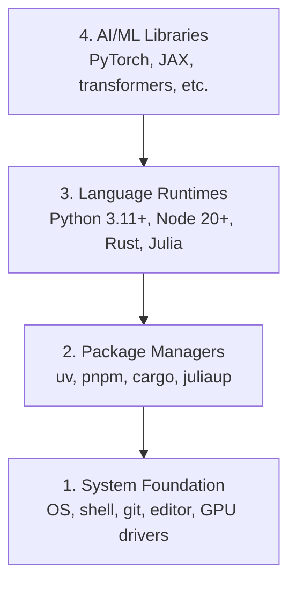

# 开发环境

> 工具塑造你的思维方式。一次性配置好，配置正确。

**Type:** Build
**Languages:** Python, Node.js, Rust
**Prerequisites:** 无
**Time:** 约 45 分钟

## 学习目标

- 从零开始安装 Python 3.11+、Node.js 20+ 和 Rust 工具链
- 配置虚拟环境和包管理器，实现可复现的构建
- 通过 CUDA/MPS 验证 GPU 可用性，并运行一次测试张量运算
- 理解四层架构：系统、包、运行时、AI 库

## 问题所在

你将通过 500+ 节课程学习 AI 工程，涉及 Python、TypeScript、Rust 和 Julia。如果你的环境有问题，每一节课都会变成与工具的斗争，而不是学习。

大多数人会跳过环境配置，然后花费数小时调试导入错误、版本冲突和缺失的 CUDA 驱动。我们要一次性把它做对。

## 概念

一个 AI 工程环境有四层：



我们自底向上安装。每一层都依赖其下的层。

```figure
s0-env-stack
```

## 动手构建

### 第 1 步：系统基础

检查你的系统并安装基础软件。

```bash
# macOS
xcode-select --install
brew install git curl wget

# Ubuntu/Debian
sudo apt update && sudo apt install -y build-essential git curl wget unzip

# Windows (use WSL2)
wsl --install -d Ubuntu-24.04
```

### 第 2 步：使用 uv 安装 Python

我们使用 `uv` —— 它比 pip 快 10-100 倍，并自动管理虚拟环境。

```bash
curl -LsSf https://astral.sh/uv/install.sh | sh

uv python install 3.12

uv venv
source .venv/bin/activate  # or .venv\Scripts\activate on Windows

uv pip install numpy matplotlib jupyter
```

验证：

```python
import sys
print(f"Python {sys.version}")

import numpy as np
print(f"NumPy {np.__version__}")
a = np.array([1, 2, 3])
print(f"Vector: {a}, dot product with itself: {np.dot(a, a)}")
```

### 第 3 步：使用 pnpm 安装 Node.js

用于 TypeScript 课程（智能体、MCP 服务器、Web 应用）。

```bash
curl -fsSL https://fnm.vercel.app/install | bash
fnm install 22
fnm use 22

npm install -g pnpm

node -e "console.log('Node', process.version)"
```

fnm 安装器会先检查 `unzip`。如果缺少该工具，就会提示 `Not installing fnm due to missing dependencies.` 并退出。Linux 上安装器需要它来解压 ZIP 文件；macOS 通常自带 `unzip`。Ubuntu、Debian 和 WSL2 用户可以运行第 1 步中的 apt 命令安装；如果跳过了那一步，请执行 `sudo apt install -y unzip`。

**macOS / Apple Silicon (M1/M2/M3/M4):** 如果安装器因 `Error: Cannot install under Rosetta 2 in ARM default prefix (/opt/homebrew)` 而中止，说明你的终端运行在 Rosetta 2 下（`arch` 输出 `i386`），而 Homebrew 是原生的 arm64 构建。以 arm64 方式强制安装 fnm，将其接入你的 shell，然后从 `fnm install 22` 开始重新执行上述命令：

```bash
arch -arm64 brew install fnm
echo 'eval "$(fnm env --use-on-cd)"' >> ~/.zshrc
source ~/.zshrc
```

### 第 4 步：Rust

用于性能关键型课程（推理、系统）。

```bash
curl --proto '=https' --tlsv1.2 -sSf https://sh.rustup.rs | sh

rustc --version
cargo --version
```

### 第 5 步：Julia（可选）

用于 Julia 擅长的数学密集型课程。

```bash
curl -fsSL https://install.julialang.org | sh

julia -e 'println("Julia ", VERSION)'
```

### 第 6 步：GPU 配置（如果你有 GPU）

**NVIDIA（Linux / Windows）：**

```bash
nvidia-smi

# Install PyTorch with CUDA
uv pip install torch torchvision torchaudio --index-url https://download.pytorch.org/whl/cu124
```

**macOS / Apple Silicon (M1/M2/M3/M4):** Mac 上没有 CUDA —— 这是正常情况，不是失败。请**不要**传入 `--index-url .../cuXXX`（那些 wheel 仅支持 Linux/Windows，否则安装会失败）。安装普通版本，其中包含 Apple 的 MPS（Metal）GPU 后端：

```bash
uv pip install torch torchvision torchaudio
```

验证（在任何平台上都可用）：

```python
import torch
print(f"CUDA available: {torch.cuda.is_available()}")           # False on macOS — expected
print(f"MPS available:  {torch.backends.mps.is_available()}")   # True on Apple Silicon
if torch.cuda.is_available():
    print(f"GPU: {torch.cuda.get_device_name(0)}")
```

没有 GPU？没关系。大多数课程都可以在 CPU 上运行。对于训练密集型课程，请使用 Google Colab 或云 GPU。

### 第 7 步：验证你想开始的路线

从仓库根目录——即包含 `README.md` 和 `phases/` 的目录——运行本课程中的每一条命令。预检查只检查启动所选路线所需的内容。它默认跳过后续的工具，这样新手看到的是一个清晰的答案，而不是一屏幕的警告。

启动完整的初学者序列：

```bash
python3 phases/00-setup-and-tooling/01-dev-environment/code/verify.py --route beginner
```

或者只检查你想走的路线：

```bash
python3 phases/00-setup-and-tooling/01-dev-environment/code/verify.py --route ml-foundations
python3 phases/00-setup-and-tooling/01-dev-environment/code/verify.py --route llm-engineering
python3 phases/00-setup-and-tooling/01-dev-environment/code/verify.py --route agents
python3 phases/00-setup-and-tooling/01-dev-environment/code/verify.py --route mcp
python3 phases/00-setup-and-tooling/01-dev-environment/code/verify.py --route agent-skills
python3 phases/00-setup-and-tooling/01-dev-environment/code/verify.py --route certification
```

当你希望同样的预检查也检查后续课程使用的可选工具和依赖时，加上 `--show-later`。缺失的后续工具永远不会阻塞所选路线。

每一项失败的必需检查都会包含检测到的路径或导入错误，以及一条确切的纠正命令。Agent Skills 和认证路线还会显示手动的主机检查，因为 Python 脚本无法证明 AI 主机已经发现某个技能，也无法证明你所选的技能作用域可写。

当初学者预检查通过时，它会打印出确切的第一个可运行课程：

```text
Ready to start Beginner course.
Next: python3 phases/01-math-foundations/01-linear-algebra-intuition/code/vectors.py
```

## 使用它

你的环境已准备好开始你所验证的路线。等到某节课需要时再安装后续工具，而不是让第一节课被整套技术栈阻塞。以下是整个课程体系中你将用到的内容：

| 语言 | 使用范围 | 包管理器 |
|----------|---------|-----------------|
| Python | 阶段 1-12（ML、DL、NLP、视觉、音频、LLM） | uv |
| TypeScript | 阶段 13-17（工具、智能体、群体、基础设施） | pnpm |
| Rust | 阶段 12、15-17（性能关键型系统） | cargo |
| Julia | 阶段 1（数学基础） | Pkg |

## 交付

本课程会生成一个验证脚本，任何人都可以运行它来检查自己的环境配置。

参见 `outputs/prompt-env-check.md`，其中包含一个帮助 AI 助手诊断环境问题的提示词。

## 练习

1. 运行验证脚本并修复所有失败项
2. 为本课程创建一个 Python 虚拟环境并安装 PyTorch
3. 用全部四种语言编写 "hello world" 并逐一运行