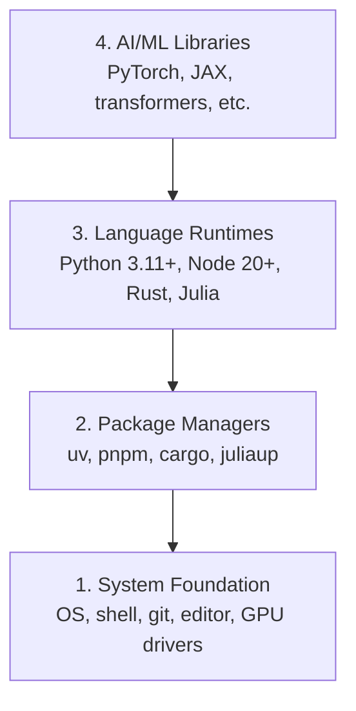

# 开发环境

> 工具塑造你的思考方式。一次配置，就把它配好。

**Type:** Build
**Languages:** Python, Node.js, Rust
**Prerequisites:** 无
**Time:** ~45 分钟

## 学习目标

- 从零搭建 Python 3.11+、Node.js 20+ 和 Rust 工具链（toolchain）
- 配置虚拟环境（virtual environment）和包管理器（package manager），实现可复现构建
- 验证 CUDA/MPS 的 GPU 访问能力，并运行一次张量运算测试
- 理解由系统、软件包、语言运行时（runtime）和 AI 库组成的四层技术栈

## 要解决的问题

你即将使用 Python、TypeScript、Rust 和 Julia，通过 500+ 节课学习 AI 工程。如果环境出了问题，每一课都会变成与工具的较量，无法专心学习。

大多数人会跳过环境配置，随后却花上数小时排查导入错误、版本冲突和 CUDA 驱动缺失等问题。我们要一次把这件事做好。

## 核心概念

AI 工程环境分为四层：


```mermaid
graph TD
    A["4. AI/ML Libraries\nPyTorch, JAX, transformers, etc."] --> B["3. Language Runtimes\nPython 3.11+, Node 20+, Rust, Julia"]
    B --> C["2. Package Managers\nuv, pnpm, cargo, juliaup"]
    C --> D["1. System Foundation\nOS, shell, git, editor, GPU drivers"]
```

我们从底层往上安装。每一层都依赖其下一层。

```figure
s0-env-stack
```

## 动手实现

### 第 1 步：系统基础

检查系统，安装基础工具。

```bash
# macOS
xcode-select --install
brew install git curl wget

# Ubuntu/Debian
sudo apt update && sudo apt install -y build-essential git curl wget unzip

# Windows (use WSL2)
wsl --install -d Ubuntu-24.04
```

### 第 2 步：使用 uv 配置 Python

我们使用 `uv`：它比 pip 快 10-100x，还会自动管理虚拟环境。

```bash
curl -LsSf https://astral.sh/uv/install.sh | sh

uv python install 3.12

uv venv
source .venv/bin/activate  # or .venv\Scripts\activate on Windows

uv pip install numpy matplotlib jupyter
```

验证：

```python
import sys
print(f"Python {sys.version}")

import numpy as np
print(f"NumPy {np.__version__}")
a = np.array([1, 2, 3])
print(f"Vector: {a}, dot product with itself: {np.dot(a, a)}")
```

### 第 3 步：使用 pnpm 配置 Node.js

用于 TypeScript 课程，内容包括智能体（agent）、MCP 服务器和 Web 应用。

```bash
curl -fsSL https://fnm.vercel.app/install | bash
fnm install 22
fnm use 22

npm install -g pnpm

node -e "console.log('Node', process.version)"
```

fnm 安装程序会先检查 `unzip`，如果未找到，就会显示 `Not installing fnm due to missing dependencies.` 并退出：在 Linux 上，它通过解压 zip 归档安装；在 macOS 上，则通过 Homebrew 安装。macOS 自带 `unzip`；Ubuntu、Debian 和 WSL2 会通过第 1 步的 apt 命令安装它（如果跳过了该步骤，请运行 `sudo apt install -y unzip`）。

**macOS / Apple Silicon（M1/M2/M3/M4）：** 如果安装程序显示 `Error: Cannot install under Rosetta 2 in ARM default prefix (/opt/homebrew)` 后停止，说明你的终端运行在 Rosetta 2 下（`arch` 的输出为 `i386`），而 Homebrew 是原生 arm64 版本。强制使用 arm64 安装 fnm，将它配置到 Shell（命令解释器）中，然后从 `fnm install 22` 开始重新运行上面的命令：

```bash
arch -arm64 brew install fnm
echo 'eval "$(fnm env --use-on-cd)"' >> ~/.zshrc
source ~/.zshrc
```

### 第 4 步：Rust

用于对性能要求较高的课程（推理、系统）。

```bash
curl --proto '=https' --tlsv1.2 -sSf https://sh.rustup.rs | sh

rustc --version
cargo --version
```

### 第 5 步：Julia（可选）

用于数学内容较多的课程，这正是 Julia 的强项。

```bash
curl -fsSL https://install.julialang.org | sh

julia -e 'println("Julia ", VERSION)'
```

### 第 6 步：配置 GPU（如果有）

**NVIDIA（Linux / Windows）：**

```bash
nvidia-smi

# Install PyTorch with CUDA
uv pip install torch torchvision torchaudio --index-url https://download.pytorch.org/whl/cu124
```

**macOS / Apple Silicon（M1/M2/M3/M4）：** Mac 上没有 CUDA，这是预期情况，并非故障。**不要**传入 `--index-url .../cuXXX`（这些 wheel 安装包仅适用于 Linux/Windows，因此安装会失败）。安装常规版本即可，其中包含 Apple 的 MPS（Metal）GPU 后端：

```bash
uv pip install torch torchvision torchaudio
```

验证（适用于所有平台）：

```python
import torch
print(f"CUDA available: {torch.cuda.is_available()}")           # False on macOS — expected
print(f"MPS available:  {torch.backends.mps.is_available()}")   # True on Apple Silicon
if torch.cuda.is_available():
    print(f"GPU: {torch.cuda.get_device_name(0)}")
```

没有 GPU？没关系。大多数课程可以在 CPU 上运行。对于训练负载较大的课程，可以使用 Google Colab 或云端 GPU。

### 第 7 步：验证你想开始的学习路线

本课的所有命令都应在仓库根目录运行，也就是包含 `README.md` 和 `phases/` 的目录。
环境预检（preflight）只检查开始所选学习路线所需的条件。
默认情况下，它会跳过后续课程才需要的工具，让初学者得到一个明确的结论，而不是看到满屏警告。

开始完整的初学者学习序列：

```bash
python3 phases/00-setup-and-tooling/01-dev-environment/code/verify.py --route beginner
```

或者只检查你想学习的路线：

```bash
python3 phases/00-setup-and-tooling/01-dev-environment/code/verify.py --route ml-foundations
python3 phases/00-setup-and-tooling/01-dev-environment/code/verify.py --route llm-engineering
python3 phases/00-setup-and-tooling/01-dev-environment/code/verify.py --route agents
python3 phases/00-setup-and-tooling/01-dev-environment/code/verify.py --route mcp
python3 phases/00-setup-and-tooling/01-dev-environment/code/verify.py --route agent-skills
python3 phases/00-setup-and-tooling/01-dev-environment/code/verify.py --route certification
```

如果希望同一次预检也检查可选工具以及后续课程使用的依赖项（dependency），请添加 `--show-later`。
后续课程所需工具的缺失不会阻止你开始所选路线。

每项未通过的必需检查都会列出检测到的路径或导入错误，并给出可直接执行的修正命令。
Agent Skills 和认证路线还会列出需要手动检查的宿主环境事项，因为 Python 脚本无法证明 AI 宿主
已经发现某项技能，也无法确认你选定的技能安装范围是否可写。

初学者路线的预检通过后，会输出第一节可运行课程的具体命令：

```text
Ready to start Beginner course.
Next: python3 phases/01-math-foundations/01-linear-algebra-intuition/code/vectors.py
```

## 实际使用

环境已准备就绪，可以开始你刚检查过的学习路线。
等课程要求时再安装后续工具，不必为了配齐整个技术栈而耽误第一课。
下面列出了整个课程中会使用的语言和工具：

| 语言 | 使用范围 | 包管理器 |
|----------|---------|-----------------|
| Python | 阶段 1-12，涵盖机器学习（ML）、深度学习（DL）、自然语言处理（NLP）、计算机视觉、音频和大语言模型（LLMs） | uv |
| TypeScript | 阶段 13-17（工具、智能体、智能体群、基础设施） | pnpm |
| Rust | 阶段 12、15-17（性能关键型系统） | cargo |
| Julia | 阶段 1（数学基础） | Pkg |

## 交付成果

本课的产出是一个验证脚本，任何人都可以运行它来检查自己的环境配置。

`outputs/prompt-env-check.md` 中提供了一段提示词（prompt），可帮助 AI 助手诊断环境问题。

## 练习

1. 运行验证脚本，修复所有未通过的检查项
2. 为本课程创建一个 Python 虚拟环境，并安装 PyTorch
3. 用全部四种语言各写一个“hello world”程序，并分别运行
