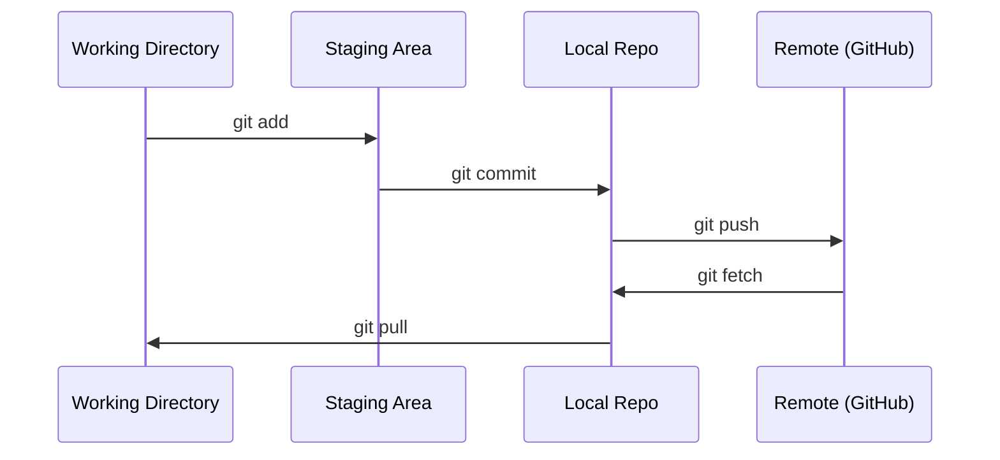

# Git 与协作

> 版本控制不是可选项。你在这里构建的每一个实验、每一个模型、每一课都会被追踪。

**Type:** Learn
**Languages:** --
**Prerequisites:** Phase 0, Lesson 01
**Time:** ~30 分钟

## 学习目标

- 配置 git 身份，掌握 add、commit、push 的日常工作流程
- 创建并合并分支，在不破坏 main 的情况下进行隔离实验
- 编写一个 `.gitignore`，排除模型检查点和大体积二进制文件
- 使用 `git log` 浏览提交历史，理解项目的演进过程

## 问题所在

你将在 20 个阶段中编写数百个代码文件。没有版本控制，你会丢失工作成果、破坏无法撤销的东西，并且无法与他人协作。

Git 是工具，GitHub 是代码存放的地方。本课只讲这门课所需的内容，不涉及更多。

## 核心概念



记住三件事：
1. 经常保存（`git commit`）
2. 推送到远程（`git push`）
3. 用分支做实验（`git checkout -b experiment`）

```figure
s0-commit-dag
```

## 动手构建

### 第 1 步：配置 git

```bash
git config --global user.name "Your Name"
git config --global user.email "you@example.com"
```

### 第 2 步：日常工作流程

```bash
git status
git add file.py
git commit -m "Add perceptron implementation"
git push origin main
```

### 第 3 步：用分支做实验

```bash
git checkout -b experiment/new-optimizer

# ... make changes, commit ...

git checkout main
git merge experiment/new-optimizer
```

### 第 4 步：使用本课程仓库

你不能直接向课程仓库推送——只有维护者才有写权限。先在 GitHub 上 fork 它（右上角的 Fork 按钮），这样 `origin` 就指向你自己的副本：

```bash
git clone https://github.com/YOUR-USERNAME/ai-engineering-from-scratch.git
cd ai-engineering-from-scratch

git checkout -b my-progress
# work through lessons, commit your code
git push origin my-progress
```

## 实际使用

对于这门课，你只需要这几个命令：

| 命令 | 用途 |
|---------|------|
| `git clone` | 获取课程仓库 |
| `git add` + `git commit` | 保存你的工作 |
| `git push` | 备份到 GitHub |
| `git checkout -b` | 在不破坏 main 的情况下尝试新东西 |
| `git log --oneline` | 查看你做过什么 |

就这样。这门课不需要 rebase、cherry-pick 或 submodules。

## 练习

1. Fork 这个仓库，克隆你的 fork，创建一个名为 `my-progress` 的分支，新建一个文件，提交它，然后推送
2. 创建一个 `.gitignore`，排除模型检查点文件（`.pt`、`.pth`、`.safetensors`）
3. 用 `git log --oneline` 查看这个仓库的提交历史，了解各课是如何添加的

## 关键术语

| 术语 | 人们怎么说 | 实际含义 |
|------|----------------|----------------------|
| Commit | "保存" | 你的整个项目在某一时间点的快照 |
| Branch | "一份副本" | 一个指向某个提交的指针，随你的工作向前移动 |
| Merge | "合并代码" | 将一个分支的更改应用到另一个分支 |
| Remote | "云端" | 你的仓库托管在其他地方的副本（GitHub、GitLab） |